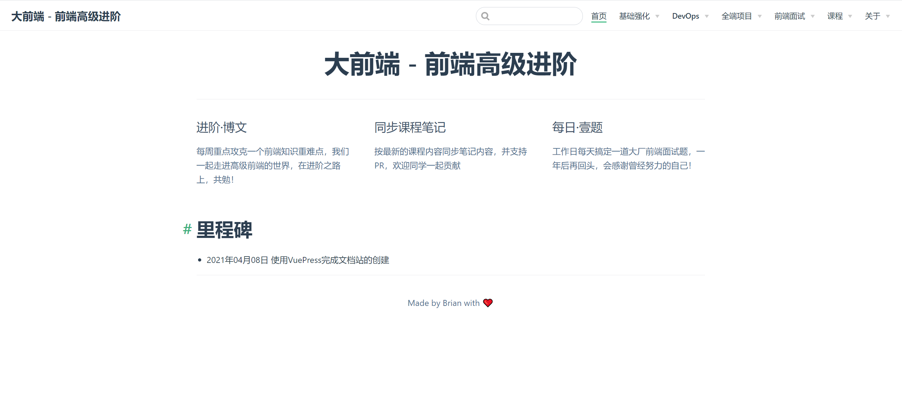
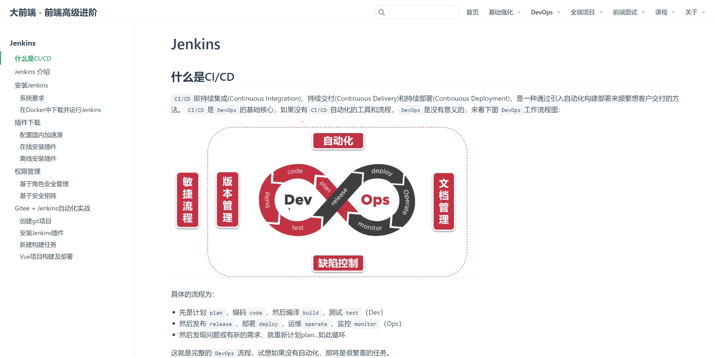

# 前端笔记
```
- 基础强化
  - 环境搭建
  	- Vue
  	- Node.js
  	- 调试技巧
  	- Docker
  - 语言基础
  	- TypeScript
  	- Dart
  - 数据库
  	- NoSQL
  	- MongoDB
  	- Redis

- DevOps
  - 效率工具
  	- Jenkins
  - 团队协同
  	- gitlab
  	- showdoc
  	- DOClever
  - 容器化
  	- Docker进阶
  	- Kubernetes

- 全端项目
  - 社区项目
  	- 社区PC
  	- 管理后台
  	- WebApp
  - 多平台+跨端
  	- 社区小程序
  	- Flutter 2.0
  	- Electron桌面端
  - React世界
  	- React

- 前端面试
  - 笔试
  	- 分类笔试题
  	- 笔试技巧
  - 面试技巧
  	- 技术面
  	- 项目面
  	- BOSS面
  	- HR面
  - 简历
  	- 写好简历
  	- 简历模板
  - 公司行业
  	- 选择公司
  	- 行业洞悉

- 课程
  - 大前端课程
  - 快速了解新版Vue3.0+Vite开发
  - 三小时速成Vue2.x核心技术
```

## 快速上手

以下指南将会帮助你从零开始本地构建大前端电子书开源项目。

### 上手准备

你需要在本地安装[Node.js](https://nodejs.org/en/)（版本 >= 8.9）和[git](https://git-scm.com/)，本项目基于 [VuePress](https://vuepress.vuejs.org/zh/)，内容创作基于[Markdown](http://markdown.p2hp.com/index.html)，提前了解相关知识能对你构建本项目有很大的帮助。

### 安装

```sh
# 克隆项目到本地
$ git clone https://github.com/toimc-team/front-end-notes.git
# 进入项目目录
$ cd front-end-notes
# 安装项目依赖
$ npm install
# 可以通过如下操作解决 npm 下载速度慢的问题
$ npm install --registry=https://registry.npm.taobao.org
```

### 运行

```sh
# 运行项目
$ npm run dev
```

等待服务启动完成，打开浏览器，访问本地的`localhost:8080`，即可访问本项目。

项目展示：





## 目录结构

```
.
├── .eslintignore
├── .eslintrc.js
├── .github
│   └── workflows      // github actions
│       ├── master.yml // 同步gitee pages
│       └── sync.yml   // 同步gitee
├── .gitignore
├── .prettierignore
├── .prettierrc.json
├── LICENSE            // 开源协议
├── README.md
├── deploy.sh          // 本地部署脚本
├── package-lock.json
├── package.json
└── src
    ├── .vuepress      // vuepress框架配置
    │   ├── config.js  // 导航、侧栏配置
    │   ├── enhanceApp.js
    │   └── styles     // 全局样式
    │   └── theme     // 主题
    │   └── utils     // 工具类
    ├── about          // 关于页面
    ├── index.md       // 首页
    ├── interview      // 面试技巧
    ├── project        // 全端项目
    └── basic          // 基础强化
    └── course         // 课程
    └── devops         // DevOps
```

