# CSS选择器以及优先级

## 一、CSS1选择器 
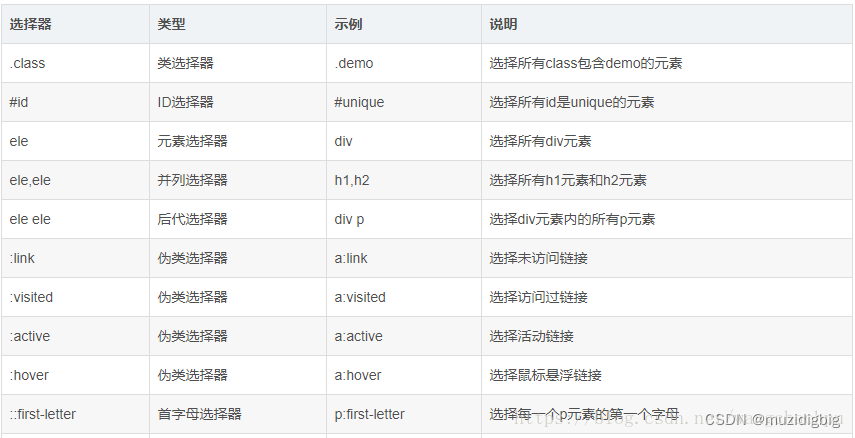
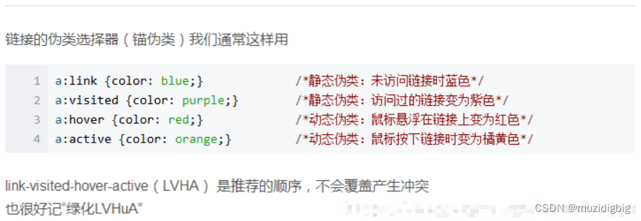

## 二、CSS2选择器
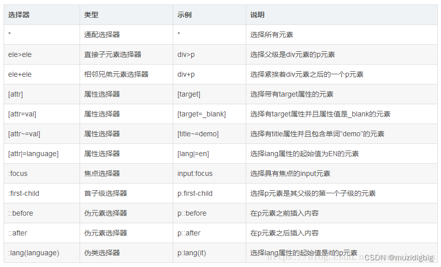
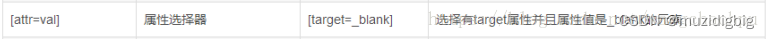
```html
例如：
 
  [title=demo]{
 
    background: yellow;
 
    } 
 
<p title="demo">p1</p>  //有效
 
<p title="demo demo11">p2</p>  //无效，title多了demo11这个值，若换成注2中的方法就可以
```
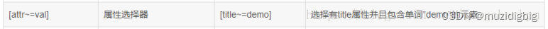
```html
[title ~= demo]{
 
background: yellow;
 
}
 
<p title="demo demo1">p1</p>  //有效
 
<p title="demo22">p2</p> //无效，[title ~= demo]是说title属性包含demo这个词，属性值之间用空格分隔的单词,demo22就不是demo这个词了，尽管包含demo，所以上面表格中说的包含单词demo需要理解清楚。
```
## 三、CSS3选择器
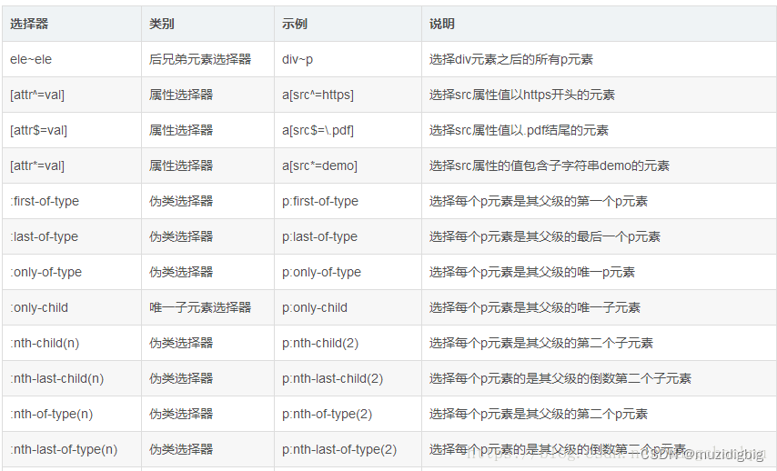
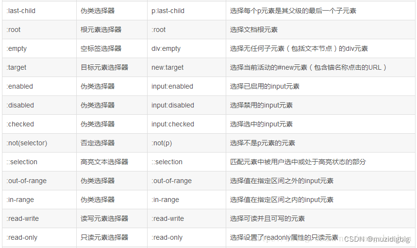
E:nth-child(n)         选择E元素的父元素第n个子元素，该元素必须是E类型元素（从前往后数）。

E:nth-last-child(n)         选择E元素的父元素第n个子元素（从后往前数）。

E:nth-last-child(n)         选择E元素的父元素第n个子元素（从后往前数）。

E:nth-of-type(n)         选择E元素的父元素第n个E类型子元素（从前往后数）。
                                  nth-of-type(n+1) 大于1  

E:nth-last-of-type(n)         选择E元素的父元素第n个E类型子元素（从后往前数）。

:root (注意：前面没有选择器)         选择文档的根元素。一般是html

E:not(selector)         选择selector指定外的E元素。 

注1：first-child 和 first-of-type

CSS2选择器中有个：first-child
```html
div:first-child{ outline: 0px; margin: 0px; padding: 0px; overflow-wrap: break-word; color: rgb(0, 153, 0);"> red; }//无效，因为<div>1</div>并不是body元素的第一个子元素
<body>
    <p>0</p>
    <div>1</div>
    <div>2</div>
    <div>3</div>
</body>
```
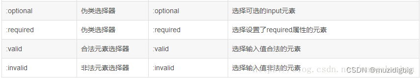
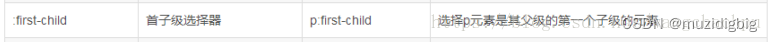
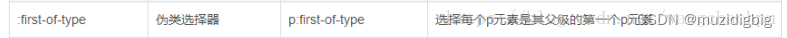
```html
<body>
    <div>1</div>
    <div>2</div>
    <div>3</div>
    <p>4</p>
</body>
 
p:only-child { //无效，p不是body的唯一子p元素
    background: red;
}
 
p:only-of-type{//有效，p是body的唯一一个p子元素
    background: red;
}
```
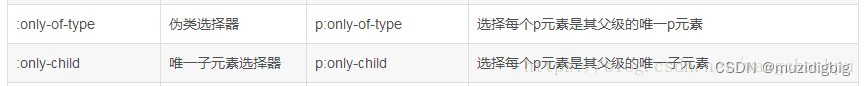
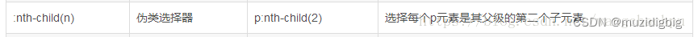
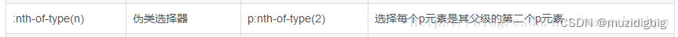
```html
<body>
    <div>1</div>
    <div>2</div>
    <div>3</div>
    <p>4</p>
</body>
 
p:only-child { //无效，p不是body的唯一子p元素
    background: red;
}
 
p:only-of-type{//有效，p是body的唯一一个p子元素
    background: red;
}
```
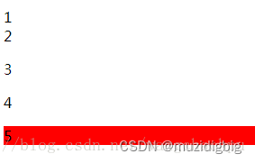
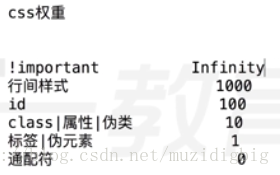

## css选择器优先级顺序

>不同级别

> 在属性后面使用 !important 会覆盖页面内任何位置定义的元素样式。

- 作为style属性写在元素内的样式（优先级1000）

- id选择器（优先级100）

- 类选择器、伪类选择器（优先级10）

- 元素选择器（优先级1）

- 通配符选择器（优先级0）

- 浏览器自定义或继承（没有优先级）

> 总结排序：!important > 行内样式 > ID选择器 > 类选择器、伪类选择器 > 元素选择器 > 通配符选择器 > 继承 > 浏览器默认属性
