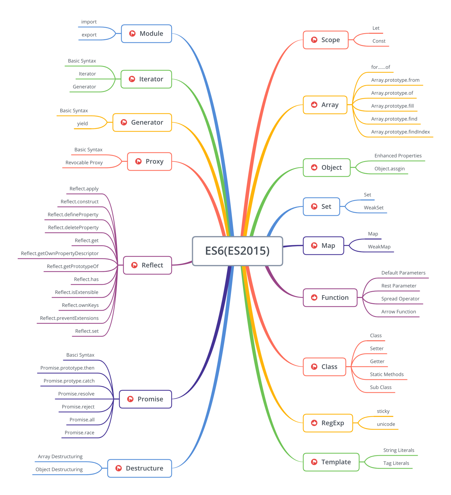
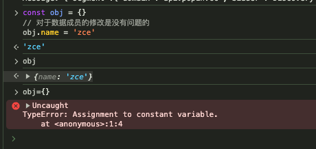
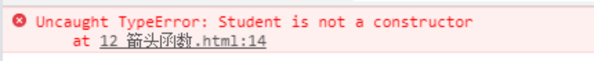
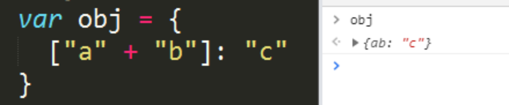
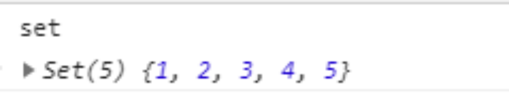
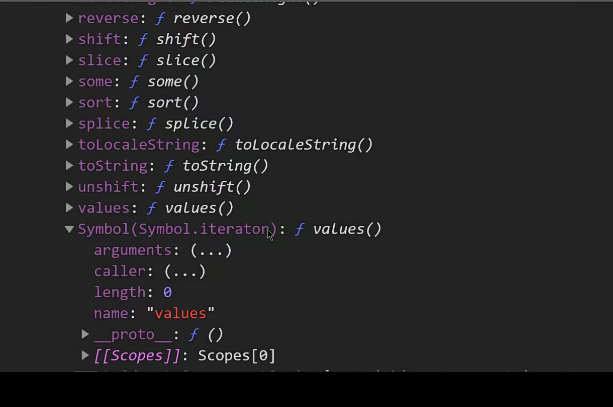

# ES2015
[ES2015](http://www.ecma-international.org/ecma-262/6.0/)


:::tip
- 解决原有语法上的一些问题或者不足，那例如像let和const所提供的。块级作用域。
- 对原有语法进行增强，使之变得更为便捷易用。例如，像解构展开还有参数默认值模板字符串等等。
- 就是全新的对象，全新的方法，还有全新的功能。例如，像promise还有proxy以及像object的assign的方法之类。- 全新的数据类型和数据结构，例如像symbol，还有set和map等等。
:::

## let 和 const
### let 与块级作⽤域
>  之前作用域： 函数作用域 全局作用域 
- 声明的成员只会在所声明的块中生效
```js
if (true) {
  // var foo = 'zce'
  let foo = 'zce'
  console.log(foo)
}
```
- let 在 for 循环中的表现
```js
for (var i = 0; i < 3; i++) {
  for (var i = 0; i < 3; i++) {
    console.log(i)
  }
  console.log('内层结束 i = ' + i)
}

for (var i = 0; i < 3; i++) {
  for (let i = 0; i < 3; i++) {
    console.log(i)
  }
  console.log('内层结束 i = ' + i)
}
```
- 循环绑定事件，事件处理函数中获取正确索引
```js
var elements = [{}, {}, {}]
for (var i = 0; i < elements.length; i++) {
  elements[i].onclick = function () {
    console.log(i)
  }
}
elements[2].onclick()//3

var elements = [{}, {}, {}]
for (var i = 0; i < elements.length; i++) {
  elements[i].onclick = (function (i) {
    return function () {
      console.log(i)
    }
  })(i)
}
elements[0].onclick() // 0 产生了闭包

var elements = [{}, {}, {}]
for (let i = 0; i < elements.length; i++) {
  elements[i].onclick = function () {
    console.log(i)
  }
}
elements[0].onclick()//0
```
- for 循环会产生两层作用域
```js
for (let i = 0; i < 3; i++) {
    let i = 'foo'
    console.log(i)//foo
  }
```
- let 修复了变量声明提升现象 
```js

console.log(foo) // undefined
var foo = 'zce'

console.log(foo) // 报错
let foo = 'zce'
```
### const

> 只读的常量/恒量

- 恒量声明过后不允许重新赋值
```js
const name = 'zce'
// 恒量声明过后不允许重新赋值
name = 'jack'

```
- 恒量要求声明同时赋值
```js
// 恒量要求声明同时赋值
const name
name = 'zce'
```
- 恒量只是要求内层指向不允许被修改
```js
// 恒量只是要求内层指向不允许被修改
const obj = {}
// 对于数据成员的修改是没有问题的
obj.name = 'zce'

obj = {}
```


## ES5中数组遍历有多少方法 
###  for 循环
```js
// for 循环
//
const arr = [1, 2, 3, 4, 5]
for (let i = 0; i < arr.length; i++) {
  if (arr[i] === 2) {
    continue
  }
  // console.log(arr[i])
}
```
### forEach
```js
// forEach
arr.forEach(function (item) {
  if (item === 2) {
    // continue
  }
  // console.log(item)
})
```
### every
```js
// every
arr.every(function (item) {
  if (item === 2) {

  } else {
    // console.log(item)
  }
  return true
})
```
### for in
```js
// for in
// arr.a = 8
for (let index in arr) {
  if (index * 1 === 2) {
    continue
  }
  console.log(index, arr[index])
}
const Price = {
  A: [1.5, 2.3, 4.5],
  B: [3, 4, 5],
  C: [0.5, 0.8, 1.2]
}

for (let key in Price) {
  // console.log(key, Price[key])
}
```
### for of
```js
// for of
for (let item of arr) {
  // console.log(item)
}
```
## 转换数组
### [].slice.call
```js
// let args = [].slice.call(arguments) // collection
// let imgs = [].slice.call(document.querySelectorAll('img')) // NodeList
// console.log(args)
```
### Array.from
```js
// let args = Array.from(arguments)
// let imgs = Array.from(document.querySelectorAll('img'))
// imgs.forEach()
// Array.from(arrayLike,mapFn,thisArg)
// let array = Array(5)
// for (let i = 0, len = array.length; i < len; i++) {
//   array[i] = 1
// }
// console.log(array)
// let array = Array.from({ length: 5 }, function () { return 1 })
// console.log(array)
// {0:'a',1:'b',length:2}
```

## 生成新数组
### Array
```js
// let array = Array(5)
// let array = []
```
### Array.of
```js
// let array = Array.of(1)
// console.log(array)
```
### Array.fill
```js
// let array = Array(5).fill(7)
// console.log(array)
// Array.fill(value,start,end)
let array = [1, 2, 3, 4, 5]
// console.log(array.fill(8, 2, 4))
// let find = array.filter(function (item) {
//   return item % 2 === 0
// })
// console.log(find)
// Array.prototype.find
let find = array.findIndex(function (item) {
  return item % 2 === 0
})
console.log(find)
// Array.prototype.findIndex
```
## 数组的解构
```js
// 数组的解构

const arr = [100, 200, 300]

// const foo = arr[0]
// const bar = arr[1]
// const baz = arr[2]
// console.log(foo, bar, baz)

// const [foo, bar, baz] = arr
// console.log(foo, bar, baz)

// const [, , baz] = arr
// console.log(baz)

// const [foo, ...rest] = arr
// console.log(rest)

// const [foo, bar, baz, more] = arr
// console.log(more)// undefined

// const [foo, bar, baz = 123, more = 'default value'] = arr
// console.log(bar, more)

const path = '/foo/bar/baz'
// const tmp = path.split('/')
// const rootdir = tmp[1]

const [, rootdir] = path.split('/')
console.log(rootdir)
```
## 对象的解构
```js
// 对象的解构

const obj = { name: 'zce', age: 18 }

// const { name } = obj
// console.log(name)

// const name = 'tom'
// const { name: objName } = obj
// console.log(objName)

// const name = 'tom'
// const { name: objName = 'jack' } = obj
// console.log(objName)

const { log } = console
log('foo')
log('bar')
log('123')
```
## 字符串方法
### Template literals（模板字⾯量）

```js
// 模板字符串

// 反引号包裹
// const str = `hello es2015, this is a string`

// 允许换行
// const str = `hello es2015,

// this is a \`string\``

// console.log(str)

const name = 'tom'
// 可以通过 ${} 插入表达式，表达式的执行结果将会输出到对应位置
const msg = `hey, ${name} --- ${1 + 2} ---- ${Math.random()}`
console.log(msg)
```
### startsWith
:::tip
startsWith(str, pos); 该方法用于判定字符串是否是以另外一个字符串开头
        str: 开头字符串
        pos: 偏移位置
:::
```js
// startsWith
// 定义一个新的字符串
let str = "今天天气很冷";
// 判断str是否是以"今天"开头
let result = str.startsWith("今天");
// console.log(result);
// 判断"天天气是否以‘今天’开头"
let result1 = str.startsWith("今天", 1);
```
```js
String.prototype.startsWith = function(str, pos) {
	var pos = pos || 0;
	// 获取新字符串 
	var newStr = this.slice(pos);
	return newStr.indexOf(str) === 0 ? true : false;
}
```
### endsWith
:::tip
endsWith(str, pos); 该方法用于判定字符串是否是以另外一个字符串结尾
      str: 结尾字符串
      pos: 偏移位置 
注：
该值是slice的第二个参数 默认从头开始截取 
如果不传递该参数，该参数默认是调用endsWith方法的字符串的长度
:::

```js
// 定义一个新的字符串
let str = "今天天气很冷";
// 调用endsWith方法
let result = str.endsWith("天天", 3);
console.log(result);
```
```js
// 重写该方法
String.prototype.endsWith = function(str, pos) {
	// 判定pos是否有值
	// 如果有值，则偏移 应该从头开始截取到该位置 不包含该位置的字符
	// 如果没有值 则使用字符串的长度
	var pos = pos || this.length;
	// 截取新的字符串
	var newStr = this.slice(0, pos);
	// 定义正则表达式
	var reg = new RegExp(str + "$", "g");
	// 判定
	return reg.test(newStr);
}
```
### includes
:::tip
includes(str, pos); 该方法用于判定字符串中是否包含另外一个字符串
    str: 被包含的字符串
    pos: 偏移量
返回值：布尔值 true表示包含 false表示不包含
:::
```js
// includes方法用于判定一个字符串是否包含另外一个字符串
let str = "今天天气很冷";
// 调用includes方法
let result = str.includes("天气", 3);
console.log(result);
```
```js
String.prototype.includes = function(str, pos) {
	// 匹配pos
	var pos = pos || 0;
	// 获取字符串
	var newStr = this.slice(pos);
	// 判定newStr中是否具备str
	return newStr.indexOf(str) === -1 ? false : true;
}
```
###  repeat
> 该方法用于将字符串重复多少次 一个参数是重复次数
```js
// 定义一个字符
let str = '灬';
//  重复100次
let newStr = str.repeat(100);
console.log(newStr, newStr.length)
```
```js
// 还原
String.prototype.repeat = function(num) {
	// 定义一个字符串
	var str = "";
	// 循环num次
	for (var i = 0; i < num; i++) {
		str += this;
	}
	return str;
}
```
## 数组方法
> ES6对数组进行了更多的方法的扩展。方法有两种：第一种，静态方法，也就是类的方法。第二种，普通方法，也就是类的实例的方法。
### Array.of
:::tip
该方法用于定义数组。
目前已有的定义数组的方法：
字面量： []
构造函数：new Array()
构造函数定义数组有一个问题：当参数是数字，并且只有一个参数时，会表示数组的长度。当参数有多个时，每一个参数都是数组的成员。
:::
```js
// 问题：当一个参数时，到底代表长度还是代表成员。
var arr3 = Array(4);  // 将参数当做新数组的长度
var arr4 = Array(4, 5);

// 解决：通过Array.of
var arr5 = Array.of(4);  // 将参数当做新数组的成员
var arr6 = Array.of(4, 5);
```
```js
// 还原
Array.of = function() {
	return [].slice.call(arguments);
}
```
### Array.from
:::tip
该方法的作用就是将类数组对象转为数组。
  类数组对象： 具备数字下标、具备length属性、又不是数组。这样的对象我们统一称之为类数组对象。
:::
```js
// 获取lis
var $lis = $("li");
// 获取lis
var lis = document.getElementsByTagName("li");

// 转为数组 通过Array.from
var arr = Array.from($lis);
var arr1 = Array.from(lis);
```
```js
// 还原
Array.from = function(likeArray) {
	return [].slice.call(likeArray);
}
```
### find
:::tip
arr.find(handler) 该方法用于查询数组中某项
  handler: 函数  该函数返回一个布尔值 符合该函数的成员会被返回 一旦查询到 就会停止查询
:::
```js
// find方法 该方法接收一个函数作为参数函数要返回一个布尔值 当该值为true时 返回成员。
var arr = ["张三", "李四", "王五", "赵六", "田七", "郭七"];
// 寻找arr数组中 带有“七”这个字的成员
var arr1 = arr.filter(function(value, index) {
	return value.includes("七");
})
// find方法
var value = arr.find(function(value, index) {
	return value.includes("七");
})
```
```js
// 还原：
Array.prototype.find = function(handler) {
	// 循环执行
	for (var i = 0; i < this.length; i++) {
		// 判定 
		if (handler(this[i], i, this)) {
			// 如果是真 就返回当前成员
			return this[i];
		}
		// 否则继续循环
	}
}
```
### findIndex
:::tip
arr.findIndex(handler) 该方法用于查询数组中某项的索引
  handler: 函数  该函数返回一个布尔值 符合该函数的成员的索引会被返回 一旦查询到 就会停止查询
:::
```js
// findIndex方法 该方法接收一个函数作为参数函数要返回一个布尔值 当该值为true时 返回成员的索引。
var arr = ["张三", "李四", "王五", "赵六", "田七", "郭七"];

// find方法
var value = arr.findIndex(function(value, index) {
	console.log(value, arguments)
	return value.includes("七");
})
```
```js
// 还原：
Array.prototype.find = function(handler) {
	// 循环执行
	for (var i = 0; i < this.length; i++) {
		// 判定 
		if (handler(this[i], i, this)) {
			// 如果是真 就返回当前成员
			return i;
		}
		// 否则继续循环
	}
}
```
### copyWithin
:::tip
arr.copyWithin(pos, start, end) 该方法用于数组的内部复制
    pos: 覆盖的开始位置
    start: 复制的开始位置 (包含)
    end: 复制的结束位置 (不包含)
    3个值都是下标。
返回值：原数组
:::
```js
// copyWithin()方法  作用：数组的内部复制 会改变原数组
var arr = [1, 2, 3, 4, 5, 6, 7, 8, 9, 10];
var arr1 = arr.copyWithin(0, 5, 7);
```
```js
// 还原
Array.prototype.copyWithin = function(pos, start, end) {
	// 复制start到end的数组
	var newArr = this.slice(start, end);
	// 保存原来的length
	var length = this.length;
	// 循环
	for (var i = 0; i < newArr.length; i++) {
		this[pos + i] = newArr[i];
	}
	// 设置length属性
	this.length = length;
	// 返回原数组
	return this;
}
```
```js
// 还原
Array.prototype.copyWithin = function(pos, start, end) {
	// 复制start到end的数组
	var newArr = this.slice(start, end);
	// 保存原来的length
	var length = this.length;
	// 从pos位置开始删除原数组的项 删newArr.length项
	// 因为newArr是一个数组，而我们数组现阶段是拆分不开的。所以我们只能够使用数组，那么一个方法与数组，联想到apply方法。
	// 第一个参数是this，因为splice就是在操作原来的数组所以this传递在第一位。
	// 第二个参数是数组，数组的每一项表示splice所需要的参数 
	// apply的第二个参数是一个数组 数组的第一项表示删除的位置 也就是pos
	// apply的第二个参数是一个数组 数组的第二项表示删除几个 也就是newArr.length
	// 后续的每一个都是要添加的项 就是newArr中的每一项 所以凑出来的数组第一项应该是pos 第二项是newArr.length 剩余的项都在newArry中。
	// [pos, newArr.length] 得到一个数组 该数组与newArr拼接就组成最终的参数数组。
	// 所以代码是 [pos, newArr.length].concat(newArr);
	this.splice.apply(this, [pos, newArr.length].concat(newArr)); 
	// 设置length属性
	this.length = length;
	// 返回原数组
	return this;
}
```
## Default parameters（默认参数）
### 函数默认参数
```js
// 函数参数的默认值

// function foo (enable) {
//   // 短路运算很多情况下是不适合判断默认参数的，例如 0 '' false null
//   // enable = enable || true
//   enable = enable === undefined ? true : enable
//   console.log('foo invoked - enable: ')
//   console.log(enable)
// }

// 默认参数一定是在形参列表的最后
function foo (enable = true) {
  console.log('foo invoked - enable: ')
  console.log(enable)
}

foo(false)

```
## ...语法 ()
### 剩余参数
```js
// 剩余参数

// function foo () {
//   console.log(arguments)
// }

function foo (first, ...args) {
  console.log(args)
}

foo(1, 2, 3, 4)

```
### 展开数组
```js
// 展开数组参数

const arr = ['foo', 'bar', 'baz']

// console.log(
//   arr[0],
//   arr[1],
//   arr[2],
// )

// console.log.apply(console, arr)

console.log(...arr)
```

## Arrow functions
### 箭头函数的定义
:::tip
定义语法: () => {}
(): 形参列表
=>: 箭头
{}: 函数体
:::
```js
// ES6中新增了一种箭头函数
var fun3 = () => {

} 
```
### this不变
:::tip
以前用function关键字定义出来的函数，或者使用new Function定义的函数，它们里面的this会发生变化。
谁调用该函数，该函数中的this就指向谁。
用箭头函数定义的函数，里面的this不会发生变化。
原版的函数：
:::
```js
// 原版的函数中的this
function fun() {
	console.log(this);
}
fun(); // window
document.body.onclick = fun; // 当点击body时，this指向document.body
fun.call(document); // document 
```
```js
// 箭头函数与 this
// 箭头函数不会改变 this 指向

const person = {
  name: 'tom',
  // sayHi: function () {
  //   console.log(`hi, my name is ${this.name}`) 
  // }
  sayHi: () => {
    console.log(`hi, my name is ${this.name}`) // undefined
  },
  sayHiAsync: function () {
    // const _this = this
    // setTimeout(function () {
    //   console.log(_this.name)//
    // }, 1000)

    console.log(this)
    setTimeout(() => {
      // console.log(this.name)
      console.log(this)
    }, 1000)
  }
}

person.sayHiAsync()

```
### 箭头函数不能作为构造函数
> 原因：一方面因为this不变，另一方面是因为实现了class关键字

### 箭头函数中，没有arguments
```js
// 没有了arguments
var fun = (a, b, c, d) => {
	console.log(arguments);
}
fun(1, 2, 3, 4);
```

### 获取剩余参数
:::tip
ES6中，因为没有了arguments，所以新增了一个语法： ...
可以用...语法获取剩余参数：
:::

```js
// 使用...获取剩余参数
var fun = (a, b, c, ...args) => {
	console.log(args); // 因为当前函数只定义了a, b, c三个形参，可是外面传递了5个，所以剩余的都放在args这个数组中了。...args表示定义了一个数组并将剩余的参数放入该数组。
}
fun(1, 2, 3, 4, 5)
```

```js
// 使用...获取剩余参数
var fun = (...args) => {
	console.log(args); // 只有一个args参数，所以此时args的内容就是实参组成的数组。
}

fun(1, 2, 3, 4, 5)
```
### 函数的参数默认值
> ES6中增加了函数的参数默认值 符号是  “=”
```js
// 函数的参数默认值
function sum(a=3, b=4) {
	return a + b;
}
console.log(sum(1, 2)); // 3 
console.log(sum());  // 7
```
> 参数默认值：当用户传递了参数的时候，使用用户传递的实参。当用户没有传递参数的时候，使用默认值。
## 对象
### 对象的定义
> 第一个变化：定义对象时，如果属性名和属性值一致，则可以省略冒号和属性值。
```js
var haha = "你好";
var obj = {
	haha: haha
}
var obj1 = {
	haha
}
```
### 计算属性
> 可以使用[]将它包括起来。就可以使用运算表达式了



```js
// 对象字面量

const bar = '345'

const obj = {
  foo: 123,
  // bar: bar
  // 属性名与变量名相同，可以省略 : bar
  bar,
  // method1: function () {
  //   console.log('method111')
  // }
  // 方法可以省略 : function
  method1 () {
    console.log('method111')
    // 这种方法就是普通的函数，同样影响 this 指向。
    console.log(this)
  },
  // Math.random(): 123 // 不允许
  // 通过 [] 让表达式的结果作为属性名
  [bar]: 123
}

// obj[Math.random()] = 123

console.log(obj)
obj.method1()

```
### 当定义方法时，可以省略: function
```js
// 3 定义对象的方法时，可以省略: function了
var obj = {
	say: function() {
		console.log("你好")
	},
	say1 () {
		console.log("你好帅")
	}
}
```
### Object.is
:::tip
Object.is(one, two); 该方法用于判定两者是否全等
    one: 值
    two: 另一个值
    返回值： 布尔值 如果one和two全等则true 反之则false
:::

```js
// 比较NaN
console.log(Object.is(NaN, NaN)); // true
console.log(NaN === NaN); // false
// 比较 0 和 -0
console.log(Object.is(0, -0)); // false
console.log(0 === -0); // true
console.log(
  // 0 == false              // => true
  // 0 === false             // => false
  // +0 === -0               // => true
  // NaN === NaN             // => false
  // Object.is(+0, -0)       // => false
  // Object.is(NaN, NaN)     // => true
)

```
### Object.assign(one)
:::tip
该方法用于让某个对象拥有其它对象的属性
  one：一个对象
  剩余的参数数量任意
  最终结果：让one拥有剩余的所有参数的属性。
:::
```js
// Object.assign 方法

// const source1 = {
//   a: 123,
//   b: 123
// }

// const source2 = {
//   b: 789,
//   d: 789
// }

// const target = {
//   a: 456,
//   c: 456
// }

// const result = Object.assign(target, source1, source2)

// console.log(target)
// console.log(result === target)

// 应用场景

function func (obj) {
  // obj.name = 'func obj'
  // console.log(obj)

  const funcObj = Object.assign({}, obj)
  funcObj.name = 'func obj'
  console.log(funcObj)
}

const obj = { name: 'global obj' }

func(obj)
console.log(obj)

```
## Proxy
:::tip
ES6中，新增了一个构造函数，Proxy。它能够代理一个目标对象，帮助该对象处理一些事情。
初始化:
var proxy = new Proxy(targetObject, handlerObject);
  targetObject: 被代理的对象 Boss
  handlerObject：代理对象的处理方式
  get:当通过代理对象访问被代理对象的属性时，执行的函数
  set:当通过代理对象设置被代理对象的属性时，执行的函数
proxy: 代理对象 秘书
:::
### Proxy 对象
```js
// Proxy 对象

```

### Proxy 对比 Object.defineProperty()
- 优势1：Proxy 可以监视读写以外的操作 

```js

const person = {
  name: 'zce',
  age: 20
}

const personProxy = new Proxy(person, {
  deleteProperty (target, property) {
    console.log('delete', property)
    delete target[property]
  }
})

delete personProxy.age
console.log(person)

```
- 优势2：Proxy 可以很方便的监视数组操作
```js
const list = [];

const listProxy = new Proxy(list, {
  set(target, property, value) {
    console.log("set", property, value);
    target[property] = value;
    return true; // 表示设置成功
  },
});

listProxy.push(100);
listProxy.push(100);


```
- 优势3：Proxy 不需要侵入对象

```js

// const person = {}

// Object.defineProperty(person, 'name', {
//   get () {
//     console.log('name 被访问')
//     return person._name
//   },
//   set (value) {
//     console.log('name 被设置')
//     person._name = value
//   }
// })
// Object.defineProperty(person, 'age', {
//   get () {
//     console.log('age 被访问')
//     return person._age
//   },
//   set (value) {
//     console.log('age 被设置')
//     person._age = value
//   }
// })

// person.name = 'jack'

// console.log(person.name)

// Proxy 方式更为合理
const person2 = {
  name: 'zce',
  age: 20
}

const personProxy = new Proxy(person2, {
  get (target, property) {
    console.log('get', property)
    return target[property]
  },
  set (target, property, value) {
    console.log('set', property, value)
    target[property] = value
  }
})

personProxy.name = 'jack'

console.log(personProxy.name)
```
## Reflect
> Reflect 内部封装了一系列对对象的底层操作 
> 统一了对象了操作方式
```text
静态方法
Reflect.apply(target, thisArgument, argumentsList)
对一个函数进行调用操作，同时可以传入一个数组作为调用参数。和 Function.prototype.apply() 功能类似。

Reflect.construct(target, argumentsList[, newTarget])
对构造函数进行 new 操作，相当于执行 new target(...args)。

Reflect.defineProperty(target, propertyKey, attributes)
和 Object.defineProperty() 类似。如果设置成功就会返回 true

Reflect.deleteProperty(target, propertyKey)
作为函数的delete操作符，相当于执行 delete target[name]。

Reflect.get(target, propertyKey[, receiver])
获取对象身上某个属性的值，类似于 target[name]。

Reflect.getOwnPropertyDescriptor(target, propertyKey)
类似于 Object.getOwnPropertyDescriptor()。如果对象中存在该属性，则返回对应的属性描述符，否则返回 undefined。

Reflect.getPrototypeOf(target)
类似于 Object.getPrototypeOf()。

Reflect.has(target, propertyKey)
判断一个对象是否存在某个属性，和 in 运算符 的功能完全相同。

Reflect.isExtensible(target)
类似于 Object.isExtensible().

Reflect.ownKeys(target)
返回一个包含所有自身属性（不包含继承属性）的数组。(类似于 Object.keys(), 但不会受enumerable 影响).

Reflect.preventExtensions(target)
类似于 Object.preventExtensions()。返回一个Boolean。

Reflect.set(target, propertyKey, value[, receiver])
将值分配给属性的函数。返回一个Boolean，如果更新成功，则返回true。

Reflect.setPrototypeOf(target, prototype)
设置对象原型的函数。返回一个 Boolean，如果更新成功，则返回 true。
```

```js
// Reflect 对象

// const obj = {
//   foo: '123',
//   bar: '456'
// }

// const proxy = new Proxy(obj, {
//   get (target, property) {
//     console.log('watch logic~')
    
//     return Reflect.get(target, property)
//   }
// })

// console.log(proxy.foo)

const obj = {
  name: 'zce',
  age: 18
}

// console.log('name' in obj)
// console.log(delete obj['age'])
// console.log(Object.keys(obj))

console.log(Reflect.has(obj, 'name'))
console.log(Reflect.deleteProperty(obj, 'age'))
console.log(Reflect.ownKeys(obj))
```
## Classes（类）
### 定义类
```js
// class 关键词

// function Person (name) {
//   this.name = name
// }

// Person.prototype.say = function () {
//   console.log(`hi, my name is ${this.name}`)
// }

class Person {
  constructor (name) {
    this.name = name
  }

  say () {
    console.log(`hi, my name is ${this.name}`)
  }
}

const p = new Person('tom')
p.say()

```
### static 方法
```js
// static 方法

class Person {
  constructor(name) {
    this.name = name;
  }

  say() {
    console.log(`hi, my name is ${this.name}`);
  }

  static create(name) {
    return new Person(name);
  }
}

const tom = Person.create("tom");
tom.say();

```
### extends 继承
```js
// extends 继承

class Person {
  constructor (name) {
    this.name = name
  }

  say () {
    console.log(`hi, my name is ${this.name}`)
  }
}

class Student extends Person {
  constructor (name, number) {
    super(name) // 父类构造函数
    this.number = number
  }

  hello () {
    super.say() // 调用父类成员
    console.log(`my school number is ${this.number}`)
  }
}

const s = new Student('jack', '100')
s.hello()
```
## Set数据结构
> 这是一个新的数据结构，它与数组有关。  不允许重复的 
```js
// 初始化一个Set
var set = new Set();
// 初始化一个Set
var set = new Set([1, 1, 2, 1, 3, 1, 4, 5, 5 , 5, 5, 5]);
```


```text
方法：add 用于新增一项，如果该项已经存在，则忽略。如果该项不存在，则添加进去。
方法：clear 用于清空
方法：delete 用于删除一项
方法：has 用于判定是否存在
方法：forEach 用于迭代内部数据
方法：entires、keys、values、用于返回迭代器对象
```
```js
// Set 数据结构

const s = new Set()

s.add(1).add(2).add(3).add(4).add(2)

// console.log(s)

// s.forEach(i => console.log(i))

// for (let i of s) {
//   console.log(i)
// }

// console.log(s.size)

// console.log(s.has(100))

// console.log(s.delete(3))
// console.log(s)

// s.clear()
// console.log(s)

// 应用场景：数组去重

const arr = [1, 2, 1, 3, 4, 1]

// const result = Array.from(new Set(arr))
const result = [...new Set(arr)]

console.log(result)

// 弱引用版本 WeakSet
// 差异就是 Set 中会对所使用到的数据产生引用
// 即便这个数据在外面被消耗，但是由于 Set 引用了这个数据，所以依然不会回收
// 而 WeakSet 的特点就是不会产生引用，
// 一旦数据销毁，就可以被回收，所以不会产生内存泄漏问题。

```
## Map数据结构
> 可以用任意类型作为键
```js
var map = new Map();
```

```text
方法：clear 清空所有内容
方法：delete 删除某一项
方法：entries、keys、values、forEach 迭代器方法
方法：has 判断某一项是否存在与map中
方法：get 获取某项
方法：set 设置某项
```
```js
// Map 数据结构

// const obj = {}
// obj[true] = 'value'
// obj[123] = 'value'
// obj[{ a: 1 }] = 'value'

// console.log(Object.keys(obj))
// console.log(obj['[object Object]'])

const m = new Map()

const tom = { name: 'tom' }

m.set(tom, 90)

console.log(m)

console.log(m.get(tom))

// m.has()
// m.delete()
// m.clear()

m.forEach((value, key) => {
  console.log(value, key)
})

// 弱引用版本 WeakMap
// 差异就是 Map 中会对所使用到的数据产生引用
// 即便这个数据在外面被消耗，但是由于 Map 引用了这个数据，所以依然不会回收
// 而 WeakMap 的特点就是不会产生引用，
// 一旦数据销毁，就可以被回收，所以不会产生内存泄漏问题。

```
## Symbol 数据类型
> 独一无二的数据标识符  目前为止，ECMAScript中一共有：number、string、boolean、undefined、null、symbol、object七种数据类型。
```js
// Symbol 数据类型

// 场景1：扩展对象，属性名冲突问题

// // shared.js ====================================

// const cache = {}

// // a.js =========================================

// cache['a_foo'] = Math.random()

// // b.js =========================================

// cache['b_foo'] = '123'

// console.log(cache)

// =========================================================

// const s = Symbol()
// console.log(s)
// console.log(typeof s)

// 两个 Symbol 永远不会相等

// console.log(
//   Symbol() === Symbol()
// )

// Symbol 描述文本

// console.log(Symbol('foo'))
// console.log(Symbol('bar'))
// console.log(Symbol('baz'))

// 使用 Symbol 为对象添加用不重复的键

const obj = {};
obj[Symbol()] = "123";
obj[Symbol()] = "456";
console.log(obj);

// 也可以在计算属性名中使用

// const obj = {
//   [Symbol()]: 123
// }
// console.log(obj)

// =========================================================

// 案例2：Symbol 模拟实现私有成员

// a.js ======================================

const name = Symbol();
const person = {
  [name]: "zce",
  say() {
    console.log(this[name]);
  },
};
// 只对外暴露 person

// b.js =======================================

// 由于无法创建出一样的 Symbol 值，
// 所以无法直接访问到 person 中的「私有」成员
// person[Symbol()]
person.say();

```
### Symbol.for
```js
// Symbol 补充

// console.log(
//   // Symbol() === Symbol()
//   Symbol('foo') === Symbol('foo')
// )

// Symbol 全局注册表 ----------------------------------------------------

const s1 = Symbol.for('foo')
const s2 = Symbol.for('foo')
console.log(s1 === s2)

console.log(
  Symbol.for(true) === Symbol.for('true')
)

// 内置 Symbol 常量 ---------------------------------------------------

console.log(Symbol.iterator)
console.log(Symbol.hasInstance)

// const obj = {
//   [Symbol.toStringTag]: 'XObject'
// }
// console.log(obj.toString())

// Symbol 属性名获取 ---------------------------------------------------

const obj = {
  [Symbol()]: 'symbol value',
  foo: 'normal value'
}

// for (var key in obj) {
//   console.log(key)
// }
// console.log(Object.keys(obj))
// console.log(JSON.stringify(obj))

console.log(Object.getOwnPropertySymbols(obj))
```
## for ... of 循环

> 该循环专门用来循环迭代器的。

:::tip

- 可以使用break 跳出循环

:::

```js
// for...of 循环

const arr = [100, 200, 300, 400]

// for (const item of arr) {
//   console.log(item) // 100 200 300 400
// }

// for...of 循环可以替代 数组对象的 forEach 方法

// arr.forEach(item => {
//   console.log(item)
// })

// for (const item of arr) {
//   console.log(item)
//   if (item > 100) {
//     break
//   }
// }

// forEach 无法跳出循环，必须使用 some 或者 every 方法

// arr.forEach() // 不能跳出循环
// arr.some()
// arr.every()

// 遍历 Set 与遍历数组相同

// const s = new Set(['foo', 'bar'])

// for (const item of s) {
//   console.log(item)
// }

// 遍历 Map 可以配合数组结构语法，直接获取键值

const m = new Map()
m.set('foo', '123')
m.set('bar', '345')

for (const [key, value] of m) {
  console.log(key, value) // foo 123 ； bar 345
}

// 普通对象不能被直接 for...of 遍历

// const obj = { foo: 123, bar: 456 }

// for (const item of obj) {
//   console.log(item) // obj is not iterable
// }

```
### 迭代器（Iterator）
> for of 循环 实现了interable接口 比如：数组 Map Set 



```js
// 迭代器（Iterator）

const set = new Set(['foo', 'bar', 'baz'])

const iterator = set[Symbol.iterator]()

// console.log(iterator.next())
// console.log(iterator.next())
// console.log(iterator.next())
// console.log(iterator.next())
// console.log(iterator.next())

while (true) {
  const current = iterator.next()
  if (current.done) {
    break // 迭代已经结束了，没必要继续了
  }
  console.log(current.value)
}

```
### 实现可迭代接口（Iterable）
```js
// 实现可迭代接口（Iterable）

// const obj = {
//   [Symbol.iterator]: function () {
//     return {
//       next: function () {
//         return {
//           value: 'zce',
//           done: true
//         }
//       }
//     }
//   }
// }

const obj = {
  store: ['foo', 'bar', 'baz'],

  [Symbol.iterator]: function () {
    let index = 0
    const self = this

    return {
      next: function () {
        const result = {
          value: self.store[index],
          done: index >= self.store.length
        }
        index++
        return result
      }
    }
  }
}

for (const item of obj) {
  console.log('循环体', item)
}

```
### 迭代器设计模式
```js
// 迭代器设计模式

// 场景：你我协同开发一个任务清单应用

// 我的代码 ===============================

const todos = {
  life: ['吃饭', '睡觉', '打豆豆'],
  learn: ['语文', '数学', '外语'],
  work: ['喝茶'],

  // 提供统一遍历访问接口
  each: function (callback) {
    const all = [].concat(this.life, this.learn, this.work)
    for (const item of all) {
      callback(item)
    }
  },

  // 提供迭代器（ES2015 统一遍历访问接口）
  [Symbol.iterator]: function () {
    const all = [...this.life, ...this.learn, ...this.work]
    let index = 0
    return {
      next: function () {
        return {
          value: all[index],
          done: index++ >= all.length
        }
      }
    }
  }
}

// 你的代码 ===============================

// for (const item of todos.life) {
//   console.log(item)
// }
// for (const item of todos.learn) {
//   console.log(item)
// }
// for (const item of todos.work) {
//   console.log(item)
// }

todos.each(function (item) {
  console.log(item)
})

console.log('-------------------------------')

for (const item of todos) {
  console.log(item)
}

```
## Promises
## Generators
:::tip
这是一个新的特殊的函数。
  它的定义方式 function * name() {}   
它是一个异步编程的解决方案。它的特点是可以让函数分段执行。Generator函数的内部由多个yield关键字组成，每一个yield表示一段执行。
:::
```js
function * Generator() {
	console.log("起床");
	yield "起床";
	console.log("洗脸");
	yield "洗脸";
	console.log("刷牙");
	yield "刷牙";
	console.log("吃饭");
	yield "吃饭";
	console.log("上课");
	yield "上课";
	console.log("下课");
	yield "下课";
	console.log("放学");
	yield "放学";
	console.log("dota");
	yield "dota";
	console.log("睡觉");
	return "睡觉";
}
```
```js
var g = Generator();
```

得到的g是迭代器对象，调用next方法
```js
console.log(g.next());
```


### 使用Generator函数解决异步编程
```js
// 定义一个函数发送ajax
function sendAJAX1() {
	console.log(2);
	$.ajax({
		url: "/checkname",
		type: "get",
		dataType: "json",
		success: function(data) {
			console.log(3);
			g.next(data.msg)
		}
	})
}
// 定义第二个函数 发送ajax
function sendAJAX2(msg) {
	console.log(5);
	$.ajax({
		url: "/checkname1",
		type: "get",
		dataType: "json",
		data: {
			data: msg
		},
		success: function(data) {
			console.log(6);
			g.next(data.msg);
		}
	})
}
// 定义第三个AJAX
function sendAJAX3(msg) {
	console.log(8)
	$.ajax({
		url: "/checkname2",
		type: "get",
		dataType: "json",
		data: {
			data: msg
		},
		success: function(data) {
			console.log(9)
		}
	})
}
// 定义一个Generator函数
function * Generator() {
	console.log(1);
	// 发送第一个ajax
	var msg = yield sendAJAX1();
	console.log(4)
	// 发送第二个ajax
	var msg1 = yield sendAJAX2(msg);
	console.log(7);
	// 发送第三个ajax
	yield sendAJAX3(msg1);
}

// 生成迭代器对象
var g = Generator();
g.next();
```

<!-- ## Modules

## Enhanced object literals（对象字⾯量增强）
## Destructuring assignments（解构分配）
## Spread operator（展开操作符）

## Map 和 Set -->
