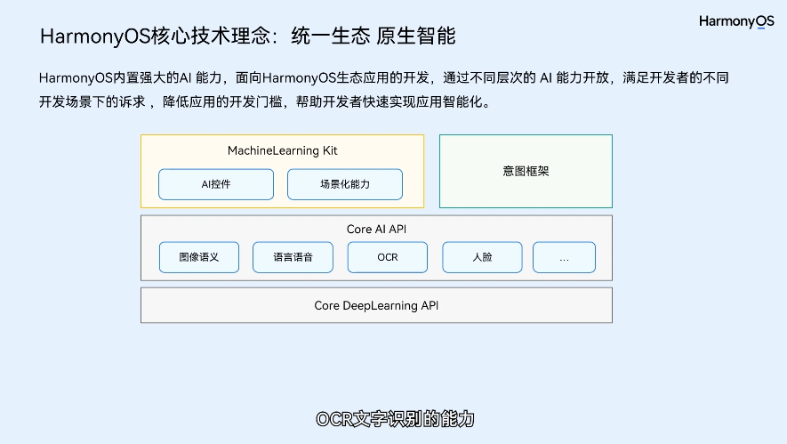
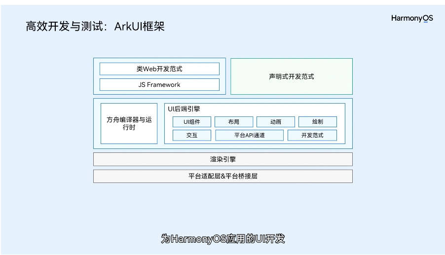
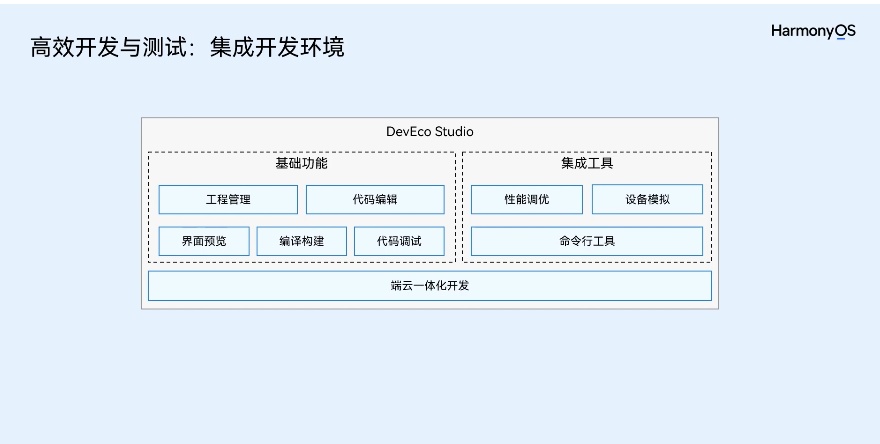
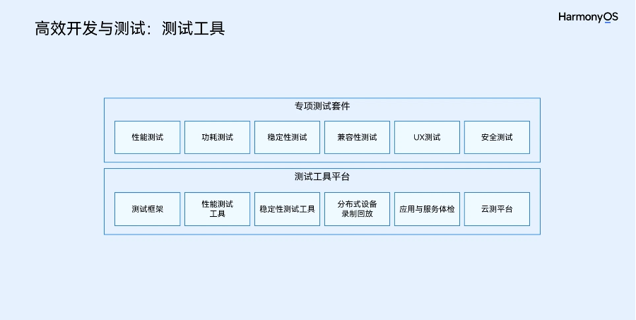
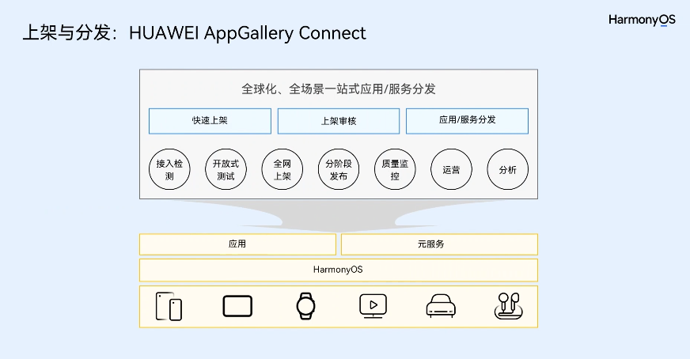
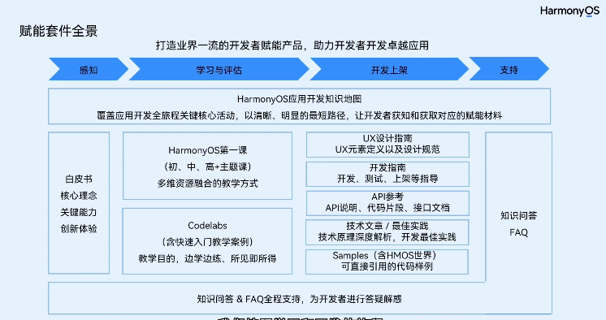
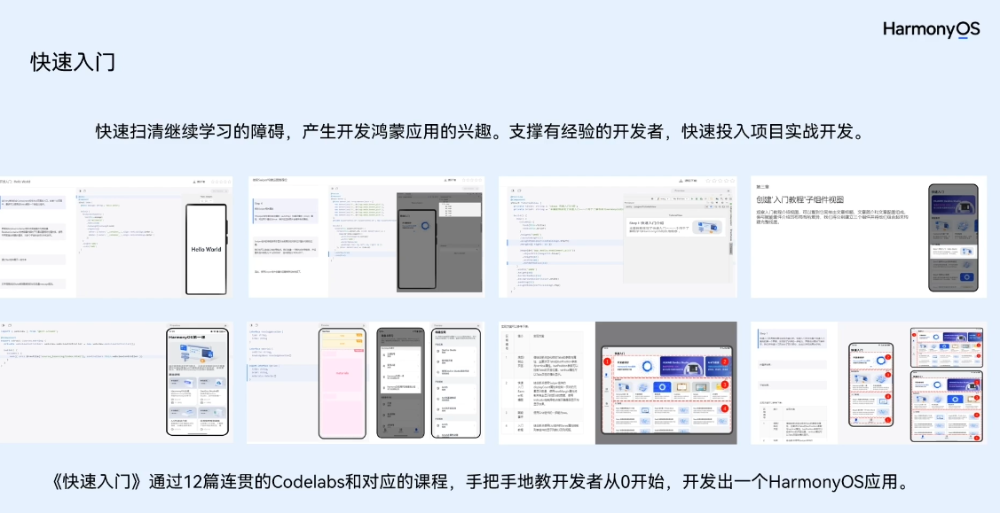
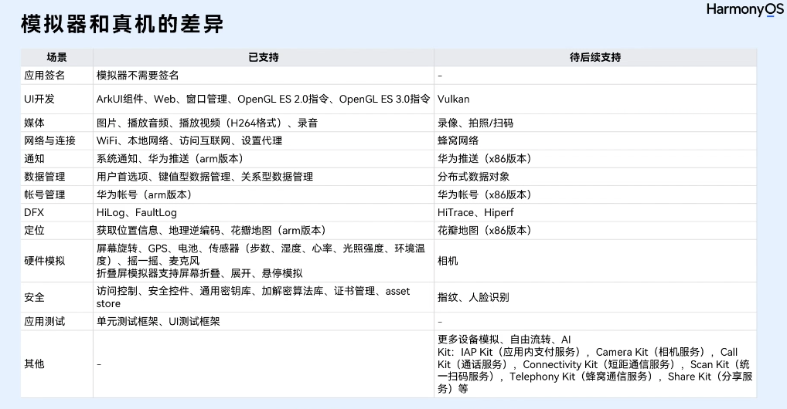
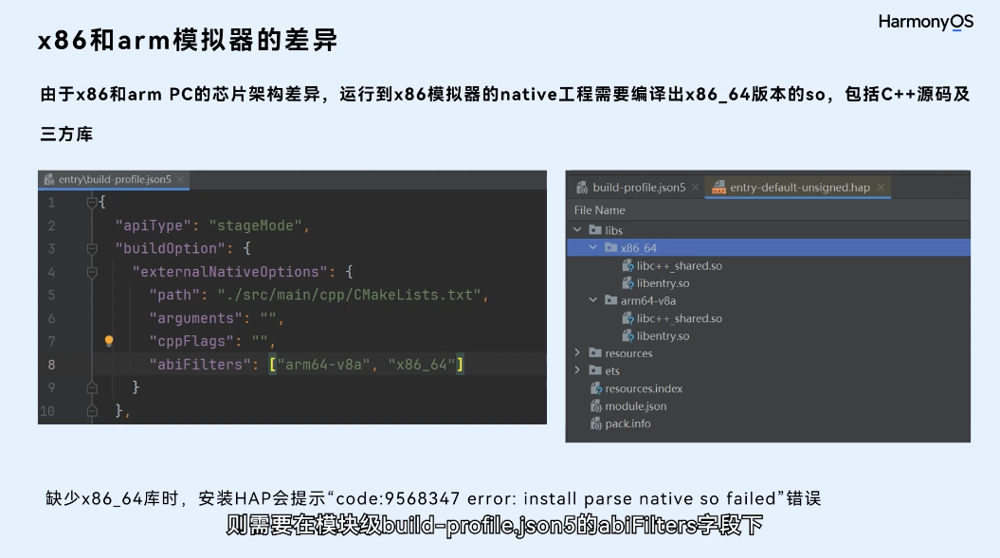

# HarmonyOS
## HarmonyOS简介
随着万物互联时代的开启，应用的设备底座将从几十亿手机扩展到数百亿IoT设备。全新的全场景设备体验，正深入改变消费者的使用习惯。 同时应用开发者也面临设备底座从手机单设备到全场景多设备的转变，全场景多设备的全新底座，为消费者带来万物互联时代更为高效、便捷的体验。

新的场景同时也带来了新的挑战。开发者不仅需要支持更加多样化的设备，还需要支持跨设备的协作。不同设备类型意味着不同的传感器能力、硬件能力、屏幕尺寸、操作系统和开发语言，还意味着差异化的交互方式。同时跨设备协作也让开发者面临分布式开发带来的各种复杂性，例如跨设备的网络通信、数据同步等。若采取传统开发模式，适配和管理工作量将非常巨大。

当前移动应用开发中遇到的主要挑战包括：

- 针对不同设备上的不同操作系统，重复开发，维护多套版本。
- 多种语言栈，对人员技能要求高。
- 多种开发框架，不同的编程范式。
- 命令式编程，需关注细节，变更频繁，维护成本高。
图1 更多的智能设备

与此同时，AI时代全面来临。随着人们对交互和信息获取的智能化要求越来越高，移动设备的计算能力越来越强，在设备侧就能提供AI的相关能力，例如自然语言交互、环境智能感知、图像识别等。如何快速地使用这些AI能力，使自己的应用更加智能化，进而更好的服务消费者，也是开发者面临的全新挑战。

移动终端上的应用生态发展到今天也面临着变革。传统厚重的App ，整体体验好，功能齐全，但开发成本高、周期长，且存在搜索，安装，升级，卸载等一系列需要用户主动关注的显性操作，这些显性操作给用户带来了实质性的使用成本。轻量化、可快速达成消费者意图、可独立执行、完成单一功能的程序实体正成为新的趋势。

为了更好的抓住机遇，应对万物互联所带来的一系列挑战，新的应用生态应该具备如下特征：

- 单一设备延伸到多设备：应用一次开发就能在多个设备上运行，软件实体能够从单一设备转移到其他设备上，且多个设备间能够协同运行，给消费者提供全新的分布式体验。
- 厚重应用模式到轻量化服务模式：提供轻量化的服务，最小化资源消耗，一步直达，快速完成消费者特定场景的任务。
- 集中化分发到AI加持下的智慧分发：为消费者提供智慧场景服务，实现“服务找人”。
- 纯软件到软硬芯协同的AI能力：提供软硬芯协同优化的原生AI能力，全面满足应用高性能诉求。
图2 HarmonyOS

HarmonyOS是新一代的智能终端操作系统，为不同设备的智能化、互联与协同提供了统一的语言，为用户带来简捷，流畅，连续，安全可靠的全场景交互体验。

HarmonyOS结合移动生态发展的趋势，提出了三大技术理念：一次开发，多端部署；可分可合，自由流转；统一生态，原生智能。核心技术理念详细内容可参考[《鸿蒙生态应用开发白皮书》](https://developer.huawei.com/consumer/cn/doc/guidebook/harmonyecoapp-guidebook-0000001761818040)，此白皮书全面阐释了HarmonyOS生态下应用开发核心理念、关键能力以及创新体验，旨在帮助开发者快速、准确、全面的了解HarmonyOS开发套件给开发者提供的能力全景和未来的愿景。

另外，《鸿蒙生态应用安全技术白皮书》全面阐述了HarmonyOS生态下应用安全核心理念；通过应用开发、应用发布、应用安装运行三个阶段，构建关键安全能力，从始至终贯彻应用安全核心理念，帮助开发者快速理解HarmonyOS生态应用安全设计，提升应用开发安全质量。






## HarmonyOS赋能套件介绍



:::tip
> [一站式获取文档和赋能资源](https://developer.huawei.com/consumer/cn/)

> [白皮书](https://developer.huawei.com/consumer/cn/doc/guidebook/harmonyecoapp-guidebook-0000001761818040)

> [视频课程](https://developer.huawei.com/consumer/cn/teaching-video/)

> [CodeLabs](https://developer.huawei.com/consumer/cn/codelabsPortal/serviceTypes/43)

> [开发指南](https://developer.huawei.com/consumer/cn/doc/harmonyos-guides-V5/application-dev-guide-V5?catalogVersion=V5)

> [API参考](https://developer.huawei.com/consumer/cn/doc/harmonyos-references-V5/syscap-V5?catalogVersion=V5)

>[最佳实践](https://developer.huawei.com/consumer/cn/doc/best-practices-V5/bpta-develop-once-deploy-everywhere-V5?catalogVersion=V5)

>[Sample](https://developer.huawei.com/consumer/cn/samples/)

>[FAQ]
[智能客服](https://developer.huawei.com/consumer/cn/customerService/?ha_linker=eyJ0cyI6MTY4NjExOTA0Mzk1MywiaWQiOiIyNDRkNGQzNmFiODExM2IxMTI1YjBhNGNjZDM4YmE3OCJ9#/bot-dev-top/faq-top/faq-talk-top)
[FAQ](https://developer.huawei.com/consumer/cn/doc/harmonyos-faqs-V5/faqs-ability-kit-V5?catalogVersion=V5)
:::

## 构建第一个ArkTS应用
创建ArkTS工程
- 若首次打开DevEco Studio，请点击Create Project创建工程。如果已经打开了一个工程，请在菜单栏选择File > New > Create Project来创建一个新工程。
- 选择Application应用开发（本文以应用开发为例，Atomic Service对应为元服务开发），选择模板“Empty Ability”，点击Next进行下一步配置。


- 进入配置工程界面，Compatible SDK选择“5.0.0(12)”，其他参数保持默认设置即可。


- 点击Finish，工具会自动生成示例代码和相关资源，等待工程创建完成。
### ArkTS工程目录结构（Stage模型）


- AppScope > app.json5：应用的全局配置信息，详见app.json5配置文件。
- entry：HarmonyOS工程模块，编译构建生成一个HAP包。
```text
src > main > ets：用于存放ArkTS源码。
src > main > ets > entryability：应用/服务的入口。
src > main > ets > entrybackupability：应用提供扩展的备份恢复能力。
src > main > ets > pages：应用/服务包含的页面。
src > main > resources：用于存放应用/服务所用到的资源文件，如图形、多媒体、字符串、布局文件等。关于资源文件，详见资源分类与访问。
src > main > module.json5：模块配置文件。主要包含HAP包的配置信息、应用/服务在具体设备上的配置信息以及应用/服务的全局配置信息。具体的配置文件说明，详见module.json5配置文件。
build-profile.json5：当前的模块信息 、编译信息配置项，包括buildOption、targets配置等。
hvigorfile.ts：模块级编译构建任务脚本。
obfuscation-rules.txt：混淆规则文件。混淆开启后，在使用Release模式进行编译时，会对代码进行编译、混淆及压缩处理，保护代码资产。详见开启代码混淆。
oh-package.json5：用来描述包名、版本、入口文件（类型声明文件）和依赖项等信息。
```
- oh_modules：用于存放三方库依赖信息。
- build-profile.json5：工程级配置信息，包括签名signingConfigs、产品配置products等。其中products中可配置当前运行环境，默认为HarmonyOS。

- hvigorfile.ts：工程级编译构建任务脚本。

- oh-package.json5：主要用来描述全局配置，如：依赖覆盖（overrides）、依赖关系重写（overrideDependencyMap）和参数化配置（parameterFile）等。
### 构建第一个页面
- 使用文本组件。
工程同步完成后，在“Project”窗口，点击“entry > src > main > ets > pages”，打开“Index.ets”文件，进行页面的编写。

针对本文中使用文本/按钮来实现页面跳转/返回的应用场景，页面均使用Row和Column组件来组建布局。对于更多复杂元素对齐的场景，可选择使用RelativeContainer组件进行布局。

“Index.ets”文件的示例如下：
```js
// Index.ets
@Entry
@Component
struct Index {
  @State message: string = 'Hello World'

  build() {
    Row() {
      Column() {
        Text(this.message)
          .fontSize(50)
          .fontWeight(FontWeight.Bold)
      }
      .width('100%')
    }
    .height('100%')
  }
}
```
- 添加按钮。
在默认页面基础上，我们添加一个Button组件，作为按钮响应用户点击，从而实现跳转到另一个页面。“Index.ets”文件的示例如下：

```js

// Index.ets
@Entry
@Component
struct Index {
  @State message: string = 'Hello World'

  build() {
    Row() {
      Column() {
        Text(this.message)
          .fontSize(50)
          .fontWeight(FontWeight.Bold)
        // 添加按钮，以响应用户点击
        Button() {
          Text('Next')
            .fontSize(30)
            .fontWeight(FontWeight.Bold)
        }
        .type(ButtonType.Capsule)
        .margin({
          top: 20
        })
        .backgroundColor('#0D9FFB')
        .width('40%')
        .height('5%')
      }
      .width('100%')
    }
    .height('100%')
  }
}
```
- 在编辑窗口右上角的侧边工具栏，点击Previewer，打开预览器。第一个页面效果如下图所示：


### 构建第二个页面
- 创建第二个页面。
 1. 新建第二个页面文件。在“Project”窗口，打开“entry > src > main > ets”，右键点击“pages”文件夹，选择“New > ArkTS File”，命名为“Second”，点击回车键。可以看到文件目录结构如下：


:::tip
说明
开发者也可以在右键点击“pages”文件夹时，选择“New > Page > Empty Page”，命名为“Second”，点击“Finish”完成第二个页面的创建。使用此种方式则无需再进行下文中第二个页面路由的手动配置。
:::

- 配置第二个页面的路由。在“Project”窗口，打开“entry > src > main > resources > base > profile”，在main_pages.json文件中的“src”下配置第二个页面的路由“pages/Second”。示例如下：
```js

{
  "src": [
    "pages/Index",
    "pages/Second"
  ]
}
```
- 添加文本及按钮。
参照第一个页面，在第二个页面添加Text组件、Button组件等，并设置其样式。“Second.ets”文件的示例如下：
```js

// Second.ets
@Entry
@Component
struct Second {
  @State message: string = 'Hi there'

  build() {
    Row() {
      Column() {
        Text(this.message)
          .fontSize(50)
          .fontWeight(FontWeight.Bold)
        Button() {
          Text('Back')
            .fontSize(25)
            .fontWeight(FontWeight.Bold)
        }
        .type(ButtonType.Capsule)
        .margin({
          top: 20
        })
        .backgroundColor('#0D9FFB')
        .width('40%')
        .height('5%')
      }
      .width('100%')
    }
    .height('100%')
  }
}
```
### 实现页面间的跳转
页面间的导航可以通过[页面路由router](https://developer.huawei.com/consumer/cn/doc/harmonyos-references-V5/js-apis-router-V5)来实现。页面路由router根据页面url找到目标页面，从而实现跳转。使用页面路由请导入router模块。

如果需要实现更好的转场动效，推荐使用Navigation。

1. 第一个页面跳转到第二个页面。
在第一个页面中，跳转按钮绑定onClick事件，点击按钮时跳转到第二页。“Index.ets”文件的示例如下：
```js

// Index.ets
// 导入页面路由模块
import { router } from '@kit.ArkUI';
import { BusinessError } from '@kit.BasicServicesKit';

@Entry
@Component
struct Index {
  @State message: string = 'Hello World'

  build() {
    Row() {
      Column() {
        Text(this.message)
          .fontSize(50)
          .fontWeight(FontWeight.Bold)
        // 添加按钮，以响应用户点击
        Button() {
          Text('Next')
            .fontSize(30)
            .fontWeight(FontWeight.Bold)
        }
        .type(ButtonType.Capsule)
        .margin({
          top: 20
        })
        .backgroundColor('#0D9FFB')
        .width('40%')
        .height('5%')
        // 跳转按钮绑定onClick事件，点击时跳转到第二页
        .onClick(() => {
          console.info(`Succeeded in clicking the 'Next' button.`)
          // 跳转到第二页
          router.pushUrl({ url: 'pages/Second' }).then(() => {
            console.info('Succeeded in jumping to the second page.')

          }).catch((err: BusinessError) => {
            console.error(`Failed to jump to the second page. Code is ${err.code}, message is ${err.message}`)
          })
        })
      }
      .width('100%')
    }
    .height('100%')
  }
}
```
2. 第二个页面返回到第一个页面。
在第二个页面中，返回按钮绑定onClick事件，点击按钮时返回到第一页。“Second.ets”文件的示例如下：
```js

// Second.ets
// 导入页面路由模块
import { router } from '@kit.ArkUI';
import { BusinessError } from '@kit.BasicServicesKit';

@Entry
@Component
struct Second {
  @State message: string = 'Hi there'

  build() {
    Row() {
      Column() {
        Text(this.message)
          .fontSize(50)
          .fontWeight(FontWeight.Bold)
        Button() {
          Text('Back')
            .fontSize(25)
            .fontWeight(FontWeight.Bold)
        }
        .type(ButtonType.Capsule)
        .margin({
          top: 20
        })
        .backgroundColor('#0D9FFB')
        .width('40%')
        .height('5%')
        // 返回按钮绑定onClick事件，点击按钮时返回到第一页
        .onClick(() => {
          console.info(`Succeeded in clicking the 'Back' button.`)
          try {
            // 返回第一页
            router.back()
            console.info('Succeeded in returning to the first page.')
          } catch (err) {
            let code = (err as BusinessError).code; 
            let message = (err as BusinessError).message; 
            console.error(`Failed to return to the first page. Code is ${code}, message is ${message}`)
          }
        })
      }
      .width('100%')
    }
    .height('100%')
  }
}
```
3. 打开Index.ets文件，点击预览器中的按钮进行刷新。效果如下图所示：


### 使用真机运行应用
1. 将搭载HarmonyOS系统的真机与电脑连接。具体指导及要求，可查看使用本地真机运行应用/服务。
2. 点击File > Project Structure... > Project > SigningConfigs界面勾选“Support HarmonyOS”和“Automatically generate signature”，点击界面提示的“Sign In”，使用华为帐号登录。等待自动签名完成后，点击“OK”即可。如下图所示：


3. 在编辑窗口右上角的工具栏，点击按钮运行。效果如下图所示：

## 代码阅读
> DevEco Studio支持使用多种语言进行应用/服务的开发，包括ArkTS、JS和C/C++。在编写应用/服务阶段，可以通过掌握代码编写的各种常用技巧，来提升编码效率。
### 代码高亮

支持对代码关键字、运算符、字符串、类、标识符、注释等进行高亮显示，您可以打开`File > Settings（macOS为DevEco Studio > Preferences）`面板，在`Editor > Color Scheme`自定义各字段的高亮显示颜色。默认情况下，您可以在Language Defaults中设置源代码中的各种高亮显示方案，该设置将对所有语言生效；如果您需要针对具体语言的源码高亮显示方案进行定制，可以在左侧边栏选择对应的语言，然后取消`“Inherit values from”`选项后设置对应的颜色即可。


### 代码跳转
在编辑器中，可以按住Ctrl键（macOS为Command键），鼠标单击代码中引用的类、方法、参数、变量等名称，自动跳转到定义处。若单击定义处的类、变量等名称，当仅有一处引用时，可直接跳转到引用位置；若有多处引用，在弹窗中可以选择想要查看的引用位置。


### 跨语言跳转
DevEco Studio支持在声明或引用了Native接口的文件中（如d.ts）跨语言跳转其对应的C/C++函数，从而提升混合语言开发时的开发效率。您可以选中接口名称单击右键，在弹出的菜单中选择Go To > Implementation(s)（或使用快捷键Ctrl+Alt+B，macOS为Command+Option+B）实现跨语言跳转。


### 代码格式化
代码格式化功能可以帮助您快速的调整和规范代码格式，提升代码的美观度和可读性。默认情况下，DevEco Studio已预置了代码格式化的规范，您也可以个性化的设置各个文件的格式化规范，设置方式如下：在`File > Settings > Editor > Code Style（macOS为DevEco Studio > Preferences > Editor > Code Style）`下，选择需要定制的文件类型，如ArkTS，然后自定义格式化规范即可。


在使用代码格式化功能时，您可以使用快捷键`Ctrl + Alt + L（macOS为Option+Shift+Command +L）` 可以快速对选定范围的代码进行格式化。

如果在进行格式化时，对于部分代码片段不需要进行自动的格式化处理，可以通过如下方式进行设置：

- 在File > Settings >Editor > Code Style（macOS为DevEco Studio > Preferences > Editor > Code Style），单击“Formatter”，勾选“Turn formatter on/off with markers in code comments”。


- 在不需要进行格式化操作的代码块前增加“//@formatter:off”，在不格式化代码块的最后增加“//@formatter:on”，即表示对该范围的代码块不需要进行格式化操作。


若工程已配置code-linter.json5文件，选中code-linter.json5文件右键选择Apply CodeLinter Style Rules，代码格式化规则将与已配置的code-linter.json5文件中相关规则保持一致。code-linter.json5文件配置请参考[配置代码检查规则](https://developer.huawei.com/consumer/cn/doc/harmonyos-guides-V5/ide-code-linter-0000001363071681-V5#section1782903483817)。


### 代码折叠
支持对代码块的快速折叠和展开，既可以单击编辑器左侧边栏的折叠和展开按钮对代码块进行折叠和展开操作，还可以对选中的代码块单击鼠标右键选择折叠方式，包括折叠、递归折叠、全部折叠等操作。


### 代码快速注释

支持对选择的代码块进行快速注释，使用快捷键Ctrl+/（macOS为Command+/）进行快速注释。对于已注释的代码块，再次使用快捷键Ctrl+/（macOS为Command+/）取消注释。


### 代码结构树
使用快捷键Alt + 7 / Ctrl + F12（macOS为Command+7）打开代码结构树，快速查看文件代码的结构树，包括全局变量和函数，类成员变量和方法等，并可以跳转到对应代码行。


### 代码引用查找
提供Find Usages代码引用查找功能，帮助开发者快速查看某个对象(变量、函数或者类等)被引用的地方，用于后续的代码重构，可以极大的提升开发者的开发效率。

使用方法：在要查找的对象上，单击鼠标·右键 > Find Usages·或使用快捷键·Alt +F7`（macOS为·Option + F7`）。可点击[图标](https://alliance-communityfile-drcn.dbankcdn.com/FileServer/getFile/cmtyPub/011/111/111/0000000000011111111.20240719105427.40096976265273084811175504682029:50001231000000:2800:3AA3FC0EEF1BDD2CA22B6652DD4B7F23534B32491572E8F3A78C85B470C81368.png?needInitFileName=true?needInitFileName=true)查看变量赋值位置，点击[图标](https://alliance-communityfile-drcn.dbankcdn.com/FileServer/getFile/cmtyPub/011/111/111/0000000000011111111.20240719105427.71819463922498854232279394266434:50001231000000:2800:2DCC1098E71EAC660049F0869F1B78452F30ED6A1F3E69FEB68846576C059025.png?needInitFileName=true?needInitFileName=true)查看变量引用情况。


### 函数注释生成
DevEco Studio支持在函数定义处，快速生成对应的注释。在函数定义的代码块前，输入“/**”+回车键，快速生成注释信息。


### 代码查找
通过对符号、类或文件的即时导航来查找代码。检查调用或类型层次结构，轻松地搜索工程里的所有内容。通过连续点击两次Shift快捷键，打开代码查找界面，在搜索框中输入需要查找内容，下方窗口实时展示搜索结果。双击查找的结果可以快速打开所在文件的位置。


### 快速查阅API接口及组件参考文档
在编辑器中调用ArkTS/JS API或组件时，支持在编辑器中快速、精准调取出对应的参考文档。

可在编辑器中，鼠标悬停在需要查阅的接口或组件，弹窗将显示当前接口/组件在不同API版本下的参数等信息，单击弹窗右下角Show in API Reference，可以快速查阅更详细的API文档。

### Optimize Imports功能
使用编辑器提供的Optimize Imports，可以快速清除未使用的import，并根据设置的规则对import进行合并或排序。选择文件或目录，使用快捷键`Ctrl+Alt+O`（macOS为`Control+Option+O`），或单击菜单栏`Code > Optimize Imports`。
如需修改优化配置，进入File > Settings... > Editor > Code Style，选择开发语言（当前以ArkTS为例），在Imports标签页中，可选择在优化时是否需合并来自同一模块的import，是否需要对同一条import语句导入的元素进行排序，或对多条import语句按模块排序。


### 查看父类/子类继承关系
编辑器支持查看当前接口、类、方法、属性的继承关系。点击代码编辑区域左侧的Gutter Icons（装订线图标）可以跳转到对应的父/子接口或类。如有多个继承关系，在弹窗的文件列表中选择需要查看的接口/类即可。

- [1](https://alliance-communityfile-drcn.dbankcdn.com/FileServer/getFile/cmtyPub/011/111/111/0000000000011111111.20240719105427.79359199325172212095304405298743:50001231000000:2800:3C8C6A0DCE1B3BFF787D50F92F83AEE20AA9D660EAA48071EC5A115E78B20A00.png?needInitFileName=true?needInitFileName=true)Implemented：支持跳转到对应的实现类或子接口及其对应的属性/方法。

- Implemented：Implementing：支持跳转到对应的父接口或父接口的属性/方法。
- Overridden：支持跳转到对应的子类或子类的属性/方法。
- Overriding：支持跳转到对应的父类或父类的属性/方法。
- 
查看父类/子类继承关系功能默认开启，可以通过菜单栏进入`File > Settings > Editor > General > Gutter Icons`，通过勾选或取消勾选Implemented、Implementing、Overridden、Overriding四项可以开启或关闭该功能。


### 代码自动补全
提供代码的自动补全能力，编辑器工具会分析上下文，并根据输入的内容，提示可补全的类、方法、字段和关键字的名称等，支持模糊匹配。

自动补齐功能默认按最短路径进行排序，如仅需按照最近使用过的类、方法、字段和关键字等名称提供补全内容排序，可以在`File > Settings > Editor > General > Code Completion` 中勾选“`Sort suggestions by recently used`”。
:::tip
若已勾选代码补齐按最近使用排序但未生效，请检查Code Completion页面，确保“Sort suggestions alphabetically”已取消勾选。
:::


### 快速覆写父类
DevEco Studio提供Override Methods，辅助开发者根据父类模板快速生成子类方法，提升开发效率。将光标放于子类定义位置，使用快捷键Ctrl+O，或右键单击Generate...，选择Override Methods，指定需要覆写的对象（方法、变量等），点击OK将自动生成该对象的覆写代码。


### 快速生成构造器
编辑器支持为类快速生成一个对应的构造函数。

在类中使用快捷键Alt+Insert，或单击鼠标右键选择Generate...，在弹窗中选择Constructor，选择一个或多个需要生成构造函数的参数，点击OK。若选择Select None，则生成不带参数的构造器。


### 快速生成get/set方法
编辑器支持为类成员变量或对象属性快速生成get和set方法。

将光标放置在当前类中，单击右键选择`Generate...>Getter and Setter`，或者使用快捷键Alt+Insert，在菜单中选择Getter and Setter，完成方法快速生成。


### 快速生成声明信息到Index文件
编辑器支持将HSP和HAR模块中变量、方法、接口、类等需要对外暴露的信息，通过Generate...>Declarations功能，批量在Index.ets文件中进行声明，便于其他模块调用。

在HSP或HAR模块内的文件编辑界面，单击右键选择`Generate...>Declarations`，或者使用快捷键Alt+Insert，在菜单中选择Declarations，按住快捷键Ctrl并选择需要声明的变量名、方法名、接口名、类名等，即可在模块的Index.ets文件中批量生成相应的声明信息。


### 实时检查
编辑器会实时的进行代码分析，如果输入的语法不符合编码规范，或者出现语义语法错误，将在代码中突出显示错误或警告，将鼠标放置在错误代码处，会提示详细的错误信息。

从DevEco Studio 4.0 Release版本开始，当compatibleSdkVersion≥10时，编辑器代码实时检查支持ArkTS性能语法规范检查。


:::tip
当前compileSDKVersion≥10且arkTSVersion≥1.1(默认)时ArkTS严格类型检查支持实时检查。
:::
另外，通过Code Linter功能还可以手工对代码进行编程规范等方面的检查。更多关于Code Linter的内容请参考[代码Code Linter检查](https://developer.huawei.com/consumer/cn/doc/harmonyos-guides-V5/ide-code-linter-0000001363071681-V5)。

### 代码code Linter检查

#### Code Linter代码检查
Code Linter针对ArkTS/TS代码进行最佳实践/编程规范方面的检查。检查规则支持配置，配置方式请参考配置代码检查规则。

开发者可根据扫描结果中告警提示手工修复代码缺陷，或者执行一键式自动修复，在代码开发阶段，确保代码质量。

检查方法：

在已打开的代码编辑器窗口单击右键点击Code Linter，或在工程管理窗口中鼠标选中单个或多个工程文件/目录，右键选择`Code Linter > Full Linter`执行代码全量检查

如只需对Git工程中增量文件（包含新增/修改/重命名）进行检查，可在commit界面右下角点击齿轮图标，选择Incremental Linter执行增量检查。


:::tip
若未配置代码检查规则文件，直接执行Code Linter，将按照默认的编程规范规则对.ets文件进行检查。
:::

#### 配置代码检查规则
在工程根目录下创建code-linter.json5配置文件，可对于代码检查的范围及对应生效的检查规则进行配置，其中files和ignore配置项共同确定了代码检查范围，ruleSet和rules配置项共同确定了生效的规则范围。具体配置项功能如下：

files：配置待检查的文件名单，如未指定目录，规则适用于所有文件，例如：[“**/*.ets”,”**/*.js”,”**/*.ts”]。

ignore：配置无需检查的文件目录，其指定的目录或文件需使用相对路径格式，相对于code-linter.json5所在工程根目录，例如：build/**/*。

ruleSet：配置检查使用的规则集，规则集支持一次导入多条规则。规则详情请参见[Code Linter代码检查规则](https://developer.huawei.com/consumer/cn/doc/harmonyos-guides-V5/ide-codelinter-rule-0000001530930013-V5)。目前支持的规则集包括：
- 通用规则@typescript-eslint
- 一次开发多端部署规则@cross-device-app-dev
- ArkTS代码风格规则@hw-stylistic
- 安全规则@security
- 性能规则@performance
- 预览规则@previewer

`rules`：可以基于ruleSet配置的规则集，新增额外规则项，或修改ruleSet中规则默认配置，例如：将规则集中某条规则告警级别由warn改为error。

`overrides`：针对工程根目录下部分特定目录或文件，可配置定制化检查的规则。
```js
{
  "files":   //用于表示配置适用的文件范围的 glob 模式数组。在没有指定的情况下，应用默认配置
  [
    "**/*.js", //字符串类型
    "**/*.ts"
  ],
  "ignore":  //一个表示配置对象不应适用的文件的 glob 模式数组。如果没有指定，配置对象将适用于所有由 files 匹配的文件
  [
    "build/**/*",    //字符串类型
    "node_modules/**/*"
  ],
  "ruleSet":       //设置检查待应用的规则集
  [
    "plugin:@typescript-eslint/recommended"    //快捷批量引入的规则集, 枚举类型：plugin:@typescript-eslint/all, plugin:@typescript-eslint/recommended, plugin:@cross-device-app-dev/all, plugin:@cross-device-app-dev/recommended等
  ],
  "rules":         //可以对ruleSet配置的规则集中特定的某些规则进行修改、去使能, 或者新增规则集以外的规则；ruleSet和rules共同确定了代码检查所应用的规则
  {
    "@typescript-eslint/no-explicit-any":  // ruleId后面跟数组时, 第一个元素为告警级别, 后面的对象元素为规则特定开关配置
    [
      "error",              //告警级别: 枚举类型, 支持配置为suggestion, error, warn, off
      {
        "ignoreRestArgs": true   //规则特定的开关配置, 为可选项, 不同规则其下层的配置项不同
      }
    ],
    "@typescript-eslint/explicit-function-return-type": 2,   // ruleId后面跟单独一个数字时, 表示仅设置告警级别, 枚举值为: 3(suggestion), 2(error), 1(warn), 0(off)
    "@typescript-eslint/no-unsafe-return": "warn"            // ruleId后面跟单独一个字符串时, 表示仅设置告警级别, 枚举值为: suggestion, error, warn, off
  },
  "overrides":      //针对特定的目录或文件采用定制化的规则配置
  [
    {
      "files":   //指定需要定制化配置规则的文件或目录
      [
        "entry/**/*.ts"   //字符串类型
      ],
      "excluded":
      [
        "entry/**/*.test.js" //指定需要排除的目录或文件, 被排除的目录或文件不会被检查; 字符串类型
      ],
      "rules":   //支持对overrides外公共配置的规则进行修改、去使能, 或者新增公共配置以外的规则; 该配置将覆盖公共配置
      {
        "@typescript-eslint/explicit-function-return-type":  // ruleId: 枚举类型
        [
          "warn",     //告警级别: 枚举类型, 支持配置为error, warn, off; 覆盖公共配置, explicit-function-return-type告警级别为warn
          {
             allowExpressions: true    //规则特定的开关配置, 为可选项, 不同规则其下层的配置项不同
          }
        ],
        "@typescript-eslint/no-unsafe-return": "off"   // 覆盖公共配置, 不检查no-unsafe-return规则
      }
    }
  ]
}
```

### 代码Quick Fix快速修复

DevEco Studio支持对Quick Fix能力，辅助开发者快速修复ArkTS或C++代码问题。

`查看告警信息`：使用双击Shift快捷键打开文件查询框，输入problems打开问题工具面板；双击对应告警信息，可以查看告警的具体位置及原因。

`快速修复`：将光标放在错误告警的位置，可在弹出的悬浮窗中查看问题描述和对应修复方式；单击More actions可查看更多修复方法。或是在页面出现灯泡图标时，可点击图标并根据相应建议，实现代码快速修复。


#### 填充switch语句

### 使用auto替换类型
编辑器中可以用 auto 替换 iterator，new expression，cast expression的声明类型。光标悬浮在类型名称处，点击灯泡图标，在下拉菜单中选择Replace the type with 'auto'完成替换。


### 用？：三元操作符替换if-else
编辑器中支持将if-else语句替换为？：三元操作符。光标放在if表达式的条件处，左侧出现黄色灯泡图标，点击灯泡图标，在下拉菜单中选择Replace 'if else' with '?:'完成替换。


### 从使用处生成构造函数
如使用了未定义的构造函数，可通过quickfix方式快速生成相应的构造函数定义。点击构造函数名称，左侧出现红色灯泡后，点击灯泡图标选择Create new constructor 'xxx'生成构造函数。

### 将变量拆分为声明和赋值
光标点击需要拆分的变量，左侧出现黄色灯泡后，点击灯泡图标选择Split into declaration and assignment，将变量的声明赋值语句拆分成声明语句和赋值语句。


## 查看ArkTS/JS预览效果
预览器支持ArkTS/JS应用/服务“实时预览”和“动态预览”。
:::tip
- 预览支持Phone、Tablet、2in1、Car设备的ArkTS工程，支持Litewearable设备的JS工程。
- 预览器功能依赖于电脑显卡的OpenGL版本，OpenGL版本要求为3.2及以上。
- 预览时将不会运行Ability生命周期。
- 预览不支持引用HSP。引用了HSP的模块不支持预览，请直接在HSP内预览或模拟HSP。
- 预览场景下，不支持通过相对路径及绝对路径的方式访问resources目录下的文件。
- 预览不支持组件拖拽。
- 部分API不支持预览，如Ability、App、MultiMedia等模块。
- Richtext、Web、Video、XComponent组件不支持预览。
- 不支持调用C++库的预览。
- har在被应用/服务使用时真机效果有区别，真机上实际效果应用不显示menubar，服务显示menubar，但预览器都以不显示menubar为准。若开发har模块时，请注意被服务使用时预览器效果与真机效果的不同。
:::
`实时预览`：在开发界面UI代码过程中，如果添加或删除了UI组件，您只需Ctrl+S进行保存，然后预览器就会立即刷新预览结果。如果修改了组件的属性，则预览器会实时（亚秒级）刷新预览结果，达到极速预览的效果（当前版本极速预览仅支持ArkTS组件。支持部分数据绑定场景，如@State装饰的变量）。实时预览默认开启，如果不需要实时预览，请单击预览器右上角按钮，关闭实时预览功能。
:::tip
开发者修改resources/base/profile目录下的配置文件（如main_pages.json/form_config.json），不支持触发实时预览，开发者需要点击重新加载。
:::

`动态预览`：在预览器界面，可以在预览器中操作应用/服务的界面交互动作，如单击、跳转、滑动等，与应用/服务运行在真机设备上的界面交互体验一致。


以ArkTS为例，使用预览器的方法如下：

- 创建或打开一个ArkTS应用/服务工程。本示例以打开一个本地ArkTS Demo工程为例。
- 在工程目录下，打开任意一个.ets文件（JS工程请打开.hml/.css/.js页面）。
- 可以通过如下任意一种方式打开预览器开关，显示效果如下图所示：
    1. 通过菜单栏，单击View>Tool Windows>Previewer打开预览器。
    2. 在编辑窗口右上角的侧边工具栏，单击Previewer，打开预览器。

    

 ### Profile Manager
 由于真机设备有丰富的设备型号，不同设备型号的屏幕分辨率可能不一样。因此，在HarmonyOS应用/服务开发过程中，由于设备类型繁多，可能需要查看在不同设备上的界面显示效果。对此，DevEco Studio的预览器提供了Profile Manager功能，支持开发者自定义预览设备Profile（包含分辨率和语言），从而可以通过定义不同的预览设备Profile，查看HarmonyOS应用/服务在不同设备上的预览显示效果。当前支持自定义设备分辨率及系统语言。

定义设备后，可以在Previewer右上角，单击按钮，打开Profile管理器，切换预览设备。


同时，Profile Manager还支持多设备预览功能，具体请参考查看多端设备预览效果。

下面以自定义一款Phone设备为例，介绍设备Profile Manager的使用方法。

- 在预览器界面，打开Profile Manager界面。


- 在Profile Manager界面，单击+ New Profile按钮，添加设备。


- 在Create Profile界面，填写新增设备的信息，如Profile ID（设备型号）、Device type（设备类型）、Resolution（分辨率）和Language and region（语言和区域）等。其中Device type只能选择module.json5中deviceTypes字段已定义的设备。


- 设备信息填写完成后，单击OK完成创建。

### 查看多端设备预览效果

- 在工程目录中，打开任意一个ets文件（JS请打开hml/css/js文件）。
- 可以通过如下任意一种方式打开预览器开关，显示效果如下图所示：
    1.通过菜单栏，单击View>Tool Windows>Previewer，打开预览器。
    2.在编辑窗口右上角的侧边工具栏，单击Previewer，打开预览器。
- 在Previewer窗口中，打开Profile Manager中的Multi-profile preview开关，同时查看多设备上的应用/服务运行效果。

:::tip
多端设备预览不支持动画的预览，如果需要查看动画在设备上的预览效果，请关闭Multi-device preview功能后在单设备预览界面进行查看。
:::


### Inspector双向预览

DevEco Studio提供HarmonyOS应用/服务的UI预览界面与源代码文件间的双向预览功能，支持ets文件与预览器界面的双向预览。使用双向预览功能时，需要在预览器界面单击图标打开双向预览功能。


开启双向预览功能后，支持代码编辑器、UI界面和Component Tree组件树三者之间的联动：
- 选中预览器UI界面中的组件，则组件树上对应的组件将被选中，同时代码编辑器中的布局文件中对应的代码块高亮显示。
- 选中布局文件中的代码块，则在UI界面会高亮显示，组件树上的组件节点也会呈现被选中的状态。
- 选中组件树中的组件，则对应的代码块和UI界面也会高亮显示。


## 使用模拟器运行应用



