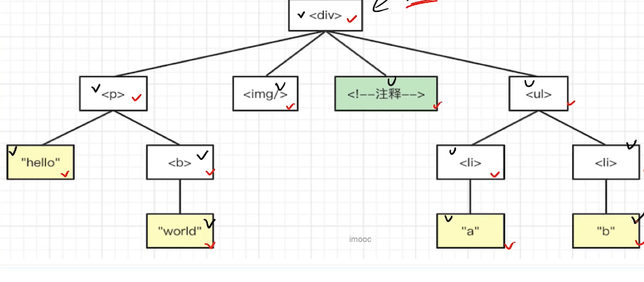
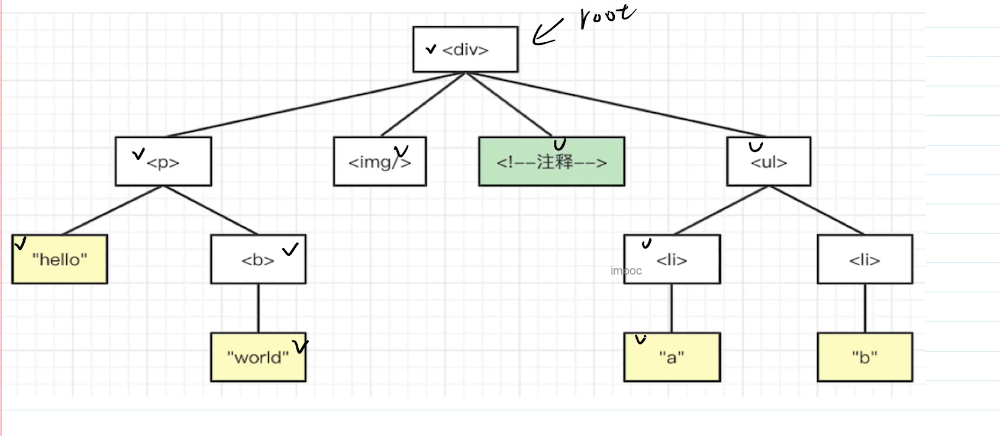
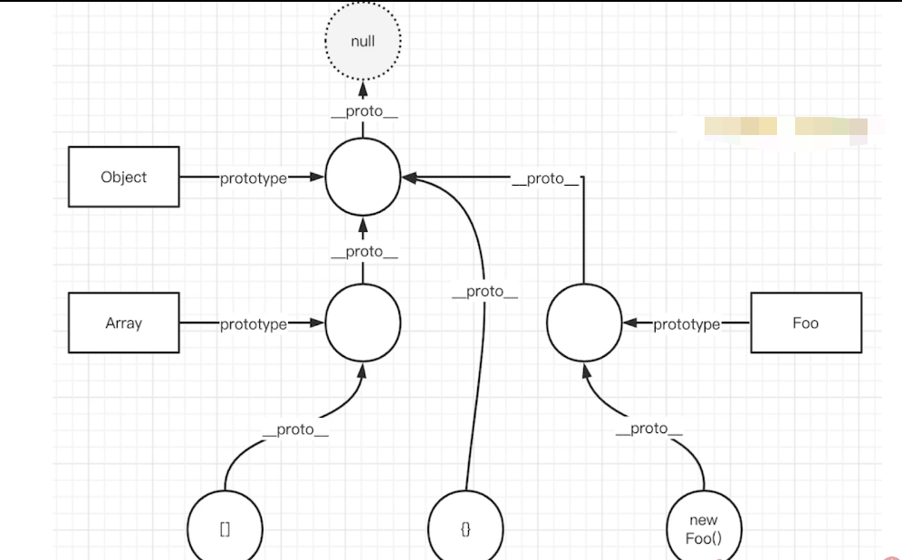
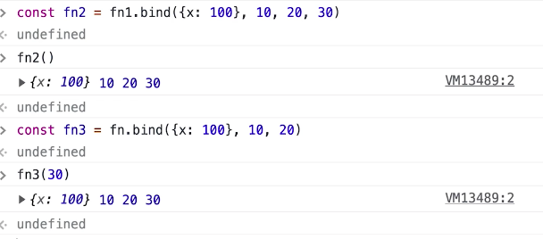
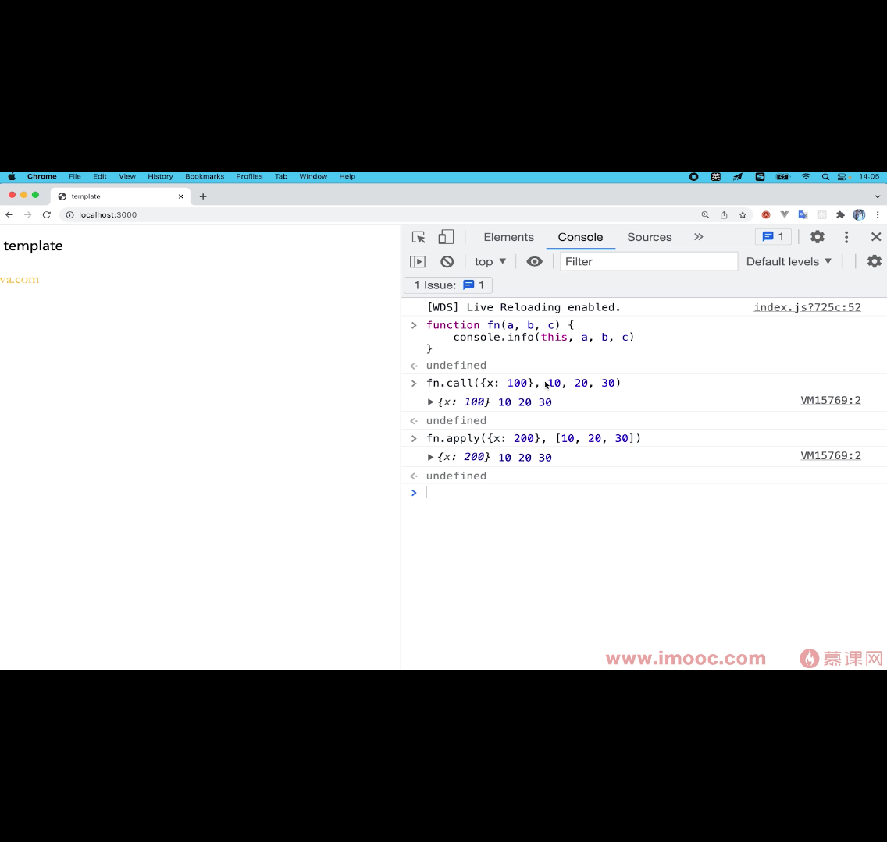
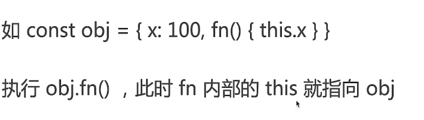

# 工具函数

## Array Flatten 

- 写一个JS函数，实现数组扁平化，只减少一级嵌套
- 如输入`[1，[2，[3]，4]，输出[1,2，[3]，4]`

### 思路
:::tip
定义空数组arr=们。遍历当前数组
如果item非数组，则累加到arr
如果item是数组，则遍历之后累加到arr
:::
```js

/**
 * 数组扁平化，使用 push
 * @param arr arr
 */
export function flatten1(arr: any[]): any[] {
    const res: any[] = []

    arr.forEach(item => {
        if (Array.isArray(item)) {
            item.forEach(n => res.push(n))
        } else {
            res.push(item)
        }
    })

    return res
}

/**
 * 数组扁平化，使用 concat
 * @param arr arr
 */
export function flatten2(arr: any[]): any[] {
    let res: any[] = []

    arr.forEach(item => {
        res = res.concat(item)
    })

    return res
}

// // 功能测试
// const arr = [1, [2, [3], 4], 5]
// console.info( flatten2(arr) )

```
## Array Flatten 彻底拍平
> 写一个S函数，实现数组扁平化，减少所有嵌套的层级
> 如输入`[1，[2，[3]，4]，输出[1,2，，3,4]`

```js
/**
 * 数组深度扁平化，使用 push
 * @param arr arr
 */
export function flattenDeep1(arr: any[]): any[] {
    const res: any[] = []

    arr.forEach(item => {
        if (Array.isArray(item)) {
            const flatItem = flattenDeep1(item) // 递归
            flatItem.forEach(n => res.push(n))
        } else {
            res.push(item)
        }
    })

    return res
}

/**
 * 数组深度扁平化，使用 concat
 * @param arr arr
 */
export function flattenDeep2(arr: any[]): any[] {
    let res: any[] = []

    arr.forEach(item => {
        if (Array.isArray(item)) {
            const flatItem = flattenDeep2(item) // 递归
            res = res.concat(flatItem)
        } else {
            res = res.concat(item)
        }
    })

    return res
}

```

## getType函数-获取类型

```js
/**
 * 获取详细的数据类型
 * @param x x
 */
export function getType(x: any): string {
    const originType = Object.prototype.toString.call(x) // '[object String]'
    const spaceIndex = originType.indexOf(' ')
    const type = originType.slice(spaceIndex + 1, -1) // 'String'
    return type.toLowerCase() // 'string'
}

// // 功能测试
// console.info( getType(null) ) // 'null'
// console.info( getType(undefined) )
// console.info( getType(100) )
// console.info( getType('abc') )
// console.info( getType(true) )
// console.info( getType(Symbol()) )
// console.info( getType({}) )
// console.info( getType([]) )
// console.info( getType(() => {}) )
```

## new 一个对象发生了什么？请手写代码表示 

> class 是function的语法糖

:::tip
- 创建一个空对象oj,继承构造函数的原型
- 执行构造函数（将obj作为this）
- 返回obj
:::

```js
class Foo {
    name:string;
    city:string;
    constructor(name){
        this.name = name;
        this.city = 'bj'
    }
    getName(){
        return this.name
    }
}
const f = new Foo('ljh')
f.getName()
```
**new**
```js
export function customNew<T>(constructor: Function, ...args: any[]): T {
    // 1. 创建一个空对象，继承 constructor 的原型
    const obj = Object.create(constructor.prototype);
    // 2. 将 obj 作为 this ，执行 constructor ，传入参数
    constructor.apply(obj, args);
    // 3. 返回 obj
    return obj;
}
```
## {}和Object.prototype 区别
:::tip
- {}创建空对象，原型指向Object.prototype
- Object.create创建空对象，原型指向传入的参数
:::

## 遍历dom树

### 广度优先



### 深度优先




## 手写一个curry函数，把其他函数柯里化

```js
export function curry(fn: Function) {
    const fnArgsLength = fn.length // 传入函数的参数长度
    let args: any[] = []

    // ts 中，独立的函数，this 需要声明类型
    function calc(this: any, ...newArgs: any[]) {
        // 积累参数
        args = [
            ...args,
            ...newArgs
        ]
        if (args.length < fnArgsLength) {
            // 参数不够，返回函数
            return calc
        } else {
            // 参数够了，返回执行结果
            return fn.apply(this, args.slice(0, fnArgsLength))
        }
    }

    return calc
}

// function add(a: number, b: number, c: number): number {
//     return a + b + c
// }
// // add(10, 20, 30) // 60

// const curryAdd = curry(add)
// const res = curryAdd(10)(20)(30) // 60
// console.info(res)
```
## instanceof 原理是什么？代码实现 

```js

/**
 * 自定义 instanceof
 * @param instance instance
 * @param origin class or function
 */
export function myInstanceof(instance: any, origin: any): boolean {
    if (instance == null) return false // null undefined

    const type = typeof instance
    if (type !== 'object' && type !== 'function') {
        // 值类型
        return false
    }

    let tempInstance = instance // 为了防止修改 instance
    while (tempInstance) {
        if (tempInstance.__proto__ === origin.prototype) {
            return true // 配上了
        }
        // 未匹配
        tempInstance = tempInstance.__proto__ // 顺着原型链，往上找
    }

    return false
}

// // 功能测试
// console.info( myInstanceof({}, Object) )
// console.info( myInstanceof([], Object) )
// console.info( myInstanceof([], Array) )
// console.info( myInstanceof({}, Array) )
// console.info( myInstanceof('abc', String) )
```


## 手写bind
:::tip
- 返回一个新函数，但不执行
- 绑定this和部分参数
- 如是箭头函数，无法改变this,只能改变参数
:::
:::tip
**分析**
- 返回新函数
- 绑定this
- 同时绑定执行时的参数(apply或者call)
:::

```js
// @ts-ignore
Function.prototype.customBind = function (context: any, ...bindArgs: any[]) {
    // context 是 bind 传入的 this
    // bindArgs 是 bind 传入的各个参数

    const self = this // 当前的函数本身

    return function (...args: any[]) {
        // 拼接参数
        const newArgs = bindArgs.concat(args)
        return self.apply(context, newArgs)
    }
}

// // 功能测试
// function fn(this: any, a: any, b: any, c: any) {
//     console.info(this, a, b, c)
// }
// // @ts-ignore
// const fn1 = fn.customBind({x: 100}, 10)
// fn1(20, 30)
```

## apply和call
:::tip
**应用**
- bind返回一个新函数（不执行），cal和apply会立即执行函数
- 绑定this
- 传入执行参数
:::

### 如何在函数中绑定this


```js

// @ts-ignore
Function.prototype.customCall = function (context: any, ...args: any[]) {
    if (context == null) context = globalThis
    if (typeof context !== 'object') context = new Object(context) // 值类型，变为对象

    const fnKey = Symbol() // 不会出现属性名称的覆盖
    context[fnKey] = this // this 就是当前的函数

    const res = context[fnKey](...args) // 绑定了 this

    delete context[fnKey] // 清理掉 fn ，防止污染

    return res
}

// @ts-ignore
Function.prototype.customApply = function (context: any, args: any[] = []) {
    if (context == null) context = globalThis
    if (typeof context !== 'object') context = new Object(context) // 值类型，变为对象

    const fnKey = Symbol() // 不会出现属性名称的覆盖
    context[fnKey] = this // this 就是当前的函数

    const res = context[fnKey](...args) // 绑定了 this

    delete context[fnKey] // 清理掉 fn ，防止污染

    return res
}

function fn(this: any, a: any, b: any, c: any) {
    console.info(this, a, b, c)
}
// // @ts-ignore
// fn.customCall({x: 100}, 10, 20, 30)
// @ts-ignore
// fn.customApply({x: 200}, [100, 200, 300])
```

## 首页EventBus 自定义事件 
:::tip
- on绑定的事件可以连续执行，除非off
- once绑定的函数emit一次即删除，也可以未执行而被off
:::
```js
export default class EventBus {
    /**
     * {
     *    'key1': [
     *        { fn: fn1, isOnce: false },
     *        { fn: fn2, isOnce: false },
     *        { fn: fn3, isOnce: true },
     *    ]
     *    'key2': [] // 有序
     *    'key3': []
     * }
     */
    private events: {
        [key: string]: Array<{fn: Function; isOnce: boolean}>
    }

    constructor() {
        this.events = {}
    }

    on(type: string, fn: Function, isOnce: boolean = false) {
        const events = this.events
        if (events[type] == null) {
            events[type] = [] // 初始化 key 的 fn 数组
        }
        events[type].push({ fn, isOnce })
    }

    once(type: string, fn: Function) {
        this.on(type, fn, true)
    }

    off(type: string, fn?: Function) {
        if (!fn) {
            // 解绑所有 type 的函数
            this.events[type] = []
        } else {
            // 解绑单个 fn
            const fnList = this.events[type]
            if (fnList) {
                this.events[type] = fnList.filter(item => item.fn !== fn)
            }
        }
    }

    emit(type: string, ...args: any[]) {
        const fnList = this.events[type]
        if (fnList == null) return

        // 注意
        this.events[type] = fnList.filter(item => {
            const { fn, isOnce } = item
            fn(...args)

            // once 执行一次就要被过滤掉
            if (!isOnce) return true
            return false
        })
    }
}

// const e = new EventBus()

// function fn1(a: any, b: any) { console.log('fn1', a, b) }
// function fn2(a: any, b: any) { console.log('fn2', a, b) }
// function fn3(a: any, b: any) { console.log('fn3', a, b) }

// e.on('key1', fn1)
// e.on('key1', fn2)
// e.once('key1', fn3)
// e.on('xxxxxx', fn3)

// e.emit('key1', 10, 20) // 触发 fn1 fn2 fn3

// e.off('key1', fn1)

// e.emit('key1', 100, 200) // 触发 fn2
```