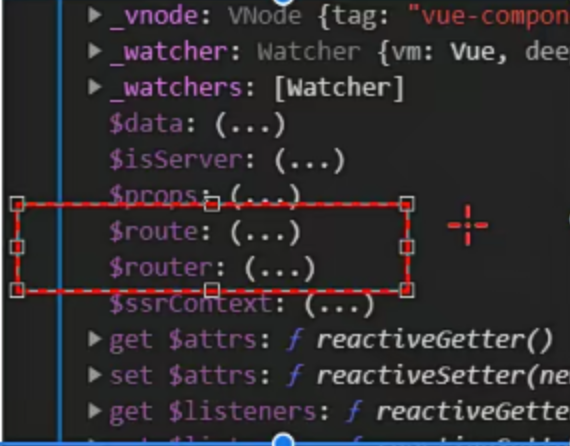

# Vue2

## 01.模块一 手写 Vue Router、手写响应式实现、虚拟 DOM 和 Diff 算法
### vue基础回顾
- h函数的作用是创建虚拟dom render方法，把h函数创建的虚拟dom返回。
- $mount方法的作用是把虚拟dom转换成真实dom，

```js
 <div id="app">
    </div>
    <script src="https://cdn.jsdelivr.net/npm/vue/dist/vue.js"></script>

    <script>
        new Vue({
            data: {
                company: {
                    name: '拉勾',
                    address: '中关村创业大街籍海楼4层'
                }
            },
            render(h) {
                return h('div', [
                    h('p', '公司名称：' + this.company.name),
                    h('p', '公司地址：' + this.company.address)
                ])
            }
        }).$mount('#app')
    </script>

```

### vue 生命周期

### vue常用语法

- 差值表达式
- 指令 
- 计算属性和侦听器
- class 和style 绑定
- 条件渲染/列表渲染
- 组件
- 插槽 
- 混入
- 深入响应式原理
- 不同的构件版本的vue


### vue-router原理实现

#### vue router 基础回顾

router/router.js
```js
import Vue from 'vue'
import VueRouter from 'vue-router'
import Index from '../views/Index.vue'
// 1. 注册路由插件
Vue.use(VueRouter)

// 路由规则
const routes = [
  {
    path: '/',
    name: 'Index',
    component: Index
  },
  {
    path: '/blog',
    name: 'Blog',
    // route level code-splitting
    // this generates a separate chunk (about.[hash].js) for this route
    // which is lazy-loaded when the route is visited.
    component: () => import(/* webpackChunkName: "blog" */ '../views/Blog.vue')
  },
  {
    path: '/photo',
    name: 'Photo',
    // route level code-splitting
    // this generates a separate chunk (about.[hash].js) for this route
    // which is lazy-loaded when the route is visited.
    component: () => import(/* webpackChunkName: "photo" */ '../views/Photo.vue')
  }
]
// 2. 创建 router 对象
const router = new VueRouter({
  routes
})

export default router

```

- main.js

```js
import Vue from 'vue'
import App from './App.vue'
import router from './router'

Vue.config.productionTip = false

new Vue({
  // 3. 注册 router 对象
  router,
  render: h => h(App)
}).$mount('#app')

```

- 为什么传入router 

new Vue中会注入$router 和$route

$route存储了路由规则
$router 路由对象事例



#### Hash 模式和history 模式


### 模拟vue.js 响应式原理
### virtual dom 实现原理


## 02.模块二 Vue.js 源码分析（响应式、虚拟 DOM、模板编译和组件化）
## 03.模块三 Vuex 数据流管理及Vue.js 服务端渲染（SSR）

## 04.模块四 搭建自己的SSR、静态站点生成（SSG）及封装 Vue.js 组件库

## 05.模块五 Vue.js 3.0 Composition APIs 及 3.0 原理剖析

## 06.模块六 Vue.js + Vuex + TypeScript 实战项目开发与项目优化

## 07.模块七 Vue.js 3 + Vite + TypeScript 实战项目开发