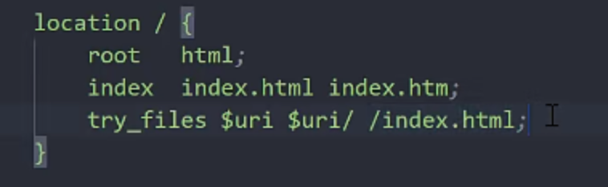
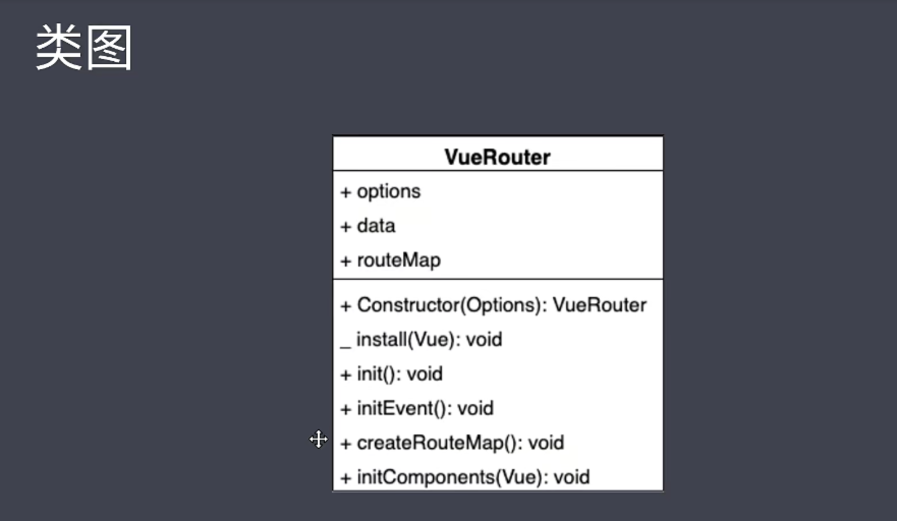

# Vue2

## 01.模块一 手写 Vue Router、手写响应式实现、虚拟 DOM 和 Diff 算法
### vue基础回顾
- h函数的作用是创建虚拟dom render方法，把h函数创建的虚拟dom返回。
- $mount方法的作用是把虚拟dom转换成真实dom，

```js
 <div id="app">
    </div>
    <script src="https://cdn.jsdelivr.net/npm/vue/dist/vue.js"></script>

    <script>
        new Vue({
            data: {
                company: {
                    name: '拉勾',
                    address: '中关村创业大街籍海楼4层'
                }
            },
            render(h) {
                return h('div', [
                    h('p', '公司名称：' + this.company.name),
                    h('p', '公司地址：' + this.company.address)
                ])
            }
        }).$mount('#app')
    </script>

```

### vue 生命周期

### vue常用语法

- 差值表达式
- 指令 
- 计算属性和侦听器
- class 和style 绑定
- 条件渲染/列表渲染
- 组件
- 插槽 
- 混入
- 深入响应式原理
- 不同的构件版本的vue


### vue-router原理实现

#### vue router 基础回顾

router/router.js
```js
import Vue from 'vue'
import VueRouter from 'vue-router'
import Index from '../views/Index.vue'
// 1. 注册路由插件
Vue.use(VueRouter)

// 路由规则
const routes = [
  {
    path: '/',
    name: 'Index',
    component: Index
  },
  {
    path: '/blog',
    name: 'Blog',
    // route level code-splitting
    // this generates a separate chunk (about.[hash].js) for this route
    // which is lazy-loaded when the route is visited.
    component: () => import(/* webpackChunkName: "blog" */ '../views/Blog.vue')
  },
  {
    path: '/photo',
    name: 'Photo',
    // route level code-splitting
    // this generates a separate chunk (about.[hash].js) for this route
    // which is lazy-loaded when the route is visited.
    component: () => import(/* webpackChunkName: "photo" */ '../views/Photo.vue')
  }
]
// 2. 创建 router 对象
const router = new VueRouter({
  routes
})

export default router

```

- main.js

```js
import Vue from 'vue'
import App from './App.vue'
import router from './router'

Vue.config.productionTip = false

new Vue({
  // 3. 注册 router 对象
  router,
  render: h => h(App)
}).$mount('#app')

```

- 为什么传入router 

new Vue中会注入$router 和$route

$route存储了路由规则
$router 路由对象事例


- 获取动态路由参数

```js
<template>
  <div>
    <!-- 方式1： 通过当前路由规则，获取数据 -->
    通过当前路由规则获取：{{ $route.params.id }}

    <br>
    <!-- 方式2：路由规则中开启 props 传参 -->
    通过开启 props 获取：{{ id }}
  </div>
</template>

<script>
export default {
  name: 'Detail',
  props: ['id']
}
</script>

<style>

</style>

```
- 嵌套路由

> Layout.vue

```js
<template>
  <div>
    <div>
      
    </div>
    <div>
      <router-view></router-view>
    </div>
    <div>
      Footer
    </div>
  </div>
</template>

<script>
export default {
  name: 'layout'
}
</script>

<style scoped>
</style>
```

router.js

```js
import Vue from 'vue'
import VueRouter from 'vue-router'
// 加载组件
import Layout from '@/components/Layout.vue'
import Index from '@/views/Index.vue'
import Login from '@/views/Login.vue'

Vue.use(VueRouter)

const routes = [
  {
    name: 'login',
    path: '/login',
    component: Login
  },
  // 嵌套路由
  {
    path: '/',
    component: Layout,
    children: [
      {
        name: 'index',
        path: '',
        component: Index
      },
      {
        name: 'detail',
        path: 'detail/:id',
        props: true,
        component: () => import('@/views/Detail.vue')
      }
    ]
  }
]

const router = new VueRouter({
  routes
})

export default router

````

- 编程式导航 

```js
this.$router.push('/')
this.$router.push({ name: 'Home' })
this.$router.replace('/login')
this.$router.push({ name: 'Detail', params: { id: 1 } })
this.$router.go(-2)

```


#### Hash 模式和history 模式

- Hash模式是基于锚点，以及onhashchange事件
> ·URL中#后面的内容作为路径地址 
>  监听 hashchange 事件·根据当前路由地址找到对应组件重新渲染

- History模式是基于HTML5中History API
> 通过 history.pushState()方法改变地址栏
> 监听 popstate 事件 根据当前路由地址找到对应组件重新渲染
```text
history.pushState() 
history.replaceState()
```
```js
import Vue from 'vue'
import VueRouter from 'vue-router'
import Home from '../views/Home.vue'

Vue.use(VueRouter)

const routes = [
  {
    path: '/',
    name: 'Home',
    component: Home
  },
  {
    path: '/about',
    name: 'About',
    // route level code-splitting
    // this generates a separate chunk (about.[hash].js) for this route
    // which is lazy-loaded when the route is visited.
    component: () => import(/* webpackChunkName: "about" */ '../views/About.vue')
  },
  {
    path: '*',
    name: '404',
    component: () => import(/* webpackChunkName: "404" */ '../views/404.vue')
  }
]

const router = new VueRouter({
  mode: 'history',
  routes
})

export default router

```

> node - app.js
```js
const path = require('path')
// 导入处理 history 模式的模块
const history = require('connect-history-api-fallback')
// 导入 express
const express = require('express')

const app = express()
// 注册处理 history 模式的中间件
app.use(history())
// 处理静态资源的中间件，网站根目录 ../web
app.use(express.static(path.join(__dirname, '../web')))

// 开启服务器，端口是 3000
app.listen(3000, () => {
  console.log('服务器开启，端口：3000')
})

```
- nginx 

```text

nginx 命令
start nginx 
nginx -s reload
nginx -s stop

```

```text
location /{
root html;
index index.html index.htm;
try_files $uri $uri/ /index.html;
}
```


#### 模拟vue-router

```js
console.dir(Vue)
let _Vue = null
class VueRouter {
    static install(Vue){
        //1 判断当前插件是否被安装
        if(VueRouter.install.installed){
            return;
        }
        VueRouter.install.installed = true
        //2 把Vue的构造函数记录在全局
        _Vue = Vue
        //3 把创建Vue的实例传入的router对象注入到Vue实例
        // _Vue.prototype.$router = this.$options.router
        _Vue.mixin({
            beforeCreate(){
                if(this.$options.router){
                    _Vue.prototype.$router = this.$options.router
                    
                }
               
            }
        })
    }
    constructor(options){
        this.options = options
        this.routeMap = {}
        // observable
        this.data = _Vue.observable({
            current:"/"
        })
        this.init()

    }
    init(){
        this.createRouteMap()
        this.initComponent(_Vue)
        this.initEvent()
    }
    createRouteMap(){
        //遍历所有的路由规则 吧路由规则解析成键值对的形式存储到routeMap中
        this.options.routes.forEach(route => {
            this.routeMap[route.path] = route.component
        });
    }
    initComponent(Vue){
        Vue.component("router-link",{
            props:{
                to:String
            },
            render(h){
                return h("a",{
                    attrs:{
                        href:this.to
                    },
                    on:{
                        click:this.clickhander
                    }
                },[this.$slots.default])
            },
            methods:{
                clickhander(e){
                    history.pushState({},"",this.to)
                    this.$router.data.current=this.to
                    e.preventDefault()
                }
            }
            // template:"<a :href='to'><slot></slot><>"
        })
        const self = this
        Vue.component("router-view",{
            render(h){
                // self.data.current
                const cm=self.routeMap[self.data.current]
                return h(cm)
            }
        })
        
    }
    initEvent(){
        //
        window.addEventListener("popstate",()=>{
            this.data.current = window.location.pathname
        })
    }
}
```

### 模拟vue.js 响应式原理
### virtual dom 实现原理


## 02.模块二 Vue.js 源码分析（响应式、虚拟 DOM、模板编译和组件化）
## 03.模块三 Vuex 数据流管理及Vue.js 服务端渲染（SSR）

## 04.模块四 搭建自己的SSR、静态站点生成（SSG）及封装 Vue.js 组件库

## 05.模块五 Vue.js 3.0 Composition APIs 及 3.0 原理剖析

## 06.模块六 Vue.js + Vuex + TypeScript 实战项目开发与项目优化

## 07.模块七 Vue.js 3 + Vite + TypeScript 实战项目开发