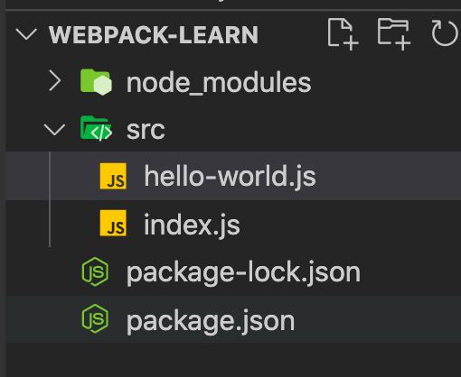
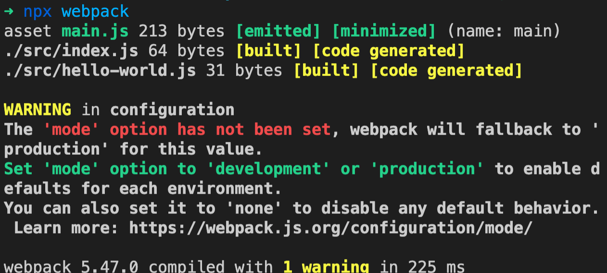

# 核心概念

## HelloWorld

首先是创建项目，创建一个名字为`webpack-learn`的文件夹（这里千万别创建成`webpack`），并且进入文件夹使用`npm init`进行初始化：

```bash
# 创建目录并且进入
# webpack-learn
# 初始化
npm init -y
# 安装 webpack 和 webpack-cli到开发依赖
npm i webpack@5 -D
npm i webpack-cli@4 -D

# 注意这里安装的是webpack 5与webpack-cli 4的版本
```


创建目录src，其结构如下：



创建`hello-world.js`文件：

```
module.exports = 'hello world';
```

创建 `index.js`文件：

```
const sayHello = require('./hello-world')

console.log(sayHello)
```

下面尝试一下webpack打包：

```
// 方法一
npx webpack

// 方法二 scripts中添加 "start": "webpack"
npm run start
```

说明：

- `module.exports`与`require`是node.js所遵循的`Commonjs`规范；
- `module.exports`导出了一个字符串；
- `require`引用的如果是js文件，则可以省略；


打包结果：



执行成功，index.js 文件被打包到了`dist`文件夹下了，同时提示我们默认使用了`production` mode，即生产环境，打开`dist/main.js`，里面的代码的确是被压缩的，说明是生产环境打包；


下面继续修改`package.json`添加`scripts`：

```json
"scripts": {
  "dev": "webpack --mode development",
  "build": "webpack --mode production"
}
```


同样可以尝试`build`脚本，这里来说明一下这两个模式的内容，**模式其实就是webpack内置了一些打包的参数。**

| 选项          | 描述                                                         |
| :------------ | :----------------------------------------------------------- |
| `development` | 会将 `DefinePlugin` 中 `process.env.NODE_ENV` 的值设置为 `development`. 为模块和 chunk 启用有效的名。 |
| `production`  | 会将 `DefinePlugin` 中 `process.env.NODE_ENV` 的值设置为 `production`。为模块和 chunk 启用确定性的混淆名称，`FlagDependencyUsagePlugin`，`FlagIncludedChunksPlugin`，`ModuleConcatenationPlugin`，`NoEmitOnErrorsPlugin` 和 `TerserPlugin` 。 |
| `none`        | 不使用任何默认优化选项                                       |

如果没有设置，webpack 会给 `mode` 的默认值设置为 `production`。上面的内容，我们后续会介绍到！


## CLI进阶

一般的CLI的命令都会有一个`help`命令：

```shell
➜ npx webpack help

Usage: webpack [entries...] [options]
Alternative usage to run commands: webpack [command] [options]

The build tool for modern web applications.

Options:
  -c, --config <value...>                Provide path to a webpack configuration file e.g. ./webpack.config.js.
  --config-name <value...>               Name of the configuration to use.
  -m, --merge                            Merge two or more configurations using 'webpack-merge'.
  --env <value...>                       Environment passed to the configuration when it is a function.
  --node-env <value>                     Sets process.env.NODE_ENV to the specified value.
  --progress [value]                     Print compilation progress during build.
  -j, --json [value]                     Prints result as JSON or store it in a file.
  -d, --devtool <value>                  Determine source maps to use.
  --no-devtool                           Do not generate source maps.
  --entry <value...>                     The entry point(s) of your application e.g. ./src/main.js.
  --mode <value>                         Defines the mode to pass to webpack.
  --name <value>                         Name of the configuration. Used when loading multiple configurations.
  -o, --output-path <value>              Output location of the file generated by webpack e.g. ./dist/.
  --stats [value]                        It instructs webpack on how to treat the stats e.g. verbose.
  --no-stats                             Disable stats output.
  -t, --target <value...>                Sets the build target e.g. node.
  --no-target                            Negative 'target' option.
  -w, --watch                            Watch for files changes.
  --no-watch                             Do not watch for file changes.
  --watch-options-stdin                  Stop watching when stdin stream has ended.
  --no-watch-options-stdin               Do not stop watching when stdin stream has ended.

Global options:
  --color                                Enable colors on console.
  --no-color                             Disable colors on console.
  -v, --version                          Output the version number of 'webpack', 'webpack-cli' and 'webpack-dev-server' and commands.
  -h, --help [verbose]                   Display help for commands and options.

Commands:
  build|bundle|b [entries...] [options]  Run webpack (default command, can be omitted).
  configtest|t [config-path]             Validate a webpack configuration.
  help|h [command] [option]              Display help for commands and options.
  info|i [options]                       Outputs information about your system.
  serve|server|s [entries...]            Run the webpack dev server. To see all available options you need to install 'webpack-dev-server'.
  version|v [commands...]                Output the version number of 'webpack', 'webpack-cli' and 'webpack-dev-server' and commands.
  watch|w [entries...] [options]         Run webpack and watch for files changes.

To see list of all supported commands and options run 'webpack --help=verbose'.

Webpack documentation: https://webpack.js.org/.
CLI documentation: https://webpack.js.org/api/cli/.
Made with ♥ by the webpack team.
```

说明：

- `--config`，`-c`：指定一个 Webpack 配置文件的路径；
- `--mode`：指定打包环境的 mode，取值为`development`和`production`，分别对应着开发环境和生产环境；
- `--json`：输mode出 Webpack 打包的结果，可以使用`webpack --json > stats.json`方式将打包结果输出到指定的文件；
- `--progress`：显示 Webpack 打包进度；
- `--watch`, `-w`：watch 模式打包，监控文件变化之后重新开始打包；


## 配置文件

Webpack 是可配置的模块打包工具，我们可以通过修改 Webpack 的配置文件（`webpack.config.js`）来对 Webpack 进行配置，Webpack 的配置文件是遵循 Node.js 的 CommonJS 模块规范的，即：

- 通过`require()`语法导入其他文件或者使用 Node.js 内置的模块
- 普通的 JavaScript 编写语法，包括变量、函数、表达式等

说白了，`webpack.config.js`是一个 Node.js 的模块，简单的 webpack.config.js 示例

```js
const path = require('path');

module.exports = {
    mode: 'development',
    entry: './src/index.js',
    output: {
        path: path.resolve(__dirname, 'dist'),
        filename: 'server.bundle.js'
    }
};
```

上面示例中，使用 CommonJS 的`require`引入 Node.js 内置的`path`模块，然后通过`module.exports`将 Webpack 的配置导出。

> Tips：Webpack 的配置是一个 Node.js 模块，所以并不只是 JSON 对象。

默认情况下，Webpack 会查找执行目录下面的`webpack.config.js`作为配置，如果需要指定某个配置文件，可以使用下面的命令：

```sh
webpack -c webpack.config.js

// 或者 默认读取根目录中的 webpack.config.js文件
webpack
```

如果 Webpack 不是全局安装，则可以在项目目录下实行：

```sh
node ./node_modules/webpack/bin/webpack --config webpack.config.js
```

或者使用`npx`

```bash
npx webpack --config webpack.config.js
```

打包结果展示：


说明：为什么main.js还在dist，别急，后面会进行打包之后删除；

除了配置文件的语法多样之外，对于配置的类型也是多样的，最常见的是直接作为一个对象来使用，除了使用对象，Webpack 还支持函数、Promise 和多配置数组。


## 核心概念

讲完 Webpack 配置文件，下面讲下配置文件中的配置项：

| 参数     | 说明                                                         |
| :------- | :----------------------------------------------------------- |
| `entry`  | 入口起点(entry point) 指示 webpack 应该使用哪个模块，来作为构建其内部 [依赖图(dependency graph)](https://webpack.docschina.org/concepts/dependency-graph/) 的开始。进入入口起点后，webpack 会找出有哪些模块和库是入口起点（直接和间接）依赖的。 |
| `output` | 默认值是 `./src/index.js`output 属性告诉 webpack 在哪里输出它所创建的 *bundle*，以及如何命名这些文件。 |
| `mode`   | 通过选择 `development`, `production` 或 `none` 之中的一个，来设置 `mode` 参数，可以启用 webpack 内置在相应环境下的优化。其默认值为 `production`。 |
| `loader` | 模块转化器，模块的处理器，对模块进行转换处理；webpack 只能理解 JavaScript 和 JSON 文件，这是 webpack 开箱可用的自带能力。**loader** 让 webpack 能够去处理其他类型的文件，并将它们转换为有效 [模块](https://webpack.docschina.org/concepts/modules)，以供应用程序使用，以及被添加到依赖图中。 |
| `plugin` | 插件则可以用于执行范围更广的任务。包括：打包优化，资源管理，注入环境变量。 |


还有一些其他的概念：

| 参数     | 说明                                                         |
| :------- | :----------------------------------------------------------- |
| `module` | 开发中每一个文件都可以看做 module，模块不局限于 js，也包含 css、图片等 |
| `chunk`  | 代码块，一个 chunk 可以由多个模块组成                        |
| `bundle` | 最终打包完成的文件，一般就是和 chunk 一一对应的关系，bundle 就是对 chunk 进行便意压缩打包等处理后的产出 |

> Webpack 不仅仅支持 js 配置，还支持 ts（TypeScript）、CoffeeScript 甚至 [JSX](https://reactjs.org/docs/introducing-jsx.html) 语法的配置，不同语言其实核心配置项都不变，只不过语法不同而已 ——原因：是由于有很多不同的loaders！


