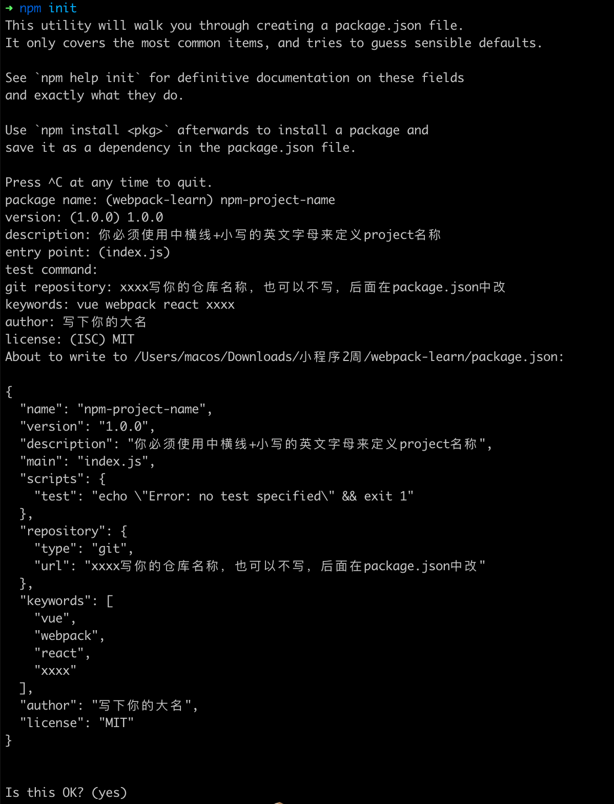

# Webpack导学

[[toc]]

随着 Web 前端的不断发展，传统网页开发在逐渐往 Web 应用（Web Application，简称 WebAPP）的开发方式转变，页面开始变得越来越复杂，复杂的应用场景必然引起技术的进步，出现新的技术手段来解决现有问题。

前端模块化和工程化的呼声越来越高，随着前些年大行其道的 Grunt、Gulp、FIS（百度） 等构建工具的发展，带动了一波前端工程化热。

近几年，经过 React、Vue 库这些年的扩张，大型 Webapp 不再局限于手写 jQuery 操作 DOM，让大型 Webapp 有了全新的开发体验。在这个过程中，前端逐渐发展成了模块化和单页应用（single-page application，简称 SPA）为主的形式，在这种形态和 React、Vue 这些库的普及下，Webpack 越来越被更多成为主流构建工具。

Webpack 绝不仅仅是一个打包工具，系统的学习 Webpack 之后，我们可以基于 Webpack 做很多提升研发效率的事情。作为笔试必考、面试必问、工作必用的内容，Webpack 正变得越来越重要，尤其对于大型公司，会不会 Webpack 甚至能直接决定你是否被录用。

**除了Webpack还有Vite（Vue的作者尤雨溪开发的）、Rollup、Parcel，也是打包工具，只是它们的应用面不一样。**


## 主要内容

- Webpack 开发配置
- Webpack 内核原理
- 工程化实践


## 官方资源

英文文档：[https://webpack.js.org/](https://webpack.js.org/)

中文文档：[https://webpack.docschina.org/](https://webpack.docschina.org/)


## 常见的问题

- 什么是模块化？

  模块化是指解决一个复杂问题时自顶向下逐层把系统划分成若干模块的过程，有多种属性，分别反映其内部特性。（百度百科）

  前端模块化一般指得是 JavaScript 的模块，最常见的是 Nodejs 的 NPM 包，每个模块可能是最小甚至是最优的代码组合，也可能是解决某些问题有很多特定模块组成的大模块。

  多模块化的规范：`CommonJS`、`AMD`和`ES6 Module`规范（另外还有`CMD`、`UMD`等）。

- 为什么是 Webpack？

  Webpack 是一个现代 JavaScript 应用程序的静态模块打包器（static module bundler）

- Webpack的工作流程是怎么样的？Webpack可以做什么？

  **webpack 是从入口文件开始，经过模块依赖加载、分析和打包三个流程完成项目的构建**。

  Webpack 还可以轻松的解决传统构建工具解决的问题：

  - 模块化打包，一切皆模块，JS 是模块，CSS 等也是模块；
  - 语法糖转换：比如 ES6 转 ES5、TypeScript；
  - 预处理器编译：比如 Less、Sass 等；
  - 项目优化：比如压缩、CDN；
  - 解决方案封装：通过强大的 Loader 和插件机制，可以完成解决方案的封装，比如 PWA；
  - 流程对接：比如测试流程、语法检测等。

- Webpack 中的概念有哪些？

  五大核心概念：入口、输出、插件、模块转化器、模式。

  


## 环境准备

### 安装Node.js

首先进入 [Node.js 的官网](https://nodejs.org/zh-cn/)，选择对应系统的[下载包](https://nodejs.org/zh-cn/download/)进行下载安装，对于 windows 用户，直接下载安装包安装即可，如果是 Macos 用户，推荐使用 [brew](https://brew.sh/index_zh-cn) 进行安装。

Node.js 版本众多，包括稳定版和开发版，可能不同的项目需要的 Node.js 版本不同，这里我推荐大家安装 8.9 以上版本，对于已经安装了 Node.js 的朋友，可以使用 [nvm](https://github.com/creationix/nvm)（[windows 版本](https://github.com/coreybutler/nvm-windows)）对 Node.js 进行进行版本管理，（另外阿里有个 [tnvm](https://github.com/aliyun-node/tnvm) ，也是管理 Node.js 版本的，增加了 alinode 版本系列的 Node.js）。


### Node.js 包管理工具

Node.js 之所以这么流行，离不开庞大的社区建设，这里第一功劳就是 NPM 团队的贡献，使用 Node.js 写的代码，可以打包发布到 JavaScript 包管理平台 [npmjs.com](https://www.npmjs.com/)（这个存放包的地方一般也被称为仓库）上，当我们项目需要使用某个包（模块）时，可以直接使用包管理工具来安装（下载）对应的包，我们也可以免费注册一个账号，发布自己的公共包和私有包供其他人使用。


NPM 是围绕着[语义版本控制（semver）](https://semver.org/lang/zh-CN/)思想而设计的，我们在软件版本中碰见的：rc、`1.x.x`、`alpha`、`beta`等名词都可以在 [semver.org](http://semver.org) 得到解释介绍，简单来说规范是`主版本号.次版本号.修订号`（`MAJOR.MINOR.PATCH`）：

1.主版本号：当你做了不兼容的 API 修改；
2.次版本号：当你做了向下兼容的功能性新增；
3.修订号：当你做了向下兼容的问题修正；

例如：

```json
{
    "name": "demo",
    "version": "1.0.0",
    "dependencies": {
        "webpack": "^4.29.6"
    }
}
```


- `name`：上面的代码就是表明了这个项目为`demo`，这样如果我们将来发布到 [npmjs.com](https://www.npmjs.com/) 会以这个来命名，除了这种方式的名称，还有一种命名的方式是`@scope/name`的方式，是`作用域包`，例如我们用来转化 ES6 语法的`@babel/core`就是`@babel`的作用域，详细介绍可以查看 [package.json 的文档](https://www.npmjs.cn/misc/scope/)
- `dependencies`：是`demo`这个项目的依赖，就是 demo 这个包内离开`webpack`这个包就不能使用了，对应的还有`devdependencies`，开发以来，一般需要二次开发 demo 的时候需要安装的包，实际项目中，`webpack`是构建工具，代码不会直接用 webpack 的 API，而只在开发和打包的时候采用，所以正确做法是放在`devdependencies`中。

注意到`dependencies` 中`webpack` 的后面版本号前面加了`^`，意思是主版本是`4`的最新版本，每次执行安装命令的时候，会更新符合这个规则的最新包，可以在[npm semver range 部分](https://www.npmjs.cn/misc/semver/#ranges)看到更详细的介绍。


### NPM 的常用命令

下面介绍下 NPM 的常用命令：安装、删除、初始化、配置。

#### **安装和删除**

安装某个 NPM 包，使用命令：

```
npm install packageName

// 简写 
npm i packageName

// 安装特定版本
npm i packageName@x.x.x

// 删除某个 NPM 包
npm uninstall 包名

// dependencies
npm i packageName --save

// devdependencies
npm i packageName --save-dev

// 或者
npm i packageName -D
```

如果执行命令的目录下有`package.json`，则可以直接用`npm install`安装`package.json`中的所有依赖。


#### 本地模式和全局模式

npm 的包安装，分为本地模式和全局模式，默认是本地模式，即在执行`npm install`命令的当前目录创建`node_modules`，然后下载安装包及其依赖到`node_modules`目录。

全局模式是指安装到全局路径的方式。在 Node.js 的 require 依赖之时，会优先查找自己当前文件的`node_modules`，如果没有，则循环遍历上层的`node_modules`，如果便历到根目录还找不到，则会使用全局模式安装的模块，另外全局模式安装的包可以指定全局命令，只需要在`package.json`增加`bin`字段并且指向包内对应的文件即可。全局安装一个包，使用命令`npm install --global`，`--global`可以简写为`-g`。


#### 初始化一个 NPM 项目

npm init 用来初始化生成一个新的 package.json 文件。

输入`npm init`并且根据对应的提示回答问题，会向用户提问一系列问题。

如果你觉得不用修改默认配置，一路回车就可以了。



> 如果使用了 `-f`（代表`force`）、`-y`（代表`yes`），则跳过提问阶段，直接生成一个新的 `package.json` 文件。
>


#### 设置 NPM 镜像

由于 NPM 网站经常不稳定，所以国内有很多镜像可以使用，[淘宝 NPM 镜像](https://npm.taobao.org/)是国内最大的一家 NPM 镜像网站，还有`cnpm`包可以替换官方 NPM 来使用，使用`cnpm`直接使用淘宝镜像安装 NPM 包。

单次使用镜像方法：

```shell
npm [命令] --registry=https://registry.npmmirror.com
```

设置默认 npm 使用淘宝镜像方法：

```shell
npm config set registry https://registry.npmmirror.com
```

使用下面的命令可以安装 cnpm 包，之后直接像使用 npm 一样使用 cnpm 即可，不需要添加`register`

```shell
npm install -g cnpm --registry=https://registry.npmmirror.com
```


#### NPM 其他常用命令

- npm set：设置环境变量，例如：`npm set init-author-name 'Your name'`，初始化的时候会使用默认环境变量；
- npm info：查看某个包的信息，例如：`npm info lodash`；
- npm search：查找 npm 仓库，后面可以跟字符串或者正则表达式，例如：`npm search webpack`；
- npm list：树形的展现当前项目安装的所有模块，以及对应的依赖，例如：`npm list --global`查看全局安装的模块。

> 可以使用npm --help查看


### NPM Scripts

NPM 不仅可以用于模块管理，还可以用于执行脚本。

`package.json` 文件中可以添加 `scripts` 字段，用于指定脚本命令，供 NPM 直接调用。例如：

```json
// package.json
{
    "scripts": {
        "build": "webpack",
        "start": "node src/scripts/dev.js"
    }
}
```

在`package.json`添加上面字段之后，可以直接使用`npm run build`和`npm run start`命令了，实际上：

- `npm run build`：相当于执行了当前项目中目录下的`webpack`命令；
- `npm run start`：相当于执行了`node src/scripts/dev.js`。

另外`npm run start`还可以简写成`npm start`。

> Tips：除了 npm 外，还有一些包管理工具，主要是针对 npm 的下载速度慢、`node_modules` 混乱等缺点设计的，例如[yarn](https://yarnpkg.com/)和 [pnpm](https://pnpm.js.org/)。


### 安装 Webpack-cli

[Webpack-cli](https://github.com/webpack/webpack-cli)是 Webpack 的 CLI （Command-line interface）工具，如果在项目中，我们可以使用下面的方式安装：

```
npm install webpack-cli --save-dev
```

如果想全局使用`webpack`的命令，可以使用`npm install -g webpack-cli`安装。

> Tips：这里建议在项目中安装 webpack-cli 并且使用 `--save-dev` 的配置将 webpack-cli 放到开发依赖中。

后面使用webpack可以有两种方式：

- 配置scripts脚本

  ```
  "build": "webpack"
  ```

- 使用`npx`命令

  ```
  npx webpack
  ```

  