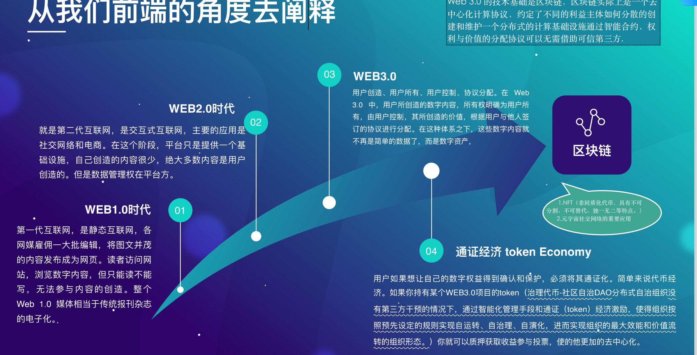
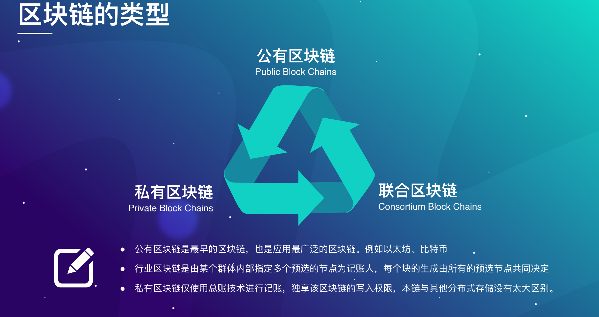
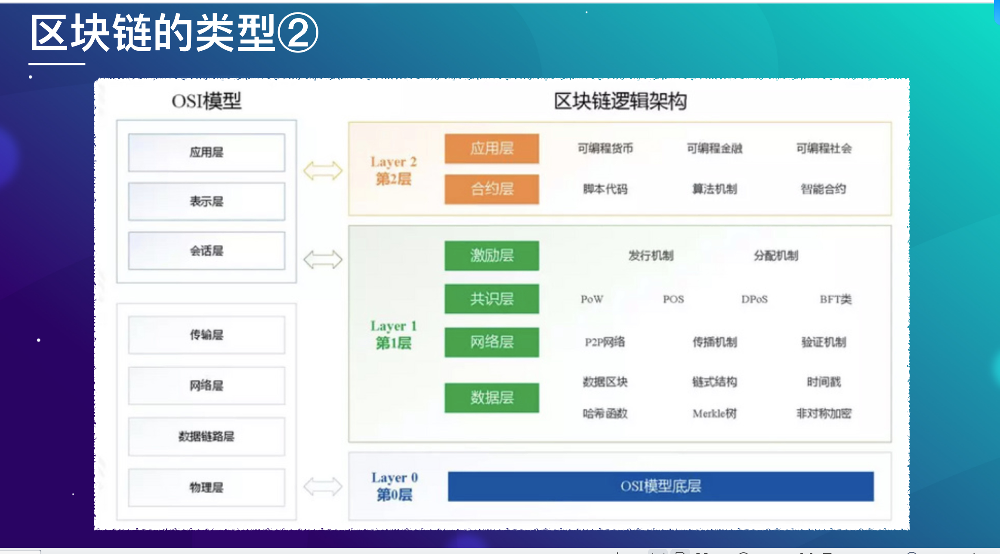
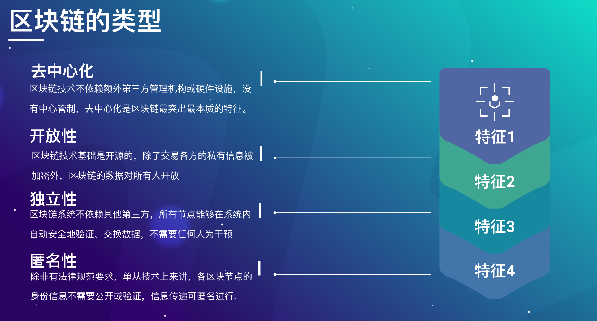
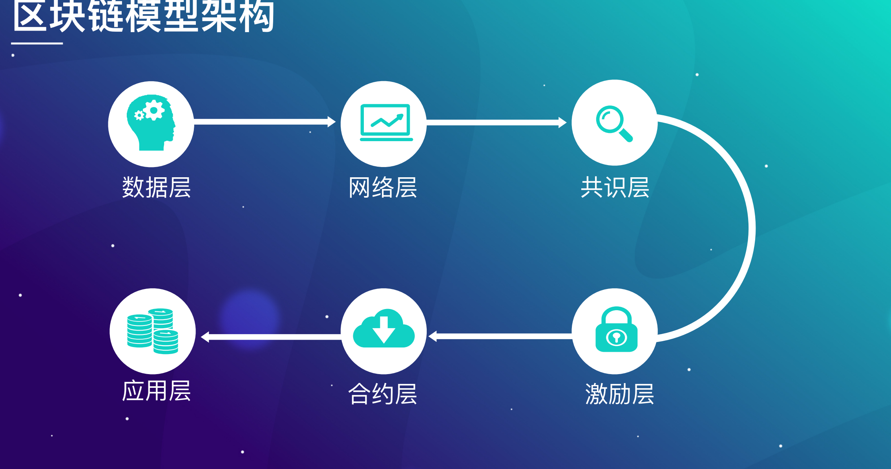
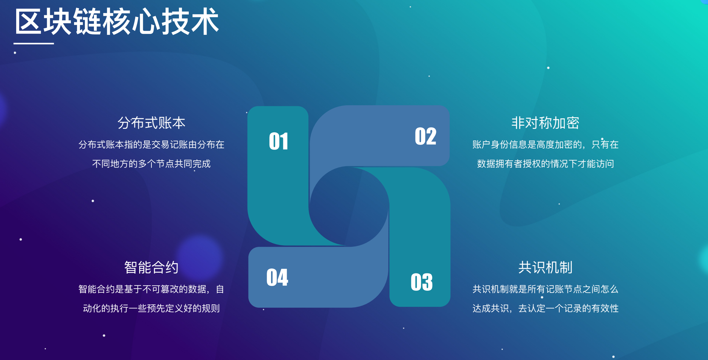
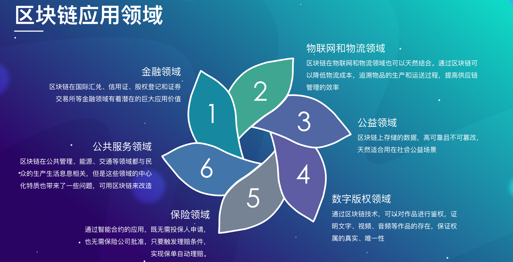
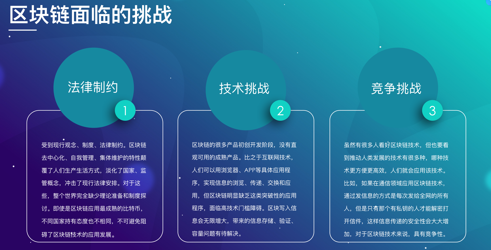
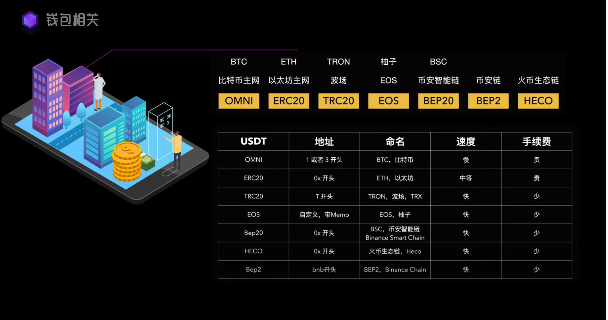

# 公链

etherscan.io


1.公链 区块链 特性 

## 区块链技术起源

```text
区块链技术来源
区块链起源于比特币，它基于P2P网络技术，加密技术，时间戳，区块链技术等电子现金系统的架构理念
```

### 从前端角度去阐释



## 区块链技术类型余特征

区块链可以根据其访问权限、参与者类型和去中心化程度进行分类，主要分为以下几种类型：



1. 公有链（Public Blockchain）

公有链是完全去中心化的区块链网络，任何人都可以加入、查看、验证和参与区块链的运行。这是最开放的一种区块链，所有数据都是公开透明的，任何人都可以成为节点并参与区块的创建和验证。

特点：

开放性：任何人都可以读取数据、发送交易和参与区块验证（共识过程）。

去中心化：没有中心化的控制方，所有节点对网络有平等的控制权。

透明度高：所有交易和信息是公开透明的，任何人都可以查看区块链上的数据。

例子：

比特币（Bitcoin）

以太坊（Ethereum）

2. 私有链（Private Blockchain）

私有链是一个封闭式的区块链网络，仅由授权的成员参与。通常由一个组织或企业控制，网络中的参与者需要经过许可才能加入。这种类型的区块链主要用于企业或组织内部的应用场景，以提高效率、安全性和隐私性。

特点：

权限控制：只有授权的参与者才能访问网络，并且网络控制权通常集中在某个组织手中。

效率高：由于参与者数量有限，共识过程相对快速，交易处理速度也较快。

隐私性强：数据不向公众开放，企业可以保护其商业秘密和敏感信息。

例子：

Hyperledger Fabric

R3 Corda

3. 联盟链（Consortium Blockchain）

联盟链是介于公有链和私有链之间的区块链类型，由多个组织或企业共同管理和控制。参与的成员通常是特定行业的企业、机构等，这些成员之间通过联盟链进行合作。联盟链的参与者需要经过许可才能加入，但相比私有链，联盟链的控制权更分散，通常由多个组织共同决策。

特点：

半去中心化：管理权和控制权分布在多个组织之间，参与者共同维护区块链网络的运行。

高效率：由于只允许经过授权的成员参与，联盟链的共识机制较快。

更高的隐私和安全性：只允许授权成员访问链上的数据，适合需要一定程度隐私的业务场景。

例子：

Quorum（基于以太坊的联盟链）

EWF Chain（能源领域的联盟链）

4. 混合链（Hybrid Blockchain）

混合链是公有链和私有链的结合体，提供了灵活的设计，允许某些部分对公众开放，另一些部分则对特定授权的参与者开放。混合链旨在结合公有链的透明性和私有链的隐私性，以适应多种场景需求。

特点：
灵活性：可以根据需要设定不同的访问权限和控制级别，适用于需要部分公开透明、部分保密的场景。
部分去中心化：不同的部分由不同的权限层进行控制，可以根据需求设置去中心化程度。

例子：

Ripple（混合链架构，既有公有部分也有私有部分）

总结：

区块链的类型可以根据去中心化程度和访问权限分为以下四类：

公有链：完全开放、去中心化，适合任何人参与（如比特币、以太坊）。

私有链：由一个组织控制，参与需要授权，主要用于企业内部应用。

联盟链：由多个组织或企业共同控制，适用于多个合作方之间的行业应用。

混合链：结合公有链和私有链的特点，提供部分公开、部分私有的解决方案。

不同类型的区块链适用于不同的应用场景，具体选择取决于对去中心化、透明度、效率和隐私的需求。










### 区块链核心技术

1. 侧链：为方便数字资产在不同区块链间互相转移，侧链（Sidechain）技术应运而生。简单地说，侧链就像是一条条通路，将不同的区块链互相连接在一起，以实现区块链的扩展。侧链完全独立于比特币区块链，但是这两个账本之间能够“互相操作”，实现交互。 

2. 挖矿：比特币矿工透过解决具有一定工作量的工作量证明机制问题，来管理比特币网络 —— 确认交易并且防止双重支付，通过爆块获得奖励。 

3. 流动性挖矿：除了正常收益之外，用户向 DeFi 市场中的借贷双方提供系统流动性而获得的奖励。 

4. 空投：区块链领域的空投是一种将数字货币通过区块链技术大规模分发到一些已有的数字货币，空投在区块链领域亦视作一种提升一个产品概念影响力的市场策略。 

5. 滑点：一般指真实的成交价位与预设的成交价位间出现偏移，这种偏移一般是向不利于交易者的方向移动，导致交易出现额外的损失（可以是正向或者负向）出现在低流动性和高波动性的时候。 

6. Defi 是把传统的一些金融去掉中间商，来降低成本。去中心化金融 


## 区块链技术应用领域



## 区块链技术面临的挑战



2.代币 BTC
3.代币浏览器 区块链浏览器
4.矿工


## 金融术语 

### 金（U）本位币本位

> BTC/USDT 右侧就是用谁买。左侧的币价要能够跑赢右侧的币价。熊市我们更期望币本位去屯币牛市卖掉

1. BTC/USDT：这是一个交易对，表示你用 USDT（Tether，和美元等值的稳定币）来购买 BTC（比特币）。在交易所的行情中，右侧的 USDT 代表你用 USDT 来买 BTC。

2. 右侧就是用谁买：指的是用右侧标记的资产（这里是 USDT）来买左侧的资产（这里是 BTC）。也就是说，BTC/USDT 意味着用 USDT 购买 BTC。

3. 左侧的币价要能够跑赢右侧的币价：这句话的意思是，你希望左侧资产（BTC）的价格上涨超过右侧资产（USDT）的价值增长。在币本位的思路下，你的目标是持有的 BTC 价值增值，即 BTC 相对 USDT 或其他资产增值。这样你持有的 BTC 就会变得更值钱。

4. 熊市我们更期望币本位去屯币牛市卖掉：熊市是指市场整体下跌或萧条的时期。在熊市期间，人们更倾向于使用“币本位”的思路，即通过交易或投资积累更多的 BTC 或其他数字货币，因为价格较低。而等到市场进入牛市（上涨或繁荣时期），币价上涨时再卖出，获得更高的回报。

简单总结：

在熊市时，投资者希望积累更多的数字货币（如 BTC），等到牛市时，这些资产的价格上涨，再卖出以获取利润。币本位的策略侧重于在熊市期间积累币种数量，牛市时通过高价卖出这些币来获利。

“金（U）本位” 是指货币体系中，以黄金或类似的贵金属为基础，并由特定国家或区域发行法定货币作为标准货币单位的一种货币制度。其中，黄金本位是指货币的价值直接与黄金挂钩，纸币和硬币的发行有一定比例的黄金储备作为支持。

“U” 则通常指“美元”（US Dollar），如果提到“金（U）本位”，可能是在讨论某种货币制度下，既涉及黄金，也与美元挂钩。这种情况并不属于传统的黄金本位制，更多可能是一种理论或讨论，涉及黄金的价值或储备作为支持，同时美元可能在全球货币体系中发挥某种类似黄金本位的作用。

在现代货币体系中，绝大多数国家已经放弃了黄金本位制，转而采用信用货币体系，即货币的价值主要由国家的信用和经济实力来支持，而不再直接与黄金挂钩。美元由于其国际储备货币的地位，在全球金融体系中占据重要位置，因此有时被称为“美元本位”。

“币本位” 是指一种货币制度，在这种制度下，货币的价值由某种形式的货币或法定货币（通常是国家或地区发行的）作为标准单位，而不再与贵金属或其他实物资产（如黄金、白银等）直接挂钩。币本位的核心特点是，货币的价值主要依赖于国家的经济实力、财政政策、货币政策及其政府信用，而不需要实际的实物支持。

现代经济体系大多采用的就是这种“币本位”或“信用货币”制度，也被称为“法定货币”制度。此体系下：

法定货币：由政府或央行发行，国家规定它是唯一的合法支付手段，货币本身没有内在价值，其价值由国家和市场对其信用和接受度决定。
不依赖实物支持：币本位不同于过去的黄金或白银本位，货币不再需要有与黄金或其他贵金属等值的储备来背书，流通的货币数量和价值更多是由中央银行的货币政策和国家的经济状况决定的。
经济调控工具：政府和央行可以通过调控货币供应、利率、财政政策等手段，影响货币的价值，从而调节经济活动。
简而言之，币本位意味着货币的价值主要是由国家信用及其经济制度来支撑，而非依赖某种实物资产。


### 开仓、平仓、做空、做多

1. 开仓也叫建仓，开仓有两个交易方向，如果投资者看涨行情，买入开多（做多）一定数量的标准合约，持有多仓（多头）
2. 如果看跌行情，卖出开空（做空）一定数量的标准合约，持有空仓（空头）
3. 平仓是指投资者清空或减少仓位，如果投资者持多仓，看跌行情，可以卖出平多，减少其所持有的合约仓位；如若持空仓，看涨行情，可以买入平空，减少所持有合约仓位

1. 开仓（建仓）有两个交易方向

看涨行情：当投资者预期市场价格会上涨时，他们会选择买入开多，也就是购买一定数量的标准合约，称之为“做多”。此时，投资者持有的仓位被称为多仓（或多头）。持有多仓意味着投资者预期未来市场价格上涨，打算在未来以更高的价格卖出获利。

例子：如果你认为某资产的价格从现在的100美元会上涨到150美元，你可以买入开多，在150美元时卖出从而获利。
看跌行情：如果投资者认为市场价格将下跌，他们可以选择卖出开空，即卖出一定数量的标准合约，称为“做空”。此时，投资者持有的仓位被称为空仓（或空头）。持有空仓意味着投资者预期价格会下跌，打算在未来价格下跌时买回以获利。

例子：如果你认为某资产的价格从100美元会下跌到70美元，你可以卖出开空，等价格下降时以70美元买回，从而获得差价。

2. 平仓：清空或减少仓位

平仓是投资者用来结束或减少他们当前持有的仓位的操作。它有两种情况：

持有多仓，看跌行情：如果投资者持有多仓（多头），但是市场开始走跌，此时他们可以卖出平多，即通过卖出所持有的多头合约来减少仓位。这种操作是为了避免市场下跌带来的损失。

例子：如果你持有某资产的多仓（比如你在100美元时买入），现在市场行情看跌，你可以卖出平多来保护自己免受未来价格下跌的损失。
持有空仓，看涨行情：如果投资者持有空仓（空头），但是市场开始上涨，此时他们可以买入平空，即通过买入之前卖出的合约来平仓。这样可以减少仓位，避免市场上涨带来的损失。

例子：如果你之前卖出开空了某资产（比如在100美元时卖出），但是现在市场行情上涨，你可以在120美元时买入平空，从而避免进一步的亏损。

总结

开仓（建仓）：是指投资者首次建立一笔交易仓位。看涨行情时，买入开多，持有多仓；看跌行情时，卖出开空，持有空仓。

平仓：是指投资者结束或减少他们持有的仓位。如果持有多仓但市场看跌，卖出平多；如果持有空仓但市场看涨，买入平空。

这种操作广泛应用于期货、合约和衍生品市场，帮助投资者根据市场预期调整仓位，控制风险或锁定利润。


### 做市商、自动做市商AMM

做市商制度是一种报价驱动制度。做市商根据自己的判断，不断地报出买入报价和卖出报价，以自有资金与投资者进行交易。做市商获取的收益就是买入价和卖出价的价差。假设做市商以6344卖出一手合约，同时以6333买入一手合约。如果都成交，做市商可净获利11个点。但如果当时合约价格持续走高或走低，做市商没有对手方能够成交，这时就不得不提高自己的买价或降低自己的卖价进行交易，做市商就会亏损。因此，做市商并不是稳赚不赔的。自动做市商即AMM，它能根据简单的定价算法自动计算出买卖价格，我们可以把它想象为一个进行买卖交易的机器人。他解决了传统交易所过渡到DEX（去中心化交易所）中出现的成本和效率问题。 传统的中心化交易所上的订单薄做市模式在区块链上运作起来出现了很多问题，所以就创新了AMM自动做市商。

AMM（自动做市商）是去中心化交易所（DEX）中一种创新的做市方式，使用算法自动为交易对提供流动性。

AMM 的工作原理：与传统做市商需要人工不断调整买卖价格不同，AMM 使用定价算法（例如常见的恒定积公式，即 x * y = k）来自动计算买卖价格。当投资者想要交易时，他们与智能合约互动，而不是依赖于中心化做市商。AMM 本质上是一个自动执行买卖交易的“机器人”。

例子：

在 AMM 中，流动性提供者（LP）将一对资产（如 ETH 和 USDT）注入流动性池，算法根据池中资产的比例自动计算每次交易的价格。这样，即使没有传统的订单簿，也能为交易者提供即时的买卖交易机会。

AMM 的优势：

解决了传统做市商的成本和效率问题：传统的订单簿做市模式在去中心化的区块链上操作起来有很多困难，如流动性不足或操作效率低下。AMM 不需要人工干预，可以24/7提供买卖价格。

去中心化：AMM 不依赖于中心化的做市商，而是由流动性提供者注入资金，智能合约通过算法执行交易。

总结：

做市商是通过主动报出买卖价格来提供流动性，赚取价差，但面临着市场波动的风险。

**自动做市商（AMM）**是去中心化交易所中的一种创新，使用算法自动设定价格，减少了人工干预，提高了效率，解决了传统订单簿模式的局限。

AMM 在去中心化金融（DeFi）领域应用广泛，如 Uniswap、SushiSwap 等都是基于 AMM 的交易平台。


### 对冲 

特意减低另一项投资⻛险的投资。 它是一种在减低商业⻛险的同时仍然能在投资中获利的手法。 一般对冲是同时进行两笔行情相关、方向相反、数量相当、盈亏相抵的交易。 行情相关是指影响两种商品价格行情的市场供求关系存在统一性，供求关系若发生变化，同时会影响两种商品的价格，且价格变化的方向大体一致。

对冲是一种风险管理策略，旨在通过进行两笔或多笔方向相反、但相关的交易，来减少或抵消投资中的风险。虽然对冲主要是为了减低风险，但投资者仍然希望在对冲过程中能获得盈利。以下是对冲的核心要点：

1. 对冲的定义
对冲是指投资者在拥有某项资产或投资的同时，进行另一笔方向相反的交易，以减少市场波动带来的不确定性。简单来说，它是一种通过“以风险换取安全”的策略，以抵消另一笔交易可能带来的损失。

2. 对冲的运作方式
对冲通常是通过同时进行两笔或多笔行情相关、方向相反且数量相当的交易来实现。投资者的盈亏可以相互抵消，从而减少风险。

行情相关：对冲中的交易标的通常是两个价格相关性较高的商品或资产。这意味着它们受相似的市场供求关系影响，价格走势大体一致。比如，某种原材料和其衍生品之间可能存在价格相关性。

方向相反：对冲通常是在一个市场上做多（买入）某种资产，同时在另一个相关市场上做空（卖出）另一个资产。这样可以确保即使一个市场出现不利波动，另一个市场的有利波动可以部分或全部抵消这部分损失。

数量相当：这意味着在两笔交易中，买入和卖出的数量应当基本相等，确保风险对冲的效果。

3. 对冲的例子
股票对冲：假设你持有某个公司的股票，但担心短期内股市波动较大。你可以通过做空股指期货或买入看跌期权来对冲股市下跌的风险。如果股票价格下跌，期货或期权的盈利可以抵消股票的损失。

商品对冲：假如一家航空公司需要大量燃料，并且担心未来燃料价格上涨，他们可以通过买入原油期货锁定燃油成本。如果未来油价上涨，航空公司在现货市场上的损失将被期货市场上的盈利抵消。

4. 对冲的目的

降低风险：对冲的主要目的是减低投资的风险，而不是为了投机。投资者通过同时进行方向相反的交易来减少市场波动对投资组合的负面影响。

保留获利机会：虽然对冲是为了降低风险，但理想的情况是，投资者可以通过对冲策略仍然在市场波动中获得部分盈利。

总结：
对冲是一种用于减少投资风险的策略，通常通过同时进行两笔行情相关、方向相反的交易来实现。虽然对冲可能减少潜在收益，但它的主要目的是保护投资者免受不利市场波动带来的损失，从而在降低风险的同时保留一定的获利机会。

### 挖矿、流动性挖矿、LP(Liquidity Provider)

1挖矿：是指透过执行工作量证明或其他类似的电脑算法来获取加密货币，例如比特币、以太币、莱特币等。由于此名称源自对采矿的比喻，进行挖矿工作的人通常称为
矿工。

2.流动性挖矿：流动性挖矿是Defi去中心化金融的一种，不需要买显卡、贡献算力、支付昂贵的电费，而是透过提供资金、提供流动性的方式获取收益。尤其最近币价起伏大，对于一些坚定的持币者来说，流动性挖矿就一种在不交易的情况下能够获取收益、累积更多加密货币的方法。

### 滑点 无常损失

1. 滑点，一般指真实的成交价位与预设的成交价位间出现偏移，这种偏移一般是向不利于交易者的方向移动，导致交易出现额外的损失。
2. 无偿损失：
    
   X *Y =K

   X=10ETH

  Y=5000USDT 当所持代币的价格与存入资金池时相比发生变化时，就会产生无常损失。价差越大，无常损失便越大。https://academy.binance.com/zh/articles/impermanent-loss-explained


### 砸盘

砸盘分为两种，一种是上升过程中，庄家要对跟⻛筹码做一次清洗，在某个价格大幅度抛空股票，造成下跌假象，引诱散户和跟⻛者卖出，另一种发生在某个股票庄家完成了做庄的目的，股价相当高的时候，庄家通过大幅度抛出股票砸盘，达到出逃的目的。

砸盘是一种市场操作行为，主要由大资金持有者（如庄家、大户或机构）通过大量抛售某种资产，导致其价格急剧下跌，通常用于达到特定的目的。根据目的不同，砸盘可以分为两种情况：

1. 清洗跟风盘

在市场的上升过程中，庄家为了让股价继续上涨、但又不想让太多散户跟随自己的操作获利，可能会采取砸盘的策略。这种砸盘行为是为了“洗盘”，即通过大幅度的抛售来制造股价下跌的假象，诱导跟风的散户或其他投机者卖出手中的股票。

目的：庄家想清洗跟风者，让散户误以为股价见顶，从而卖出手中的筹码。这样做可以减轻市场中的抛压，同时庄家可以在较低价格重新吸筹，以便后续继续推高股价。

操作：庄家在某个阶段突然大量抛售，导致股价大幅下跌，形成一种短暂的恐慌情绪，吸引散户出货。然而，一旦清洗跟风盘完成，庄家可能会再次推高股价。

2. 高位出货

另一种砸盘发生在庄家已经达到了“做庄”的目的，股价在高位时，庄家为了获利或退出市场，会通过大规模抛售股票来实现出货。

目的：庄家通过长时间的操控，已经将股价推到一个较高水平，此时为了锁定利润或撤出市场，庄家会在高位抛售股票。当庄家出货后，股票价格通常会暴跌，其他投资者可能因跟风买入而蒙受损失。

操作：庄家在高位时突然大量抛售股票，导致股价急剧下跌，可能直接引发市场恐慌，最终庄家完成套现出逃。

``砸盘的风险``

对于散户或普通投资者来说，砸盘往往是一种风险较高的市场现象，因为在砸盘期间，股价的大幅波动容易导致心理恐慌，使投资者在错误的时间买入或卖出。

对于庄家而言，砸盘操作需要大量的资金支持，并且需要在时机选择上非常精准，特别是高位出货时，如果市场反应不佳，庄家也可能面临无法顺利出逃的风险。

总结：

清洗跟风盘砸盘：上升过程中，庄家通过抛售制造下跌假象，诱导散户卖出，随后再次推高股价。

高位出货砸盘：庄家在高位抛售手中筹码，造成股价急跌，以达到获利出逃的目的。

砸盘是一种较为激烈的市场操作行为，投资者应提高警惕，避免在行情急剧波动时盲目跟风。

### Defi/Gamefi、搬砖套利、对冲搬砖、Delta值

1. DeFi的全称是Decentralized Finance,即"去中心化金融”，也被称为“开放式金融”，当前几乎全部的DeFi项目都在以太坊的区块链上进行。

2. Delta值(δ)，又称对冲值，指的是衡量标的资产价格变动时，期权价格的变化幅度。用公式表示：Delta=期权价格变化/标的资产的价格变化。


1. DeFi（Decentralized Finance，去中心化金融）

DeFi 是一种基于区块链技术的金融系统，去除了传统金融机构（如银行、证券公司等）作为中介，允许用户通过智能合约和去中心化平台直接进行金融交易和操作。它被称为“开放式金融”，因为它不依赖于中心化的监管机构，任何人都可以参与和使用。

主要特点：

去中心化：通过区块链和智能合约技术，实现去除中介的金融交易。
全球开放性：只要有互联网，任何人都可以参与，无需银行账户或复杂的身份验证。
智能合约：DeFi 平台中的所有规则和条件都写入智能合约，自动执行金融操作，如借贷、交易和收益分配。
以太坊是主流平台：当前几乎所有的 DeFi 项目都是在以太坊区块链上运行的，因为以太坊的智能合约技术是支持这些复杂金融操作的关键。

2. GameFi（游戏金融）

GameFi 是将“游戏”和“去中心化金融”结合的一个新兴领域。通过将区块链技术引入游戏行业，玩家可以在游戏中获得代币、NFT（非同质化代币）等资产，并且这些资产可以在区块链上交易、投资或通过 DeFi 操作来获利。

特点：
玩家通过玩游戏获得经济回报，比如游戏中的虚拟货币可以在真实世界中交易。
GameFi 通常与“Play to Earn（边玩边赚）”概念相关联，玩家不仅可以享受游戏的乐趣，还能通过玩游戏获得加密货币。

3. 搬砖套利

搬砖套利 是指利用不同交易平台之间的价格差异进行低买高卖，以赚取差价的交易方式。它通常在加密货币市场中出现，因为不同交易所可能会在短时间内对同一种加密货币有不同的报价。

例子：假设 BTC 在交易所 A 上的价格为 60,000 美元，而在交易所 B 上的价格为 60,500 美元，投资者可以在 A 交易所买入 BTC，并立即在 B 交易所卖出，赚取 500 美元的差价。

4. 对冲搬砖

对冲搬砖 是一种更复杂的套利方式，投资者在进行搬砖套利的同时，使用金融工具（如期权、期货或杠杆交易）对冲潜在风险。由于市场价格随时可能波动，投资者通过对冲策略可以减少价格波动对套利收益的影响。

例子：假设你在 A 交易所低价买入 BTC，同时在 B 交易所高价卖出 BTC，但担心 BTC 的价格在搬砖套利过程中下跌，那么你可以使用期货或期权合约对冲 BTC 价格的下行风险，从而确保利润。

5. Delta 值（δ）

Delta 值 是期权交易中的一个重要指标，用于衡量期权价格对标的资产价格变动的敏感度。具体来说，Delta 值表示标的资产价格变动时，期权价格的变化幅度。它是用来帮助投资者评估和管理期权交易中的风险。

公式：Delta = 期权价格变化 / 标的资产价格变化

意义：

Delta 值范围：对于看涨期权，Delta 值通常在 0 和 1 之间。对于看跌期权，Delta 值在 -1 和 0 之间。

解释：如果某个看涨期权的 Delta 值为 0.6，意味着标的资产价格每上涨 1 单位，期权价格将上涨 0.6 单位。

Delta 值通常用于对冲策略中，帮助投资者评估标的资产价格变化对其期权组合的影响。

例如，如果 Delta 值接近 1，意味着期权价格与标的资产价格非常紧密地联动。

总结：
DeFi：去中心化金融，基于区块链技术去除传统金融中介。

GameFi：结合游戏和去中心化金融，让玩家在玩游戏的同时可以通过区块链技术赚取收益。

搬砖套利：利用不同交易平台之间的价格差异，通过低买高卖来赚取差价。

对冲搬砖：在搬砖套利的基础上，通过使用金融工具对冲风险，减少市场波动带来的影响。

Delta 值：期权交易中的对冲值，用来衡量标的资产价格变化对期权价格的影响。

这些概念在加密货币市场和期权交易中应用广泛，帮助投资者通过各种策略获利的同时控制风险。

### 插针

插针就是在某种加密货币的价格震荡中，在某个时间点价格迅速冲高或下跌，然后又迅速的恢复到正常的价格水平。在K线图上就会表现出一条很长的向上或向下的影线，像一个针的形状，所以将其形象的命名为“插针”。一般来说，插针对于现货交易没有什么影响。

### 空投

区块链领域的空投是一种将数字货币通过区块链技术大规模分发到一些已有的数字货币，空投在区块链领域亦视作一种提升一个产品概念影响力的市场策略。

空投（Airdrop）在区块链领域是指项目方通过区块链技术，将数字货币免费或基于一定条件大规模分发给特定用户或已有的数字货币持有者。这是一种常见的市场推广策略，旨在提升项目知名度、扩大用户群体和增加市场影响力。

空投的运作方式：

免费分发：项目方通常会根据用户持有某种数字货币的数量、参与特定活动、或符合其他条件，将他们的新发行的代币直接发送到这些用户的钱包中。例如，持有某个特定数字货币（如以太坊、比特币）的用户会获得新项目的代币作为奖励。

提升项目知名度：通过免费分发代币，项目方能够迅速吸引大量用户的关注，激励用户了解和使用他们的项目，从而提升产品或服务的知名度。

市场策略：空投不仅是吸引用户的一种方式，还能促使代币在交易所中获得更多的交易流动性。用户在收到空投的代币后，可能会在市场中进行交易或传播，从而帮助项目建立初期的社区和市场基础。

空投的种类：

持币空投：如果你持有某种数字货币（如比特币或以太坊），你可能会根据持有量的多少，获得相应数量的新代币。

任务空投：有些项目会要求用户完成特定任务（如注册平台、分享社交媒体内容、参与社区讨论等），以此作为条件获得空投代币。

随机空投：有些项目会随机向某些用户或社区成员发送空投代币，以此鼓励活跃用户或奖励忠实的支持者。

目的：

扩大用户基础：通过空投可以吸引更多用户参与项目或使用平台。

激励持有和交易：当用户获得免费的代币时，他们可能会交易或持有这些代币，从而增加代币的市场流动性。

促进社区建设：空投能让用户对项目产生兴趣，并激励他们参与项目的进一步发展，如传播项目信息、参与社区活动等。

总结：

区块链领域的空投是一种通过免费或基于条件的方式，向用户分发数字货币的市场策略。

其主要目的是推广项目、扩大用户群体，并在市场上增加代币的流动性和影响力。


### 市价单、限价单、止盈止损单、OTC

1. 场内交易有固定的场所（证券交易所），在固定的时间、按一定规则进行；场外交易没有固定的场所和固定的时间，通过电话也可以成交；

2. 场内交易是一种竟价交易方式，是按最高还价或最低还价成交的，场外交易是随行就市，通过买卖双方讨价还价，直接协商决定成交价格，采用议价交易方


1. 市价单（Market Order）

市价单是一种按照市场当前价格立即执行的订单。也就是说，交易者下达市价单后，系统会以当时市场上最优的价格（即买一价或卖一价）立即执行交易。

特点：市价单追求快速成交，但价格可能因为市场波动而偏离交易者的预期。

适用场景：适合希望快速进入或退出市场，而不在意短期价格波动的交易者。

例子：

假设当前 BTC 的市场价格为 30,000 美元，买家通过市价单购买 BTC，系统会立即按照最接近的卖方报价成交。

2. 限价单（Limit Order）

限价单是指交易者设定一个希望买入或卖出的价格，只有当市场价格达到这个预设价格或更优时，订单才会执行。限价单的核心是交易者设定了具体的成交价格，但不一定能立即成交。

特点：限价单确保了交易者能以预期价格成交，但有可能订单无法被及时执行，甚至可能永远不成交。

适用场景：适合希望在特定价格买入或卖出资产，不急于即时成交的交易者。

例子：

假设 BTC 当前市场价格为 30,000 美元，你可以设置一个限价单以 29,500 美元买入 BTC，只有当市场价格跌至或低于 29,500 美元时，订单才会执行。

3. 止盈止损单（Stop Order / Stop-Loss / Take-Profit Order）

止盈止损单是帮助交易者在市场波动时自动控制风险的一种订单类型。它可以预设一个价格，当市场价格达到或超过该水平时，系统会自动执行买入或卖出操作。

止盈单（Take-Profit Order）：当资产价格达到交易者设定的目标价格时，自动卖出以锁定盈利。

止损单（Stop-Loss Order）：当资产价格跌到交易者设定的下限价格时，自动卖出以避免进一步损失。

特点：止盈止损单帮助交易者锁定盈利或控制损失，尤其在无法时时关注市场时非常有用。

适用场景：适合需要在特定价格自动交易，以控制风险的交易者。

例子：

你以 30,000 美元买入 BTC，预期 BTC 会涨到 35,000 美元，你可以设置一个止盈单，当 BTC 达到 35,000 美元时自动卖出。此外，你可以设定一个止损单，若 BTC 跌到 28,000 美元时自动卖出，以避免更多损失。

4. OTC（Over-The-Counter，场外交易）

**OTC（场外交易）**是一种不通过公开市场或交易所，而是通过私下协商进行的交易方式。在 OTC 交易中，买卖双方通过经纪商或平台进行交易，价格可以由双方协商决定，而不是通过市场供需来确定。

特点：OTC 交易具有私密性和灵活性，通常用于大宗交易，避免因大额买卖单在公开市场上造成价格波动。

适用场景：适合进行大额交易的投资者或机构，或者在市场流动性不足的情况下想以协商价格进行交易的投资者。

例子：

如果某机构希望一次性买入大量的 BTC，在交易所上发布大额市价单可能会导致价格波动。通过 OTC 渠道，机构可以与卖方协商，以私下约定的价格进行交易，从而避免市场波动。

总结：

市价单：以当前市场价格立即执行的订单，优先保证成交速度。

限价单：设定目标价格的订单，只有当市场价格达到该目标时才会执行，确保价格但不一定能及时成交。

止盈止损单：设定自动卖出或买入条件，帮助控制风险或锁定盈利。

OTC（场外交易）：私下协商进行的交易方式，通常用于大额或特定的市场外交易，避免公开市场的波动。

这些工具各自适用于不同的交易需求，帮助交易者在不同市场环境中更好地管理风险和收益。


### 机枪池

机枪池是根据实时挖矿收入的水平来挖相同算法的不同货币的过程，在挖矿过程中，机枪池自动将算力切换到更高收益的货币。它的价值在于为用户创造比单一货币更多的价值。从挖
矿中获得更高的利润。之所以称为“机枪池”，是因为该操作就像不断切换的机枪一样。


## 钱包相关




## 交易所


