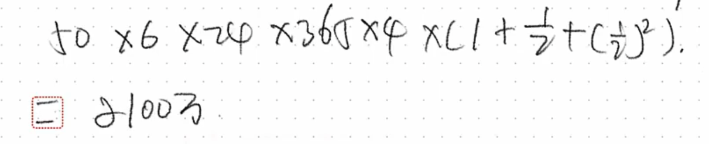
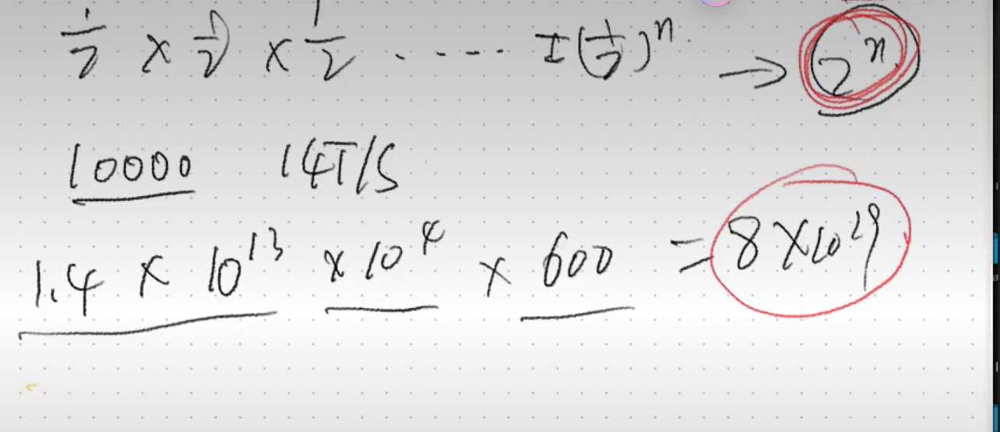
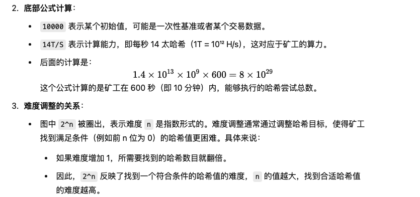
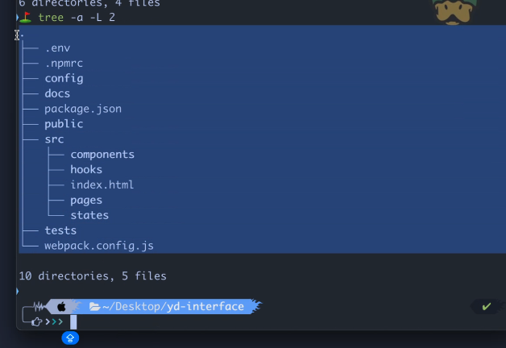
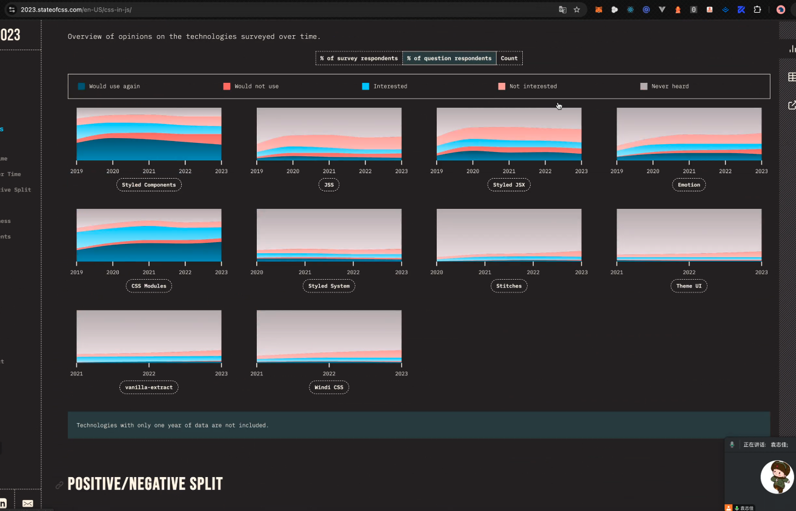
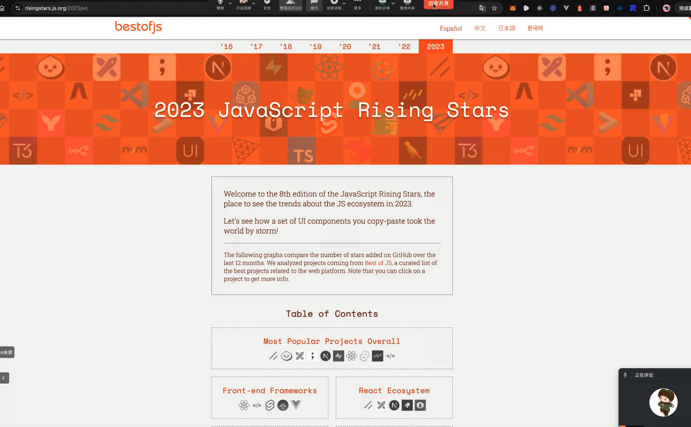

# bth

合约：杠杆 期货

现货：黄金

货币：政府背书 共识

数字货币：1）宏观经济 2）控制价格 交易所作恶  

公链 生成代币  

中心化交易所
去中心化交易所： 基于代码交易 

## 为什么有共识 

比特币：数字货币 密码学的货币 基于密码学的货币 《白皮书》 2008年十月一日 中本聪 全名：点对点电子现金记账系统 peer to peer 去中心化电子记账系统 
区块： 转账记录 通过回溯判断钱包  一个块是1M 4k条交易记录 对应的附言 数据上链写在附言里 手续费给矿工了 十分钟出个包
记账奖励：手续费 打包奖励

回溯的具体过程：
开始回溯：假设我们想验证某个钱包的交易或余额。首先从最近的一次交易开始，回溯该钱包涉及的历史交易记录。
查找所有关联交易：回溯每一笔交易，检查钱包中的每一笔进账和出账记录。
验证资产来源：回溯之前的区块，确保每一笔进账资金的来源是合法的，没有双重支付问题。
计算余额：通过回溯钱包的历史交易记录，可以重新计算出该钱包的当前余额。

## 为什么值钱

1. 宏观经济
2. 认可记账体系共识
3. 利好

## [pow 工作量证明](https://chatgpt.com/c/67143f67-e4c4-800c-b009-9b40466c1155)

付出了努力和工作，给你一些代币
网络贡献
硬盘贡献 

hash = SHA256(SHA256(字符串 + 时间戳 + md5 + 随机数 )) 前n为必须是0

全世界的节点和算力 
链上  区块链数据库 

[etherscan.io](https://etherscan.io/)
[thegraph](https://thegraph.com/zh/)

### tps
 TPS 是 Transactions Per Second（每秒处理的交易数）的缩写，通常用来衡量区块链网络或系统处理交易的能力。在区块链领域，TPS 是一个关键的性能指标，反映了该区块链在一定时间内可以处理多少笔交易。高 TPS 意味着该系统能够更快、更高效地处理更多的交易。

 ### zk

 零知识证明（Zero-Knowledge Proof，简称 ZK）是一种密码学协议，允许证明者（Prover）向验证者（Verifier）证明某一命题为真，而不泄露关于该命题的任何具体信息。简而言之，零知识证明的核心理念是：在不泄露任何隐私数据的情况下，证明某事为真。

 ### 合约是啥

 合约，尤其是在区块链和加密货币领域，通常指的是智能合约（Smart Contract）。智能合约是指在区块链上运行的一段自动执行的程序代码，它能够在满足特定条件时自动执行合同条款，无需中介机构的干预。智能合约的本质是一种自执行协议，可以应用于多种场景，包括金融交易、资产管理、法律协议等。

 web2 

 webpack react Ts

 web3 

 web3react ether next 

 bth 公链不允许编程 

 uniswap 

## 前端架构 

spa 

mpa

混用mpa+spa

同构

1. 好处 不用加载那么一堆js
2. 不用2套模板  react代码
    html + js +css 
3. 

