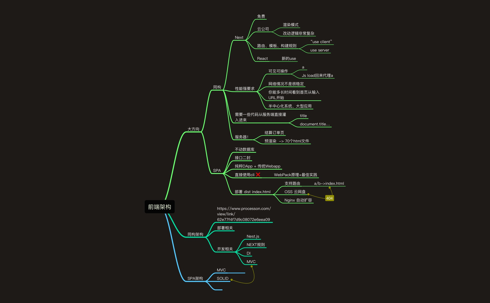
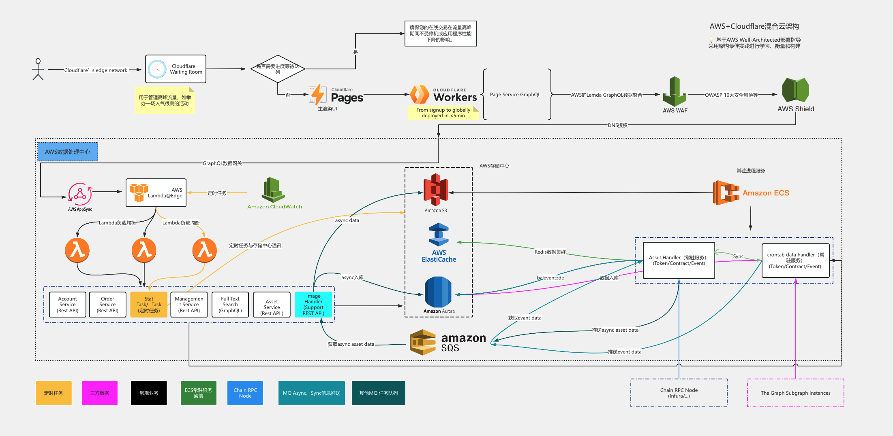
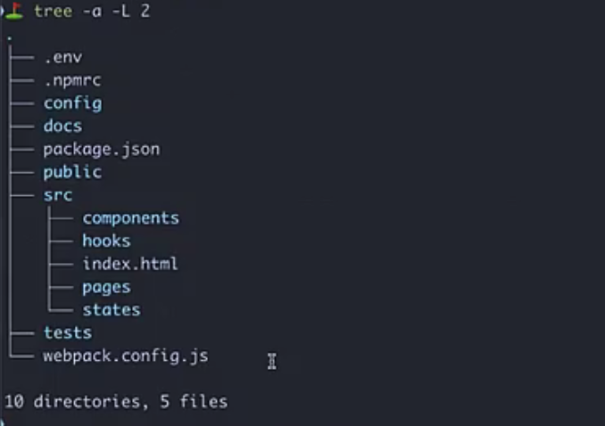

# [前端架构](https://www.processon.com/view/link/62e77f4f7d9c08072e6eea09)

流量高峰
[Waiting room](https://www.cloudflare.com/zh-cn/application-services/products/waiting-room/)

### [Cloudflare WAF](https://www.cloudflare.com/zh-cn/application-services/products/waf/)

使用我们行业领先的 Web 应用防火墙（WAF）阻止最新攻击
Cloudflare WAF 利用来自 Cloudflare 全球连通云平台情报的威胁情报和机器学习，阻止包括 zero-day 漏洞利用在内的最新威胁。

### Cloudflare Page

Cloudflare Pages 是一个静态网站托管服务，专为开发者打造。它允许你将静态网站托管在 Cloudflare 的全球边缘网络上，实现快速、安全的内容分发。主要特点如下：

1. 无服务器托管：Cloudflare Pages 提供完全无服务器的体验，开发者无需配置服务器即可发布网站。

2. 集成 CI/CD：通过与 GitHub 等代码托管平台的集成，Cloudflare Pages 支持自动构建和部署。当代码库有更新时，Cloudflare Pages 可以自动构建并将最新版本发布到网络上。

3. 全球 CDN 部署：Cloudflare Pages 将你的网站部署到 Cloudflare 的边缘网络上，使得世界各地的用户都能以低延迟访问网站。

4. SSL/TLS 加密：所有通过 Cloudflare Pages 部署的网站都默认支持 HTTPS，确保访问安全。

5. 简单的项目管理：开发者可以轻松通过 Cloudflare Dash 管理多个项目的构建和部署。

6. 无缝集成 Workers：Cloudflare Pages 可以与 Cloudflare Workers 无缝集成，使得开发者能够在静态页面中加入动态功能，如 API、路由等。

### Cloudflare Workers

1. 无服务器计算：Cloudflare Workers 无需配置或维护任何服务器，开发者可以专注于业务逻辑。代码在 Cloudflare 的全球数据中心内运行，分布式地处理用户请求。

2. 低延迟和高性能：因为 Workers 在 Cloudflare 的边缘网络中运行，代码可以靠近用户执行，从而大幅减少响应时间，提升性能。

3. API 网关：Cloudflare Workers 可以用来构建 API 网关，处理 HTTP 请求，进行路由、身份验证和日志记录等功能。你可以用它轻松实现微服务架构。

3. 动态功能增强：它可以为静态站点（如通过 Cloudflare Pages 部署的站点）提供动态功能，如 API 调用、内容处理和身份验证。

4. 灵活的编程语言支持：Workers 支持 JavaScript 以及通过 WebAssembly 运行的其他语言，如 Rust 和 C++，允许开发者在各种场景中灵活使用。

5. 按需计费：Workers 采用按需计费模式，开发者只需为实际使用的资源付费，适合于从小型应用到大规模企业级项目。

### GraphQL
GraphQL 是一种用于 API 的查询语言，它允许客户端通过明确的查询获取所需的数据。页面服务可能通过 GraphQL 来实现高效的数据请求和传输，优化页面加载性能或增强数据交互的灵活性。

## AWS 的 Lambda 和 GraphQL 数据聚合

### AWS WAF

AWS WAF （Web Application Firewall）

AWS WAF 是亚马逊云服务（AWS）提供的一种Web 应用防火墙，用于保护 Web 应用程序或 API 免受常见的网络攻击。它是一种可编程的安全服务，可以帮助开发者和企业防止应用程序受到常见的安全威胁，如 SQL 注入、跨站脚本（XSS）、DDoS 攻击等。以下是 AWS WAF 的主要特点和功能：

1. 规则过滤
AWS WAF 允许你根据规则集对进入 Web 应用的 HTTP/HTTPS 请求进行过滤。可以创建和应用一系列自定义规则来允许、阻止或监控（计数）不同类型的请求。这些规则可以基于不同的条件来设定，比如：

IP 地址
HTTP 请求标头
URI 字符串
请求的方法（GET/POST 等）
请求的来源位置
2. 预定义规则组
AWS WAF 提供了一些预定义的规则集，帮助用户快速部署防御策略，常见的预定义规则组包括：

OWASP Top 10 防护：OWASP 是一个专注于 Web 安全的非盈利组织，列出了 Web 应用最常见的 10 大漏洞，AWS WAF 预定义的规则集帮助防御这些漏洞。
DDoS 保护：通过 AWS Shield 与 AWS WAF 的集成，能够有效地防止 DDoS 攻击。
3. 实时流量监控
AWS WAF 提供实时监控和可视化，允许用户查看应用程序的 HTTP/HTTPS 流量模式，并根据流量数据调整规则。WAF 的日志功能也可以通过 AWS CloudWatch 来查看和分析请求的详细信息。

4. 自动化响应
通过 AWS WAF，可以设置自动化响应来根据攻击类型和模式做出响应。例如，当发现可疑流量时，可以自动应用某些规则来阻止攻击。同时，WAF 还支持与其他 AWS 服务（如 AWS Lambda）集成，自动执行复杂的安全策略。

5. 集成与扩展性
AWS WAF 与多种 AWS 服务深度集成，如：

Amazon CloudFront（CDN）：在全球边缘网络上为用户提供高效的流量过滤。
Amazon API Gateway：为 API 提供安全保护。
Application Load Balancer（ALB）：为 Web 应用层提供安全防护。
6. 按需付费
AWS WAF 采用按使用量付费的定价模式，你只需要为你实际使用的规则和监控请求付费。这样，你可以根据业务的规模和需求灵活调整成本。

7. DDoS 防护
AWS WAF 与 AWS Shield 高度集成，提供了高级的 DDoS 防护，能够应对大型分布式拒绝服务攻击，并保证应用程序的高可用性。

8. 规则引擎的灵活性
AWS WAF 提供了灵活的规则引擎，可以根据需要创建自定义规则，满足特定的安全需求。你可以编写复杂的条件逻辑，并将其应用于请求，以确保符合你的安全策略。

典型使用场景
保护 Web 应用：AWS WAF 可以帮助防护来自互联网上的常见 Web 攻击，例如 SQL 注入、跨站脚本等，保护 Web 应用的安全性。

API 安全：通过将 AWS WAF 与 Amazon API Gateway 集成，保护 API 免受恶意请求和数据泄露的威胁。

防止恶意机器人流量：通过创建规则，AWS WAF 可以有效检测和阻止恶意爬虫或自动化攻击工具。

控制流量访问：AWS WAF 可以根据地理位置、IP 或其他条件限制访问，帮助用户进行区域性流量管理或限制某些来源的恶意流量。

总结
AWS WAF 是一个功能强大的 Web 应用防火墙，适用于各种规模的应用程序。它通过自定义规则、集成 AWS 服务和灵活的配置，能够为 Web 应用提供全面的安全防护。AWS WAF 可以帮助用户应对复杂的安全威胁，并提供实时的流量监控和自动化响应，使得应用更加安全、可靠。

### 1. AWS Lambda

AWS Lambda 是亚马逊云服务（AWS）中的无服务器计算服务，允许你运行代码而无需预先管理服务器。你只需为代码的实际运行时间付费，Lambda 自动处理基础设施资源的调配、扩展和管理。Lambda 可以通过事件触发器（如 API 请求、文件上传、数据库更改等）来执行函数代码。

### 2. GraphQL

GraphQL 是一种用于 API 的查询语言，它允许客户端精准地查询所需的数据，而不是像 REST API 那样总是返回固定的数据结构。GraphQL 通过一个查询可以同时获取多个不同的资源，极大地减少了客户端与服务器之间的网络请求次数

### AWS Shield 

AWS Shield 是亚马逊云服务（AWS）提供的一个分布式拒绝服务攻击（DDoS）防护服务，它专门用于保护应用程序和网站免受各种规模的 DDoS 攻击。AWS Shield 有两个版本：Shield Standard 和 Shield Advanced。

1. AWS Shield Standard:
自动保护：AWS Shield Standard 默认启用，自动保护所有在 AWS 上托管的应用程序，无需额外配置或付费。
基本防护：它提供针对常见网络和传输层 DDoS 攻击的防护，例如 SYN/ACK 洪水攻击、反射攻击等。
覆盖范围：Shield Standard 与 AWS 的其他安全服务（如 Amazon CloudFront 和 AWS WAF）紧密集成，保护 Web 应用程序免受网络攻击。
2. AWS Shield Advanced:
增强的防护：相比标准版，Shield Advanced 提供更高级别的 DDoS 防护，适用于需要保护高价值、关键业务应用的场景。
实时检测和缓解：它具备实时检测功能，并能快速缓解大规模复杂的 DDoS 攻击，确保应用程序的可用性和性能。
成本保护：在发生 DDoS 攻击时，Shield Advanced 提供经济保护，帮助减少因攻击导致的额外数据转移和恢复费用。
全天候支持：订阅 Shield Advanced 的用户可以获得 24/7 的 AWS DDoS 响应团队（DRT）支持，协助处理和缓解攻击。
攻击分析报告：AWS Shield Advanced 提供详细的攻击分析报告，让用户能够了解攻击的规模、类型和影响。
主要优势：
全天候防护：AWS Shield 提供7x24小时的防护，防止网站和应用在遭遇 DDoS 攻击时中断。
降低运营风险：通过自动化的检测和缓解，减少了攻击带来的业务风险。
无缝集成：与 AWS 的其他安全服务（如 AWS WAF、CloudFront 等）无缝协作，形成一个完整的安全防护体系。
总的来说，AWS Shield 是一种关键的安全解决方案，特别适合那些需要保障高可用性、避免业务中断的企业和应用。

###  AWS AppSync

AWS AppSync 是一个完全托管的服务，用于构建和运行基于 GraphQL 的应用程序。它的作用是简化数据获取的过程，将多种数据源（如数据库、REST API、AWS Lambda）通过一个 GraphQL API 进行统一的访问。

作用：
数据聚合：AppSync 可以将不同的数据源（如 DynamoDB、Aurora、Lambda 等）统一通过一个 GraphQL API 提供给客户端，简化了前端与后端的数据交互。
实时更新：AppSync 提供实时数据更新的功能，客户端可以订阅数据，当后端数据更新时，前端会自动接收到更新内容。
复杂查询：GraphQL 查询语言允许客户端仅请求需要的数据，减少了数据传输的冗余。
使用场景：

构建现代化的 Web 和移动应用，需要将多种数据源进行整合。
实现实时更新数据的功能，例如聊天应用、股票行情等。

### AWS Lambda@Edge

AWS Lambda@Edge 是 AWS Lambda 的边缘版本，它允许开发者在 AWS 的全球内容交付网络 (CDN) 边缘位置执行代码。Lambda@Edge 的主要特点是它能够在离最终用户最近的位置处理 HTTP 请求，从而减少延迟，提高响应速度。

作用：
边缘计算：将计算任务从集中式服务器下放到 AWS 全球的边缘节点进行处理，可以大大减少响应时间。
无服务器架构：与 AWS Lambda 类似，Lambda@Edge 是无服务器的，用户不需要管理底层基础设施，AWS 自动进行扩展。
定时任务和逻辑处理：可以为内容分发网络（CloudFront）上的请求添加定制逻辑，例如请求重定向、缓存控制、A/B 测试等。
使用场景：

优化 CDN 的内容分发，通过边缘节点处理自定义的 HTTP 请求逻辑。
根据用户的位置动态调整内容，比如根据地区显示不同的页面内容或广告。

### Amazon CloudWatch

Amazon CloudWatch 是 AWS 提供的监控和管理服务，用户可以监控 AWS 资源和应用程序的运行情况。CloudWatch 能够收集和跟踪指标、监控日志文件、设定警报，并自动触发特定操作（如启动 Lambda 函数）。

作用：
监控和告警：CloudWatch 可以监控 AWS 资源（如 EC2 实例、Lambda 函数、DynamoDB 表等）的性能指标。当某个指标超过预设的阈值时，可以触发告警。
日志管理：CloudWatch 能够收集应用程序日志，并提供日志分析和搜索功能。
定时任务：通过 CloudWatch Events，可以设定定时任务来触发 Lambda 函数，完成周期性的任务处理。
使用场景：

监控 AWS 资源的运行状态，检测异常情况，并根据预设条件采取自动化操作。
通过定时事件（Cron Jobs）来触发任务执行，例如每小时或每天执行特定的操作。
总结：
AWS AppSync 提供了统一的 GraphQL API，用于整合和管理多数据源，简化了前端与后端的交互。
AWS Lambda@Edge 实现了边缘计算，将代码部署到 CDN 边缘节点执行，提升了应用程序的响应速度和性能。
Amazon CloudWatch 负责监控系统和应用程序的性能，并可通过定时任务和告警机制实现自动化管理。
这些服务相互协作，提供了完整的 API、边缘计算和监控管理解决方案。

### Amazon S3（Simple Storage Service）：

功能：Amazon S3 是一个高度可扩展的对象存储服务，用户可以将数据（如文件、图像、视频、数据库备份等）上传到 S3 存储桶中，并随时通过 API 或控制台访问这些数据。
应用场景：常用于静态文件托管、备份、存档、数据湖、以及大数据分析等。
优势：S3 提供高持久性、冗余存储、全球化的可访问性，以及低成本的存储选项，适合存储大规模的非结构化数据。

###  AWS ElastiCache：

功能：ElastiCache 是 AWS 提供的内存缓存服务，主要用于加速应用程序访问数据。它支持 Redis 和 Memcached 两种内存缓存引擎，能够显著减少数据库负载，降低延迟。
应用场景：常用于应用程序的缓存层，以加速数据库查询结果或频繁访问的数据。适用于游戏排行榜、社交网络中的用户会话数据缓存、快速的临时数据存储等。
优势：它提供了内存级的高速访问，并且能够自动扩展，保证高可用性和分布式缓存。

###  Amazon Aurora（Relational Database Service）：

Amazon Aurora 是 AWS 提供的托管关系型数据库服务，兼容 MySQL 和 PostgreSQL。它设计用于提供更高的性能和可用性，同时保持与这些开源数据库的兼容性。
总结：
Amazon S3 用于大规模、持久的对象存储；
AWS ElastiCache 提供快速的内存缓存，帮助应用提升性能；
Amazon RDS 则是关系型数据库的托管服务，简化了数据库的管理工作。

### Amazon SQS（Simple Queue Service）

Amazon SQS（Simple Queue Service） 是亚马逊提供的一项完全托管的消息队列服务，用于分离和解耦微服务、分布式系统和无服务器应用中的组件。它允许你在分布式系统中传递消息，确保消息在各组件之间可靠地传递和处理。

主要功能和特点：
消息队列：

SQS 允许你将消息存储在队列中，这些消息可以由消费者异步处理，帮助系统各部分解耦。
例如，一个服务可以生成处理请求并将其发送到队列，而另一个服务可以从队列中读取消息并进行处理。
两种类型的队列：

标准队列：支持高吞吐量，保证每条消息至少被处理一次，但可能会有消息的重复投递。
FIFO 队列：保证消息按照发送顺序到达和处理，确保每条消息只处理一次，适合需要严格顺序的场景。
高可用性和弹性：

SQS 是完全托管的服务，具备高可用性和自动扩展的能力，能够适应高流量的应用场景。
按需收费：

SQS 按消息的数量和传递量收费，没有前期成本，也无需为未使用的队列支付费用，适合于动态增长的工作负载。
无服务器架构集成：

SQS 与 AWS Lambda 无缝集成，允许你在队列中有消息时触发无服务器函数，进一步解耦系统。
消息持久化：

消息可以在队列中存储长达 14 天（标准队列），保证消费者有足够的时间处理每条消息。
安全性：

SQS 提供内置的加密功能，通过 Amazon KMS（Key Management Service）来保护消息的内容。
你还可以通过 IAM（身份和访问管理）设置权限，控制哪些用户或系统可以访问队列。
应用场景：
解耦系统组件：将不同的服务分离，避免因为某个服务宕机或过载而影响整个系统的运行。

任务排队：在需要处理大量任务或需要对某些操作进行排队时使用，比如图片处理、视频转码等异步操作。

日志处理：可以用来作为日志消息队列，将日志消息存储在队列中后，由消费者批量处理或分析。

订单处理：在电子商务系统中，可以用来处理订单消息，保证订单按照顺序处理，并防止消息丢失。

总结：
Amazon SQS 是一个强大的消息队列服务，帮助应用系统解耦和实现异步处理，确保可靠性和扩展性。它适合用于分布式系统、微服务架构、无服务器应用等场景，使得系统更具容错能力并提高整体性能。

### Amazon ECS 
Amazon ECS 是亚马逊云服务（AWS）提供的高度可扩展、快速的容器管理服务。它可以用于运行、停止和管理 Docker 容器集群，并允许用户轻松在 AWS 上部署容器化的应用程序。

以下是 Amazon ECS 的主要特点：

完全托管：

Amazon ECS 是一个完全托管的容器编排服务，负责自动管理容器的启动、停止、扩展和监控。用户可以专注于构建应用，而无需担心底层基础设施的管理。
高可扩展性和性能：

ECS 可以根据工作负载的需求自动扩展，处理大规模容器化工作负载，确保应用性能的可预测性和一致性。
支持 Docker：

ECS 与 Docker 深度集成，允许开发者直接使用 Docker 容器来打包和部署应用。
多种部署选项：

支持使用 EC2 实例 或 Fargate 模式进行部署：
在 EC2 模式下，用户可以完全控制底层虚拟机的配置和管理。
在 Fargate 模式下，ECS 提供了无服务器容器管理，用户无需管理底层服务器，只需指定容器需求即可。
与 AWS 生态系统集成：

ECS 无缝集成了 AWS 的其他服务，如 Amazon RDS、Amazon S3、Amazon CloudWatch、AWS IAM 等，帮助用户轻松构建和管理分布式应用。
安全和合规性：

通过 AWS 提供的安全服务，ECS 提供了多层安全机制，包括身份验证、访问控制和数据加密，帮助用户满足合规性要求。
总结来说，Amazon ECS 是一项强大的容器编排服务，适用于希望在云端轻松部署、管理和扩展容器化应用的企业和开发者。

## ServerLess 基本概念

### FAAS（Function as a service）

函数即服务，每一个函数都是一个服务，函数可以由任何语言编写，除此之外不需要关心任何运维细节，比如：计算资源、弹性扩容，而且可以按量计费，且支持事件驱动。业界大云厂商都支持 FAAS，各自都有一套工作台、或者可视化工作流来管理这些函数。

### BAAS (Backend as a service)

后端及服务，就是集成了许多中间件技术，可以无视环境调用服务，比如数据即服务（数据库服务），缓存服务等。虽然下面还有很多 XASS，但组成 Serverless 概念的只有 FAAS + BAAS。

### PAAS (Platform as a service)

平台即服务，用户只要上传源代码就可以自动持续集成并享受高可用服务，如果速度足够快，可以认为是类似 Serverless。但随着以 Docker 为代表的容器技术兴起，以容器为粒度的 PASS 部署逐渐成为主流，是最常用的应用部署方式。比如中间件、数据库、操作系统等。

### DAAS (Data as a service)

数据即服务，将数据采集、治理、聚合、服务打包起来提供出去。DASS 服务可以应用 Serverless 的架构。

### IaaS （Infrastructure as a Service）

IaaS（Infrastructure as a Service，基础设施即服务） 是一种云计算服务模式，它通过互联网向用户提供虚拟化的计算基础设施。用户可以根据需求租用计算资源（如服务器、存储、网络等），而不需要购买和维护物理硬件。IaaS 是云计算的三大主要服务模型之一，另外两种是 PaaS（平台即服务）和 SaaS（软件即服务）。

IaaS 的主要特点：
虚拟化基础设施：

IaaS 提供虚拟机、存储、网络等基础设施资源，这些资源由云服务提供商托管并通过互联网交付给用户。用户可以像操作物理硬件一样使用这些资源，但无需承担硬件管理和维护的责任。
按需付费：

IaaS 采用按需计费模式，用户只需为实际使用的资源付费。这种模式帮助用户避免前期的基础设施投资和设备维护成本，使得资源的利用更加灵活。
可扩展性：

IaaS 平台具有高度的弹性，用户可以根据应用需求的变化（例如流量高峰期）动态调整计算资源的规模。可以轻松增加或减少虚拟机、存储容量和网络带宽。
完全控制：

用户对虚拟机、存储和网络等资源有完全的控制权，能够根据需要配置操作系统、应用程序、存储策略、网络架构等。这让开发者和企业可以根据自己的需求定制计算环境。
多租户架构：

IaaS 通常采用多租户架构，多个客户可以共享相同的物理硬件资源，但虚拟化技术确保每个用户的环境独立且安全。
自动化和管理：

虽然 IaaS 用户负责操作系统和应用程序的管理，但云服务提供商会自动管理底层的硬件、虚拟化层、安全补丁以及其他底层维护工作，减轻了用户的运营负担。
IaaS 的主要服务提供商：
Amazon Web Services (AWS)：AWS 是全球领先的 IaaS 提供商，其 EC2（Elastic Compute Cloud）服务允许用户创建和管理虚拟服务器，S3（Simple Storage Service）提供弹性存储。

Microsoft Azure：Azure 提供类似的 IaaS 服务，包括虚拟机、Blob 存储、虚拟网络等。它还与 Microsoft 其他产品（如 Windows Server 和 Active Directory）集成紧密。

Google Cloud Platform (GCP)：GCP 提供虚拟机、云存储、云网络等 IaaS 服务，并以其高性能的网络基础设施和数据分析能力而闻名。

IBM Cloud：IBM Cloud 提供广泛的 IaaS 服务，包括虚拟服务器、裸金属服务器、存储和网络解决方案，适用于企业级应用。

阿里云（Alibaba Cloud）：阿里云在中国和亚洲市场占有重要地位，提供 ECS（弹性计算服务）等 IaaS 产品，适用于各种规模的企业。

IaaS 的典型应用场景：
动态负载环境：

当工作负载频繁变化或高峰期需求不稳定时，IaaS 可以快速扩展资源，避免资源浪费。例如，电子商务网站在购物季节会遇到流量高峰，此时可以借助 IaaS 临时扩展计算能力。
开发与测试环境：

开发人员可以使用 IaaS 快速创建测试和开发环境，测试完毕后可以立即释放资源，降低开发成本和时间。
备份和灾难恢复：

IaaS 允许企业轻松地设置数据备份和灾难恢复策略。通过将数据存储在云端，企业可以在本地基础设施发生故障时，快速恢复业务运行。
大数据处理：

IaaS 提供了高度可扩展的存储和计算资源，适合大数据分析工作负载。例如，利用 IaaS 处理数据分析、数据挖掘和机器学习任务。
企业级应用托管：

企业可以将关键的 ERP、CRM 和其他内部应用程序托管在 IaaS 平台上，减少对本地硬件的依赖，并获得更高的可用性和扩展性。
优点：
弹性扩展：根据需求即时扩展或减少资源，确保高效利用资源，特别适合动态工作负载。
成本效益：按需付费模式节省了购买和维护硬件的高昂成本，减少了资本支出。
快速部署：用户可以快速配置并部署新的计算资源，无需等待硬件交付和安装。
全方位控制：用户可以根据自己的需要安装操作系统、管理存储、配置网络等。
缺点：
安全性：虽然 IaaS 提供商负责底层基础设施的安全性，但用户仍需自行管理虚拟机和应用层的安全，可能会面临一些潜在的安全风险。
依赖网络性能：因为 IaaS 完全依赖互联网，如果网络连接不稳定或速度慢，可能会影响应用程序的运行和性能。
学习曲线：对于不熟悉云计算的团队来说，使用 IaaS 需要一定的学习和培训，以便有效管理资源。
总结：
IaaS 提供了灵活的计算基础设施，让企业和开发人员能够轻松获得所需的资源，并通过按需扩展来优化成本。它适用于各种规模的企业，特别是需要动态扩展或面临高峰需求的应用场景。

### qps

QPS（Queries Per Second，查询每秒） 是衡量系统性能的一个重要指标，通常用于描述服务器、数据库或系统在单位时间（每秒钟）内能够处理的查询请求数量。QPS 常用于评估系统的处理能力和性能，是在高并发系统设计和优化中非常重要的参考数据。

QPS 的主要概念：
系统吞吐量：

QPS 是系统的吞吐量指标，它表示服务器或系统在一定时间内能够处理多少查询请求。QPS 越高，表示系统的处理能力越强。
单位时间：

QPS 以秒为单位，表示在一秒钟内系统处理了多少次查询或请求。QPS 可以衡量数据库查询、API 调用、HTTP 请求等类型的操作。
并发性：

QPS 与并发请求数量密切相关，并发越高，系统可能需要处理更多的查询。如果系统处理并发请求的能力不足，可能导致 QPS 降低。
负载测试：

在评估系统性能时，QPS 常用于负载测试。通过逐步增加请求数量，直到系统达到性能瓶颈，可以确定系统的最大 QPS。
如何提升 QPS：
增加服务器资源：

增加更多的计算资源（如 CPU、内存、带宽）可以提高系统的处理能力，从而提升 QPS。
负载均衡：

使用负载均衡器将请求分发到多台服务器上，从而减轻单一服务器的负载压力，提升整体 QPS。
缓存：

实施缓存策略（如使用 Redis、Memcached 等）可以减少对数据库的查询频率，提升系统的 QPS。缓存经常访问的数据，可以显著降低数据库的负载。
数据库优化：

通过优化数据库查询、建立索引、分区表等方式，可以加快查询速度，提升数据库的 QPS。
异步处理：

在某些场景下，可以采用异步处理的方式将部分请求推迟处理，从而提升系统的响应能力。
使用无服务器架构：

采用无服务器架构（如 AWS Lambda）可以根据实际请求动态扩展计算资源，从而在高并发场景下提升 QPS。
QPS 相关计算：
假设一个系统一天总共处理了 100 万次查询，那么一天内的总秒数为 86,400（24 小时 * 60 分钟 * 60 秒），系统的平均 QPS 可以通过以下公式计算：

这意味着该系统平均每秒处理 11.57 个请求。

QPS 在实际场景中的应用：
Web 服务：QPS 是衡量 Web 服务响应速度和处理能力的重要指标。例如，在电商网站中，QPS 可以衡量系统每秒处理的搜索请求、商品浏览请求等。

数据库：QPS 用于衡量数据库系统的查询处理能力。对于大型数据库系统，QPS 可以评估其在高并发下的查询能力，优化数据库查询和索引结构可以提升 QPS。

API 服务：API 网关和服务经常使用 QPS 来衡量其处理请求的能力。通过负载均衡和 API 优化，可以增加系统的 QPS，提升 API 的并发性能。

QPS 和 TPS 的区别：
QPS（Queries Per Second）：主要用于查询系统或服务处理查询请求的速度。
TPS（Transactions Per Second）：用于衡量系统每秒处理的事务数量，常用于事务型系统如数据库或支付系统。一个事务可能包含多个查询，因此 TPS 通常比 QPS 更复杂。
总结：
QPS 是衡量系统性能、处理能力的一个关键指标。通过对 QPS 的监控和优化，开发者和运维人员可以提升系统的并发能力、处理速度和响应效率，确保系统在高负载情况下能够保持稳定的性能表现。

## 项目架构

公链原理 
前端机构 
yarn npm cnpm pnpm 