# 前端技术选型

## 同构架构 

```text
同构架构:

部署相关: 涉及服务端和客户端的统一部署策略
开发相关: 包含了几个重要的技术栈和模式

Nest.js: Node.js 的服务器端框架
NEXT规则: Next.js的开发规范
DI(依赖注入): 一种软件设计模式
MVC: Model-View-Controller架构模式

```

## SPA 架构 

```text
SPA(单页应用)架构:

MVC架构模式的实现
文件目录组织结构
SOLID原则
DI(依赖注入)的应用
```
```text
"在现代Web开发中,我们主要用到两种架构模式:

1. 同构架构的优势:
- 提供更好的首屏加载体验
- 有利于SEO优化
- 代码可以在服务器和客户端复用
- 使用Nest.js和Next.js这样的成熟框架可以快速搭建

2. SPA架构的特点:
- 提供流畅的用户体验
- 前后端分离,关注点分离
- 遵循SOLID原则保证代码质量
- 使用依赖注入(DI)提高代码的可维护性和可测试性

在实践中,我们会根据具体业务需求选择合适的架构方案,比如:
- 内容展示型网站偏向使用同构架构
- 交互密集型应用偏向使用SPA架构
- 也可以根据需要做混合架构"
```

 tree 

## 技术选型 

### [DOM 库](https://claude.ai/chat/e81d2610-597d-4cb4-9efd-fa5eb52898d4)

pnpm + vite 创建项目

```js

// 安装
pnpm create vite solid-app --template solid-ts

# Solid
pnpm --filter solid-app add -D vite vite-plugin-solid
# 测试某个具体项目
pnpm --filter react-app dev

```

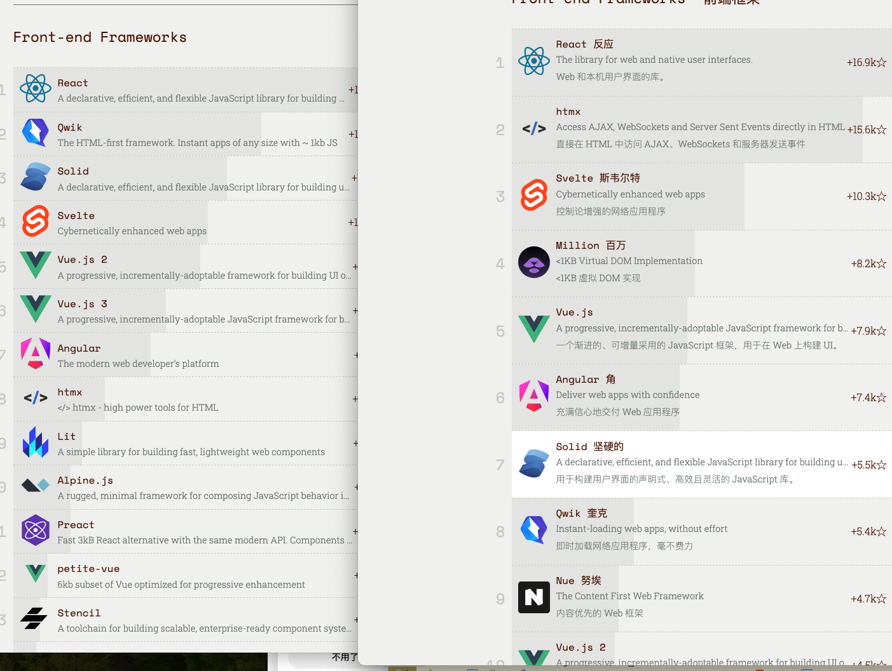

Jquery

React


### htmlx 
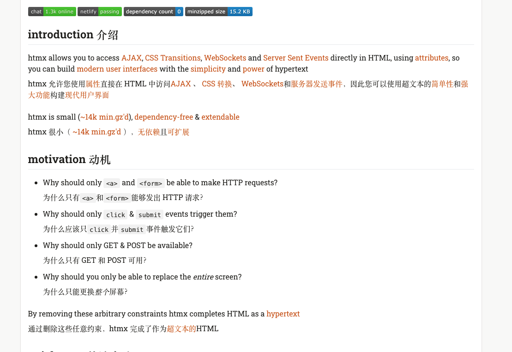

#### htmlx 和amp共同点与区别 

- HTML拓展属性使用

```html
<!-- HTMX 示例 -->
<div hx-get="/api/data" hx-trigger="click">
    点击加载数据
</div>

<!-- AMP 示例 -->
<amp-img src="image.jpg" width="800" height="600" layout="responsive">
</amp-img>
```

- 声明式开发 

```html
<!-- HTMX 声明式交互 -->
<button 
    hx-post="/api/like"
    hx-trigger="click"
    hx-swap="outerHTML"
>
    点赞
</button>

<!-- AMP 声明式组件 -->
<amp-carousel width="400" height="300" layout="responsive" type="slides">
    <div>第一页</div>
    <div>第二页</div>
</amp-carousel>
```

```text
使用场景：


HTMX:

适合构建交互式 Web 应用

注重服务器端集成

更灵活的开发方式


AMP:

专注于移动页面加载性能

严格的技术规范

主要用于发布内容


技术特点：


HTMX:

无需特殊构建过程

可以与任何后端技术配合

更自由的开发模式


AMP:

需要特定的 AMP 验证

有严格的代码限制

需要特定的 AMP 组件


性能优化：


HTMX:

通过减少 JavaScript 代码量优化

依赖服务器端处理

按需加载内容


AMP:

严格的性能规则

预加载资源

CDN 缓存支持


开发复杂度：


HTMX：

学习曲线较平缓

容易集成到现有项目

更接近传统 Web 开发


AMP：

需要遵循严格规范

有特定的开发限制

需要专门的验证工具


选择建议：

如果需要构建交互式 Web 应用，选择 HTMX

如果需要优化移动端内容展示，选择 AMP

可以在同一个项目中结合使用两者，针对不同场景选择合适的技术

```

#### pwa

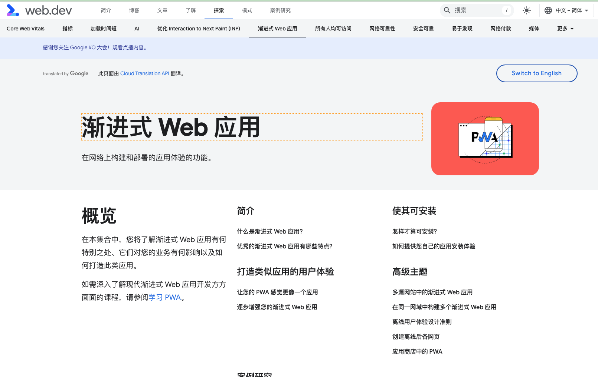

开发的应用  


`service worker` 离线缓存 

workbox-webpack


#### [Million](https://bestofjs.org/projects/million) 

这个比较重要 


#### 为什么使用typeScript 
ts 提前 做了类型检查
v8 字节码 机器码 

类型检查的意义：TypeScript 的提前类型检查能有效减少运行时的错误风险，确保代码更加健壮、易于维护。
V8 的字节码和机器码：V8 引擎通过字节码和 JIT 编译实现了高效的 JavaScript 执行，结合 TypeScript 能进一步提升开发体验和代码的可维护性。

TypeScript 和 V8 的配合：TypeScript 编译成 JavaScript 后，V8 引擎将其高效执行，前端开发因此可以享受静态类型的安全性和动态执行的性能。

#### quicktype 

> cli  RESTful API 调用quicktype  生成接口类型 类型声明 在全队fetch时候 responced type 就不需要人来管理了 


#### yarn npm 和pnpm 对比 

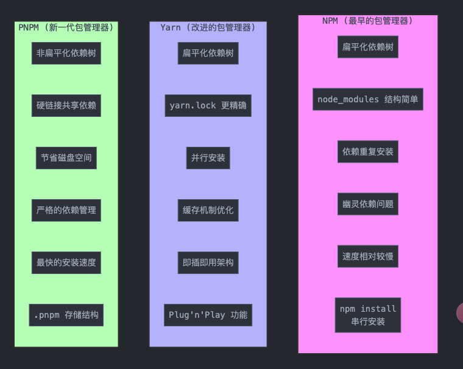

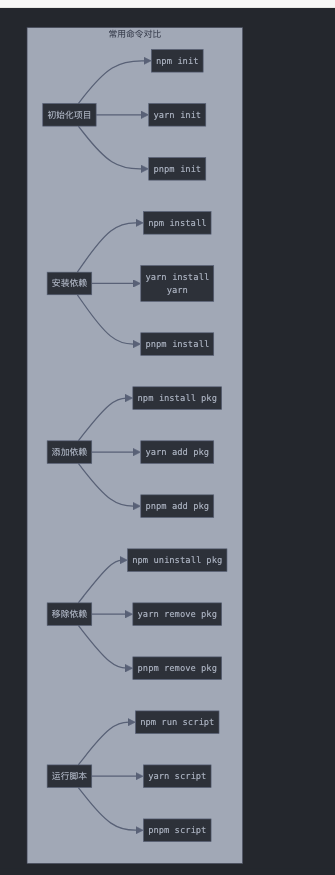

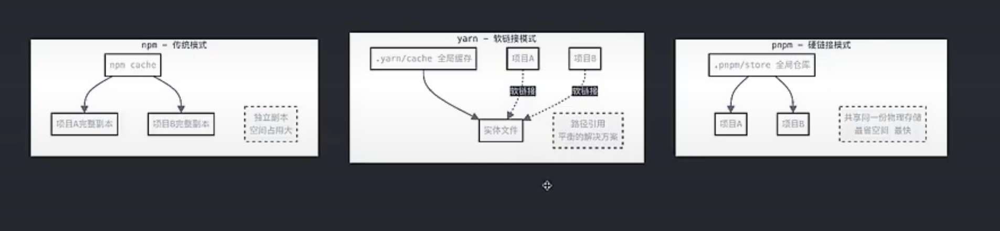

### Solid

 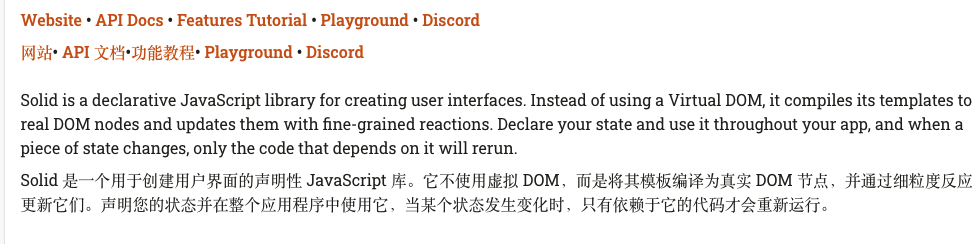

 初始化项目  不使用虚拟dom   js facch 回来 还要转成虚拟dom v8序列化这套js 需要耗时 页面渲染不了 

 当年 quiker 提出来 不调和  不水合 这件事 


## 构建工具

### webpack 

整个站点 commonjs 规范 SWC/EsBuild   babel不能使用了

### cli工具

基于项目二次封装 

CRA 

Vue-cli


### SWC/ESbuild/RSPack

esbuild 和 SWC 都是 JavaScript 和 TypeScript 的高性能构建和编译工具，具有相似的目标但不同的设计和实现方式：

1. esbuild

简介：esbuild 是一个用 Go 编写的 JavaScript/TypeScript 打包器，因其极高的速度和效率而出名。

特点：

速度：由于采用 Go 语言并行编译机制，esbuild 的性能极高，常常比 JavaScript 写的工具快几十倍。

Bundling（打包）：支持将多文件的依赖图打包为单个文件，方便前端部署。

Tree Shaking：会自动移除未使用的代码以减小打包大小。

兼容性：支持现代的 JavaScript 和 TypeScript，且可以转换为 ES5 等兼容旧浏览器的版本。

配置简单：设计的初衷就是为了简化构建过程，默认配置就能处理大部分常见需求。

应用场景：适合构建速度要求高、兼容性要求不复杂的项目，尤其在开发环境下更能体现其性能优势。

2. SWC (Speedy Web Compiler)

简介：SWC 是用 Rust 编写的 JavaScript/TypeScript 编译器，主要用于编译和转译代码。

特点：

速度：Rust 的低层实现提供了接近原生的编译速度，特别是在多核 CPU 上表现优异。

支持现代语法：支持最新的 JavaScript 和 TypeScript 特性，并提供丰富的兼容选项。

插件系统：SWC 支持通过插件定制编译过程，虽然不像 Babel 那样成熟，但也在不断完善。

生态集成：SWC 被 Next.js 等框架采用来加速构建流程。

应用场景：SWC 更偏向于代码转译（transpiling），适合追求编译速度的项目，在大型代码库和复杂语法转换中优势显著。

对比

性能：两者在性能上都非常出色，SWC 通常在编译上稍快，而 esbuild 则在整体打包上表现更优。

生态与插件：esbuild 的生态和配置系统较简单，而 SWC 更接近 Babel 的插件体系，便于复杂场景下的拓展。

适用性：esbuild 常用作构建工具（bundler），SWC 更适合在代码转换（transpiler）方面的应用。

总之，esbuild 和 SWC 都可以极大地提升 JavaScript/TypeScript 项目的构建速度，esbuild 更适合作为打包器使用，而 SWC 则适合作为高性能的编译器来处理代码转换。


### viet

koa + esbuild 


### Parcel

Parcel 是一个零配置的 Web 应用打包工具，以快速启动和简便的配置著称。Parcel 会自动检测和处理依赖关系，无需额外配置，并内置支持 TypeScript、JSX、CSS 和其他文件类型。


马上启动开发环境 

TS SDK 迅速去Docs 


### Rollup

开发sdk 生成UMD AMD CMD EsModule 规范 


Vite：适合构建现代前端应用，提供极速开发体验。
Parcel：零配置的打包工具，适合快速启动前端项目。
Rollup：适合构建库，提供模块化和代码优化的打包方式。


## CSS 


## css module 

## less/sass


### CSS in js

#### Style components

[Style Components](https://styled-components.com/)

#### emotion

[emotion](https://emotion.sh/docs/introduction)

```js
import { css } from '@emotion/css'

const color = 'white'

render(
  <div
    className={css`
      padding: 32px;
      background-color: hotpink;
      font-size: 24px;
      border-radius: 4px;
      &:hover {
        color: ${color};
      }
    `}
  >
    Hover to change color.
  </div>
)
```

### CSS 函数 

#### 数学计算函数

```css
.element {
  /* calc() - 基础数学计算 */
  width: calc(100% - 20px);
  
  /* min() - 取最小值 */
  width: min(50%, 500px);
  
  /* max() - 取最大值 */
  width: max(50%, 300px);
  
  /* clamp() - 值的范围限定 (MIN, VAL, MAX) */
  width: clamp(200px, 50%, 800px);
}
```

#### 颜色函数

```css
.element {
  /* RGB颜色 */
  color: rgb(255, 0, 0);
  color: rgba(255, 0, 0, 0.5);
  
  /* HSL颜色 */
  color: hsl(0, 100%, 50%);
  color: hsla(0, 100%, 50%, 0.5);
  
  /* 颜色混合 */
  background: color-mix(in srgb, #34c9eb 25%, white);
  
  /* 相对颜色改变 */
  color: color-contrast(white);
  
  /* 当前颜色 */
  border-color: currentColor;
}
```

#### 自定义属性函数

```css
.element {
  /* var() - 使用CSS变量 */
  color: var(--main-color, #000);
  
  /* env() - 环境变量 */
  padding-bottom: env(safe-area-inset-bottom);
  
  /* 属性引用 */
  content: attr(data-label);
}
```

#### 变换和过滤函数

```css
.element {
  /* 变换函数 */
  transform: translate(50px, 100px);
  transform: rotate(45deg);
  transform: scale(1.5);
  transform: skew(10deg);
  transform: matrix(1, 0, 0, 1, 0, 0);
  
  /* 过滤函数 */
  filter: blur(5px);
  filter: brightness(150%);
  filter: contrast(200%);
  filter: grayscale(50%);
  filter: hue-rotate(90deg);
  filter: invert(75%);
  filter: opacity(50%);
  filter: saturate(30%);
  filter: sepia(60%);
}
```

####  渐变函数

```css
.element {
  /* 线性渐变 */
  background: linear-gradient(to right, red, blue);
  
  /* 径向渐变 */
  background: radial-gradient(circle, red, blue);
  
  /* 圆锥渐变 */
  background: conic-gradient(from 45deg, red, blue);
  
  /* 重复渐变 */
  background: repeating-linear-gradient(45deg, red 0%, blue 10%);
}
```

#### 网格和布局函数

```css
.container {
  /* repeat() */
  grid-template-columns: repeat(3, 1fr);
  
  /* minmax() */
  grid-template-columns: minmax(100px, 1fr);
  
  /* fit-content() */
  width: fit-content(300px);
}
```

#### 图形函数

```css
.element {
  /* clip-path */
  clip-path: polygon(50% 0%, 100% 50%, 50% 100%, 0% 50%);
  
  /* path() */
  clip-path: path('M0,0 L100,0 L100,100 L0,100 Z');
  
  /* shape-outside */
  shape-outside: circle(50%);
}
```

#### 滤镜和混合模式

```css
.element {
  /* 背景混合 */
  background-blend-mode: multiply;
  
  /* 混合模式 */
  mix-blend-mode: overlay;
  
  /* 高级滤镜 */
  backdrop-filter: blur(10px) brightness(80%);
}
```

#### 动画和时间函数


```css
.element {
  /* 步进函数 */
  transition-timing-function: steps(4, end);
  
  /* 贝塞尔曲线 */
  animation-timing-function: cubic-bezier(0.4, 0, 0.2, 1);
}
```

### 视觉效果函数

```css
.element {
  /* 投影 */
  box-shadow: drop-shadow(2px 2px 2px rgba(0, 0, 0, 0.5));
  
  /* 混合 */
  background-image: cross-fade(url(image1.jpg), url(image2.jpg), 50%);
}
```

#### CSS 伪类选择器
##### 基础结构性伪类

```css
/* 第一个和最后一个 */
:first-child     /* 第一个子元素 */
:last-child      /* 最后一个子元素 */
:only-child      /* 唯一的子元素 */
:first-of-type   /* 第一个特定类型的元素 */
:last-of-type    /* 最后一个特定类型的元素 */
:only-of-type    /* 唯一的特定类型元素 */

/* 示例 */
li:first-child {
  font-weight: bold;
}
p:first-of-type {
  font-size: 1.2em;
}
```

#### 位置相关伪类

```css
/* nth选择器 */
:nth-child(n)        /* 第n个子元素 */
:nth-last-child(n)   /* 倒数第n个子元素 */
:nth-of-type(n)      /* 第n个特定类型元素 */
:nth-last-of-type(n) /* 倒数第n个特定类型元素 */

/* 常用公式 */
:nth-child(odd)      /* 奇数位置 */
:nth-child(even)     /* 偶数位置 */
:nth-child(3n)       /* 每3个 */
:nth-child(3n+1)     /* 每3个后的第1个 */

/* 示例 */
tr:nth-child(even) {
  background-color: #f2f2f2;
}

li:nth-child(3n+1) {
  margin-left: 0;
}
```

#### 状态相关伪类

```css
/* 表单状态 */
:disabled    /* 禁用状态 */
:enabled     /* 可用状态 */
:checked     /* 选中状态 */
:required    /* 必填项 */
:optional    /* 选填项 */
:valid       /* 验证通过 */
:invalid     /* 验证失败 */
:in-range    /* 在范围内 */
:out-of-range/* 超出范围 */

/* 链接状态 */
:link        /* 未访问链接 */
:visited     /* 已访问链接 */
:hover       /* 鼠标悬停 */
:active      /* 激活状态 */
:focus       /* 获得焦点 */
:focus-within/* 子元素获得焦点 */
:focus-visible/* 键盘焦点可见 */

/* 示例 */
input:invalid {
  border-color: red;
}

button:hover {
  background-color: #0056b3;
}
```

#### 内容相关伪类

```css
:empty              /* 空元素 */
:target             /* 当前锚点目标 */
:lang(language)     /* 特定语言 */
:not(selector)      /* 否定选择器 */
:is(selector)       /* 匹配任意选择器 */
:where(selector)    /* 零优先级的组合 */
:has(selector)      /* 包含特定元素 */

/* 示例 */
p:empty {
  display: none;
}

:not(.active) {
  opacity: 0.5;
}
```

#### 复杂选择器组合

```css
/* 多条件组合 */
input:enabled:hover {
  border-color: blue;
}

/* 否定组合 */
.item:not(:first-child):not(:last-child) {
  margin: 0 10px;
}

/* 状态组合 */
.button:hover:not(:disabled) {
  transform: scale(1.05);
}
```

### Less/Sass

```text
优点:
- 提供变量、嵌套、混合、函数等编程能力
- 代码复用性强,维护方便
- 兼容普通 CSS,学习成本较低

缺点:
- 需要编译步骤,增加构建时间
- 代码可能会冗余
- 运行时无法动态修改变量
```

### css module

```text
优点:
- 局部作用域,解决命名冲突
- 与组件化开发契合
- 编译时生成唯一类名,无运行时开销

缺点:
- 不能动态修改样式
- 需要构建工具支持
- 全局样式需要特殊处理 
没有对应的函数 和方法 
```

### css in js
 
```text

优点:
- 完全组件化,样式跟随组件
- 支持动态样式计算
- 运行时生成样式,更灵活

缺点:
- 运行时开销较大
- 增加打包体积
- 部分方案需要额外学习成本

```
#### Styled Components

```js
// 1. 基础用法
import styled from 'styled-components';

const Button = styled.button`
  background: ${props => props.primary ? 'blue' : 'white'};
  color: ${props => props.primary ? 'white' : 'blue'};
  padding: 10px 20px;
`;

// 使用
<Button primary>Click me</Button>
```

#### emotion

```js
import { css } from '@emotion/css'

const style = css`
  background-color: hotpink;
  &:hover {
    color: white;
  }
`

// 使用
<div className={style}>This has a hotpink background.</div>

```

#### [Styletron](https://claude.ai/chat/9b833c02-549a-41df-a7c9-26e58e865c24)

```js

Styletron 是一个高性能的 CSS-in-JS 解决方案，具有以下主要特点：

原子化 CSS

    自动将样式拆分为最小单位
    实现最大程度的样式复用
    减少生成的 CSS 大小


性能优势

    虚拟 CSS 引擎
    自动去重
    按需加载样式

```

### js in css 

> 既想css 有js 的能力 ，又想css样式分离,衍生了js in css
> JS in CSS 指的是在 CSS 中直接使用 JavaScript 的能力，主要通过 CSS Houdini API 实现。

```html
<!DOCTYPE html>
<html lang="en">
  <head>
    <meta charset="UTF-8" />
    <meta name="viewport" content="width=device-width, initial-scale=1.0" />
    <title>Document</title>
    <style>
      /* 定义CSS变量 */
      :root {
        --zhijia: "Hello CSS Variable";
      }

      /* 使用CSS变量 */
      a::before {
        content: var(--zhijia);
      }

      /* 基础样式 */
      a {
        position: relative;
        margin: 20px;
      }
    </style>
  </head>
  <body>
    <a>这个css in js</a>

    <!-- 如果你想要使用JavaScript来动态修改CSS变量 -->
    <script>
      // 方法1：直接设置CSS变量
      //   document.documentElement.style.setProperty("--zhijia", '"Updated Value"');

      // 方法2：通过JavaScript函数动态更新内容
      //   function updateContent() {
      //     const root = document.documentElement;
      //     root.style.setProperty("--zhijia", '"Dynamic Content"');
      //   }
    </script>
  </body>
</html>

```

#### Houdini API 介绍 

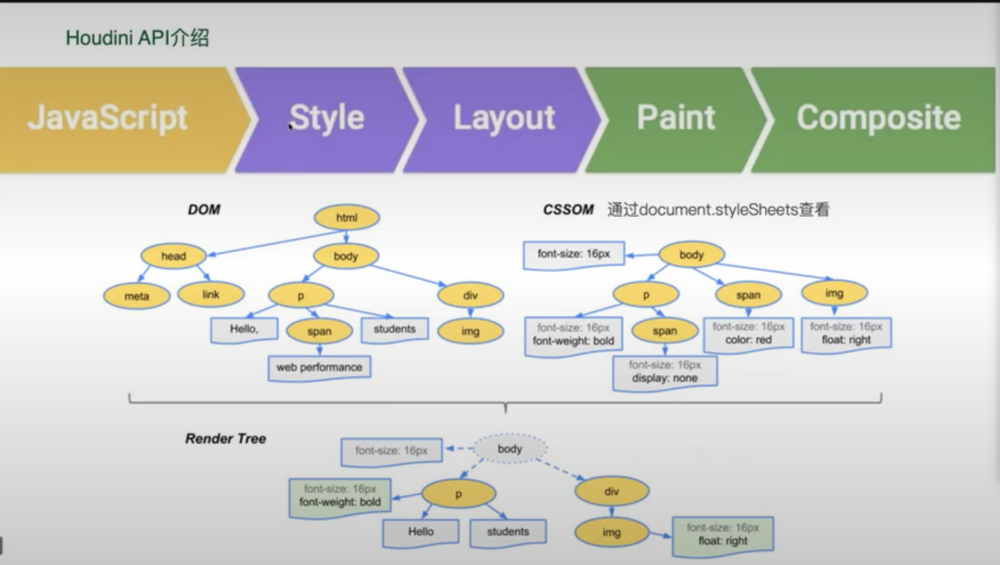

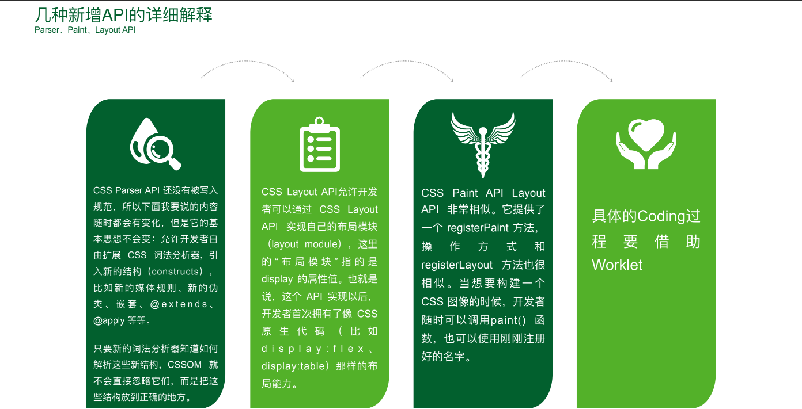

- CSS Parser API

```css
// CSS 解析器 API
主要功能：
- 允许开发者扩展 CSS 词法分析器
- 可以解析新的CSS语法结构
- 支持新的媒体查询规则、@extends、@apply等

实例：
// 注册新的CSS自定义属性
CSS.registerProperty({
  name: '--my-color',
  syntax: '<color>',
  inherits: false,
  initialValue: '#c0ffee'
});

```

- CSS Layout API

```js
// 布局 API
主要功能：
- 允许开发者创建自定义布局模块
- 类似于 display: flex 或 display: grid
- 可以实现完全自定义的布局算法

示例：
registerLayout('masonry', class {
  static get inputProperties() {
    return ['width', 'height'];
  }
  
  async layout(children, edges, constraints, styleMap) {
    // 自定义布局逻辑
    return {
      childrenSizes: sizes,
      autoBlockSize: height
    };
  }
});
```

- CSS Paint API

```js
// 绘制 API
主要功能：
- 提供类似Canvas的绘制能力
- 可以创建自定义背景、边框等视觉效果
- 通过registerPaint注册自定义绘制方法

示例：
registerPaint('circlePattern', class {
  paint(ctx, size, properties) {
    // 使用Canvas API进行绘制
    ctx.fillStyle = 'red';
    ctx.beginPath();
    ctx.arc(size.width/2, size.height/2, 50, 0, 2 * Math.PI);
    ctx.fill();
  }
});
```

- CSS Worklets

```js
// 工作线程
主要功能：
- 允许在渲染流程中执行JavaScript
- 可以创建高性能的动画和效果
- 支持自定义绘制和布局操作

使用方式：
// 加载绘制worklet
CSS.paintWorklet.addModule('my-paint-worklet.js');

// 加载布局worklet
CSS.layoutWorklet.addModule('my-layout-worklet.js');
```


####  css-doodle

```js
<css-doodle>
  :doodle {
    @grid: 5x5;    /* 创建5x5的网格 */
  }
  background: @pick(#ff0000, #00ff00, #0000ff);  /* 随机选择颜色 */
</css-doodle>
```

### type om object 

- 主要概念和类型：
    - CSSStyleValue：所有 CSS 值的基类

    - CSSKeywordValue: 关键字值（如 'auto', 'none'）

    - CSSUnitValue: 带单位的数值（如 '42px'）

    - CSSMathValue: 计算表达式

    - CSSTransformValue: 变换值

    - CSSImageValue: 图片值


```js
// 1. 基础属性访问和设置
const element = document.querySelector('.example');

// 传统方式
element.style.opacity = '0.5';
console.log(element.style.opacity); // "0.5" (字符串)

// Typed OM 方式
element.attributeStyleMap.set('opacity', 0.5);
console.log(element.attributeStyleMap.get('opacity').value); // 0.5 (数字)

// 2. 数值计算和单位转换
// 创建CSS数值
const width = CSS.px(42);
const height = CSS.vw(50);
const margin = CSS.rem(1.2);

// 数值运算
const calc = CSS.px(100).add(CSS.vw(50));
console.log(calc.toString()); // "calc(100px + 50vw)"

// 3. 使用 CSSStyleValue 创建样式
const color = new CSSKeywordValue('red');
const padding = new CSSUnitValue(5, 'px');
const transform = new CSSTransformValue([
  new CSSTranslate(CSS.px(100), CSS.px(200))
]);

// 4. 批量设置样式
element.attributeStyleMap.set('width', CSS.px(200));
element.attributeStyleMap.set('height', CSS.px(100));
element.attributeStyleMap.set('background-color', new CSSKeywordValue('blue'));

// 5. 读取计算样式
const computedStyles = document.querySelector('.example').computedStyleMap();
console.log(computedStyles.get('width').value); // 获取计算后的宽度值
console.log(computedStyles.get('color').toString()); // 获取计算后的颜色值

// 6. 处理复杂值
// Transform 示例
const transformValue = new CSSTransformValue([
  new CSSRotate(CSS.deg(45)),
  new CSSScale(1.5, 1.5),
  new CSSTranslate(CSS.px(100), CSS.px(0))
]);
element.attributeStyleMap.set('transform', transformValue);

// 7. 自定义属性处理
CSS.registerProperty({
  name: '--my-color',
  syntax: '<color>',
  inherits: false,
  initialValue: '#c0ffee'
});

// 8. 数值验证
try {
  element.attributeStyleMap.set('opacity', CSS.number(2)); // 抛出错误，opacity 必须在 0-1 之间
} catch (e) {
  console.error('Invalid opacity value');
}
```

### 原子css 

#### [Css Next](https://cssnext.github.io/playground/)

> CSS Next (现在也叫 PostCSS Preset Env)，这是一个允许你使用未来 CSS 特性的工具。

精通 Atomic state 与 css

#### postcss tailWindcss

```text

PostCSS 和 Tailwind CSS 的关系
PostCSS：

是一个 CSS 处理工具，可以通过插件执行各种任务，如自动添加浏览器前缀、压缩 CSS 等。
PostCSS 本身没有特定功能，它是一个插件运行平台，根据项目需要加载特定的插件进行处理。
Tailwind CSS：

是一个实用优先的 CSS 框架，提供大量的预定义类来快速构建 UI。
Tailwind 使用 PostCSS 进行编译，因为它自身通过 PostCSS 插件来生成并处理工具类。
两者协同工作：

在使用 Tailwind CSS 时，PostCSS 作为插件管理器将 Tailwind 插入到项目的 CSS 构建流程中。
Tailwind CSS 提供的插件（@tailwindcss）将生成工具类和必要的样式，同时其他 PostCSS 插件可以继续处理生成的 CSS。
```

css不回来 js 执行不了


## 状态库 


### 组件内状态 

#### mobx

#### useReducer

#### Content 

#### Jotai 

immer

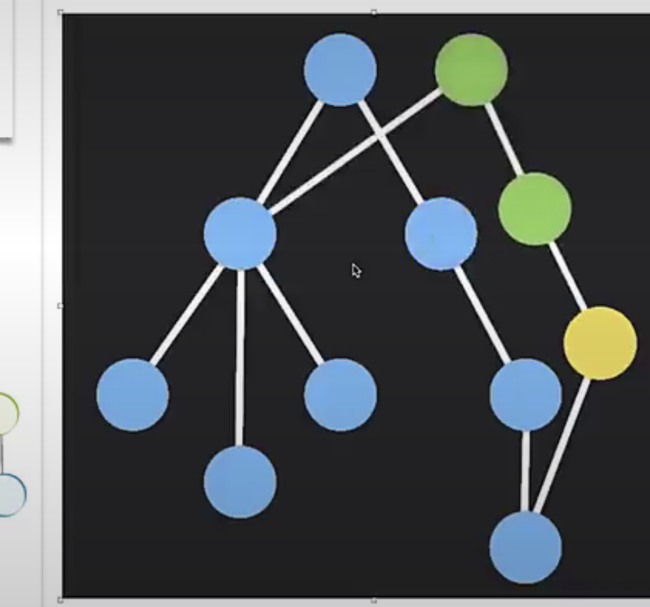


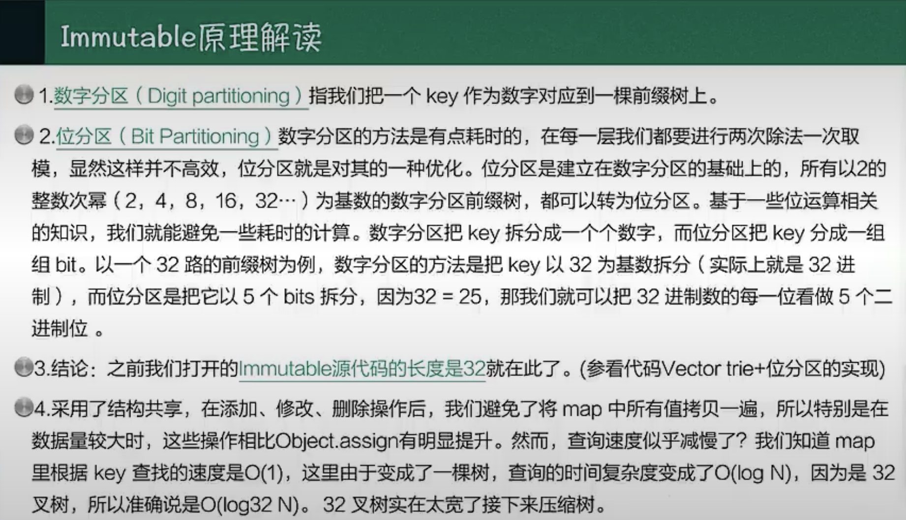

why did you render [简历]

#### Recoil


> 原子状态

### 组件外状态

#### Redux 

#### zustand

 

## 前端架构方案 


### 组件库

兼容css 方案  


### 私仓

#### lerna 

#### Rush

#### pnpm 

#### turbor epo

rust


## 性能监控平台 

线上用户行为回溯 
用户错误预警  

## 工程提效 

css 硬件加速 

编译 

ci/cd

重复检查 

cli工具 


## 团队特色 


低代码 

微前端

微服务 


## 跨界 

### RN

### IOT 

### VR/AR 方案

### 端内方案


## 图形学

webpack  
 
typeScript 

Cocos 2d

phaser 2d

Babylon

webGIS
