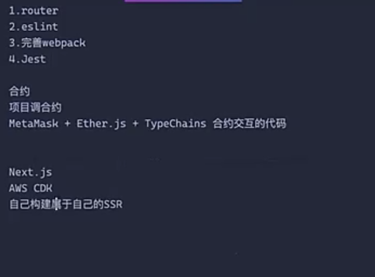

# MUI (Material-UI) 主题系统完整指南

## 1. 基础配置

### 1.1 必要的导入
```jsx
import { 
  createTheme, 
  ThemeProvider, 
  StyledEngineProvider 
} from '@mui/material/styles';
```

### 1.2 基本主题设置
```jsx
const theme = createTheme({
  palette: {
    primary: {
      main: '#1976d2',
      light: '#42a5f5',
      dark: '#1565c0'
    },
    secondary: {
      main: '#9c27b0'
    }
  },
  typography: {
    fontFamily: '"Roboto", "Helvetica", "Arial", sans-serif',
    h1: {
      fontSize: '2.5rem',
      fontWeight: 500
    }
  }
});
```

### 1.3 主题提供者设置
```jsx
function App() {
  return (
    <StyledEngineProvider injectFirst>
      <ThemeProvider theme={theme}>
        <App />
      </ThemeProvider>
    </StyledEngineProvider>
  );
}
```

## 2. 使用主题

### 2.1 在组件中访问主题
```jsx
import { useTheme } from '@mui/material/styles';

function MyComponent() {
  const theme = useTheme();
  
  return (
    <Button
      sx={{
        backgroundColor: theme.palette.primary.main,
        '&:hover': {
          backgroundColor: theme.palette.primary.dark
        }
      }}
    >
      主题色按钮
    </Button>
  );
}
```

### 2.2 响应式主题设计
```jsx
const theme = createTheme({
  breakpoints: {
    values: {
      xs: 0,    // 手机
      sm: 600,  // 平板
      md: 900,  // 小型笔记本
      lg: 1200, // 桌面显示器
      xl: 1536, // 大屏幕
    },
  },
  components: {
    MuiButton: {
      styleOverrides: {
        root: {
          fontSize: '1rem',
          [theme.breakpoints.up('sm')]: {
            fontSize: '1.2rem',
          },
        },
      },
    },
  },
});
```

## 3. 高级功能

### 3.1 深色/浅色模式切换
```jsx
function App() {
  const [mode, setMode] = useState('light');

  const theme = useMemo(
    () =>
      createTheme({
        palette: {
          mode,
        },
      }),
    [mode],
  );

  return (
    <ThemeProvider theme={theme}>
      <Button onClick={() => setMode(mode === 'light' ? 'dark' : 'light')}>
        切换主题
      </Button>
    </ThemeProvider>
  );
}
```

### 3.2 主题嵌套
```jsx
<ThemeProvider theme={outerTheme}>
  <div>
    <Button>外层主题按钮</Button>
    <ThemeProvider theme={innerTheme}>
      <Button>内层主题按钮</Button>
    </ThemeProvider>
  </div>
</ThemeProvider>
```

### 3.3 组件默认样式设置
```jsx
const theme = createTheme({
  components: {
    MuiButton: {
      defaultProps: {
        variant: 'contained',
        size: 'small',
      },
      styleOverrides: {
        root: {
          textTransform: 'none',
        },
      },
    },
  },
});
```

## 4. 最佳实践

### 4.1 StyledEngineProvider 使用建议
- 总是将 `StyledEngineProvider` 放在应用的最外层
- 使用 `injectFirst` 属性确保 MUI 样式优先级
- 有助于正确处理样式覆盖问题

### 4.2 性能优化建议
- 使用 `useMemo` 缓存主题对象
- 避免在渲染过程中创建新的主题对象
- 将主题配置抽离到单独的文件中维护

### 4.3 主题组织建议
- 为不同的设计变体创建单独的主题文件
- 使用常量管理颜色、尺寸等主题变量
- 建立完整的设计令牌（Design Tokens）系统

## 5. 注意事项
1. 确保在应用顶层配置主题提供者
2. 注意样式优先级管理
3. 合理使用响应式断点
4. 避免过度的主题嵌套
5. 保持主题配置的一致性

## 6. 常见问题解决
1. 样式未生效：检查 StyledEngineProvider 配置
2. 主题变量未更新：检查 useMemo 依赖项
3. 响应式不生效：确认断点设置正确
4. 样式覆盖问题：检查样式优先级和 sx 属性使用

## 7. 参考资源
- [MUI官方文档](https://mui.com/)
- [主题配置API](https://mui.com/customization/theming/)
- [样式解决方案](https://mui.com/system/basics/)




基建 web3 