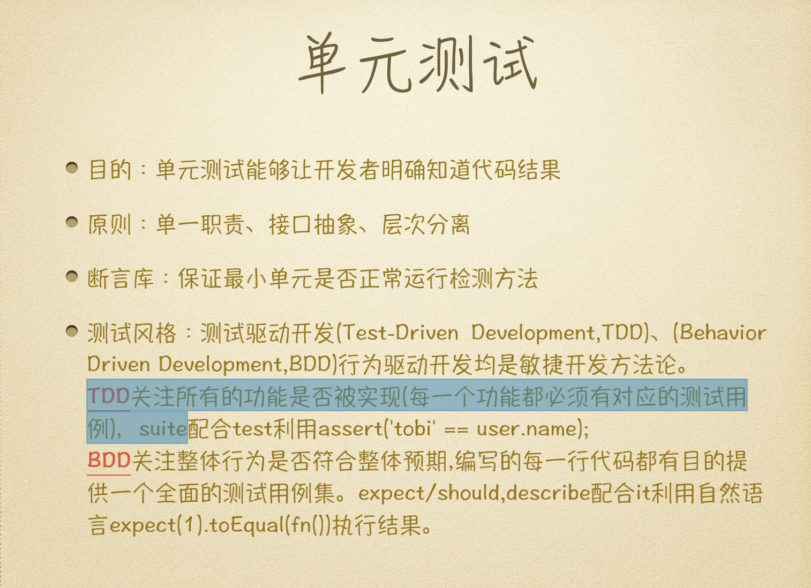
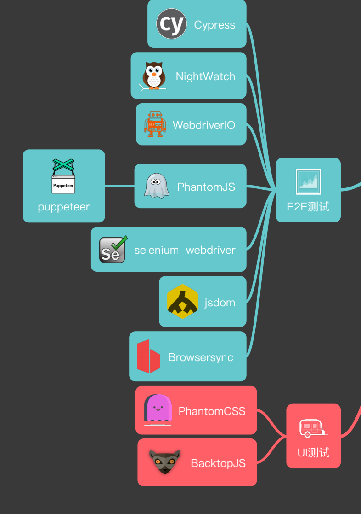

# [配置Eslint](./eslint-prettier-setup.md)

```js
install eslint-config-airbnb-typescript \
            @typescript-eslint/eslint-plugin@^7.0.0 \
            @typescript-eslint/parser@^7.0.0 \
            --save-dev
```

```text
pnpm install -D prettier eslint-plugin-prettier


```
eslint-config-prettier: 用于解决 ESLint 和 Prettier 的规则冲突
eslint-plugin-prettier: 将 Prettier 作为 ESLint 规则运行
prettier: Prettier 格式化工具本身


```
yarn add -D @typescript-eslint/eslint-plugin @typescript-eslint/parser eslint-config-airbnb-typescript
```

## [husky](https://www.npmjs.com/package/husky) 

```jsx
npx husky init 


 "test": "echo \"No tests specified\" && exit 0",
 "prepare": "husky"
```

## 单元测试 



jest 单元测试 ete 测试 



### UI测试 

#### [BacktopJS](https://github.com/garris/BackstopJS)

```text
COMMAND | Executing core for "init"
   init | Copying '/usr/local/lib/node_modules/backstopjs/capture/engine_scripts' to '/Users/lijinhai/Desktop/my_project/new-interface/backstop_data/engine_scripts'
   init | Configuration file written at '/Users/lijinhai/Desktop/my_project/new-interface/backstop.json'
COMMAND | Command "init" successfully executed in [0.098s]
```

### 单元测试

#### jest

```js
module.exports = {
  testMatch: ['**/?(*.)+(spec|test).ts?(x)'],
  setupFilesAfterEnv: ['<rootDir>/tests/setupTests.ts'],
  rootDir: '',
  transform: {
    '.(ts|tsx)': '@swc/jest'
  }
};
```

```text
# 使用 npx 运行 jest
npx jest

# 或者使用 npm script
npm test
```

> 单元测试覆盖率 jest-stare

```text
"test": "jest --collectCoverage --reports-default jest-stare",
```

rootDir: 设置为空字符串，表示使用默认的项目根目录
transform: 配置文件转换器

使用 @swc/jest 来转换 .ts 和 .tsx 文件
SWC 是一个用 Rust 编写的快速 JavaScript/TypeScript 转换器

> jest.config.js

```text
module.exports = {
  testEnvironment: 'node',
  testMatch: ['**/*.test.js', '**/*.spec.js', '**/*.spec.ts'],
  verbose: true,
};

```

#### majestic

```text

"test:unit": "majestic"
```


## 组件库

### turbo

### lerna

