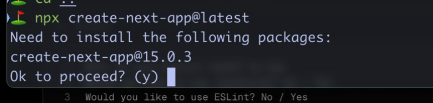

# 前端架构

SPA
MPA 常驻进程服务
同构 MPA + SPA

node 做接口聚合 接口的数量 接口的二次封装

node 最大优点 轻 便宜

```text
进到html目录
cd /workspace/docker/nginx/data/html

查看目录下文件
ll

将zhihuigongdi-web目录改名
sudo  mv 原文件名 新文件名

将上传的文件放到html目录下
sudo mv /tmp/zhihuigongdi-web  /workspace/docker/nginx/data/html

查看docker容器
docker ps -a

停掉nginx容器 
sudo docker stop c0202a0ea868（容器ID）

替换文件
sudo cp /workspace/docker/nginx/data/html/zhihuigongdi-web
 c0202a0ea868:/usr/share/nginx/html/zhihuigongdi-web

重启nginx容器
sudo docker start c0202a0ea868

```

```js
ts-node app.ts 
```


## pm2 核心原理

2. 核心功能和原理
- 进程守护：PM2 会在后台守护 Node.js 应用，如果应用崩溃或意外退出，PM2 会自动重启，以保证服务的持续性。它通过监控进程的状态，当检测到进程异常退出时，立即触发重新启动。
- 负载均衡（Cluster 模式）：PM2 通过 Node.js 原生的 Cluster 模块实现负载均衡，在多核 CPU 上开启多个进程（worker），并自动分配请求到不同进程，提升性能和并发处理能力。
- 日志管理：PM2 会记录应用的 stdout 和 stderr 日志，帮助开发者进行问题排查。同时，PM2 还支持通过 logrotate 插件进行日志分割，防止日志文件过大。
- 监控和管理：PM2 提供监控命令，可以查看每个进程的状态（如 CPU 使用率、内存占用等），并可以通过 web 界面或 PM2 Plus（付费服务）进行远程监控。
- 进程持久化：PM2 可以将进程列表保存到一个配置文件中，系统重启后可以自动恢复之前的进程状态。

“PM2 是一个常用的 Node.js 进程管理工具，它通过守护进程和自动重启机制保证应用的高可用性。它使用 Cluster 模式在多核 CPU 上实现负载均衡，并通过日志管理和监控命令帮助开发者排查问题。PM2 的主进程会定期检查和管理各个子进程，确保其正常运行并及时重启异常退出的进程，从而保持服务的稳定性。”


## 项目搭建 

```text
├── Dockerfile
├── app.ts
├── assets
├── config
├── docker-compose.yml
├── ecosystem.config.js
├── index.todo
├── interface
├── logs
├── middlewares
├── node_modules
├── package.json
├── routers
├── services
├── tsconfig.json
├── typings
├── views
└── yarn.lock


```

### koa-swig 

```js
const Koa = require('koa');
const Router = require('koa-router');
const render = require('koa-swig');
const path = require('path');
const co = require('co');

const app = new Koa();
const router = new Router();

// 配置模板引擎
app.context.render = co.wrap(
  render({
    root: path.join(__dirname, 'views'), // 模板文件所在的目录
    autoescape: true,
    cache: false, // 生产环境中建议设置为 'memory' 以启用缓存
    ext: 'html', // 模板文件的扩展名
  })
);

// 配置路由
router.get('/', async (ctx) => {
  await ctx.render('index', {
    title: '首页',
    content: '欢迎使用 Koa 和 koa-swig!',
  });
});

app.use(router.routes()).use(router.allowedMethods());

const PORT = 3000;
app.listen(PORT, () => {
  console.log(`Server running on http://localhost:${PORT}`);
});

```

### ioc di aop 在面试时

1. IoC（Inversion of Control，控制反转）

> 概念：IoC 是一种设计原则，用于将对象的创建和管理交给容器或框架，而不是由对象自身控制。IoC 通过将控制权交给外部，增强了系统的灵活性和可扩展性。

通过 IoC 容器来管理服务和组件的实例，使得代码更加模块化、可测试。在 React 中，我们也可以使用 Context API 或者 Redux 来实现类似的控制反转效果，让组件的状态和依赖更加集中和便于管理。”

2. DI（Dependency Injection，依赖注入）

> 概念：DI 是实现 IoC 的一种具体方式，通过将对象的依赖关系注入到对象内部，而不是在对象内部创建依赖。依赖注入使得对象之间的耦合度降低，提高了代码的可维护性和可测试性。

“依赖注入是控制反转的一种实现方式。在前端开发中，Angular 利用 DI 系统来注入服务和依赖，这使得组件代码更简洁、更易测试。在 Vue 中，我们可以通过插件模式为应用注入全局依赖；在 React 中，可以通过 Context API 或第三方库来实现依赖注入。”

3. AOP（Aspect-Oriented Programming，面向切面编程）

> 概念：AOP 是一种编程范式，用于将横切关注点（如日志记录、性能监控、权限验证）从业务逻辑中分离出来，从而实现代码的解耦和重用。

“AOP 是一种将通用功能与业务逻辑分离的编程方式。在前端中，我们可以使用拦截器来实现 AOP，比如在 Vue 或 Angular 中使用 HTTP 拦截器来统一处理请求的日志记录或异常。在 React 中，可以通过高阶组件或 Hooks 抽离横切关注点，实现类似的效果，比如在组件加载时执行特定的逻辑或进行错误边界处理。”

- 安装 awilix 和 awilix-koa


```text
npm install awilix awilix-koa
```

> 创建服务和控制器

```js
// services/UserService.js: 定义一个用户服务，用于处理用户相关的业务逻辑。

class UserService {
  getUserById(id) {
    // 模拟从数据库获取用户
    return { id, name: 'John Doe' };
  }
}

module.exports = UserService;

```
```js
controllers/UserController.js: 定义一个控制器，将服务注入到控制器中。


const { route, GET } = require('awilix-koa');

@route('/user')
class UserController {
  constructor({ userService }) {
    this.userService = userService; // 依赖注入 UserService
  }

  @route('/:id')
  @GET()
  async getUser(ctx) {
    const user = this.userService.getUserById(ctx.params.id);
    ctx.body = user;
  }
}

module.exports = UserController;
```

> 配置依赖注入容器

```js

// app.js: 配置 awilix 容器，并将服务注册到容器中。

const Koa = require('koa');
const Router = require('koa-router');
const { scopePerRequest, loadControllers } = require('awilix-koa');
const { createContainer, asClass } = require('awilix');

const app = new Koa();
const router = new Router();

// 创建 DI 容器
const container = createContainer();

// 注册服务
container.register({
  userService: asClass(require('./services/UserService')).scoped(),
});

// 使用 awilix-koa 中间件
app.use(scopePerRequest(container));
app.use(loadControllers('./controllers/*.js', { cwd: __dirname }));

app.use(router.routes()).use(router.allowedMethods());

app.listen(3000, () => {
  console.log('Server running on http://localhost:3000');
});
```

在此示例中，我们实现了依赖注入（DI）和控制反转（IoC）：

- DI：在 UserController 中，我们通过构造函数注入 UserService，实现了服务的依赖注入，这样控制器和服务被解耦，可以更方便地进行单元测试。
- IoC：我们使用 awilix 容器来管理依赖，这种方式将对象的创建和依赖管理控制权交给了容器，从而实现了控制反转。

### 静态资源 

koa-static 

```js
import serve from "koa-static";


app.use(serve(staticDir));

```

### log4

```js
import { configure, getLogger } from "log4js";

configure({
  appenders: { cheese: { type: "file", filename: `${__dirname}/logs/yd.log` } },
  categories: { default: { appenders: ["cheese"], level: "error" } },
});

const logger = getLogger("cheese");

ErrorHandler.error(app, logger);

```

```js
import Koa from 'koa';
import { Context } from '@interfaces/IKoa';
import { Logger } from 'log4js';

class ErrorHandler {
  static error(app: Koa, logger: Logger) {
    app.use(async (ctx: Context, next: () => Promise<unknown>) => {
      try {
        await next();
      } catch (e) {
        logger.error(e);
        ctx.body = '500请求啦~恢复中.';
      }
    });

    // MPA和SPA的结合的话 这个中间件就没有用了
    app.use(async (ctx: Context, next: () => Promise<unknown>) => {
      await next();
      if (ctx.status !== 404) {
        return;
      }
      ctx.body =
        '<script type="text/javascript" src="//qzonestyle.gtimg.cn/qzone/hybrid/app/404/search_children.js" charset="utf-8"></script>';
    });
  }
}
export default ErrorHandler;

```

### koa-swig

```js
import render from "koa-swig";
import serve from "koa-static";
import co from "co";

app.context.render = co.wrap(
  render({
    root: viewDir,
    autoescape: true,
    cache: <"memory" | false>memoryFlag,
    writeBody: false,
    ext: "html",
  })
);
app.use(serve(staticDir));
```


SSR
    MPA(纯)
    同构

SPA 
    loading 过程长
    bigpipe 
    nest next nuxt 


## next




## 架构13

### Fork TS checker webpack 插件 


> Fork TS Checker Webpack Plugin 的作用是将 TypeScript 类型检查和 ESLint 检查从 Webpack 的主编译进程中分离出来，在一个单独的工作进程中运行，从而提升编译的速度。


### 优化性能 

### Million

>  给我一些实际的代码 解决生产问题


### 实现ioc


#### ts-node-env

```text
 "scripts": {
    "dev": "ts-node-dev --respawn --transpile-only ./index.ts"
  },
```

### AST

静态语法分析树 


#### haskey

```ts
function haskey<O extends Object>(obj: O, key: PropertyKey): key is keyof O {
  return obj.hasOwnProperty(key);
}
```