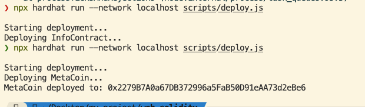

# hardhat


```text
# 1.初始化项目 
 npx hardhat


 # 2. 编写合约
 # contracts/MyContract.sol


 #3. 编译合约
 npx hardhat compile

 #4.编写测试
 # test/MyContract.test.js

npx hardhat test


 #6.启动本地网络
 npx hardhat node

 #7.部署合约
npx hardhat run --network localhost scripts/deploy.js

```


```text
您在使用 Hardhat 部署合约时遇到了 TypeError: metaCoin.deployed is not a function 的错误。这是由于 ethers.js 在版本 6 中对合约部署方法进行了更改。在 ethers.js v6 中，deployed() 方法已被弃用，取而代之的是 waitForDeployment() 方法。 
GITHUB

因此，您需要将部署脚本中的 await metaCoin.deployed() 修改为 await metaCoin.waitForDeployment()。同时，获取合约地址的方式也有所变化，metaCoin.address 应替换为 metaCoin.target。

```

