# Defi

## Defi基础概念

> 去中心化金融(Decentralized finance)

CeFi是中心化金融的缩写，它提供了DeFⅰ的一些收益优势以及传统金融服务产品的一些易用性和安全性。使用CeFi,您可以赚取储蓄利息、借钱、使用加密借记卡消费等等。

去中心化金融是一种建立于区块链上的金融，它不依赖券商、交易所或银行等金融机构提供金融工具，而是利用区块链上的智慧型合约进行金融活动。DeFⅰ平台允许人们向他人借出或借入资金，交易加密货币，并在类似储蓄的帐户中获得利息。截至2020年10月，超过110亿美元被存入各种去中心化金融协定。

## Defi 行业赛道 

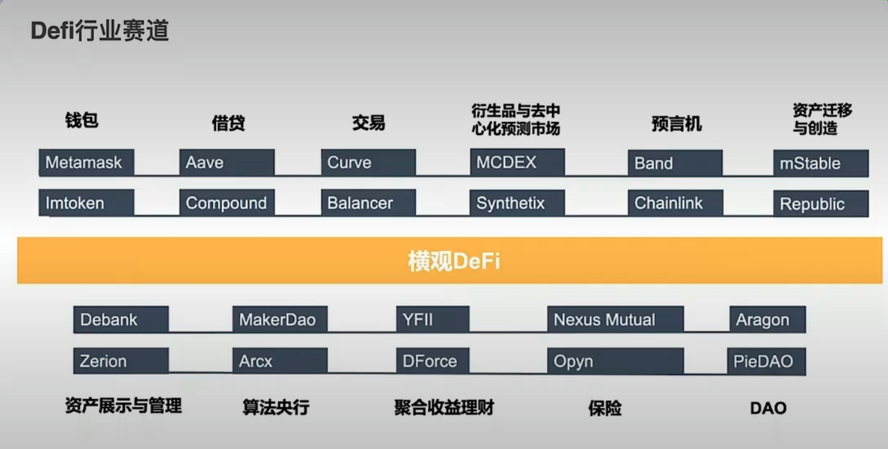

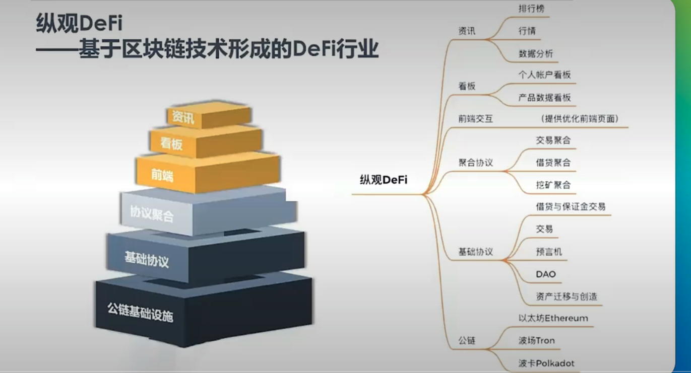

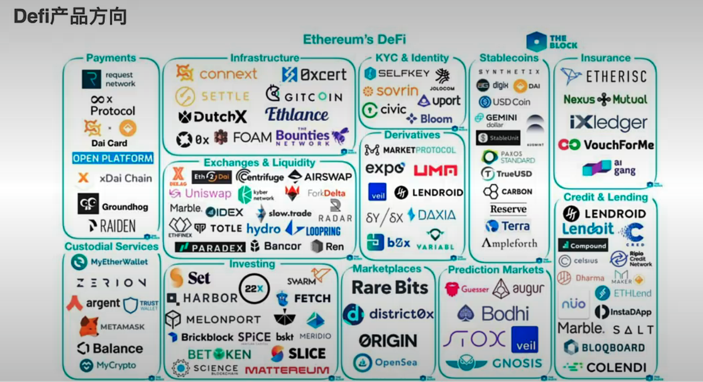

## 产品体验

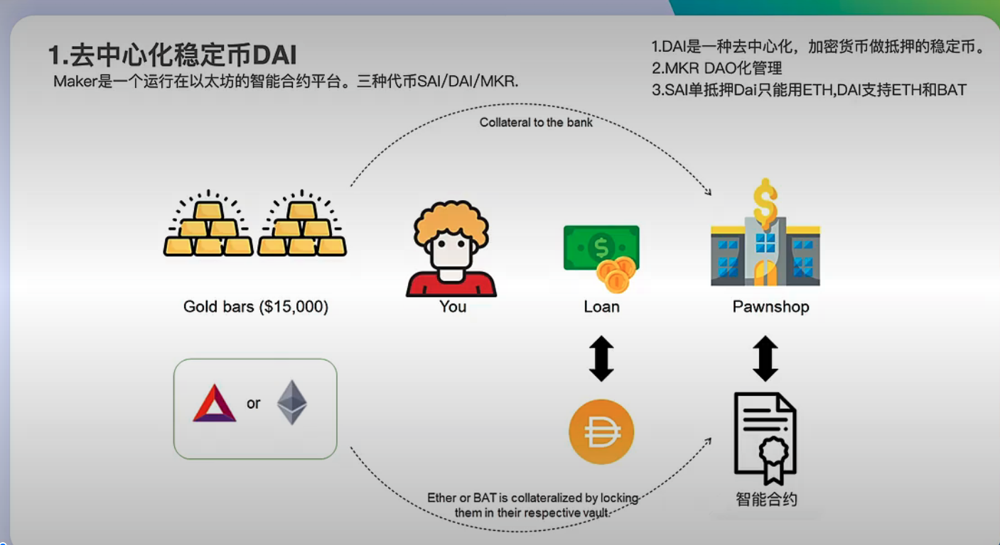

### 去中心化稳定币铸造DAI

[Maker](https://makerdao.com/zh-CN/)

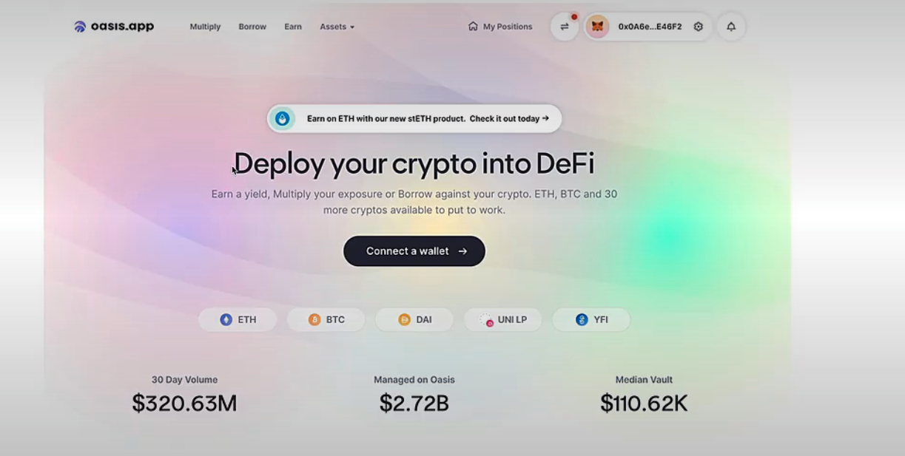

### 去中心化借贷

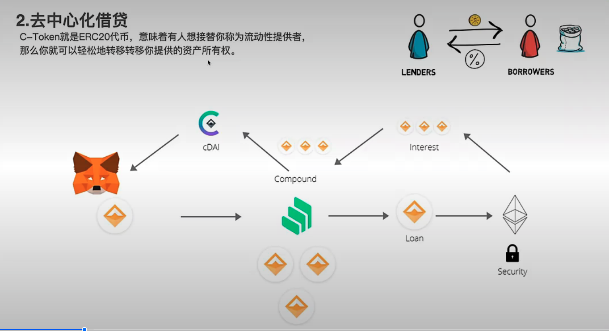
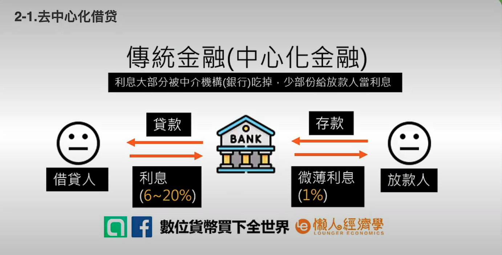
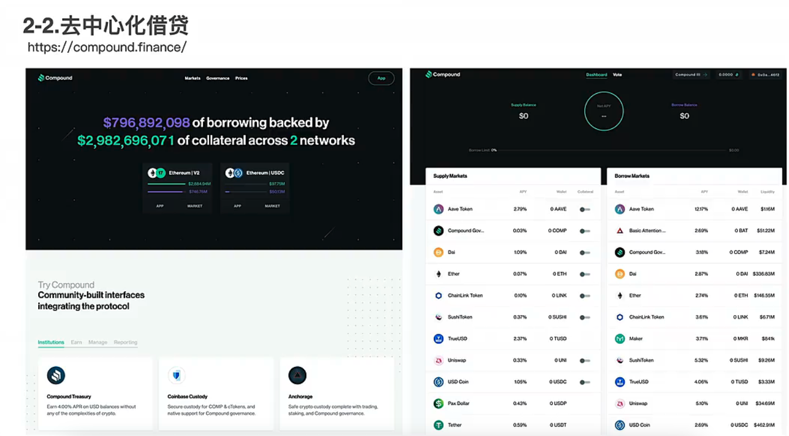
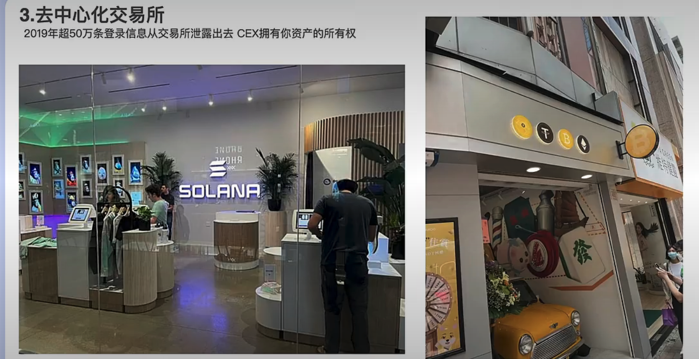
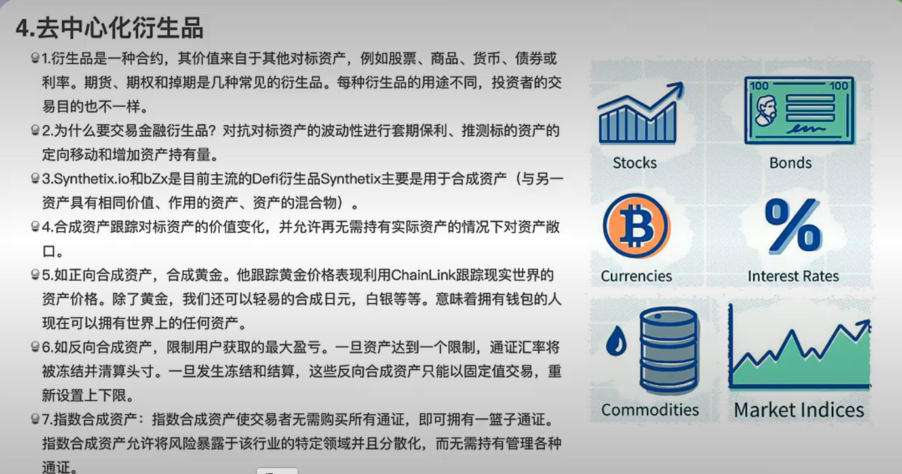
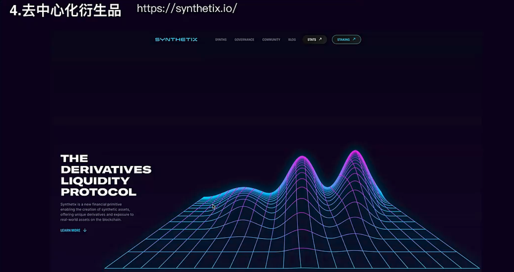

### 去中心化资金管理 Social Finance

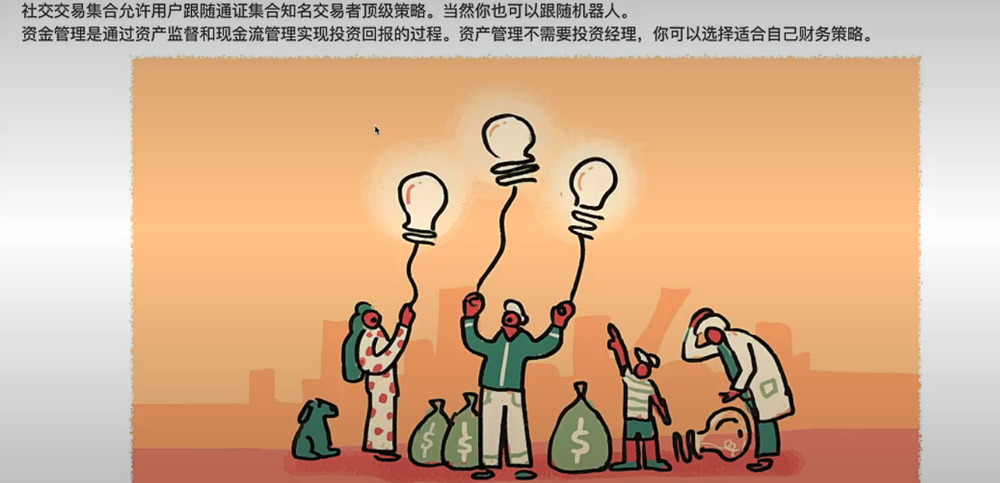

### 去中心化资金管理- set Token

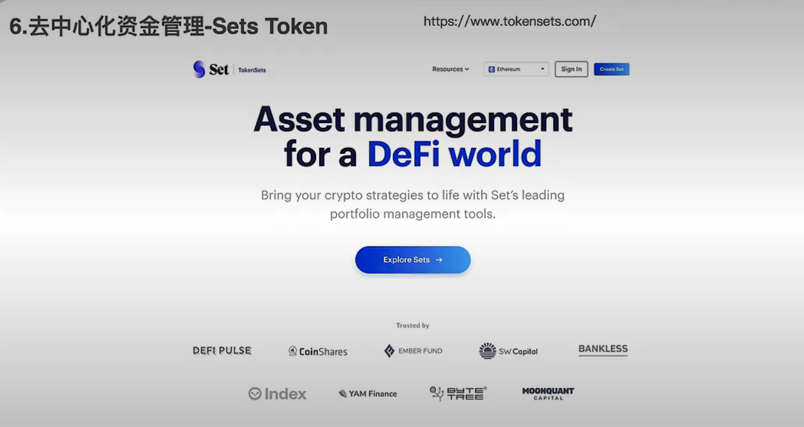

### 去中心化彩票
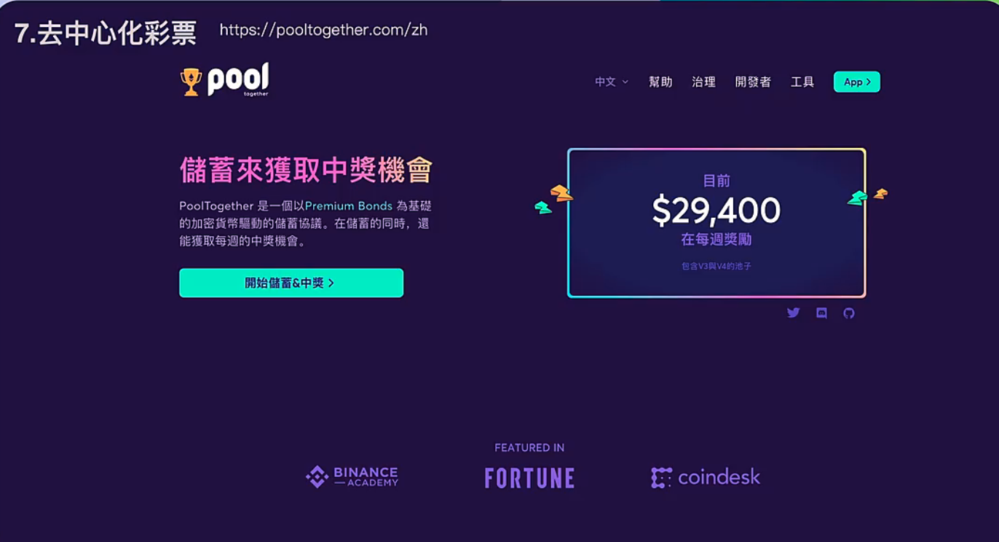

### 去中心化支付 

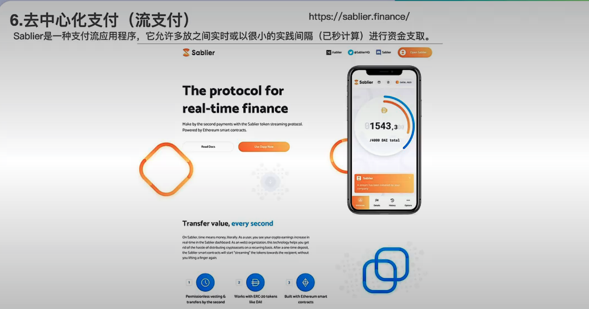

### 去中心化保险

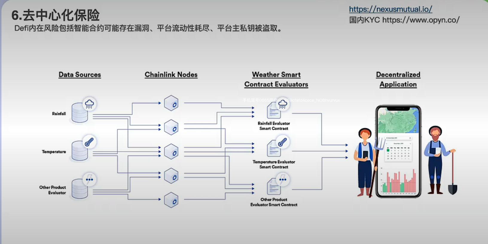
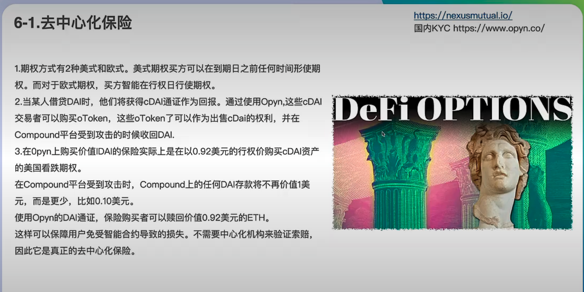

### 跟踪自唱
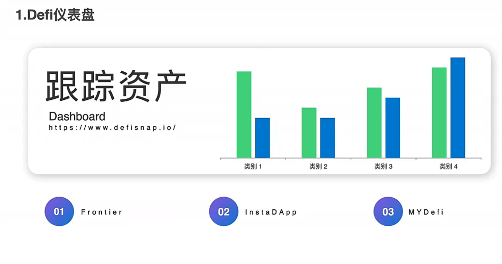

### 行业指标
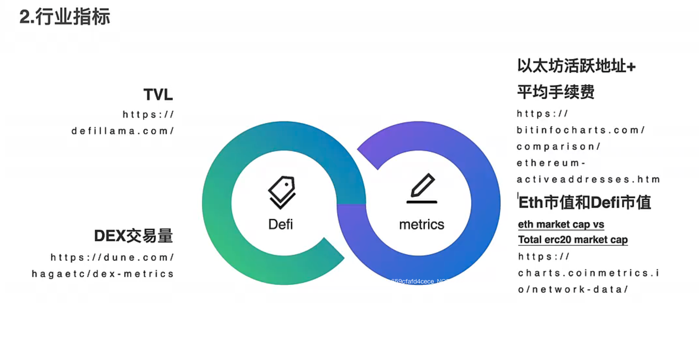