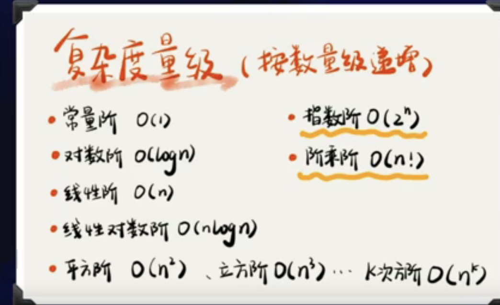
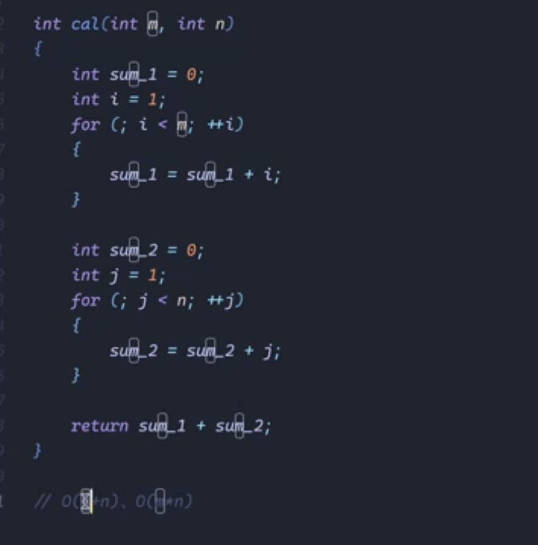

# 算法基础

## 1.请你总结如何计算算法时间复杂度+空间复杂度。


- 简单的数据结构：

  -  有序：栈、队列、链表、有序数据结构节省时间（存储空间小）

  -  无序：集合、字典、散列表、无序列表数据结构（读取时间块）

- 复杂的数据结构：树、堆、图
- 算法复杂度如何分析

```text
复杂度分析是整个算法学习的精髓，只要掌握了它，数据结构和算法的内容基本上就掌握了一半。
事后统计法：把代码跑一遍，通过统计、监控，就能得到算法执行的时间和占用的内存大小
局限性在哪：测试结果非常依赖测试环境、测试结果受数据规模的影响很大(benchmark能解决但不适用于算法)
我们需要一个不用具体的测试数据来测试，就可以粗略地估计算法的执行效率的方法。（大O复杂度表示法）T(n)=O(f(n))
表示代码执行时间随数据规模增长的变化趋势，公式中的低阶、常量、系数部分并不左右增长趋势，所以都可以忽略。T(n)=O(2n2+2n+3)

```

### benchmark

- 面向切面编程AOP无侵入式统计
- benchmark基准测试方法，它并不是简单的统计执行多少次测试代码后对比时间，对测试有严密的抽样过程，执行多少次取决于采样数据能否完成统计，根据统计次数计算方差

- 时间复杂度如何分析

### 算法时间复杂度具体分析

- 只关注循环执行次数最多的一段代码
- 加法法则：总复杂度等于量级最大的那段代码的复杂度
- 乘法法则：嵌套代码的复杂度等于嵌套内外代码复杂度的乘积
- 有二分查找的话则为O(logN)



```js
i = 1;
while(i=<n){
    i= i+2
}
```

时间复杂度O(log2n)
实际上，不管是以2为底、以3为底，还是以10为底，我们可以把所有对数阶的时间复杂度 O(log2n)



### 空间复杂度 

我们常见的空间复杂度就是O(1)、O(n)、O(n2),像O(logn)、O(nlogn)这样的对数阶复杂度平时都用不到。

### 工具

Bubble sort
cs.usfca.edu
csanim.com
visualgo.net
algorithm-visualizer.org

## 2.什么是栈？JavaScript中有哪些栈的具体应用？

```text
栈是一种特殊的线性数据结构，其特点是后进先出（LIFO，Last In First Out）。栈的操作主要包括入栈（push）和出栈（pop），入栈是将新元素添加到栈顶，出栈则是移除栈顶元素。
具体应用：值类型变量存储在栈 、浏览器历史记录
```