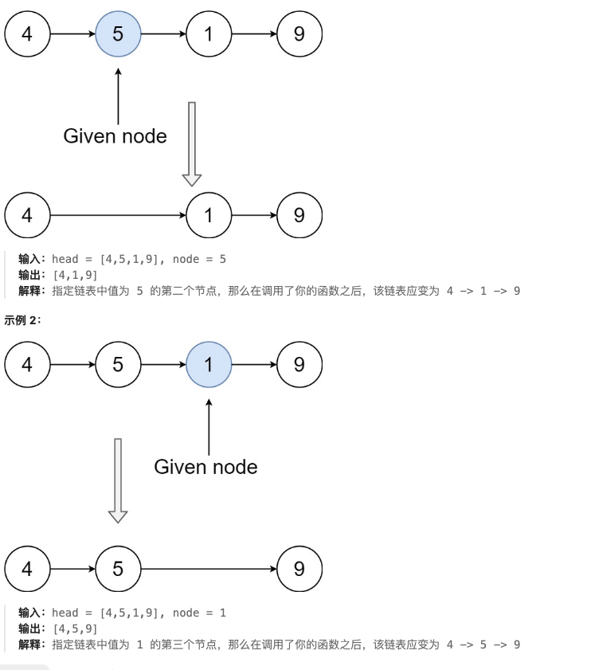

# 链表 


## [反转链表](https://leetcode.cn/problems/reverse-linked-list/)

给你单链表的头节点 head ，请你反转链表，并返回反转后的链表。

示例 1：

输入：head = [1,2,3,4,5]
输出：[5,4,3,2,1]
示例 2：

输入：head = [1,2]
输出：[2,1]
示例 3：

输入：head = []
输出：[]

```js
/**
 * Definition for singly-linked list.
 * function ListNode(val, next) {
 *     this.val = (val===undefined ? 0 : val)
 *     this.next = (next===undefined ? null : next)
 * }
 */
/**
 * @param {ListNode} head
 * @return {ListNode}
 */
var reverseList = function(head) {
    if(!head||!head.next){
        return head
    }
    let prev = null;
    let cur = head;
    while(cur){
        let next = cur.next;
        cur.next = prev;
        prev = cur; 
        cur = next
    }
    return prev

};
```
[解释](https://chatgpt.com/c/6708c603-ad64-800c-9bf7-c2ab78f882ff)

## [删除链表中的节点](https://leetcode.cn/problems/delete-node-in-a-linked-list/)



```js
var deleteNode = function(node) {
    if(!node){
        return 
    }
    if(!node.next){
        node = null
        return 
    }
    node.val = node.next.val
    node.next = node.next.next
    
};
```
