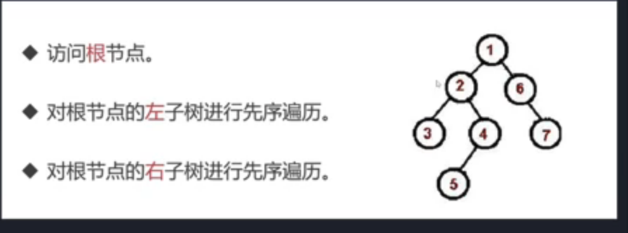
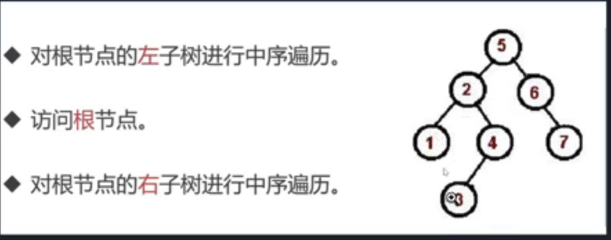
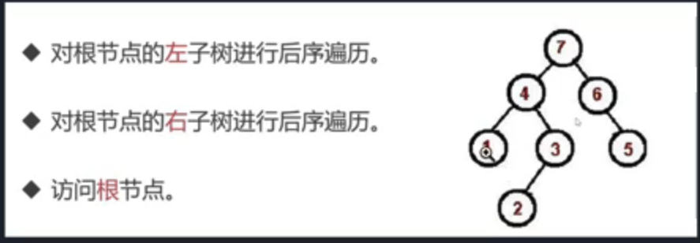

# 实现树的遍历

## 实现树的先序遍历

前序遍历：根节点->左子树->右子树



中序遍历：左子树->根节点->右子树



后序遍历: 左子树->右子树->根节点



层次遍历：只需按层次遍历即可

> 使用JavaScript/TypeScript实现树的先序遍历

- push 和 pop 是 JavaScript 中用于操作数组的两种常用方法，主要用于在数组的末尾添加或删除元素

```js
const { curry } = require("lodash");

class TreeNode {
  constructor(val, left = null, right = null) {
    this.val = val;
    this.left = left;
    this.right = right;
  }
}

// 创建二叉树

const root = new TreeNode(1);

root.left = new TreeNode(2);
root.right = new TreeNode(3);
root.left.left = new TreeNode(4);
root.left.right = new TreeNode(5);
root.right.left = new TreeNode(6);
root.right.right = new TreeNode(7);

// 先序遍历

// 根节点 左子树 右子树
function preorderTraversal(root) {
  if (!root) return [];
  const stack = [root];
  const result = [];
  while (stack.length > 0) {
    const node = stack.pop();
    result.push(node.val);
    if (node.right) stack.push(node.right);
    if (node.left) stack.push(node.left);
  }
  return result;
}

const res = preorderTraversal(root);

console.log(res, "res-res");

```

## [实现树的中序遍历](https://chatgpt.com/c/671a008a-ae78-800c-941e-118036b1f747)

```test
        1
       / \
      2   3
     / \ / \
    4  5 6  7

```
[
  4, 2, 5, 1,
  6, 3, 7
] res-res

```js
const { curry } = require("lodash");

class TreeNode {
  constructor(val, left = null, right = null) {
    this.val = val;
    this.left = left;
    this.right = right;
  }
}

// 创建二叉树

const root = new TreeNode(1);

root.left = new TreeNode(2);
root.right = new TreeNode(3);
root.left.left = new TreeNode(4);
root.left.right = new TreeNode(5);
root.right.left = new TreeNode(6);
root.right.right = new TreeNode(7);

// 先序遍历

// 左子树->根节点->右子树
function inorderTraversal(root) {
  //中序遍历：左子树->根节点->右子树
  const stack = [];
  let curr = root;
  const res = [];
  while (stack.length || curr) {
    while (curr) {
      stack.push(curr);
      curr = curr.left;
    }
    curr = stack.pop();
    res.push(curr.val);
    curr = curr.right;
  }
  return res;
}

const res = inorderTraversal(root);

console.log(res, "res-res");

```

## [实现树的后序遍历](https://chatgpt.com/c/671a4651-59b0-800c-904d-79021febcedd)

```js
const { curry } = require("lodash");

class TreeNode {
  constructor(val, left = null, right = null) {
    this.val = val;
    this.left = left;
    this.right = right;
  }
}

// 创建二叉树

const root = new TreeNode(1);

root.left = new TreeNode(2);
root.right = new TreeNode(3);
root.left.left = new TreeNode(4);
root.left.right = new TreeNode(5);
root.right.left = new TreeNode(6);
root.right.right = new TreeNode(7);

// 先序遍历

// 后序遍历: 左子树->右子树->根节点
function postorderTraversal(root) {
  const stack = [];
  const result = [];
  let lastVisiteNode = null;
  while (root || stack.length) {
    if (root) {
      stack.push(root);
      root = root.left;
    } else {
      const peekNode = stack[stack.length - 1];
      // 如果右子树存在并且还没有被访问过
      if (peekNode.right && peekNode.right !== lastVisiteNode) {
        root = peekNode.right;
      } else {
        // 右子树已经被访问过，或者右子树不存在 就访问当前节点
        result.push(peekNode.val);
        lastVisiteNode = stack.pop();
      }
    }
  }
  return result;
}

const res = postorderTraversal(root);

console.log(res, "res-res");

```