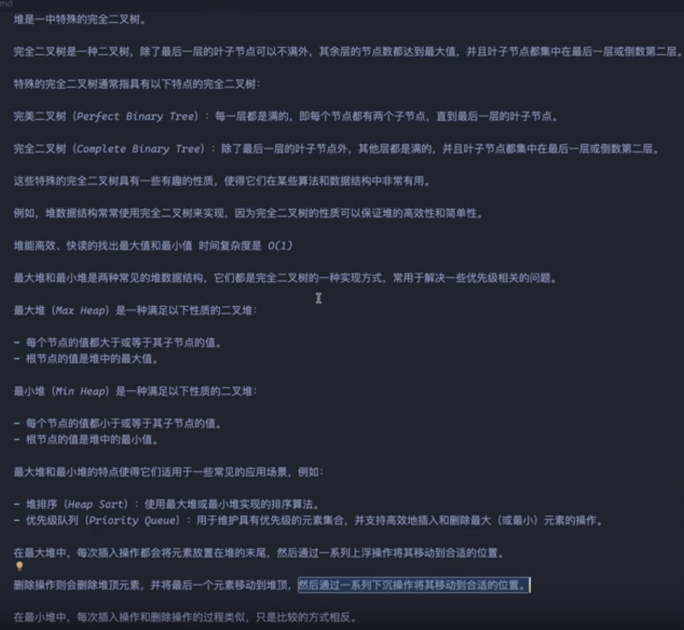
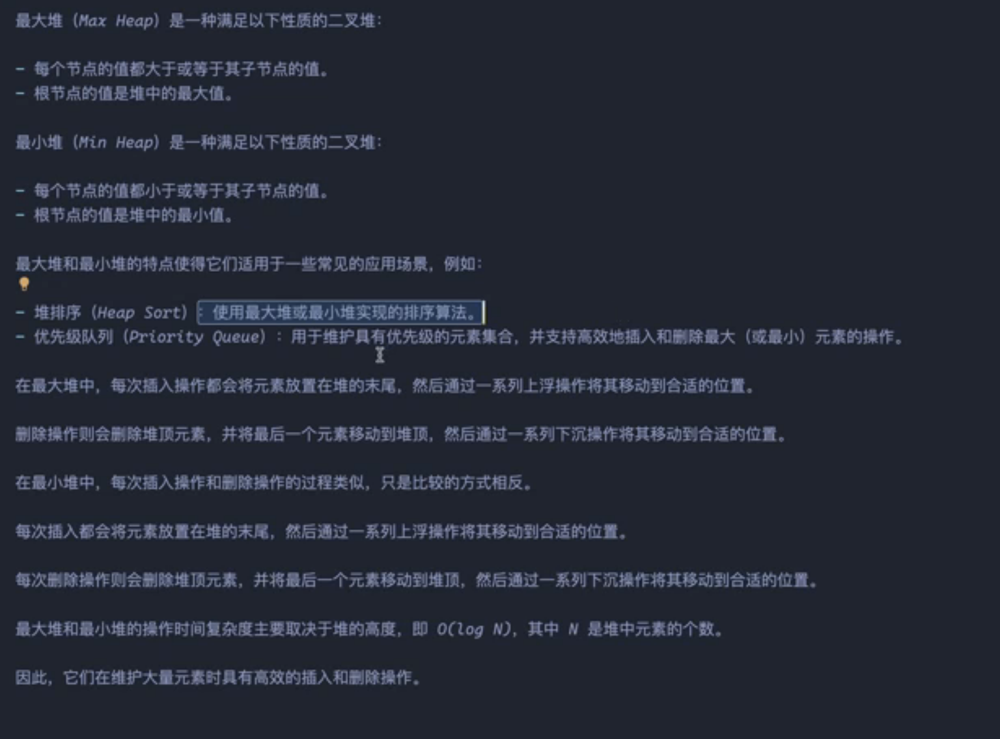
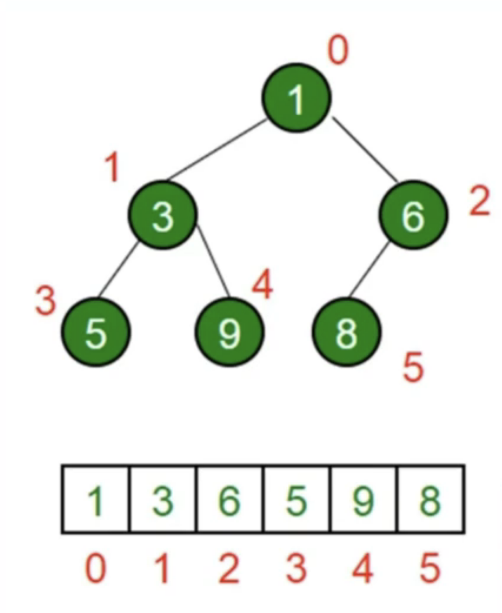
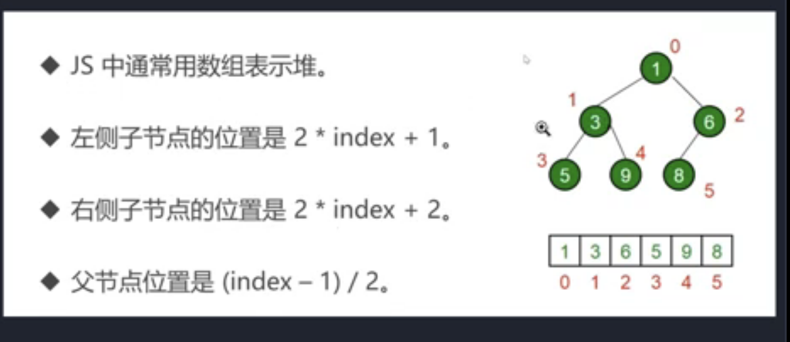

# [数组中的第K个最大元素](https://leetcode.cn/problems/kth-largest-element-in-an-array/)

## 堆









logn On*logn

查找快，修改慢

```js
/**
 * @param {number[]} nums
 * @param {number} k
 * @return {number}
 */
 class MinHeap {
    constructor() {
        this.heap = [];
    }

    // 获取父节点的索引
    getParentIndex(index) {
        return Math.floor((index - 1) / 2);
    }

    // 获取左子节点的索引
    getLeftChildIndex(index) {
        return 2 * index + 1;
    }

    // 获取右子节点的索引
    getRightChildIndex(index) {
        return 2 * index + 2;
    }

    // 交换两个节点
    swap(i, j) {
        [this.heap[i], this.heap[j]] = [this.heap[j], this.heap[i]];
    }

    // 向上调整
    heapifyUp(index) {
        const parentIndex = this.getParentIndex(index);
        if (parentIndex >= 0 && this.heap[index] < this.heap[parentIndex]) {
            this.swap(index, parentIndex);
            this.heapifyUp(parentIndex);
        }
    }

    // 向下调整
    heapifyDown(index) {
        const leftChildIndex = this.getLeftChildIndex(index);
        const rightChildIndex = this.getRightChildIndex(index);
        let smallestIndex = index;

        if (leftChildIndex < this.heap.length && this.heap[leftChildIndex] < this.heap[smallestIndex]) {
            smallestIndex = leftChildIndex;
        }

        if (rightChildIndex < this.heap.length && this.heap[rightChildIndex] < this.heap[smallestIndex]) {
            smallestIndex = rightChildIndex;
        }

        if (smallestIndex !== index) {
            this.swap(index, smallestIndex);
            this.heapifyDown(smallestIndex);
        }
    }

    // 插入新元素
    insert(value) {
        this.heap.push(value);
        this.heapifyUp(this.heap.length - 1);
    }

    // 删除并返回最小元素
    extractMin() {
        if (this.heap.length === 0) {
            return null;
        }

        const min = this.heap[0];
        const last = this.heap.pop();
        
        if (this.heap.length > 0) {
            this.heap[0] = last;
            this.heapifyDown(0);
        }

        return min;
    }

    // 获取最小元素但不删除
    peek() {
        return this.heap.length > 0 ? this.heap[0] : null;
    }

    // 获取堆的大小
    size() {
        return this.heap.length;
    }
}
var findKthLargest = function(nums, k) {
    const minHeap = new MinHeap();
    for(let i = 0 ; i< nums.length; i++){
        if(minHeap.heap.length<k){
            minHeap.insert(nums[i])
        }else if(nums[i]>minHeap.heap[0]){
            minHeap.heap[0] = nums[i]
            minHeap.heapifyDown(0)
        }
    }
    return minHeap.heap[0]
    
};
```

时间复杂度：O(nlogk)，其中 n 是数组长度
空间复杂度：O(k)，用于存储堆