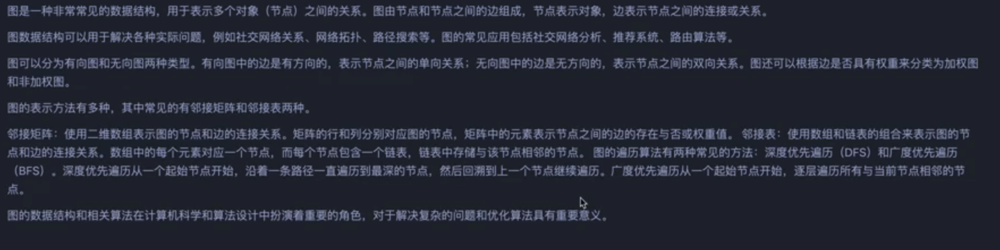
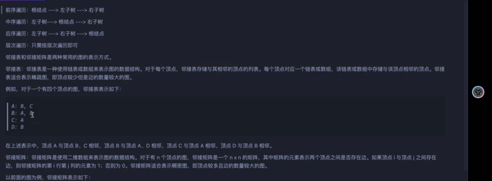

# [图]






```js
const graph = {
    A:['B','C'],
    B:['D','E'],
    C:['F'],
    D:[],
    E:[],
    F:[]
}
// 深度优先遍历（DFS） 
function dfsMemoization(graph, start) {
    const visited = new Set();
    const result = []; // 添加结果数组
    
    function dfs(node) {
        if(visited.has(node)) return;
        
        visited.add(node);
        result.push(node); // 记录访问顺序
        
        for(const neighbor of graph[node]) {
            dfs(neighbor);
        }
    }
    
    dfs(start);
    return result; // 返回遍历结果
}
```

> 广度优先

```js
function bfsTraversal(graph, start) {
    const visited = new Set();
    const queue = [];
    const result = []; // 添加结果数组
    
    queue.push(start);
    
    while(queue.length > 0) {
        const node = queue.shift();
        if(visited.has(node)) continue;
        
        visited.add(node);
        result.push(node); // 记录访问顺序
        
        const neighbors = graph[node].sort();
        for(const neighbor of neighbors) {
            queue.push(neighbor);
        }
    }
    
    return result; // 返回遍历结果
}

```


