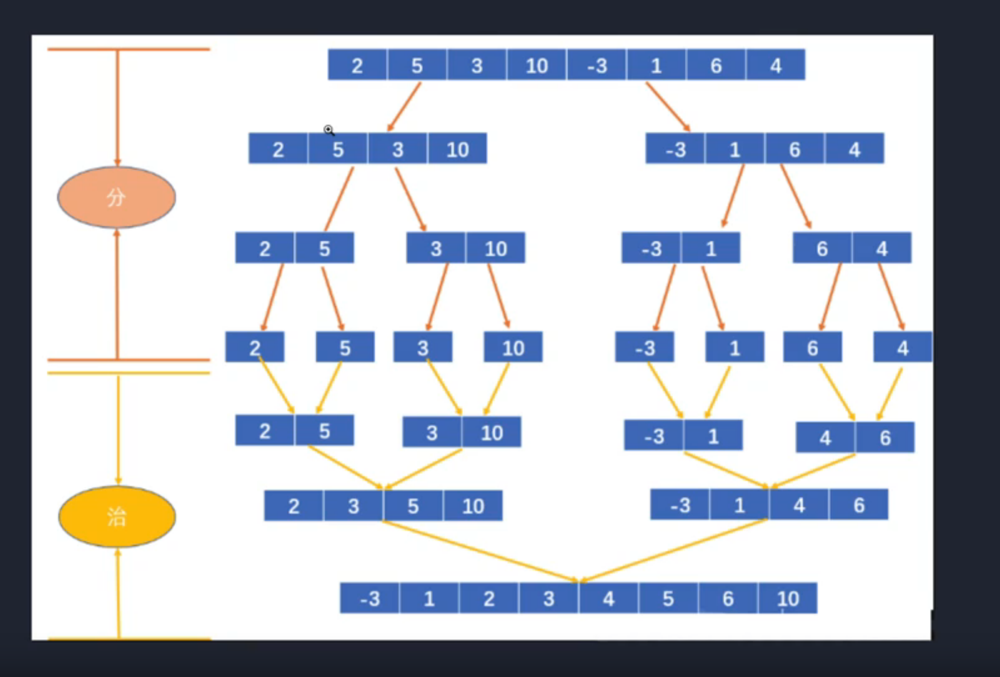

# [归并排序]




```js
function mergeSort(arr) {
  if (arr.length < 2) return arr;
  let middle = Math.floor(arr.length / 2);
  let left = arr.slice(0, middle);
  let right = arr.slice(middle, arr.length);
  return merge(mergeSort(left), mergeSort(right));
}

function merge(left, right) {
  let result = [];
  while (left.length && right.length) {
    if (left[0] <= right[0]) {
      result.push(left.shift());
    } else {
      result.push(right.shift());
    }
  }
  while (left.length) {
    result.push(left.shift());
  }
  while (right.length) {
    result.push(right.shift());
  }
  return result;
}

let arr = [8, 3, 4, 5, 7, 9, 2, 1];

arr = mergeSort(arr);

console.log("new arr", arr);

```