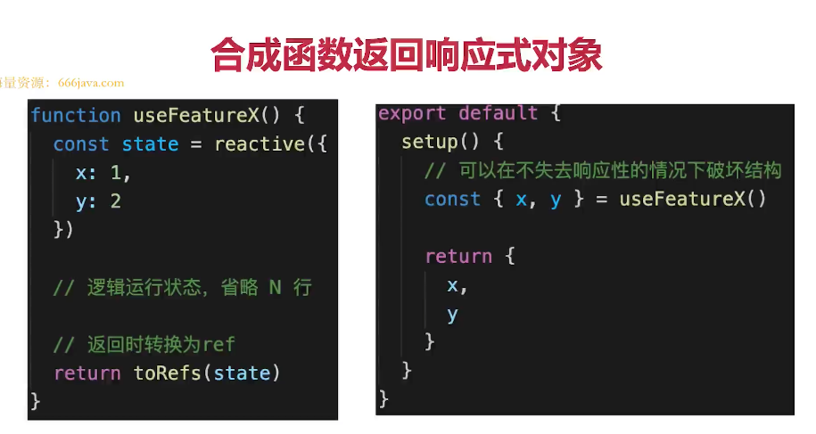
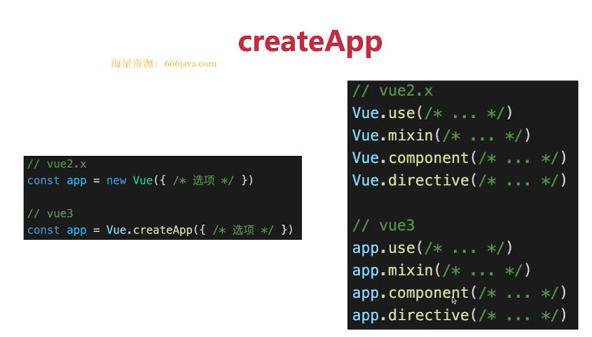

# Vue3

## Vue3比Vue2 有哪些优势？

:::tip
1. 性能更好
2. 体积更小 
3. 更好的ts支持 
4. 更好的代码组织
5. 更好的逻辑抽离
6. 更多新功能 
:::

## 描述Vu3生命周期
### OptionAPI 生命周期

:::tip
1. beforeDestroy 改为beforeUnmount
2. destroyed 改为unmouted
3. 其他沿用vue2 生命周期 
:::

### composition API 生命周期 
[compositionAPI](https://cn.vuejs.org/guide/extras/composition-api-faq.html#%E4%BB%80%E4%B9%88%E6%98%AF%E7%BB%84%E5%90%88%E5%BC%8F-api)

```vue
<template>
    <p>生命周期 {{msg}}</p>
</template>

<script>
import { onBeforeMount, onMounted, onBeforeUpdate, onUpdated, onBeforeUnmount, onUnmounted } from 'vue'

export default {
    name: 'LifeCycles',

    props: {
        msg: String
    },

    // 等于 beforeCreate 和 created
    setup() {
        console.log('setup')

        onBeforeMount(() => {
            console.log('onBeforeMount')
        })
        onMounted(() => {
            console.log('onMounted')
        })
        onBeforeUpdate(() => {
            console.log('onBeforeUpdate')
        })
        onUpdated(() => {
            console.log('onUpdated')
        })
        onBeforeUnmount(() => {
            console.log('onBeforeUnmount')
        })
        onUnmounted(() => {
            console.log('onUnmounted')
        })
    },

    // beforeCreate() {
    //     console.log('beforeCreate')
    // },
    // created() {
    //     console.log('created')
    // },
    // beforeMount() {
    //     console.log('beforeMount')
    // },
    // mounted() {
    //     console.log('mounted')
    // },
    // beforeUpdate() {
    //     console.log('beforeUpdate')
    // },
    // updated() {
    //     console.log('updated')
    // },
    // // beforeDestroy 改名
    // beforeUnmount() {
    //     console.log('beforeUnmount')
    // },
    // // destroyed 改名
    // unmounted() {
    //     console.log('unmounted')
    // }
}
</script>
```

## 如何看待Composition Api 和Options API
### composition API 带来了什么？

::: tip
1. 更好的代码组织
2. 更好的逻辑复用 
3. 更好的类型推导
:::

### Composition API 和Options API 如何选择
### 对Composition API误解
## 如何理解ref toRef 和 toRefs 
:::tip
toRef
1. 针对一个响应式对象（reactive封装）的prop
2. 创建一个ref, 具有响应式
3. 两者保持引用关系
4. toRef 如果用于普通对象（非响应式对象），产出的结果不具备响应式

:::
```vue
<template>
    <p>toRef demo - {{ageRef}} - {{state.name}} {{state.age}}</p>
</template>

<script>
import { ref, toRef, reactive } from 'vue'

export default {
    name: 'ToRef',
    setup() {
        const state = reactive({
            age: 20,
            name: 'lijinhai'
        })

        const age1 = computed(() => {
            return state.age + 1
        })

        // // toRef 如果用于普通对象（非响应式对象），产出的结果不具备响应式
        // const state = {
        //     age: 20,
        //     name: 'lijinhai'
        // }

        const ageRef = toRef(state, 'age')

        setTimeout(() => {
            state.age = 25
        }, 1500)

        setTimeout(() => {
            ageRef.value = 30 // .value 修改值
        }, 3000)

        return {
            state,
            ageRef
        }
    }
}
</script>
```
:::tip
toRefs
1. 将响应式对象（reactive封装）转换为普通对象
2. 对象的每个prop 都是对应的ref
3. 两者保持引用关系
:::
```vue
<template>
    <p>toRefs demo {{age}} {{name}}</p>
</template>

<script>
import { ref, toRef, toRefs, reactive } from 'vue'

export default {
    name: 'ToRefs',
    setup() {
        const state = reactive({
            age: 20,
            name: '双越'
        })

        const stateAsRefs = toRefs(state) // 将响应式对象，变成普通对象

        // const { age: ageRef, name: nameRef } = stateAsRefs // 每个属性，都是 ref 对象
        // return {
        //     ageRef,
        //     nameRef
        // }

        setTimeout(() => {
            state.age = 25
        }, 1500)

        return stateAsRefs
    }
}
</script>
```
#### 合成函数返回响应式对象

### 总结
:::tip
1. 用reactive 做对象的响应式，用ref做值类型的响应式
2. step中返回toRefs(state),或者toRef(state,'xxx')
3. ref的变量命名都用xxxRef
4. 合成函数返回响应式对象时，使用toRefs ，方便使用方使用
:::
### 为何需要ref 
:::tip
1. 返回值类型，会丢失响应式
2. 如在setup,computed、合成函数，都有可能返回值类型 
:::
```vue
<template>
    <p>why ref demo {{state.age}} - {{age1}}</p>
</template>

<script>
import { ref, toRef, toRefs, reactive, computed } from 'vue'

function useFeatureX() {
    const state = reactive({
        x: 1,
        y: 2
    })

    return toRefs(state)
}

export default {
    name: 'WhyRef',
    setup() {
        const { x, y } = useFeatureX()

        const state = reactive({
            age: 20,
            name: '双越'
        })

        // computed 返回的是一个类似于 ref 的对象，也有 .value
        const age1 = computed(() => {
            return state.age + 1
        })

        setTimeout(() => {
            state.age = 25
        }, 1500)

        return {
            state,
            age1,
            x,
            y
        }
    }
}
```
### 为何需要.value
:::tip
1. ref 是个对象(不丢失响应式)，value 存储值
2. 通过.value 属性的get 和set 实现响应式同时保持响应式 
3. 用于模版、reactive时，不需要.value 其他情况都需要
:::
```js
// 错误的  
function computed(getter){
    let value;
    setTimeout(()=>{
        value = getter()
    },1500)
    return value
}
// 正确的
function computed(getter){
    const ref = {
        value:null
    }
     setTimeout(()=>{
        ref.value = getter()
    },1500)
    return ref
}
```
### 为何需要toRef toRefs 
:::tip
初衷：在不丢失响应式的情况下，把对象数据`分散/扩散`
前提是：针对的是响应式对象(reactive封装)非普通对象
注意：不创造响应式，而是延续响应式

:::

## Vue3升级了哪些重要功能
- createApp
- emits 属性
- 生命周期
- 多事件 
- Fragement 
- 移除.sync
- 异步组件的写法
- 移除filter
- Teleport
- Suspense
- Composition API


## Composition API 如何实现代码逻辑的复用
## Vue3 如何实现响应式 
## watch和warchEffect的区别是什么 
## setup中如何获取组件势力3
## Vue3为何比Vue2快 
## vite 是什么
## Composition API 和 React Hooks的对比