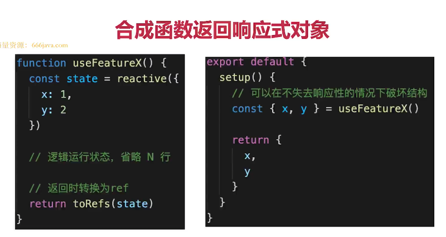

# Vue3

## Vue3比Vue2 有哪些优势？

:::tip
1. 性能更好
2. 体积更小 
3. 更好的ts支持 
4. 更好的代码组织
5. 更好的逻辑抽离
6. 更多新功能 
:::

## 描述Vu3生命周期
### OptionAPI 生命周期

:::tip
1. beforeDestroy 改为beforeUnmount
2. destroyed 改为unmouted
3. 其他沿用vue2 生命周期 
:::

### composition API 生命周期 
[compositionAPI](https://cn.vuejs.org/guide/extras/composition-api-faq.html#%E4%BB%80%E4%B9%88%E6%98%AF%E7%BB%84%E5%90%88%E5%BC%8F-api)

```vue
<template>
    <p>生命周期 {{msg}}</p>
</template>

<script>
import { onBeforeMount, onMounted, onBeforeUpdate, onUpdated, onBeforeUnmount, onUnmounted } from 'vue'

export default {
    name: 'LifeCycles',

    props: {
        msg: String
    },

    // 等于 beforeCreate 和 created
    setup() {
        console.log('setup')

        onBeforeMount(() => {
            console.log('onBeforeMount')
        })
        onMounted(() => {
            console.log('onMounted')
        })
        onBeforeUpdate(() => {
            console.log('onBeforeUpdate')
        })
        onUpdated(() => {
            console.log('onUpdated')
        })
        onBeforeUnmount(() => {
            console.log('onBeforeUnmount')
        })
        onUnmounted(() => {
            console.log('onUnmounted')
        })
    },

    // beforeCreate() {
    //     console.log('beforeCreate')
    // },
    // created() {
    //     console.log('created')
    // },
    // beforeMount() {
    //     console.log('beforeMount')
    // },
    // mounted() {
    //     console.log('mounted')
    // },
    // beforeUpdate() {
    //     console.log('beforeUpdate')
    // },
    // updated() {
    //     console.log('updated')
    // },
    // // beforeDestroy 改名
    // beforeUnmount() {
    //     console.log('beforeUnmount')
    // },
    // // destroyed 改名
    // unmounted() {
    //     console.log('unmounted')
    // }
}
</script>
```

## 如何看待Composition Api 和Options API
### composition API 带来了什么？

::: tip
1. 更好的代码组织
2. 更好的逻辑复用 
3. 更好的类型推导
:::

### Composition API 和Options API 如何选择
### 对Composition API误解
## 如何理解ref toRef 和 toRefs 
:::tip
toRef
1. 针对一个响应式对象（reactive封装）的prop
2. 创建一个ref, 具有响应式
3. 两者保持引用关系
4. toRef 如果用于普通对象（非响应式对象），产出的结果不具备响应式

:::
```vue
<template>
    <p>toRef demo - {{ageRef}} - {{state.name}} {{state.age}}</p>
</template>

<script>
import { ref, toRef, reactive } from 'vue'

export default {
    name: 'ToRef',
    setup() {
        const state = reactive({
            age: 20,
            name: 'lijinhai'
        })

        const age1 = computed(() => {
            return state.age + 1
        })

        // // toRef 如果用于普通对象（非响应式对象），产出的结果不具备响应式
        // const state = {
        //     age: 20,
        //     name: 'lijinhai'
        // }

        const ageRef = toRef(state, 'age')

        setTimeout(() => {
            state.age = 25
        }, 1500)

        setTimeout(() => {
            ageRef.value = 30 // .value 修改值
        }, 3000)

        return {
            state,
            ageRef
        }
    }
}
</script>
```
:::tip
toRefs
1. 将响应式对象（reactive封装）转换为普通对象
2. 对象的每个prop 都是对应的ref
3. 两者保持引用关系
:::
```vue
<template>
    <p>toRefs demo {{age}} {{name}}</p>
</template>

<script>
import { ref, toRef, toRefs, reactive } from 'vue'

export default {
    name: 'ToRefs',
    setup() {
        const state = reactive({
            age: 20,
            name: '双越'
        })

        const stateAsRefs = toRefs(state) // 将响应式对象，变成普通对象

        // const { age: ageRef, name: nameRef } = stateAsRefs // 每个属性，都是 ref 对象
        // return {
        //     ageRef,
        //     nameRef
        // }

        setTimeout(() => {
            state.age = 25
        }, 1500)

        return stateAsRefs
    }
}
</script>
```
#### 合成函数返回响应式对象

### 总结
:::tip
1. 用reactive 做对象的响应式，用ref做值类型的响应式
2. step中返回toRefs(state),或者toRef(state,'xxx')
3. ref的变量命名都用xxxRef
4. 合成函数返回响应式对象时，使用toRefs ，方便使用方使用
:::
### 为何需要ref 
:::tip
1. 返回值类型，会丢失响应式
2. 如在setup,computed、合成函数，都有可能返回值类型 
:::
```vue
<template>
    <p>why ref demo {{state.age}} - {{age1}}</p>
</template>

<script>
import { ref, toRef, toRefs, reactive, computed } from 'vue'

function useFeatureX() {
    const state = reactive({
        x: 1,
        y: 2
    })

    return toRefs(state)
}

export default {
    name: 'WhyRef',
    setup() {
        const { x, y } = useFeatureX()

        const state = reactive({
            age: 20,
            name: '双越'
        })

        // computed 返回的是一个类似于 ref 的对象，也有 .value
        const age1 = computed(() => {
            return state.age + 1
        })

        setTimeout(() => {
            state.age = 25
        }, 1500)

        return {
            state,
            age1,
            x,
            y
        }
    }
}
```
### 为何需要.value
:::tip
1. ref 是个对象(不丢失响应式)，value 存储值
2. 通过.value 属性的get 和set 实现响应式同时保持响应式 
3. 用于模版、reactive时，不需要.value 其他情况都需要
:::
```js
// 错误的  
function computed(getter){
    let value;
    setTimeout(()=>{
        value = getter()
    },1500)
    return value
}
// 正确的
function computed(getter){
    const ref = {
        value:null
    }
     setTimeout(()=>{
        ref.value = getter()
    },1500)
    return ref
}
```
### 为何需要toRef toRefs 
:::tip
初衷：在不丢失响应式的情况下，把对象数据`分散/扩散`
前提是：针对的是响应式对象(reactive封装)非普通对象
注意：不创造响应式，而是延续响应式

:::

## Vue3升级了哪些重要功能
- createApp


- emits 属性
```vue
<HelloWorld msg="Hello Vue 3.0 + Vite" @onSayHello="sayHello"/>
```
```vue
<template>
  <h1>{{ msg }}</h1>
  <button @click="count++">count is: {{ count }}</button>
  <p>Edit <code>components/HelloWorld.vue</code> to test hot module replacement.</p>
</template>

<script>
export default {
  name: 'HelloWorld',
  props: {
    msg: String
  },
  data() {
    return {
      count: 0
    }
  },
  emits: ['onSayHello'],
  setup(props, { emit }) {
    emit('onSayHello', 'vue3')
  }
}
</script>
```


- 生命周期
- 多事件 ‘


- Fragement 


- 移除.sync


- 异步组件的写法


- 移除filter


- Teleport


- Suspense


- Composition API
1. reactive
2. ref相关
3. readonly
4. watch和watchEffect
5. setup
6. 生命周期钩子函数


## Composition API 如何实现代码逻辑的复用
- 抽离逻辑代码到一个函数
- 函数命名约定位useXxx格式(React Hooks也是)
- 在setUp中引用useXxx函数 （使用reRef和 reRefs）

index.vue
```vue
<template>
    <p>mouse position {{x}} {{y}}</p>
</template>

<script>
import { reactive } from 'vue'
import useMousePosition from './useMousePosition'
// import useMousePosition2 from './useMousePosition'

export default {
    name: 'MousePosition',
    setup() {
        const { x, y } = useMousePosition()
        return {
            x,
            y
        }

        // const state = useMousePosition2()
        // return {
        //     state
        // }
    }
}
</script>
```
useMousePosition.js
```js
import { reactive, ref, onMounted, onUnmounted } from 'vue'

function useMousePosition() {
    const x = ref(0)
    const y = ref(0)

    function update(e) {
        x.value = e.pageX
        y.value = e.pageY
    }

    onMounted(() => {
        console.log('useMousePosition mounted')
        window.addEventListener('mousemove', update)
    })

    onUnmounted(() => {
        console.log('useMousePosition unMounted')
        window.removeEventListener('mousemove', update)
    })

    return {
        x,
        y
    }
}

// function useMousePosition2() {
//     const state = reactive({
//         x: 0,
//         y: 0
//     })

//     function update(e) {
//         state.x = e.pageX
//         state.y = e.pageY
//     }

//     onMounted(() => {
//         console.log('useMousePosition mounted')
//         window.addEventListener('mousemove', update)
//     })

//     onUnmounted(() => {
//         console.log('useMousePosition unMounted')
//         window.removeEventListener('mousemove', update)
//     })

//     return state
// }

export default useMousePosition
// export default useMousePosition2

```

## Vue3 如何实现响应式 
### Proxy实现响应式
#### Proxy基本使用
```js
// const data = {
//     name: 'zhangsan',
//     age: 20,
// }
const data = ['a', 'b', 'c']

const proxyData = new Proxy(data, {
    get(target, key, receiver) {
        // 只处理本身（非原型的）属性
        const ownKeys = Reflect.ownKeys(target)
        if (ownKeys.includes(key)) {
            console.log('get', key) // 监听
        }

        const result = Reflect.get(target, key, receiver)
        return result // 返回结果
    },
    set(target, key, val, receiver) {
        // 重复的数据，不处理
        if (val === target[key]) {
            return true
        }

        const result = Reflect.set(target, key, val, receiver)
        console.log('set', key, val)
        // console.log('result', result) // true
        return result // 是否设置成功
    },
    deleteProperty(target, key) {
        const result = Reflect.deleteProperty(target, key)
        console.log('delete property', key)
        // console.log('result', result) // true
        return result // 是否删除成功
    }
})
```
##### [Reflect](https://developer.mozilla.org/zh-CN/docs/Web/JavaScript/Reference/Global_Objects/Reflect)
- 和proxy 能力一一对应
- 规范化 标准化 函数式
```text
静态方法
Reflect.apply(target, thisArgument, argumentsList)
对一个函数进行调用操作，同时可以传入一个数组作为调用参数。和 Function.prototype.apply() 功能类似。

Reflect.construct(target, argumentsList[, newTarget])
对构造函数进行 new 操作，相当于执行 new target(...args)。

Reflect.defineProperty(target, propertyKey, attributes)
和 Object.defineProperty() 类似。如果设置成功就会返回 true

Reflect.deleteProperty(target, propertyKey)
作为函数的delete操作符，相当于执行 delete target[name]。

Reflect.get(target, propertyKey[, receiver])
获取对象身上某个属性的值，类似于 target[name]。

Reflect.getOwnPropertyDescriptor(target, propertyKey)
类似于 Object.getOwnPropertyDescriptor()。如果对象中存在该属性，则返回对应的属性描述符，否则返回 undefined。

Reflect.getPrototypeOf(target)
类似于 Object.getPrototypeOf()。

Reflect.has(target, propertyKey)
判断一个对象是否存在某个属性，和 in 运算符 的功能完全相同。

Reflect.isExtensible(target)
类似于 Object.isExtensible().

Reflect.ownKeys(target)
返回一个包含所有自身属性（不包含继承属性）的数组。(类似于 Object.keys(), 但不会受enumerable 影响).

Reflect.preventExtensions(target)
类似于 Object.preventExtensions()。返回一个Boolean。

Reflect.set(target, propertyKey, value[, receiver])
将值分配给属性的函数。返回一个Boolean，如果更新成功，则返回true。

Reflect.setPrototypeOf(target, prototype)
设置对象原型的函数。返回一个 Boolean，如果更新成功，则返回 true。
```
#### 实现响应式
- 什么时候get 什么时候递归 
- 深度监听，性能更好
- 可监听 新增/删除 属性
- 可监听数组
- proxy能规避Object.defineProperty 的问题
- Proxy 无法兼容所有浏览器，无法polyfill
```js
// 创建响应式
function reactive(target = {}) {
    if (typeof target !== 'object' || target == null) {
        // 不是对象或数组，则返回
        return target
    }

    // 代理配置
    const proxyConf = {
        get(target, key, receiver) {
            // 只处理本身（非原型的）属性
            const ownKeys = Reflect.ownKeys(target)
            if (ownKeys.includes(key)) {
                console.log('get', key) // 监听
            }
    
            const result = Reflect.get(target, key, receiver)
        
            // 深度监听
            // 性能如何提升的？
            return reactive(result)
        },
        set(target, key, val, receiver) {
            // 重复的数据，不处理
            if (val === target[key]) {
                return true
            }
    
            const ownKeys = Reflect.ownKeys(target)
            if (ownKeys.includes(key)) {
                console.log('已有的 key', key)
            } else {
                console.log('新增的 key', key)
            }

            const result = Reflect.set(target, key, val, receiver)
            console.log('set', key, val)
            // console.log('result', result) // true
            return result // 是否设置成功
        },
        deleteProperty(target, key) {
            const result = Reflect.deleteProperty(target, key)
            console.log('delete property', key)
            // console.log('result', result) // true
            return result // 是否删除成功
        }
    }

    // 生成代理对象
    const observed = new Proxy(target, proxyConf)
    return observed
}

// 测试数据
const data = {
    name: 'zhangsan',
    age: 20,
    info: {
        city: 'beijing',
        a: {
            b: {
                c: {
                    d: {
                        e: 100
                    }
                }
            }
        }
    }
}

const proxyData = reactive(data)

```
## watch和warchEffect的区别是什么 
- 两者都可监听data属性变化
- watch 需要明确监听那个属性
- watchEffect 会根据其中的属性，自动监听其变化

```vue

    watch(numberRef, (newNumber, oldNumber) => {
        console.log('ref watch', newNumber, oldNumber)
    }
    // , {
    //     immediate: true // 初始化之前就监听，可选
    // }
    )

   watch(
            // 第一个参数，确定要监听哪个属性
            () => state.age,

            // 第二个参数，回调函数
            (newAge, oldAge) => {
                console.log('state watch', newAge, oldAge)
            },

            // 第三个参数，配置项
            {
                immediate: true, // 初始化之前就监听，可选
                // deep: true // 深度监听
            }
        )
```
```vue
<template>
  <p>watch vs watchEffect</p>
  <p>{{ numberRef }}</p>
  <p>{{ name }} {{ age }}</p>
</template>

<script>
import { reactive, ref, toRefs, watch, watchEffect } from "vue";

export default {
  name: "Watch",
  setup() {
    const numberRef = ref(100);
    const state = reactive({
      name: "lijihai",
      age: 20,
    });

    watchEffect(() => {
      // 初始化时，一定会执行一次（收集要监听的数据）
      console.log("hello watchEffect");
    });
    watchEffect(() => {
      console.log("state.name", state.name);
    });
    watchEffect(() => {
      console.log("state.age", state.age);
    });
    watchEffect(() => {
      console.log("state.age", state.age);
      console.log("state.name", state.name);
    });
    setTimeout(() => {
      state.age = 25;
    }, 1500);
    setTimeout(() => {
      state.name = "lijihaiA";
    }, 3000);

    // watch(numberRef, (newNumber, oldNumber) => {
    //     console.log('ref watch', newNumber, oldNumber)
    // }
    // // , {
    // //     immediate: true // 初始化之前就监听，可选
    // // }
    // )

    // setTimeout(() => {
    //     numberRef.value = 200
    // }, 1500)

    // watch(
    //     // 第一个参数，确定要监听哪个属性
    //     () => state.age,

    //     // 第二个参数，回调函数
    //     (newAge, oldAge) => {
    //         console.log('state watch', newAge, oldAge)
    //     },

    //     // 第三个参数，配置项
    //     {
    //         immediate: true, // 初始化之前就监听，可选
    //         // deep: true // 深度监听
    //     }
    // )

    // setTimeout(() => {
    //     state.age = 25
    // }, 1500)
    // setTimeout(() => {
    //     state.name = 'lijihaiA'
    // }, 3000)

    return {
      numberRef,
      ...toRefs(state),
    };
  },
};
</script>

```
## setup中如何获取组件实例
- 在setup和其他Composition API中没有this
- 可通过getCurrentInstance 获取当前实例
- 若使用Options API 可照常使用this
```vue
<template>
    <p>get instance</p>
</template>

<script>
import { onMounted, getCurrentInstance } from 'vue'

export default {
    name: 'GetInstance',
    data() {
        return {
            x: 1,
            y: 2
        }
    },
    setup() {
        console.log('this1', this)

        onMounted(() => {
            console.log('this in onMounted', this)
            console.log('x', instance.data.x)
        })

        const instance = getCurrentInstance()
        console.log('instance', instance)
    },
    mounted() {
        console.log('this2', this)
        console.log('y', this.y)
    }
}
</script>
```
## Vue3为何比Vue2快 
### proxy响应式
### PatchFlag
1. 编译模板时，动态节点标记
2. 标记，分为不同的类型，如TEXT PROPS
3. diff算法时，可以区分静态节点，以及不同类型的动态节点


###  hoistStatic
1. 将静态节点的定义，提升到父作用域，缓存起来
2. 多个相邻的静态节点，会被合并起来
3. 典型的拿空间换时间的优化策略


### catchHandler
1. 缓存事件

### SSR 优化 
1. 静态节点直接输出，绕过vdom
2. 动态节点， 还是需要动态渲染

### tree-shaking 
1. 编译时根，根据不同的情况，引入不同的API
## vite 是什么
1. 开发环境使用ES6 Module，无需打包 - 非常快
2. 生产环境使用rollup，并不会快很多

## Composition API 和 React Hooks的对比
1. 前者setup只会被调用一次，而后者函数会被多次调用
2. 前者无需useMemo useCallbaack，因为setup 只调用一次
3. 前者无需顾虑调用顺序，而后者需要保证hooks 的顺序一致
4. 前者reactive + ref 比后者useState， 要更难理解


## vue3 和 jsx 

Demo.jsx
```jsx
import { defineComponent, ref, reactive } from 'vue'
import Child from './Child'

export default defineComponent(() => {
    const flagRef = ref(true)

    function changeFlag() {
        flagRef.value = !flagRef.value
    }

    const state = reactive({
        list: ['a1', 'b1', 'c1']
    })

    const render = () => {
        return <>
            <p onClick={changeFlag}>demo1 {flagRef.value.toString()}</p>
            {flagRef.value && <Child a={flagRef.value}></Child>}

            <ul>
            {state.list.map(item => <li>{item}</li>)}
            </ul>
        </>
    }
    return render
})

// 1. setup 函数
// 2. 组件的配置

```
Demo.vue
```vue
<script>
import { ref } from 'vue'
import Child from './Child'

export default {
    components: { Child },
    setup() {
        const countRef = ref(200)

        const render = () => {
            return <p>demo1 {countRef.value}</p> // jsx
        }
        return render
    }
}
</script>
```
### JSX和template 的区别

- 语法有很大的区别
1. jsx 本质就是js代码，可以使用js的任何能力
2. template 只能嵌入简单的js表达式，其他需要指令 v-if
3. jsx 已经成为ES规 ，template 还是vue 自家规范 

- 本质是相同的
1. 都会编译成js代码


### jsx和slot(插槽)

1. slot是 Vue 发明的概念， 为了完善template的能力
Tabs.vue
```vue
<template>
  <div>
    <!-- tabs 头，按钮 -->
    <button
      v-for="titleInfo in titles"
      :key="titleInfo.key"
      :style="{ color: titleInfo.key === actKey ? 'blue' : '#333' }"
      @click="changeActKey(titleInfo.key)"
    >
      {{ titleInfo.title }}
    </button>
  </div>

  <slot></slot>
</template>

<script>
import { ref } from "vue";

export default {
  name: "Tabs",
  props: ["defaultActiveKey"],
  emits: ["change"],
  setup(props, context) {
    const children = context.slots.default();
    const titles = children.map((panel) => {
      const { key, title } = panel.props || {};
      return {
        key,
        title,
      };
    });

    // 当前 actKey
    const actKey = ref(props.defaultActiveKey);
    function changeActKey(key) {
      actKey.value = key;
      context.emit("change", key);
    }

    return {
      titles,
      actKey,
      changeActKey,
    };
  },
};
</script>

```
Tabs.jsx
```jsx
import { defineComponent, ref } from 'vue'

export default defineComponent({
    name: 'Tabs',
    props: ['defaultActiveKey'],
    emits: ['change'],
    setup(props, context) {
        const children = context.slots.default()
        const titles = children.map(panel => {
            const { key, title } = panel.props || {}
            return {
                key,
                title
            }
        })

        // 当前 actKey
        const actKey = ref(props.defaultActiveKey)
        function changeActKey(key) {
            actKey.value = key
            context.emit('change', key)
        }

        // jsx
        const render = () => <>
            <div>
                {/* 渲染 buttons */}
                {titles.map(titleInfo => {
                    const { key, title } = titleInfo
                    return <button
                        key={key}
                        style={{ color: actKey.value === key ? 'blue' : '#333' }}
                        onClick={() => changeActKey(key)}
                    >{title}</button>
                })}
            </div>

            <div>
                {children.filter(panel => {
                    const { key } = panel.props || {}
                    if (actKey.value === key) return true // 匹配上 key ，则显示
                    return false // 否则，隐藏
                })}
            </div>
        </>
        return render
    }
})
```
### 作用域插槽
Demo.vue
```vue
<template>
    <child>
        <!-- <p>scoped slot</p> -->

        <template v-slot:default="slotProps">
            <p>msg: {{slotProps.msg}} 123123</p>
        </template>
    </child>
</template>

<script>
import Child from './Child'

export default {
    components: { Child }
}
</script>
```
Child.vue
```vue
<template>
    <p>child</p>
    <slot :msg="msg"></slot>
</template>

<script>
export default {
    data() {
        return {
            msg: '作用域插槽 Child'
        }
    }
}
</script>
```
Child.jsx

```jsx
import { defineComponent, ref } from 'vue'

export default defineComponent({
    props: ['render'],
    setup(props) {
        const msgRef = ref('作用域插槽 Child - JSX')

        return () => {
            return <p>{props.render(msgRef.value)}</p>
        }
    }
})
```
Demo.jsx

```jsx
import { defineComponent } from 'vue'
import Child from './Child'

export default defineComponent(() => {
    function render(msg) {
        return <p>msg: {msg} 123123</p>
    }

    return () => {
        return <>
            <p>Demo - JSX</p>
            <Child render={render}></Child>
        </>
    }
})
```

## Vue3 script setup

> Vue3 引入了composition API

1. 顶级变量、 自定义组件、 可以直接用于模板
2. 可正常使用 ref reactive computed  等能力
3. 和其他`<script>` 同时使用

```vue
<script setup>
import { defineProps, defineEmits } from 'vue'

// 定义属性
const props = defineProps({
    name: String,
    age: Number
})

// 定义事件
const emit = defineEmits(['change', 'delete'])
function deleteHandler() {
    emit('delete', 'aaa')
}

</script>

<template>
    <p>Child2 - name: {{props.name}}, age: {{props.age}}</p>
    <button @click="$emit('change', 'bbb')">change</button>
    <button @click="deleteHandler">delete</button>
</template>
```


