# React17

## 基本使用
```jsx
import React from 'react'
import './style.css'
import List from '../List'

class JSXBaseDemo extends React.Component {
    constructor(props) {
        super(props)
        this.state = {
            name: 'lijinhai',
            imgUrl: 'https://img1.mukewang.com/5a9fc8070001a82402060220-140-140.jpg',
            flag: true
        }
    }
    render() {
        // // 获取变量 插值
        // const pElem = <p>{this.state.name}</p>
        // return pElem

        // // 表达式
        // const exprElem = <p>{this.state.flag ? 'yes' : 'no'}</p>
        // return exprElem

        // // 子元素
        // const imgElem = <div>
        //     <p>我的头像</p>
        //     
        //     
        // </div>
        // return imgElem

        // // class
        // const classElem = <p className="title">设置 css class</p>
        // return classElem

        // // style
        // const styleData = { fontSize: '30px',  color: 'blue' }
        // const styleElem = <p style={styleData}>设置 style</p>
        // // 内联写法，注意 {{ 和 }}
        // // const styleElem = <p style={{ fontSize: '30px',  color: 'blue' }}>设置 style</p>
        // return styleElem

        // 原生 html
        const rawHtml = '<span>富文本内容<i>斜体</i><b>加粗</b></span>'
        const rawHtmlData = {
            __html: rawHtml // 注意，必须是这种格式
        }
        const rawHtmlElem = <div>
            <p dangerouslySetInnerHTML={rawHtmlData}></p>
            <p>{rawHtml}</p>
        </div>
        return rawHtmlElem

        // // 加载组件
        // const componentElem = <div>
        //     <p>JSX 中加载一个组件</p>
        //     <hr/>
        //     <List/>
        // </div>
        // return componentElem
    }
}

export default JSXBaseDemo

```
### 条件判断
```jsx
import React from 'react'
import './style.css'

class ConditionDemo extends React.Component {
    constructor(props) {
        super(props)
        this.state = {
            theme: 'black'
        }
    }
    render() {
        const blackBtn = <button className="btn-black">black btn</button>
        const whiteBtn = <button className="btn-white">white btn</button>

        // // if else
        // if (this.state.theme === 'black') {
        //     return blackBtn
        // } else {
        //     return whiteBtn
        // }

        // // 三元运算符
        // return <div>
        //     { this.state.theme === 'black' ? blackBtn : whiteBtn }
        // </div>

        // &&
        return <div>
            { this.state.theme === 'black' && blackBtn }
        </div>
    }
}

export default ConditionDemo

```
### 渲染列表
```jsx
import React from 'react'

class ListDemo extends React.Component {
    constructor(props) {
        super(props)
        this.state = {
            list: [
                {
                    id: 'id-1',
                    title: '标题1'
                },
                {
                    id: 'id-2',
                    title: '标题2'
                },
                {
                    id: 'id-3',
                    title: '标题3'
                }
            ]
        }
    }
    render() {
        return <ul>
            { /* vue v-for */
                this.state.list.map(
                    (item, index) => {
                        // 这里的 key 和 Vue 的 key 类似，必填，不能是 index 或 random
                        return <li key={item.id}>
                            index {index}; id {item.id}; title {item.title}
                        </li>
                    }
                )
            }
        </ul>
    }
}

export default ListDemo

```
### 事件
1. bind this
2. 关于event 参数
3. 传递自定义参数
:::tip
1. React 16 绑定到document
2. React 17 事件绑定到root组件
有利于多个React 版本并存，例如微前端
:::
```jsx
import React from 'react'

class EventDemo extends React.Component {
    constructor(props) {
        super(props)
        this.state = {
            name: 'zhangsan',
            list: [
                {
                    id: 'id-1',
                    title: '标题1'
                },
                {
                    id: 'id-2',
                    title: '标题2'
                },
                {
                    id: 'id-3',
                    title: '标题3'
                }
            ]
        }

        // 修改方法的 this 指向
        this.clickHandler1 = this.clickHandler1.bind(this)
    }
    render() {
        // // this - 使用 bind
        // return <p onClick={this.clickHandler1}>
        //     {this.state.name}
        // </p>

        // // this - 使用静态方法
        // return <p onClick={this.clickHandler2}>
        //     clickHandler2 {this.state.name}
        // </p>

        // // event
        // return <a href="https://imooc.com/" onClick={this.clickHandler3}>
        //     click me
        // </a>

        // 传递参数 - 用 bind(this, a, b)
        return <ul>{this.state.list.map((item, index) => {
            return <li key={item.id} onClick={this.clickHandler4.bind(this, item.id, item.title)}>
                index {index}; title {item.title}
            </li>
        })}</ul>
    }
    clickHandler1() {
        // console.log('this....', this) // this 默认是 undefined
        this.setState({
            name: 'lisi'
        })
    }
    // 静态方法，this 指向当前实例
    clickHandler2 = () => {
        this.setState({
            name: 'lisi'
        })
    }
    // 获取 event
    clickHandler3 = (event) => {
        event.preventDefault() // 阻止默认行为
        event.stopPropagation() // 阻止冒泡
        console.log('target', event.target) // 指向当前元素，即当前元素触发
        console.log('current target', event.currentTarget) // 指向当前元素，假象！！！

        // 注意，event 其实是 React 封装的。可以看 __proto__.constructor 是 SyntheticEvent 组合事件
        console.log('event', event) // 不是原生的 Event ，原生的 MouseEvent
        console.log('event.__proto__.constructor', event.__proto__.constructor)

        // 原生 event 如下。其 __proto__.constructor 是 MouseEvent
        console.log('nativeEvent', event.nativeEvent)
        console.log('nativeEvent target', event.nativeEvent.target)  // 指向当前元素，即当前元素触发
        console.log('nativeEvent current target', event.nativeEvent.currentTarget) // 指向 document ！！！

        // 1. event 是 SyntheticEvent ，模拟出来 DOM 事件所有能力
        // 2. event.nativeEvent 是原生事件对象
        // 3. 所有的事件，都被挂载到 document 上
        // 4. 和 DOM 事件不一样，和 Vue 事件也不一样
    }
    // 传递参数
    clickHandler4(id, title, event) {
        console.log(id, title)
        console.log('event', event) // 最后追加一个参数，即可接收 event
    }
}

export default EventDemo

```
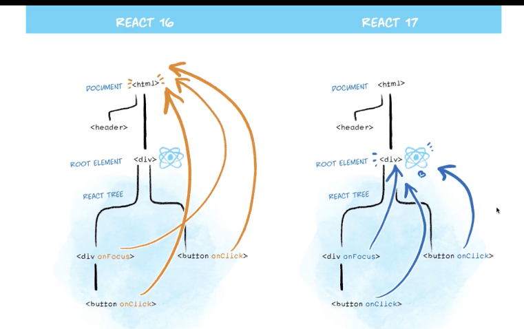
#### 表单 
##### 受控组件
1. input textarea select 用value
2. checkbox  radio 用checked
```jsx
import React from 'react'

class FormDemo extends React.Component {
    constructor(props) {
        super(props)
        this.state = {
            name: 'lijinhai',
            info: '个人信息',
            city: 'beijing',
            flag: true,
            gender: 'male'
        }
    }
    render() {

        // // 受控组件（非受控组件，后面再讲）
        // return <div>
        //     <p>{this.state.name}</p>
        //     <label htmlFor="inputName">姓名：</label> {/* 用 htmlFor 代替 for */}
        //     <input id="inputName" value={this.state.name} onChange={this.onInputChange}/>
        // </div>

        // textarea - 使用 value
        return <div>
            <textarea value={this.state.info} onChange={this.onTextareaChange}/>
            <p>{this.state.info}</p>
        </div>

        // // select - 使用 value
        // return <div>
        //     <select value={this.state.city} onChange={this.onSelectChange}>
        //         <option value="beijing">北京</option>
        //         <option value="shanghai">上海</option>
        //         <option value="shenzhen">深圳</option>
        //     </select>
        //     <p>{this.state.city}</p>
        // </div>

        // // checkbox
        // return <div>
        //     <input type="checkbox" checked={this.state.flag} onChange={this.onCheckboxChange}/>
        //     <p>{this.state.flag.toString()}</p>
        // </div>

        // // radio
        // return <div>
        //     male <input type="radio" name="gender" value="male" checked={this.state.gender === 'male'} onChange={this.onRadioChange}/>
        //     female <input type="radio" name="gender" value="female" checked={this.state.gender === 'female'} onChange={this.onRadioChange}/>
        //     <p>{this.state.gender}</p>
        // </div>

        // 非受控组件 - 后面再讲
    }
    onInputChange = (e) => {
        this.setState({
            name: e.target.value
        })
    }
    onTextareaChange = (e) => {
        this.setState({
            info: e.target.value
        })
    }
    onSelectChange = (e) => {
        this.setState({
            city: e.target.value
        })
    }
    onCheckboxChange = () => {
        this.setState({
            flag: !this.state.flag
        })
    }
    onRadioChange = (e) => {
        this.setState({
            gender: e.target.value
        })
    }
}

export default FormDemo

```
##### 非受控组件 
#### React组件如何通信
```jsx
import React from 'react'
import PropTypes from 'prop-types'

class Input extends React.Component {
    constructor(props) {
        super(props)
        this.state = {
            title: ''
        }
    }
    render() {
        return <div>
            <input value={this.state.title} onChange={this.onTitleChange}/>
            <button onClick={this.onSubmit}>提交</button>
        </div>
    }
    onTitleChange = (e) => {
        this.setState({
            title: e.target.value
        })
    }
    onSubmit = () => {
        const { submitTitle } = this.props
        submitTitle(this.state.title) // 'abc'

        this.setState({
            title: ''
        })
    }
}
// props 类型检查
Input.propTypes = {
    submitTitle: PropTypes.func.isRequired
}

class List extends React.Component {
    constructor(props) {
        super(props)
    }
    render() {
        const { list } = this.props

        return <ul>{list.map((item, index) => {
            return <li key={item.id}>
                <span>{item.title}</span>
            </li>
        })}</ul>
    }
}
// props 类型检查
List.propTypes = {
    list: PropTypes.arrayOf(PropTypes.object).isRequired
}

class Footer extends React.Component {
    constructor(props) {
        super(props)
    }
    render() {
        return <p>
            {this.props.text}
            {this.props.length}
        </p>
    }
    componentDidUpdate() {
        console.log('footer did update')
    }
    shouldComponentUpdate(nextProps, nextState) {
        if (nextProps.text !== this.props.text
            || nextProps.length !== this.props.length) {
            return true // 可以渲染
        }
        return false // 不重复渲染
    }

    // React 默认：父组件有更新，子组件则无条件也更新！！！
    // 性能优化对于 React 更加重要！
    // SCU 一定要每次都用吗？—— 需要的时候才优化
}

class TodoListDemo extends React.Component {
    constructor(props) {
        super(props)
        // 状态（数据）提升
        this.state = {
            list: [
                {
                    id: 'id-1',
                    title: '标题1'
                },
                {
                    id: 'id-2',
                    title: '标题2'
                },
                {
                    id: 'id-3',
                    title: '标题3'
                }
            ],
            footerInfo: '底部文字'
        }
    }
    render() {
        return <div>
            <Input submitTitle={this.onSubmitTitle}/>
            <List list={this.state.list}/>
            <Footer text={this.state.footerInfo} length={this.state.list.length}/>
        </div>
    }
    onSubmitTitle = (title) => {
        this.setState({
            list: this.state.list.concat({
                id: `id-${Date.now()}`,
                title
            })
        })
    }
}

export default TodoListDemo

```
## setState

- 不可变值 
- 可能是异步更新
- 可能会被合并

:::tip
### React <=17 setState
- React组件更新：异步更新+ 合并state
- DOM事件，setTimeout：同步更新，不合并state 
### React 18  setState
- React组件事件：异步更新+合并state
- DOM 事件，setTimeout：异步更新 + 合并state  
- Automatic Batching 自动批处理
:::
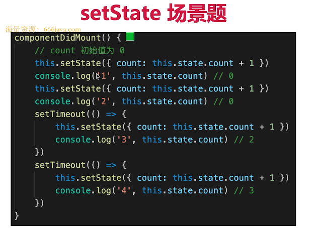
```jsx
import React from 'react'

// 函数组件（后面会讲），默认没有 state
class StateDemo extends React.Component {
    constructor(props) {
        super(props)

        // 第一，state 要在构造函数中定义
        this.state = {
            count: 0
        }
    }
    render() {
        return <div>
            <p>{this.state.count}</p>
            <button onClick={this.increase}>累加</button>
        </div>
    }
    increase = () => {
        // // 第二，不要直接修改 state ，使用不可变值 ----------------------------
        // // this.state.count++ // 错误
        // this.setState({
        //     count: this.state.count + 1 // SCU
        // })
        // 操作数组、对象的的常用形式

        // 第三，setState 可能是异步更新（有可能是同步更新） ----------------------------
        
        // this.setState({
        //     count: this.state.count + 1
        // }, () => {
        //     // 联想 Vue $nextTick - DOM
        //     console.log('count by callback', this.state.count) // 回调函数中可以拿到最新的 state
        // })
        // console.log('count', this.state.count) // 异步的，拿不到最新值

        // // setTimeout 中 setState 是同步的
        // setTimeout(() => {
        //     this.setState({
        //         count: this.state.count + 1
        //     })
        //     console.log('count in setTimeout', this.state.count)
        // }, 0)

        // 自己定义的 DOM 事件，setState 是同步的。再 componentDidMount 中

        // 第四，state 异步更新的话，更新前会被合并 ----------------------------
        
        // // 传入对象，会被合并（类似 Object.assign ）。执行结果只一次 +1
        // this.setState({
        //     count: this.state.count + 1
        // })
        // this.setState({
        //     count: this.state.count + 1
        // })
        // this.setState({
        //     count: this.state.count + 1
        // })
        
        // 传入函数，不会被合并。执行结果是 +3
        this.setState((prevState, props) => {
            return {
                count: prevState.count + 1
            }
        })
        this.setState((prevState, props) => {
            return {
                count: prevState.count + 1
            }
        })
        this.setState((prevState, props) => {
            return {
                count: prevState.count + 1
            }
        })
    }
    // bodyClickHandler = () => {
    //     this.setState({
    //         count: this.state.count + 1
    //     })
    //     console.log('count in body event', this.state.count)
    // }
    // componentDidMount() {
    //     // 自己定义的 DOM 事件，setState 是同步的
    //     document.body.addEventListener('click', this.bodyClickHandler)
    // }
    // componentWillUnmount() {
    //     // 及时销毁自定义 DOM 事件
    //     document.body.removeEventListener('click', this.bodyClickHandler)
    //     // clearTimeout
    // }
}

export default StateDemo

// -------------------------- 我是分割线 -----------------------------

// // 不可变值（函数式编程，纯函数） - 数组
// const list5Copy = this.state.list5.slice()
// list5Copy.splice(2, 0, 'a') // 中间插入/删除
// this.setState({
//     list1: this.state.list1.concat(100), // 追加
//     list2: [...this.state.list2, 100], // 追加
//     list3: this.state.list3.slice(0, 3), // 截取
//     list4: this.state.list4.filter(item => item > 100), // 筛选
//     list5: list5Copy // 其他操作
// })
// // 注意，不能直接对 this.state.list 进行 push pop splice 等，这样违反不可变值

// // 不可变值 - 对象
// this.setState({
//     obj1: Object.assign({}, this.state.obj1, {a: 100}),
//     obj2: {...this.state.obj2, a: 100}
// })
// // 注意，不能直接对 this.state.obj 进行属性设置，这样违反不可变值

```
```jsx

import { useState, useEffect } from 'react'

function useStateDemo() {
    const [value, setValue] = useState(100)

    function clickHandler() {
        // // 1. 传入常量，state 会合并
        // setValue(value + 1)
        // setValue(value + 1)
        // console.log(1, value) // 100
        // // 2. 传入函数，state 不会合并
        // setValue(value => value + 1)
        // setValue(value => value + 1)
        // console.log(2, value) // 100

        // 3. setTimeout 中，React18 开始也会合并 state （之前版本会同步更新，不合并）
        setTimeout(() => {
            setValue(value + 1)
            setValue(value + 1)
            console.log(1, value) // 100

            setValue(value + 1)
            setValue(value + 1)
            console.log(2, value) // 100
        })

        // // 4. 同理 setTimeout 中，传入函数，state 也不会合并
        // setTimeout(() => {
        //     setValue(value => value + 1)
        //     setValue(value => value + 1)
        //     console.log(1, value)
        // })
    }

    useEffect(() => {
        // 自绑定 DOM 事件，React18 开始也会合并 state（之前版本会同步更新，不合并）
        document.getElementById('btn2').addEventListener('click', () => {
            setValue(value + 1)
            setValue(value + 1)
            console.log(1, value)// 100 异步
        })
    })

    return <div>
        <span>{value}</span>
        <button onClick={clickHandler}>increase1</button>
        <button id="btn2">increase2</button>
    </div>
}

export default useStateDemo

```
### [组件生命周期](https://projects.wojtekmaj.pl/react-lifecycle-methods-diagram/)

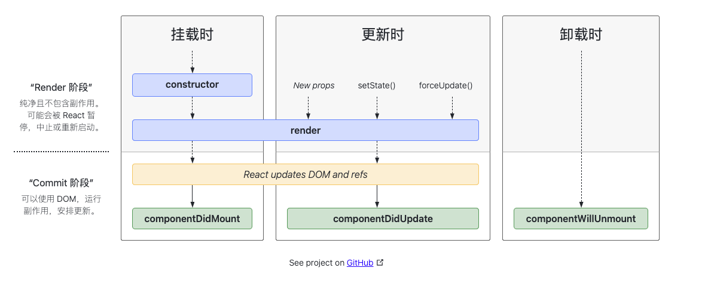
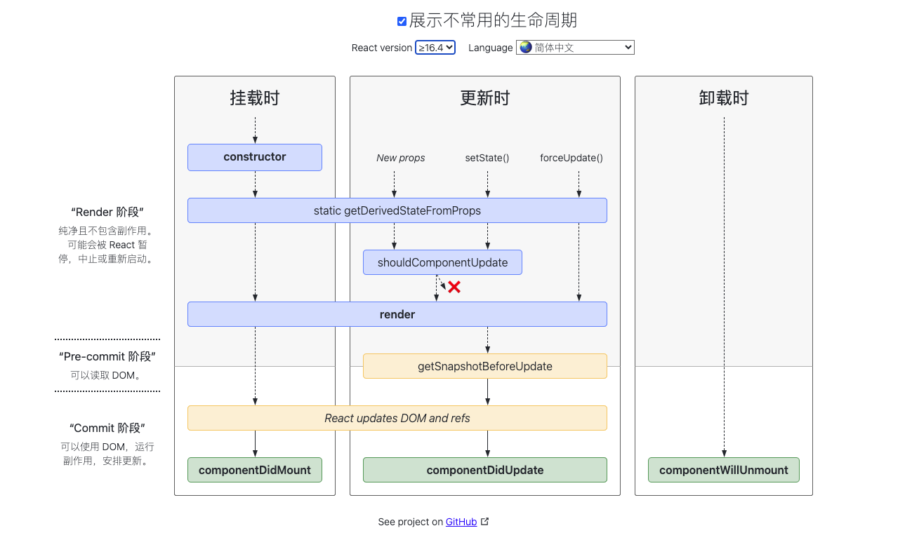

## React高级特性

###  函数组件 
:::tip
- 纯函数，输出props， 输出jsx 
- 没有实例， 没有生命周期，没有state
- 不能拓展其他方法  
:::
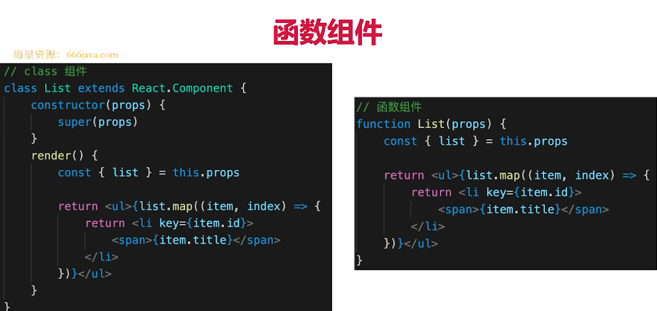

### 非受控组件 
:::tip
- ref 
- defaultValue defaultChecked
:::
```jsx
import React from 'react'

class App extends React.Component {
    constructor(props) {
        super(props)
        this.state = {
            name: 'lijinhai',
            flag: true,
        }
        this.nameInputRef = React.createRef() // 创建 ref
        this.fileInputRef = React.createRef()
    }
    render() {
        // // input defaultValue
        // return <div>
        //     {/* 使用 defaultValue 而不是 value ，使用 ref */}
        //     <input defaultValue={this.state.name} ref={this.nameInputRef}/>
        //     {/* state 并不会随着改变 */}
        //     <span>state.name: {this.state.name}</span>
        //     <br/>
        //     <button onClick={this.alertName}>alert name</button>
        // </div>

        // // checkbox defaultChecked
        // return <div>
        //     <input
        //         type="checkbox"
        //         defaultChecked={this.state.flag}
        //     />
        // </div>

        // file
        return <div>
            <input type="file" ref={this.fileInputRef}/>
            <button onClick={this.alertFile}>alert file</button>
        </div>

    }
    alertName = () => {
        const elem = this.nameInputRef.current // 通过 ref 获取 DOM 节点
        alert(elem.value) // 不是 this.state.name
    }
    alertFile = () => {
        const elem = this.fileInputRef.current // 通过 ref 获取 DOM 节点
        alert(elem.files[0].name)
    }
}

export default App

```
### Protals
:::tip
1. overflow:hidden
2. 父组件z-index值太小
3. fixed 需要放在body第一层级
:::
```jsx
import React from 'react'
import ReactDOM from 'react-dom'
import './style.css'

class App extends React.Component {
    constructor(props) {
        super(props)
        this.state = {
        }
    }
    render() {
        // // 正常渲染
        // return <div className="modal">
        //     {this.props.children} {/* vue slot */}
        // </div>

        // 使用 Portals 渲染到 body 上。
        // fixed 元素要放在 body 上，有更好的浏览器兼容性。
        return ReactDOM.createPortal(
            <div className="modal">{this.props.children}</div>,
            document.body // DOM 节点
        )
    }
}

export default App

```
### context

:::tip
1. 公共信息（信息，主题）如何传递给每个组件
2. 用props太繁琐 
3. 用redux 小题大做 
:::

```jsx
import React from 'react'

// 创建 Context 填入默认值（任何一个 js 变量）
const ThemeContext = React.createContext('light')

// 底层组件 - 函数是组件
function ThemeLink (props) {
    // const theme = this.context // 会报错。函数式组件没有实例，即没有 this

    // 函数式组件可以使用 Consumer
    return <ThemeContext.Consumer>
        { value => <p>link's theme is {value}</p> }
    </ThemeContext.Consumer>
}

// 底层组件 - class 组件
class ThemedButton extends React.Component {
    // 指定 contextType 读取当前的 theme context。
    // static contextType = ThemeContext // 也可以用 ThemedButton.contextType = ThemeContext
    render() {
        const theme = this.context // React 会往上找到最近的 theme Provider，然后使用它的值。
        return <div>
            <p>button's theme is {theme}</p>
        </div>
    }
}
ThemedButton.contextType = ThemeContext // 指定 contextType 读取当前的 theme context。

// 中间的组件再也不必指明往下传递 theme 了。
function Toolbar(props) {
    return (
        <div>
            <ThemedButton />
            <ThemeLink />
        </div>
    )
}

class App extends React.Component {
    constructor(props) {
        super(props)
        this.state = {
            theme: 'light'
        }
    }
    render() {
        return <ThemeContext.Provider value={this.state.theme}>
            <Toolbar />
            <hr/>
            <button onClick={this.changeTheme}>change theme</button>
        </ThemeContext.Provider>
    }
    changeTheme = () => {
        this.setState({
            theme: this.state.theme === 'light' ? 'dark' : 'light'
        })
    }
}

export default App

```

### 异步组件 
:::tip
- import()
- React.lazy
- React.Suspense
:::
```jsx
import React from 'react'

const ContextDemo = React.lazy(() => import('./ContextDemo'))

class App extends React.Component {
    constructor(props) {
        super(props)
    }
    render() {
        return <div>
            <p>引入一个动态组件</p>
            <hr />
            <React.Suspense fallback={<div>Loading...</div>}>
                <ContextDemo/>
            </React.Suspense>
        </div>

        // 1. 强制刷新，可看到 loading （看不到就限制一下 chrome 网速）
        // 2. 看 network 的 js 加载
    }
}
export default App

```
##  性能优化 

> react默认：父组件更新，子组件无条件更新

:::tip
- shouldComponentUpdate(scu)

scp 默认返回时true,即React默认重新渲染所有子组件
必须配合‘不可变值’一起使用
可先不用scu，有性能问题时在考虑使用

:::

```jsx
    // 增加 shouldComponentUpdate
    shouldComponentUpdate(nextProps, nextState) {
        // _.isEqual 做对象或者数组的深度比较（一次性递归到底）
        if (_.isEqual(nextProps.list, this.props.list)) {
            // 相等，则不重复渲染
            return false
        }
        return true // 不相等，则渲染
    }
```

:::tip
- PureComponent和React.memo (浅比较) 
:::

```jsx

class List extends React.PureComponent {
    constructor(props) {
        super(props)
    }
    render() {
        const { list } = this.props

        return <ul>{list.map((item, index) => {
            return <li key={item.id}>
                <span>{item.title}</span>
            </li>
        })}</ul>
    }
    shouldComponentUpdate() {/*浅比较*/}
}
// props 类型检查
List.propTypes = {
    list: PropTypes.arrayOf(PropTypes.object).isRequired
}
```
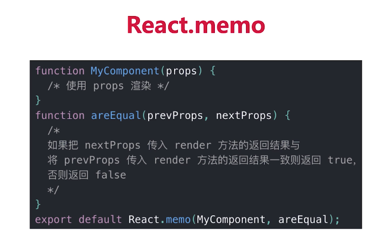

## 什么是React高阶组件
::: details (关于组件公共逻辑的抽离)
1. mixin，已被React弃用
2. 高阶组件HOC（Hight Order Component）
3. Render Props
:::

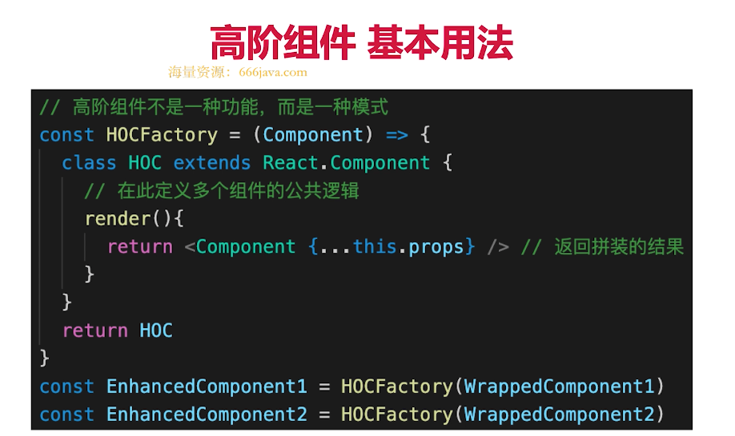

```jsx
import React from 'react'

// 高阶组件
const withMouse = (Component) => {
    class withMouseComponent extends React.Component {
        constructor(props) {
            super(props)
            this.state = { x: 0, y: 0 }
        }
  
        handleMouseMove = (event) => {
            this.setState({
                x: event.clientX,
                y: event.clientY
            })
        }
  
        render() {
            return (
                <div style={{ height: '500px' }} onMouseMove={this.handleMouseMove}>
                    {/* 1. 透传所有 props 2. 增加 mouse 属性 */}
                    <Component {...this.props} mouse={this.state}/>
                </div>
            )
        }
    }
    return withMouseComponent
}

const App = (props) => {
    const a = props.a
    const { x, y } = props.mouse // 接收 mouse 属性
    return (
        <div style={{ height: '500px' }}>
            <h1>The mouse position is ({x}, {y})</h1>
            <p>{a}</p>
        </div>
    )
}

export default withMouse(App) // 返回高阶函数

```
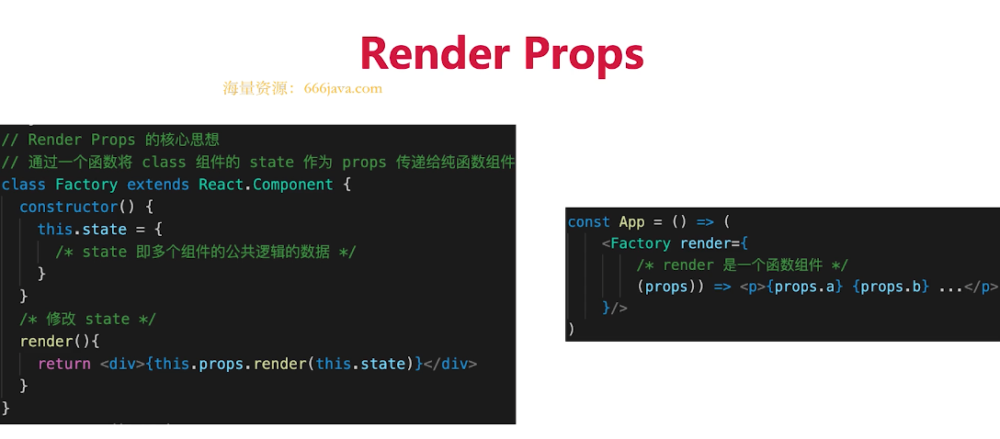

## Redux

[redux](https://www.redux.org.cn/)

### 基本概念
- store state
- action
- reducer

```js
import { createStore } from 'redux'
const store = createStore(todos, ['Use Redux'])

function addTodo(text) {
  return {
    type: 'ADD_TODO',
    text
  }
}

store.dispatch(addTodo('Read the docs'))
store.dispatch(addTodo('Read about the middleware'))
```


### redux 

- 单项数据流
- dispatch(action)
- reducer->newState
- subscibe触发通知 

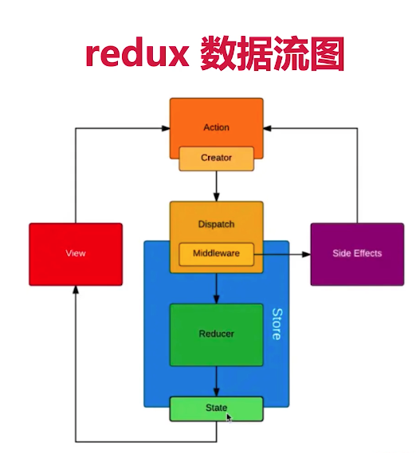

### react-redux

-  `<Provider>` connect
- connect
- mapStateToProps mapDispatchToProps

```jsx
import { connect } from 'react-redux'
import { toggleTodo } from '../actions'
import TodoList from '../components/TodoList'

// 不同类型的 todo 列表
const getVisibleTodos = (todos, filter) => {
  switch (filter) {
    case 'SHOW_ALL':
      return todos
    case 'SHOW_COMPLETED':
      return todos.filter(t => t.completed)
    case 'SHOW_ACTIVE':
      return todos.filter(t => !t.completed)
  }
}

const mapStateToProps = state => {
  // state 即 vuex 的总状态，在 reducer/index.js 中定义
  return {
    // 根据完成状态，筛选数据
    todos: getVisibleTodos(state.todos, state.visibilityFilter)
  }
}

const mapDispatchToProps = dispatch => {
  return {
    // 切换完成状态
    onTodoClick: id => {
      dispatch(toggleTodo(id))
    }
  }
}

// connect 高阶组件，将 state 和 dispatch 注入到组件 props 中
const VisibleTodoList = connect(
  mapStateToProps,
  mapDispatchToProps
)(TodoList)

export default VisibleTodoList
```

### 异步action

- redux-thunk
- redux-promise
- redux-saga

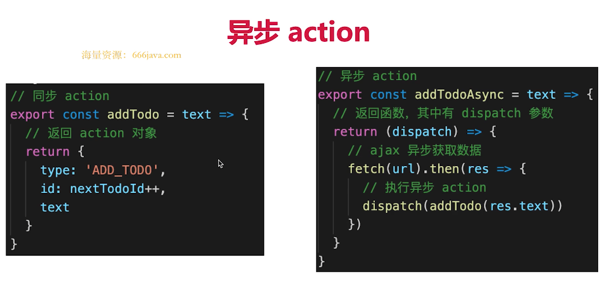

### 中间件

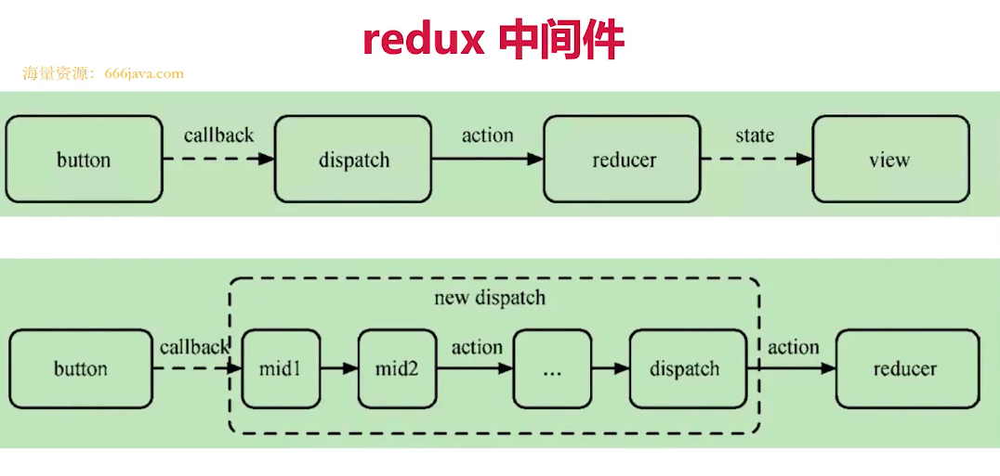

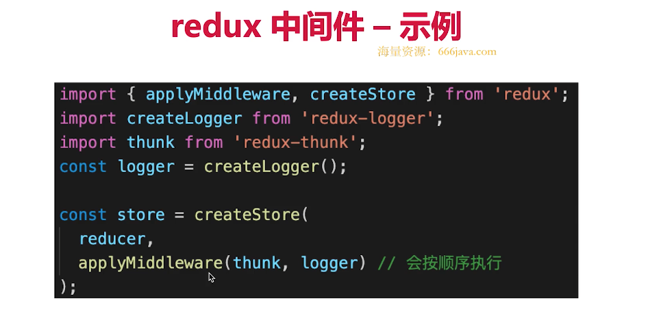

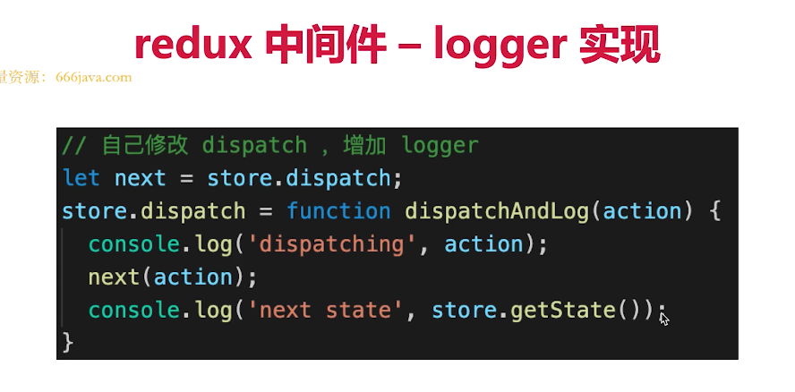


## React-touter

- 路由模式（hash、h5 history）
- 路由配置 （动态路由、懒加载） 
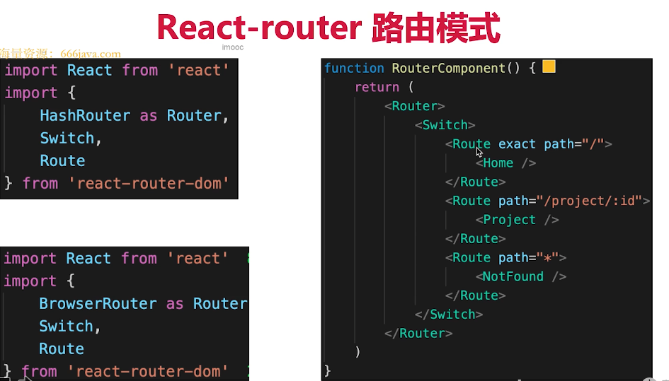
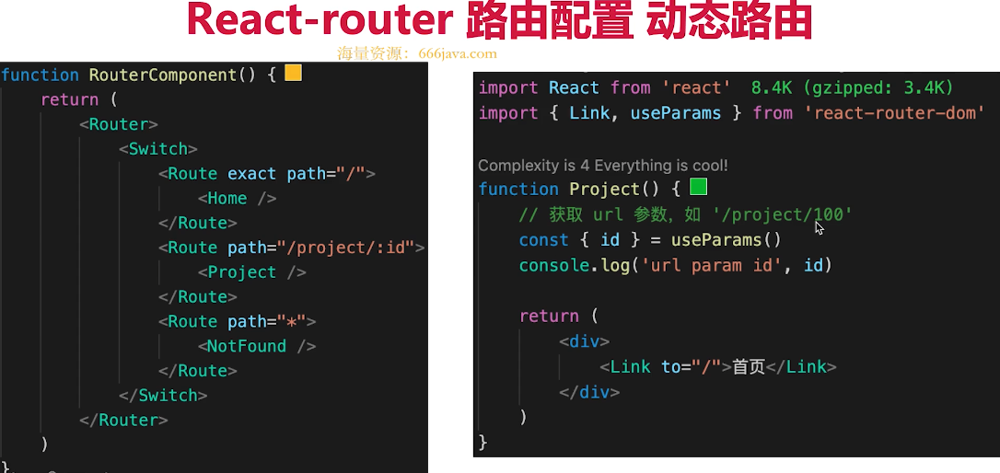
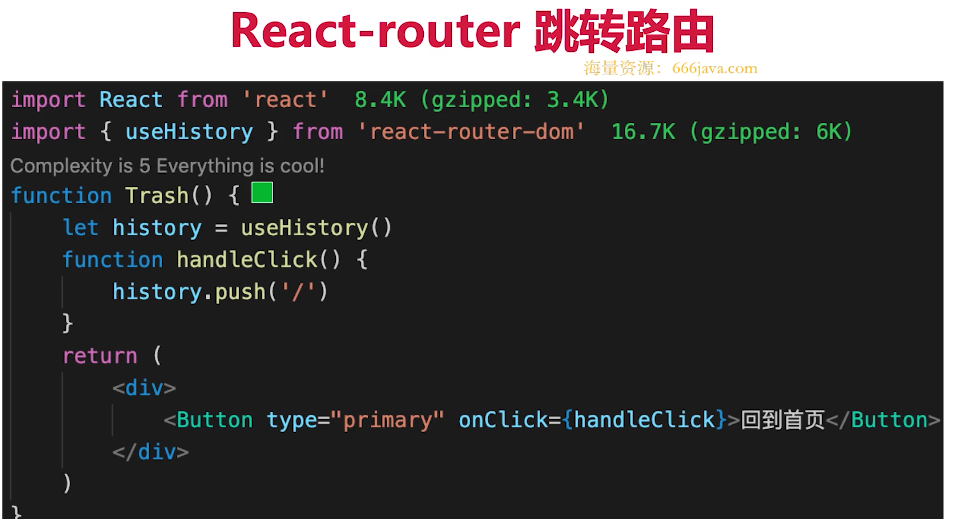
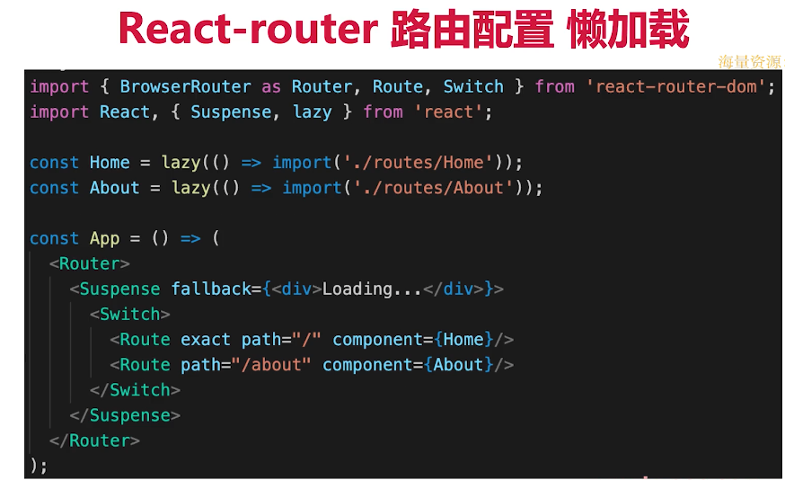

## 函数式编程
- 一种编程范式，概念比较多
- 纯函数
- 不可变值

## 回顾vdom 和diff
- h函数（返回vnode函数）
- vnode 数据结构
- patch 

### JSX本质是什么
- jsx等同于vue模版
- vue模板不是html
- jsx模版不是js 

:::tip
// // 总结
// React.createElement('div', null, [child1, child2, child3])
// React.createElement('div', {...}, child1, child2, child3)
// React.createElement(List, null, child1, child2, '文本节点')
// // h 函数
// // 返回 vnode
// // patch：patch(elem,vnode) 和patch(vnode,newVode)

React.createElement 即h函数，返回vnode
- 一个参数，可能是组件，也可能是html tag
- 组件名，首字母必须大写 html tag 是小谢（React规定）
:::
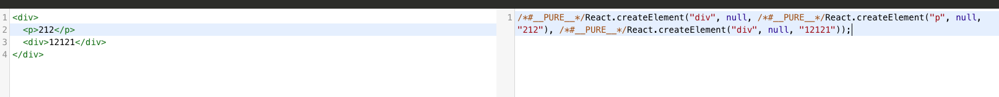
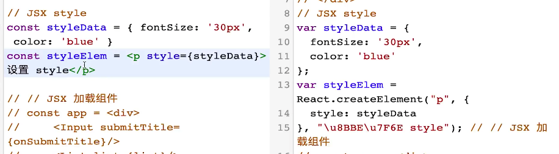
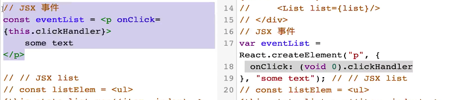
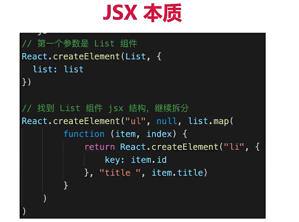

## React合成事件 
:::tip
- 所有事件挂载到document上（react 17 挂载到body上 利于多个React版本并存）
- event 不是原生的， 是syntheticEvent 合成事件对象
- 和vue事件不同， 和dom 事件不同
- dispatchEvent 机制
:::
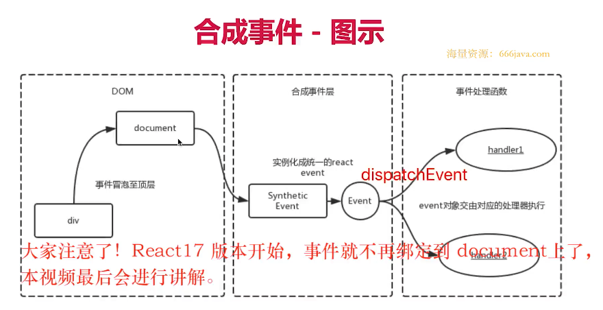

### 为什么 
- 更好的兼容性和跨平台
- 挂载document，减少内存消耗，避免频繁解绑。
- 方便事件的统一管理（事物机制）


## setState主流程
### 哪些能命中batchUpdate机制
- 生命周期（和它调用的函数）
- React中注册的事件（和它调用的函数）
- React可以‘管到’的入口
### 哪些不能命中batchUpdata机制
- setTimeout setInterval 
- 自定义的DOM事件
- React‘管不到’的入口


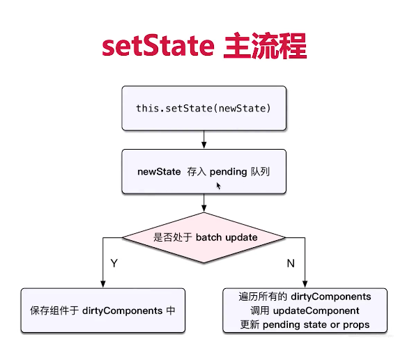
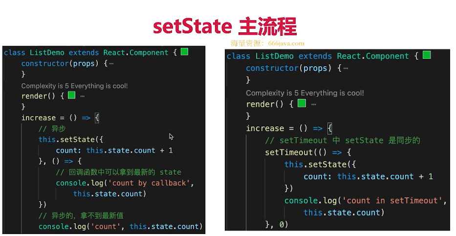
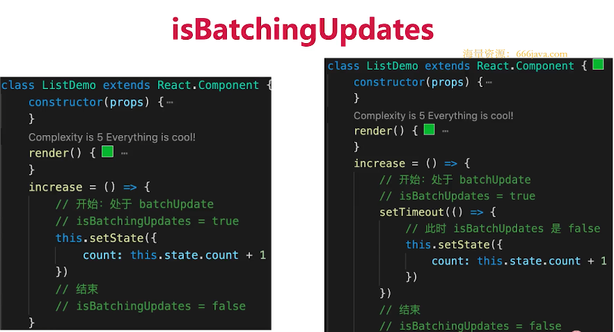
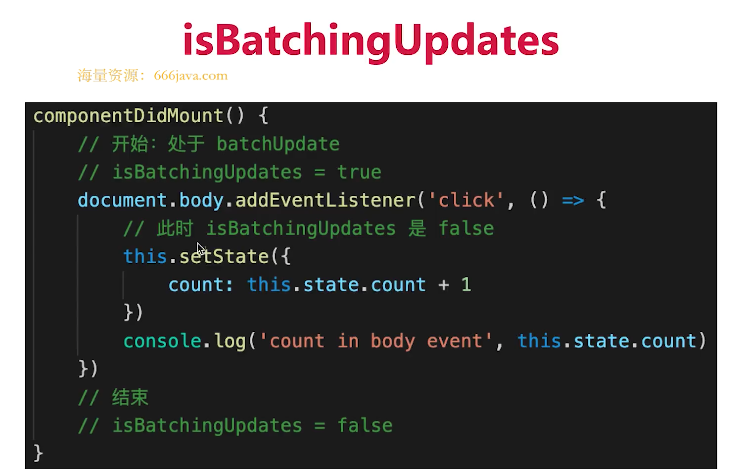

## React事务(transcation事务机制)

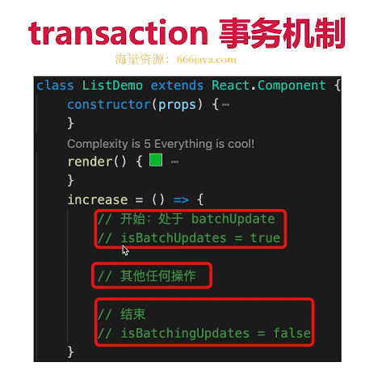
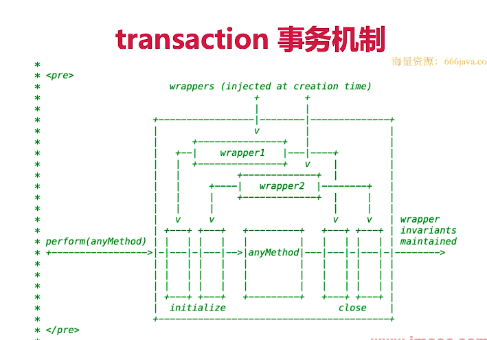
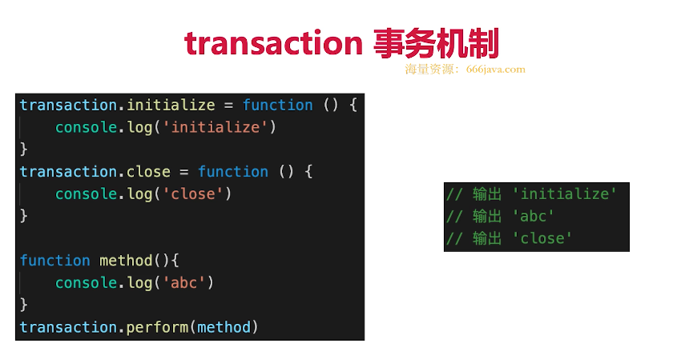

## 组件渲染和更新过程
### 组件渲染
- props state 
- render() 生成vnode
- parch(ele,vnode)

### 更新过程
- setState(newState)-> dirtyComponents(有可能子组件)
- render()生成newVnode
- patch(vnode,newVode)
### 更新的两个阶段
- patch被拆分为两个阶段
- reconciliation 阶段 - 执行diff算法 ，纯js计算
- commit 阶段 - 将diff 结果渲染dom 上 
#### 可能存在的性能问题
- js是单线程，且和DOM渲染公用一个线程
- 当组件足够复杂，组件更新时计算和渲染都压力大
- 同时在有DOM操作需要（动画，鼠标拖拽等），将卡顿
#### 解决方案fiber
 - 将reconciliation 阶段进行人物拆分（commit 无法拆分）
 - DOM 需要渲染时暂停，空闲时恢复
 - window.requestIdleCallback

 [requestIdleCallback](https://developer.mozilla.org/zh-CN/docs/Web/API/Window/requestIdleCallback)

## React 总结
- 函数式编程
> 1. 纯函数 
> 2. 不可变值 
- jsx 本质和vdom
> 1. jsx 即createElement函数
> 2. 执行生成vnode
> 3. patch：patch(elem,vnode) 和patch(vnode,newVode)
- 合成事件
> 1. 所有事件挂载到document上（react 17 挂载到body上 利于多个React版本并存）
> 2. event 不是原生的， 是syntheticEvent 合成事件对象
> 3. 和vue事件不同， 和dom 事件不同
- setState batchUpdate
> 1. setState的表现（重要）和主流程
> 2. batchUpdate机制
> 3. transaction(事物)机制
- 组件渲染过程
> 1. 组件渲染和更新流程
> 2. 更新的两个阶段 reconciliation commit 
> 3. react filber 

## React 性能优化
- 渲染列表时加key
- 自定义事件，dom事件及时销毁
- 合理使用异步组件
- 减少函数bind this 次数
- 合理使用scu PureComponent和memo
- 合理使用immutable.js
- webpack 性能优护
- 前端通用的性能优化，图片懒加载
- 使用ssr 

## React 和Vue 区别 
- 都支持组件化
- 都是数据驱动视图
- 都使用vdom 操作DOM
- React 使用jsx 拥抱js ，Vue使用模板拥抱html
- React 函数时编程，Vue声明式编程 
- React更多需要自力更生，Vue 想要的都给了

## React Hook （16.8新增的API）
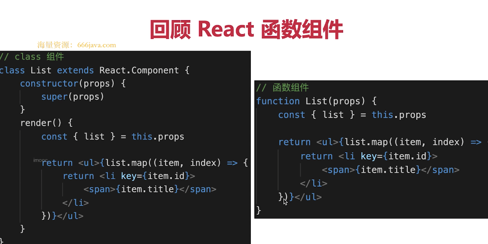
- 函数组件问题
:::tip
 1. 函数组件没有实例 
 2. 函数组件没有生命周期 
 3. 没有state 和setState ，只能接受props 
:::
- class组件问题
:::tip
 1. 大型组件很难拆分和重构，很难测试（class组件不容易拆分）
 2. 相同的业务逻辑，分散到各个方法中，逻辑混乱
 3. 复用逻辑变得复杂 如Mixins Hoc render Prop
:::
- React组件更易用函数表达 
:::tip
1. react提倡函数时编程，view = fu(props)
2. 函数更灵活，易拆分，易测试
3. 函数组件太简单了，需要增强能力 - Hooks
:::
### state  Hook
> 为了让函数组件实现state和setState 
:::tip
- 默认函数组件没有state 
- 函数组件是一个纯函数，执行完即销毁，无法存储state
- 需要sate Hook， 即把sate 功能“钩”到纯函数中 
:::
```jsx
import React, { useState, useEffect } from 'react'

function FriendStatus({ friendId }) {
    const [status, setStatus] = useState(false)

    // DidMount 和 DidUpdate
    useEffect(() => {
        console.log(`开始监听 ${friendId} 在线状态`)

        // 【特别注意】
        // 此处并不完全等同于 WillUnMount
        // props 发生变化，即更新，也会执行结束监听
        // 准确的说：返回的函数，会在下一次 effect 执行之前，被执行
        return () => {
            console.log(`结束监听 ${friendId} 在线状态`)
        }
    })

    return <div>
        好友 {friendId} 在线状态：{status.toString()}
    </div>
}

export default FriendStatus

```
### 为什么会有React Hooks,它解决了什么 

### React Hooks 如何模拟组件生命周期
:::tip
- 默认函数组件没有生命周期
- 函数组件是一个纯函数，执行完即销毁，无法实现生命周期
- 使用Effect Hook 把生命周期“钩”到纯函数中 （模拟class组件的didMount和didUpdate）
:::
### ReactHook有哪些
- useRef
```jsx
import React, { useRef, useEffect } from 'react'

function UseRef() {
    const btnRef = useRef(null) // 初始值

    // const numRef = useRef(0)
    // numRef.current

    useEffect(() => {
        console.log(btnRef.current) // DOM 节点
    }, [])

    return <div>
        <button ref={btnRef}>click</button>
    </div>
}

export default UseRef

```
- useContext
```js
import React, { useContext } from 'react'

// 主题颜色
const themes = {
    light: {
        foreground: '#000',
        background: '#eee'
    },
    dark: {
        foreground: '#fff',
        background: '#222'
    }
}

// 创建 Context
const ThemeContext = React.createContext(themes.light) // 初始值

function ThemeButton() {
    const theme = useContext(ThemeContext)

    return <button style={{ background: theme.background, color: theme.foreground }}>
        hello world
    </button>
}

function Toolbar() {
    return <div>
        <ThemeButton></ThemeButton>
    </div>
}

function App() {
    return <ThemeContext.Provider value={themes.dark}>
        <Toolbar></Toolbar>
    </ThemeContext.Provider>
}

export default App

```
- useReducer
```js
import React, { useReducer } from 'react'

const initialState = { count: 0 }

const reducer = (state, action) => {
    switch (action.type) {
        case 'increment':
            return { count: state.count + 1 }
        case 'decrement':
            return { count: state.count - 1 }
        default:
            return state
    }
}

function App() {
    // 很像 const [count, setCount] = useState(0)
    const [state, dispatch] = useReducer(reducer, initialState)

    return <div>
        count: {state.count}
        <button onClick={() => dispatch({ type: 'increment' })}>increment</button>
        <button onClick={() => dispatch({ type: 'decrement' })}>decrement</button>
    </div>
}

export default App

```
- useNemo
```js
import React, { useState, memo, useMemo } from 'react'

// 子组件
// function Child({ userInfo }) {
//     console.log('Child render...', userInfo)

//     return <div>
//         <p>This is Child {userInfo.name} {userInfo.age}</p>
//     </div>
// }
// 类似 class PureComponent ，对 props 进行浅层比较
const Child = memo(({ userInfo }) => {
    console.log('Child render...', userInfo)

    return <div>
        <p>This is Child {userInfo.name} {userInfo.age}</p>
    </div>
})

// 父组件
function App() {
    console.log('Parent render...')

    const [count, setCount] = useState(0)
    const [name, setName] = useState('双越老师')

    // const userInfo = { name, age: 20 }
    // 用 useMemo 缓存数据，有依赖
    const userInfo = useMemo(() => {
        return { name, age: 21 }
    }, [name])

    return <div>
        <p>
            count is {count}
            <button onClick={() => setCount(count + 1)}>click</button>
        </p>
        <Child userInfo={userInfo}></Child>
    </div>
}

export default App

```
- useCallback
```jsx
import React, { useState, memo, useMemo, useCallback } from 'react'

// 子组件，memo 相当于 PureComponent
const Child = memo(({ userInfo, onChange }) => {
    console.log('Child render...', userInfo)

    return <div>
        <p>This is Child {userInfo.name} {userInfo.age}</p>
        <input onChange={onChange}></input>
    </div>
})

// 父组件
function App() {
    console.log('Parent render...')

    const [count, setCount] = useState(0)
    const [name, setName] = useState('双越老师')

    // 用 useMemo 缓存数据
    const userInfo = useMemo(() => {
        return { name, age: 21 }
    }, [name])

    // function onChange(e) {
    //     console.log(e.target.value)
    // }
    // 用 useCallback 缓存函数
    const onChange = useCallback(e => {
        console.log(e.target.value)
    }, [])

    return <div>
        <p>
            count is {count}
            <button onClick={() => setCount(count + 1)}>click</button>
        </p>
        <Child userInfo={userInfo} onChange={onChange}></Child>
    </div>
}

export default App

```
### 自定义 Hook
```js
import { useState, useEffect } from 'react'

function useMousePosition() {
    const [x, setX] = useState(0)
    const [y, setY] = useState(0)

    useEffect(() => {
        function mouseMoveHandler(event) {
            setX(event.clientX)
            setY(event.clientY)
        }

        // 绑定事件
        document.body.addEventListener('mousemove', mouseMoveHandler)

        // 解绑事件
        return () => document.body.removeEventListener('mousemove', mouseMoveHandler)
    }, [])

    return [x, y]
}

export default useMousePosition

```
### React Hooks 性能优化
- useMemo 
- useCallback
### 使用React Hooks 遇到哪些坑 
- useState 初始化，只初始化一次
- useEffect 依赖引用类型，会出现死循环
- useEffect内部，不能修改state  
### Hooks 相比HOC 和Render Prop 有哪些优点 

### Effect Hook
### 其他 Hook

### React hooks做组件逻辑复用优点
- 完全符合hooks原有规则，没有其他要求，易理解记忆
- 变量作用域和明确
- 不会产生组件嵌套 


### useEffect 涉及 react的几个生命周期

`componentDidMount`（组件挂载时）

```jsx
useEffect(() => {
  // 组件挂载时执行的副作用
  console.log('Component did mount');

  // 如果需要，可以返回一个清理函数
  return () => {
    console.log('Component will unmount');
  };
}, []); // 空数组表示只在组件挂载时执行

```

`componentDidUpdate`（组件更新时）

```jsx
useEffect(() => {
  // 组件更新时执行的副作用
  console.log('Component did update');
}, [props.value, state.value]); // 依赖项数组，只有这些值发生变化时，副作用才会执行

```

`componentWillUnmount`（组件卸载时）

```jsx
useEffect(() => {
  // 挂载或更新时执行的副作用

  return () => {
    // 清理逻辑，组件卸载时会执行
    console.log('Component will unmount');
  };
}, []); // 空数组确保清理函数只在卸载时执行

```


## React 常用问题30问  


### API高频考题

- 高阶组件(H0C)是什么？你在业务中使用过解决了什么问题。
- 什么时候应该使用类组件而不是函数组件？React组件错误捕获怎么做？
- 如何在React中对props应用验证？
- React中如何创建Refs?创建Refs的方式有什么区别？
- createContext解决了什么问题？React:父组件如何与子组件通信？子组件如何改变父组件的状态？

- memo有什么用途，useMemo和memo区别是什么？useCallback和useMemo有什么区别？

    ``答:`` React中的``memo``是个高阶组件，它用于优化组件的渲染性能。`mome`可以将一个纯函数组件（无状态组件）包装起来，以避免不必要的重新渲染。useMemo专用的hooks，缓存值。useCallback 一般缓存我们的函数。

- React新老生命周期的区别是什么？合并老生命周期的理由是什么？
- React中的状态管理库你如何选择？什么是状态撕裂？
- 在React中什么是Portal?
- 自己实现一个Hooks的关键点在哪里？
- 你去实现React的具体业务的时候TS类型不知道怎么设置你会怎么办？
- React和其他框架对比优缺点是什么？你们团队选择React的理由是什么？
- React15/16/17/18都有哪些新变化？useTransition是啥解决了什么？
2.源码高频考题
- react整体渲染流程请指述一下？愿，你描述的蛮好。那你能说下双缓存是在哪个阶段设置的么？优缺点是什么？
- Friber架构原理你能细致描述下么？
- React Scheduler核心原理React15161718变化都有哪些？Batching在这个阶段里么，解决了什么原理是什么？

- Hooks为什么不能写在条件判断、函数体里。我现在有业务场景就需要在if里写怎么办呢？

答案：React Hooks 使用一个单向链表来保存组件的状态和副作用，在每次组件渲染仕，React会遍历这个链表，按照定义的顺序依次执行每个Hook对应的状态更新和副作用函数，通过链表的形式，React可以保持Hook的调用的顺序的一致，并赠缺的跟踪每个Hook的状态和更新。

- 更新状态直接在函数组件调用会造成无限渲染，原因是什么。怎么监控Ract无意义渲染，监控的原理是什么？
- Dom Diff细节请详细描述一下？Vue使用了双指针，React为什么没采用呢？
- React如何实现人自身的事件系统？什么叫合成事件？
- React Concurrent Mode是什么？React18是怎么实现的？他和useTransition有联系么？
- 将Vue换成React能提高FPS么？请给出理由
- Lane是什么？解决了React什么问题。原理是什么？
3.手写高频考题
- React 高频Hooks手写
- React FierNode链表伪代码
- React Scheduler涉及到核心微任务、宏任务代码输出结果考题

4.同构考题
- Ract的同构开发你是如何部署的？使用Next还是自己开发的？流式渲染是什么有什么好处？
- React服务端渲染需要进行Hydrate么？哪些版本需要？据我所了解Qwik是去调和的，为什么呢？
- react同构渲染如果提高性能问题？你是怎么落地的。同构解决了那些性能指标。
- React进行ServerLess渲染时候项目需要做哪些改变？
5.附加题
- 刚才你也提到了可以部署的平台有很多，那么每个平台进行JS冷启动的区别是什么呢？
6.变态题
- 请问源码scheduler下fork的Scheduler,.js209行实现了什么？参数有几个返回有几个色