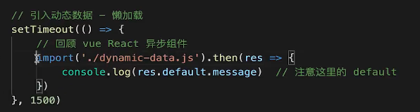
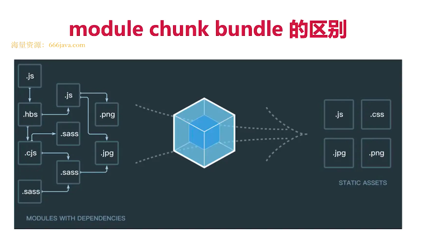
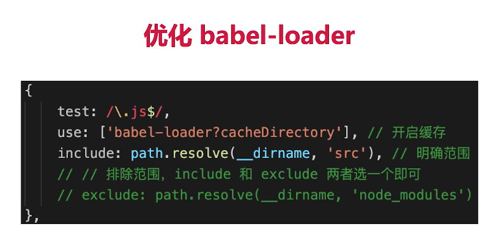
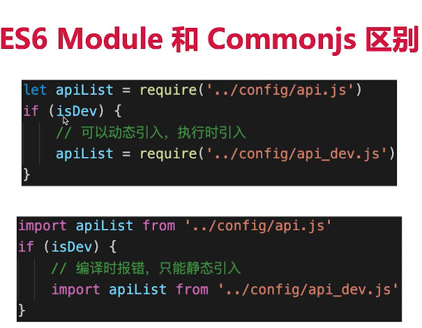
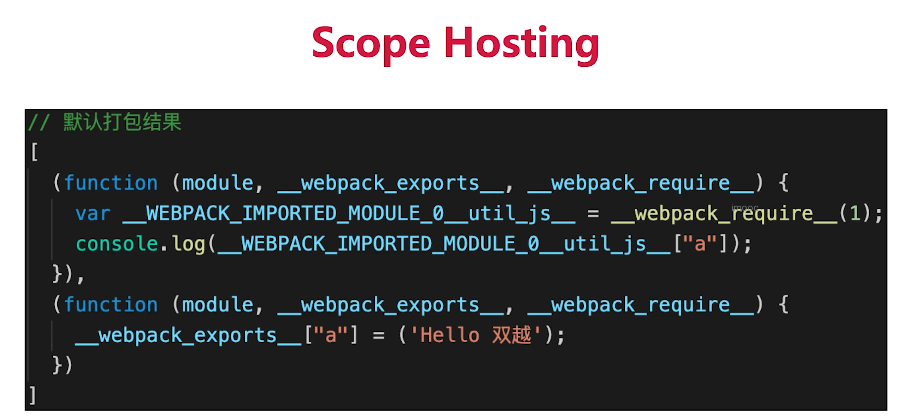
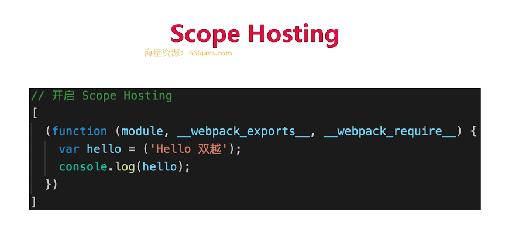
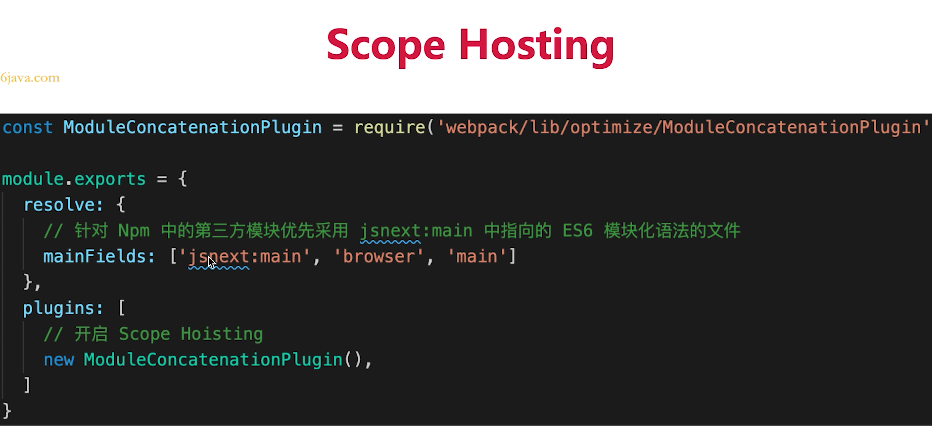
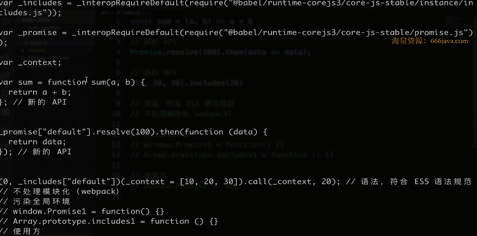

# webpack

升级 webpack5 以及周边插件后，代码需要做出的调整：

- package.json 的 dev-server 命令改了 `"dev": "webpack serve --config build/webpack.dev.js",`
- 升级新版本 `const { merge } = require('webpack-merge')`
- 升级新版本  `const { CleanWebpackPlugin } = require('clean-webpack-plugin')`
- `module.rules` 中 `loader: ['xxx-loader']` 换成 `use: ['xxx-loader']`
- `filename: 'bundle.[contenthash:8].js'` 其中 `h` 小写，不能大写
## 基本配置
- 拆分配置和merge 
- 启动本地服务
- 处理ES6
- 处理样式
- 处理图片
- 模块化 
webpack.common.js
```js
const path = require('path')
const HtmlWebpackPlugin = require('html-webpack-plugin')
const { srcPath, distPath } = require('./paths')

module.exports = {
    entry: path.join(srcPath, 'index'),
    module: {
        rules: [
            {
                test: /\.js$/,
                loader: ['babel-loader'],
                include: srcPath,
                exclude: /node_modules/
            },
            // {
            //     test: /\.vue$/,
            //     loader: ['vue-loader'],
            //     include: srcPath
            // },
            // {
            //     test: /\.css$/,
            //     // loader 的执行顺序是：从后往前（知识点）
            //     loader: ['style-loader', 'css-loader']
            // },
            {
                test: /\.css$/,
                // loader 的执行顺序是：从后往前
                loader: ['style-loader', 'css-loader', 'postcss-loader'] // 加了 postcss
            },
            {
                test: /\.less$/,
                // 增加 'less-loader' ，注意顺序
                loader: ['style-loader', 'css-loader', 'less-loader']
            }
        ]
    },
    plugins: [
        new HtmlWebpackPlugin({
            template: path.join(srcPath, 'index.html'),
            filename: 'index.html'
        })
    ]
}

```
webpack.dev.js
```js
const path = require('path')
const webpack = require('webpack')
const webpackCommonConf = require('./webpack.common.js')
const { smart } = require('webpack-merge')
const { srcPath, distPath } = require('./paths')

module.exports = smart(webpackCommonConf, {
    mode: 'development',
    module: {
        rules: [
            // 直接引入图片 url
            {
                test: /\.(png|jpg|jpeg|gif)$/,
                use: 'file-loader'
            }
        ]
    },
    plugins: [
        new webpack.DefinePlugin({
            // window.ENV = 'development'
            ENV: JSON.stringify('development')
        })
    ],
    devServer: {
        port: 8080,
        progress: true,  // 显示打包的进度条
        contentBase: distPath,  // 根目录
        open: true,  // 自动打开浏览器
        compress: true,  // 启动 gzip 压缩

        // 设置代理
        proxy: {
            // 将本地 /api/xxx 代理到 localhost:3000/api/xxx
            '/api': 'http://localhost:3000',

            // 将本地 /api2/xxx 代理到 localhost:3000/xxx
            '/api2': {
                target: 'http://localhost:3000',
                pathRewrite: {
                    '/api2': ''
                }
            }
        }
    }
})

```
webpack.prod.js
```js
const path = require('path')
const webpack = require('webpack')
const { CleanWebpackPlugin } = require('clean-webpack-plugin')
const webpackCommonConf = require('./webpack.common.js')
const { smart } = require('webpack-merge')
const { srcPath, distPath } = require('./paths')

module.exports = smart(webpackCommonConf, {
    mode: 'production',
    output: {
        filename: 'bundle.[contentHash:8].js',  // 打包代码时，加上 hash 戳
        path: distPath,
        // publicPath: 'http://cdn.abc.com'  // 修改所有静态文件 url 的前缀（如 cdn 域名），这里暂时用不到
    },
    module: {
        rules: [
            // 图片 - 考虑 base64 编码的情况
            {
                test: /\.(png|jpg|jpeg|gif)$/,
                use: {
                    loader: 'url-loader',
                    options: {
                        // 小于 5kb 的图片用 base64 格式产出
                        // 否则，依然延用 file-loader 的形式，产出 url 格式
                        limit: 5 * 1024,

                        // 打包到 img 目录下
                        outputPath: '/img1/',

                        // 设置图片的 cdn 地址（也可以统一在外面的 output 中设置，那将作用于所有静态资源）
                        // publicPath: 'http://cdn.abc.com'
                    }
                }
            },
        ]
    },
    plugins: [
        new CleanWebpackPlugin(), // 会默认清空 output.path 文件夹
        new webpack.DefinePlugin({
            // window.ENV = 'production'
            ENV: JSON.stringify('production')
        })
    ]
})

```
.babelrc
```js
{
    "presets": ["@babel/preset-env"],
    "plugins": []
}
```
postcss.config.js
```js
module.exports = {
    plugins: [require('autoprefixer')]
}

```
## 高级配置
- 多入口 
```js
 entry: {
        index: path.join(srcPath, 'index.js'),
        other: path.join(srcPath, 'other.js')
    },
```
```js
  output: {
        // filename: 'bundle.[contentHash:8].js',  // 打包代码时，加上 hash 戳
        filename: '[name].[contentHash:8].js', // name 即多入口时 entry 的 key
        path: distPath,
        // publicPath: 'http://cdn.abc.com'  // 修改所有静态文件 url 的前缀（如 cdn 域名），这里暂时用不到
    },
```
```js
 plugins: [
        // new HtmlWebpackPlugin({
        //     template: path.join(srcPath, 'index.html'),
        //     filename: 'index.html'
        // })

        // 多入口 - 生成 index.html
        new HtmlWebpackPlugin({
            template: path.join(srcPath, 'index.html'),
            filename: 'index.html',
            // chunks 表示该页面要引用哪些 chunk （即上面的 index 和 other），默认全部引用
            chunks: ['index']  // 只引用 index.js
        }),
        // 多入口 - 生成 other.html
        new HtmlWebpackPlugin({
            template: path.join(srcPath, 'other.html'),
            filename: 'other.html',
            chunks: ['other']  // 只引用 other.js
        })
    ]
```
- 抽离css  
1. mini-css-extract-plugin 抽离css 
2. optimize-css-assets-webpack-plugin terser-webpack-plugin 压缩css 
```js
const path = require('path')
const webpack = require('webpack')
const { smart } = require('webpack-merge')
const { CleanWebpackPlugin } = require('clean-webpack-plugin')
const MiniCssExtractPlugin = require('mini-css-extract-plugin')
const TerserJSPlugin = require('terser-webpack-plugin')
const OptimizeCSSAssetsPlugin = require('optimize-css-assets-webpack-plugin')
const webpackCommonConf = require('./webpack.common.js')
const { srcPath, distPath } = require('./paths')

module.exports = smart(webpackCommonConf, {
    mode: 'production',
    output: {
        // filename: 'bundle.[contentHash:8].js',  // 打包代码时，加上 hash 戳
        filename: '[name].[contentHash:8].js', // name 即多入口时 entry 的 key
        path: distPath,
        // publicPath: 'http://cdn.abc.com'  // 修改所有静态文件 url 的前缀（如 cdn 域名），这里暂时用不到
    },
    module: {
        rules: [
            // 图片 - 考虑 base64 编码的情况
            {
                test: /\.(png|jpg|jpeg|gif)$/,
                use: {
                    loader: 'url-loader',
                    options: {
                        // 小于 5kb 的图片用 base64 格式产出
                        // 否则，依然延用 file-loader 的形式，产出 url 格式
                        limit: 5 * 1024,

                        // 打包到 img 目录下
                        outputPath: '/img1/',

                        // 设置图片的 cdn 地址（也可以统一在外面的 output 中设置，那将作用于所有静态资源）
                        // publicPath: 'http://cdn.abc.com'
                    }
                }
            },
            // 抽离 css
            {
                test: /\.css$/,
                loader: [
                    MiniCssExtractPlugin.loader,  // 注意，这里不再用 style-loader
                    'css-loader',
                    'postcss-loader'
                ]
            },
            // 抽离 less --> css
            {
                test: /\.less$/,
                loader: [
                    MiniCssExtractPlugin.loader,  // 注意，这里不再用 style-loader
                    'css-loader',
                    'less-loader',
                    'postcss-loader'
                ]
            }
        ]
    },
    plugins: [
        new CleanWebpackPlugin(), // 会默认清空 output.path 文件夹
        new webpack.DefinePlugin({
            // window.ENV = 'production'
            ENV: JSON.stringify('production')
        }),

        // 抽离 css 文件
        new MiniCssExtractPlugin({
            filename: 'css/main.[contentHash:8].css'
        })
    ],

    optimization: {
        // 压缩 css
        minimizer: [new TerserJSPlugin({}), new OptimizeCSSAssetsPlugin({})],
    }
})

```
- 抽离公共代码 
2. 抽离公共代码 
1. 抽离引入第三方模块 
webpack.prod.js
```js
const path = require('path')
const webpack = require('webpack')
const { smart } = require('webpack-merge')
const { CleanWebpackPlugin } = require('clean-webpack-plugin')
const MiniCssExtractPlugin = require('mini-css-extract-plugin')
const TerserJSPlugin = require('terser-webpack-plugin')
const OptimizeCSSAssetsPlugin = require('optimize-css-assets-webpack-plugin')
const webpackCommonConf = require('./webpack.common.js')
const { srcPath, distPath } = require('./paths')

module.exports = smart(webpackCommonConf, {
    mode: 'production',
    output: {
        // filename: 'bundle.[contentHash:8].js',  // 打包代码时，加上 hash 戳
        filename: '[name].[contentHash:8].js', // name 即多入口时 entry 的 key
        path: distPath,
        // publicPath: 'http://cdn.abc.com'  // 修改所有静态文件 url 的前缀（如 cdn 域名），这里暂时用不到
    },
    module: {
        rules: [
            // 图片 - 考虑 base64 编码的情况
            {
                test: /\.(png|jpg|jpeg|gif)$/,
                use: {
                    loader: 'url-loader',
                    options: {
                        // 小于 5kb 的图片用 base64 格式产出
                        // 否则，依然延用 file-loader 的形式，产出 url 格式
                        limit: 5 * 1024,

                        // 打包到 img 目录下
                        outputPath: '/img1/',

                        // 设置图片的 cdn 地址（也可以统一在外面的 output 中设置，那将作用于所有静态资源）
                        // publicPath: 'http://cdn.abc.com'
                    }
                }
            },
            // 抽离 css
            {
                test: /\.css$/,
                loader: [
                    MiniCssExtractPlugin.loader,  // 注意，这里不再用 style-loader
                    'css-loader',
                    'postcss-loader'
                ]
            },
            // 抽离 less
            {
                test: /\.less$/,
                loader: [
                    MiniCssExtractPlugin.loader,  // 注意，这里不再用 style-loader
                    'css-loader',
                    'less-loader',
                    'postcss-loader'
                ]
            }
        ]
    },
    plugins: [
        new CleanWebpackPlugin(), // 会默认清空 output.path 文件夹
        new webpack.DefinePlugin({
            // window.ENV = 'production'
            ENV: JSON.stringify('production')
        }),

        // 抽离 css 文件
        new MiniCssExtractPlugin({
            filename: 'css/main.[contentHash:8].css'
        })
    ],

    optimization: {
        // 压缩 css
        minimizer: [new TerserJSPlugin({}), new OptimizeCSSAssetsPlugin({})],

        // 分割代码块
        splitChunks: {
            chunks: 'all',
            /**
             * initial 入口 chunk，对于异步导入的文件不处理
                async 异步 chunk，只对异步导入的文件处理
                all 全部 chunk
             */

            // 缓存分组
            cacheGroups: {
                // 第三方模块
                vendor: {
                    name: 'vendor', // chunk 名称
                    priority: 1, // 权限更高，优先抽离，重要！！！
                    test: /node_modules/,
                    minSize: 0,  // 大小限制
                    minChunks: 1  // 最少复用过几次
                },

                // 公共的模块
                common: {
                    name: 'common', // chunk 名称
                    priority: 0, // 优先级
                    minSize: 0,  // 公共模块的大小限制
                    minChunks: 2  // 公共模块最少复用过几次
                }
            }
        }
    }
})
```
webpack.common.js
```js
const path = require('path')
const HtmlWebpackPlugin = require('html-webpack-plugin')
const { srcPath, distPath } = require('./paths')

module.exports = {
    entry: {
        index: path.join(srcPath, 'index.js'),
        other: path.join(srcPath, 'other.js')
    },
    module: {
        rules: [
            {
                test: /\.js$/,
                loader: ['babel-loader'],
                include: srcPath,
                exclude: /node_modules/
            }
        ]
    },
    plugins: [
        // new HtmlWebpackPlugin({
        //     template: path.join(srcPath, 'index.html'),
        //     filename: 'index.html'
        // })

        // 多入口 - 生成 index.html
        new HtmlWebpackPlugin({
            template: path.join(srcPath, 'index.html'),
            filename: 'index.html',
            // chunks 表示该页面要引用哪些 chunk （即上面的 index 和 other），默认全部引用
            chunks: ['index', 'vendor', 'common']  // 要考虑代码分割
        }),
        // 多入口 - 生成 other.html
        new HtmlWebpackPlugin({
            template: path.join(srcPath, 'other.html'),
            filename: 'other.html',
            chunks: ['other', 'common']  // 考虑代码分割
        })
    ]
}

```
- 懒加载 

- 处理jsx
```js
{
    "presets": ["@babel/preset-env", "@babel/preset-react"],
    "plugins": []
}
```
- 处理vue
```vue
   {
                test: /\.vue$/,
                loader: ['vue-loader'],
                include: srcPath
            },
```
## module chunk bundle 分别什么意思，有何区别
- module - 各个源码文件，webpack中一切皆模块
- chunk - 多个模块合并而成，如entry import() splitChunk
- bundle - 最终的输出文件


## webpack  性能优化 
### 优化打包构建速度
- 优化babel-loader

```js
  {
                test: /\.js$/,
                loader: ['babel-loader?cacheDirectory'],
                include: srcPath,
                // exclude: /node_modules/
            },
````



- IgnorePlugin 避免引用无用的模块

```js
import moment from 'moment'
import 'moment/locale/zh-en'
```
```js
 // 忽略 moment 下的 /locale 目录
new webpack.IgnorePlugin(/\.\/locale/, /moment/),

```
- noParse 避免重复打包 
```js
 module: {
    noParse: [/jquery|lodash/,/react\.min\.js$/],
  },
```
:::tip
1. IgnorePlugin 直接不引入，代码中没有
2. noParse 引入，但不打包
:::
- happyPack 多进程打包 
> js单线程，开启多进程打包
> 提高构建速度，特别是多核cpu 

```js
const HappyPack = require('happypack')

 module: {
        rules: [
            // js
            {
                test: /\.js$/,
                // 把对 .js 文件的处理转交给 id 为 babel 的 HappyPack 实例
                use: ['happypack/loader?id=babel'],
                include: srcPath,
                // exclude: /node_modules/
            },
        ]
    },
plugins:[
     new HappyPack({
            // 用唯一的标识符 id 来代表当前的 HappyPack 是用来处理一类特定的文件
            id: 'babel',
            // 如何处理 .js 文件，用法和 Loader 配置中一样
            loaders: ['babel-loader?cacheDirectory']
        }),
]    
```
- ParallelUglifyPlugin 多进程压缩js
```js
const ParallelUglifyPlugin = require('webpack-parallel-uglify-plugin')
plugins:[
     // 使用 ParallelUglifyPlugin 并行压缩输出的 JS 代码
        new ParallelUglifyPlugin({
            // 传递给 UglifyJS 的参数
            // （还是使用 UglifyJS 压缩，只不过帮助开启了多进程）
            uglifyJS: {
                output: {
                    beautify: false, // 最紧凑的输出
                    comments: false, // 删除所有的注释
                },
                compress: {
                    // 删除所有的 `console` 语句，可以兼容ie浏览器
                    drop_console: true,
                    // 内嵌定义了但是只用到一次的变量
                    collapse_vars: true,
                    // 提取出出现多次但是没有定义成变量去引用的静态值
                    reduce_vars: true,
                }
            }
        })
]
```
:::warning
- 项目较大，打包较慢，开启多进程能提高速度
- 项目较小，打包很快，开启多进程会降低速度（进程开销）
- 按需使用
:::
- 热更新 （用于开发环境）
:::tip
- 自动刷新：整个页面全部刷新，速度较慢
- 自动刷新：这个页面全部刷新，状态丢失
- 热更新：新代码生效，页面不会刷新，状态不会丢失
:::
```js
const HotModuleReplacementPlugin = require('webpack/lib/HotModuleReplacementPlugin');
entry: {
        // index: path.join(srcPath, 'index.js'),
        index: [
            'webpack-dev-server/client?http://localhost:8080/',
            'webpack/hot/dev-server',
            path.join(srcPath, 'index.js')
        ],
        other: path.join(srcPath, 'other.js')
    },
plugin:[
            new HotModuleReplacementPlugin()
]

  devServer: {
        port: 8080,
        progress: true,  // 显示打包的进度条
        contentBase: distPath,  // 根目录
        open: true,  // 自动打开浏览器
        compress: true,  // 启动 gzip 压缩

        hot: true, // 热更新开启

        // 设置代理
        proxy: {
            // 将本地 /api/xxx 代理到 localhost:3000/api/xxx
            '/api': 'http://localhost:3000',

            // 将本地 /api2/xxx 代理到 localhost:3000/xxx
            '/api2': {
                target: 'http://localhost:3000',
                pathRewrite: {
                    '/api2': ''
                }
            }
        }
    },

```
- 自动刷新 （用于开发环境）
```js
  watch: true, // 开启监听，默认为 false
    watchOptions: {
        ignored: /node_modules/, // 忽略哪些
        // 监听到变化发生后会等300ms再去执行动作，防止文件更新太快导致重新编译频率太高
        // 默认为 300ms
        aggregateTimeout: 300,
        // 判断文件是否发生变化是通过不停的去询问系统指定文件有没有变化实现的
        // 默认每隔1000毫秒询问一次
        poll: 1000
    }
```

- DllPlugin 动态链接库插件（用于开发环境）

1. 前端框架如vue react ，体积大，构建慢
2. 较稳定，不常升级版本
3. 同一版本只构建一次即可，不用每次都重新构建
4. 已经内置了DllPlugin 支持
5. DllPlugin - 打出dll文件
webpack.dll.js
```js
const path = require('path')
const DllPlugin = require('webpack/lib/DllPlugin')
const { srcPath, distPath } = require('./paths')

module.exports = {
  mode: 'development',
  // JS 执行入口文件
  entry: {
    // 把 React 相关模块的放到一个单独的动态链接库
    react: ['react', 'react-dom']
  },
  output: {
    // 输出的动态链接库的文件名称，[name] 代表当前动态链接库的名称，
    // 也就是 entry 中配置的 react 和 polyfill
    filename: '[name].dll.js',
    // 输出的文件都放到 dist 目录下
    path: distPath,
    // 存放动态链接库的全局变量名称，例如对应 react 来说就是 _dll_react
    // 之所以在前面加上 _dll_ 是为了防止全局变量冲突
    library: '_dll_[name]',
  },
  plugins: [
    // 接入 DllPlugin
    new DllPlugin({
      // 动态链接库的全局变量名称，需要和 output.library 中保持一致
      // 该字段的值也就是输出的 manifest.json 文件 中 name 字段的值
      // 例如 react.manifest.json 中就有 "name": "_dll_react"
      name: '_dll_[name]',
      // 描述动态链接库的 manifest.json 文件输出时的文件名称
      path: path.join(distPath, '[name].manifest.json'),
    }),
  ],
}
```
6. DllReferencePlugin  - 使用dll文件 （用于开发环境）
    - 引入
```html
<!DOCTYPE html>
<html lang="en">
<head>
    <meta charset="UTF-8">
    <meta name="viewport" content="width=device-width, initial-scale=1.0">
    <meta http-equiv="X-UA-Compatible" content="ie=edge">
    <title>Document</title>
</head>
<body>
    <div id="root"></div>

    <script src="./react.dll.js"></script>
</body>
</html>
```
   - 修改  
```js
  plugins: [
        new webpack.DefinePlugin({
            // window.ENV = 'production'
            ENV: JSON.stringify('development')
        }),
        // 第三，告诉 Webpack 使用了哪些动态链接库
        new DllReferencePlugin({
            // 描述 react 动态链接库的文件内容
            manifest: require(path.join(distPath, 'react.manifest.json')),
        }),
    ],
```    


### 优化产出代码
- 体积更小
- 合理分包，不重复加载
- 速度更快，内存使用更小

:::tip
1. 小图片base64编码 
2. bundle加hash
3. 懒加载  import方式 引入 
4. 提取公共代码 splits
5. IgnorePlugin
6. 使用CDN加速 1）配置publicPath 2）上传CDN服务器上
7. 使用production
8. Scope Hosting
:::
#### 使用production
- 自动开启压缩代码
- Vue React 等会自动删除掉调试代码（开发环境的warning ）
- 开启Tree-Shaking （必须用ES Module 才能生效 ，commonjs不行）

### ES6 Module 和Commonjs 
- ES6 Module 静态引入，编译时引入
- Commonjs动态引入，执行时引入
- 只有ES6 Module 才能静态分析，实现Tree-Shaking 

#### Scope Hosting (多个函数合并为一个函数，函数作用域减少)
 - 代码腿更小
 - 创建函数作用域更少
 - 代码可读性更好




## babel
### 环境搭建&基本配置
- 环境搭建
```js
  "devDependencies": {
    "@babel/cli": "^7.7.5",
    "@babel/core": "^7.7.5",
    "@babel/plugin-transform-runtime": "^7.7.5",
    "@babel/preset-env": "^7.7.5"
  },
  "dependencies": {
    "@babel/polyfill": "^7.7.0",
    "@babel/runtime": "^7.7.5"
  }
```
- .babelrc配置
- presets和plugins 
```js
```
### babel-polyfill (补丁)
- 什么是Polyfill
- core-js和regenerator
- babel-polyfill 即两者集合
- Bable7.4之后弃用了babel-polyfill
- 推荐直接使用core-js和regenerator

#### 如何按需引入 
```js
 {
    "useBuiltIns": "usage",
    "corejs": 3
}
```
- 问题
1. 污染全局环境 所以使用babel-runtime

```js
{
    "presets": [
        [
            "@babel/preset-env",
            {
                "useBuiltIns": "usage",
                "corejs": 3
            }
        ]
    ],
    "plugins": [
        [
            "@babel/plugin-transform-runtime",
            {
                "absoluteRuntime": false,
                "corejs": 3,
                "helpers": true,
                "regenerator": true,
                "useESModules": false
            }
        ]
    ]
}
```


### babel-runtime和babel-polyfill的区别

## 优化打包效率
## 优化产出代码
## 构建流程概述


## 前端代码为何要进行构建和打包

## loader 和plugin 的区别
## webpack 如何实现懒加载
