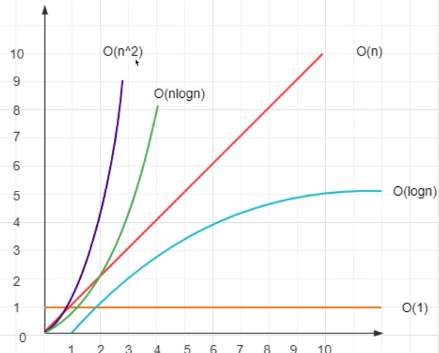

# 数据结构和算法

## 算法复杂度：空间，时间
:::tip
- 程序执行时需要的计算量和内存空间（和代码简洁无关）
- 复杂度是数量级（方便记忆，推广），不是具体的数字
- 一般针对一个具体算法，而非一个完整的系统
:::

### 时间复杂度 - 程序执行时需要的计算量（CPU）
:::tip
- 0(1)一次就够（数量级）
- O(n)和传输的数据量一样（数量级）
- O(nA2)数据量的平方（数量级）
- 0(logn)数据量的对数（数量级）
- 0(n*logn)数据量*数据量的对数（数量级）
:::
### 空间复杂度
- O(n)和传输的数据量一样（数量级）
```js 
function fn(arr = []){
//0(n)
const arr2 =[]
for (let i 0;i<arr.length;i++){
arr2[i]=arr[i]
//▣
}
return arr2
}
```
## 算法思维：贪心，二分，动态规划
## 常见数据结构

## 将一个数组旋转k步
- 输入一个数组[1,2,3,4,5,6,7]
- k = 3, 即旋转3步
- 输出[5,6,7,1,2,3,4]
```js
/**
 * 旋转数组 k 步 - 使用 pop 和 unshift
 * @param arr arr
 * @param k k
 * @returns arr
 */
export function rotate1(arr: number[], k: number): number[] {
    const length = arr.length
    if (!k || length === 0) return arr
    const step = Math.abs(k % length) // abs 取绝对值

    // O(n^2)
    for (let i = 0; i < step; i++) {
        const n = arr.pop()
        if (n != null) {
            arr.unshift(n) // 数组是一个有序结构，unshift 操作非常慢！！！ O(n)
        }
    }
    return arr
}

/**
 * 旋转数组 k 步 - 使用 concat
 * @param arr arr
 * @param k k
 */
 export function rotate2(arr: number[], k: number): number[] {
    const length = arr.length
    if (!k || length === 0) return arr
    const step = Math.abs(k % length) // abs 取绝对值

    // O(1)
    const part1 = arr.slice(-step) // O(1)
    const part2 = arr.slice(0, length - step)
    const part3 = part1.concat(part2)
    return part3
}

// // 功能测试
// const arr = [1, 2, 3, 4, 5, 6, 7]
// const arr1 = rotate2(arr, 3)
// console.info(arr1)

// // 性能测试
// const arr1 = []
// for (let i = 0; i < 10 * 10000; i++) {
//     arr1.push(i)
// }
// console.time('rotate1')
// rotate1(arr1, 9 * 10000)
// console.timeEnd('rotate1') // 885ms O(n^2)

// const arr2 = []
// for (let i = 0; i < 10 * 10000; i++) {
//     arr2.push(i)
// }
// console.time('rotate2')
// rotate2(arr2, 9 * 10000)
// console.timeEnd('rotate2') // 1ms O(1)

```
## 快速排序 
```js

/**
 * 快速排序（使用 splice）
 * @param arr number arr
 */
export function quickSort1(arr: number[]): number[] {
    const length = arr.length
    if (length === 0) return arr

    const midIndex = Math.floor(length / 2)
    const midValue = arr.splice(midIndex, 1)[0]

    const left: number[] = []
    const right: number[] = []

    // 注意：这里不用直接用 length ，而是用 arr.length 。因为 arr 已经被 splice 给修改了
    for (let i = 0; i < arr.length; i++) {
        const n = arr[i]
        if (n < midValue) {
            // 小于 midValue ，则放在 left
            left.push(n)
        } else {
            // 大于 midValue ，则放在 right
            right.push(n)
        }
    }

    return quickSort1(left).concat(
        [midValue],
        quickSort1(right)
    )
}

/**
 * 快速排序（使用 slice）
 * @param arr number arr
 */
export function quickSort2(arr: number[]): number[] {
    const length = arr.length
    if (length === 0) return arr

    const midIndex = Math.floor(length / 2)
    const midValue = arr.slice(midIndex, midIndex + 1)[0]

    const left: number[] = []
    const right: number[] = []

    for (let i = 0; i < length; i++) {
        if (i !== midIndex) {
            const n = arr[i]
            if (n < midValue) {
                // 小于 midValue ，则放在 left
                left.push(n)
            } else {
                // 大于 midValue ，则放在 right
                right.push(n)
            }
        }
    }

    return quickSort2(left).concat(
        [midValue],
        quickSort2(right)
    )
}

// // 功能测试
// const arr1 = [1, 6, 2, 7, 3, 8, 4, 9, 5]
// console.info(quickSort2(arr1))

// // 性能测试
// const arr1 = []
// for (let i = 0; i < 10 * 10000; i++) {
//     arr1.push(Math.floor(Math.random() * 1000))
// }
// console.time('quickSort1')
// quickSort1(arr1)
// console.timeEnd('quickSort1') // 74ms

// const arr2 = []
// for (let i = 0; i < 10 * 10000; i++) {
//     arr2.push(Math.floor(Math.random() * 1000))
// }
// console.time('quickSort2')
// quickSort2(arr2)
// console.timeEnd('quickSort2') // 82ms

// // 单独比较 splice 和 slice
// const arr1 = []
// for (let i = 0; i < 10 * 10000; i++) {
//     arr1.push(Math.floor(Math.random() * 1000))
// }
// console.time('splice')
// arr1.splice(5 * 10000, 1)
// console.timeEnd('splice')
// const arr2 = []
// for (let i = 0; i < 10 * 10000; i++) {
//     arr2.push(Math.floor(Math.random() * 1000))
// }
// console.time('slice')
// arr2.slice(5 * 10000, 5 * 10000 + 1)
// console.timeEnd('slice')

```
## 判断字符串是否是括号匹配的 
- 一个字符串s可能包含{}()[]三种括号
- 判断s是否是括号匹配的
- 如(a{b}c)匹配，而{a(b或{a(b}c)就不匹配

## 反转单向列表 

:::tip
- 链表是一种物理结构（非逻辑结构），类似于数组
- 数组需要一段连续的内存空间，而链表是零散的
- 链表节点的数据结构{value,next?,prev?}
:::


```js
/**
 * 根据数组创建单向链表
 * @param arr number arr
 */
export function createLinkList(arr: number[]): ILinkListNode {
    const length = arr.length;
    if (length === 0) throw new Error("arr is empty");

    let curNode: ILinkListNode = {
        value: arr[length - 1],
    };
    if (length === 1) return curNode;

    for (let i = length - 2; i >= 0; i--) {
        console.log("curNode", curNode);

        curNode = {
            value: arr[i],
            next: curNode,
        };
        console.log("curNodeLast", curNode);
    }

    return curNode;
}

const arr = [100, 200, 300, 400, 500];
const list = createLinkList(arr);
```


## 链表和数组的区别 

- 都是有序结构
- 链表：查询慢O(n),新增和删除快O(1)
- 数组：查询快O(1),新增和删除慢O(n)

- 输入一个单向链表，输出它的反转（头变尾，尾变头）
```ts
export interface ILinkListNode {
    value: number;
    next?: ILinkListNode;
}

/**
 * 反转单向链表，并返回反转之后的 head node
 * @param listNode list head node
 */
export function reverseLinkList(listNode: ILinkListNode): ILinkListNode {
    // 定义三个指针
    let prevNode: ILinkListNode | undefined = undefined;
    let curNode: ILinkListNode | undefined = undefined;
    let nextNode: ILinkListNode | undefined = listNode;

    // 以 nextNode 为主，遍历链表
    while (nextNode) {
        // 第一个元素，删掉 next ，防止循环引用
        if (curNode && !prevNode) {
            delete curNode.next;
        }

        // 反转指针
        if (curNode && prevNode) {
            curNode.next = prevNode;
        }

        // 整体向后移动指针
        prevNode = curNode;
        curNode = nextNode;
        nextNode = nextNode?.next;
    }

    // 最后一个的补充：当 nextNode 空时，此时 curNode 尚未设置 next
    curNode!.next = prevNode;

    return curNode!;
}
```


## 链表实现堆列

```js

interface IListNode {
    value: number
    next: IListNode | null
}

export class MyQueue {
    private head: IListNode | null = null
    private tail: IListNode | null = null
    private len = 0

    /**
     * 入队，在 tail 位置
     * @param n number
     */
    add(n: number) {
        const newNode: IListNode = {
            value: n,
            next: null,
        }

        // 处理 head
        if (this.head == null) {
            this.head = newNode
        }

        // 处理 tail
        const tailNode = this.tail
        if (tailNode) {
            tailNode.next = newNode
        }
        this.tail = newNode

        // 记录长度
        this.len++
    }

    /**
     * 出队，在 head 位置
     */
    delete(): number | null {
        const headNode = this.head
        if (headNode == null) return null
        if (this.len <= 0) return null

        // 取值
        const value = headNode.value

        // 处理 head
        this.head = headNode.next

        // 记录长度
        this.len--

        return value
    }

    get length(): number {
        // length 要单独存储，不能遍历链表来获取（否则时间复杂度太高 O(n)）
        return this.len
    }
}

```
- 性能分析

:::tip
- 空间复杂度都是O(n)
- add 时间复杂度：链表O(1);数组O(1)
- delete时间复杂度：链表O(1);数组O(n)
:::

## 二分查找 
- 递归 - 代码逻辑更加清晰
- 非递归 - 性能会更好 
- 时间复杂度O(logn)
```js

/**
 * 二分查找（循环）
 * @param arr arr
 * @param target target
 */
export function binarySearch1(arr: number[], target: number): number {
    const length = arr.length
    if (length === 0) return -1

    let startIndex = 0 // 开始位置
    let endIndex = length - 1 // 结束位置

    while (startIndex <= endIndex) {
        const midIndex = Math.floor((startIndex + endIndex) / 2)
        const midValue = arr[midIndex]
        if (target < midValue) {
            // 目标值较小，则继续在左侧查找
            endIndex = midIndex - 1
        } else if (target > midValue) {
            // 目标值较大，则继续在右侧查找
            startIndex = midIndex + 1
        } else {
            // 相等，返回
            return midIndex
        }
    }

    return -1
}

/**
 * 二分查找（递归）
 * @param arr arr
 * @param target target
 * @param startIndex start index
 * @param endIndex end index
 */
export function binarySearch2(arr: number[], target: number, startIndex?: number, endIndex?: number): number {
    const length = arr.length
    if (length === 0) return -1

    // 开始和结束的范围
    if (startIndex == null) startIndex = 0
    if (endIndex == null) endIndex = length - 1

    // 如果 start 和 end 相遇，则结束
    if (startIndex > endIndex) return -1

    // 中间位置
    const midIndex = Math.floor((startIndex + endIndex) / 2)
    const midValue = arr[midIndex]

    if (target < midValue) {
        // 目标值较小，则继续在左侧查找
        return binarySearch2(arr, target, startIndex, midIndex - 1)
    } else if (target > midValue) {
        // 目标值较大，则继续在右侧查找
        return binarySearch2(arr, target, midIndex + 1, endIndex)
    } else {
        // 相等，返回
        return midIndex
    }
}

```
## 两数之和
- 双指针，时间复杂度降低到O(n)

```js

/**
 * 寻找和为 n 的两个数（嵌套循环）
 * @param arr arr
 * @param n n
 */
export function findTowNumbers1(arr: number[], n: number): number[] {
    const res: number[] = []

    const length = arr.length
    if (length === 0) return res

    // O(n^2)
    for (let i = 0; i < length - 1; i++) {
        const n1 = arr[i]
        let flag = false // 是否得到了结果

        for (let j = i + 1; j < length; j++) {
            const n2 = arr[j]

            if (n1 + n2 === n) {
                res.push(n1)
                res.push(n2)
                flag = true
                break
            }
        }

        if (flag) break
    }

    return res
```
- 双指针，时间复杂度降低到O(n)
:::tip
- 定义i指向头，j指向尾，求arr[i]+arr[j]
- 如果大于n，则j需要向前移动
- 如果小于n，则需要i 向后移动 
:::
```js
/**
 * 查找和为 n 的两个数（双指针）
 * @param arr arr
 * @param n n
 */
export function findTowNumbers2(arr: number[], n: number): number[] {
    const res: number[] = []

    const length = arr.length
    if (length === 0) return res

    let i = 0 // 头
    let j = length - 1 // 尾

    // O(n)
    while (i < j) {
        const n1 = arr[i]
        const n2 = arr[j]
        const sum = n1 + n2

        if (sum > n) {
            // sum 大于 n ，则 j 要向前移动
            j--
        } else if (sum < n) {
            // sum 小于 n ，则 i 要向后移动
            i++
        } else {
            // 相等
            res.push(n1)
            res.push(n2)
            break
        }
    }

    return res
}
```

##  求一个二叉搜索树的第k小值


### 二叉树遍历
:::tip
- 前序遍历：root-> left->right
- 中序遍历：left->root->right
- 后序遍历：left->right ->root
:::
```js

export interface ITreeNode {
    value: number
    left: ITreeNode | null
    right: ITreeNode | null
}

const arr: number[] = []

/**
 * 二叉树前序遍历
 * @param node tree node
 */
function preOrderTraverse(node: ITreeNode | null) {
    if (node == null) return
    // console.log(node.value)
    arr.push(node.value)
    preOrderTraverse(node.left)
    preOrderTraverse(node.right)
}

/**
 * 二叉树中序遍历
 * @param node tree node
 */
function inOrderTraverse(node: ITreeNode | null) {
    if (node == null) return
    inOrderTraverse(node.left)
    // console.log(node.value)
    arr.push(node.value)
    inOrderTraverse(node.right)
}

/**
 * 二叉树后序遍历
 * @param node tree node
 */
function postOrderTraverse(node: ITreeNode | null) {
    if (node == null) return
    postOrderTraverse(node.left)
    postOrderTraverse(node.right)
    // console.log(node.value)
    arr.push(node.value)
}

/**
 * 寻找 BST 里的第 K 小值
 * @param node tree node
 * @param k 第几个值
 */
export function getKthValue(node: ITreeNode, k: number): number | null {
    inOrderTraverse(node)
    return arr[k - 1] || null
}

const bst: ITreeNode = {
    value: 5,
    left: {
        value: 3,
        left: {
            value: 2,
            left: null,
            right: null
        },
        right: {
            value: 4,
            left: null,
            right: null,
        }
    },
    right: {
        value: 7,
        left: {
            value: 6,
            left: null,
            right: null
        },
        right: {
            value: 8,
            left: null,
            right: null
        }
    }
}
```

:::tip
#### 二叉搜索树BST(Binary Search Tree)
- left(包括其后代)value<=root value
- right (包括其后代)value>=root value
- 使用二分查找
:::

## 堆栈模型
- js执行时
- 值类型变量，存储在栈
- 引用类型变量。存储在堆


## 斐波那契数列
:::tip
f(0) = 0
f(1) = 1
f(n) = f(n-1)+f(n-2)
:::
```js
function fibonacci(n: number): number {
    if (n <= 0) return 0
    if (n === 1) return 1

    return fibonacci(n - 1) + fibonacci(n - 2)
}
```

### 优化

- 不用递归，用循环
- 记录中间结果 
```js
/**
 * 斐波那契数列（循环）
 * @param n n
 */
export function fibonacci(n: number): number {
    if (n <= 0) return 0;
    if (n === 1) return 1;

    let n1 = 1; // 记录 n-1 的结果
    let n2 = 0; // 记录 n-2 的结果
    let res = 0;

    for (let i = 2; i <= n; i++) {
        res = n1 + n2;

        // 记录中间结果
        n2 = n1;
        n1 = res;
    }

    return res;
}
```

## 动态规划 
- 把一个大问题，拆解为多个小问题，逐级向下拆解
- 用递归的思路去分析问题，再改为循环来实现
- 算法三大思维：贪心，二分，动态规划
### 青蛙跳台阶 

- 一只青蛙，一次可跳1级，也可跳2级
- 问：青蛙跳到级台阶，总共有多少种方式？
:::tip
用动态规划分析问题
要跳到1级台阶，就1种方式f(1)=1
要跳到2级台阶，就2种方式f(2)=2
要跳到n级台阶：f(n)=f(n-1)+f(n-2)
:::

## 将数组中的0移动到末尾

- 如输入[1,0,3,0,11,0]，输出[1,3,11,0,0,0]、
- 只移动0，其他顺序不变
- 必须在原数组进行操作


```js

/**
 * 移动 0 到数组的末尾（嵌套循环）
 * @param arr number arr
 */
export function moveZero1(arr: number[]): void {
    const length = arr.length
    if (length === 0) return

    let zeroLength = 0

    // O(n^2)
    for (let i = 0; i < length - zeroLength; i++) {
        if (arr[i] === 0) {
            arr.push(0)
            arr.splice(i, 1) // 本身就有 O(n)
            i-- // 数组截取了一个元素，i 要递减，否则连续 0 就会有错误
            zeroLength++ // 累加 0 的长度
        }
    }
}

```
### 双指针解决

:::tip
定义j指向第一个0，i指向j后面的第一个非0
交换ⅰ和j的值，继续向后移动
只遍历一次，所以时间复杂度是O(n)
:::


```js
/**
 * 移动 0 到数组末尾（双指针）
 * @param arr number arr
 */
export function moveZero2(arr: number[]): void {
    const length = arr.length
    if (length === 0) return

    let i
    let j = -1 // 指向第一个 0

    for (i = 0; i < length; i++) {
        if (arr[i] === 0) {
            // 第一个 0
            if (j < 0) {
                j = i
            }
        }

        if (arr[i] !== 0 && j >= 0) {
            // 交换
            const n = arr[i]
            arr[i] = arr[j]
            arr[j] = n

            j++
        }
    }
}

```

## 字符串中连续最多的字符，以及次数
- 如，输入'abbcccddeeee1234',计算得到：
- 连续最多的字符是'e',4次
```js
/**
 * 求连续最多的字符和次数（嵌套循环）
 * @param str str
 */
export function findContinuousChar1(str: string): IRes {
    const res: IRes = {
        char: '',
        length: 0
    }

    const length = str.length
    if (length === 0) return res

    let tempLength = 0 // 临时记录当前连续字符的长度

    // O(n)
    for (let i = 0; i < length; i++) {
        tempLength = 0 // 重置

        for (let j = i; j < length; j++) {
            if (str[i] === str[j]) {
                tempLength++
            }

            if (str[i] !== str[j] || j === length - 1) {
                // 不相等，或者已经到了最后一个元素。要去判断最大值
                if (tempLength > res.length) {
                    res.char = str[i]
                    res.length = tempLength
                }

                if (i < length - 1) {
                    i = j - 1 // 跳步
                }

                break
            }
        }
    }

    return res
}

/**
 * 求连续最多的字符和次数（双指针）
 * @param str str
 */
export function findContinuousChar2(str: string): IRes {
    const res: IRes = {
        char: '',
        length: 0
    }

    const length = str.length
    if (length === 0) return res

    let tempLength = 0 // 临时记录当前连续字符的长度
    let i = 0
    let j = 0

    // O(n)
    for (; i < length; i++) {
        if (str[i] === str[j]) {
            tempLength++
        }

        if (str[i] !== str[j] || i === length - 1) {
            // 不相等，或者 i 到了字符串的末尾
            if (tempLength > res.length) {
                res.char = str[j]
                res.length = tempLength
            }
            tempLength = 0 // reset

            if (i < length - 1) {
                j = i // 让 j “追上” i
                i-- // 细节
            }
        }
    }

    return res
 }
```

## 对称树 
- 求1-10000之间的所有对称数（回文）
```js

/**
 * 查询 1-max 的所有对称数（数组反转）
 * @param max 最大值
 */
export function findPalindromeNumbers1(max: number): number[] {
    const res: number[] = []
    if (max <= 0) return res

    for (let i = 1; i <= max; i++) {
        // 转换为字符串，转换为数组，再反转，比较
        const s = i.toString()
        if (s === s.split('').reverse().join('')) {
            res.push(i)
        }
    }

    return res
}

/**
 * 查询 1-max 的所有对称数（字符串前后比较）
 * @param max 最大值
 */
export function findPalindromeNumbers2(max: number): number[] {
    const res: number[] = []
    if (max <= 0) return res

    for (let i = 1; i <= max; i++) {
        const s = i.toString()
        const length = s.length

        // 字符串头尾比较
        let flag = true
        let startIndex = 0 // 字符串开始
        let endIndex = length - 1 // 字符串结束
        while (startIndex < endIndex) {
            if (s[startIndex] !== s[endIndex]) {
                flag = false
                break
            } else {
                // 继续比较
                startIndex++
                endIndex--
            }
        }

        if (flag) res.push(i)
    }

    return res
}

/**
 * 查询 1-max 的所有对称数（翻转数字）
 * @param max 最大值
 */
export function findPalindromeNumbers3(max: number): number[] {
    const res: number[] = []
    if (max <= 0) return res

    for (let i = 1; i <= max; i++) {
        let n = i
        let rev = 0 // 存储翻转数

        // 生成翻转数
        while (n > 0) {
            rev = rev * 10 + n % 10
            n = Math.floor(n / 10)
        }

        if (i === rev) res.push(i)
    }

    return res
}


```