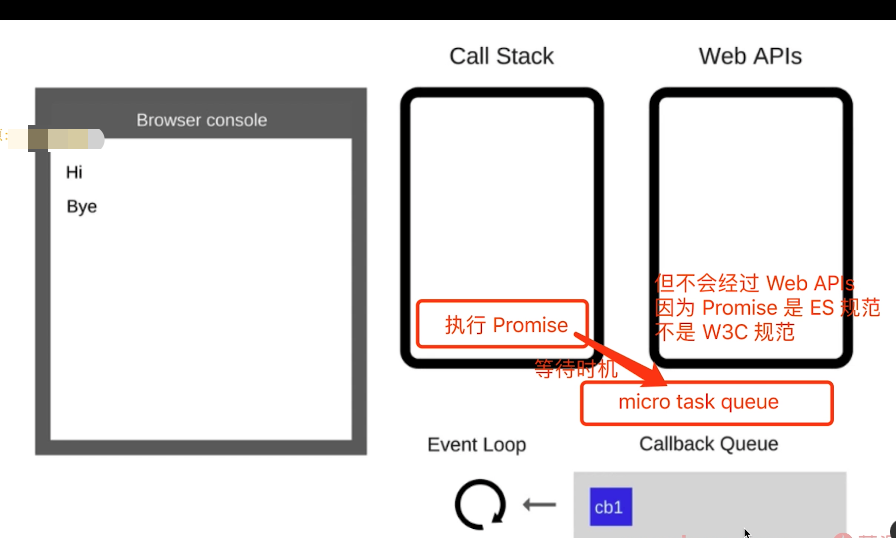

# js基础部分

## js异步

- 描述 event loop 运行机制（可画图）
### event loop
:::tip
- js 是单线程运行的
- 异步是基于回调实现的
- event loop 就是异步回调的实现原理
:::
#### js如何执行的？

:::tip
- 从前到后，一行一行执行
- 如果某一行执行报错，则停止下面的代码执行
- 先把同步执行完，再执行异步
:::


:::tip
- 同步代码，一行一行当道Call Stack执行
- 遇到异步，会‘记录’下，等待时机（定时器，网络请求）
- 时机到了，就移动到callback queue中
- 如call stack 为空（即同步代码执行完）Event Loop 开始工作
- 轮询查找 Callback queue，如有则移动到 call stack 执行
- 然后继续轮询查找
:::

#### DOM 事件和Event loop

:::tip
- js 是单线程运行的
- 异步(setTimeout,ajax等)使用回调，基于event loop
- Dom 事件也使用了回调，基于event loop
:::

```js
<button id="btn1">提交</button>

<script>
console.log('Hi')

$('#btn1').click(function (e) {
    console.log('button clicked')
})

console.log('Bye')
</script>
```

### Promise 哪几种状态，如何变化？
#### Promise

- 三种状态
- 状态和 then catch
- 常用 API

先回顾一下 Promise 的基本使用

```js
// 加载图片
function loadImg(src) {
    const p = new Promise(
        (resolve, reject) => {
            const img = document.createElement('img')
            img.onload = () => {
                resolve(img)
            }
            img.onerror = () => {
                const err = new Error(`图片加载失败 ${src}`)
                reject(err)
            }
            img.src = src
        }
    )
    return p
}
const url = 'https://img.mukewang.com/5a9fc8070001a82402060220-140-140.jpg'
loadImg(url).then(img => {
    console.log(img.width)
    return img
}).then(img => {
    console.log(img.height)
}).catch(ex => console.error(ex))
```

#### 三种状态

三种状态 pending resolved rejected
:::tip
- pending resolved rejected
- pending一>resolved或pending一>rejected
- 变化不可逆
:::

```js
// 刚定义时，状态默认为 pending
const p1 = new Promise((resolve, reject) => {

})
console.log(p1);// pending

// 执行 resolve() 后，状态变成 resolved
const p2 = new Promise((resolve, reject) => {
    setTimeout(() => {
        resolve()
    })
})

// 执行 reject() 后，状态变成 rejected
const p3 = new Promise((resolve, reject) => {
    setTimeout(() => {
        reject()
    })
})

```

```js
// 直接返回一个 resolved 状态
Promise.resolve(100)
// 直接返回一个 rejected 状态
Promise.reject('some error')
```

#### 状态和 then catch

状态变化会触发 then catch —— 这些比较好理解，就不再代码演示了

- pending 不会触发任何 then catch 回调
- 状态变为 resolved 会触发后续的 then 回调
- 状态变为 rejected 会触发后续的 catch 回调
- then正常返resolved,里面有报错则返rejected
- catch正常返回resolved,里面有报错则返回rejected

-----

then catch 会继续返回 Promise ，**此时可能会发生状态变化！！！**

```js
// then() 一般正常返回 resolved 状态的 promise
Promise.resolve().then(() => {
    return 100
})

// then() 里抛出错误，会返回 rejected 状态的 promise
Promise.resolve().then(() => {
    throw new Error('err')
})

// catch() 不抛出错误，会返回 resolved 状态的 promise
Promise.reject().catch(() => {
    console.error('catch some error')
})

// catch() 抛出错误，会返回 rejected 状态的 promise
Promise.reject().catch(() => {
    console.error('catch some error')
    throw new Error('err')
})
```

看一个综合的例子，即那几个面试题

```js
// 第一题
Promise.resolve().then(() => {
    console.log(1)
}).catch(() => {
    console.log(2)
}).then(() => {
    console.log(3)
})
//1 3

// 第二题
Promise.resolve().then(() => { // 返回 rejected 状态的 promise
    console.log(1)
    throw new Error('erro1')
}).catch(() => { // 返回 resolved 状态的 promise
    console.log(2)
}).then(() => {
    console.log(3) 
})
// 1 2 3
// 第三题
Promise.resolve().then(() => { // 返回 rejected 状态的 promise
    console.log(1)
    throw new Error('erro1')
}).catch(() => { // 返回 resolved 状态的 promise
    console.log(2)
}).catch(() => {
    console.log(3)
})
// 1 2
```
### async/await 
:::tip
- 异步回调callback hell
- Promise then catch链式调用，但也是基于回调函数
- async/await 是同步语法，彻底消灭了回调函数
:::

```js
function loadImg(src) {
    const promise = new Promise((resolve, reject) => {
        const img = document.createElement('img')
        img.onload = () => {
            resolve(img)
        }
        img.onerror = () => {
            reject(new Error(`图片加载失败 ${src}`))
        }
        img.src = src
    })
    return promise
}

async function loadImg1() {
    const src1 = 'http://www.imooc.com/static/img/index/logo_new.png'
    const img1 = await loadImg(src1)
    return img1
}

async function loadImg2() {
    const src2 = 'https://avatars3.githubusercontent.com/u/9583120'
    const img2 = await loadImg(src2)
    return img2
}

(async function () {
    // 注意：await 必须放在 async 函数中，否则会报错
    try {
        // 加载第一张图片
        const img1 = await loadImg1()
        console.log(img1)
        // 加载第二张图片
        const img2 = await loadImg2()
        console.log(img2)
    } catch (ex) {
        console.error(ex)
    }
})()
```

#### 和 Promise 的关系
:::tip
- 执行async函数，返回的是Promise对象
- await相当于Promise的then
- try..catch可捕获异常，代替了Promise的catch
:::
- async 函数返回结果都是 Promise 对象（如果函数内没返回 Promise ，则自动封装一下）

```js
async function fn2() {
    return new Promise(() => {})
}
console.log( fn2() )

async function fn1() {
    return 100
}
console.log( fn1() ) // 相当于 Promise.resolve(100)
```

- await 后面跟 Promise 对象：会阻断后续代码，等待状态变为 resolved ，才获取结果并继续执行
- await 后续跟非 Promise 对象：会直接返回

```js
(async function () {
    const p1 = new Promise(() => {})
    await p1
    console.log('p1') // 不会执行
})()

(async function () {
    const p2 = Promise.resolve(100)
    const res = await p2
    console.log(res) // 100
})()

(async function () {
    const res = await 100
    console.log(res) // 100
})()

(async function () {
    const p3 = Promise.reject('some err')
    const res = await p3
    console.log(res) // 不会执行
})()
```

- try...catch 捕获 rejected 状态

```js
(async function () {
    const p4 = Promise.reject('some err')
    try {
        const res = await p4
        console.log(res)
    } catch (ex) {
        console.error(ex)
    }
})()
```
#### 异步本质

:::tip
async/await是消灭异步回调的终极武器
JS还是单线程，还得是有异步，还得是基于event loo
async/await只是一个语法糖，但这颗糖真香！
:::


```js

async function async1 () {
  console.log('async1 start')//2
  await async2()
  console.log('async1 end') // 关键在这一步，它相当于放在 callback 中，最后执行
}

async function async2 () {
  console.log('async2')//3
}

console.log('script start')//1 
async1()
console.log('script end')//4
```


#### for...of

```js
// 定时算乘法
function multi(num) {
    return new Promise((resolve) => {
        setTimeout(() => {
            resolve(num * num)
        }, 1000)
    })
}

// // 使用 forEach ，是 1s 之后打印出所有结果，即 3 个值是一起被计算出来的
// function test1 () {
//     const nums = [1, 2, 3];
//     nums.forEach(async x => {
//         const res = await multi(x);
//         console.log(res);
//     })
// }
// test1();

// 使用 for...of ，可以让计算挨个串行执行
async function test2 () {
    const nums = [1, 2, 3];
    for (let x of nums) {
        // 在 for...of 循环体的内部，遇到 await 会挨个串行计算
        const res = await multi(x)
        console.log(res)
    }
}
test2()
```

### 宏任务(macroTask)和微任务(microTask)的区别
:::tip
- 微任务是ES6语法规定的
- 宏任务是由浏览器规定的 
:::

#### 介绍

- 宏任务：setTimeout setInterval DOM Ajax 事件
- 微任务：Promise async/await（对于前端来说）
- 微任务比宏任务执行的更早




```js
console.log(100)
setTimeout(() => {
    console.log(200)
})
Promise.resolve().then(() => {
    console.log(300)
})
console.log(400)
// 100 400 300 200
```

#### event loop 和 DOM 渲染

再次回顾 event loop 的过程

- 每一次 call stack 结束，都会触发 DOM 渲染（不一定非得渲染，就是给一次 DOM 渲染的机会！！！）
- 然后再进行 event loop

const $p1 = $('<p>一段文字</p>')
const $p2 = $('<p>一段文字</p>')
const $p3 = $('<p>一段文字</p>')
$('#container')
            .append($p1)
            .append($p2)
            .append($p3)

console.log('length',  $('#container').children().length )
alert('本次 call stack 结束，DOM 结构已更新，但尚未触发渲染')
// （alert 会阻断 js 执行，也会阻断 DOM 渲染，便于查看效果）
// 到此，即本次 call stack 结束后（同步任务都执行完了），浏览器会自动触发渲染，不用代码干预

// 另外，按照 event loop 触发 DOM 渲染时机，setTimeout 时 alert ，就能看到 DOM 渲染后的结果了
setTimeout(function () {
    alert('setTimeout 是在下一次 Call Stack ，就能看到 DOM 渲染出来的结果了')
})
```

#### 宏任务和微任务的区别

- 宏任务：DOM 渲染后再触发
- 微任务：DOM 渲染前会触发

```js
// 修改 DOM
const $p1 = $('<p>一段文字</p>')
const $p2 = $('<p>一段文字</p>')
const $p3 = $('<p>一段文字</p>')
$('#container')
    .append($p1)
    .append($p2)
    .append($p3)

// // 微任务：渲染之前执行（DOM 结构已更新）
// Promise.resolve().then(() => {
//     const length = $('#container').children().length
//     alert(`micro task ${length}`)
// })

// 宏任务：渲染之后执行（DOM 结构已更新）
setTimeout(() => {
    const length = $('#container').children().length
    alert(`macro task ${length}`)
})
```

再深入思考一下：为何两者会有以上区别，一个在渲染前，一个在渲染后？

- 微任务：ES 语法标准之内，JS 引擎来统一处理。即，不用浏览器有任何关于，即可一次性处理完，更快更及时。
- 宏任务：ES 语法没有，JS 引擎不处理，浏览器（或 nodejs）干预处理。

### 手写Promise
```js

class MyPromise {
  state = "pending"; // 状态，'pending' 'fulfilled' 'rejected'
  value = undefined; // 成功后的值
  reason = undefined; // 失败后的原因

  resolveCallbacks = []; // pending 状态下，存储成功的回调
  rejectCallbacks = []; // pending 状态下，存储失败的回调

  constructor(fn) {
    const resolveHandler = (value) => {
      // 加 setTimeout ，参考 https://coding.imooc.com/learn/questiondetail/257287.html (2022.01.21)
      setTimeout(() => {
        if (this.state === "pending") {
          this.state = "fulfilled";
          this.value = value;
          this.resolveCallbacks.forEach((fn) => fn(value));
        }
      });
    };

    const rejectHandler = (reason) => {
      // 加 setTimeout ，参考 https://coding.imooc.com/learn/questiondetail/257287.html (2022.01.21)
      setTimeout(() => {
        if (this.state === "pending") {
          this.state = "rejected";
          this.reason = reason;
          this.rejectCallbacks.forEach((fn) => fn(reason));
        }
      });
    };

    try {
      fn(resolveHandler, rejectHandler);
    } catch (err) {
      rejectHandler(err);
    }
  }

  then(fn1, fn2) {
    fn1 = typeof fn1 === "function" ? fn1 : (v) => v;
    fn2 = typeof fn2 === "function" ? fn2 : (e) => e;

    if (this.state === "pending") {
      const p1 = new MyPromise((resolve, reject) => {
        this.resolveCallbacks.push(() => {
          try {
            const newValue = fn1(this.value);
            resolve(newValue);
          } catch (err) {
            reject(err);
          }
        });

        this.rejectCallbacks.push(() => {
          try {
            const newReason = fn2(this.reason);
            reject(newReason);
          } catch (err) {
            reject(err);
          }
        });
      });
      return p1;
    }

    if (this.state === "fulfilled") {
      const p1 = new MyPromise((resolve, reject) => {
        try {
          const newValue = fn1(this.value);
          resolve(newValue);
        } catch (err) {
          reject(err);
        }
      });
      return p1;
    }

    if (this.state === "rejected") {
      const p1 = new MyPromise((resolve, reject) => {
        try {
          const newReason = fn2(this.reason);
          reject(newReason);
        } catch (err) {
          reject(err);
        }
      });
      return p1;
    }
  }

  // 就是 then 的一个语法糖，简单模式
  catch(fn) {
    return this.then(null, fn);
  }
}

MyPromise.resolve = function (value) {
  return new MyPromise((resolve, reject) => resolve(value));
};
MyPromise.reject = function (reason) {
  return new MyPromise((resolve, reject) => reject(reason));
};

MyPromise.all = function (promiseList = []) {
  const p1 = new MyPromise((resolve, reject) => {
    const result = []; // 存储 promiseList 所有的结果
    const length = promiseList.length;
    let resolvedCount = 0;

    promiseList.forEach((p) => {
      p.then((data) => {
        result.push(data);

        // resolvedCount 必须在 then 里面做 ++
        // 不能用 index
        resolvedCount++;
        if (resolvedCount === length) {
          // 已经遍历到了最后一个 promise
          resolve(result);
        }
      }).catch((err) => {
        reject(err);
      });
    });
  });
  return p1;
};

MyPromise.race = function (promiseList = []) {
  let resolved = false; // 标记
  const p1 = new Promise((resolve, reject) => {
    promiseList.forEach((p) => {
      p.then((data) => {
        if (!resolved) {
          resolve(data);
          resolved = true;
        }
      }).catch((err) => {
        reject(err);
      });
    });
  });
  return p1;
};
function debounceFn(fn, deplay) {
  let time = null;
  return function () {
    if (time) {
      clearInterval(time);
    }
    time = setInterval(() => {
      fn();
      time = null;
    }, deplay);
  };
}

```

## js 基础知识
### JavaScript 有哪些数据类型，它们的区别？
JavaScript 共有八种数据类型，分别是 Undefined、Null、Boolean、 Number、String、Object、Symbol、BigInt。
其中 Symbol 和 BigInt 是 ES6 中新增的数据类型：
●Symbol 代表创建后独一无二且不可变的数据类型，它主要是为了 解决可能出现的全局变量冲突的问题。
●BigInt 是一种数字类型的数据，它可以表示任意精度格式的整数， 使用 BigInt 可以安全地存储和操作大整数，即使这个数已经超出了 Number 能够表示的安全整数范围。 这些数据可以分为原始数据类型和引用数据类型： 

●栈：原始数据类型（Undefined、Null、Boolean、Number、String） 


●堆：引用数据类型（对象、数组和函数）


### 数据类型检测的方式有哪些

- `typeof`

  - 缺点：`typeof null`的值为`Object`，无法分辨是`null`还是`Object`。

- `instanceof`

  - 缺点：只能判断对象是否存在于目标对象的原型链上。

- `constructor`

- `Object.prototype.toString.call()`

  - 一种最好的基本类型检测方式 `Object.prototype.toString.call()` ;它可以区分 null 、 string 、

    boolean 、 number 、 undefined 、 array 、 function 、 object 、 date 、 math 数据类型。

  - 缺点：不能细分为谁谁的实例。

  ```javascript
  // -----------------------------------------typeof
  typeof undefined // 'undefined' 
  typeof '10' // 'String' 
  typeof 10 // 'Number' 
  typeof false // 'Boolean' 
  typeof Symbol() // 'Symbol' 
  typeof Function // ‘function' 
  typeof null // ‘Object’ 
  typeof [] // 'Object' 
  typeof {} // 'Object'
  
  // -----------------------------------------instanceof
  function Foo() { }
  var f1 = new Foo();
  var d = new Number(1)
  
  console.log(f1 instanceof Foo);// true
  console.log(d instanceof Number); //true
  console.log(123 instanceof Number); //false   -->不能判断字面量的基本数据类型
  
  // -----------------------------------------constructor
  var d = new Number(1)
  var e = 1
  function fn() {
      console.log("ming");
  }
  var date = new Date();
  var arr = [1, 2, 3];
  var reg = /[hbc]at/gi;
  
  console.log(e.constructor);//ƒ Number() { [native code] }
  console.log(e.constructor.name);//Number
  console.log(fn.constructor.name) // Function 
  console.log(date.constructor.name)// Date 
  console.log(arr.constructor.name) // Array 
  console.log(reg.constructor.name) // RegExp
  
  //-----------------------------------------Object.prototype.toString.call()
  console.log(Object.prototype.toString.call(undefined)); // "[object Undefined]" 
  console.log(Object.prototype.toString.call(null)); // "[object Null]" 
  console.log(Object.prototype.toString.call(123)); // "[object Number]" 
  console.log(Object.prototype.toString.call("abc")); // "[object String]" 
  console.log(Object.prototype.toString.call(true)); // "[object Boolean]" 
  
  function fn() {
      console.log("ming");
  }
  var date = new Date();
  var arr = [1, 2, 3];
  var reg = /[hbc]at/gi;
  console.log(Object.prototype.toString.call(fn));// "[object Function]" 
  console.log(Object.prototype.toString.call(date));// "[object Date]" 
  console.log(Object.prototype.toString.call(arr)); // "[object Array]"
  console.log(Object.prototype.toString.call(reg));// "[object RegExp]"
  ```
### 深copy
```js
/**
 * 深拷贝
 */

const obj1 = {
    age: 20,
    name: 'xxx',
    address: {
        city: 'beijing'
    },
    arr: ['a', 'b', 'c']
}

const obj2 = deepClone(obj1)
obj2.address.city = 'shanghai'
obj2.arr[0] = 'a1'
console.log(obj1.address.city)
console.log(obj1.arr[0])

/**
 * 深拷贝
 * @param {Object} obj 要拷贝的对象
 */
function deepClone(obj = {}) {
    if (typeof obj !== 'object' || obj == null) {
        // obj 是 null ，或者不是对象和数组，直接返回
        return obj
    }

    // 初始化返回结果
    let result
    if (obj instanceof Array) {
        result = []
    } else {
        result = {}
    }

    for (let key in obj) {
        // 保证 key 不是原型的属性
        if (obj.hasOwnProperty(key)) {
            // 递归调用！！！
            result[key] = deepClone(obj[key])
        }
    }

    // 返回结果
    return result
}

```
### 某些类型转换的坑
#### 字符串拼接 
```js
const a=100+10//110
const b=100+'10' //'10010'
const c= true+'10'/'true0'

```
#### ==运算符
```js
100=='100' //true
0 == '' //true
0 == false //true
false =''// true
null = undefined //true
```


`===`是严格意义上的相等，会比较两边的数据类型和值大小。

- 数据类型不同返回false
- 数据类型相同，但值大小不同，返回false

`==`是非严格意义上的相等。

- 两边类型相同，比较大小

- 两边类型不同，根据下方表格，再进一步进行比较

  - Null == Undefined ->true
  - String == Number ->先将 String 转为 Number，在比较大小
  - Boolean == Number ->现将 Boolean 转为 Number，在进行比较
  - Object == String，Number，Symbol -> Object 转化为原始类型
#### if语句和逻辑运算符号

:::tip
truly变量 !!a===true的变量
falsely变量：!!a===false的变量
:::


## js-web-appi

## http面试

## Ajax-Fetch-Axios三者有什么区别
:::tip
- Ajax(Asynchronous Javascript and XML),一种技术统称
- Fetch,一个具体的API
- Axios,第三方库https:/axios-http.com/
:::