# 性能优化 

## 网页时如何加载并渲染出来的

:::tip
- DNS解析：域名->IP地址 （domain name serve 域名服务解析）
- 浏览器根据IP地址向服务器发起http请求
- 服务器处理http请求，并返回给浏览器
- 根据Html 代码生成DOM tree 
- 根据css 代码更生CSSOM
- 根据Render Tree 渲染页面
- 遇到script 则暂停渲染，优先加载并执行js代码，完成再继续
:::


## 前端性能优化有哪些方式
### 性能优化原则
:::tip
- 多使用内存、缓存或其他方法
- 减少CPU计算量，减少网络加载耗时
- 空间换时间
:::
### 加载更快
:::tip
- 减少资源体积：压缩代码 
- 减少访问次数：合并代码 ，SSR 服务器渲染，缓存
- 使用更快的网络：CDN
:::
### 渲染更快
:::tip
- css放在head，js放在body最下面
- 尽早执行js，用DOMContentLoaded触发 
- 懒加载 （图片懒加载，上滑懒加载）
- 对DOM查询进行缓存
- 频繁DOM操作，合并到一起插入DOM结构
- 节流 防抖 
:::

 ## 节流和防抖
 :::tip
 **防抖**
 - 防抖，防止抖动，‘你先抖动着，啥时候停，再执行下一步’
 - 比如：一个输入框，等输入停了，在执行下一步
 :::
 ```js
 function debounce(fn, delay = 500) {
    // timer 是闭包中的
    let timer = null

    return function () {
        if (timer) {
            clearTimeout(timer)
        }
        timer = setTimeout(() => {
            fn.apply(this, arguments)
            timer = null
        }, delay)
    }
}
 ```
 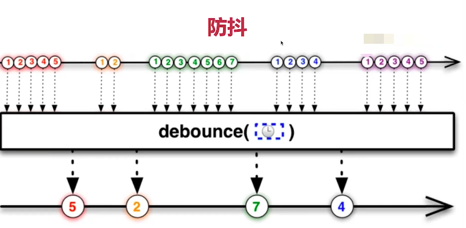
 :::tip
 **节流**
 - 节流，节省交互沟通。流，不一定指流量
 - 别急，一个一个来，按节奏来，插队者无效
 - 例如，drag或scroll 期间触发回调
 :::
 ```js
 // 节流
function throttle(fn, delay = 100) {
    let timer = null

    return function () {
        if (timer) {
            return
        }
        timer = setTimeout(() => {
            fn.apply(this, arguments)
            timer = null
        }, delay)
    }
}

div1.addEventListener('drag', throttle(function (e) {
    console.log(e.offsetX, e.offsetY)
}))

div1.addEventListener('drag', function(event) {

})

 ```
 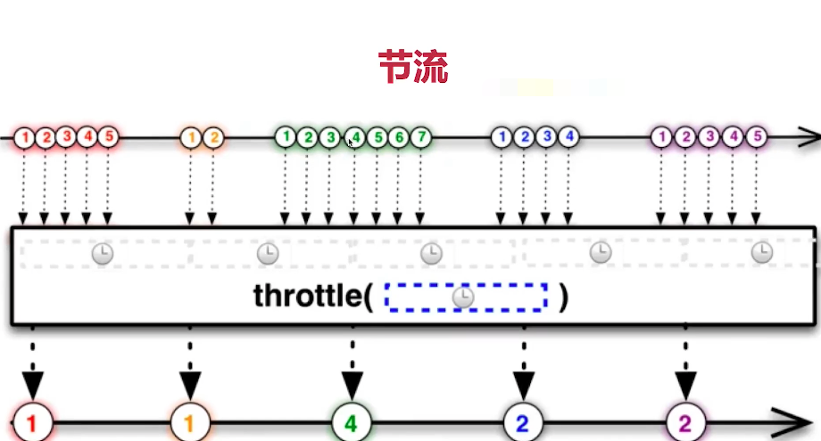

## px % em rem vw/vh 有什么区别
:::tip
- px基本单位，绝对单位（其他都是相对单位）
- vw屏幕宽度的1%
- vh屏幕高度的1%
- vmin 两者的最小值，vmax 两者的最大值
- em 相对于当前元素的font-size 
- rem 相对于跟节点的font-size 
:::
## 什么时候不能使用箭头函数
:::tip

**缺点**

- 改变不了this 
- 获取不到arguments

**不能使用的场景**

- 对象的方法 不能使用箭头函数
```js
     const obj = {
            name: '双越',
            getName: () => {
                return this.name
            }
        }
     const obj = {
            name: '双越',
            getName: (){
                return this.name
            }
        }    
```
- 原型方法不能使用箭头函数
```js
const obj = {
    name:'ljh'
}
obj.__proto__.getName: ()=>{
    return this.name
}
// obj.__proto__.getName = function(){
//     return this.name
// }
console.log(obj.getName())
```
- 构造函数 
```js
  class Foo {
        constructor(name, city) {
          this.name = name;
          this.city = city;
        }
        getName = () => {
          return this.name;
        };
      }
      const f = new Foo("ljh", "北京");
      console.log(f.getName());
```
- vue 生命周期和method
  - Vue 组件本质上是一个 JS 对象
  - React 组件（非 Hooks）它本质上是一个 ES6 class

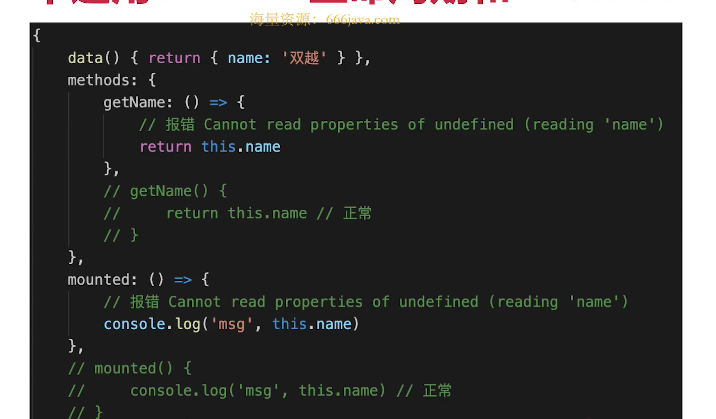

:::

## TCP三次握手和四次挥手 
:::tip
- 先建立连接（确保双方都有收发消息的能力）
  - client 发包，server 接收。server ：有client要找我
  - server 发包，client接收。client：server 已经接收消息
  - client 发包 ，server接收， server：client 要准备发送了 
- 在传输内容（如发送一个get请求）
- 网络连接TCP协议，传输内容是http协议
- 断开链接 
  - client 发包，server 接收。server ：client没有东西可以传输
  - serve 发包，client 接收。server ：ok
  - serve 发包，client 接收。server ：没有东西了
  - client 发包，server 接收。 serve 断开

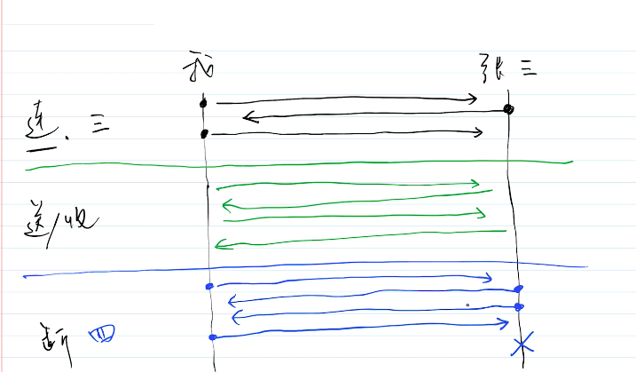  
:::

## http 为何需要缓存
:::tip
- 加载页面更快些 
- 减少网络请求数量
- 哪些资源可以被缓存？ -- 静态资源（js css img）
:::

## cache-control是什么意思 - http强制缓存

:::tip
- 在Response Headers 中
- 控制强制缓存的逻辑
- Cache-Control：max-age / no- cache / no-store / private / public
:::

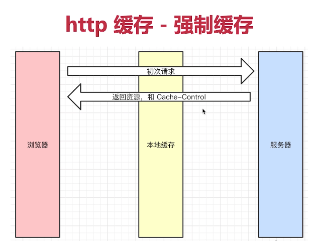

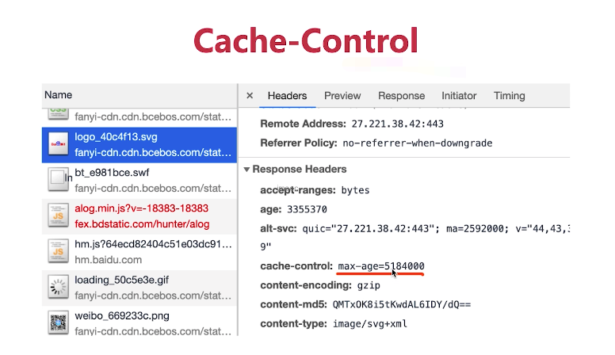

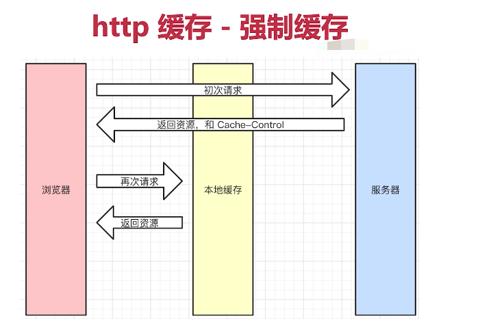

## Etag和Last-Modified是什么意思(对比缓存)

:::tip
- 服务端缓存策略
- 服务端判断客户端资源，是否和服务端资源一样
- 如果一致返回304，否则返回200和最新的资源
:::

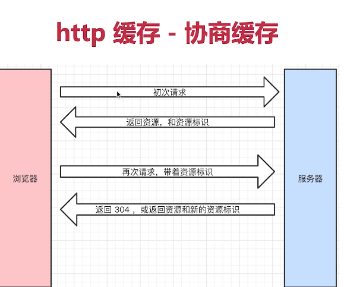
:::tip
**资源标识**
- 在Response Headers 中，有两种
  - Last- Modified资源最后修改时间

  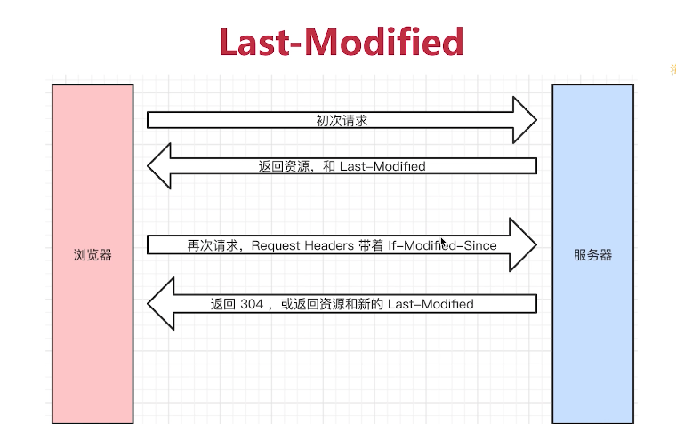

  - Etag 资源的唯一标识（一个字符串，类似人类的指纹）

  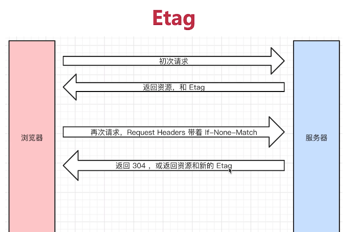
- 优先使用Etag
- Last-Modified只能精确到秒级
- 如果资源被重复生成，而内容不变，则etag更精确  
:::
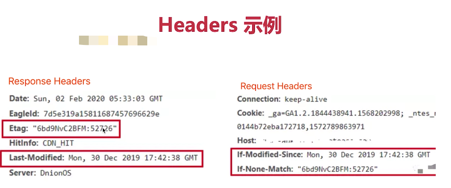
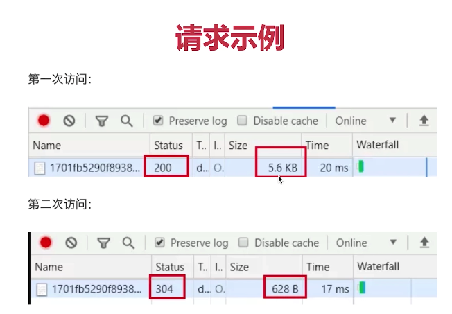
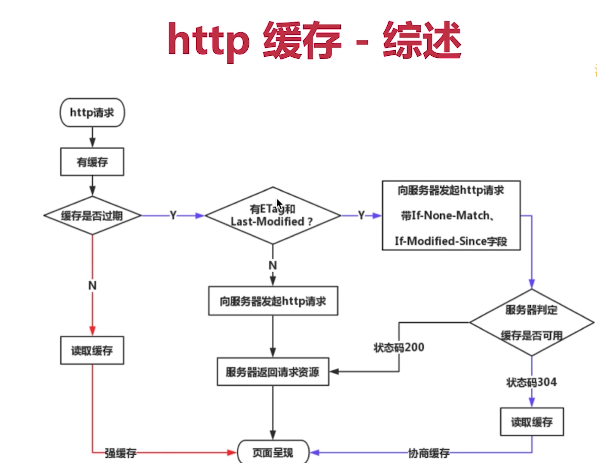
## for...in和for...of有什么区别
:::tip
- 遍历数组 字符串 
  - for...in 得到的是key
  - for...of 得到的是value 
- arguments
- 遍历对象：for...in可以，for...of 不可以
- 遍历Map Set：for...of 可以，for...in不可以
- 遍历generator：for...of可以， for...in 不可以
```js
     function fn() {
            for (let arg of arguments) {
                console.log(arg)
            }
        }
        fn(100, 200, 'aaa')
``` 
```js
const pList = document.querySelectorAll('p')
      for (let p of pList) {
          console.log(p)
      }

``` 
```js
  const obj = {
          name: '双越',
          city: '北京'
      }
      for (let val in obj) {
          console.log(val) 
      }

      const set = new Set([10, 20, 30])
      for (let n of set) {
          console.log(n)
      }

      const map = new Map([
          ['x', 100],
          ['y', 200],
          ['z', 300]
      ])
      for (let n of map) {
          console.log(n)
      }

      function* foo() {
          yield 10
          yield 20
          yield 30
      }
      for (let n of foo()) {
          console.log(n)
      }
```
:::

### 可枚举 VS 可迭代
:::tip
- for...in 用于可枚举数据，如对象，数组，字符串
- for...of 用于可迭代数据，如数组，字符串，Map Set
:::

## for await...of  有什么作用？
```html
<!DOCTYPE html>
<html lang="en">
<head>
    <meta charset="UTF-8">
    <meta http-equiv="X-UA-Compatible" content="IE=edge">
    <meta name="viewport" content="width=device-width, initial-scale=1.0">
    <title>for-await-of</title>
</head>
<body>
    <p>for await of</p>

    <script>
        function createPromise(val) {
            return new Promise((resolve) => {
                setTimeout(() => {
                    resolve(val)
                }, 1000)
            })
        }

        (async function () {
            // const p1 = createPromise(100)
            // const p2 = createPromise(200)
            // const p3 = createPromise(300)

            // // const res1 = await p1
            // // console.log(res1)
            // // const res2 = await p2
            // // console.log(res2)
            // // const res3 = await p3
            // // console.log(res3)

            // const list = [p1, p2, p3]
            // // Promise.all(list).then(res => console.log(res))
            // for await (let res of list) {
            //     console.log(res)
            // }

            // ---------------------- 分割线 ----------------------

            // const res1 = await createPromise(100)
            // console.log(res1)
            // const res2 = await createPromise(200)
            // console.log(res2)
            // const res3 = await createPromise(300)
            // console.log(res3)

            // const arr = [10, 20, 30]
            // for (let num of arr) {
            //     const res = await createPromise(num)
            //     console.log(res)
            // }
        })()
    </script>
</body>
</html>
```
## offsetHeight scrollHeight clientHeight
:::tip
- 计算规则
  - offetHeight offsetWidth：border+padding + content 
  - clientHeight clientWidth： padding + content 
  - scrollHeight scrollWidth： padding + 实际内容宽高
:::

```html
<!DOCTYPE html>
<html lang="en">
<head>
    <meta charset="UTF-8">
    <meta http-equiv="X-UA-Compatible" content="IE=edge">
    <meta name="viewport" content="width=device-width, initial-scale=1.0">
    <title>offsetHeight</title>
    <style>
        * {
            padding: 0;
            margin: 0;
        }

        body {
            background-color: #f1f1f1;
        }

        #container {
            width: 300px;
            height: 200px;
            padding: 20px;
            margin: 30px;
            border: 5px solid #ccc;
            box-sizing: border-box;
            overflow: auto;
            background-color: #fff;
        }
        #content {
            width: 600px;
            height: 500px;
            background-color: #f1f1f1;
            display: inline-block;
        }
    </style>
</head>
<body>
    <p>offsetHeight</p>

    <div id="container">
        <div id="content">
            <p>offsetHeight scrollHeight clientHeight 区别</p>
        </div>
    </div>

    <script>
        const container = document.getElementById('container')
        console.log('offsetHeight', container.offsetHeight)
        console.log('offsetWidth', container.offsetWidth)
        console.log('clientWidth', container.clientWidth)
        console.log('clientHeight', container.clientHeight)
        console.log('scrollWidth', container.scrollWidth)
        console.log('scrollHeight', container.scrollHeight)

        // scrollTop scrollLeft 需滚动之后获取
    </script>
</body>
</html>
```

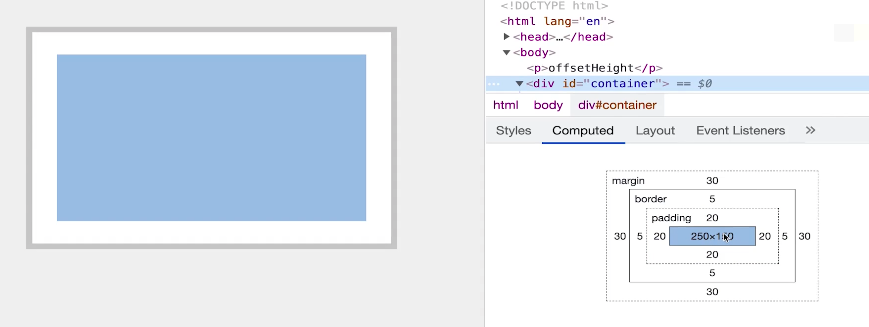

## HTMLCollection 和NodeList 区别
:::tip
- DOM是一棵树，所有节点都是Node
- Node是Element 的基类
- Element是其他HTML元素的基类，如HTMLDivElement
:::
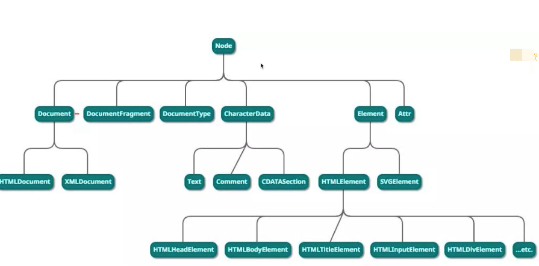
:::tip
- 获取Node和Element的返回结果可能不一样
- 如elem.childNodes 和elem.children 不一样
- 前者会包含Text 和Comment节点，后者不会
:::
### 类数组->数组
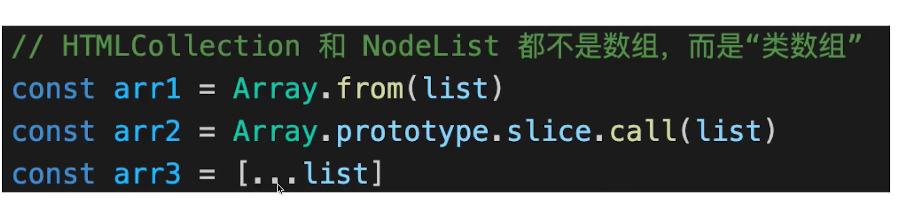

## vue中computed和watch 区别 
:::tip
- computed 用于计算产生新的数据
- watch 用于监听现有的数据
:::

```vue
<template>
    <p>watch and computed</p>
    <p>姓名：<input v-model="name"> 城市：<input v-model="city"></p>
    <p>个人信息：{{userInfo}}</p>
</template>

<script>
export default {
    data() {
        return {
            name: '双越',
            city: '北京'
        }
    },
    watch: {
        name(newValue, oldValue) {
            console.log('watch name', newValue, oldValue)
        }
    },
    computed: {
        userInfo() {
            // 有缓存
            return this.name + this.city
        }
    },
    methods: {
        getUserInfo() {
            // 无缓存
            return this.name + this.city
        }
    },
}
</script>
```
## vue组件通讯方式
:::tip
- props和$emit
```vue
<template>
  <div class="home">
    <HelloWorld msg="Welcome to Your Vue.js App" @showMsg="showMsg"/> 
  </div>
</template>
<script>
// import HelloWorld from '@/components/HelloWorld.vue'
import ErrorDemo from '@/components/ErrorDemo'

export default {
  name: 'Home',
  components: {
    HelloWorld,
   
  },
  methods: {
    showMsg(msg) {
      console.log(msg)
    }
  },
}
</script>

```
```vue
<template>
  <h1 @click="clickHandler">{{ msg }}</h1>
</template>

<script>
export default {
  name: 'HelloWorld',
  props: {
    msg: String
  },
  emits: ['showMsg'], // Vue3
  data() {
    return {
      name: 'hello-world'
    }
  },
  methods: {
    clickHandler() {
      this.$emit('showMsg', 'hello world')
    }
  },
}
</script>

```
- 自定义事件
```vue
<template>
  <p>receive custom event</p>
</template>

<script>
import event from '../utils/event.js'

export default {
  name: 'CustomEvent1',
  methods: {
    showMsg(msg) {
      console.log(msg)
    }
  },
  mounted() {
    event.on('showMsg', this.showMsg)
  },
  // Vue2.x beforeDestroy
  beforeUnmount() {
    event.off('showMsg', this.showMsg)
  },
}
</script>
```
```vue
<template>
  <p><button @click="trigger">trigger custom event</button></p>
</template>

<script>
import event from '../utils/event.js'

export default {
  name: 'CustomEvent2',
  methods: {
    trigger() {
      event.emit('showMsg', 'hello custom event')
    }
  },
}
</script>

```
- $attr
**Level1:**
```vue
<template>
    <p>Level1</p>
    <Level2
        :a="a"
        :b="b"
        :c="c"
        @getA="getA" 
        @getB="getB"
        @getC="getC"
    ></Level2>
</template>

<script>
import Level2 from './Level2'

export default {
    name: 'Level1',
    components: { Level2 },
    data() {
        return {
            a: 'aaa',
            b: 'bbb',
            c: 'ccc'
        }
    },
    methods: {
        getA() {
            return this.a
        },
        getB() {
            return this.b
        },
        getC() {
            return this.c
        }
    }
}
</script>
```
**Level2:**
```vue
<template>
    <p>Level2</p>
    <Level3
        :x="x"
        :y="y"
        :z="z"
        @getX="getX"
        @getY="getY"
        @getZ="getZ"
        v-bind="$attrs"
    ></Level3>
</template>

<script>
import Level3 from './Level3'

export default {
    name: 'Level2',
    components: { Level3 },
    props: ['a'],
    emits: ['getA'],
    data() {
        return {
            x: 'xxx',
            y: 'yyy',
            z: 'zzz'
        }
    },
    methods: {
        getX() {
            return this.x
        },
        getY() {
            return this.y
        },
        getZ() {
            return this.z
        }
    },
    created() {
        // console.log('level2', Object.keys(this.$attrs)) // 是 props 和 emits 后补
    },
}
</script>
```
**Level3:**
```vue
<template>
    <p>Level3</p>

    <HelloWorld msg="hello " ref="hello1"/>
</template>

<script>
import HelloWorld from '../HelloWorld'

export default {
    name: 'Level3',
    components: { HelloWorld },
    props: ['x'],
    emits: ['getX'],
    inheritAttrs: false,
    data() {
        return {
        }
    },
    created() {
        // console.log('level3', Object.keys(this.$attrs)) // 是 props 和 emits 后补
    },
    mounted() {
        // console.log(this.$parent.getX())
        console.log(this.$refs.hello1.name)
    },
}
</script>
```
- $parent
```vue
 mounted() {
        console.log(this.$parent.getX())
        <!-- console.log(this.$refs.hello1.name) -->
    },
```
- $refs
```vue
 mounted() {
        // console.log(this.$parent.getX())
        console.log(this.$refs.hello1.name)
    },
```
- provide/inject
**level1**
```vue
<template>
    <p>Level1: <input v-model="name"></p>

    <Level2></Level2>
</template>

<script>
import { computed } from 'vue'
import Level2 from './Level2'

export default {
    name: 'Level1',
    components: { Level2 },
    data() {
        return {
            name: '双越'
        }
    },
    // provide: {
    //     info: 'aaa'
    // }
    provide() {
        return {
            info: computed(() => this.name)
        }
    }
}
</script>
```
```vue
<template>
    <p>Level2 {{info.value}}</p>
    <Level3></Level3>
</template>

<script>
import Level3 from './Level3'

export default {
    name: 'Level2',
    components: { Level3 },
    inject: ['info']
}
</script>
```
**level3**
```vue
<template>
    <p>Level3 {{info.value}}</p>
</template>

<script>
export default {
    name: 'Level3',
    inject: ['info']
}
</script>
```
## vuex的mutation和action 
:::tip
- mutation:原子操作；必须同步代码
- action：可包含多个mutation；可包含异步代码
::: 

## js 严格模式有什么特点
:::tip
- 全局变量必须声明
- 禁止使用with
- 创建eval作用域
- 禁止this 指向window 严格模式下undefined
:::
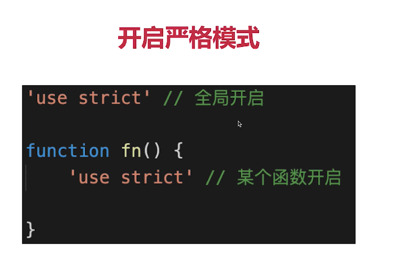


## js内存垃圾回收用什么算法？
:::tip
- 什么是垃圾回收？
  - 回收哪些函数被执行了，再也用不上了函数或变量
- 引用计数（之前） 
- 标记清除（现在）
- 闭包不是内存泄露，闭包的数据是不会被垃圾回收的
- 闭包内存泄露如何检测？场景有哪些
```js
 function fn1() {
        const a = 'aa'
        console.log(a)

        const obj = { x: 100 }
        console.log(obj)
    }
    fn1()

    function fn2() {
        const obj = { x: 100 }
        window.obj = obj
    }
    fn2()

    function getDataFns() {
        const data = {} // 闭包
        return {
            get(key) {
                return data[key]
            },
            set(key, value) {
                data[key] = value
            }
        }
    }
    const { get, set } = getDataFns()
    set('x', 100)
    get('x')

    // 对象被 a 引用
    let a = { x: 100 }
    let a1 = a
    a = 10
    a1 = null
     // 循环引用
    function fn3() {
        const obj1 = {}
        const obj2 = {}
        obj1.a = obj2
        obj2.a = obj1
    }
    fn3()
```
:::
## 内存泄漏的场景（vue为例）
:::tip
- 被全局变量、函数引用，组件销毁时未清除
```vue
<template>
  <p>Memory Leak Demo</p>
</template>

<script>
export default {
  name: "Memory Leak Demo",
  data() {
    return {
      arr: [10, 20, 30], // 数组 对象
    };
  },
  methods: {
    printArr() {
      console.log(this.arr);
    },
  },
  mounted() {
    window.arr = [1,2,3,4,4,5]
    // 自定义事件也是这样
  },
  // Vue2 - beforeDestroy
  beforeUnmount() {
    window.arr = null
  },
};
</script>
```
- 被全局事件、定时器引用，组件销毁时未清除
```vue
<template>
  <p>Memory Leak Demo</p>
</template>

<script>
export default {
  name: "Memory Leak Demo",
  data() {
    return {
      arr: [10, 20, 30], // 数组 对象
      intervalId:0
    };
  },
  methods: {
    printArr() {
      console.log(this.arr);
    },
  },
  mounted() {
    window.addEventListener("resize", this.printArr);
    this.intervalId = setInterval(()=>{
        console.log(this.arr)
    },100)
    // 自定义事件也是这样
  },
  // Vue2 - beforeDestroy
  beforeUnmount() {
    window.removeEventListener("resize", this.printArr);
    if(intervalId){
        clearInterVal(this.intervalId)
    }
  },
};
</script>

```
- 被自定义事件引用，组件销毁时未清除
```vue
<template>
  <p>receive custom event</p>
</template>

<script>
import event from '../utils/event.js'

export default {
  name: 'CustomEvent1',
  methods: {
    showMsg(msg) {
      console.log(msg)
    }
  },
  mounted() {
    event.on('showMsg', this.showMsg)
  },
  // Vue2.x beforeDestroy
  beforeUnmount() {
    event.off('showMsg', this.showMsg)
  },
}
</script>
```
:::
## 宏任务和微任务
:::tip
- 宏任务，如setTimeout setInterval网络请求
- 微任务，如promise async/await
- 微任务在下一轮DOM渲染之前执行，宏任务在之后执行
:::
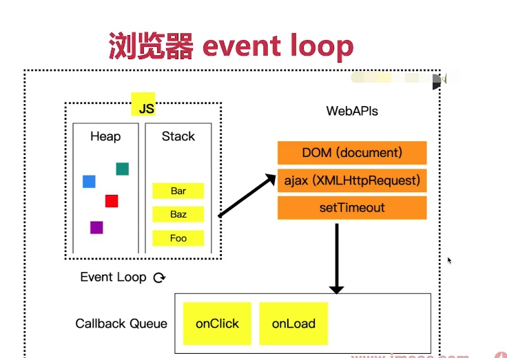
## nodejs异步
:::tip
- Nodejs同样使用ES语法，也是单线程，也需要异步
- 异步任务也分：宏任务+微任务
- 但是，它的宏任务和微任务，分不同类型，有不同优先级
:::
```js
// console.info('index')

console.info("start");
setImmediate(() => {
  console.info("setImmediate");
});
setTimeout(() => {
  console.info("timeout");
});
Promise.resolve().then(() => {
  console.info("promise then");
});
process.nextTick(() => {
  console.info("nextTick");
});
console.info("end");
//  start end nextTick promise then  timeout setImmediate
```
### Nodejs宏任务类型和优先级
```js
- Timers - setTimeout setInterval
- I/O callback - 处理网路、流 TCP 的错误回调
- Idle，prepare - 闲置状态 
- Pol轮询-执行pol川中的/O队列
- Check检查-存储setlmmediate回调
- Close callbacks-关闭回调，如socket..on('close')
```
### nodejs微任务类型和优先级
```js
- 包括：promise,async/await,process.nextTick
- 注意，process..nextTick优先级最高
```
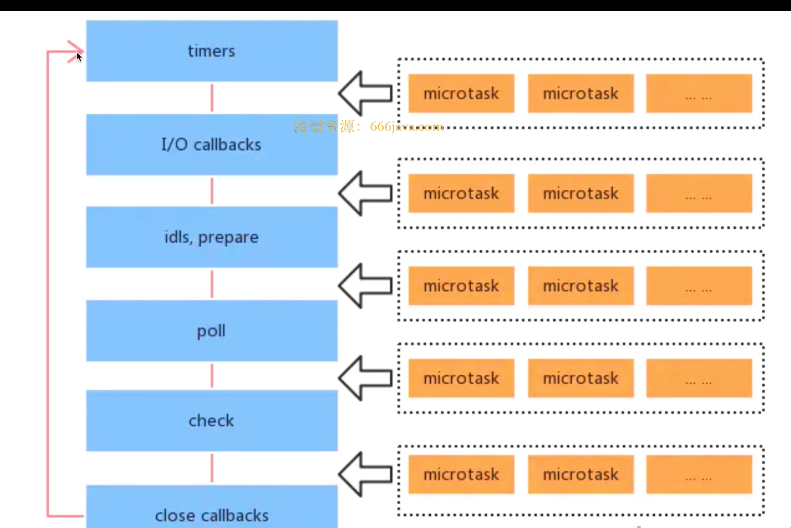

### vdom真的很快吗？
:::tip
- 虚拟dom
- 用js对象 模拟DOM节点数据
- 有react最新推广使用
  - 组件化
  - 数据视图分离，数据驱动视图  
    - data变化
    - diff算法 vnode oldvnode  
    - 更新dom 
:::


## js Bridge 
:::tip
- js无法直接调用native API
- 需要通过一些特定格式(URL scheme)来调用
- 这个格式统称为js-bridge ，例如微信sdk
:::
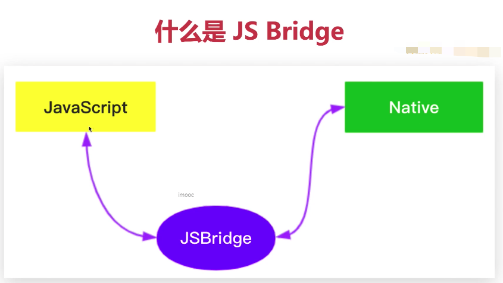
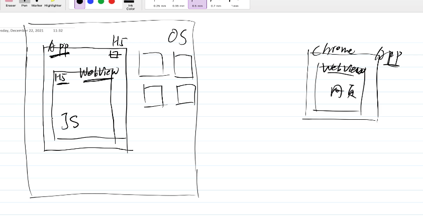
```js
      // 封装 JS-bridge
        const sdk = {
            invoke(url, data = {}, onSuccess, onError) {
                const iframe = document.createElement('iframe')
                iframe.style.visibility = 'hidden'
                document.body.appendChild(iframe)
                iframe.onload = () => {
                    const content = iframe1.contentWindow.document.body.innerHTML
                    onSuccess(JSON.parse(content))
                    iframe.remove()
                }
                iframe.onerror = () => {
                    onError()
                    iframe.remove()
                }
                iframe.src = `my-app-name://${url}?data=${JSON.stringify(data)}`
            },
            fn1(data, onSuccess, onError) {
                this.invoke('api/fn1', data, onSuccess, onError)
            },
            fn2(data, onSuccess, onError) {
                this.invoke('api/fn2', data, onSuccess, onError)
            },
            fn3(data, onSuccess, onError) {
                this.invoke('api/fn3', data, onSuccess, onError)
            },
        }
  
```
```text
答案：
jsBridge是一种在 Web 开发中常用的技术，通常指的是 JavaScript Bridge 的缩写，它是一种在 Web 视图（如 WebView）和原生应用之间进行通信的机制。jsBridge 使得原生代码（如 Android 的 Java/Kotlin 或 iOS 的 Objective-C/Swift）能够与嵌入到 WebView 中的 JavaScript 代码相互调用和通信。
在具体实现上，jsBridge 的原理可能因平台而异，但大致的原理如下：

从 JavaScript 调用原生代码：
注册原生函数：首先，原生应用会在 WebView 中注册一些可以供 JavaScript 调用的方法或函数。
调用原生函数：然后，JavaScript 可以通过特定的接口调用这些注册的原生方法。这通常是通过注入对象（例如，在 Android 中可以使用addJavascriptInterface方法）或监听特定的 URL scheme。
消息传递：当 JavaScript 需要与原生应用通信时，它会发送消息（或调用方法），这个消息包含必要的指令和数据。
原生处理：原生代码接收到这个消息后，会执行对应的指令，并将结果返回给 JavaScript（如果需要）。

从原生代码调用 JavaScript：
执行 JavaScript 代码：原生应用可以执行 WebView 中的 JavaScript 代码。例如，通过 WebView 的evaluateJavaScript（iOS）或loadUrl("javascript:...")（Android）方法。
回调 JavaScript：原生应用还可以通过执行回调函数的方式，将数据或结果传递回 JavaScript。

jsBridge 在移动应用开发中尤为重要，因为它提供了一种方式来整合 Web 技术和原生应用功能，让开发者能够利用 Web 技术来编写跨平台的应用，同时还能够访问设备的原生功能，如相机、GPS 等。
这种机制特别适合于混合应用的开发，在这些应用中，部分界面和逻辑使用 Web 技术实现，而另一部分则利用原生代码以获取更好的性能和更丰富的设备功能支持。通过 jsBridge，两种不同的代码和技术可以互相协作，提供统一的用户体验。
```
## 是否了解过requestldleCallback? 和requestAnimationFrame有什么区别？
### 由React fiber引起的关注
:::tip
- 组建树转换为链表，可分段渲染
- 渲染时可以暂停，去执行其他高优任务，空闲时再继续渲染
- 如何判断空闲？一requestidleCallback
:::
### 区别
:::tip
- requestAnimationFrame每次渲染完都会执行，高优(每秒60帧)
- requestIdleCallback空闲时才执行，低优
- 都是宏任务 
:::
```js
<script>
        const box = document.getElementById('box')
        
        document.getElementById('btn1').addEventListener('click', () => {
            let curWidth = 100
            const maxWidth = 400

            function addWidth() {
                curWidth = curWidth + 3
                box.style.width = `${curWidth}px`
                if (curWidth < maxWidth) {
                    window.requestAnimationFrame(addWidth) // 时间不用自己控制
                }
            }
            addWidth()
        })
    </script>
```
```js
  window.onload = () => {
            console.info('start')
            setTimeout(() => {
                console.info('timeout')
            })
            window.requestIdleCallback(() => {
                console.info('requestIdleCallback')
            })
            window.requestAnimationFrame(() => {
                console.info('requestAnimationFrame')
            })
            console.info('end')
        } // start end timeout  requestAnimationFrame requestIdleCallback
         
```

## vue声明周期都做了什么 
### beforeCreate
:::tip
- 创建一个空白的vue实例
- data method 尚未被初始化，不可使用
:::
### created 
:::tip
- Vue实例初始化完成，完成响应式绑定
- data method都已经初始化完成，可调用
- 尚未开始渲染模版
:::
### beforeMount 
:::tip
- 编译模板，调用render生成vdom
- 还没有开始渲染DOM
:::
### mounted
:::tip
- 完成DOM渲染
- 组件创建完成
- 开始有‘创建阶段’进入‘运行阶段’
:::
### beforeUpdate
:::tip
- data发生变化之后
- 准备更新DOM(尚未更新DOM)
:::
### update
:::tip 
- data发生变化，且DOM更新完成
- (不要在updated中修改data,可能会导致死循环)
:::
### beforeUnmount
:::tip
- 组件进入销毁阶段（尚未销毁，可正常使用）
- 可移除、解绑一些全局事件、自定义事件
:::
### unmounted
:::tip
- 组件被销毁了
- 所有子组件也都被销毁了
:::

### keep-alive 
:::tip
- creaded
- activated
- deactivated
:::
### Vue什么时候操作DOM比较合适
:::tip
- mounted和updated都不能保证子组件全部挂载完成
- 使用$nextTick渲染DOM
:::
### Ajax 放在那个生命周期
:::tip
created
mounted
:::
### vue3 composition API 生命周期有何区别
:::tip
- 用setup代替了beforeCreate和created
- 使用Hooks函数的形式，如mounted改为onMounted()
:::
### vue2 vue3 React 三者diff算法的有何区别
**react 尽右移**
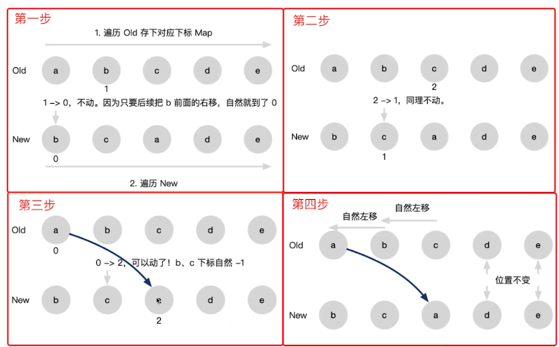
**vue2双端比较**
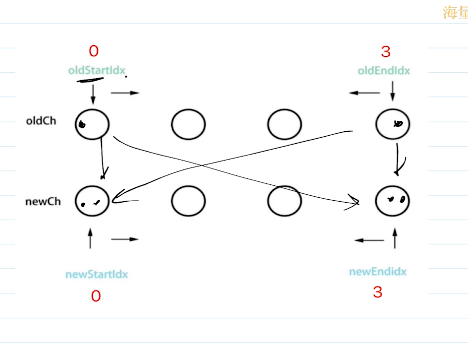

**最长递增子序列**
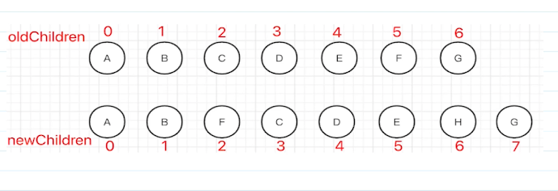
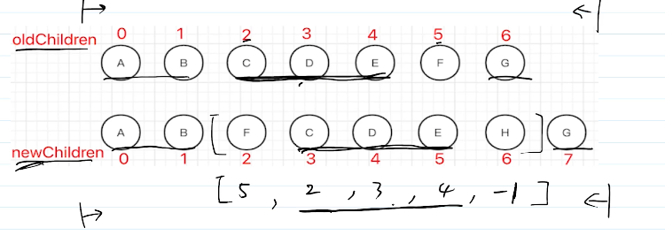

### vue-router 
:::tip
- Hash
- WebHistory
- MemoryHistory(V4之前叫做abstract history)
:::
### 移动端300ms延迟，如何解决？
:::tip
◆背景：double tap to zoom
◆FastClick
◆vidth=device-width
:::
## cookie和 token 区别 
### cookie
:::tip
- HTTP无状态，每次请求都要带cookie,以帮助识别身份
- 服务端也可以向客户端set-cookie,cookie大小限制4kb
- 默认有跨域限制：不可跨域共享、传递cookie
:::
### cookie本地存储
:::tip
- HTML5之前cookie常被用于本地存储
- HTML5之后推荐使用localStorage和sessionStorage
:::
### 现代浏览器开始禁止第三方cookie
:::tip
- 和跨域限制不同。这里是：禁止网页引入的第三方S设置cookie
- 打击第三方广告，保护用户隐私
- 新增属性SameSite::Strict/Lax/None;值可自己选择
:::
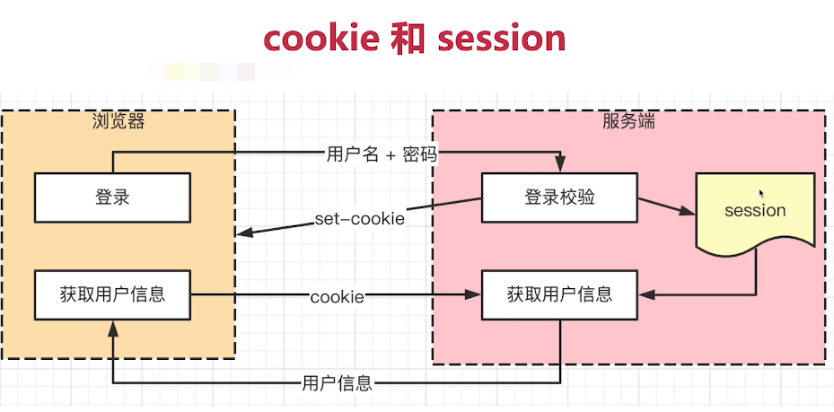
### token vs cookie
:::tip
- cookie是HTTP规范，而token是自定义传递
- cookie会默认被浏览器存储，而token需自己存储
- token 默认没有跨域限制 

:::
### JWT （JSON Web Token）
:::tip
- 前端发起登录，后端验证成功之后，返回一个加密的token
- 前端自行存储这个token（其中包含了用户信息，加密了)
- 以后访问服务端接口，都带着这个token,作为用户信息
:::

## 四合院 
```html
<!DOCTYPE html>
<html lang="en">
<head>
    <meta charset="UTF-8">
    <meta http-equiv="X-UA-Compatible" content="IE=edge">
    <meta name="viewport" content="width=device-width, initial-scale=1.0">
    <title>CSS 四合院</title>
    <style>
        html * {
            margin: 0;
            padding: 0;
        }
        html {
            height: 100%;
        }
        body {
            display: flex;
            flex-direction: column;
            height: 100%;
        }
        #header {
            height: 50px;
            background-color: red;
        }
        #container {
            flex: 1;
            display: flex;
        }
        #left-container {
            width: 100px;
            background-color: green;
        }
        #main-container {
            flex: 1;
            background-color: #ccc;
        }
        #right-container {
            width: 200px;
            background-color: yellow;
        }
        #footer {
            height: 50px;
            background-color: blue;
        }
    </style>
</head>
<body>
    <!-- HTML5 标签 语义化 -->
    <header id="header">
        header
    </header>
    <section id="container">
        <aside id="left-container">left</aside>
        <section id="main-container">main</section> <!-- 或者用 article ，看用途 -->
        <aside id="right-container">right</aside> <!-- 或者用 section ，看用途 -->
    </section>
    <footer id="footer">
        footer
    </footer>
</body>
</html>
```
## 黑白主题切换 （calc）
```css
html {
    --background-color: white;
    --text-color: black;
}
html.black {
   --background-color: black;
    --text-color: white; 
}

body {
    background-color: var(--background-color);
    color: var(--text-color);
    font-family: Arial, sans-serif;
    margin: 0;
    padding: 20px;
    transition: background-color 0.3s, color 0.3s;
}

```
## Map 和 Set 和Object 和Array  
:::tip
- Map 有序结构，key任意类型；Object无序结构，key两种类型 
- set 可以自动去重 
- Map 和Set 比Object 和Array 整体执行要快 
:::
## useState
```jsx
function useStateDemo() {
    const [value, setValue] = useState(100)

    function clickHandler() {
        // // 1. 传入常量，state 会合并
        // setValue(value + 1)
        // setValue(value + 1)
        // console.log(1, value) // 100
        // // 2. 传入函数，state 不会合并
        // setValue(value => value + 1)
        // setValue(value => value + 1)
        // console.log(2, value) // 100

        // 3. setTimeout 中，React18 开始也会合并 state （之前版本会同步更新，不合并）
        setTimeout(() => {
            setValue(value + 1)
            setValue(value + 1)
            console.log(1, value) // 100

            setValue(value + 1)
            setValue(value + 1)
            console.log(2, value) // 100
        })

        // // 4. 同理 setTimeout 中，传入函数，state 也不会合并
        // setTimeout(() => {
        //     setValue(value => value + 1)
        //     setValue(value => value + 1)
        //     console.log(1, value)
        // })
    }

    useEffect(() => {
        // 自绑定 DOM 事件，React18 开始也会合并 state（之前版本会同步更新，不合并）
        document.getElementById('btn2').addEventListener('click', () => {
            setValue(value + 1)
            setValue(value + 1)
            console.log(1, value)
        })
    })

    return <div>
        <span>{value}</span>
        <button onClick={clickHandler}>increase1</button>
        <button id="btn2">increase2</button>
    </div>
}

```
## HeartBeat

```jsx
function HeartBeat() {
    useEffect(() => {
        let timer = 0
        function fn() {
            console.log('hello')
            timer = setTimeout(fn, 1000) // “心跳”尽量避免使用 setInterval ，有坑
        }
        timer = setTimeout(fn, 1000)

        return () => {
            clearTimeout(timer) // 组件销毁时，一定清除定时器
        }
    })

    return <p>心跳</p>
}
```
## 普通函数和箭头函数this
```js
const obj = {
    f1(){
        console.log(121212)
        const fn = () => {console.log('this',this)}
        fn()
        fn.call(window)
    },
    f2:()=>{
        function fn(){console.log('this2',this)}
        fn()
        fn.call()
    }
}
obj.f1()
obj.f2()
```
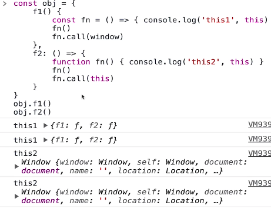
```js
class Foo{
f1(){console.log(this,'this1')}
f2 =()=>{console.log('this2',this)}
f3 =()=>{console.log('this3',this)}
static f4(){console.log('this4',this)}
}

const f = new Foo()
f.f1()
f.f2()
f.f3.call(this)
Foo.f4()
```
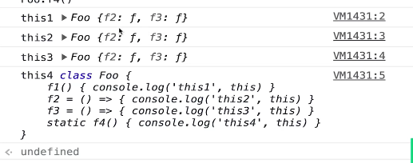
## js异步
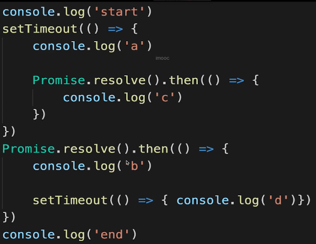

// start end b  a c d

## js 垃圾回收 
:::tip
- js垃圾回收算法 - 标记清除
- WeakMap 和weakSet 场景 - 想临时记录数据或关系
- 栈溢出：例如递归次数太多，导致stack overflow  
:::
## 自定义v-model
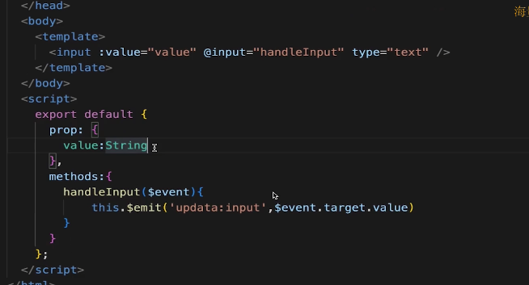
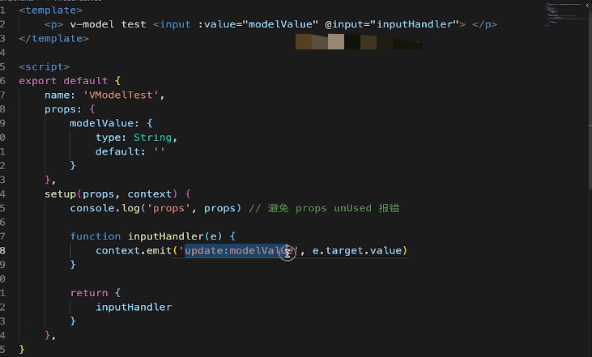

## vue 心跳 
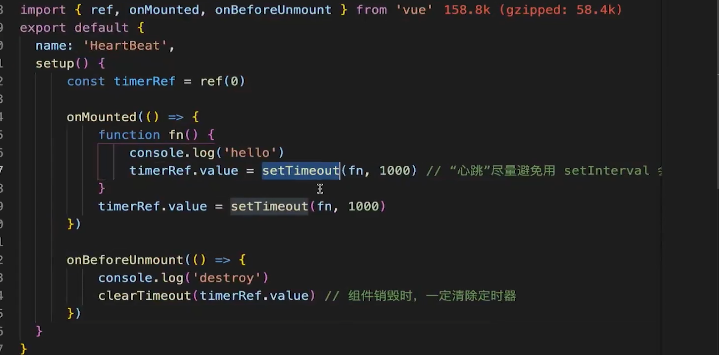

## useLocation
```js
import { reactive, onMounted, toRefs } from 'vue'

// 模拟异步获取
function getLocation(fail) {
    return new Promise((resolve) => {
        setTimeout(() => {
            if (fail) {
                // 模拟失败
                resolve({ errno: 1, msg: fail })
            } else {
                // 模拟成功
                resolve({ errno: 0, data: { x: 100, y: 200 } })
            }
        }, 1000)
    })
}

function useLocation() {
    const info = reactive({
        isLoading: true,
        data: {},
        errMsg: ''
    })

    onMounted(async () => {
        const res = await getLocation() // 成功
        // const res = await getLocation('失败信息') // 失败
        if (res.errno === 0) {
            info.data = res.data
        } else {
            info.errMsg = res.msg
        }
        info.isLoading = false
    })

    return toRefs(info)
}

export default useLocation

```
## js队列  

栈：入栈 出栈 - 先进后出
队列： 入队 出队 - 先进先出 
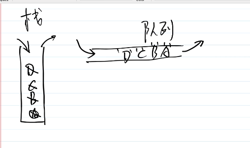
## 数格子 
```js
   function getPaths(m, n) {
            // m * n 二维数组，模拟网格
            const map = new Array(m)
            for (let i = 0; i < m; i++) {
                map[i] = new Array(n)
            }

            // 如果只走第一行，就只有一条路径。所以第一行所有 item 都填充 1
            map[0].fill(1)

            // 如果只走第一列，也只有一条路径。所以第一列所有 item 都填充 1
            for (let i = 0; i < m; i++) {
                map[i][0] = 1
            }

            // 其他 item ，根据这个公式 map[i][j] = map[i - 1][j] + map[i][j - 1]
            // 如走到 [5, 4] 的路径数，就是 [4, 4] 和 [5, 3] 路径数的总和 —— 动态规划的思想
            // 注意：i 和 j 都从 1 开始 ！！！ 因为 0 位置已经被上文赋值为了
            for (let i = 1; i < m; i++) {
                for (let j = 1; j < n; j++) {
                    map[i][j] = map[i - 1][j] + map[i][j - 1]
                }
            }

            // 返回 finish 节点的路径数
            return map[m - 1][n - 1]
        }

        console.log('paths', getPaths(5, 4))
```
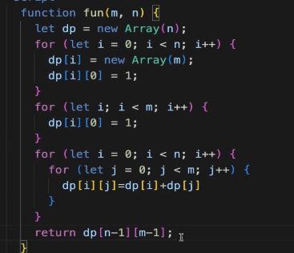

## reactive Effect 函数实现 

```js
  const fns = new Set()

        function reactive(obj) {
            return new Proxy(obj, {
                get(target, key) {
                    if (activeFn) fns.add(activeFn)
                    return target[key]

                    // // obj 嵌套属性
                    // const val = target[key]
                    // if (typeof val === 'object' && val != null) { // 只考虑 object ，其他未考虑
                    //     return reactive(val) // 直接返回一个 Proxy 对象即可
                    // } else {
                    //     return val
                    // }
                },
                set(target, key, newVal) {
                    target[key] = newVal
                    fns.forEach(fn => fn())
                    return true
                }
            })
        }

        let activeFn
        function effect(fn) {
            activeFn = fn
            fn() // 执行一次，触发 proxy get
        }

        const user = reactive({ name: '双越' })
        effect(() => {
            console.log('name', user.name)
        })
        user.name = '张三'
        setTimeout(() => {
            user.name = '李四'
        }, 1000)

        // // obj 嵌套属性
        // const user = reactive({ name: '双越', info: { city: '北京' } })
        // effect(() => {
        //     console.log('city', user.info.city)
        // })
        // user.info.city = '上海'
        // setTimeout(() => {
        //     user.info.city = '杭州'
        // }, 1000)
```

## vue3比vue2 diff 有什么变化 
:::tip
- vue2 updatechildren 双端比较
- vue3 updateChildren 增加了‘最长递增子序列’(更快)
- vue3 增加了patchflag 静态提升 函数缓存
:::

## 从0搭建项目环境，需要考虑什么？
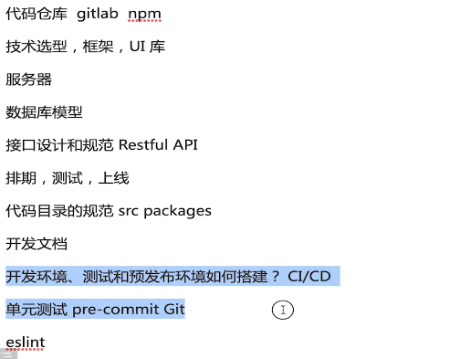
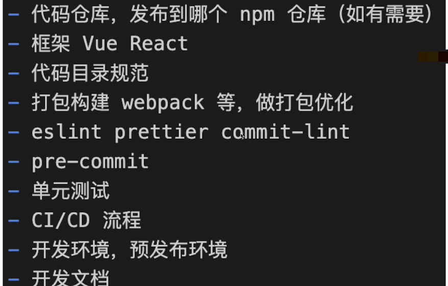

## block inline inline-block
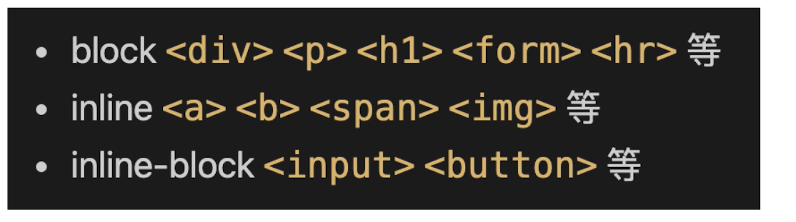
```text
Block（块级元素）:

    块级元素总是在新的行上开始，其后的元素也会在新行上开始。
    它们通常会占据其父元素（容器）的全部宽度，除非指定了宽度。
    可以设置宽度和高度。
    常见的块级元素有 <div>、<p>、<h1>-<h6>、<ul>、<ol> 等。
Inline（内联元素）:

    内联元素不会导致文本换行；它们通常出现在句子或段落中，与其他元素在同一行。
    宽度和高度的设置对内联元素不生效，内联元素的大小由其内容决定。
    margin 和 padding 在垂直方向上（上下）可能不会有任何效果。
    常见的内联元素有 <span>、<a>、、<strong> 和 <em> 等。
Inline-block（内联块元素）:

    内联块元素结合了内联元素和块级元素的特性。它们像内联元素一样不会导致换行，但它们可以设置宽度和高度。
    内联块元素在一行中显示，除非空间不足以容纳它们，这种情况下会换行。
    对于内联块元素，margin 和 padding 在四个方向上都会显示效果。
    示例包括通过设置 display: inline-block 对任何元素应用这种类型。
```
## 水平垂直居中
```html
<!DOCTYPE html>
<html lang="en">
<head>
    <meta charset="UTF-8">
    <meta http-equiv="X-UA-Compatible" content="IE=edge">
    <meta name="viewport" content="width=device-width, initial-scale=1.0">
    <title>CSS 居中</title>
    <style>
        #container {
            width: 500px;
            height: 500px;
            background-color: #999;
        }
        #box {
            width: 300px;
            height: 300px;
            background-color: red;
        }

        /* 1. 定位 + translate
        #container {
            position: relative;
        }
        #box {
            position: absolute;
            left: 50%;
            top: 50%;
            transform: translate(-50%,-50%);
        } */

        
        /* 2. 定位 + margin: auto
        #container {
            position: relative;
        }
        #box {
            position: absolute;
            left: 0;
            right: 0;
            top: 0;
            bottom: 0;
            margin: auto;
        } */

        /* 3. 使用 flex
        #container {
            display: flex;
            justify-content: center;
            align-items:center;
        } */

    </style>
</head>
<body>
    <div id="container">
        <div id="box"></div>
    </div>
</body>
</html>
```
## HTTP和UDP 协议有什么区别？
:::tip
- HTTP协议在应用层
- TCP UDP协议再传输层
  - UDP
    - 无链接，无断开
    - 不稳定传输，但效率高
- 严格来说，应该拿TCP和UDP进行比较
:::
HTTP是应用层，TCP UDP是传输层
TCP有连接，有断开，稳定传输
UDP无连接，无断开，不稳定传输，但效率高

## HTTP1.0 和1.1和2.0区别
:::tip
- 1.1

  ◆缓存策略cache-control E-tag等

  ◆支持长连接Connection:keep-alive,一次TCP连接多次请求

  ◆断点续传，状态码206

  ◆支持新的方法PUT DELETE等，可用于Restful API

- 2.0
    
  ◆可压缩header,减少体积

  ◆多路复用，一次TCP连接中可以多个HTTP并行请求
   
  ◆服务端推送

:::

## 什么是HTTPS中间人攻击？如何预防？

:::tip

- HTTP是明文传输

- HTTPS加密传输 HTTP + TLS/SSL

:::

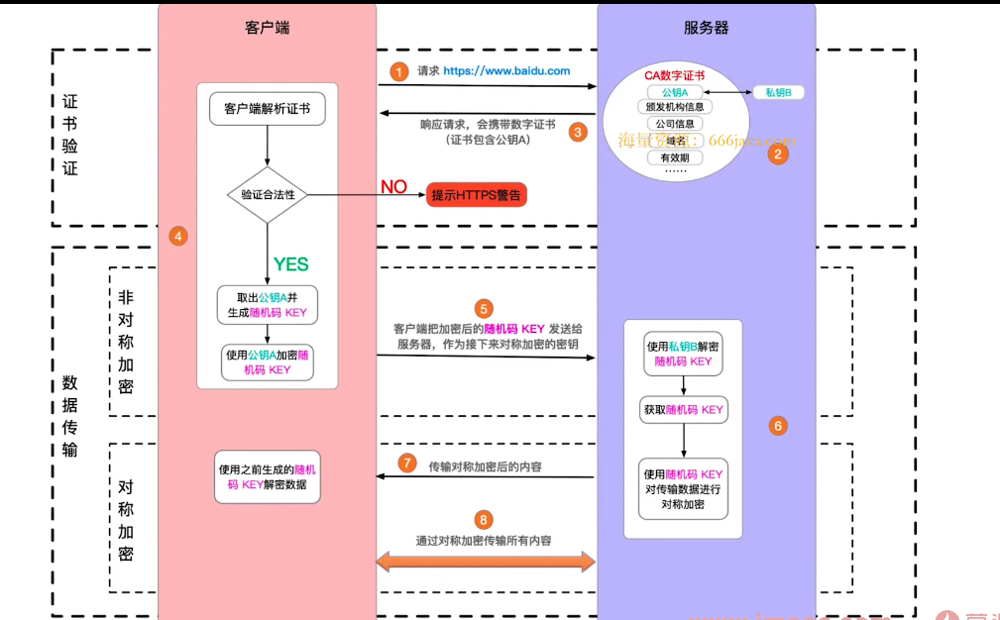

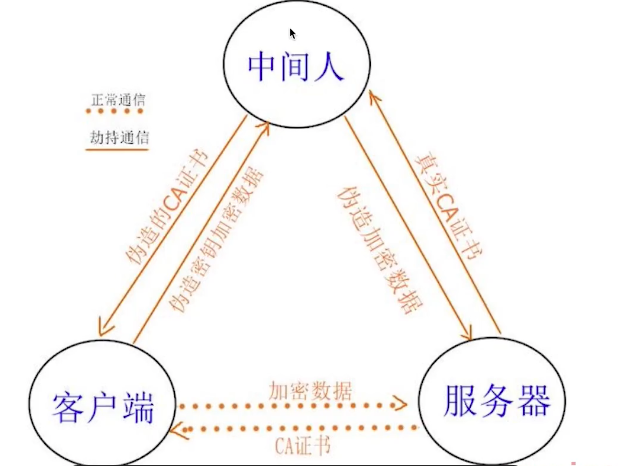

## script的defer和async 有什么区别

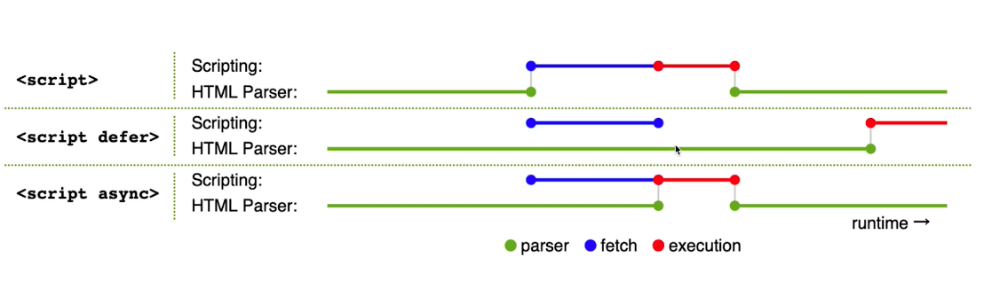

:::tip

- ◆无：HTML暂停解析，下载S,执行S,再继续解析HTM

- ◆defer:HTML继续解析，并行下载S,HTML解析完再执行JS

- ◆async:HTML继续解析，并行下载S,执行JS,再解析HTML

:::

## 连环问：prefetch和dns-prefetch有什么区别？

### preload和prefetch

:::tip

- preload资源在当前页面使用，会优先加载

- prefetch资源在未来页面使用，空闲时加载

:::

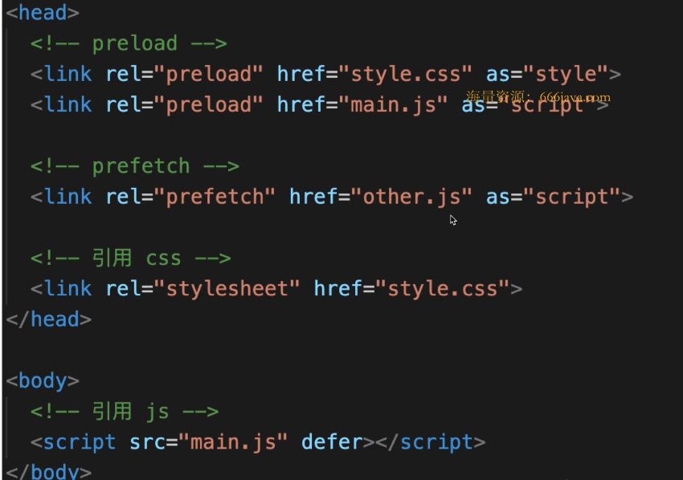

### dns-prefetch preconnet

:::tip
 - ◆dns-prefetch即DNS预查询

 - ◆preconnect即DNS预连接

 - ◆prefetch是资源预获取（和preload相关）

 - ◆dns-prefetch是DNS预查询（和preconnect相关

:::

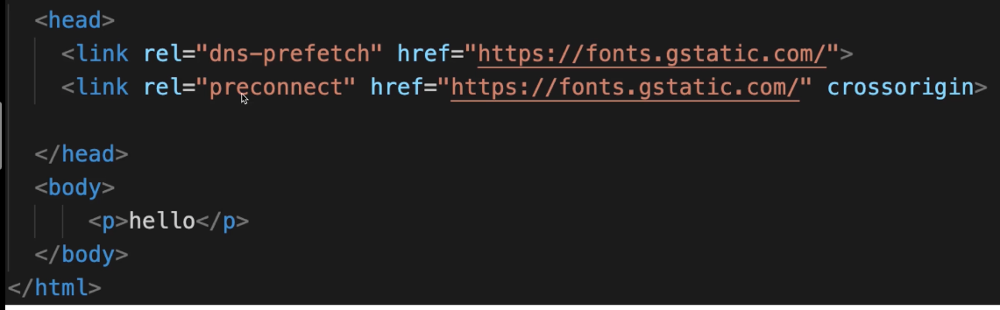

## 前端攻击？如何预防

### 如何预防xss攻击

:::tip
- Cross Site Script跨站脚本攻击

- 手段：黑客将S代码插入到网页内容中，渲染时执行JS代码

- 预防：特殊字符替换（前端或者后端）
:::

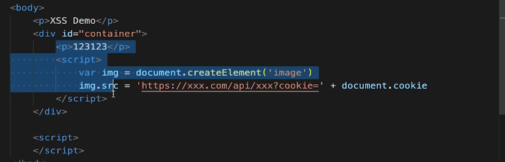

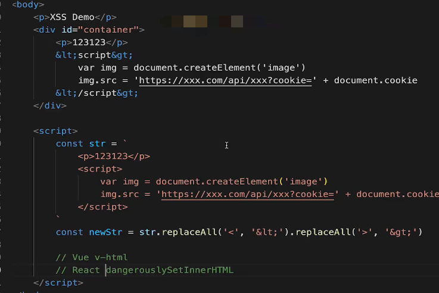

### 如何预防csrf攻击

:::tip

- ◆Cross Site Request Forgery跨站请求伪造

- ◆手段：黑客诱导用户去访问另一个网站的接口，伪造请求

- ◆预防：严格的跨域限制+验证码机制

:::

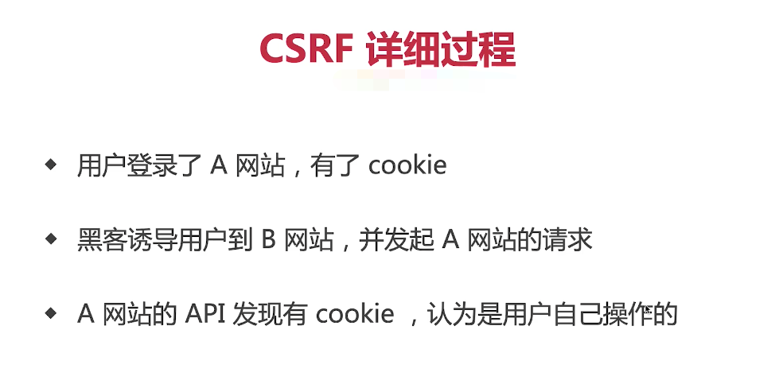

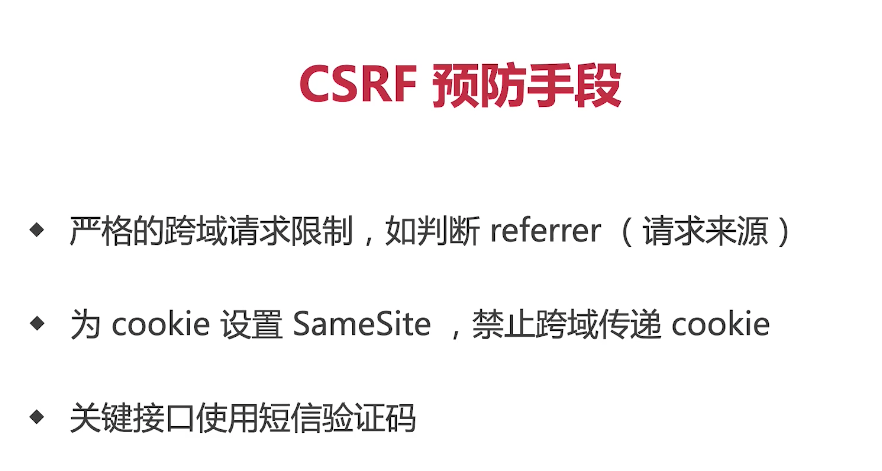

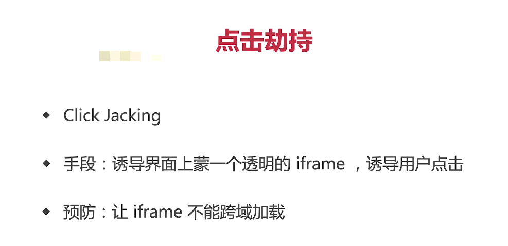

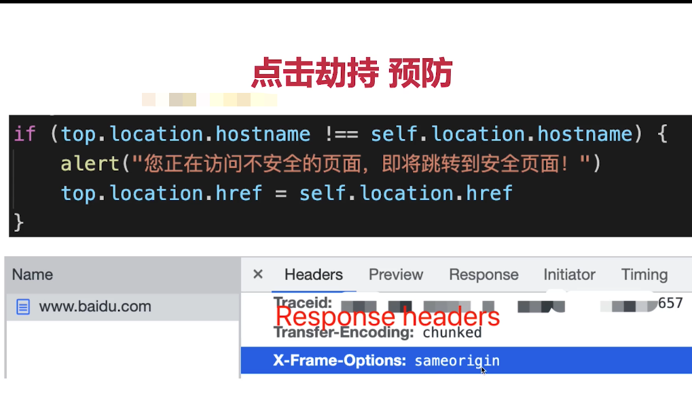

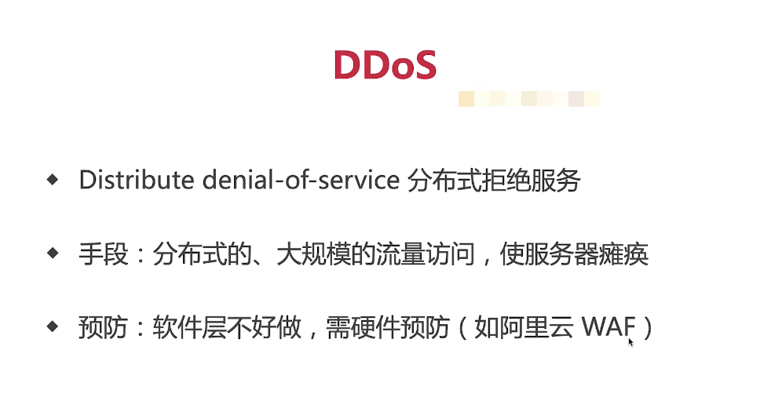

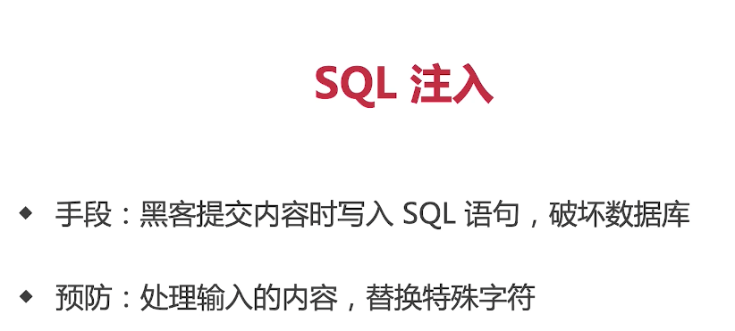

## webSocket和Http区别？

:::tip

- 支持端对端通讯

- 可以由client发起，也可以由server发起

- 用于：消息通知，直播间讨论区，聊天室，协同编辑

:::

```html
<!DOCTYPE html>
<html lang="en">
<head>
    <meta charset="UTF-8">
    <meta http-equiv="X-UA-Compatible" content="IE=edge">
    <meta name="viewport" content="width=device-width, initial-scale=1.0">
    <title>websocket</title>
</head>
<body>
    <p>websocket</p>
    <button id="btn-send">发送消息</button>

    <script>
        const ws = new WebSocket('ws://127.0.0.1:3000')
        ws.onopen = () => {
            console.info('opened')
            ws.send('client opened')
        }
        ws.onmessage = event => {
            console.info('收到了信息', event.data)
        }

        const btnSend = document.getElementById('btn-send')
        btnSend.addEventListener('click', () => {
            console.info('clicked')
            ws.send('当前时间' + Date.now())
        })
    </script>
</body>
</html>
```
```js
const { WebSocketServer } = require('ws')

const wsServer = new WebSocketServer({ port: 3000 })

wsServer.on('connection', ws => {
    console.info('connected')

    ws.on('message', msg => {
        console.info('收到了信息', msg.toString())

        // 服务端向客户端发送信息
        setTimeout(() => {
            ws.send('服务端已经收到了信息: ' + msg.toString())
        }, 2000)
    })
})

```
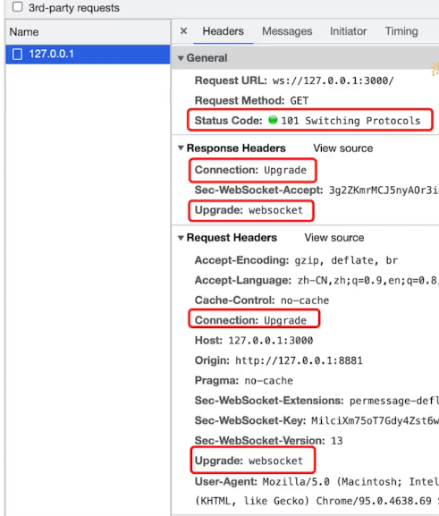

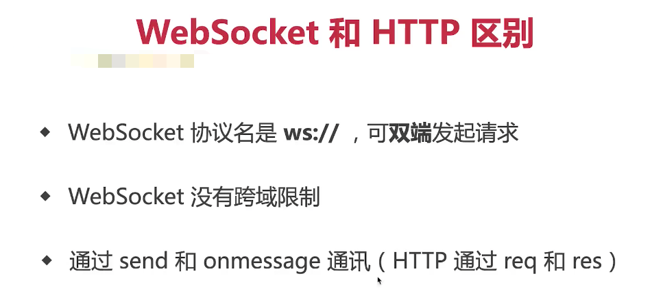

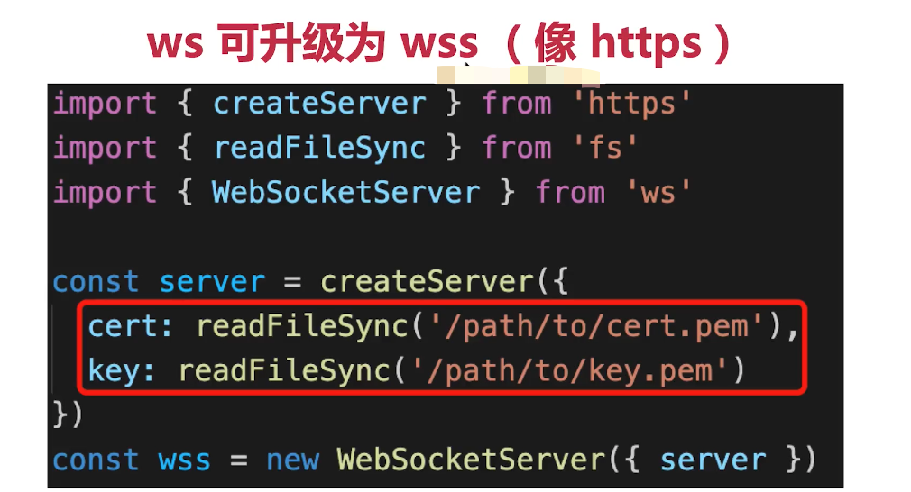

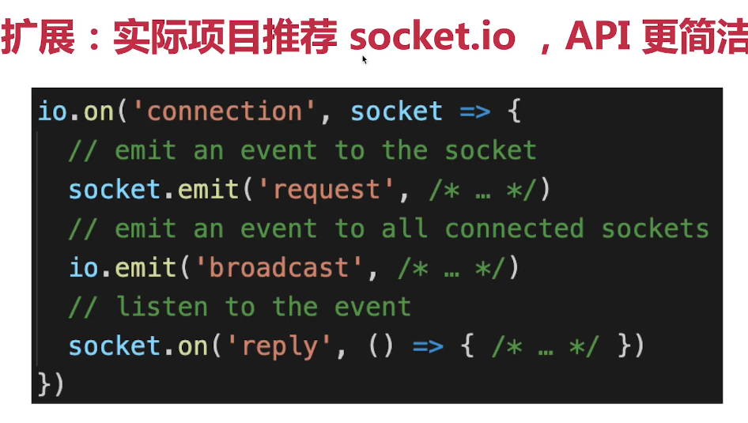

## WebSocket和HTTP长轮询区别

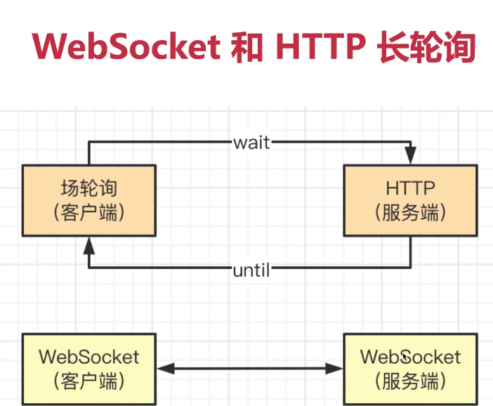


## url到页面展示完整过程

:::tip
- 网络请求
  - ◆DNS查询（得到IP）,建立TCP连接（三次握手）
  - ◆浏览器发起HTTP请求
  - ◆收到请求响应，得到HTM源代码
  - ◆继续请求静态资源
    - ◆解析HTML过程中，遇到静态资源还会继续发起网络请求
    - ◆JS CSS图片视频等
- 解析
  - 解析：字符串->数据结构
    - HTML 构建DOM树
    - CSS 构建CSSOM树（style tree）
    - 两者结合，形成renderTree 
  
- 渲染 renderTree 绘制到页面
   - 计算各个DOM的尺寸、定位，最后绘制到页面
   - 遇到S可能会执行（参考defer async)
   - 异步CSS、图片加载，可能会触发重新渲染
:::

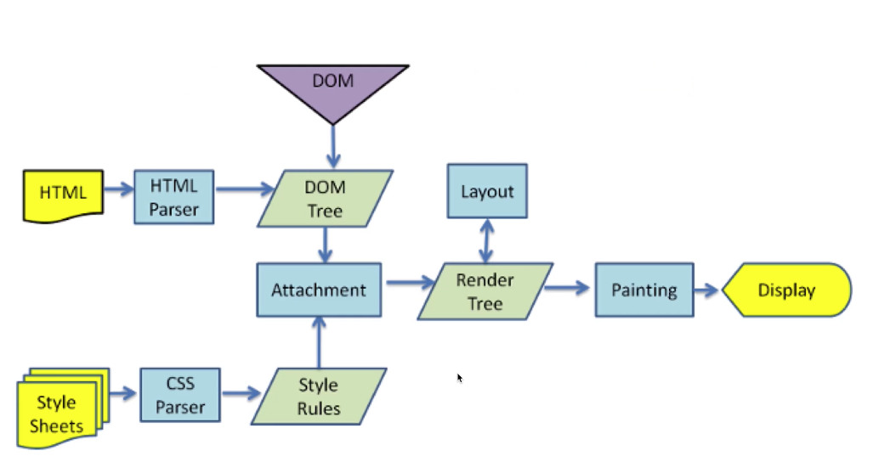

### 优化解析

:::tip
- ◆CSS放在head中，不要异步加载CSS
- ◆JS放在bod>最下面（或合理使用defer async)
- ◆img提前定义width height

:::

## 重绘repaint重排reflow有什么区别？

### 动态网页，随时都会重绘、重排

:::tip

- 网页动画
- Modal Dialog弹窗
- 增加/删除一个元素，显示/隐藏一个元素
:::

### 重绘repaint

:::tip
- 元素外观改变，如颜色、背景色
- 但元素的尺寸、定位不变，不会影响其他元素的位置
:::

### 重排reflow

:::tip
- 重新计算尺寸和布局，可能会影响其他元素的位置
- 如元素高度增加，可能会使相邻元素位置下移
:::

### 减少重排方法

:::tip

- 集中修改样式，或直接切换css class
- 修改之前先设置display:none,脱离文档流
- 使用BFC特性，不影响其他元素位置
- 频繁触发(resize scroll)使用节流和防抖
- 使用createDocumentFragment批量操作DOM
- 优化动画，使用CSS3和requestAnimationFrame

:::

在CSS中，BFC（Block Format Context）（块级格式化上下文）是一种独立的布局环境，它规定了内部的块级盒子如何布局，并且与外部盒子相互隔离，意味着BFC内部的元素布局不会影响到外面的元素。了解和应用BFC可以帮助解决各种CSS布局问题，比如边距合并、清除浮动等。
- 内部元素无论如何改动，都不会影响其他元素的位置
如何形成BFC
一个元素形成BFC的条件通常包括：
浮动元素（元素的 float 不是 none）。
绝对定位元素（元素的 position 为 absolute 或 fixed）。
行内块元素（元素的 display 为 inline-block）。
弹性盒子（display 为 flex 或 inline-flex元素的直接子元素）。
网格布局（display 为 grid 或 inline-grid 元素的直接子元素）。
超过或等于 overflow 不是 visible 的块元素（如 overflow: auto;、overflow: hidden; 等）。

## 如何实现多个标签通信 

### websocket 
可跨域
成本好
### storage 
不可跨域

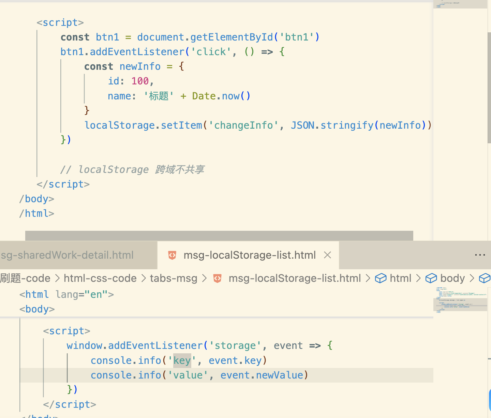

### sharedWorker 通讯 
调试不放便 

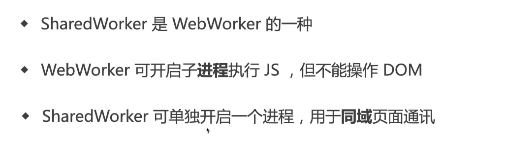

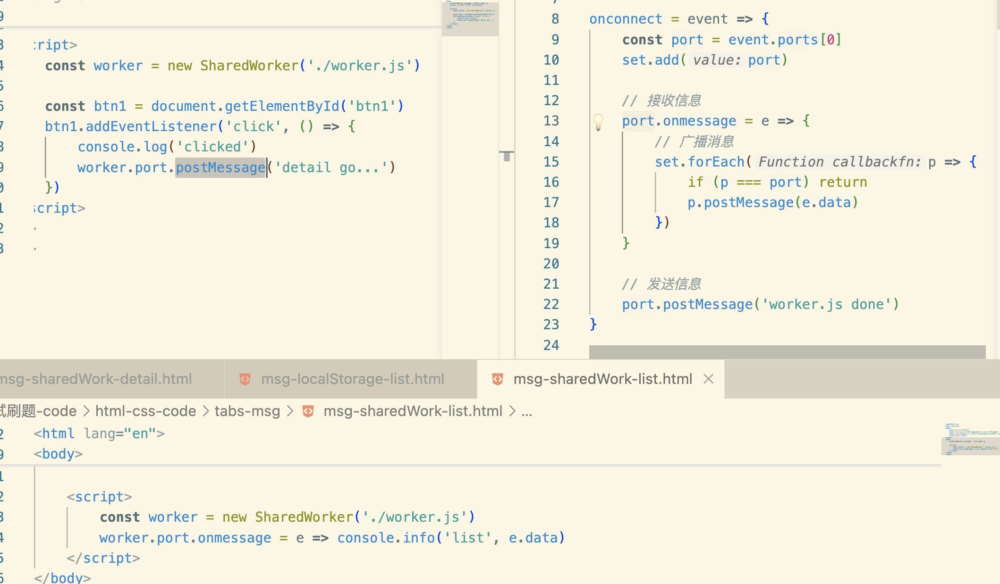

## 网页和iframe 通信 

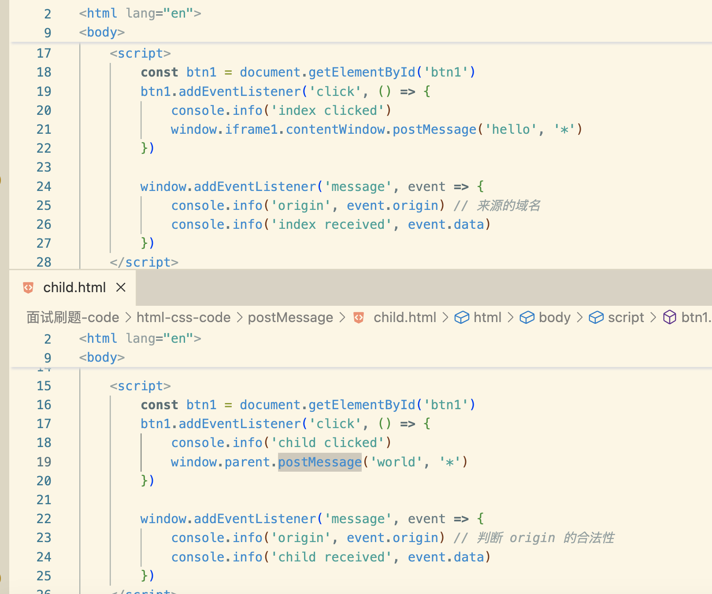

## koa2 洋葱模型 

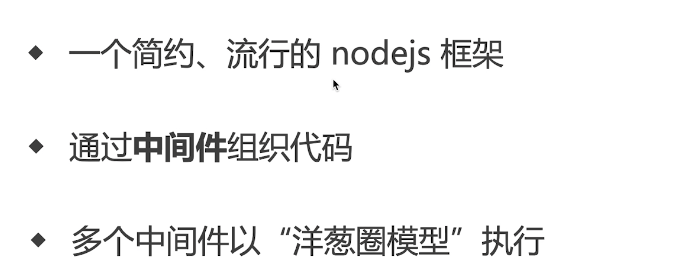

## 文字超出省略

```css
/* 单行文字 */
#box1 {
border: 1px solid #ccc;
width: 100px;
white-space: nowrap; /* 不换行 */ 
overflow: hidden;
text-overflow: ellipsis; /* 超出省略 */
}
/* 多行文字 */
#box2 {
border: 1px solid #ccc;
width: 100px;
overflow: hidden;
display: -webkit-box; /* 将对象作为弹性伸缩盒子模型显示 */
-webkit-box-orient: vertical; /* 设置子元素排列方式 */ 
-webkit-line-clamp: 3; /* 显示几行，超出的省略 */
}

```

## no-cache 和 no-store 的区别
```text
no-cache 和 no-store 用作控制缓存，被服务器通过响应头 Cache-Control 传递给客户端
- no-store
永远都不要在客户端存储资源，永远都去原始服务器去获取资源。
- no-cache
可以在客户端存储资源，每次都必须去服务端做新鲜度校验，来决定从服务端获取新的资源（200）还是使用客户端缓存（304）。也就是所谓的协商缓存。
一般情况下对于 index.html 或者现代构建环境下不加 hash 的静态资源都需要设置 Cache-Control: no-cache，用来强制每次在服务器端的新鲜度校验。
相当于一下缓存头
Cache-Control: max-age=0, must-revalidate
```
