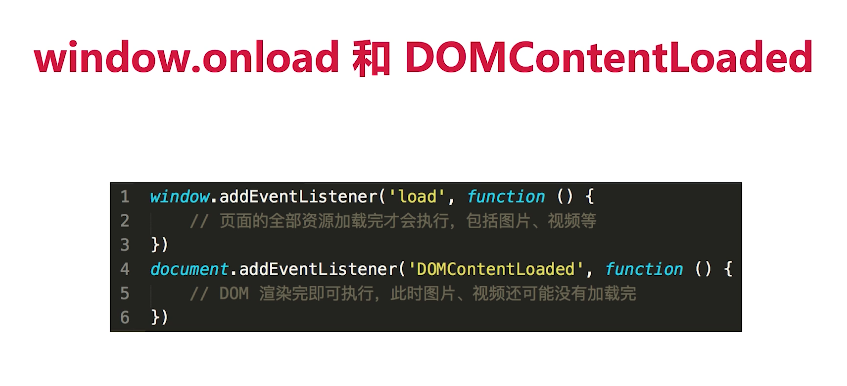

# 性能优化 

## 网页时如何加载并渲染出来的

:::tip
- DNS解析：域名->IP地址 （domain name serve 域名服务解析）
- 浏览器根据IP地址向服务器发起http请求
- 服务器处理http请求，并返回给浏览器
- 根据Html 代码生成DOM tree 
- 根据css 代码更生CSSOM
- 根据Render Tree 渲染页面
- 遇到script 则暂停渲染，优先加载并执行js代码，完成再继续
:::

## 前端性能优化有哪些方式
### 性能优化原则
:::tip
- 多使用内存、缓存或其他方法
- 减少CPU计算量，减少网络加载耗时
- 空间换时间
:::
### 加载更快
:::tip
- 减少资源体积：压缩代码 
- 减少访问次数：合并代码 ，SSR 服务器渲染，缓存
- 使用更快的网络：CDN
:::
### 渲染更快
:::tip
- css放在head，js放在body最下面
- 尽早执行js，用DOMContentLoaded触发 
- 懒加载 （图片懒加载，上滑懒加载）
- 对DOM查询进行缓存
- 频繁DOM操作，合并到一起插入DOM结构
:::

## 前端性能优化示例
## 手写debounce
## 手写throttle 
## 如何预防xss攻击
## 如何预防xsf攻击