# 问题总结

## H5 如何进行首屏优化 

:::tip
- 路由懒加载
- 服务端渲染SSR 
  - 传统的前后端分离（SPA)渲染页面的过程复杂
  - SSR渲染页面过程简单，所有性能好
  - 如果是纯H5页面，SSR是性能优化的终极方案
  - Nuxt.js (Vue)
  - Next.js (React)
- 分页
- 图片懒加载 lazyload
  - 图片懒加载
  - 默认🈯️展示文本内容，然后再懒加载
  - 提前设置好图片尺寸， 尽量只重绘，不重排
- Hybrid 
  - 提前将Html js css 下载到app内部
  - 在App webview 中使用file:// 协议加载页面 
  - 在用ajax 获取内容并展示 （也结合App预取）
:::

## 如何处理十万条数据
:::tip
- 只需要渲染可视区域的列表
  - 借用第三方lib 
    - vue-virtual-scroll-list
    - React-virtualiszed
:::
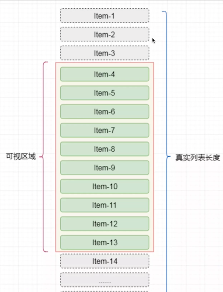

## 前端常用的设计模式和使用场景

### 工厂模式 
:::tip
- 用一个工厂函数，来创建实例，隐藏new
- 如jQuery$函数
- 如React createElement函数
:::
```js
class Foo {}
// 工厂模式
function factory(a,b,c){
  return new Foo()
}
const f = factory(1,2,3)
```
### 单例模式
:::tip
- JS是单线程的，创建单例很简单
- Java是支持多线程的，创建单例要考虑锁死线程
- 否则多个线程同时创建，单例就重复了（多线程共享进程内存)
:::
```js
class SingleTon {
    private static instance: SingleTon | null = null
    private constructor() {}
    public static getInstance(): SingleTon {
        if (this.instance == null) {
            this.instance = new SingleTon()
        }
        return this.instance
    }
    fn1() {}
    fn2() {}
}

const s = SingleTon.getInstance()
s.fn1()
s.fn2()

const s1 = SingleTon.getInstance()
const s2 = SingleTon.getInstance()

console.info(s1 === s2)
```
### 代理模式

:::tip
- 使用者不能直接访问对象，而是访问一个代理层
- 在代理层可以监听get set做很多事情
- 如ES6Proy实现Vue3响应式
:::
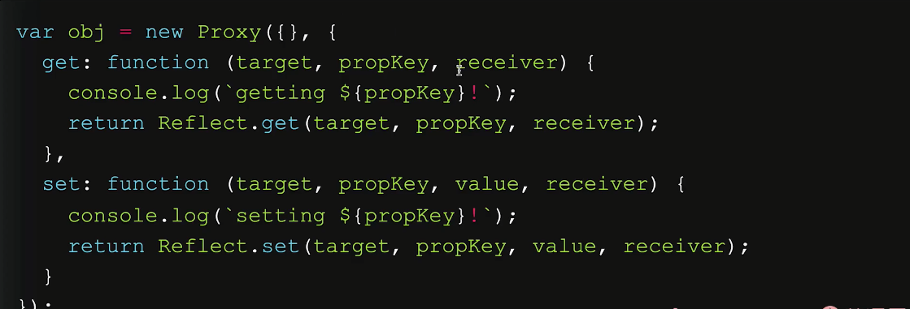
### 观察者模式 
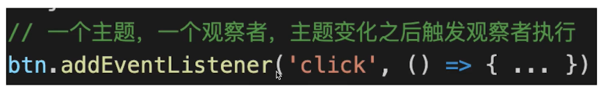
### 发布订阅模式
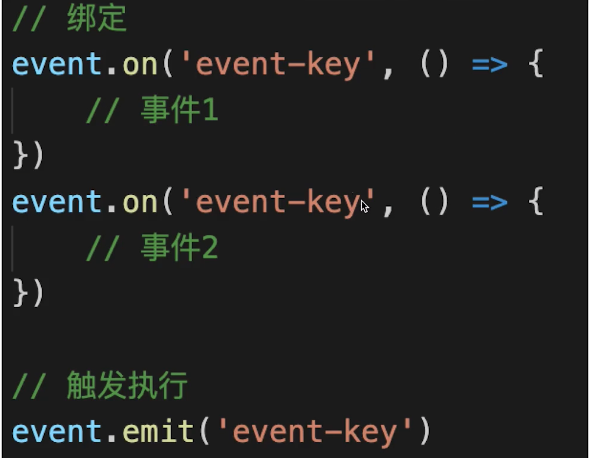
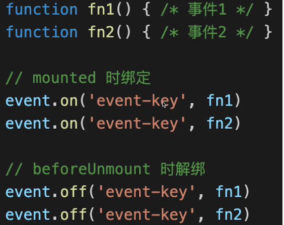

### 装饰器模式
:::tip
- 原功能不变，增加一些新功能(AOP面向切面编程)
- ES和Typescript的Decorator语法
- 类装饰器，方法装饰器
::: 

### 观察者和发布订阅的区别
:::tip
**观察者模式**
- Subject和Observer直接绑定，没有中间媒介
- 如addEventlistener绑定事件
**发布订阅**
- Publisher和Observer互不相识，需要中间媒介Event channel
- 如EventBus自定义事件
:::
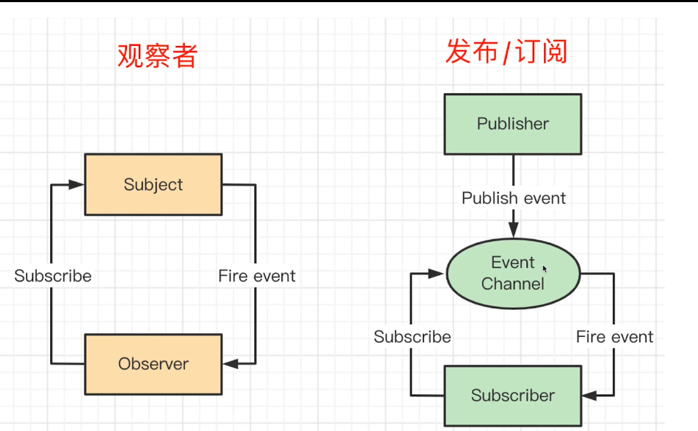

## vue优化 
:::tip
**v-if和V-shoW**

- v-if彻底销毁组件
- v-shoW使用CSS隐藏组件
- 大部分情况下使用V-if更好，不要过度优化

**v-for使用key**

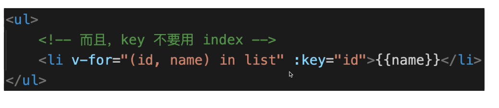

**使用computed缓存**

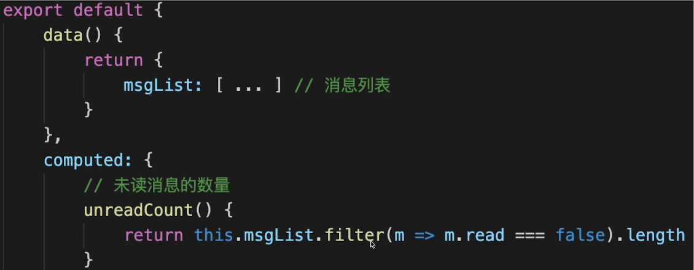

**keep-alive缓存组件**

- 频繁切换的组件，如tabs
- 不要乱用，缓存太多会占用内存，且不好debug

**异步组件**
- 针对体积较大的组件，如编辑器、复杂表格，复杂表单等
- 拆包，需要时异步加载，不需要时不加载
- 减少主包体积，首页会加载更快
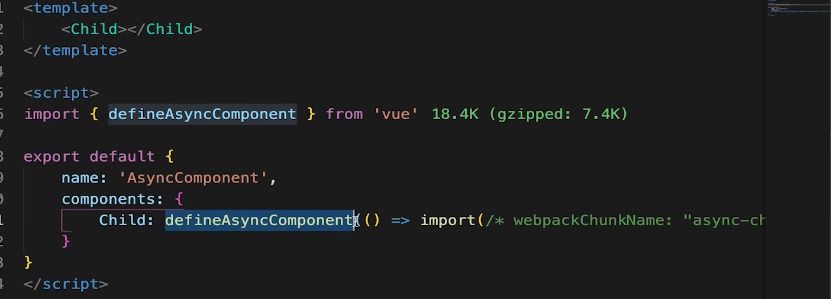

**路由懒加载**
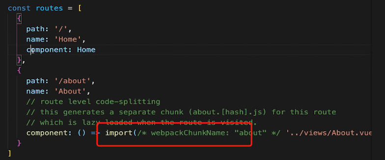
**服务端渲染**
:::
## vue中遇到的那些坑
:::tip
**内存泄漏**

- 全局变量，全局事件，全局定时器
- 自定义事件
**Vue2响应式的缺陷(Vue3不再有)**
- data新增属性用Vue.set
- data删除属性用Vue.delete
- 无法直接修改数据arr[index]=value

**路由切换时scroll到顶部**
- SPA的通病，不仅仅是Vue
- 如，列表页，滚动到第二屏，点击进入详情页
- 再返回到列表页（此时组件重新渲染）就sco川到顶部
**解决方案**
- 在列表页缓存数据和scrollTop值
- 当再次返回列表页时，渲染组件，执行scrollTo(x)
- 终极方案：MPA+App WebView
:::

## React 优化 
:::tip
**css模拟v-show**

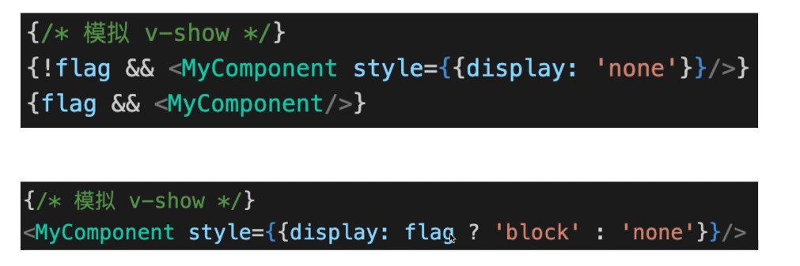

**循环使用key**

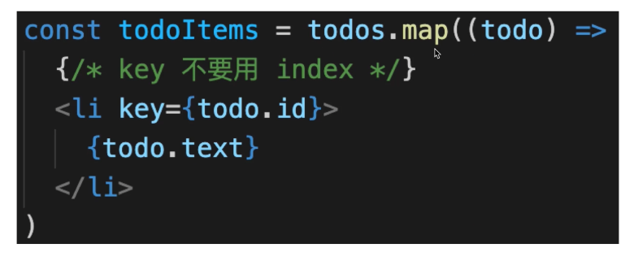

**使用Fragment减少层级嵌套**

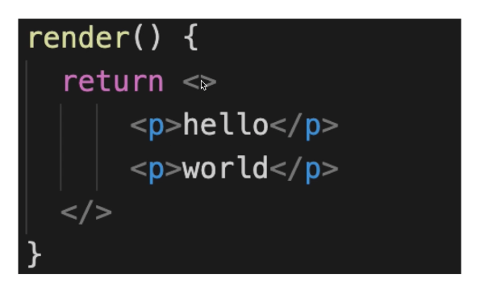

**jsx中不要定义函数**

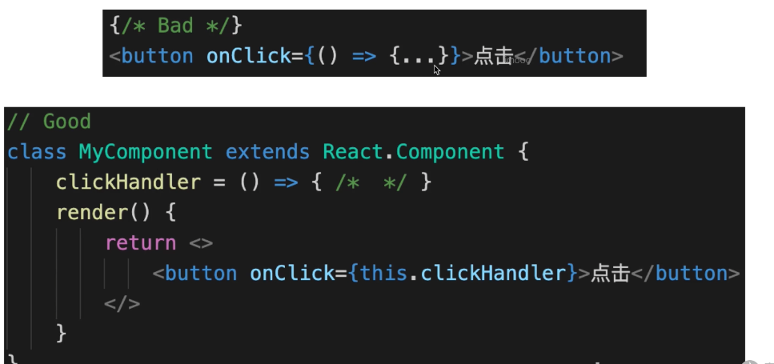

**使用shouldComponentUpdate**

- 使用shouldComponentUpdate判断组件是否要更新
- 或者使用React.PureComponent
- 函数组件使用React.memo

```js
import React from 'react'

function FunctionalTodoList(props) {
    console.log('todo list fn...')

    const { list = [] } = props
    return <ul>
        {list.map(todo => {
            const { id, title } = todo
            return <li key={id}>{title}</li>
        })}
    </ul> 
}

export default React.memo(FunctionalTodoList)
```

**Hooks缓存数据 **

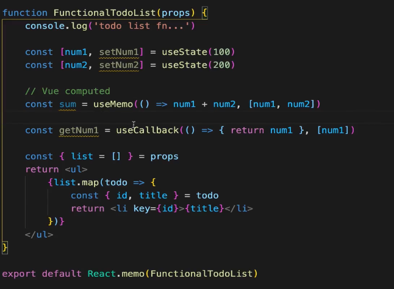

**组件懒加载**

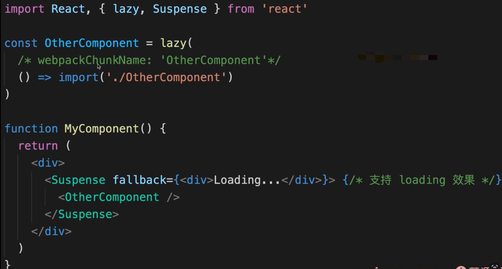


:::

## React遇到过哪些坑 
:::tip

- 自定义组件名称要大写 

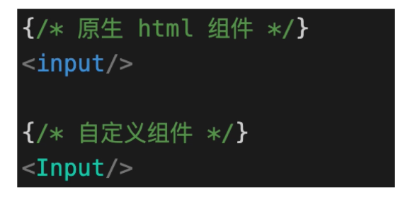

- js关键字冲突 

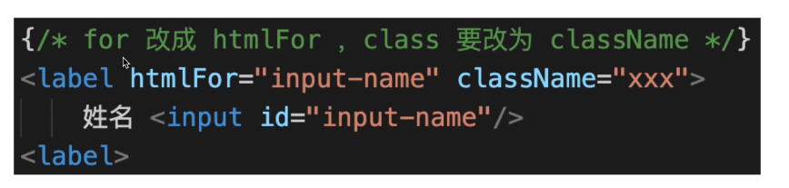

- jsx数据类型


:::

## 如何统一监听vue组件报错
:::tip

- errorCaptured
  - 监听所有下级组件的错误
  - 返回false 会阻止向上传播

```vue
export default {
  mounted() {
    window.onerror = function (msg, source, line, column, error) {
      console.info('window.onerror----', msg, source, line, column, error)
    }
    // window.addEventListener('error', event => {
    //   console.info('window error', event)
    // })
  },
  errorCaptured: (err, vm, info) => {
    console.info('errorCaptured----', err, vm, info)
    // return false
  },
}
```
- errorHandler (异步错误监听不到，需要window.onError)
```js
import { createApp } from 'vue'
import App from './App.vue'
import router from './router'

const app = createApp(App)

app.config.errorHandler = (error, vm, info) => {
    console.info('errorHandler----', error, vm, info)
}

app.use(router).mount('#app')

```
- errorCaptured监听下级组件错误，返回false阻止向上传播
- errorHandler监听全局Vue组件的错误
- window.onerror监听其他JS错误，如异步
- Promise为处理的catch需要onunhandledrejection,后面讲
:::

## 如何统一监听React报错
:::tip
- ErrorBoundary组件
  - 监听所有下级组件报错，可降级展示UI
  - 只监听组件渲染时报错，不监听DOM事件、异步错误
  - production环境生效，dev会直接抛出错误

```jsx
import React from 'react'

class ErrorBoundary extends React.Component {
    constructor(props) {
        super(props)
        this.state = {
            error: null // 存储当前的报错信息
        }
    }
    static getDerivedStateFromError(error) {
        // 更新 state 使下一次渲染能够显示降级后的 UI
        console.info('getDerivedStateFromError...', error)
        return { error }
    }
    componentDidCatch(error, errorInfo) {
        // 统计上报错误信息
        console.info('componentDidCatch...', error, errorInfo)
    }
    render() {
        if (this.state.error) {
            // 提示错误
            return <h1>报错了</h1>
        }

        // 没有错误，就渲染子组件
        return this.props.children
    }
}

export default ErrorBoundary
```
- ErrorBoundary不会监听DOM事件报错
- 可用try-catch
- 可用window.onerror
- ErrorBoundary监听组件渲染报错
- 事件报错使用try-catch或window.onerror
- 异步报错使用window.onerror
:::

## 如何排查性能问题
:::tip
- 哪里的问题 
  - 加载慢
  - 渲染慢 
- 前端指标 
  - First Paint （FP）
  - Frist ContentFul Paint （FCP）
  - First Meaningful Paint(FMP)一以弃用，改用LCP
  - DomContentLoaded (DCL)
  - Largest Contentfull Paint (LCP)
  - Load (L)
- Chrome devTools 
  - Performance 页面性能指标 
  - NetWork 
  - lighthouse 
  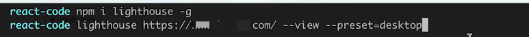  
:::

## 项目中遇到难点，如何解决的？


## 在项目中 封装过那些业务组件

```text
封装业务组件是前端开发中常见的实践，旨在提高代码的复用性、维护性，并保持项目的结构清晰。封装的组件通常是针对特定业务逻辑或UI模式设计的，以下是一些常见的业务组件类型，你可能在项目中遇到或考虑封装：

1. 表单组件
复杂表单输入：如日期选择器、下拉选择框、自动完成输入框等，这些通常与数据校验逻辑一起封装，以确保数据的有效性。
动态表单：根据后端数据动态生成表单项的组件。
2. 列表和表格组件
数据表格：支持排序、过滤、分页和搜索的表格组件。这些表格可能包含复杂的内嵌操作，如编辑、删除或详细视图。
无限滚动列表：用于长列表数据展示，通过无限滚动来加载和显示数据。
3. 导航组件
侧边导航：通常用于管理应用的主要导航区域，支持多级结构。
面包屑导航：显示当前页面在应用层级结构中的位置，通常与路由密切集成。
4. 数据展示组件
图表库封装：封装特定库（如ECharts、Chart.js）的图表组件，使其更容易在应用中跨多个页面使用。
卡片组件：用于展示信息摘要，如用户卡片、产品卡片等。
5. 模态窗口和弹出层
对话框/确认框：执行操作前需要用户确认的对话框。
信息提示：如Toast通知、警告框、信息提示条等。
6. 工具条和操作面板
工具条：为用户提供一组相关操作的界面组件，如编辑器的工具条。
操作面板：特定于应用中的一个功能区域，提供相关的操作和信息展示。
7. 高阶组件(HOCs)
数据加载HOC：包装组件以提供数据加载逻辑。
权限控制HOC：控制组件访问权限的高阶组件。
8. 布局组件
响应式布局：为不同屏幕大小提供优化显示的布局组件。
网格系统：提供灵活的布局网格系统，支持快速响应式布局设计。
实现细节
在封装这些组件时，需要考虑如下几个方面：

可配置性：提供足够的配置项，以适应不同的业务需求。
易用性：简化API，使其他开发者容易使用和集成。
性能优化：避免不必要的渲染和资源消耗，尤其是在数据密集或频繁更新的组件中。
样式封装：确保组件样式的独立性，避免全局样式干扰。
封装业务组件的关键在于理解和预测业务需求的多样性，并提供足够的灵活性来适应这些需求，同时保持接口的简洁和组件的可维护性。这样的实践有助于在团队内部快速开发和迭代产品功能。
```

