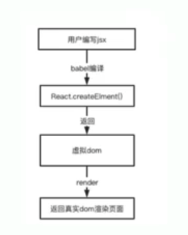

# 从0实现React16源码 


## React渲染阶段概念大全

### 1.简化逻辑

1. createElement;(JSX解析)
2. render;
3. Concurrent Mode (Fiber)
4. Fibers Node;
5. Render and Commit Phases 
6. Reconciliation 
7. Function Components 
8. hooks
9. 类组件

> 总结：JSX -> FilberNode -> Concurrent Mode -> Fiber 核心调度器 -> Scheduler -> 打断Reconciliation -> Render(执行Hooks)-> Commit Phases 

### 2.启航阶段



在React17中，Facebook推出了一个新的JSX转换器：`@babel/plugin-transform--react-jsx`,它在编译时引入了`jsx`和`_jsxs`两个新的函数，作为替代`React.createElement`的工具。这两个新的函数只在编译时使用，并不会出现在运行时代码中。

`_jsx`和`_jxs`与`React.createElement`相比做出以下优化：

1。静态子元素的优化：在新的转换器中，如果JSX元素有静态子元素，那么它会被编译成sx8调用，而非x。_x8可以处理静态子元素的数组，从而避免在每次渲染时创建新
的数组，以提高性能。

2.`key属性的优化`：新的转换器能够在编译时分辨出静态和动态的ky属性，并将它们传递给`js×`或`_jsx`函数。这样就避免了不必要的k©y属性计算，提高了性能。

3.`开发模式的优化`：新的转换器通过一个`__source`参数在开发模式下提供更多的调试信息。这个参数在生产模式下不会被包含，以减小代码体积。

4.`减少了运行时的依赖`：与`React,createElement`不同，`_jsx`和_`jsxs`并不需要React库的运行时版本，这意味着，在未来，Reacti可以去除掉它的`createElement`函数，从而减小库的体积。

5.`优化对象字面量`：当JSX属性被编译为对象字面量时，新的转换器可以在编译时标识出这些字面量，从而速免在每次渲染时创建新的对象。

总的来说，新的`_jsx`和`_jsxs`函数为JSX提供了更好的优化空间，从而提高了性能并减小了代码体积。

### 3.整体调度逻辑

- 初始阶段：

    创建根fiber节点，代表整个React应用的根组件

    调用根组件的render方法，创建初始的虚拟DOM树


- 调度阶段（Scheduler）：

    使用调度器（Scheduler） 调度更新，决定合适执行更新任务。

    检查是否有高优先任务需要执行，如用户交互时间或优先级较高的异步操作。

    根据优先级确定任务执行顺序，并根据任务的优先级将任务添加到不通的任务队列（lane）中

-  协调阶段（Reconciliation）：

    从任务队列中取出下一个任务。

    对任务中设计组件进行协调，比较前后两个虚拟DOM树的差异，找出需要更新的部分。

    使用DOM diff 算法进行差异计算，生成需要更新的操作指令


- 生命周期阶段（Lifecycle）：

    在协调阶段和提交阶段，React会根据组件的生命周期方法调用相应的钩子函数

    生命周期方法包括componentDidMount componentDIdUpdate等，用于处理组件的生命周期事件

- 5.渲染阶段（Render）：

    在Render阶段，React会根据组件的状态变化，props的更新或者父组件的重新渲染等触发条件，重新执行组件的函数体（函数组件）或者render方法（类组件）。当React执行函数组件或render方法时，它会检测组件中是否包含了hooks，如果包含了Hooks，那么React会根据Hooks的顺序依次调用他们。

    Hooks执行：

    在Render阶段，React会根据组件总hooks的顺序，依次执行每个Hooks函数。
    Hooks函数可能包括useState，useEffect，useContext等等，这些Hooks函数会在组件每次更新被调用，让你能够在函数组件总使用状态，副作用和上下文等特性。（批处理执行多个setState合并一次，setTimeOut 16阶段不支持，18已经支持自动化批处理）

    Commit（提交）阶段：
    在commit阶段，React将Render阶段生成的更新应用到真实DOM中，完成页面的渲染。
    在commit 阶段，React可能会执行一些其他操作，比如调用生命周期方法（如：componentDidMount、 componentDIdUpdate等）或执行其他副作用。
    重复步骤2-7:
    根据应用层序的交互和状态变化，React会重复执行调度、协调、渲染、提交的步骤。实现更新的循环流程。


### 4.初始化渲染逻辑

首次渲染是值在React应用初始化加载时进行的渲染过程，下面是首次渲染的流程：

1. 初始化阶段：

 . 创建根Fiber节点，代表整个React应用的根组件

 . 根据根组件的类型（函数组件或类组件），创建Fiber节点的初始Fiber节点。

 . 调用根组件的render方法（函数组件则执行函数体），省层初始的虚拟DOM树


2. 渲染阶段

 . 根据初始的虚拟DOM树，React开始进行渲染阶段

 . React会遍历虚拟DOM树，递归创建组件的Fiber节点，并构建Fiber树

 . 在Fiber树的构建过层中，react会为每个组件创建对应的Fiber节点，建立组件之间的父子关系。

3. 提交阶段

 . 渲染阶段结束后，React进入提交阶段
 
 . React将Riber树中的节点转换为真实的DOM节点，并将其插入到页面中，完成首次渲染

 . 在提交阶段，React还会触发一些生命周期，如componentDIdMount，以及处理组件的挂载逻辑


> 总结：首次渲染流程的关键步骤包括创建根Fiber节点、渲染阶段的Fiber树构建，以及提交阶段将虚拟DOM转换为真实DOM井插入页面。这个过程会触发组件的生命周期方法，完成组件的初始化和挂载。一旦首次渲染完成，后续的更新流程将进入到协调、更新和提交的循环中，以保持React应用的更新和渲染。


双缓存

```下一次的更新内存中挂在了一个虚拟的Fiber Tree <----> 真实的还有一棵树```

### 超级fiber 的实现

>  render(初始化配置)  ->  requestIdleCallback ->  workloop -> nextUnitOfWork -> performUnitOfWork

```js
let nextUnitOfWork = null;

export function render(element, container) {
  // memo 是不是整个fiber tree 进行优化

  // 将我们的跟节点设置成为第一个工作单位
  nextUnitOfWork = {
    dom: container,
    props: {
      children: [element],
    },
  };
}

export function createDome(fiber) {
  const dom =
    fiber.type === "TEXT_ELEMENT"
      ? document.createTextNode("")
      : document.createElement(fiber.type);
  const isProperty = (key) => key !== "children";
  Object.keys(fiber.props)
    .filter(isProperty)
    .forEach((name) => {
      dom[name] = fiber.props[name];
    });
  return dom;
  // stack 同步的 不能被中断的
  //   element.props.children.forEach((child) => render(child, dom));
  //   container.appendChild(dom);
  // 心智模型
  // while(下一个工作单元){
  //     下一个工作单元 = 执行工作单元(下一个工作单元丢进去)
  // }
}
/***
 * 工作循环
 *
 */
function workloop(deadline) {
  // 停止标识
  let shouldYield = false;
  while (nextUnitOfWork && !shouldYield) {
    // 执行工作单元
    nextUnitOfWork = performUnitOfWork(nextUnitOfWork);
    console.log(nextUnitOfWork, "nextUnitOfWork-nextUnitOfWork");
    // 判断是否需要停止
    // 模拟的情况是咱们自己还得判断下有没有16.67
    shouldYield = deadline.timeRemaining() < 1;
  }
}

requestIdleCallback(workloop);

function performUnitOfWork(fiber) {
  console.log("fiber", fiber);
  if (fiber.dom == null) {
    fiber.dom = createDome(fiber);
  }

  if (fiber.parent) {
    fiber.parent.dom.appendChild(fiber.dom);
  }
  const elements = fiber.props.children;

  // 索引 index = 0
  let index = 0;
  // 上一个兄弟节点
  let prevSibling = null;
  while (index < elements.length) {
    const element = elements[index];
    const newFiber = {
      type: element.type,
      props: element.props,
      parent: fiber,
      dom: null,
    };
    // 将第一个孩子节点设置为fiber的字节点
    if (index === 0) {
      fiber.child = newFiber;
    } else if (element) {
      prevSibling.sibling = newFiber;
    }
    prevSibling = newFiber;
    index++;
  }
  if (fiber.child) {
    return fiber.child;
  }
  let nextFiber = fiber;
  while (nextFiber) {
    if (nextFiber.sibling) {
      return nextFiber.sibling;
    }
    nextFiber = nextFiber.parent;
  }
}
// 超级fiber  的事件
// render  ->  requestIdleCallback ->  workloop -> nextUnitOfWork -> performUnitOfWork

```


### render and Commit Phases

```js
/**
 * 处理提交的fiber树
 * @param {*} fiber
 * @returns
 * **/
function commitWork(fiber) {
  //   wipRoot = null;
  if (!fiber) {
    return;
  }
  //   //找到最近的有dom的祖先节点
  //   let dowParentFiber = fiber.parent;
  //   while (!dowParentFiber.dom) {
  //     dowParentFiber = dowParentFiber.parent;
  //   }
  //   // 将fiber的dom添加到父节点上
  //   dowParentFiber.dom.appendChild(fiber.dom);
  const domParent = fiber.parent.dom;
  domParent.appendChild(fiber.dom);
  // 递归
  commitWork(fiber.child);
  commitWork(fiber.sibling);
}
/**
 * 提交任务，将Fiber tree 渲染为真实DOM
 * **/
function commitRoot() {
  commitWork(wipRoot.child);
  wipRoot = null;
}
```

### recociliation 

```js
let nextUnitOfWork = null; // 保存下一个工作单元（Fiber）
let wipRoot = null; // 当前正在工作的 Fiber 树根节点
let currentRoot = null; // 上一次提交给 DOM 的 Fiber 树根节点
let deletions = []; // 保存需要删除的 Fiber 节点

function isNew(prevProps, nextProps) {
  return (key) => prevProps[key] !== nextProps[key];
}
function isGone(prevProps, nextProps) {
  return (key) => !(key in nextProps);
}
function isEvent(key) {
  return key.startsWith("on");
}
const isProperty = (key) => key !== "children" && !isEvent(key); // 过滤掉 children 属性

// render 函数初始化 Fiber 树并开始工作循环
export function render(element, container) {
  wipRoot = {
    dom: container, // 保存容器 DOM 节点
    props: {
      children: [element], // 将要渲染的 element 放在 props.children 中
    },
    alternate: currentRoot, // 保存上一次渲染的 Fiber 树以便复用
  };
  deletions = []; // 清空删除列表
  nextUnitOfWork = wipRoot; // 将根节点设为下一个工作单元
}

// 创建 DOM 节点的方法
export function createDome(fiber) {
  // 创建 DOM 节点
  const dom =
    fiber.type === "TEXT_ELEMENT" // 如果 Fiber 类型是文本
      ? document.createTextNode("") // 创建文本节点
      : document.createElement(fiber.type); // 否则创建普通的 DOM 元素

  //   Object.keys(fiber.props) // 遍历 fiber 的 props
  //     .filter(isProperty) // 过滤掉 children
  //     .forEach((name) => {
  //       dom[name] = fiber.props[name]; // 设置 DOM 属性
  //     });
  updateDom(dom, {}, fiber.props);

  return dom; // 返回创建好的 DOM 节点
}

// 更新 DOM 属性的函数，用于处理 Fiber 树的变化
function updateDom(dom, prevProps, nextProps) {
  console.log("updateDom", dom, prevProps, nextProps);
  // 删除移除的事件
  Object.keys(prevProps)
    .filter(isEvent)
    .filter((key) => !(key in nextProps) || isNew(prevProps, nextProps)(key))
    .forEach((name) => {
      const eventType = name.toLowerCase().substring(2);
      console.log(`Removing event listener: ${eventType}`);
      dom.removeEventListener(eventType, prevProps[name]);
    });

  // 移除旧的属性
  Object.keys(prevProps)
    .filter(isProperty)
    .filter(isGone(prevProps, nextProps))
    .forEach((name) => {
      console.log("移除旧的属性", name);
      dom[name] = "";
    });

  // 设置新的属性
  Object.keys(nextProps)
    .filter(isProperty)
    .filter(isNew(prevProps, nextProps))
    .forEach((name) => {
      console.log("设置新的属性", name);
      dom[name] = nextProps[name];
    });

  // 添加新的事件处理
  Object.keys(nextProps)
    .filter(isEvent)
    .filter(isNew(prevProps, nextProps))
    .forEach((name) => {
      const eventType = name.toLowerCase().substring(2);
      console.log(`Adding event listener: ${eventType}`);
      dom.addEventListener(eventType, nextProps[name]);
    });
}

/**
 * 提交节点，将 Fiber 树提交到真实 DOM
 **/
function commitWork(fiber) {
  if (!fiber) {
    return;
  }

  const domParent = fiber.parent.dom;

  if (fiber.effectTag === "PLACEMENT" && fiber.dom != null) {
    domParent.appendChild(fiber.dom);
  } else if (fiber.effectTag === "UPDATE" && fiber.dom != null) {
    console.log("Updating DOM for:", fiber);
    updateDom(fiber.dom, fiber.alternate.props, fiber.props); // 更新 DOM 属性
  } else if (fiber.effectTag === "DELETION") {
    commitDeletion(fiber, domParent);
    return;
  }

  commitWork(fiber.child);
  commitWork(fiber.sibling);
}

// 删除 Fiber 节点
function commitDeletion(fiber, domParent) {
  if (fiber.dom) {
    domParent.removeChild(fiber.dom); // 从父节点 DOM 中移除
  } else {
    commitDeletion(fiber.child, domParent); // 递归删除子节点
  }
}

/**
 * 提交整个 Fiber 树
 **/
function commitRoot() {
  deletions.forEach(commitWork); // 先处理需要删除的 Fiber 节点
  commitWork(wipRoot.child); // 提交根节点的子节点
  currentRoot = wipRoot; // 将当前的根节点设置为已经提交的 Fiber 树
  wipRoot = null; // 清空 wipRoot，表示工作完成
}

/***
 * 工作循环，持续调度工作单元
 **/
function workloop(deadline) {
  let shouldYield = false; // 停止标识，表示是否需要让出控制权
  while (nextUnitOfWork && !shouldYield) {
    // 如果有下一个工作单元并且不需要停止
    nextUnitOfWork = performUnitOfWork(nextUnitOfWork); // 执行下一个工作单元
    shouldYield = deadline.timeRemaining() < 1; // 判断是否需要停止以让出控制权
  }

  if (!nextUnitOfWork && wipRoot) {
    commitRoot(); // 如果没有工作单元并且有需要提交的 Fiber 树，提交 Fiber 树
  }

  requestIdleCallback(workloop); // 在空闲时间再次调用工作循环
}

requestIdleCallback(workloop); // 初始化工作循环

/**
 * 协调阶段，处理子元素
 **/
function reconcileChildren(wipFiber, elements) {
  let index = 0;
  let prevSibling = null;
  let oldFiber = wipFiber.alternate && wipFiber.alternate.child; // 获取旧的 Fiber 节点

  while (index < elements.length || oldFiber != null) {
    const element = elements[index];
    let newFiber = null;

    const sameType = oldFiber && element && element.type === oldFiber.type; // 判断新旧节点类型是否相同

    if (sameType) {
      // 类型相同，需要更新
      newFiber = {
        type: oldFiber.type,
        props: element.props,
        dom: oldFiber.dom, // 复用旧的 DOM
        parent: wipFiber,
        alternate: oldFiber, // 保留旧的 Fiber 以便比较
        effectTag: "UPDATE", // 设置为 UPDATE 标记
      };
      console.log("Set UPDATE effectTag for:", newFiber); // 调试输出
    } else if (element && !sameType) {
      // 如果类型不同，创建新的节点
      newFiber = {
        type: element.type,
        props: element.props,
        dom: null, // 创建新的 DOM
        parent: wipFiber,
        alternate: null,
        effectTag: "PLACEMENT", // 新的节点标记为插入
      };
      console.log("Set PLACEMENT effectTag for:", newFiber); // 调试输出
    }

    if (oldFiber && !sameType) {
      // 如果旧的节点存在，但类型不同，标记为删除
      oldFiber.effectTag = "DELETION";
      deletions.push(oldFiber);
      console.log("Set DELETION effectTag for:", oldFiber); // 调试输出
    }

    if (oldFiber) {
      oldFiber = oldFiber.sibling; // 继续处理下一个旧的节点
    }

    if (index === 0) {
      wipFiber.child = newFiber; // 第一个子节点设置为 fiber 的子节点
    } else if (prevSibling) {
      prevSibling.sibling = newFiber; // 兄弟节点连接
    }

    prevSibling = newFiber;
    index++;
  }
}

/**
 * 执行工作单元的主要逻辑
 **/
function performUnitOfWork(fiber) {
  if (!fiber.dom) {
    // 如果没有创建 DOM 节点，则创建
    fiber.dom = createDome(fiber);
    console.log("Created DOM for:", fiber); // 调试输出
  }

  const elements = fiber.props.children;
  reconcileChildren(fiber, elements); // 协调子节点

  if (fiber.child) {
    return fiber.child; // 如果有子节点，继续处理子节点
  }

  let nextFiber = fiber;
  while (nextFiber) {
    if (nextFiber.sibling) {
      return nextFiber.sibling; // 返回兄弟节点
    }
    nextFiber = nextFiber.parent; // 否则返回父节点
  }
}

```

### Function Components

```js
// 函数组件

const element2 = <h1>h1,121212</h1>;
console.log(element2, "element2");

React.render(element2, document.getElementById("root"));

```
```js
/**
 * 提交节点，将 Fiber 树提交到真实 DOM
 **/
function commitWork(fiber) {
  if (!fiber) {
    return;
  }

  let domParentFiber = fiber.parent;
  while (!domParentFiber.dom) {
    domParentFiber = domParentFiber.parent;
  }
  const domParent = domParentFiber.dom;

  if (fiber.effectTag === "PLACEMENT" && fiber.dom != null) {
    domParent.appendChild(fiber.dom);
  } else if (fiber.effectTag === "UPDATE" && fiber.dom != null) {
    console.log("Updating DOM for:", fiber);
    updateDom(fiber.dom, fiber.alternate.props, fiber.props); // 更新 DOM 属性
  } else if (fiber.effectTag === "DELETION") {
    commitDeletion(fiber, domParent);
    return;
  }

  commitWork(fiber.child);
  commitWork(fiber.sibling);
}
```

### 实现hooks

- 实现基础的setState、

```js
let globalState = {};
let globalSubscribers = {};
let stateIndex = 0;

function useState(initialValue) {
  const currentIndex = stateIndex;
  stateIndex++;
  if (!(currentIndex in globalState)) {
    globalState[currentIndex] = initialValue;
    globalSubscribers[currentIndex] = new Set();
  }
  const setState = (newValue) => {
    let newState = newValue;
    if (typeof newValue === "function") {
      newState = newValue(globalState[currentIndex]);
    }
    globalState[currentIndex] = newState;
    //触发所有的订阅者 ，进行更新
    for (const subscriber of globalSubscribers[currentIndex]) {
      subscriber(newState);
    }
  };
  const subscribe = (subscriber) => {
    globalSubscribers[currentIndex].add(subscriber);
    return () => {
      globalSubscribers[currentIndex].delete(subscriber);
    };
  };
  return [globalState[currentIndex], setState, subscribe];
}

// 使用列子

const [count, setCount, subscribeCount] = useState(0);
subscribeCount((newValue) => {
  console.log("count changeed", newValue);
});

console.log("count", count);

setCount(1); // 更新状态，触发订阅函数

```