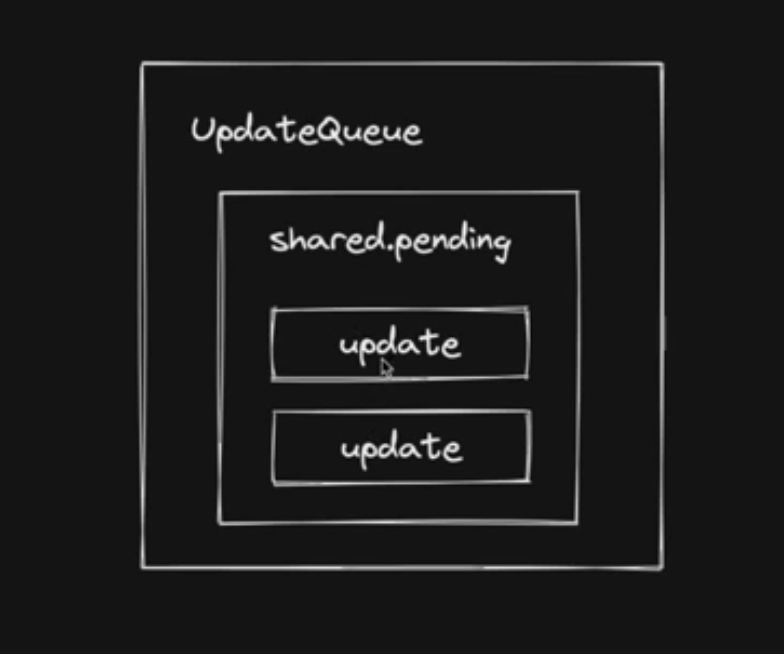

# React 18 源码核心流程


## 实现状态更新机制

常见的触发更新方式：

- `ReactDOM.createRoot().render`（或老版本 ReactDOM.render）

- this.setState

- useState的`dispatch`方法 


希望实现一套统一的的更新机制

更新机制的组成部分 

- 代表更新的数据结构 - Update
- 消费update的数据结构 - UpdateQueue




需要考虑的事情：

- 更新可能发生于任意组件，尔更新流程是从根节点递归的
- 需要一个统一的根节点保存通用信息

```js
ReactDOM.createRoot(rootElement).render(<App/>)
```


在React Fiber架构中，有两个概念叫做`HostRootFibe`r和`FiberRootNode`,这两个概念都是React内部实现的一部分，并且都与React组件树的根部相关。然而，它们在React内部的角
色是不同的

- HostRootFiber:这是一个特殊类型的Fiber节点，代表React应用的根，每个React应用都有一个对应的`HostRootFiber`。在Fiber架构中，每个React组件都对应一个Fiber节点，这个节点包含了该组件的状态、属性(props)等信息，以及对父节点、子节点和兄弟节点的引用。`HostRootP1ber`也不例外，它的子节点通常是应用的顶级组件。

- `FiberRootNode`:这是一个存储在React内部的对象，代表React应用的根。它包含了很多关于React应用状态的信息，例如当前的Fiber树、下一个待处理的工作单元等。它的current属性指向了当前有效的HostRootFiber

所以，`HostRootFiber`和`FiberRootNode`都代表了React应用的根，但一个是在`Fiber`树中的节点，一个是存储应用状态的对象。在处理React/应用时，React内部会通过
`FiberRootNode``来访问和管理应用的状态，通过HostRootF1ber`来处理组件的渲染和更新。

>更深入一些具体细节

`FiberRootNode`和`HostRootFiber`是React Fiber架构中的两个关键概念，`FiberRootNode`和`HostRootFiber`都代表着React应用的根，但它们的角色和用途是有所区别的。

- FiberRootNode:这是一个React内部的数据结构，它包含了许多关于React应用的信息，以及对应用状态的引用。它的一些主要属性包括
  - current:指向当前活动的`HostRootFiber`,React在渲染过程中可能会有两棵Fiber树在交替工作（这是为了实现React的异步渲染和时间切片功能），current属性始终指向当前应用的状态。
  - finishedWork:在React完成一次更新后，`finishedwork`属性会被设置为新的`HostRootF1ber`。然后，React会在提交阶段将这个新的Fiber树提交给渲块器，以便更新DOM.
  - HostRootF1ber:这是Fiber树中的一个特殊类型的节点，代表了React应用的根。每一个Fiber节点都代表了一个React元素或组件，而`HostRootF1ber`则代表了整个应用。它的一些主要属性包括：
    - child:指向应用的顶级组件，例如，如果你的React应用由一个`<App/>`组件构成，那么HostRootFiber的child属性将会指向代表`<App/>`的Fiber节点.
    - `return`:对于所有的Fiber节点（除了HostRootFiber）,`return`属性会指向它门的父节点。但对于`HostRootFiber`,`return`属性是`null`，因为它没有父节点.

`FiberRootNode`和`HostRootFiber`的关系是，`FiberRootNode`的current属性会指向一个`HostRootFiber`,而这个`HostRootFiber`则代表了应用当前的状态，当React完成一
次更新后，FiberRootNode的finishedwork属性会被设置为新的HostRootFiber,然后React会在提交阶段将这个新的Fiber树提交给渲染器，以便更新DOM.

> createContainer -> hosrRootFiber -> updateQueue 返回<- FiberRootNode
> FiberrootNode -> HostRootFiber -> updateQueue -> createUpdate(element)-> 状态更新 -> scheduleUpdateOnFIber -> markUpdateFromFiberToRoot -> renderRoot -> prepareFreshStack -> createWorkInProgress ->  第一次mount阶段


## Render + Commit阶段实现 

react内部三个阶段
- schedule 阶段
- render 阶段（beginWork completeWork）入口函数 wookLoop
- commit 阶段（commitWork）

commit阶段三个子阶段

- beforeMulation阶段
- mulation 阶段
- layout 阶段 

当前commit 阶段要执行的任务
- fiber树切换
- 执行Fiacement 对应的操作