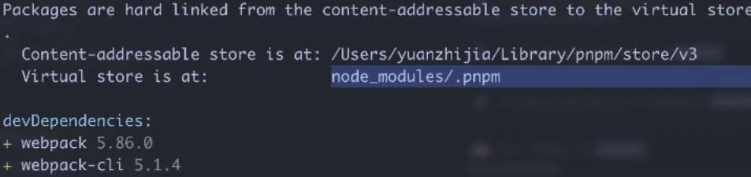
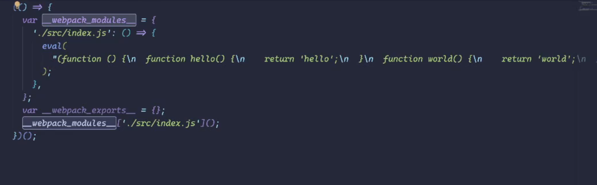
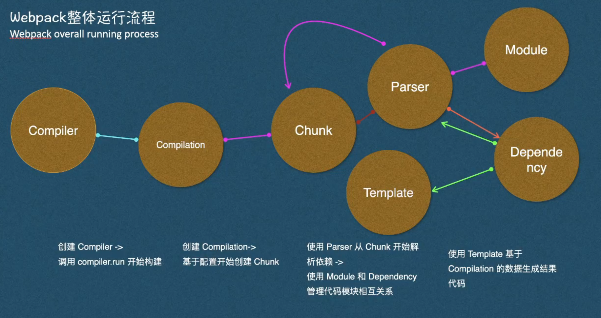

# webpack 核心原理 


v8-compile-cache 

去js 编译  loader（编译好）  plugin     webpack5 loader 换掉 js执行的逻辑   swc esbuild 


webpack 5  Prepack 

parcel 

treeshaking rollup

chache-loader

html-webpack-plugin 

pnpm 



npm  npm 一层套一层  

yarn a依赖b c依赖b 把b 提出来  版本不一样 b 就不拿了 


js 冷启动 -> handler

aws 

eval() 函数 编译的快 






- Compiler负责启动整个打包过程。

```text
1. Compiler（编译器）
当你在终端中运行webpack命令时，Webpack首先创建了一个Compiler对象。这个对象负责管理整个构建过程，它会读取webpack.config.js配置文件中的配置来初始化打包的参数。
```

- Compilation管理代码的编译和依赖解析。

```text
2. Compilation（编译过程）
创建Compiler后，Webpack会生成一个Compilation对象，它包含所有文件和模块的相关信息。

在这个阶段，Webpack会根据配置文件找到项目的入口文件index.js，并开始进行模块分析，构建代码依赖图。
```

- Chunk是代码的逻辑块，用于管理代码分割。

```text
3. Chunk（代码块）
Webpack会把项目的代码分割成多个Chunk（代码块），index.js会成为一个代码块。Chunk用于更好地组织代码和管理依赖关系。

在我们的例子中，index.js作为入口文件会生成一个初始Chunk，而util.js则作为另一个Chunk被引入，因为index.js依赖它。
```

- Parser会解析代码，找到模块和依赖。

```text
4. Parser（解析器）
Webpack内部使用Parser来分析每个Chunk中的代码。它会从index.js开始解析并找到import { add } from './util';这个语句。解析器发现index.js依赖于util.js，于是会把util.js的内容也纳入到整个构建过程中。

解析器会继续解析util.js的内容，并识别add函数的定义和其导出。
```

- Module和Dependency管理模块的导入导出及依赖关系。

```text
5. Module（模块）和 Dependency（依赖）
解析过程中，Webpack会将每一个文件视为一个模块（Module）。例如：

index.js是一个模块。
util.js也是一个模块。
Webpack会创建模块对象，并记录每个模块的依赖关系。在我们的例子中，index.js依赖于util.js，Webpack会将这种依赖关系存储在其依赖图中。
```

- Template是最后一步，生成最终的输出文件bundle.js。

```text
6. Template（模板）
在所有的代码和依赖解析完成后，Webpack会生成一个模板（Template）来最终输出文件。这一步骤会根据打包好的代码生成最终的bundle.js文件。

在这个bundle.js文件中，Webpack会把所有模块（index.js和util.js）打包成一个文件，并生成适当的代码来处理这些模块之间的依赖。
```


## 自定义babel

```js
const path = require("path");
const ConsoleLogOnBuildWebpackPlugin = require("./plugins/ConsoleLogOnBuildWebpackPlugin");
module.exports = {
  module: {
    rules: [
      {
        test: /\.js$/,
        exclude: /node_modules/,
        use: {
          loader: path.resolve(__dirname, "./loader/babel-index.js"),
          options: {
            presets: [["@babel/preset-env", { targets: "defaults" }]],
          },
        },
      },
    ],
  },
  plugins: [new ConsoleLogOnBuildWebpackPlugin()],
};

```

```js
const babel = require("@babel/core");
const acorn = require("acorn");
const MagicString = require("magic-string");
const walk = require("acorn-walk");

module.exports = function(content) {
  // 使用 acorn 解析时添加 sourceType: 'module'
  const ast = acorn.parse(content, {
    sourceType: "module", // 允许解析 ES6 模块语法
    ecmaVersion: 2020, // 指定 ES 版本
  });

  const code = new MagicString(content);

  // 使用 acorn-walk 遍历 AST
  walk.simple(ast, {
    VariableDeclaration(node) {
      const { start } = node;
      console.log(start, start + node.kind.length, "VariableDeclaration");
      code.overwrite(start, start + node.kind.length, "var");
    },
  });
  return code.toString();
};

```

## 手写webpack
