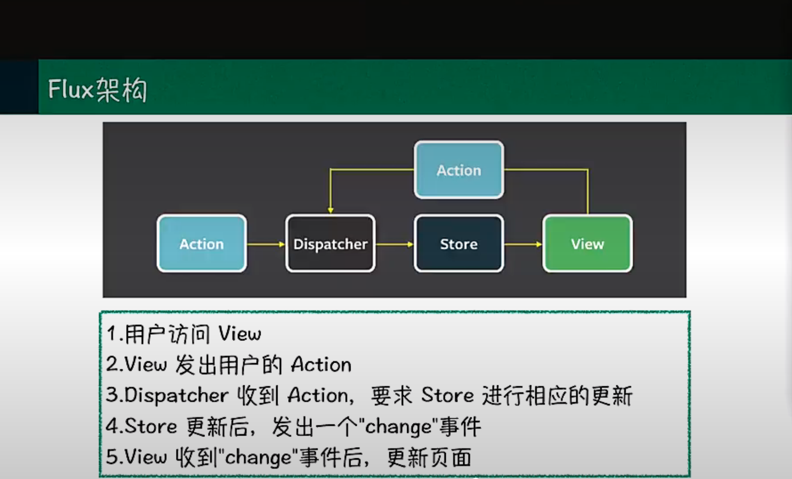
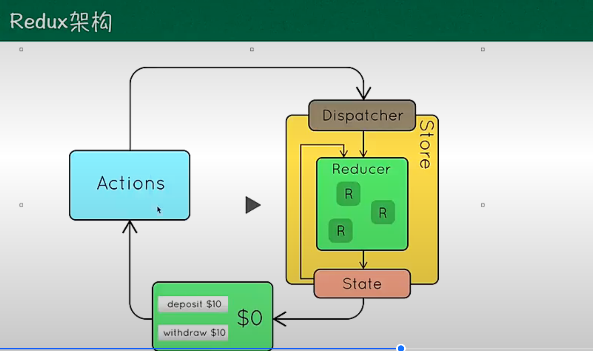
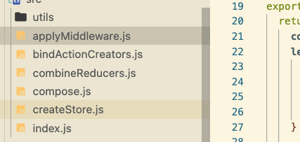

# 手写Redux和Vuex

1. Redux/React⾃身良好的架构、先进的理念，加上⼀系列优秀的第三⽅插件的⽀持，是React/Redux成功的关键所在。
2. 可以将React看作输⼊为state，输出为view的“纯”函数。
3. 范畴论将世界抽象为对象和对象之间的联系，Redux将所有事件抽象为action。
4. Container 中含有 value 和 map 两个属性，⽽修改 value 的⽅法只有 map，在操作完value 后将新值放回 Container 中。

> // 如何操作或修改 value 由 f 给出。

```js

store -> container
currentState -> __value
action -> f
currentReducer -> map
middleware -> IO functor (解决异步操作的各种问题。)
```

5. store 是⼀个容器含有 state 和 reducer，

> reducer是⼀个纯函数，它可以查看之前的状态，执⾏⼀个action并且返回⼀个新的状态。




这从 store 的创建语句 enhancer(createStore)(reducer, preloadedState) 可以很明显的得出。⽽修改 store 中的 currentState 的唯⼀⽅法是使⽤ currentReducer，并且currentState 在修改完后将新值依然存放在 store 内。


## 如何修改 currentState 是根据⽤户操作 action



1. applyMiddlewar.js 使⽤⾃定义的 middleware 来扩展 Redux
2. bindActionCreators.js 把 action creators 转成拥有同名 keys 的对象,使⽤时可以直接调⽤ 
3. combineReducers.js ⼀个⽐较⼤的应⽤，需要对 reducer 函数 进⾏拆分，拆分后的每⼀块独⽴负责管理 state 的⼀部分
4. compose.js 从右到左来组合多个函数，函数编程中常⽤到
5. createStore.js 创建⼀个 Redux Store 来放所有的state
6. utils/warnimng.js 控制台输出⼀个警告，我们可以不⽤看
7. React可以看做纯函数 固定的state输⼊输出组件


## Redux Store的基础

`store` 是⼀个单⼀对象：

- 管理应⽤的 state
- 通过 store.getState() 可以获取 state
- 通过 store.dispatch(action) 来触发 state 更新
- 通过 store.subscribe(listener) 来注册 state 变化监听器
- 通过 createStore(reducer, [initialState]) 创建


## React-Redux的原理

`Provider `其实就只是⼀个外层容器，它的作⽤就是通过配合 `connect` 来达到跨层级传递数
据。使⽤时只需将Provider定义为整个项⽬最外层的组件，并设置好store。那么整个项⽬都
可以直接获取这个store。它的原理其实是通过React中的Context来实现的。它⼤致的核⼼
代码如下：

```js

```