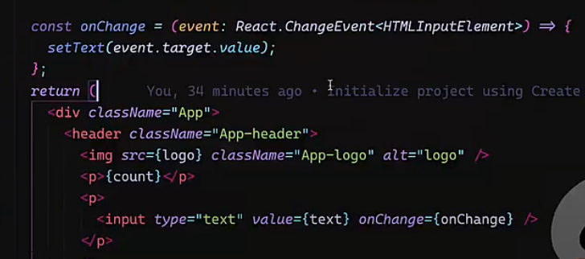

# 手写Recoil

> Stateful

```js
import { useState, useEffect, useCallback } from "react";
// 定义一个接口 Disconnect，用于取消订阅
interface Disconnect {
  disconnect: () => void; // 提供取消订阅的方法
}
class Stateful<T> {
  constructor(protected value: T) {}
  private listeners = new Set<(value: any) => void>(); // 存储监听器的集合
  public set(value: T) {}
  // 订阅状态变化，返回一个用于取消订阅的对象
  public subscribe(callback: (value: T) => void): Disconnect {
    this.listeners.add(callback); // 添加监听器
    return {
      disconnect: () => {
        this.listeners.delete(callback); // 从集合中删除监听器
      },
    };
  }
  // 获取当前状态快照
  public snapshot(): T {
    return this.value;
  }
  public emit() {
    console.log("状态更新", Math.random());
    for (const listener of Array.from(this.listeners)) {
      listener(this.snapshot()); // 通知所有监听器
    }
  }
  protected update(value: T) {
    if (this.value !== value) {
      this.value = value;
      this.emit();
    }
  }
}
class Atom<T> extends Stateful<T> {
  public setState(value: T) {
    super.update(value);
  }
}

class Selector<T> extends Stateful<T> {}

// 基础状态
export function atom<V>(value: { key: String; default: V }) {
  return new Atom(value.default);
}

// 相当于action
export function selector() {}

function tuplify<T extends unknown[]>(...elements: T): T {
  return elements;
}
// 可以改变基础状态
export function useRecoilState<T>(atom: Atom<T>) {
  // react 组件更新

  const value = useRecoilValue(atom);
  //   return ([value, (value: T) => atom.setState(value)] as const;
  return tuplify(
    value,
    useCallback((value: T) => atom.setState(value))
  );
}
// 获取基本状态不改变 基础状态变化更新 （双向）
export function useRecoilValue<T>(value: Stateful<T>) {
  const [, updateState] = useState({});

  const forceUpdate = () => updateState({}); // 空对象触发更新
  useEffect(() => {
    const { disconnect } = value.subscribe(forceUpdate); // 订阅状态变化
    return () => {
      disconnect(); // 组件销毁时取消订阅
    };
  }, [value]);
  return value.snapshot();
}


```



