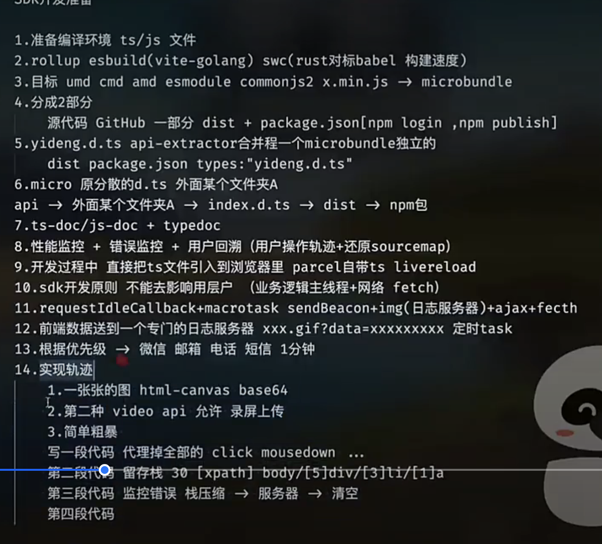
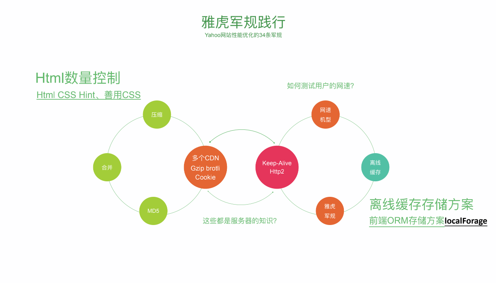
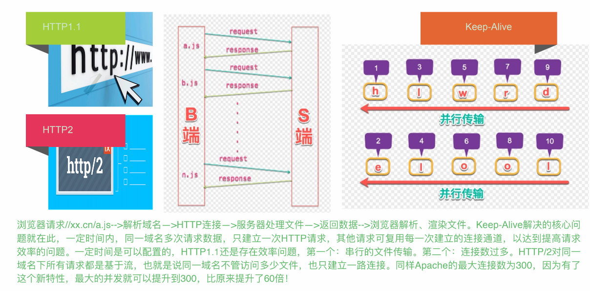
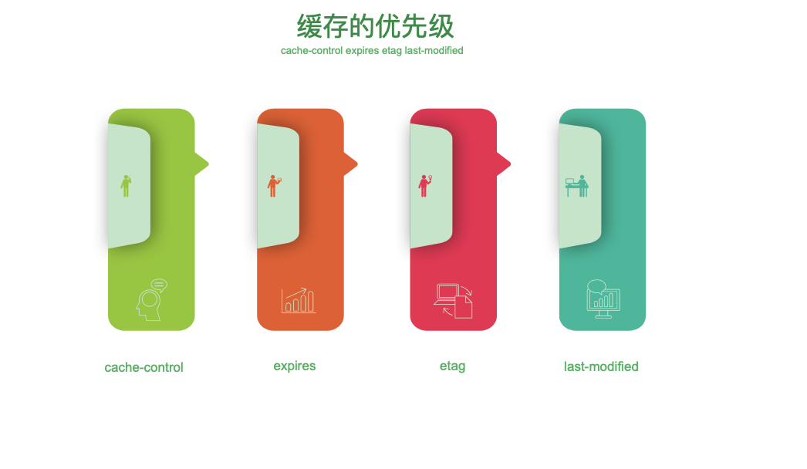
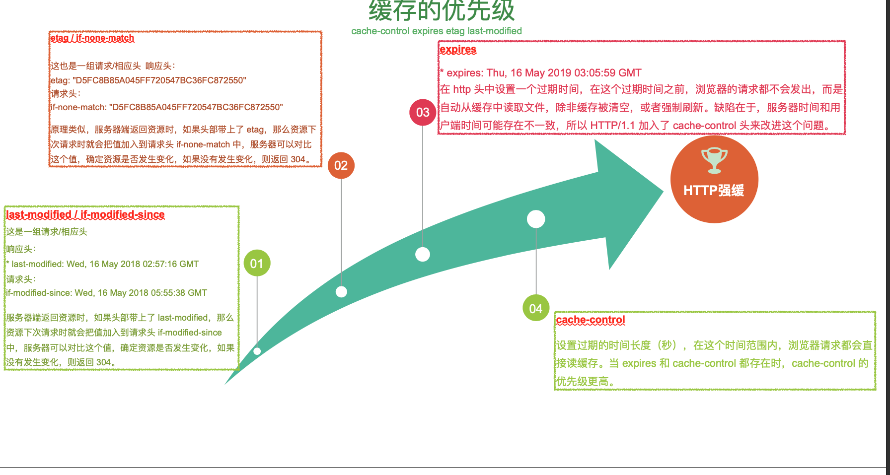
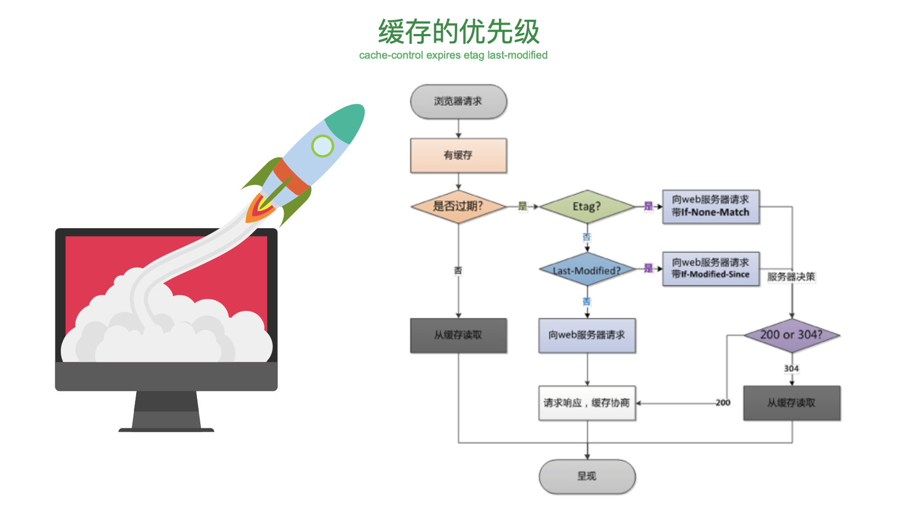
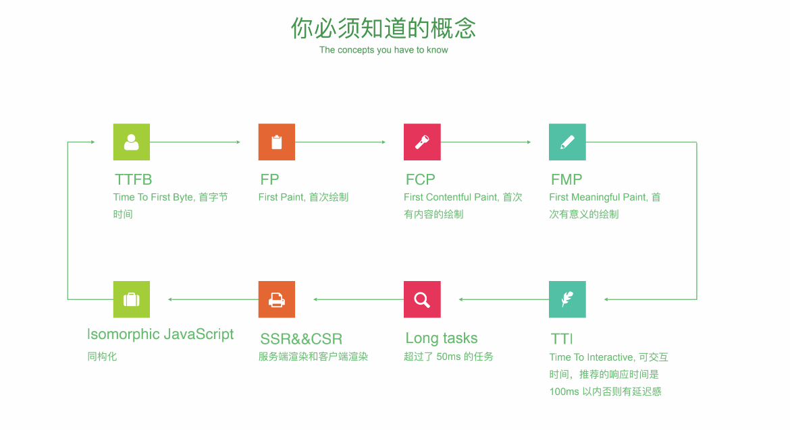
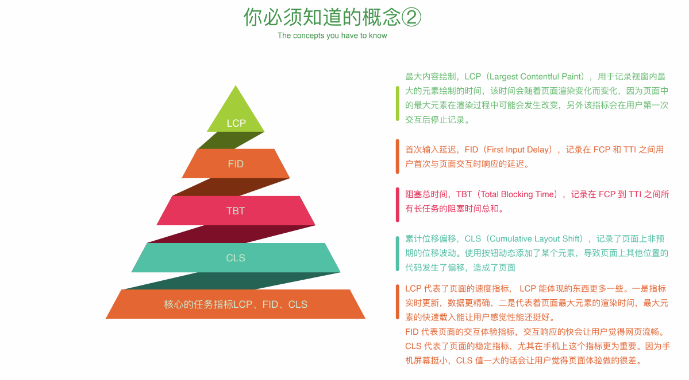
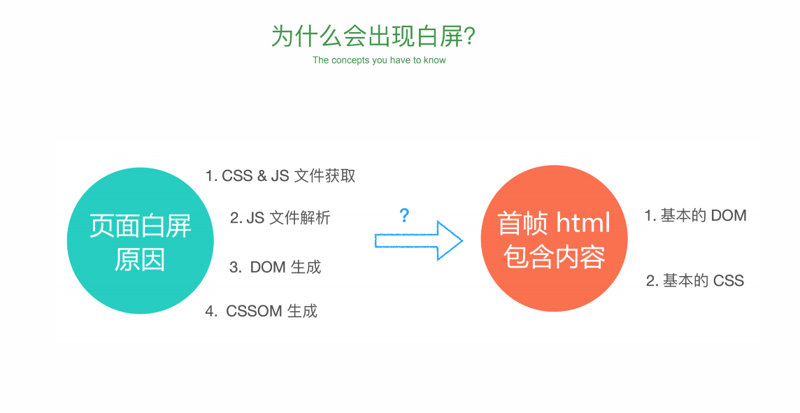
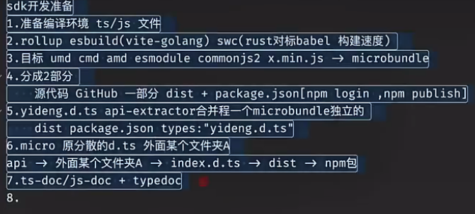

# 使用TS从0实战性能监控SDK




## 回溯方案 

- 一张张图 html- canvas base64 30ms 渲染帧率
- 第二种 video api 允许录屏上传 
- 留存栈 [xpath] 代理掉用户 


## 性能优化 


















## 性能指标 

- sdk 开发准备 

    - 准备编译环境 ts/js 文件

    - rollup esbuild(vite-golang) swc(rust 对标babel 构建速度)

    - 目标 umd cmd esmodule commonjs min.js 



## microbundle

Microbundle 是一个非常轻量级的打包工具，专门用于构建小型 JavaScript 模块/库，它是基于 Rollup 的零配置打包器。

```text
自动生成多种模块格式 (ESM, CommonJS, UMD)
自动压缩代码
TypeScript 支持
JSX 支持
支持 CSS 模块化
```
### 常见配置

```js
{
  "source": "src/index.ts",      // 入口文件
  "main": "dist/index.js",       // CommonJS 输出
  "module": "dist/index.mjs",    // ES Module 输出
  "umd:main": "dist/index.umd.js", // UMD 输出
  "scripts": {
    "build": "microbundle",
    "dev": "microbundle watch"
  }
}
```
### 常见命令

```text

# 监听模式
microbundle watch

# 指定入口文件
microbundle src/index.js

# 指定输出格式
microbundle --format modern,cjs,umd

# 不压缩输出
microbundle --no-compress
```


## api-extractor 

API Extractor 是微软开发的一个工具，主要用于 TypeScript 项目的 API 管理和文档生成。我来详细介绍：

### 核心用途：


- 生成 API 文档
- 生成 .d.ts 类型声明文件
- API 兼容性检查
- 提取 API 签名
- 生成 API 报告


### 配置文件示例 (api-extractor.json)：

```js
{
  "$schema": "https://developer.microsoft.com/json-schemas/api-extractor/v7/api-extractor.schema.json",
  "mainEntryPointFilePath": "<projectFolder>/lib/index.d.ts",
  "docModel": {
    "enabled": true
  },
  "dtsRollup": {
    "enabled": true,
    "untrimmedFilePath": "./dist/<unscopedPackageName>.d.ts"
  },
  "apiReport": {
    "enabled": true,
    "reportFolder": "<projectFolder>/temp/"
  }
}
```


## typedoc 