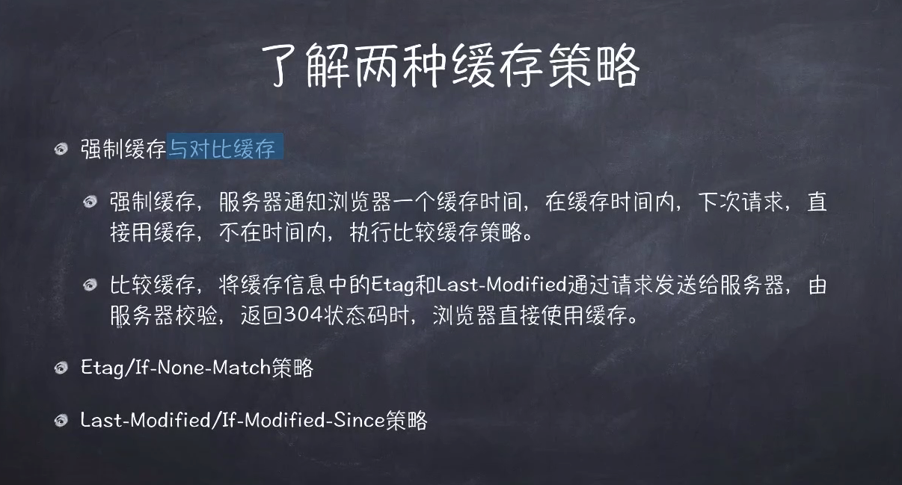

# Http哪些事

## 当我们输入网址后发生了什么

### Http 请求模型 





- no-cache 和no-store

```js
// no-cache 示例: 内容可以缓存，但每次使用前需要验证
app.get('/profile', (req, res) => {
  res.set('Cache-Control', 'no-cache');
  res.json({ user: 'John', lastUpdate: new Date() });
});

// no-store 示例: 内容完全不缓存，适合敏感数据
app.get('/creditcard', (req, res) => {
  res.set('Cache-Control', 'no-store');
  res.json({ cardNumber: '****', cvv: '***' });
});
```

## HTTP协议详解

## Cookie与Session

## HTTP缓存机制
