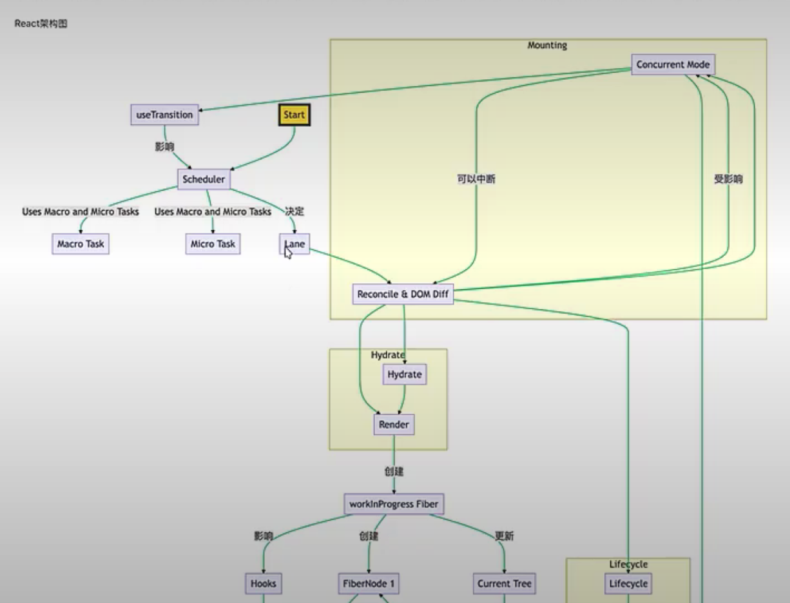
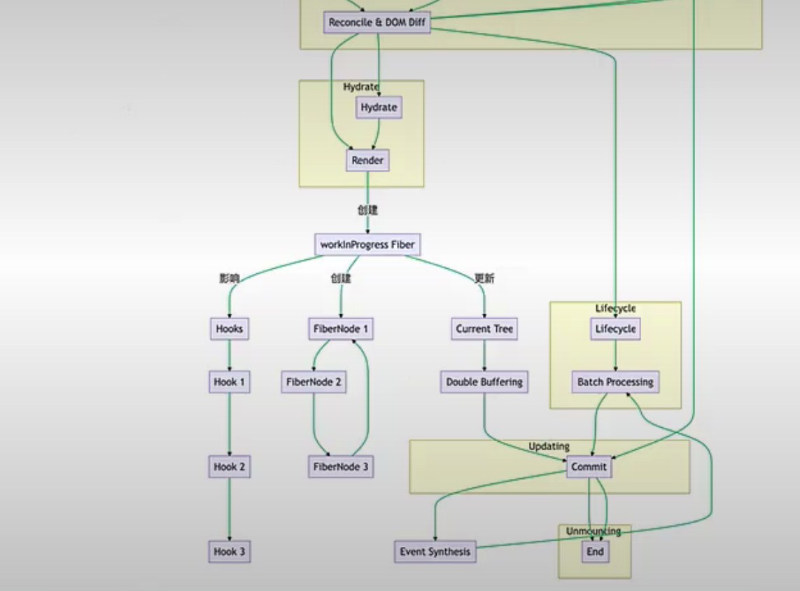
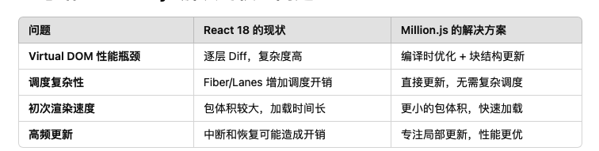
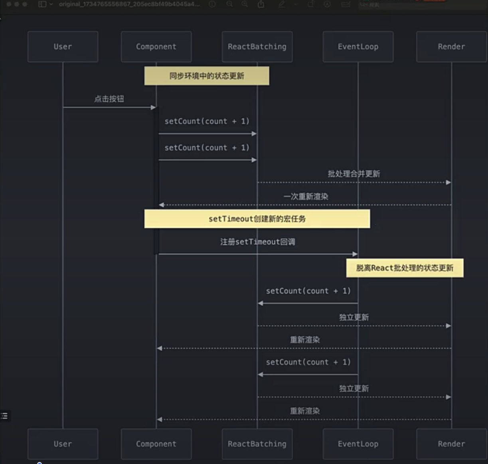

# 前端面试小册子


## React30问 




### React16时间分片的原理

#### 时间分片的核心思想

通过一个大任务切分成多个小任务，处理小任务过程中，react会将时间交给浏览器进行高优先级任务，使得用户不会因为单一任务阻塞而感到卡顿。


#### 工作原理 

1. 任务切片 

React 将渲染任务拆分成多个可中断的工作单元（Work Unit），每次只处理一个小的工作单元。

在任务执行过程中，React 会定期检查是否有更高优先级的任务需要处理。
> 
2. 调度机制

React 使用一个调度器（Scheduler），它基于任务的优先级决定任务的执行顺序。
React 会在空闲时间（Idle Time）执行低优先级任务，如果出现高优先级任务，会暂停当前的任务以处理高优先级任务。


3. 请求动画帧与消息通道

React 依赖浏览器的 requestIdleCallback 或 MessageChannel 来实现任务的切片和调度：
    requestIdleCallback：让 React 在浏览器的空闲时间执行任务。
    MessageChannel：提供微任务的方式，允许更精确的调度。

4. 中断与恢复

如果一个任务被中断，React 会保存当前任务的进度，当有空闲时间时恢复继续执行。

这种中断和恢复的能力使 React 能够更好地处理高优先级任务（如用户输入）。


#### 关键机制

##### Fiber架构

react的时间分片的核心依赖于Fiber架构，是react16引入新的协调算法 

> Fiber是一种数据结构 

1. 每个react 组件对应一个Fiber节点，记录组件的状态和更新任务 
2. Fiber树通过链表实现（单向链表），方便任务的中断和回复。

> 双缓存 Fiber 树
当前屏幕上显示的 Fiber 树称为 current。
正在计算中的 Fiber 树称为 workInProgress。
React 在更新完成后会用 workInProgress 替换 current


> 优先级调度 

React为每个更新分配优先级，常见的优先级：

1. 高优先级任务：用户输入，动画更新 

2. 低优先级任务： 后台数据加载，列表渲染


任务根据优先级放入到任务呢队列中，高优先级打断低优先级


## 浏览器 不支持 requestIdleCallback react 是怎么解决的

React 并不完全依赖 requestIdleCallback。它采用了分层的策略：

    优先使用 requestIdleCallback，因为它能精准利用浏览器的空闲时间。
    回退到性能较好的 MessageChannel。
    在最差的情况下使用 setTimeout 作为最终的兼容方案。


## 状态撕裂是如何产生的，如何解决的

### 状态撕裂的常见原因

1. 多次渲染导致的状态不一致

React 在 并发模式（Concurrent Mode） 中允许任务的中断和恢复，可能导致某些组件更新了状态，而其他组件还未完成渲染，从而导致状态的不同步。

2. 多来源状态的管理

如果状态通过多种方式共享（例如直接使用全局变量或不正确的上下文管理），可能会导致多个组件对同一个状态的不同视图。


3. 不正确的上下文（Context）使用

当 React 的 useContext 不能正确感知状态更新时，某些订阅了相同上下文的组件可能不会重新渲染，从而显示旧的状态。

4. 异步更新和中断

在 React 的并发模式下，异步任务可能在更新中被中断，导致状态未同步完成。


## React 的渲染和更新流程

1. 初始阶段：
    调和（Reconcile）和 Diff 找到需要更新的部分。
    构建新的 workInProgress Fiber 树。
2. 中间阶段：
    更新 Fiber 树，同时执行 Hooks 和生命周期方法。
    使用双缓冲机制确保安全更新。
3. 提交阶段：
    批量处理并提交 DOM 更新，处理事件合成。
    完成组件的卸载和清理。

## Million 解决了18什么问题 ？




Million.js 是一个轻量级、性能优先的 Virtual DOM 库，旨在替代 React 的 Virtual DOM，同时提供比 React 更快的渲染性能。

引入和DOM（Block vetual Dom）具体的事情和原理

自动memo 

    对动态节点和静态节点的优化 

对于大类型重复节点的优化

1. React 18 的问题

a. 并发模式的复杂性

React 18 引入了 Concurrent Mode（并发模式），通过任务中断和优先级调度提升性能，但这也带来了复杂性：

任务调度开销：
    React 的 Fiber 架构和 Lanes 优先级调度需要维护大量状态，导致调度成本增加。
中断恢复的代价：
    在复杂组件树中，任务被中断和恢复会带来额外的性能开销。


b. Virtual DOM 的性能瓶颈

    React 的 Virtual DOM 通过 Diff 算法（Reconcile）来比较新旧状态，但对于大规模更新或频繁更新场景，Diff 操作可能变得非常耗时。

    特别是列表渲染和动态内容更新时，React 的逐层对比可能会降低性能。


## memo 解决了什么问题 

解决不必要的渲染导致性能的浪费 ， memo 只做了浅比较

vue中使用了静态节点，


## 什么是HOC 

高阶组件（Higher-Order Component，HOC）是 React 中的一种高级技巧，用于复用组件逻辑。它本质上是一个函数，接收一个组件作为参数，返回一个新的组件。这个新组件通过将原始组件包装在容器组件中，增强了其功能，而不修改原始组件的实现。


## 什么时候应该使用类组件而不是函数组件？

1. 错误边界 
    需要在类组件中实现 static getDerivedStateFromError() 和 componentDidCatch() 方法。

2. 特殊的生命周期方法
    需要精细控制组件更新过程或依赖于 shouldComponentUpdate() 方法进行性能优化时。

3.  PureComponent 和 shouldComponentUpdate

```js
import React, { PureComponent } from 'react';

class MyComponent extends PureComponent {
  render() {
    console.log('Rendering MyComponent');
    return <div>{this.props.text}</div>;
  }
}

export default function App() {
  const [text, setText] = React.useState('Hello');

  return (
    <div>
      <button onClick={() => setText('Hello')}>Update Text</button>
      <MyComponent text={text} />
    </div>
  );
}

```

```js
import React, { Component } from 'react';

class MyComponent extends Component {
  shouldComponentUpdate(nextProps, nextState) {
    // 只有当 text 发生变化时，才允许重新渲染
    return nextProps.text !== this.props.text;
  }

  render() {
    console.log('Rendering MyComponent');
    return <div>{this.props.text}</div>;
  }
}

export default function App() {
  const [text, setText] = React.useState('Hello');

  return (
    <div>
      <button onClick={() => setText('Hello')}>Update Text</button>
      <MyComponent text={text} />
    </div>
  );
}

```

## React中如何创建Refs?创建Refs的方式有什么区别？ 

### 什么是 Refs？

在 React 中，**Refs（引用）**是一个允许我们直接访问 DOM 元素或组件实例的方法。通过 Refs，可以：

    获取并操作 DOM 元素
    存储任何可变值，不触发组件重新渲染
    访问组件实例的方法和属性（在类组件中）


React 提供了多种方式来创建 Refs，主要包括：

    1、React.createRef()（用于类组件）
    2、useRef() Hook（用于函数组件）
    3、回调 Refs
    4、forwardRef 和 useImperativeHandle（用于转发和自定义 Refs）    


## createContext解决了什么问题？React父组件如何与子组件通信？子组件如何改变父组件的状态？    

createContext 是 React 提供的上下文（Context）API，用于在组件树中共享数据，而无需手动地通过每层组件传递 props。它主要解决了以下问题：

避免“属性逐层传递”（Props Drilling）问题：

**问题描述：**在组件嵌套层级较深的情况下，父组件需要将数据通过 props 一层一层地传递给深层的子组件，即使中间的组件并不需要这些数据。

**影响：**导致中间组件的代码冗余，增加了维护成本，使组件间的耦合度提高。

实现全局状态共享：

**应用场景：**主题切换、多语言支持、用户身份信息等需要在整个应用程序中共享的数据。

**优势：**通过 Context，可以在任意深度的组件中访问共享的数据，无需繁琐的 props 传递。

## React.memo 有什么用途，useMemo 和 memo 的区别是什么？

> React.memo 是 React 提供的一个高阶组件（Higher Order Component，HOC），用于**记忆（Memoization）**函数组件的渲染结果。当组件接收到相同的 props 时，React.memo 可以避免不必要的重新渲染，提升性能。

> useMemo 是 React 提供的一个 Hook，用于在函数组件中记忆计算结果。它会在依赖项发生变化时重新计算值，避免每次渲染都执行耗时的计算。

## useCallback和useMemo有什么区别？

> useCallback：用于记忆函数，避免函数在组件每次渲染时都被重新创建。 memoized 函数

> useMemo：用于记忆计算结果（值），避免在依赖未变化时重复计算。memoized 值

## useState是同步还是异步 

React18版本以前同步环境中异步，在异步环境中同步。在React18以后，setState不论是同步还是异步都是异步的



## 如何选择状态管理库 什么是状态撕裂 


