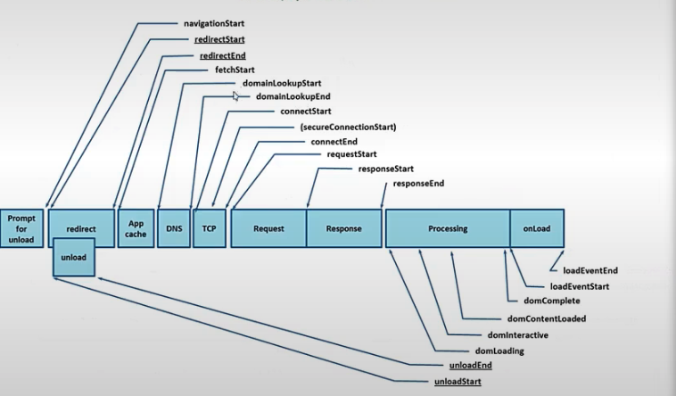
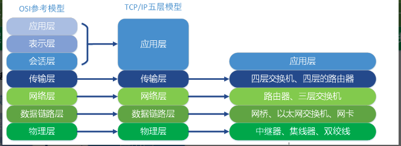
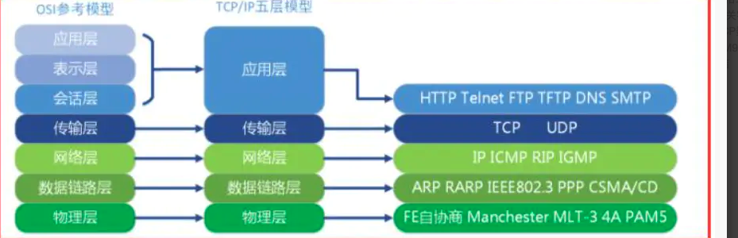

# 前端面试小册子-7

## HTTP 缓存策略

HTTP 缓存策略是一种用来提高网络应用性能的技术，主要目的是减少数据的重复传输，减轻服务器负担，加快客户端的加载速度。不同的缓存策略有各自的特点和适用场景，主要包括：

### 1. 强缓存（Strong Cache）
- **实现方式**：通过 `Expires` 和 `Cache-Control` HTTP 头实现。
- **区别与作用**：
  - `Expires`：指定资源的过期时间，是一个绝对时间点（例如：Thu, 01 Dec 2022 16:00:00 GMT），但可能受本地时间的设置影响，不够精准。
  - `Cache-Control`：更灵活，通过 `max-age` 指定资源的有效期（相对时间，例如 3600 秒）。支持更多指令如 `no-cache`、`no-store`、`must-revalidate` 等。
- **解决的问题**：减少不必要的网络请求，当资源未过期时，直接从本地缓存读取。

### 2. 协商缓存（Negotiated Cache）
- **实现方式**：通过 `Last-Modified` / `If-Modified-Since` 和 `ETag` / `If-None-Match` HTTP 头实现。
- **区别与作用**：
  - `Last-Modified` / `If-Modified-Since`：服务器返回资源的最后修改时间，客户端请求时带上 `If-Modified-Since`，如果资源未更改，则返回 304 状态码，使用本地缓存。
  - `ETag` / `If-None-Match`：更精确，服务器生成资源的唯一标识（ETag），客户端请求时带上 `If-None-Match` 标识，如果标识未匹配，返回 304，使用缓存。
- **解决的问题**：更精准地控制缓存，适用于资源可能会经常变化的情况。

### 3. 不缓存策略
- **实现方式**：通过设置 `Cache-Control: no-store` 或 `Cache-Control: no-cache` 实现。
- **解决的问题**：确保每次都从服务器获取最新版本，适用于高度敏感的数据（例如：用户隐私、交易数据）。

### 选择不同的缓存策略取决于应用场景：
- 对于不经常变化的资源（如网站的 Logo、CSS 文件等），使用强缓存策略较为适合。
- 对于频繁变化的数据（如用户个人信息），推荐使用协商缓存。
- 对于非常敏感的数据（如交易记录等），不建议缓存。
- 对于动态生成的页面（如首页等），可以适当关闭缓存。例如 `main.html` 文件可以缓存，但 `index.html` 通常不启用缓存。

## Chrome 浏览器的多进程架构

Google Chrome 浏览器采用了多进程架构，主要包括以下五种进程：

1. **主进程（Browser Process）**  
2. **渲染进程（Renderer Process）**  
3. **插件进程（Plugin Process）**  
4. **GPU 进程（GPU Process）**  
5. **扩展进程（Extension Process）**  

---

### 主进程下的相关线程

- **用户界面线程**  
  处理和显示浏览器的界面，例如地址栏、书签、前进/后退按钮等。
  
- **进程间通信模块**  
  负责进程间的通信，包括浏览器与渲染进程之间的通信。
  
- **网络线程**  
  负责加载网页、发送网络请求、接收网络数据等。
  
- **存储线程**  
  负责对文件的读取和写入操作（包括 Cookie、书签、缓存等）。

---

### 渲染进程下的线程

- **主线程**  
  负责解析 HTML、CSS，构建 DOM 树，布局和执行 JavaScript，处理用户交互事件。
  
- **渲染线程**  
  负责页面渲染与绘制页面内容。
  
- **合成线程**  
  负责合成图层，进行页面的更新。
  
- **WebGL 线程**  
  负责 3D 绘图的处理。

---

### 插件进程下的线程

- **插件线程**  
  负责插件逻辑的执行，例如 Adobe Flash。

---

### GPU 进程下的线程

- **GPU 线程**  
  只有在开启硬件加速时才会存在的独立 GPU 进程或线程，用于图像绘制加速和 3D 计算。

---

### 扩展进程下的线程

- **扩展线程**  
  负责运行 Chrome 扩展的后台脚本。

---

### 多进程简要说明

在 Chromium 的多进程架构中，通常存在以下 5 种进程：

1. **主进程**  
2. **渲染进程**  
3. **扩展进程**  
4. **插件进程**  
5. **GPU 进程**

其中，**渲染进程**可以有多个：通常一个渲染进程对应一个标签页（或多个标签页，具体取决于实际配置和场景）。  
不过，在某些情况下，Chrome 可能会调整策略，例如一个渲染进程中同时处理多个标签页。

css 会堵塞js 

## 网页渲染原理

### 1. 网页的渲染流程

1. **DOM 元素更新后**  
   - 触发 `Recalculate Style`（重新计算样式）
2. **样式计算（Recalculate Style）**  
   - 解析 CSS，计算各元素最终样式。
3. **布局（Layout）**  
   - 根据计算的样式确定元素在页面中的位置和大小（构建布局树）。
4. **绘制（Paint）**  
   - 将布局结果转换为具体的像素绘制指令。
5. **GPU 加速**  
   - CPU 负责处理 UI、运行 JavaScript 等，GPU 负责图形加速，提升渲染效率。
6. **合成图层（Composite Layers）**  
   - 将不同图层进行合成，以生成最终的页面画面。常见过程包括：
     1. **生成图块（Tile）**  
        - 例如将页面内容切割成 256×256 或 512×512 的图块纹理。
     2. **合成视口（Viewport）**  
        - 确定可视区域。
     3. **光栅化（Raster）**  
        - 将图块内容转换成位图。
     4. **组合绘制（DrawQuad）**  
        - 将多个图层的图块按顺序、位置进行合成并裁剪。
     5. **绘制到目标缓冲**  
        - 将合成结果输出到屏幕或其他缓冲区。

---

### 2. Layout、Paint、Composite Layers

- 在渲染过程中，**Layout**（布局）、**Paint**（绘制）与 **Composite Layers**（合成图层）是相对独立但又相互关联的三个阶段。  
- 不同的页面操作会触发不同阶段的重新计算或绘制，影响页面的性能。

---

### 3. 可能触发重排（Reflow）或重绘（Repaint）的操作

- **定位**（`position`）
- **变换**（`transform`）
- **CSS3 动画/过渡**（如 `transition`, `animation`）
- **`canvas`**、**`video`** 等多媒体元素
- **`overflow`** 属性（当滚动或溢出时）
- 其他会影响页面布局或样式的操作。

---

### 4. 常见性能优化要点

- 使用 **`will-change: transform;`** 等方式，提前让浏览器为某些元素做合成层处理，减少重复布局和绘制。  
- 对 2D、WebGL、`transform`、CSS3 过渡/动画 等场景，可利用 GPU 加速。

---

### 5. 常见困惑点

- **`offset*`、`scroll*`、`client*`、`width` 等属性的访问**  
  - 这些属性往往会触发浏览器的同步布局，以获取最新的数值，可能造成性能瓶颈。  
  - 建议在可能的情况下减少对这些属性的频繁访问或集中处理。

---

### 6. `requestAnimationFrame`

- 使用 **`requestAnimationFrame`** 可以让 JavaScript 动画与浏览器的刷新机制同步，在下一帧执行时，与浏览器的绘制节奏保持一致，从而提高性能和流畅度。  
- 常见的渲染循环流程示意：**`requestAnimationFrame -> (下一帧) -> gpu.js`**（GPU 渲染加速）。

## CON 是什么?播述下 CON 原理?为什么要用 CDN?

答案:
- CDN(Content Deivery Netmok，内器分发网络)是一个高度分布式的平台，其主委目的是通过地理代化来提高网页、应用程序和其地网络服务的访问速度和可章性。CDN通过以下几个核心机制和原理实现这一目标:

### CDN的核心原理

- 1.节点分布(Edge Servers):

CDN由遍布全球的服务器组成，这些服务器(被称为“边缘服务器”)位于用户访问量大的地区或网络交换的关键点。

- 内容援存:

这些边缘服务器会缓存原始内容的副本，包括HTML文件、样式表、JavaScript文件、图片和视频等。

- 智能CDN解析:

  - 当用户尝试访问使用CDN的网站时，DNS请求会被重定向到最近的边缘服务器。这是通过一种移为智能DNS解析的技术实叹的，该技术考虑了用户的地理位置、服务器的响应时间、可用性和负载情况。
- 内容优化:#
  - CDN不仅缓存内容，还可以进行内容优化，如压圆片、最小化CSS和JavaScrpt文件，进一步加快内容加载速度。
- 动态内容和静态内容分离:
  - CDN通常用于缓存静态内容，但一些先进的CDN也支持动态内容的优化和分发

- 负载均衡:
  - CDN通过分布式网络架构实现负载均衡，有效地分配用户请求到多个服务器，减少单个服务的负担。
- 网络优化:
  - 通过选择最优路径传输数器，减少了数据包的往返时间(RTT)和整体网路。

### 为什么使用CDN?

- 提高性能:
  - 将内容存储在用户附近可以显着滩少延遇。提高数探加独速度。
  - CDN不携得主城名的cootie减少请求头的体。

- 可靠性和可用性:
  - 整使源服务若遇到问题，用户通常仍司通过CDN提存的内容访问网站，这提高了同站的可用性和可靠性。3、 安全性增强:
  - CON像提供安全层，如DDoS攻击防护、数据加密和安全证书管理。
- 降低成本
  - CDN减少了对源服务器的需求，降低了数据中心的运营成本，特别是在国际流量方面，
- 扩展性:
  - 随着流量的增长，CON可以更容易地扩展以满足需求，而无需昂费的基础设施投资。
  
  因此，CDN是提高网站性能和用户体验的关键技术，特别是对于有着大量国际流最和需委快过内容交付的网站来说。通过优化数媒的交付，CON有助于提高访问边度，降低珏迟，增提安全性，并冠少原始险务越的负担，

## CDN(内容分发网络)优化静态资源加载速度的机制

CDN（内容分发网络）通过多种机制优化静态资源的加载速度，改善用户访问体验，同时也提高了网站的整体性能和可用性。以下是主要优化机制：

### 1. 地理位置优化
- **边缘机存**：CDN 在全球范围内部署多个边缘服务器，将静态内容（如图片、CSS/JS 文件、视频等）缓存到这些服务器上，让用户能从地理位置上最近的服务器获取资源，显著减少了数据传输距离和延迟。

### 2. 缓存策略
- **缓存过期控制**：通过设置合理的缓存过期时间（如 `Cache-Control` 和 `Expires` 头）。CDN 确保用户设备能够缓存内容，减少重复下载。
  - **更新机制**：当资源发生变化时，CDN 可以快速失效旧内容，并更新新的内容，确保用户总是获取最新的资源。

### 3. 内容优化
- **压缩**：CDN 可以自动压缩静态资源，如使用 `gzip` 或 `Brotli` 压缩 HTML、CSS 和 JavaScript 文件，减小文件大小，加快传输速度。
- **图片优化**：对图片进行格式转换（如 `WebP`），进行压缩和大小调整，根据用户设备和浏览器系统提供最优化的图片。

### 4. HTTP/2 和 HTTP/3 支持
- **多路复用**：通过支持 HTTP/2 和 HTTP/3，CDN 允许在单个连接上传输多个请求和响应，减少了连接建立的开销和队头阻塞问题。
- **服务器推送**：HTTP/2 的服务器推送功能允许服务器主动发送资源，减少额外的往返延迟。

### 5. TCP 优化
- **长连接**：通过使用 TCP 长连接，减少了频繁的连接建立和关闭所需的时间和资源。
- **TCP 加速**：一些 CDN 还使用特定的算法来优化 TCP 传输，如更快的拥塞控制和恢复机制。

### 6. 负载均衡
- **智能路由**：CDN 通过实时监测网络条件和服务器性能，动态地将用户请求路由到最优的服务器，确保高效的内容分发。

### 7. 安全性增强
- **DDoS 保护**：通过分散流量负载，CDN 能够主动抵御大规模的分布式拒绝服务（DDoS）攻击，保证资源的可用性。
- **TLS/SSL**：CDN 通常提供 TLS/SSL 加密，确保数据传输的安全性。

通过这些机制，CDN 提高了静态资源的加载速度，改善了用户的访问体验，同时也提高了网站的整体性能和可用性。

## 浏览器解析 HTML 文件的过程

浏览器解析 HTML 文件的过程是一个复杂且精细的操作，通常包括以下主要步骤：

### 1. 下载 HTML 文件
- 当用户访问一个网页时，浏览器首先向服务器发送请求，下载 HTML 文件。

### 2. 解析 HTML / 构建 DOM
- **词法分析（Lexical Analysis）**：浏览器开始解析 HTML 文件中的文本，并将其转换成有意义的标记（tokens）。这个过程类似于语法分析。
- **构建 DOM 树**：浏览器根据这些标记构建文档对象模型（DOM），它是一个树形结构，代表了页面的内容和结构。

### 3. 处理 CSS 和 JavaScript
- **CSS 解析**：浏览器解析与 HTML 文件相关联的 CSS 文件，并根据这些样式信息创建 CSSOM（CSS 对象模型）。
- **JavaScript 执行**：如果 HTML 文件中包含或引用了 JavaScript，浏览器会解析并执行它。JavaScript 可以动态修改 DOM 和 CSSOM。

### 4. 构建渲染树
- 浏览器结合 DOM 和 CSSOM 构建渲染树（Render Tree）。渲染树是页面中所有可见元素的表示，包括它们的位置和样式信息。

### 5. 布局（Layout / Reflow）
- 浏览器计算渲染树中每个节点的确切位置和大小。这个过程也被称为 **回流（Reflow）**。

### 6. 绘制（Painting）
- 浏览器根据布局信息在屏幕上绘制所有的元素。这包括文本颜色、图片、边框等。

### 7. 合成（Compositing）
- 在某些情况下，页面的某些部分可能需要单独绘制，然后将它们合并到一起。这通常用于复杂的动画和视觉效果。

---

### 优化浏览器解析的注意事项
1. **CSS 的加载会影响 JS 的执行**：
   - 在 HTML 中，CSS 的解析会阻塞后续 JavaScript 的执行，因为 JavaScript 可能依赖于完整的 CSSOM。

2. **减少复杂的 HTML、CSS 和 JavaScript**：
   - 简化代码可以提高解析性能，避免页面加载缓慢的问题。

3. **充分利用浏览器优化**：
   - 现代浏览器对渲染过程进行了高度优化，但不良的代码结构可能影响渲染性能。

---

通过优化 HTML、CSS 和 JavaScript 的加载顺序以及合理使用异步加载机制（如 `async` 或 `defer`），可以进一步提升页面的渲染效率。

## 从输入 URL 到页面加载的全过程

让我们一步步深入了解从输入 URL 到页面加载的全过程：

### 1. 输入 URL
- 用户在浏览器的地址栏输入一个网址 (URL)。

### 2. DNS 查询
- **查找 IP 地址**：浏览器需要找到该 URL 的对应 IP 地址。
  - **本地缓存**：首先在本地缓存中查找，如果未找到，会向 ISP 的 DNS 服务器发起查询。
  - **递归查询**：如果 ISP 的 DNS 服务器也没有缓存，则通过递归查询，直到找到域名的授权 DNS 服务器，并获取到网站的 IP 地址。

### 3. 建立 TCP 连接
- **三次握手**：浏览器与服务器之间建立 TCP 连接，涉及一个称为“三次握手”的过程，确保双方都准备好进行数据传输。

### 4. TLS 握手（如果是 HTTPS）
- **建立安全连接**：如果 URL 是 HTTPS，浏览器与服务器之间会进行 TLS 握手，以建立加密的数据传输通道。

### 5. 发起 HTTP 请求
- **构建请求**：浏览器构建一个 HTTP 请求，并通过建立的 TCP 连接发送到服务器。请求通常包括 URL、请求方法（如 GET）、头信息等。

### 6. 服务器处理请求
- **接收和处理**：服务器接收到请求后，会根据请求的 URL 处理请求，可能涉及查询数据库、运行后端代码等操作。

### 7. 服务器发送响应
- **发送数据**：服务器向浏览器发送一个 HTTP 响应，包括状态码（如 200 OK）、响应头信息，以及请求的文档（通常是 HTML）。

### 8. 浏览器解析 HTML
- **构建 DOM 树**：浏览器开始解析 HTML 文件，构建文档对象模型（DOM）。
- **CSS 解析**：同时解析 CSS，构建 CSS 对象模型（CSSOM）。
- **JavaScript 处理**：如果 HTML 引用了 JavaScript 文件，浏览器会下载并执行它们，这可能会动态修改 DOM 和 CSSOM。

### 9. 渲染页面
- **生成渲染树**：浏览器结合 DOM 和 CSSOM 生成渲染树。
- **布局（Layout）**：计算渲染树中每个节点的位置和大小。
- **绘制（Painting）**：根据布局信息在屏幕上绘制出页面内容。

### 10. 加载额外资源
- **请求额外资源**：页面中可能包含图片、CSS 文件、JavaScript 文件等额外资源，浏览器会发出额外的 HTTP 请求来加载这些资源。

### 11. 页面加载完毕
- **完成加载**：当所有资源都被加载和渲染后，页面加载过程完成。

---

#### 注意事项
- **多次往返通信**：在整个过程中，浏览器和服务器之间可能会有多次往返通信。
- **资源复杂度**：现代网页可能包含大量的资源和复杂的脚本，这些因素可能影响加载时间。

---

通过优化资源加载顺序、减少不必要的资源请求、压缩文件以及使用缓存策略，可以显著提升页面加载性能，从而改善用户体验。

ClientHello：客户端 -> 服务器
ServerHello + Certificate：服务器 -> 客户端
密钥交换：客户端 -> 服务器
完成加密：双方确认并开始安全通信。

## DNS（域名系统）解析的具体过程

DNS（域名系统）解析是将人类可读的域名（如 `www.example.com`）转换为机器可读的 IP 地址（如 `192.0.2.1`）的过程。DNS 解析对于互联网访问至关重要。以下是 DNS 解析的详细步骤：

---

### 1. 用户输入域名
- 当用户在浏览器中输入一个网址（例如 `www.example.com`），DNS 解析过程就开始了。

---

### 2. 检查本地 DNS 缓存
- 浏览器首先检查自身的缓存中是否有该域名的记录。
- 如果没有找到，操作系统的 DNS 缓存会被检查。

---

### 3. 查询递归 DNS 服务器
- 如果本地缓存中没有找到记录，浏览器会向配置的递归 DNS 服务器（通常由用户的互联网服务提供商 ISP 提供）发送查询请求。
- **递归 DNS 服务器的角色**：
  - 如果其缓存中有对应的记录，会直接将结果返回给浏览器。
  - 如果没有记录，它会代表用户向互联网中的其他 DNS 服务器查询。

---

### 4. 根 DNS 服务器查询
- 如果递归 DNS 服务器没有缓存该记录，它会向根 DNS 服务器发送查询请求。
- **根 DNS 服务器的角色**：
  - 根 DNS 服务器是顶级的 DNS 服务器，负责管理顶级域名（如 `.com`、`.net`、`.org` 等）。
  - 它不会直接解析域名，而是告诉递归服务器哪个顶级域名服务器（TLD 服务器）负责该域名的扩展名（例如 `.com`）。

---

### 5. 顶级域名服务器（TLD）查询
- 接着，递归 DNS 服务器向相应的 TLD 服务器发送查询请求。
- **TLD 服务器的角色**：
  - 例如，对于 `www.example.com`，递归服务器会查询负责 `.com` 域名的 TLD 服务器。
  - TLD 服务器会返回该特定域名（在本例中为 `example.com`）的授权 DNS 服务器的地址。

---

### 6. 授权 DNS 服务器查询
- 最后，递归 DNS 服务器向授权 DNS 服务器发送请求。
- **授权 DNS 服务器的角色**：
  - 授权 DNS 服务器保存特定域名的详细记录。
  - 它会返回所请求的域名的 IP 地址。

---

### 7. 返回 IP 地址
- 递归服务器将 IP 地址返回给浏览器。
- 浏览器接收到 IP 地址后，可以向该地址发起网络请求，从而加载网页内容。

---

### 8. 缓存 DNS 记录
- **为了加快后续查询速度**：
  - 递归服务器和浏览器会缓存该 DNS 记录。
  - 每条记录都有一个“生存时间”（TTL），决定了它的缓存时间长度。

---

### 总结
DNS 解析看似复杂，但在现实中通常会在几毫秒内完成。其过程是现代互联网基础架构的重要组成部分，允许用户通过易记的域名访问网站，而无需记住复杂的 IP 地址。

## 常见的 HTTP 请求头及其作用

HTTP 请求头是在发送 HTTP 请求时，客户端（如浏览器）提供给服务器的关键信息。这些头信息帮助服务器了解如何处理请求、客户端的配置、请求的类型和内容等。以下是常见的 HTTP 请求头及其作用：

---

### 1. Host
- **说明**：指定请求的目标服务域名。
- **作用**：在多个域名共享同一个 IP 地址的服务器上，用于区分不同的域名请求。

---

### 2. User-Agent
- **说明**：包含客户端（如浏览器或移动应用）的信息，例如浏览器类型和版本。
- **作用**：允许服务器根据客户端的类型进行优化处理，如提供不同的响应格式。

---

### 3. Accept
- **说明**：指明客户端能够处理的媒体类型，例如 `text/html`、`application/json` 等。
- **作用**：服务器可以根据该头信息提供适当格式的内容。

---

### 4. Accept-Language
- **说明**：指明客户端优先接受的语言，例如 `en-US`、`zh-CN` 等。
- **作用**：用于国际化，服务器可以根据此返回特定语言的内容。

---

### 5. Accept-Encoding
- **说明**：指明客户端支持的内容编码方式，例如 `gzip`、`deflate` 等。
- **作用**：服务器可以选择一种压缩方法，减少响应体的大小，加快传输速度。

---

### 6. Connection
- **说明**：指明当前的连接管理策略，通常值为 `keep-alive` 或 `close`。
- **作用**：控制连接是保持还是在响应后关闭。

---

### 7. Cache-Control
- **说明**：指定请求的缓存机制。
- **作用**：告诉服务器客户端希望如何处理缓存，例如 `no-cache` 表示不希望从缓存中获取数据。

---

### 8. Authorization
- **说明**：包含用于证明客户端有权请求特定资源的凭据。
- **作用**：用于身份验证，如基本认证、令牌（Token）认证等。

---

### 9. Referer
- **说明**：指明当前请求是从哪个页面的链接中发起的。
- **作用**：帮助服务器了解流量来源，也用于防止 CSRF 攻击。

---

### 10. Content-Type
- **说明**：在 `POST` 或 `PUT` 请求中使用，指明发送的数据类型。
- **作用**：告诉服务器请求体的媒体类型，例如 `application/x-www-form-urlencoded`。

---

### 11. Content-Length
- **说明**：在 `POST` 或 `PUT` 请求中，指出请求体的长度。
- **作用**：用于告诉服务器请求体的大小，以便于正确接收数量。

---

## Content-Encoding 头中的常见编码方式

在 HTTP 请求和响应中，`Content-Encoding` 头字段用于指定应用于实体正文的编码方式，主要用于压缩。这允许文档在不牺牲可读性的情况下进行压缩，从而减少传输数据的大小，提高网络传输效率。以下是一些常见的 `Content-Encoding` 编码方式：

---
CompressionWebpackplugin
### 1. gzip
- **说明**：GNU gzip 压缩格式，是一种广泛使用的压缩方法。
- **特点**：
  - 提供了良好的压缩比。
  - 是目前最流行的 HTTP 压缩方法之一。
  - 被几乎所有现代浏览器和服务器支持。

---

### 2. deflate
- **说明**：另一种常见的压缩方法，结合了 LZ77 算法和 Huffman 编码。
- **特点**：
  - 通常比 gzip 更快。
  - 解压速度可能略低。
  - 广泛支持，但使用时需注意和 `gzip` 的兼容性问题。

---

### 3. br (Brotli)
- **说明**：由 Google 开发的一种较新的压缩格式。
- **特点**：
  - 提供比 gzip 更高的压缩比，尤其适合文本数据（如 HTML、CSS、JavaScript 等）的压缩。
  - 解压性能较好。
  - 在现代浏览器和服务器中得到了越来越广泛的支持。

---

### 4. compress
- **说明**：一种较旧的 UNIX 文件压缩程序。
- **特点**：
  - 由于性能较差且兼容性问题较多，现在较少使用。
  - 已被更先进的压缩方法（如 gzip 和 Brotli）所取代。

---

### 5. identity
- **说明**：表示没有应用任何编码。
- **特点**：
  - 即使明确指定 `Content-Encoding: identity`，也等同于没有指定 `Content-Encoding`。
  - 适用于不需要压缩的场景。

---

### 实际应用中的常见选择
- **gzip**：最流行且广泛支持的压缩方法，适合大多数场景。
- **deflate**：压缩速度较快，但解压性能略逊于 gzip。
- **br (Brotli)**：在现代 Web 应用中越来越受欢迎，因其卓越的压缩效果特别适合文本内容。

---

### 注意事项
- 服务端和客户端应该协商使用最适合需求的编码方式，以达到最佳性能和效率。
- 压缩方法的选择应考虑以下因素：
  - 数据类型（文本、图片等）。
  - 客户端和服务器的兼容性。
  - 传输数据大小和解压缩性能。

---

通过合理选择 `Content-Encoding`，可以显著提高网络传输效率，改善用户体验。

## UTF-8 和 ASCII 的区别

UTF-8 和 ASCII 是两种不同的字符编码标准，它们采用了不同的编码方法和适用范围，用于不同的场景。以下是它们之间的主要区别：

---

### 1. 字符范围
- **ASCII**：
  - 仅支持 128 个字符，包括英文字母、数字、标点符号和控制字符。
  - 是最早的编码标准之一，仅覆盖基本的英文字字符集。

- **UTF-8**：
  - 是 Unicode 的一种实现方式，可以编码几乎所有的字符和符号，包括不同语言的文字、数学符号等。
  - 包括 ASCII 编码作为其一部分，这意味着 ASCII 编码的字符在 UTF-8 中保持不变。

---

### 2. 字节大小
- **ASCII**：
  - 使用单个字节（8 位）表示每个字符。
  - 由于只包含 128 个字符，每个字符只需要 7 位即可表示。

- **UTF-8**：
  - 使用可变长度编码，1 到 4 个字节表示一个字符。
  - ASCII 范围内的字符（前 128 个字符）仍然使用一个字节表示，其他字符需要多个字节。

---

### 3. 兼容性
- **ASCII**：
  - 由于历史悠久，几乎所有的计算机系统都支持 ASCII。

- **UTF-8**：
  - 设计时考虑了与 ASCII 的兼容性。
  - 任何有效的 ASCII 文本都是有效的 UTF-8 文本。

---

### 4. 使用场景
- **ASCII**：
  - 在早期的计算机技术中被广泛使用，特别是在以英语为主的环境中。
  - 由于不能表示除英语外的其他语言字符，在全球化的计算环境中受到限制。

- **UTF-8**：
  - 因其能够支持多种语言和符号，已成为现代互联网和多语言环境中的首选编码方式。

---

### 总结
- **ASCII**：
  - 在早期计算机历史中占有重要地位，但在现代全球化和多语言环境中显得局限。

- **UTF-8**：
  - 因其表示范围广、兼容性强和适应现代应用的能力，成为现代编码的主流选择。

---

UTF-8 是 ASCII 的扩展版本，在现代互联网和多语言环境中更具优势，是目前使用最广泛的字符编码标准。

## TCP 和 UDP 的区别及 TCP 的工作原理

### 1. TCP 和 UDP 的区别

TCP（传输控制协议）和 UDP（用户数据报协议）是两种常用的传输层协议，它们在数据传输方式和特性上有以下显著区别：

#### 1.1 连接方式
- **TCP**：面向连接的协议。数据传输前，需要在发送方和接收方之间建立连接（三次握手）。
- **UDP**：无连接协议。发送数据时不需要建立连接，直接发送。

#### 1.2 可靠性
- **TCP**：提供高可靠性的传输。通过确认应答和重传机制，确保数据的正确性和完整性。
- **UDP**：不保证数据包的顺序、完整性和正确性，不对丢失的数据包进行重传。

#### 1.3 顺序和完整性
- **TCP**：确保数据包按正确顺序到达接收方。
- **UDP**：无法保证数据包按顺序到达。

#### 1.4 速度和效率
- **TCP**：由于需要建立连接、确认应答等过程，相对较慢。
- **UDP**：由于缺乏确认机制，通常速度比 TCP 快，适用于对实时性要求高的应用（如视频流和在线游戏）。

#### 1.5 流量控制和拥塞控制
- **TCP**：提供流量控制和拥塞控制机制，防止网络过载。
- **UDP**：没有流量控制和拥塞控制机制。

---

### 2. TCP 如何确保数据正确性

TCP 通过以下机制确保数据传输的正确性和可靠性：

#### 2.1 数据包确认
- 接收方对收到的数据包发送确认（ACK）。如果发送方未收到确认，会重传数据包。

#### 2.2 顺序控制
- 每个 TCP 数据包包含序列号，接收方根据序列号重新组装数据，确保数据按顺序到达。

#### 2.3 校验和
- 每个 TCP 数据包包含校验和，用于检测数据在传输过程中是否发生错误。

#### 2.4 重传机制
- 丢失或损坏的数据包会被重新发送。

#### 2.5 流量控制
- 通过调整窗口大小控制数据的发送速率，避免发送方过快发送数据导致接收方处理不过来。

---

### 3. TCP 头部包含哪些内容

TCP 的头部结构包含多个字段，用于管理数据传输和保证数据可靠性。以下是主要字段：

1. **源端口号**：发送端的端口号。
2. **目标端口号**：接收端的端口号。
3. **序列号**：标识数据包的顺序。
4. **确认号**：接收方用来确认已收到数据的序列号。
5. **数据偏移**：表示头部的长度。
6. **标志位**：包括多个控制标志，如 SYN、ACK、FIN 等。
7. **窗口大小**：用于流量控制，表示接收方的缓冲区大小。
8. **校验和**：用于检测数据包是否被篡改或损坏。
9. **紧急指针**：指向紧急数据的最后一个字节。
10. **选项**：可选字段，用于扩展功能。

---

### 4. TCP 属于哪一层
- TCP 属于 **传输层协议**，位于 OSI 七层模型的第四层。
- 传输层负责在主机之间建立、管理和终止端到端的数据传输。

---

### 总结
TCP 和 UDP 各有优劣，选择使用哪种协议取决于具体应用场景：
- **TCP**：适用于对数据可靠性要求高的场景，如文件传输、邮件、网页浏览等。
- **UDP**：适用于实时性要求高、允许一定数据丢失的场景，如视频流、语音通信和在线游戏。

TCP 的可靠性来源于其多种机制，如数据包确认、校验和、重传机制和流量控制，确保了数据的完整性和正确性。

[tcp](https://mikeejy.github.io/2019/08/28/TCP%E5%8D%8F%E8%AE%AE%E4%B8%89%E6%AC%A1%E6%8F%A1%E6%89%8B%E8%BF%87%E7%A8%8B%E8%AF%A6%E8%A7%A3/)

## TCP 三次握手与四次挥手

TCP（三次握手和四次挥手）是传输控制协议（Transmission Control Protocol）的特性，用于在通信中建立和断开可靠的连接。HTTP 协议运行在 TCP 之上，利用 TCP 的三次握手建立连接和四次挥手断开连接。

---

### TCP 三次握手（建立连接）

三次握手用于建立客户端和服务器之间的可靠连接，确保双方可以正常收发数据。

#### 1. 第一步：SYN（同步序列编号）
- 客户端发送一个 `SYN`（同步序列编号）报文到服务器，并进入 **SYN-SENT** 状态。
- `SYN` 报文中包含客户端的初始序列号（ISNc）。

#### 2. 第二步：SYN-ACK（同步确认）
- 服务器收到 `SYN` 后，回复一个 `SYN-ACK`（同步 + 确认）报文。
- 报文中包含：
  - 服务器的初始序列号（ISNs）。
  - 对客户端 ISNc 的确认号（ISNc + 1）。
- 服务器进入 **SYN-RECEIVED** 状态。

#### 3. 第三步：ACK（确认）
- 客户端收到 `SYN-ACK` 后，发送一个确认报文（`ACK`）：
  - 报文中的确认号为（ISNs + 1）。
  - 客户端自己的序列号为（ISNc + 1）。
- 客户端和服务器进入 **ESTABLISHED** 状态，完成连接建立。

---

### TCP 四次挥手（断开连接）

四次挥手用于断开客户端和服务器之间的连接，确保双方的数据传输完整且安全。

#### 1. 第一步：FIN from Initiator
- 当一个节点（如客户端）完成数据发送任务后，发送一个 `FIN`（结束）报文到另一方。
- 客户端进入 **FIN-WAIT-1** 状态。

#### 2. 第二步：ACK to FIN
- 服务器收到 `FIN` 后，发送一个 `ACK`（确认）报文，进入 **CLOSE-WAIT** 状态。
- 客户端收到 `ACK` 后，进入 **FIN-WAIT-2** 状态。

#### 3. 第三步：FIN from Receiver
- 当服务器准备好关闭连接时，发送一个 `FIN` 报文到客户端。
- 服务器进入 **LAST-ACK** 状态。

#### 4. 第四步：ACK to FIN
- 客户端收到 `FIN` 后，进入 **TIME-WAIT** 状态，并发送一个 `ACK` 报文到服务器。
- 服务器收到 `ACK` 后，关闭连接。

- 客户端会等待一段时间（通常是 2 * 最大分段寿命，MSL）以确保服务器接收到 `ACK` 后，再关闭连接。

---

### 总结

#### 三次握手流程
1. 客户端发送 `SYN`，请求建立连接。
2. 服务器返回 `SYN-ACK`，确认连接并同步序列号。
3. 客户端返回 `ACK`，完成连接建立。

#### 四次挥手流程
1. 发起方发送 `FIN`，请求关闭连接。
2. 接收方发送 `ACK`，确认收到关闭请求。
3. 接收方发送 `FIN`，请求关闭连接。
4. 发起方发送 `ACK`，确认关闭。

#### 特性对比
- **三次握手**：用于连接建立，确保双方都准备好收发数据。
- **四次挥手**：用于连接断开，确保数据传输完整且安全。

---

TCP 的可靠性在于其通过确认机制、序列号、校验和等手段，保证了数据传输的完整性和顺序性。而三次握手和四次挥手是 TCP 协议最核心的操作机制。

## 性能优化启示录-8