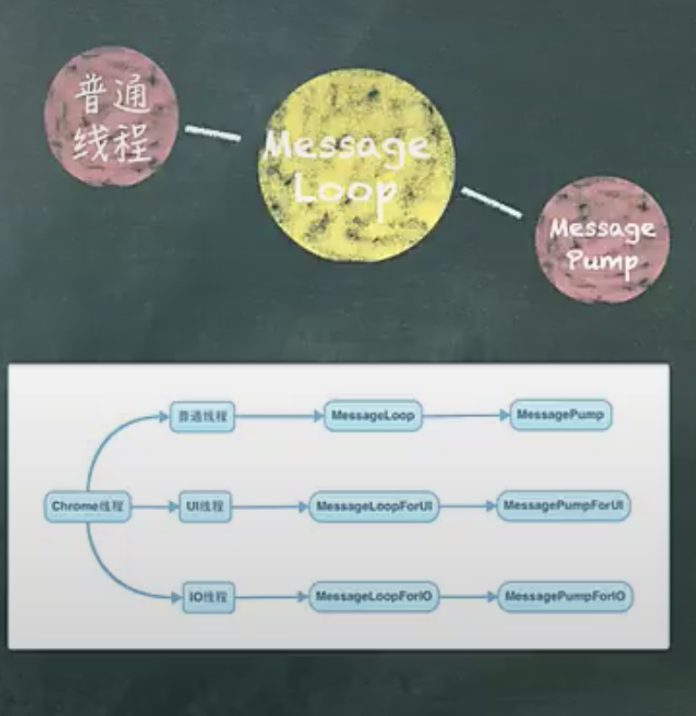

# V8 - 10 - 11


## JavaScript对象 + Map实现原理 

在解决我们PPT中数据循环的问题上，我们引入了 JavaScript 中常见的数据类型数组、对象、Map 和 Set，它们之间到底又有什么区别和联系呢，我们继续分析。老规矩还是先把一些所调高大的概念列出来：

- 常规属性 (properties) 和排序属性 (element)
- 对象内属性 (in-object properties)
- 快属性fast 和慢属性slow
- 快数组 (FastElements) 慢数组 (SlowElements)
- Map 和 Set 的实现原理对比


JavaScript 对象像一个字典，是由一组属性和值组成的，由 map（map 一般也称为 HiddenClass）、propertiesOrHash、elements 三个内置属性组成，所以最简单的方式是使用一个字典来存储属性和值，但是由于字典是非线性结构，所以如果使用字典，读取效率会大大降低。

V8 为了提升存储和查找效率，V8 在对象中添加了两个隐藏属性，排序属性和常规属性，element 属性指向了 elements 对象，在 elements 对象中，会按照顺序存放排序属性。properties 属性则指向了 properties 对象，在 properties 对象中，会按照创建时的顺序保存常规属性。


### 常规属性(properties)和排序属性(element)


## 垃圾回收

Node 使用 JavaScript 在服务器端操作大内存对象受到了一定的限制（堆区），64位系统下约为 1.4GB，栈区 32位操作系统下是 0.7G。新生代 64位是 32M 32位是 16M。

```js
node --max-new-space-size app.js
--max-old-space-size app.js

Process.memoryUsage->rss, heapTotal, heapUsed

```

V8 的垃圾回收策略主要基于分代式垃圾回收机制。在自动垃圾回收的演变过程中，人们发现没有一种垃圾回收算法能够胜任所有场景。V8 中内存分为新生代和老生代两个代。新生代为存活时间较短对象，老生代为存活时间较长的对象。

一句话表示：小孩子尽管玩，到处东跑西大人收。


### Scavenge 算法

在分代基础上，新生代的对象主要通过 `Scavenge` 算法进行垃圾回收，再具体实现时主要采用 `Cheney` 算法。`Cheney` 算法是一种采用复制的方式实现的垃圾回收算法。它将内存分为二，每个空间称为 `semispace`。这两个 `semispace` 中有一个处于使用，一个处于闲置。处于使用的称之为 From，闲置的称之为 To。分配对象时先分配到 From，当开始进行垃圾回收时，检查 From 内存对象赋值到 To。非活动对象被释放。然后互换位置。再次进行回收，发现被回收过的空间已超过 25%。他的缺点是只能使用堆内存的一半，这是一个典型的空间交换型的空间碎片管理办法，但新生代生命周期较短，恰恰就适合这个算法。


### Mark-Sweep & Mark-compact

V8 老生代主要采用 Mark-Sweep 和 Mark-compact，在使用 Scavenge 不合适。一个是对象较多需要赋值量大且还不能解决空间问题。Mark-Sweep 是标记清除，标记那些死掉的对象，然后清除。但是清除过后出现内存不连续的情况，所以我们要使用 Mark-compact，它是基于 Mark-Sweep 演变而来的。他先将活动的对象移到一边，移动完成后，直接清理边界外的内存。当 CPU 空间不足时的情况下会非常高效。V8 后续还引入了延迟处理，增量处理，并计划引入并行标记处理。


### 何时启动GC


 

三色标级 黑白灰 方式 


## ② 数组

数组 它的这种特定的存储结构（连续存储空间存储同一类型数据）决定了，优点就是可以随机访问（可以通过下标随机访问数组中的任意位置上的数据），缺点（对数据的删除和插入不是很友好）。JavaScript 的数组过于灵活。

快数组 慢数组

### 1. 数组

- 1. 数组为什么可以保存不同类型？

- 2. 数组是如何存储的？

- 3. 数组的动态扩容与减容？

### 2. 数组为什么可以保存不同类型？

```js
// JSArray 是继承自 JSObject 的，所以在 JavaScript 中，数组可以是一个特殊的对象，
// 内部也是以 key-value 形式存储数据，所以 JavaScript 中的数组可以存放不同类型的值。

// The JSArray describes JavaScript Arrays
// Such an array can be in one of two modes:
// - fast, backing storage is a FixedArray and length ≤ elements.length();
//   Please note: push and pop can be used to grow and shrink the array.
// - slow, backing storage is a HashTable with numbers as keys.

class JSArray : public JSObject {
public:
  // [length]: The length property.
  DECL_ACCESSORS(length, Object)

  // ...

  // Number of element slots to pre-allocate for an empty array.
  static const int kPreallocatedArrayElements = 4;
}

```

### 3. 数组是如何存储的？

JSArray 继承于 JSObject，从注释上看，它有两种存储方式：

- **fast**: 存储结构是 `FixedArray`，并且数组长度 `≤ elements.length()`，`push` 或 `pop` 时可能会伴随着动态扩容或减容。
- **slow**: 存储结构是 `HashTable`（哈希表），并且数组下标作为 `key`。

fast 模式下数组在源码里面叫 `FastElements`，而 slow 模式下的叫做 `SlowElements`。


#### 3-1. 快数组 (FastElements)

`FixedArray` 是 V8 实现的一个类似于数组的类，它表示一段连续的内存，可以使用索引直接定位。新创建的空数组默认就是快数组。当数组满（数组的长度达到数组在内存中申请的内存容量最大值）的时候，继续 `push` 时，`JSArray` 会进行动态的扩容，以存储更多的元素。

---

#### 3-2. 慢数组 (SlowElements)

慢数组以哈希表的形式存储在内存空间里，它不需要开辟连续的存储空间，但需要额外维护一个哈希表。与快数组相比，性能相对较差。


```cpp
// src/objects/dictionary.h
// 从源码中可以看出，它的内部就是一个 HashTable

class EXPORT_TEMPLATE_DECLARE(V8_EXPORT_PRIVATE) Dictionary
    : public HashTable<Derived, Shape> {
  using DerivedHashTable = HashTable<Derived, Shape>;

public:
  using Key = typename Shape::Key;

  // Returns the value at entry
  inline Object ValueAt(InternalIndex entry);
  inline Object ValueAt(const Isolate* isolate, InternalIndex entry);

  // ...
};

```

#### 什么时候fast变成slow 


##### 所以，当处于以下情况时，快数组会被转变为慢数组：

- 当加入的索引值 `index` 比当前容量 `capacity` 差值大于等于 1024 时（`index - capacity >= 1024`）
- 快数组新容量是扩容后的容量 3 倍之多时

#### 例如：

向快数组里增加一个大索引同类型值


#### 什么时候slow变成fast

当慢数组的元素可存放在快数组中且长度在 smi 之间且仅节省了 50% 的空间，则会转变为快数组。


JavaScript 中，JSArray 继承自 JSObject，或者说它就是一个特殊的对象，内部是以 key-value 形式存储数据，所以 JavaScript 中的数组可以存放不同类型的值。它有两种存储方式，快数组与慢数组。初始化空数组时，使用快数组，快数组使用连续的内存空间，当数组长度达到最大时，JSArray 会进行动态的扩容，以存储更多的元素。相对慢数组，性能要好得多。当数组中 hole 太多时，会转变成慢数组，即以哈希表的方式（key-value 的形式）存储数据，以节省内存空间。


##  Map 和 Set 的实现原理对比

### Map 和 Object 的比较

`Map` 是一个纯哈希结构，始终保持对键的顺序，使其能够在 O(1) 复杂度中进行访问。

而另一方面，对于 `Object` 来说，想要获取对象的属性长度，需要手动对其进行迭代，使其为 O(n) 复杂度。`Map` 始终保持按插入顺序返回键名。但 `Object` 则不是。

所以当你需要频繁操作数据的时候，也可以优先考虑 `Map`。

> 不要将 `Map` 作为普通 `Object` 的替代品，而应该是普通对象的补充。


### 事件循环什么时候开始的？

1. 在 `uv_run` 之前，竟然需要 `uv_default_loop()` 作为参数？
2. 事件循环是在所有的同步操作之前。

### 事件循环的 7 个主要阶段

1. **(update time)** 为了获取一些系统时间，以保证之后的 timer 有个计时的标准，避免过多的系统调用影响性能。
2. **(run_timers)** 要检查是否到期的 timer，也就是 `setTimeout` 和 `setInterval` 这种类型的 timer。
3. **(I/O callbacks (epool, kqueue, IOCP))** I/O 阶段事件的回调，比如网络 I/O，比如文件读取 I/O。当这些 I/O 动作结束的时候调用（比如 TCP socket ECONNREFUSED 在尝试 connect 时 receives，系统依赖等错误）。
4. **(idle, prepare)** 这个阶段内部做一些初始化动作，如果某节点处于 active 状态，每次事件循环都会被执行。`nexttick`。
5. **(I/O poll)** 采用各平台提供的多路复用接口，执行 I/O 回调，处理查询队列中的事件。如果队列为空，则进入循环，直至队列为非空。如果 `poll` 队列为空，有 `setImmediate()` 的话会插入队列中，然后立即执行。当有 timer 的话超时就会执行 timer。
6. **(check)** 执行 `setImmediate()`。
7. **(close callbacks)** 关闭回调，描述文件的关闭、链接断开等。

## Chrome的线程模型

为了实现多线程，Chrome思路是简单且容易理解的少用线程，相比平时的消息循环（如：Windows的消息循环，Linux中的poll模型）它能够加快处理的速度就是可以运行自定义任务（Task）。如果在一个线程里页面需要运行一个线程内部的函数并传递一些参数给其他线程，则把任务放入另一个线程，并将其传递给另外一个线程，来自另一个线程执行这个Task。

Chrome将其线程分为三个类：普通线程，UI线程和IO线程。它们之间的区别是：

### 普通线程：
- 只能执行Task，没有其他的功能。

### UI线程：
- 所有的窗口都会跨出UI线程，它能够执行Task外，还能执行和界面相关的消息循环。

### IO线程：
- 和本地文件操作，或者网络收发数据的操作都运行在这个线程上。它除了能执行Task外，还能执行IO相关的事件循环。

由于这三线程中Task的执行部分基本是一致的，而其他的功能却不同。为了实现这不同的三类线程，Chrome将其线程划分成了两个部分：MessageLoop和MessagePump。`chrome-thread-and-messageloop`（如去除👈）

### MessagePump
- 被用来获取并执行Task的相关信息和处理线程内部的消息，如：UI线程的Windows消息。

### MessageLoop
- 仅仅是用来处理Task的，它实现了MessagePump的Delegate的接口，这样MessagePump就可以监听MessageLoop同时处理Task。




## V8 运行原理


## 执行环境概念

- 执行栈 (Execution Context Stack)
- 全局对象 (GO Global Context)
- 活动对象 (Activation Object)
- 变量对象 (Variable Object)
- 全局上下文 (GC global execution context)
- 执行上下文 (EC execution context)
- 函数调用栈 (Callee Stack)
- 执行上下文栈 (ECS execution context Stack)
- 垃圾回收 (GC Garbage Collection)
- 词法环境 (LexicalEnvironment)
- 变量环境 (VariableEnvironment)
- 环境记录 (Environment record)