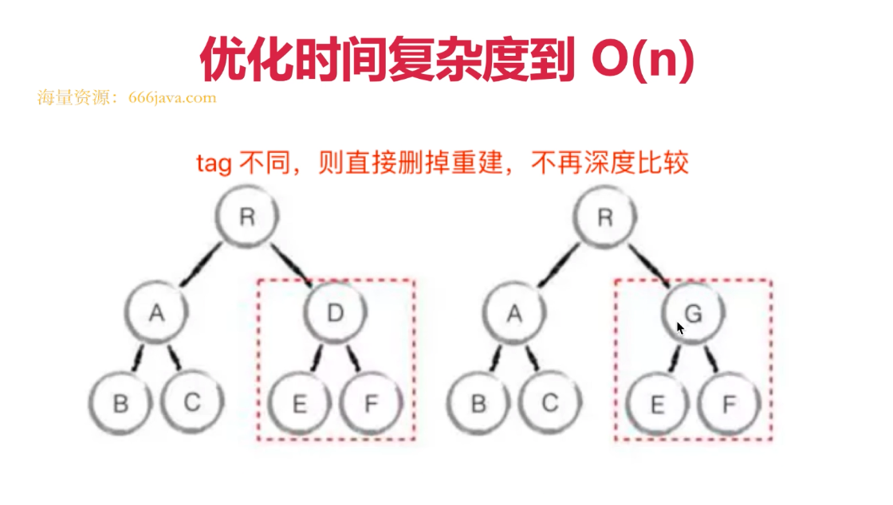

# 笔试分类题


<!-- [01-HTML&CSS](Vue)
02-JS
[03-VUE](Vue)
04-React
05-前端工程化
06-移动端 
07-Node
08-数据库
09-算法
10-网络
11-性能优化
12-浏览器 -->


## Vue
### 基本使用
> 插值 表达式
> 指令 动态属性
> v-html:会有xss风险 会覆盖子组件
```vue
<template>
    <div>
        <p>文本插值 {{message}}</p>
        <p>JS 表达式 {{ flag ? 'yes' : 'no' }} （只能是表达式，不能是 js 语句）</p>

        <p :id="dynamicId">动态属性 id</p>

        <hr/>
        <p v-html="rawHtml">
            <span>有 xss 风险</span>
            <span>【注意】使用 v-html 之后，将会覆盖子元素</span>
        </p>
        <!-- 其他常用指令后面讲 -->
    </div>
</template>

<script>
export default {
    data() {
        return {
            message: 'hello vue',
            flag: true,
            rawHtml: '指令 - 原始 html <b>加粗</b> <i>斜体</i>',
            dynamicId: `id-${Date.now()}`
        }
    }
}
</script>
```
#### computed和watch
> computed 有缓存，data 不变则不会重新计算
```vue
<template>
    <div>
        <p>num {{num}}</p>
        <p>double1 {{double1}}</p>
        <input v-model="double2"/>
    </div>
</template>

<script>
export default {
    data() {
        return {
            num: 20
        }
    },
    computed: {
        double1() {
            return this.num * 2
        },
        double2: {
            get() {
                return this.num * 2
            },
            set(val) {
                this.num = val/2
            }
        }
    }
}
</script>
```
> watch 如何深度监听
> watch 监听引用类型，拿不到oldValue
```vue
<template>
    <div>
        <input v-model="name"/>
        <input v-model="info.city"/>
    </div>
</template>

<script>
export default {
    data() {
        return {
            name: '双越',
            info: {
                city: '北京'
            }
        }
    },
    watch: {
        name(oldVal, val) {
            // eslint-disable-next-line
            console.log('watch name', oldVal, val) // 值类型，可正常拿到 oldVal 和 val
        },
        info: {
            handler(oldVal, val) {
                // eslint-disable-next-line
                console.log('watch info', oldVal, val) // 引用类型，拿不到 oldVal 。因为指针相同，此时已经指向了新的 val
            },
            deep: true // 深度监听
        }
    }
}
</script>
```
#### class和style

> 使用动态属性
> 使用驼峰写法
```vue
<template>
    <div>
        <p :class="{ black: isBlack, yellow: isYellow }">使用 class</p>
        <p :class="[black, yellow]">使用 class （数组）</p>
        <p :style="styleData">使用 style</p>
    </div>
</template>

<script>
export default {
    data() {
        return {
            isBlack: true,
            isYellow: true,

            black: 'black',
            yellow: 'yellow',

            styleData: {
                fontSize: '40px', // 转换为驼峰式
                color: 'red',
                backgroundColor: '#ccc' // 转换为驼峰式
            }
        }
    }
}
</script>

<style scoped>
    .black {
        background-color: #999;
    }
    .yellow {
        color: yellow;
    }
</style>
```
uiuu
#### 条件渲染 
> v-if v-else的用法， 可使用变量，也可以使用===表达式
> v-if 和v-show的区别 v-show是通过css的display:none 控制的 v-if是通过vue的本身的机制来判断这个语句是否要展示和销毁 组件频繁切换使用v-show 组件切换一次 不会再有大的动作使用v-if
> v-if 和v-show 的使用场景 
```vue
<template>
    <div>
        <p v-if="type === 'a'">A</p>
        <p v-else-if="type === 'b'">B</p>
        <p v-else>other</p>

        <p v-show="type === 'a'">A by v-show</p>
        <p v-show="type === 'b'">B by v-show</p>
    </div>
</template>

<script>
export default {
    data() {
        return {
            type: 'a'
        }
    }
}
</script>
```
### 如何遍历数组 

> v-if 的计算优先级要高于 v-for  
```vue
<template>
    <div>
        <p>遍历数组</p>
        <ul>
            <li v-for="(item, index) in listArr" :key="item.id">
                {{index}} - {{item.id}} - {{item.title}}
            </li>
        </ul>

        <p>遍历对象</p>
        <ul v-if='flag'>
            <li v-for="(val, key, index) in listObj" :key="key">
                {{index}} - {{key}} -  {{val.title}}
            </li>
        </ul>
    </div>
</template>

<script>
export default {
    data() {
        return {
            flag: false,
            listArr: [
                { id: 'a', title: '标题1' }, // 数据结构中，最好有 id ，方便使用 key
                { id: 'b', title: '标题2' },
                { id: 'c', title: '标题3' }
            ],
            listObj: {
                a: { title: '标题1' },
                b: { title: '标题2' },
                c: { title: '标题3' },
            }
        }
    }
}
</script>
```


### 事件 

> 1 event 参数 ，自定义参数 如何获取
```vue
// 1. event 是原生的
// 2. 事件被挂载到当前元素
// 和 DOM 事件一样
```
> 2 事件修饰符 ， 按键修饰符 
```vue
 <!-- 阻止单击事件继续传播 -->
    <a v-on:click.stop="doThis"></a>
    <!-- 提交事件不再重载页面 -->
    <form v-on:submit.prevent="onSubmit"></form>
    <!-- 修饰符可以串联 -->
    <a v-on:click.stop.prevent="doThis"></a>
    <!-- 只有修饰符 -->
    <form v-on:submit.prevent></form>
    <!-- 添加事件监听器时 使用事件捕获模式 -->
     <!-- 即内部元素触发的事件在此处理， 然后才交给内部元素进行处理 -->
    <div v-on:click.capture="doThis"></div>
    <!-- 只当在 event.target 是在当前元素自身时触发处理函数 -->
     <!-- 即事件不是从内部元素触发的 -->
    <div v-on:clicl.self="doThat"></div>
       <!-- alt 或 shift  一同按下 -->
     <button @click.ctrl="onClick">A</button>
     <!-- Ctrl 按下 -->
      <button @click.ctrl.exact="onCtrlClick">B</button>
      <!-- 没有任何修饰 按下时触发 -->
       <button @click.exact="onClick">C</button>
```
> 3 【观察】事件被绑到了哪里
```vue
<template>
    <div>
        <p>{{num}}</p>
        <button @click="increment1">+1</button>
        <button @click="increment2(2, $event)">+2</button>
    </div>
</template>

<script>
export default {
    data() {
        return {
            num: 0
        }
    },
    methods: {
        increment1(event) {
            // eslint-disable-next-line
            console.log('event', event, event.__proto__.constructor) // 是原生的 event 对象
            // eslint-disable-next-line
            console.log(event.target)
            // eslint-disable-next-line
            console.log(event.currentTarget) // 注意，事件是被注册到当前元素的，和 React 不一样
            this.num++

            // 1. event 是原生的
            // 2. 事件被挂载到当前元素
            // 和 DOM 事件一样
        },
        increment2(val, event) {
            // eslint-disable-next-line
            console.log(event.target)
            this.num = this.num + val
        },
        loadHandler() {
            // do some thing
        }
    },
    mounted() {
        window.addEventListener('load', this.loadHandler)
    },
    beforeDestroy() {
        //【注意】用 vue 绑定的事件，组建销毁时会自动被解绑
        // 自己绑定的事件，需要自己销毁！！！
        window.removeEventListener('load', this.loadHandler)
    }
}
</script>
```
### Form 表单

> v-model 如何使用
```vue
<template>
    <div>
        <p>输入框: {{name}}</p>
        <input type="text" v-model.trim="name"/>
        <input type="text" v-model.lazy="name"/>
        <input type="text" v-model.number="age"/>

        <p>多行文本: {{desc}}</p>
        <textarea v-model="desc"></textarea>
        <!-- 注意，<textarea>{{desc}}</textarea> 是不允许的！！！ -->

        <p>复选框 {{checked}}</p>
        <input type="checkbox" v-model="checked"/>

        <p>多个复选框 {{checkedNames}}</p>
        <input type="checkbox" id="jack" value="Jack" v-model="checkedNames">
        <label for="jack">Jack</label>
        <input type="checkbox" id="john" value="John" v-model="checkedNames">
        <label for="john">John</label>
        <input type="checkbox" id="mike" value="Mike" v-model="checkedNames">
        <label for="mike">Mike</label>

        <p>单选 {{gender}}</p>
        <input type="radio" id="male" value="male" v-model="gender"/>
        <label for="male">男</label>
        <input type="radio" id="female" value="female" v-model="gender"/>
        <label for="female">女</label>

        <p>下拉列表选择 {{selected}}</p>
        <select v-model="selected">
            <option disabled value="">请选择</option>
            <option>A</option>
            <option>B</option>
            <option>C</option>
        </select>

        <p>下拉列表选择（多选） {{selectedList}}</p>
        <select v-model="selectedList" multiple>
            <option disabled value="">请选择</option>
            <option>A</option>
            <option>B</option>
            <option>C</option>
        </select>
    </div>
</template>

<script>
export default {
    data() {
        return {
            name: '双越',
            age: 18,
            desc: '自我介绍',

            checked: true,
            checkedNames: [],

            gender: 'male',

            selected: '',
            selectedList: []
        }
    }
}
</script>
```

### Vue父子组件如何通讯 

> 1 props和$emit （属性和触发事件的方法）
> 2 组件通讯 - 自定义事件 或者使用vuex
> 3 组件生命周期

#### Vue.index
```vue
<template>
    <div>
        <Input @add="addHandler"/>
        <List :list="list" @delete="deleteHandler"/>
    </div>
</template>

<script>
import Input from './Input'
import List from './List'

export default {
    components: {
        Input,
        List
    },
    data() {
        return {
            list: [
                {
                    id: 'id-1',
                    title: '标题1'
                },
                {
                    id: 'id-2',
                    title: '标题2'
                }
            ]
        }
    },
    methods: {
        addHandler(title) {
            this.list.push({
                id: `id-${Date.now()}`,
                title
            })
        },
        deleteHandler(id) {
            this.list = this.list.filter(item => item.id !== id)
        }
    },
    created() {
        // eslint-disable-next-line
        console.log('index created')
    },
    mounted() {
        // eslint-disable-next-line
        console.log('index mounted')
    },
    beforeUpdate() {
        // eslint-disable-next-line
        console.log('index before update')
    },
    updated() {
        // eslint-disable-next-line
        console.log('index updated')
    },
}
</script>

```
#### list.vue
```vue
<template>
  <div>
    <ul>
      <li v-for="item in list" :key="item.id">
        {{ item.title }}

        <button @click="deleteItem(item.id)">删除</button>
      </li>
    </ul>
  </div>
</template>

<script>
import event from "./event";

export default {
  // props: ['list']
  props: {
    // prop 类型和默认值
    list: {
      type: Array,
      default() {
        return [];
      },
    },
  },
  data() {
    return {};
  },
  methods: {
    deleteItem(id) {
      this.$emit("delete", id);
    },
    addTitleHandler(title) {
      // eslint-disable-next-line
      console.log("on add title", title);
    },
  },
  created() {
    // eslint-disable-next-line
    console.log("list created");
  },
  mounted() {
    // eslint-disable-next-line
    console.log("list mounted");

    // 绑定自定义事件
    event.$on("onAddTitle", this.addTitleHandler);
  },
  beforeUpdate() {
    // eslint-disable-next-line
    console.log("list before update");
  },
  updated() {
    // eslint-disable-next-line
    console.log("list updated");
  },
  beforeDestroy() {
    // 及时销毁，否则可能造成内存泄露
    event.$off("onAddTitle", this.addTitleHandler);
  },
};
</script>

```
#### Input.vue
```vue
<template>
    <div>
        <input type="text" v-model="title"/>
        <button @click="addTitle">add</button>
    </div>
</template>

<script>
import event from './event'

export default {
    data() {
        return {
            title: ''
        }
    },
    methods: {
        addTitle() {
            // 调用父组件的事件
            this.$emit('add', this.title)

            // 调用自定义事件
            event.$emit('onAddTitle', this.title)

            this.title = ''
        }
    }
}
</script>
```

#### event.js
```vue
import Vue from 'vue'

export default new Vue()

```

### 生命周期 （单个组件）

1. 挂载阶段
2. 更新阶段 
3. 销毁阶段 

生命周期图示
#### 

<!--  -->


### 组件生命周期 （多个组件）


### vue 高级特性

> 1. 自定义v-model
> 2. $nextTick
> 3. slot
> 4. 动态、异步组件
> 5. keep-alive
> 6. mixin

#### 自定义v-model

#### index.vue
```vue
<template>
  <div>
    <p>vue 高级特性</p>
    <hr />

    <!-- 自定义 v-model -->
    <p>{{name}}</p>
    <CustomVModel v-model="name"/> 

  </div>
</template>

<script>
import CustomVModel from './CustomVModel'
export default {
  components: {
    CustomVModel
  },
  data() {
    return {
      name: "test",
    };
  },
};
</script>

```
#### customVmodel
```vue
<template>
    <!-- 例如：vue 颜色选择 -->
    <input type="text"
        :value="text1"
        @input="$emit('change1', $event.target.value)"
    >
    <!--
        1. 上面的 input 使用了 :value 而不是 v-model
        2. 上面的 change1 和 model.event1 要对应起来
        3. text1 属性对应起来
    -->
</template>

<script>
export default {
    model: {
        prop: 'text1', // 对应 props text1
        event: 'change1'
    },
    props: {
        text1: String,
        default() {
            return ''
        }
    }
}
</script>
```

#### $nextTick 

> 1. Vue是异步渲染的 
> 2. data 改变后 ，dom不会立刻渲染
> 3. $nextTick 会在DOM渲染之后被触发，以获取最新的DOM节点

##### nextTick.vue
```vue
<template>
  <div id="app">
    <ul ref="ul1">
        <li v-for="(item, index) in list" :key="index">
            {{item}}
        </li>
    </ul>
    <button @click="addItem">添加一项</button>
  </div>
</template>

<script>
export default {
  name: 'app',
  data() {
      return {
        list: ['a', 'b', 'c']
      }
  },
  methods: {
    addItem() {
        this.list.push(`${Date.now()}`)
        this.list.push(`${Date.now()}`)
        this.list.push(`${Date.now()}`)

        // 1. 异步渲染，$nextTick 待 DOM 渲染完再回调
        // 3. 页面渲染时会将 data 的修改做整合，多次 data 修改只会渲染一次
        this.$nextTick(() => {
          // 获取 DOM 元素
          const ulElem = this.$refs.ul1
          // eslint-disable-next-line
          console.log( ulElem.childNodes.length )
        })
    }
  }
}
</script>


```

#### slot
父组件 向子组件 插入东西

##### 基本使用

###### index.vue
```vue
<template>
  <div>
    <p>vue 高级特性</p>
    <hr />
    <!-- slot -->
    <SlotDemo :url="website.url">
            {{website.title}}
    </SlotDemo>
    
  </div>
</template>

<script>

import SlotDemo from './SlotDemo'

import MixinDemo from "./MixinDemo";

export default {
  components: {
    SlotDemo,
  },
  data() {
    return {
      name: "ljh",
      website: {
        url: "http://baidu.com/",
        title: "lijinhaiText",
        subTitle: "程序员的梦工厂",
      },
    };
  },
};
</script>

```

###### SoltDemo.vue
```vue
<template>
    <a :href="url">
        <slot>
            默认内容，即父组件没设置内容时，这里显示
        </slot>
    </a>
</template>

<script>
export default {
    props: ['url'],
    data() {
        return {}
    }
}
</script>
```

##### 作用域插槽

###### index.vue
```vue
<template>
  <div>
    <p>vue 高级特性</p>
    <hr />

    <ScopedSlotDemo :url="website.url">
            <template v-slot="slotProps">
                {{slotProps.slotData.title}}
            </template>
    </ScopedSlotDemo>
  </div>
</template>

<script>

import ScopedSlotDemo from './ScopedSlotDemo'


export default {
  components: {
    ScopedSlotDemo,
   
  },
  data() {
    return {
      name: "textName",
      website: {
        url: "",
        title: "",
        subTitle: "",
      },
      showFormDemo: false,
    };
  },
};
</script>

```

###### ScopedSlotDemo.vue
```vue
<template>
    <a :href="url">
        <slot :slotData="website">
            {{website.subTitle}} <!-- 默认值显示 subTitle ，即父组件不传内容时 -->
        </slot>
    </a>
</template>

<script>
export default {
    props: ['url'],
    data() {
        return {
            website: {
                url: 'http://wangEditor.com/',
                title: 'wangEditor',
                subTitle: '轻量级富文本编辑器'
            }
        }
    }
}
</script>
```
##### 具名插槽


### 动态组件 


> 1. :is = "component-name" 用法 
> 2. 需要根据数据， 动态渲染场景 ，即组件类型不确定
```vue
<div v-for="(val,key) in newData" :key="key">
    <component :is="val.type"/>
</div>
```

### 异步加载

> 1. import() 函数
> 2. 按需加载 异步加载大组件

```vue
<template>
  <div>
    <p>vue 高级特性</p>
    <hr />
    <FormDemo v-if="showFormDemo"/>
    <button @click="showFormDemo = true">show form demo</button>

  </div>
</template>

<script>

export default {
  components: {
    FormDemo: () => import('../BaseUse/FormDemo'),
  },
  data() {
    return {
     
      showFormDemo: false,
    };
  },
};
</script>

```

### keep-alive (缓存组件)

> 缓存组件
> 频繁切换，不需要重复渲染 

#### keepAlive.vue
```vue
<template>
    <div>
        <button @click="changeState('A')">A</button>
        <button @click="changeState('B')">B</button>
        <button @click="changeState('C')">C</button>

        <keep-alive> <!-- tab 切换 -->
            <KeepAliveStageA v-if="state === 'A'"/> <!-- v-show -->
            <KeepAliveStageB v-if="state === 'B'"/>
            <KeepAliveStageC v-if="state === 'C'"/>
        </keep-alive>
    </div>
</template>

<script>
import KeepAliveStageA from './KeepAliveStateA'
import KeepAliveStageB from './KeepAliveStateB'
import KeepAliveStageC from './KeepAliveStateC'

export default {
    components: {
        KeepAliveStageA,
        KeepAliveStageB,
        KeepAliveStageC
    },
    data() {
        return {
            state: 'A'
        }
    },
    methods: {
        changeState(state) {
            this.state = state
        }
    }
}
</script>
```

#### mixin
> 1. 多个组件 有相同的逻辑 ，抽离出来
> 2. mixin 并不是完美的解决方案 ， 会有一些问题
> 3. Vue3 提出的Composition Api 旨在解决这些问题 
##### app,vue
```vue
<template>
    <div>
        <p>{{name}} {{major}} {{city}}</p>
        <button @click="showName">显示姓名</button>
    </div>
</template>

<script>
import myMixin from './mixin'

export default {
    mixins: [myMixin], // 可以添加多个，会自动合并起来
    data() {
        return {
            name: '双越',
            major: 'web 前端'
        }
    },
    methods: {
    },
    mounted() {
        // eslint-disable-next-line
        console.log('component mounted', this.name)
    }
}
</script>

```
##### minx.js
```vue
export default {
    data() {
        return {
            city: '北京'
        }
    },
    methods: {
        showName() {
            // eslint-disable-next-line
            console.log(this.name)
        }
    },
    mounted() {
        // eslint-disable-next-line
        console.log('mixin mounted', this.name)
    }
}


```
> 1. 变量来源不明确 
> 2. 多个mixin 可能会造成命名冲突的问题
> 3. mixin和组件可能会出现多对多的关系，复杂度较高

### VueX 使用 

> 基本概念, 基本使用和API 使用 

>> dispatch

>> commit 

>> mapState

>> mapGetters

>> maapActions

>> mapMutations


## Vue-router的使用

> 路由模式 (hash、 H5 history)
```vue
const User = {
    template:`<div>User {{$route.params.id}}</div>`
}
const router = new VueRouter({
    routes:[
        {
            // 动态路径参数，以冒号开头`/user/10`等格式的路由
            path: `/user/:id`,
            component:User
        }
    ]
})
```
> 路由配置 （动态路由 懒加载）


## Vue原理

### 组件化基础 MVVM模型 

> 数据驱动视图


### Vue响应式

> 组件data的数据一旦发生变化，立即触发试图的更新

> 实现数据驱动的第一步

> 核心的API - Object.defineProperty 缺点有哪些 Vue3.0启用proxy（兼容性的问题，无法使用polyfill）


> 监听对象，监听数据  
> 复杂对象，深度监听,需要递归到底，一次性计算量大 
> 缺点有哪些 
>> 深度监听,需要递归到底，一次性计算量大 
>> 无法监听新增属性/删除属性 （Vue.set Vue.delete）

```js
// 触发更新视图
function updateView() {
    console.log('视图更新')
}

// 重新定义数组原型
const oldArrayProperty = Array.prototype
// 创建新对象，原型指向 oldArrayProperty ，再扩展新的方法不会影响原型
const arrProto = Object.create(oldArrayProperty);
['push', 'pop', 'shift', 'unshift', 'splice'].forEach(methodName => {
    arrProto[methodName] = function () {
        updateView() // 触发视图更新
        oldArrayProperty[methodName].call(this, ...arguments)
        // Array.prototype.push.call(this, ...arguments)
    }
})

// 重新定义属性，监听起来
function defineReactive(target, key, value) {
    // 深度监听
    observer(value)

    // 核心 API
    Object.defineProperty(target, key, {
        get() {
            return value
        },
        set(newValue) {
            if (newValue !== value) {
                // 深度监听
                observer(newValue)

                // 设置新值
                // 注意，value 一直在闭包中，此处设置完之后，再 get 时也是会获取最新的值
                value = newValue

                // 触发更新视图
                updateView()
            }
        }
    })
}

// 监听对象属性
function observer(target) {
    if (typeof target !== 'object' || target === null) {
        // 不是对象或数组
        return target
    }

    // 污染全局的 Array 原型
    // Array.prototype.push = function () {
    //     updateView()
    //     ...
    // }

    if (Array.isArray(target)) {
        target.__proto__ = arrProto
    }

    // 重新定义各个属性（for in 也可以遍历数组）
    for (let key in target) {
        defineReactive(target, key, target[key])
    }
}

// 准备数据
const data = {
    name: 'zhangsan',
    age: 20,
    info: {
        address: '北京' // 需要深度监听
    },
    nums: [10, 20, 30]
}

// 监听数据
observer(data)

// 测试
// data.name = 'lisi'
// data.age = 21
// // console.log('age', data.age)
// data.x = '100' // 新增属性，监听不到 —— 所以有 Vue.set
// delete data.name // 删除属性，监听不到 —— 所有已 Vue.delete
// data.info.address = '上海' // 深度监听
data.nums.push(4) // 监听数组

```


### 虚拟DOM（Virtual DOM）和diff
1. vodm是实现vue和React的重要基石
2. diff算法是vdom中最核心，最重要的部分。dom操作是非常耗费性能的，以前jquery，可以自行操作dom操作的时机，手动调成，vue和react 是数据驱动视图，如何有效的控制dom操作？
3. vdom解决方案提出，当页面有了一定的复杂度，想减少计算次数比较难
4. 能不能把计算，更多的转移到js计算上，因为js执行速度很快
5. vdom - 用js模拟dom结构，新旧vnode对比，计算出最小的变更范围，最后更想你dom，数据驱动视图的模式下，有效的控制dom操作

#### 通过snabbdom 学习vdom
```js
<!DOCTYPE html>
<html>
<head>
    <meta charset="UTF-8">
    <title>Document</title>
</head>
<body>
    <div id="container"></div>
    <button id="btn-change">change</button>

    <script src="https://cdn.bootcss.com/snabbdom/0.7.3/snabbdom.js"></script>
    <script src="https://cdn.bootcss.com/snabbdom/0.7.3/snabbdom-class.js"></script>
    <script src="https://cdn.bootcss.com/snabbdom/0.7.3/snabbdom-props.js"></script>
    <script src="https://cdn.bootcss.com/snabbdom/0.7.3/snabbdom-style.js"></script>
    <script src="https://cdn.bootcss.com/snabbdom/0.7.3/snabbdom-eventlisteners.js"></script>
    <script src="https://cdn.bootcss.com/snabbdom/0.7.3/h.js"></script>
    <script type="text/javascript">
        const snabbdom = window.snabbdom
        // 定义关键函数 patch
        const patch = snabbdom.init([
            snabbdom_class,
            snabbdom_props,
            snabbdom_style,
            snabbdom_eventlisteners
        ])

        // 定义关键函数 h
        const h = snabbdom.h

        // 原始数据
        const data = [
            {
                name: '张三',
                age: '20',
                address: '北京'
            },
            {
                name: '李四',
                age: '21',
                address: '上海'
            },
            {
                name: '王五',
                age: '22',
                address: '广州'
            }
        ]
        // 把表头也放在 data 中
        data.unshift({
            name: '姓名',
            age: '年龄',
            address: '地址'
        })

        const container = document.getElementById('container')

        // 渲染函数
        let vnode
        function render(data) {
            const newVnode = h('table', {}, data.map(item => {
                const tds = []
                for (let i in item) {
                    if (item.hasOwnProperty(i)) {
                        tds.push(h('td', {}, item[i] + ''))
                    }
                }
                return h('tr', {}, tds)
            }))

            if (vnode) {
                // re-render
                patch(vnode, newVnode)
            } else {
                // 初次渲染
                patch(container, newVnode)
            }

            // 存储当前的 vnode 结果
            vnode = newVnode
        }

        // 初次渲染
        render(data)


        const btnChange = document.getElementById('btn-change')
        btnChange.addEventListener('click', () => {
            data[1].age = 30
            data[2].address = '深圳'
            // re-render
            render(data)
        })

    </script>
</body>
</html>
```
## diff算法 
1. diff算法是vdom中最核心。最关键的部分
2. diff算法能在日常使用vue和react中体现出来（如key）
3. diff即对比，以一个广泛的概念，如linux diff命令 git diff 等
4. 两个js对象也可以做dif  cujojs/jiff
5. 两个树做diff ，这里的vdom diff 


