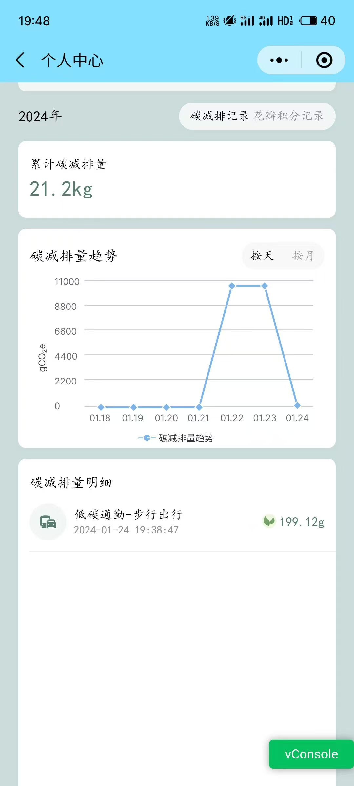
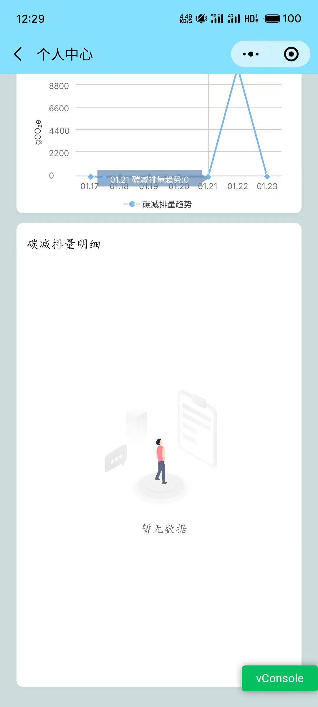

# 在微信小程序图表  

> 在微信中小程序实现图表 使用 canvas 进行绘制

```js
    lineChart = new wxCharts({
                canvasId: 'lineChartCanvas', //必须是唯一的
                type: 'line',
                categories: [...(props?.date?.xaxis || [])],
                xAxis: {
                    disableGrid: true,
                },
                yAxis: {
                    title: Number(props?.currentIndex) === 0 ? `${props?.currentType === 0 ? 'gCO₂e' : 'kgCO₂e'}` : '',
                },
                series: [{

                    name: returnLimitTitle(),
                    data: [...(props?.date?.yaxis || [])],
                    format: val => `${val} `
                }],
                dataLabel: false, // 关闭数据标签
                tooltip: {
                    show: true, // 显示工具提示
                    format: (item, category) => {
                        return `${category} ${item.name}: ${item.data}`;
                    }
                },
                dataPointShape: true,
                animation: true,
                width: windowWidth,
                height: 200,
                // extra: {
                //     lineStyle: 'curve'
                // }
            });
```
 
 

