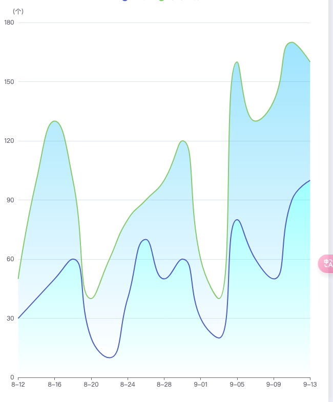
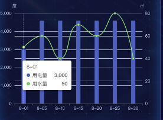
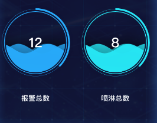
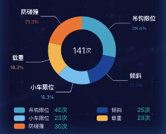
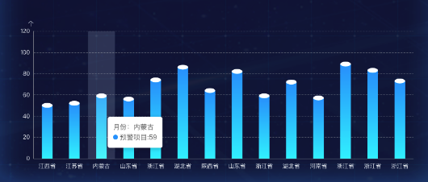
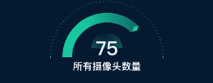
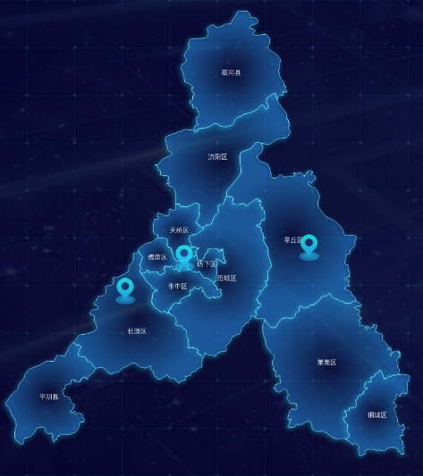
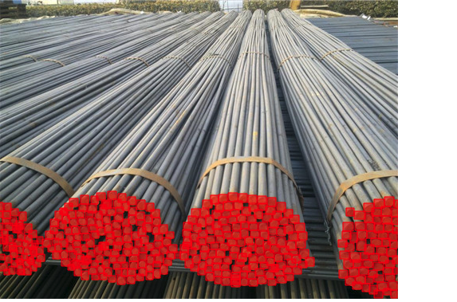
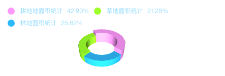

# echarts


## 双折线图



```js
option = {
  tooltip: {
    trigger: 'axis',
    axisPointer: {
      type: 'cross',
      label: {
        backgroundColor: '#6a7985'
      }
    }
  },
  legend: {
    data: ['Email', 'Union Ads']
  },
  grid: {
    left: '3%',
    right: '4%',
    bottom: '3%',
    containLabel: true
  },
  xAxis: [
    {
      type: 'category',
      boundaryGap: false,
      data: ['8-12', '8-14', '8-16', '8-18', '8-20', '8-22', '8-24', '8-26', '8-28', '8-30', '9-01', '9-03', '9-05', '9-07', '9-09', '9-11', '9-13']
    }
  ],
  yAxis: [
    {
      type: 'value',
      name: '（个）',
    }
  ],
  series: [
    {
      name: 'Email',
      type: 'line',
      stack: 'Total',
      smooth: true,
      showSymbol: false, // Hide the data point markers
      areaStyle: {
        color: new echarts.graphic.LinearGradient(0, 0, 0, 1, [
          { offset: 0, color: 'rgba(0, 255, 255, 0.5)' },
          { offset: 1, color: 'rgba(0, 255, 255, 0)' }
        ])
      },
      emphasis: {
        focus: 'series'
      },
      data: [30, 40, 50, 60, 20, 10, 40, 70, 50, 60, 30, 20, 80, 60, 50, 90, 100]
    },
    {
      name: 'Union Ads',
      type: 'line',
      stack: 'Total',
      smooth: true,
      showSymbol: false, // Hide the data point markers
      areaStyle: {
        color: new echarts.graphic.LinearGradient(0, 0, 0, 1, [
          { offset: 0, color: 'rgba(0, 191, 255, 0.5)' },
          { offset: 1, color: 'rgba(0, 191, 255, 0)' }
        ])
      },
      emphasis: {
        focus: 'series'
      },
      data: [20, 60, 80, 40, 20, 50, 40, 20, 50, 60, 30, 20, 80, 70, 90, 80, 60]
    }
  ]
};

```

## 柱状图与折线图结合



```vue
<template>
  <div class="echarts-wrap">
    <OptionsEcharts :options="options"></OptionsEcharts>
  </div>
</template>

<script>
import OptionsEcharts from "@/components/Echarts/OptionsEcharts";
import { merge } from "lodash";
/**
 * 十六进制color颜色/RGBA/RGB，改变透明度
 * @param {*} thisColor #555 rgba(85,85,85,0.6) rgb(85,85,85)
 * @param {*} thisOpacity 0.7
 * @returns rgba(85,85,85,0.7)
 */
function getOpacityColor(thisColor, thisOpacity) {
  var theColor = thisColor.toLowerCase();
  //十六进制颜色值的正则表达式
  var r = /^#([0-9a-fA-f]{3}|[0-9a-fA-f]{6})$/;
  // 如果是16进制颜色
  if (theColor && r.test(theColor)) {
    if (theColor.length === 4) {
      var sColorNew = "#";
      for (var i = 1; i < 4; i += 1) {
        sColorNew += theColor.slice(i, i + 1).concat(theColor.slice(i, i + 1));
      }
      theColor = sColorNew;
    }
    //处理六位的颜色值
    var sColorChange = [];
    for (var j = 1; j < 7; j += 2) {
      sColorChange.push(parseInt("0x" + theColor.slice(j, j + 2)));
    }
    return "rgba(" + sColorChange.join(",") + "," + thisOpacity + ")";
  }
  // 如果是rgba或者rgb
  if (theColor.startsWith("rgb")) {
    let numbers = theColor.match(/(\d(\.\d+)?)+/g);
    numbers = numbers.slice(0, 3).concat(thisOpacity);
    return "rgba(" + numbers.join(",") + ")";
  }

  return theColor;
}
export default {
  components: {
    OptionsEcharts,
  },
  props: {
    xData: {
      type: Array,
      default: () => {
        return [];
      },
    },
    series: {
      type: Array,
      default: () => {
        return [];
      },
    },
    yAxis: {
      type: Object,
      default: () => {
        return {};
      },
    },
  },
  data() {
    return {
      options: {},
    };
  },
  created() {
    this.options = this.getEchartsOption();
    console.log("this.options", this.options);
  },
  methods: {
    getEchartsOption() {
      let option = {
        tooltip: {
          trigger: "axis",
        },
        legend: {
          data: ["用电量", "用水量"],
          textStyle: {
            color: "#DAE7FD", // Set legend text color
          },
        },
        xAxis: {
          type: "category",
          data: ["8-01", "8-05", "8-10", "8-15", "8-20", "8-25", "8-30"],
          axisLabel: {
            color: "#DAE7FD", // Set x-axis label color
          },
        },
        yAxis: [
          {
            type: "value",
            name: "度",
            position: "left",
            nameTextStyle: {
              color: "#DAE7FD", // Set the y-axis unit text color
            },
            axisLabel: {
              color: "#DAE7FD", // Set x-axis label color
            },
          },
          {
            type: "value",
            name: "㎡",
            position: "right",
            nameTextStyle: {
              color: "#DAE7FD", // Set the y-axis unit text color
            },
            axisLabel: {
              color: "#DAE7FD", // Set x-axis label color
            },
          },
        ],
        series: [
          {
            name: "用电量",
            type: "bar",
            data: [3000, 4600, 4600, 4600, 4600, 4600, 4600],
            yAxisIndex: 0, // 绑定到第一个 y 轴
            barWidth: 12, // Set the bar width to 12px
          },
          {
            name: "用水量",
            type: "line",
            data: [50, 60, 40, 70, 60, 80, 40],
            yAxisIndex: 1, // 绑定到第二个 y 轴
            smooth: true,
          },
        ],
      };
      return option;
    },
  },
};
</script>

<style lang="scss" scoped>
@import "~@/assets/styles/mixin.scss";

.echarts-wrap {
  width: 100%;
  height: 100%;
}
</style>

```

## 进度球



```vue
<template>
  <div class="echarts-wrap">
    <OptionsEcharts :options="options"></OptionsEcharts>
  </div>
</template>

<script>
import OptionsEcharts from "@/components/Echarts/OptionsEcharts";
import * as echarts from "echarts";
import "echarts-liquidfill";

export default {
  components: {
    OptionsEcharts,
  },
  props: {
    color: {
      type: Array,
      default: () => ["#10B9FF", "#10B9FF", "#10B9FF"],
    },
    value: {
      type: Number,
    },
    title: {
      type: String,
    },
  },
  data() {
    return {
      options: {},
    };
  },
  created() {
    this.options = this.getEchartsOption();
  },
  methods: {
    getEchartsOption() {
      console.log(this.color, "this.color-this.color");
      var option = {
        title: {
          text: this.title, // Replace with your title
          left: "center",
          bottom: 30, // Position the title at the bottom
          textStyle: {
            fontSize: 20,
            color: "#FFFFFF", // Set the title color to white (or your preferred color)
          },
        },
        series: [
          {
            type: "liquidFill",
            radius: "78%",
            center: ["50%", "40%"],
            color: this.color, //水波
            data: [0.4, 0.4, 0.4], // data个数代表波浪数
            backgroundStyle: {
              borderWidth: 1,
              color: "transparent",
            },
            label: {
              normal: {
                formatter: this.value + "",
                textStyle: {
                  fontSize: 38,
                  color: "#FFFFFF",
                },
              },
              position: "inside", // Position the text inside the liquidFill
              offset: [0, -20], // Adjust vertical offset to move text upwards
            },
            outline: {
              show: true,
              itemStyle: {
                borderColor: this.color[0],
                borderWidth: 2,
              },
              borderDistance: 3,
            },
          },
          {
            name: "外层细环",
            type: "pie",
            radius: ["84%", "84.5%"],
            center: ["50%", "40%"],
            hoverAnimation: false,
            itemStyle: {
              normal: {
                label: {
                  show: false,
                },
              },
            },
            data: [
              {
                value: 100,
                itemStyle: {
                  normal: {
                    color: this.color[0],
                  },
                },
              },
            ],
          },
          {
            name: "外层粗环",
            type: "pie",
            radius: ["82%", "86.5%"], //使得细环位于粗环中间
            center: ["50%", "40%"],
            hoverAnimation: false,
            itemStyle: {
              normal: {
                label: {
                  show: false,
                },
              },
            },
            data: [
              {
                value: 30,
                itemStyle: {
                  normal: {
                    color: this.color[0],
                  },
                },
              },
              {
                value: 50,
                itemStyle: {
                  normal: {
                    color: "transparent",
                  },
                },
              },
            ],
          },
        ],
      };

      return option;
    },
  },
};
</script>

<style lang="scss" scoped>
@import "~@/assets/styles/mixin.scss";

.echarts-wrap {
  width: 100%;
  height: 100%;
}
</style>
<style lang="scss">
.stereoscopic-tool-tip {
  color: rgba(74, 248, 255, 1);
}
</style>

```

## 饼状图 



```vue
<template>
  <div class="echarts-wrap">
    <div style="width: 100%; height: 80%">
      <OptionsEcharts :options="options"></OptionsEcharts>
    </div>
    <div style="width: 100%; height: 20%">
      <div class="person-action flex flex-wrap category">
        <div
          class="person-action-item flex items-center w-50 xs-font pl-40"
          v-for="item in echartData"
          :key="item.name"
        >
          <div class="circle" :style="{ background: item.color }"></div>
          <div class="name">{{ item.name }}</div>
          <div class="flex-shrink-0">
            <span class="value xs-font">{{ item.value }}</span>
            <span class="value">{{ unit }}</span>
          </div>
        </div>
      </div>
    </div>
  </div>
</template>

<script>
import OptionsEcharts from "@/components/Echarts/OptionsEcharts";
export default {
  components: {
    OptionsEcharts,
  },
  props: {
    echartData: {
      type: Array,
    },
    name: {
      type: String,
    },
    radius: {
      type: Array,
      default: () => {
        return ["37%", "60%"];
      },
    },
    initOptions: {
      type: Object,
      default() {
        return {};
      },
    },
    titleTop: {
      type: String,
      default: "68%",
    },
    labelLineLength: {
      type: Number,
      default: 5,
    },
    labelLineLength2: {
      type: Number,
      default: 5,
    },
    titleNext: {
      type: String,
      default: "个",
    },
    subTitle: {
      type: String,
      default: "",
    },
    titleColor: {
      type: String,
      default: "#ffffff",
    },
    categoryList: {
      type: Array,
      default: () => {
        return [];
      },
    },
    unit: {
      type: String,
      default: "人",
    },
  },
  data() {
    return {
      options: {},
    };
  },
  created() {
    this.options = this.getEchartsOption();
    console.log("this.options", this.options);
  },
  methods: {
    getEchartsOption() {
      var that = this;
      var scale = 1;
      var echartData = this.echartData;
      const colorList = echartData?.map((item) => item.color);
      var rich = {
        total: {
          color: this.titleColor,
          fontSize: 24 * scale,
          align: "center",
        },
        subTitle: {
          color: "#ffffff",
          fontSize: 14 * scale,
          align: "center",
        },
        title: {
          color: "#ffffff",
          fontSize: 16 * scale,
          fontWeight: "bolder",
        },
      };

      echartData?.forEach((item, index) => {
        rich["name" + index] = {
          color: item.color,
          fontSize: 13,
        };
      });
      var option = {
        tooltip: {
          trigger: "item",
        },
        backgroundColor: "transparent",
        title: {
          show: true,
          text: this.name,
          left: "center",
          top: this.titleTop,
          padding: [24, 0],
          textStyle: {
            color: "#fff",
            fontSize: 16 * scale,
            align: "center",
          },
        },
        grid: {
          top: 0,
          left: 0,
          bottom: "10%",
          right: 0,
          containLabel: true,
        },
        legend: {
          selectedMode: false,
          formatter: function (name) {
            var total = 0; //各科正确率总和
            echartData.forEach(function (value, index, array) {
              total += value.value;
            });
            return (
              "{total|" +
              total +
              "}" +
              that.titleNext +
              (that.subTitle ? "\n{subTitle|" + that.subTitle + "}" : "")
            );
          },
          data: [echartData[0]?.name],
          // data: ['高等教育学'],
          // itemGap: 50,
          left: "center",
          top: "center",
          icon: "none",
          align: "center",
          textStyle: {
            color: "#fff",
            fontSize: 16 * scale,
            rich: rich,
          },
        },
        series: [
          {
            name: this.name,
            type: "pie",
            radius: this.radius,
            hoverAnimation: false,
            label: {
              normal: {
                formatter: function (params, ticket, callback) {
                  const index = params.dataIndex;
                  var total = 0; //考生总数量
                  var percent = 0; //考生占比
                  echartData.forEach(function (value, index, array) {
                    total += value.value;
                  });
                  percent = ((params.value / total) * 100).toFixed(1);
                  return `{title|${params.name}}\n\n{name${index}|${percent}%}`;
                },
                rich: rich,
              },
            },
            color: colorList,
            emphasis: {
              label: {
                show: true,
                fontSize: 20,
                fontWeight: "bold",
              },
            },
            labelLine: {
              normal: {
                length: this.labelLineLength,
                length2: this.labelLineLength2,
                lineStyle: {
                  color: "#fff",
                },
              },
            },
            data: echartData,
          },
        ],
      };

      return Object.assign(option);
    },
  },
};
</script>

<style lang="scss" scoped>
@import "~@/assets/styles/mixin.scss";

.echarts-wrap {
  width: 100%;
  height: 100%;
}
.person-action {
  display: flex;

  .person-action-item {
    width: 50%;
    align-items: center;
    line-height: 1;
    margin-bottom: 6px;

    .circle {
      width: 30px;
      height: 15px;
      border-radius: 5px;
      margin-right: 10px;
    }

    .name {
      width: 70px;
    }

    .value {
      font-size: 16px;
      color: #28f1dc;
    }
  }
}
</style>

```

## 柱状图 




```vue
<template>
  <div id="nativeAnalysisId" style="width: 100%; height: 100%"></div>
</template>

<script>
import * as echarts from "echarts";
export default {
  name: "nativeAnalysis",
  mounted() {
    // 初始化图表
    const chartContainer = document.getElementById("nativeAnalysisId");
    const myChart = echarts.init(chartContainer);

    var xData = [
      "江西省",
      "江苏省",
      "内蒙古",
      "山东省",
      "浙江省",
      "湖北省",
      "陕西省",
      "山东省",
      "浙江省",
      "湖北省",
      "河南省",
      "浙江省",
      "浙江省",
      "浙江省",
    ];
    var data1 = xData.map((province) => ({
      province: province,
      value: Math.floor(Math.random() * 51 + 50), // 生成50到100的随机数
    }));
    // 配置图表选项
    const option = {
      tooltip: {
        trigger: "axis",
        axisPointer: {
          type: "shadow", // 默认为直线，可选为：'line' | 'shadow'
        },
        formatter: function (parms) {
          var str =
            "月份：" +
            parms[0].axisValue +
            "</br>" +
            parms[0].marker +
            "预警项目:" +
            parms[0].value;
          return str;
        },
      },
      legend: {
        show: false,
        data: ["预警项目"],
        textStyle: { fontSize: 12, color: "#fff" },
        itemWidth: 12,
        itemHeight: 12,
        itemGap: 15,
        top: "-1%",
        right: "2%",
      },
      textStyle: {
        color: "#ffffff",
      },
      color: ["#24F3FF", "#24F3FF", "#FDBF47", "#FDBF47"],
      grid: {
        containLabel: true,
        left: "6%",
        top: "20%",
        bottom: "6%",
        right: "6%",
      },
      xAxis: {
        type: "category",
        data: xData,
        axisLine: {
          lineStyle: {
            color: "#B5B5B5",
          },
        },
        axisTick: {
          show: false,
        },
        axisLabel: {
          margin: 10, //刻度标签与轴线之间的距离。
          fontFamily: "Microsoft YaHei",
          color: "#ffffff",
        },
      },
      yAxis: {
        name: "个",
        nameTextStyle: {
          verticalAlign: "middle",
          align: "right",
        },
        type: "value",
        min: 0,
        boundaryGap: ["20%", "60%"],
        axisLine: {
          show: true,
          lineStyle: {
            color: "#B5B5B5",
          },
        },
        splitLine: {
          lineStyle: {
            // 使用深浅的间隔色
            color: ["#B5B5B5"],
            type: "dashed",
            opacity: 0.5,
          },
        },
        axisLabel: {},
      },
      series: [
        {
          name: "预警项目",
          data: data1,
          stack: "zs",
          type: "bar",
          barMaxWidth: "auto",
          barWidth: 22,
          itemStyle: {
            color: {
              x: 0,
              y: 0,
              x2: 0,
              y2: 1,
              type: "linear",
              global: false,
              colorStops: [
                {
                  offset: 0,
                  color: "#0FA0FF",
                },
                {
                  offset: 1,
                  color: "#24F3FF",
                },
              ],
            },
          },
        },
        {
          data: data1,
          type: "pictorialBar",
          barMaxWidth: "10",
          symbolPosition: "end",
          // symbol: 'diamond',
          symbolOffset: [0, "-50%"],
          symbolSize: [22, 10],
          zlevel: 2,
          color: "#fff",
        },
      ],
    };

    // 使用配置项显示图表
    myChart.setOption(option);
  },
  methods: {
    updateChart() {
      const newOption = {
        // 新的配置选项
      };
      this.myChart.setOption(newOption);
    },
  },
};
</script>

```

## 仪表盘 



```vue
<!-- 刻度盘 -->
<template>
  <div class="echarts-wrap">
    <OptionsEcharts :options="options"></OptionsEcharts>
  </div>
</template>

<script>
import OptionsEcharts from "@/components/Echarts/OptionsEcharts";
export default {
  components: {
    OptionsEcharts,
  },
  props: {
    data: {
      type: Array,
    },
    isPercentage: {
      type: Boolean,
      default: false,
    },
    colorList: {
      type: Array,
      default: ["rgba(2, 204, 169, .5)", "rgba(2, 204, 169, 1)"],
    },
    value: {
      type: String,
      default: "0",
    },
  },
  data() {
    return {
      options: {},
    };
  },
  created() {
    this.options = this.getEchartsOption();
    console.log("this.options", this.options);
  },
  watch: {
    value(newValue, oldValue) {
      console.log(newValue, oldValue, "newValue, oldValue-");
      // 当value属性变化时，重新执行图表配置生成方法
      this.options = this.getEchartsOption();
    },
  },
  methods: {
    getEchartsOption() {
      let shujv = [];
      let obj = {};
      let data = this.data;
      console.log(this.value, "this.vakue");
      data[0].forEach((itme, index) => {
        obj = {
          name: data[0][0],
          title: {
            fontSize: 20, // 字体大小
            fontWeight: "bold", // 字体加粗
            color: "#FFFFFF", // 确保使用纯白色
            formatter: data[0][0], // 设置标题内容
          },
          value: this.value,
          itemStyle: {
            color: {
              //图形渐变颜色方法，四个数字分别代表，右，下，左，上，offset表示0%到100%
              type: "linear",
              x: 0,
              y: 0,
              x2: 1, //从左到右 0-1
              y2: 0,
              colorStops: [
                {
                  offset: 0.3,
                  color: this.colorList[1],
                },
                {
                  offset: 1,
                  color: this.colorList[0],
                },
              ],
            },
          },
        };
        shujv.push(obj);
      });
      const colorSet = [
        [0.3, "rgba(0,0,0,0)"],
        [1, "rgba(0,0,0,0)"],
      ];
      this.getColor2 = function (x, y, r) {
        //圆心颜色变色
        return {
          type: "radial",
          x,
          y,
          r,
          colorStops: [
            { offset: 1, color: this.colorList[0] },
            { offset: 0, color: "rgba(26, 224, 186, 0)" },
          ],
        };
      };
      //绘制仪表盘
      let option = {
        backgroundColor: "#011d39",
        grid: {
          top: "10%", // 上边距
          bottom: "10%", // 下边距
          left: "10%", // 左边距
          right: "10%", // 右边距
        },
        series: [
          {
            type: "gauge",
            radius: "100%",
            center: ["50%", "70%"],
            max: 100,
            min: 0,
            z: 9999,
            startAngle: 180,
            endAngle: 0,
            pointer: {
              //仪表盘指针
              show: true,
              length: "20%",
              width: 10,
              icon: "diamond",
              offsetCenter: ["0%", "-81%"],
              itemStyle: {
                color: this.colorList[1],
              },
            },
            progress: {
              //仪表盘进度
              show: true,
              roundCap: false,
              width: 20,
            },
            splitNumber: 1,
            detail: {
              formatter: (value) => {
                var num = Math.round(value);
                return this.isPercentage
                  ? "{bule|" + num + "}{bule|%}"
                  : "{bule|" + num + "}";
              },
              rich: {
                bule: {
                  fontSize: 40,
                  fontFamily: "Source Han Sans SC",
                  color: "#F8F8FA",
                  fontWeight: "700",
                },
              },
              offsetCenter: ["0%", "-20%"],
            },

            data: shujv,
            title: {
              show: true,
            },
            axisLine: {
              show: true,
              roundCap: false,
              lineStyle: {
                color: colorSet,
                width: 15,
              },
            },
            axisTick: {
              //仪表盘刻度
              show: true,
              splitNumber: 50,
              length: 2,
              lineStyle: {
                color: this.colorList[1],
                width: 1,
                type: "solid",
              },
              distance: -40,
            },
            splitLine: {
              //仪表盘分割线
              show: true,
              length: 2,
              distance: -40,
              lineStyle: {
                color: this.colorList[1],
                width: 4,
                type: "solid",
              },
            },

            axisLabel: {
              show: false,
            },
          },

          {
            name: "Nightingale Chart",
            type: "pie",
            radius: [0, "35%"],
            center: ["50%", "60%"],
            roseType: "radius",
            silent: true,
            startAngle: 180,
            legendHoverLink: false,
            itemStyle: {
              borderRadius: 0,
            },
            label: {
              show: false,
            },
            emphasis: {
              label: {
                show: false,
              },
            },
            color: [this.getColor2(0.4, 0, 2), "#FFFFFF00"],
            data: [
              { value: 10, name: "r" },
              { value: 10, name: "r0" },
            ],
          },
        ],
      };

      return Object.assign(option);
    },
  },
};
</script>

<style lang="scss" scoped>
@import "~@/assets/styles/mixin.scss";

.echarts-wrap {
  width: 100%;
  height: 100%;
}
</style>

```

## 地图 



```vue
<template>
  <div>
    <div ref="echarts" id="earth"></div>
    <div
      v-if="showPopup"
      class="popup"
      :style="{
        top: popupPosition.top + 'px',
        left: popupPosition.left + 'px',
      }"
      @click.stop
    >
      <h3 class="popupTitle">项目列表</h3>
      <el-scrollbar class="projectContent">
        <div
          class="projectContentItem"
          v-for="item in currentProjectArr"
          :key="item.id"
        >
          <span>{{ item.title }}</span>
          <span>进行中</span>
          <span>进入项目</span>
        </div>
      </el-scrollbar>
    </div>
  </div>
</template>

<script>
import * as echarts from "echarts";
import geoJson from "./mapJS/allChina.json";
import shandongJSON from "./mapJS/province/370000.json";
import jinanJSON from "./mapJS/citys/370100.json";
import "echarts-gl";
import throttle from "lodash/throttle";
console.log(geoJson, "geoJson-geoJson");
export default {
  data() {
    return {
      chart: null,
      showPopup: false,
      popupPosition: { top: 0, left: 0 },
      lastClickPosition: { x: 0, y: 0 }, // 用于存储最后一次点击的位置
      currentProjectArr: [
        { title: "工人文化宫项目", status: "进行中", id: "1" },
        { title: "算谷产业园项目", status: "进行中", id: "2" },
        { title: "轨道交通产业园", status: "进行中", id: "3" },
        { title: "算谷产业园项目", status: "进行中", id: "4" },
        { title: "轨道交通产业园", status: "进行中", id: "5" },
      ],
    };
  },
  mounted() {
    this.initChart();
    this.handleResize = throttle(this.resizeChart, 100);
    document.addEventListener("click", this.handleGlobalClick);
    window.addEventListener("resize", this.handleResize);
  },
  beforeDestroy() {
    document.removeEventListener("click", this.handleGlobalClick);
    window.removeEventListener("resize", this.handleResize);

    if (this.chart) {
      this.chart.dispose();
    }
  },
  methods: {
    initChart() {
      // echarts.registerMap("china", geoJson);
      echarts.registerMap("济南市", jinanJSON);

      const options = {
        animation: true,
        animationDuration: 1000,
        animationEasing: "cubicInOut",
        animationDurationUpdate: 1000,
        animationEasingUpdate: "cubicInOut",
        geo: {
          show: true,
          aspectScale: 0.8,
          layoutCenter: ["50%", "50%"],
          layoutSize: "120%",
          map: "济南市",
          roam: true,
          zoom: 0.8,
          label: {
            show: true,
            color: "#fff", // 标签颜色
            emphasis: {
              show: true,
              color: "#fff", // 标签颜色
            },
          },
          itemStyle: {
            normal: {
              borderColor: "rgba(147, 235, 248, 1)",
              borderWidth: 1,
              areaColor: {
                type: "radial",
                // x: 0.4,
                // y: 0.5,
                // r: 0.4,
                colorStops: [
                  {
                    offset: 0,
                    color: "rgba(32, 104, 205, 0)", // 0% 处的颜色
                  },
                  {
                    offset: 1,
                    color: "rgba(32, 104, 205, .4)", // 100% 处的颜色
                  },
                ],
                globalCoord: false,
              },
              shadowColor: "rgb(5, 226, 254)",
              shadowOffsetX: -2,
              shadowOffsetY: 2,
              shadowBlur: 10,
            },
            emphasis: {
              areaColor: "#00276f",
              borderWidth: 0,
            },
          },
        },
        series: [
          {
            name: "图标标记",
            type: "scatter",
            coordinateSystem: "geo",
            data: [
              { name: "济南", value: [117.000923, 36.675807, 100] }, // 河北
              { name: "章丘区", value: [117.54069, 36.71209, 200] }, // 北京
              { name: "长清区", value: [116.74588, 36.561049, 200] }, // 北京
            ],
            symbol: `image://${require("@/assets/orgScreen/new_bg/glimge.png")}`, // 引用图片路径
            symbolSize: [37, 49],
            itemStyle: {
              normal: {
                color: "#F8CE14", // 这是图标本身的颜色，一般会忽略
              },
            },
            label: {
              show: false,
              formatter: "{b}", // 显示数据点的名称
              position: "right", // 标签位置
              color: "#fff", // 标签颜色
            },
            emphasis: {
              itemStyle: {
                areaColor: "red", // 选中的区域颜色
              },
            },
          },
        ],
      };

      this.chart = echarts.init(this.$refs.echarts);
      this.chart.setOption(options);
      // 监听点击事件
      this.chart.on("click", this.handleChartClick);
    },
    resizeChart() {
      if (this.chart) {
        this.chart.resize();
      }
    },
    handleChartClick(params) {
      console.log(params, "params-params");
      this.closePopup(); // 每次点击都先关闭现有弹窗
      if (params.componentType === "series") {
        this.popupPosition = {
          top: params.event.event.clientY,
          left: params.event.event.clientX,
        };
        this.lastClickPosition = {
          x: params.event.event.clientX,
          y: params.event.event.clientY,
        };
        this.showPopup = true;
      }
    },
    handleGlobalClick(event) {
      const clickX = event.clientX;
      const clickY = event.clientY;

      // 如果点击位置与上次弹窗位置不同，则关闭弹窗
      if (
        Math.abs(clickX - this.lastClickPosition.x) > 10 ||
        Math.abs(clickY - this.lastClickPosition.y) > 10
      ) {
        this.closePopup();
      }
    },
    closePopup() {
      this.showPopup = false;
    },
  },
};
</script>

<style lang="scss" scoped>
#earth {
  width: 100%;
  height: 900px;
}

.popup {
  position: absolute;
  width: 406.9px;
  height: 250.3px;
  padding: 14px;
  z-index: 1000;
  background: url("~@/assets/orgScreen/new_bg/WechatIMG20.jpg") no-repeat center
    center;
  background-size: cover;
  .popupTitle {
    font-family: Source Han Sans CN;
    font-weight: 500;
    font-size: 22px;
    color: #ffffff;
    margin-bottom: 26px;
    text-align: center;
  }
  .projectContent {
    height: 150px;
  }
  .projectContentItem {
    display: flex;
    justify-content: space-between;
    margin-bottom: 21px;
    span {
      font-family: Source Han Sans CN;
      font-weight: 400;
      font-size: 14px;
      color: #ffffff;
      line-height: 24px;
      cursor: pointer;
    }
  }
}
</style>

```

## 自动轮播 


## 钢筋点检功能

```js
import { InboxOutlined } from '@ant-design/icons';
import { message, Upload, UploadProps } from 'antd';
import axios, { AxiosRequestConfig } from 'axios';
import React, { useEffect, useRef, useState } from 'react';

// import { data } from './data';

const { Dragger } = Upload;
const ImageWithOverlays = () => {
  const imgRef = useRef(null);
  const svgRef = useRef(null);
  const [baseUrl, setBaseUrl] = useState('');
  const [resultData, setResultData] = useState();
  const handleLoad = () => {
    const img = imgRef.current;
    const svg = svgRef.current;
    console.log(img.width, img.height, 'img.height-img.height');
    svg.setAttribute('viewBox', `0 0 ${img.width} ${img.height}`);
    // data[0].result.map(info => renderPolygonFn(info));
  };
  useEffect(() => {
    img.addEventListener('load', handleLoad);

    return () => {
      img.removeEventListener('load', handleLoad);
    };
  }, []);
  const props: UploadProps = {
    name: 'file',
    multiple: true,
    action: 'https://660d2bd96ddfa2943b33731c.mockapi.io/api/upload',
    onChange(info) {
      const { status, originFileObj } = info.file;

      if (status === 'done') {
        message.success(`${info.file.name} file uploaded successfully.`);
      } else if (status === 'error') {
        message.error(`${info.file.name} file upload failed.`);
      }

      if (originFileObj && originFileObj.type.startsWith('image/')) {
        const reader = new FileReader();
        reader.readAsDataURL(originFileObj);
        reader.onload = () => {
          // @ts-ignore
          setBaseUrl(reader.result);
          // @ts-ignore
          localStorage.setItem('baseUrl', reader.result);
          // 这里可以将 reader.result 发送到服务器或者存储在状态中
        };
        reader.onerror = error => {
          console.error('Error converting image to base64:', error);
        };
      }
    },
    onDrop(e) {
      console.log('Dropped files', e.dataTransfer.files);
    },
  };

  const renderPolygonFn = info => {
    const svg = svgRef.current;
    // 创建用来包裹多边形的容器
    const g = document.createElementNS('http://www.w3.org/2000/svg', 'g');
    // 创建多边形元素
    const polygon = document.createElementNS(
      'http://www.w3.org/2000/svg',
      'polygon',
    );
    // 创建鼠标悬停时提示信息的元素
    const title = document.createElementNS(
      'http://www.w3.org/2000/svg',
      'title',
    );
    const { point, width, height } = info.location;
    const points = [
      // 左上角
      [point.x, point.y],
      // 右上角
      [point.x + width, point.y],
      // 右下角
      [point.x + width, point.y + height],
      // 左下角
      [point.x, point.y + height],
    ];
    // 设置多边形绘制路径点
    polygon.setAttribute('points', points.map(p => p.join(',')).join(' '));
    // 设置多边形填充颜色
    polygon.setAttribute('fill', '#ff000080');
    // 设置多边形边框颜色
    polygon.setAttribute('stroke', '#ff0000');
    // 设置多边形边框厚度
    polygon.setAttribute('stroke-width', '1');
    // 设置
    polygon.setAttribute('title', info.score);
    // 设置鼠标悬停时的提示信息
    title.innerHTML = info.score;
    // 将三个元素添加到 svg 中
    g.appendChild(title);
    g.appendChild(polygon);
    svg.appendChild(g);
  };
  const requestPostFn = (
    url: any,
    bodys: any,
    headers: AxiosRequestConfig<any> | undefined,
  ) => {
    axios
      .post(url, bodys, headers)
      .then(({ data }) => {
        console.log(data);
        setResultData(data.data);
        data.data[0].result.map(info => renderPolygonFn(info));
      })
      .catch(function (error) {
        console.log(error, 'error-error');
      });
  };
  useEffect(() => {
    const AK = '';
    const SK = '';
    const URL = '';

    const headers = {
      headers: {
        'Content-Type': 'application/json',
        authorization: `${AK}:${SK}`,
      },
    };
    const bodys = {
      images: [baseUrl],
    };
    if (!baseUrl) return;
    requestPostFn(URL, bodys, headers);
  }, [baseUrl]);

  return (
    <>
      <Dragger {...props}>
        <p className='ant-upload-drag-icon'>
          <InboxOutlined />
        </p>
        <p className='ant-upload-text'>
          Click or drag file to this area to upload
        </p>
        <p className='ant-upload-hint'>
          Support for a single or bulk upload. Strictly prohibited from
          uploading company data or other banned files.
        </p>
      </Dragger>
      <div
        id='container'
        style={{ display: 'inline-block', position: 'relative' }}
      >
        
        <svg
          ref={svgRef}
          id='svg'
          style={{ position: 'absolute', left: 0, right: 0, top: 0, bottom: 0 }}
        >
          {/* {data[0].result.map(info => renderPolygon(info))} */}
        </svg>
      </div>
    </>
  );
};

export default ImageWithOverlays;

```

## 3d饼状图



```vue
<template>
  <div class="water-eval-container">
    <div class="cityGreenLand-charts" id="cityGreenLand-charts"></div>
  </div>
</template>

<script>
import * as echarts from "echarts";
import "echarts-gl";
export default {
  name: "cityGreenLand",
  components: {},
  data() {
    return {
      optionData: [
        {
          name: "林地面积统计",
          value: 10000,
          itemStyle: {
            color: "#22c4ff",
          },
        },
        {
          name: "草地面积统计",
          value: 12116,
          itemStyle: {
            color: "#aaff00",
          },
        },
        {
          name: "耕地地面积统计",
          value: 16616,
          itemStyle: {
            color: "#ffaaff",
          },
        },
      ],
    };
  },
  mounted() {
    this.$nextTick(() => {
      this.init();
    });
  },

  methods: {
    init() {
      let myChart = echarts.init(
        document.getElementById("cityGreenLand-charts")
      );

      // Log the result of getPie3D
      console.log("getPie3D result:", this.getPie3D(this.optionData, 0.8));

      this.option = this.getPie3D(this.optionData, 0.8);
      if (this.option) {
        myChart.setOption(this.option);
        // Further actions if needed
      } else {
        console.error("Failed to get chart options.");
      }
    },

    getPie3D(pieData, internalDiameterRatio) {
      //internalDiameterRatio:透明的空心占比
      let that = this;
      let series = [];
      let sumValue = 0;
      let startValue = 0;
      let endValue = 0;
      let legendData = [];
      let legendBfb = [];
      let k = 1 - internalDiameterRatio;
      pieData.sort((a, b) => {
        return b.value - a.value;
      });
      // 为每一个饼图数据，生成一个 series-surface 配置
      for (let i = 0; i < pieData.length; i++) {
        sumValue += pieData[i].value;
        let seriesItem = {
          name:
            typeof pieData[i].name === "undefined"
              ? `series${i}`
              : pieData[i].name,
          type: "surface",
          parametric: true,
          wireframe: {
            show: false,
          },
          pieData: pieData[i],
          pieStatus: {
            selected: false,
            hovered: false,
            k: k,
          },
          center: ["10%", "50%"],
        };

        if (typeof pieData[i].itemStyle != "undefined") {
          let itemStyle = {};
          typeof pieData[i].itemStyle.color != "undefined"
            ? (itemStyle.color = pieData[i].itemStyle.color)
            : null;
          typeof pieData[i].itemStyle.opacity != "undefined"
            ? (itemStyle.opacity = pieData[i].itemStyle.opacity)
            : null;
          seriesItem.itemStyle = itemStyle;
        }
        series.push(seriesItem);
      }

      // 使用上一次遍历时，计算出的数据和 sumValue，调用 getParametricEquation 函数，
      // 向每个 series-surface 传入不同的参数方程 series-surface.parametricEquation，也就是实现每一个扇形。
      legendData = [];
      legendBfb = [];
      for (let i = 0; i < series.length; i++) {
        endValue = startValue + series[i].pieData.value;
        series[i].pieData.startRatio = startValue / sumValue;
        series[i].pieData.endRatio = endValue / sumValue;
        series[i].parametricEquation = this.getParametricEquation(
          series[i].pieData.startRatio,
          series[i].pieData.endRatio,
          false,
          false,
          k,
          series[i].pieData.value
        );
        startValue = endValue;
        let bfb = that.fomatFloat(series[i].pieData.value / sumValue, 4);
        legendData.push({
          name: series[i].name,
          value: bfb,
        });
        legendBfb.push({
          name: series[i].name,
          value: bfb,
        });
      }
      let boxHeight = this.getHeight3D(series, 26); //通过传参设定3d饼/环的高度，26代表26px
      // 准备待返回的配置项，把准备好的 legendData、series 传入。
      let option = {
        legend: {
          data: legendData,
          orient: "horizontal",
          left: 10,
          top: 10,
          itemGap: 10,
          textStyle: {
            color: "#A1E2FF",
          },
          show: true,
          icon: "circle",
          formatter: function (param) {
            let item = legendBfb.filter((item) => item.name == param)[0];
            let bfs = that.fomatFloat(item.value * 100, 2) + "%";
            return `${item.name}  ${bfs}`;
          },
        },
        labelLine: {
          show: true,
          lineStyle: {
            color: "#7BC0CB",
          },
        },
        label: {
          show: true,
          position: "outside",
          rich: {
            b: {
              color: "#7BC0CB",
              fontSize: 12,
              lineHeight: 20,
            },
            c: {
              fontSize: 16,
            },
          },
          formatter: "{b|{b} \n}{c|{c}}{b|  亩}",
        },
        tooltip: {
          formatter: (params) => {
            if (
              params.seriesName !== "mouseoutSeries" &&
              params.seriesName !== "pie2d"
            ) {
              let bfb = (
                (option.series[params.seriesIndex].pieData.endRatio -
                  option.series[params.seriesIndex].pieData.startRatio) *
                100
              ).toFixed(2);
              return (
                `${params.seriesName}<br/>` +
                `<span style="display:inline-block;margin-right:5px;border-radius:10px;width:10px;height:10px;background-color:${params.color};"></span>` +
                `${bfb}%`
              );
            }
          },
        },
        xAxis3D: {
          min: -1,
          max: 1,
        },
        yAxis3D: {
          min: -1,
          max: 1,
        },
        zAxis3D: {
          min: -1,
          max: 1,
        },
        grid3D: {
          show: false,
          boxHeight: boxHeight, //圆环的高度
          viewControl: {
            //3d效果可以放大、旋转等，请自己去查看官方配置
            alpha: 40, //角度
            distance: 300, //调整视角到主体的距离，类似调整zoom
            rotateSensitivity: 0, //设置为0无法旋转
            zoomSensitivity: 0, //设置为0无法缩放
            panSensitivity: 0, //设置为0无法平移
            autoRotate: false, //自动旋转
          },
        },
        series: series,
      };
      return option;
    },

    //获取3d丙图的最高扇区的高度
    getHeight3D(series, height) {
      series.sort((a, b) => {
        return b.pieData.value - a.pieData.value;
      });
      return (height * 25) / series[0].pieData.value;
    },

    // 生成扇形的曲面参数方程，用于 series-surface.parametricEquation
    getParametricEquation(startRatio, endRatio, isSelected, isHovered, k, h) {
      // 计算
      let midRatio = (startRatio + endRatio) / 2;
      let startRadian = startRatio * Math.PI * 2;
      let endRadian = endRatio * Math.PI * 2;
      let midRadian = midRatio * Math.PI * 2;
      // 如果只有一个扇形，则不实现选中效果。
      if (startRatio === 0 && endRatio === 1) {
        isSelected = false;
      }
      // 通过扇形内径/外径的值，换算出辅助参数 k（默认值 1/3）
      k = typeof k !== "undefined" ? k : 1 / 3;
      // 计算选中效果分别在 x 轴、y 轴方向上的位移（未选中，则位移均为 0）
      let offsetX = isSelected ? Math.cos(midRadian) * 0.1 : 0;
      let offsetY = isSelected ? Math.sin(midRadian) * 0.1 : 0;
      // 计算高亮效果的放大比例（未高亮，则比例为 1）
      let hoverRate = isHovered ? 1.05 : 1;
      // 返回曲面参数方程
      return {
        u: {
          min: -Math.PI,
          max: Math.PI * 3,
          step: Math.PI / 32,
        },
        v: {
          min: 0,
          max: Math.PI * 2,
          step: Math.PI / 20,
        },
        x: function (u, v) {
          if (u < startRadian) {
            return (
              offsetX +
              Math.cos(startRadian) * (1 + Math.cos(v) * k) * hoverRate
            );
          }
          if (u > endRadian) {
            return (
              offsetX + Math.cos(endRadian) * (1 + Math.cos(v) * k) * hoverRate
            );
          }
          return offsetX + Math.cos(u) * (1 + Math.cos(v) * k) * hoverRate;
        },
        y: function (u, v) {
          if (u < startRadian) {
            return (
              offsetY +
              Math.sin(startRadian) * (1 + Math.cos(v) * k) * hoverRate
            );
          }
          if (u > endRadian) {
            return (
              offsetY + Math.sin(endRadian) * (1 + Math.cos(v) * k) * hoverRate
            );
          }
          return offsetY + Math.sin(u) * (1 + Math.cos(v) * k) * hoverRate;
        },
        z: function (u, v) {
          if (u < -Math.PI * 0.5) {
            return Math.sin(u);
          }
          if (u > Math.PI * 2.5) {
            return Math.sin(u) * h * 0.1;
          }
          return Math.sin(v) > 0 ? 1 * h * 0.1 : -1;
        },
      };
    },

    fomatFloat(num, n) {
      var f = parseFloat(num);
      if (isNaN(f)) {
        return false;
      }
      f = Math.round(num * Math.pow(10, n)) / Math.pow(10, n); // n 幂
      var s = f.toString();
      var rs = s.indexOf(".");
      //判定如果是整数，增加小数点再补0
      if (rs < 0) {
        rs = s.length;
        s += ".";
      }
      while (s.length <= rs + n) {
        s += "0";
      }
      return s;
    },
  },
};
</script>
<style>
.water-eval-container {
  width: 100%;
  height: 100%;
}
.cityGreenLand-charts {
  height: 200px;
  width: 400px;
}
</style>

```