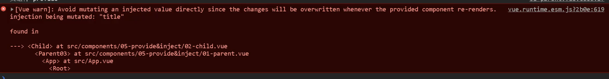
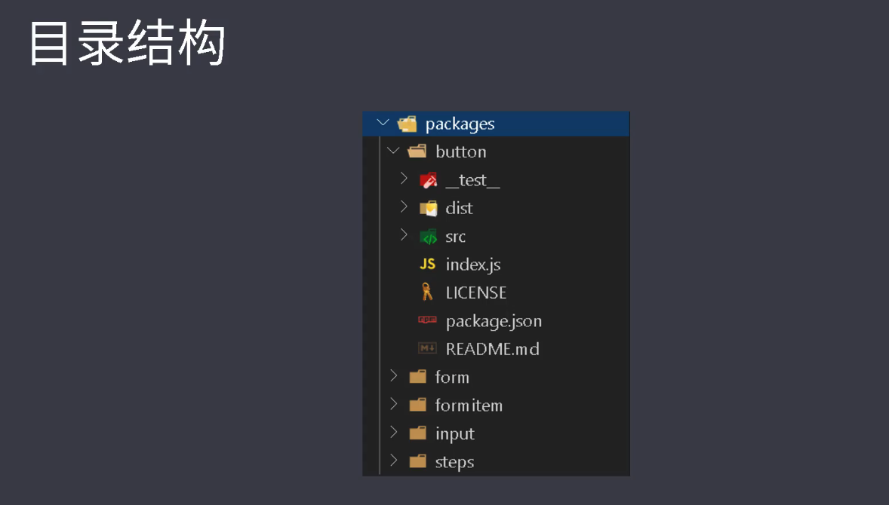
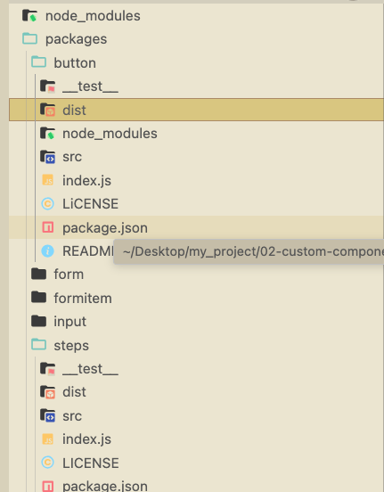
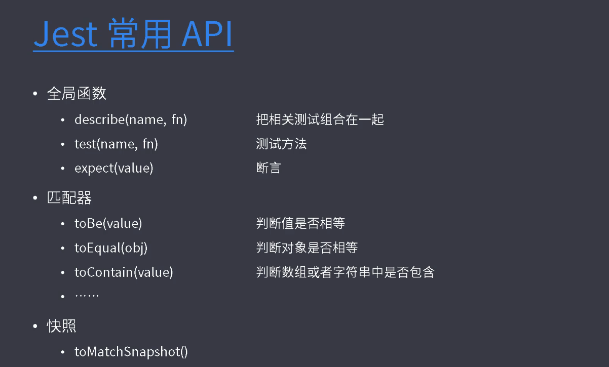

# Vue组件化开发 (Vue2.0)
## 组件边界处理API概述
### $root
**main.js**
```js
import Vue from 'vue'
import App from './App.vue'

Vue.config.productionTip = false

new Vue({
  render: h => h(App),
  data: {
    title: '根实例 - Root'
  },
  methods: {
    handle () {
      console.log(this.title)
    }
  }
}).$mount('#app')

```
```vue
<template>
  <div>
    <!--
      小型应用中可以在 vue 根实例里存储共享数据
      组件中可以通过 $root 访问根实例
    -->
    $root.title：{{ $root.title }}
    <br>
    <button @click="$root.handle">获取 title</button>&nbsp;&nbsp;
    <button @click="$root.title = 'Hello $root'">改变 title</button>
  </div>
</template>

<script>
export default {

}
</script>
<style>
</style>
```
### $parent 

**children**
```vue
<template>
  <div class="child">
    child<br>
    $parent.title：{{ $parent.title }}<br>
    <button @click="$parent.handle">获取 $parent.title</button>
    <button @click="$parent.title = 'Hello $parent.title'">改变 $parent.title</button>
  
    <grandson></grandson>
  </div>
</template>

<script>
import grandson from './03-grandson'
export default {
  components: {
    grandson
  }
}
</script>

<style>
.child {
  border:paleturquoise 1px solid;
}
</style>
```
**grandSon**

```vue
<template>
  <div class="grandson">
    grandson<br>
    $parent.$parent.title：{{ $parent.$parent.title }}<br>
    <button @click="$parent.$parent.handle">获取 $parent.$parent.title</button>
    <button @click="$parent.$parent.title = 'Hello $parent.$parent.title'">改变 $parent.$parent.title</button>
  </div>
</template>

<script>
export default {
}
</script>

<style>
.grandson {
  border:navajowhite 1px solid;
}
</style>
```
###  $children
:::tip
1. $children用于获取当前组件的所有子组件，通过索引访问特定的子组件。
2. 依赖注入适用于组件嵌套较深的情况，通过provide和inject机制在子组件中获取父组件成员。
3. 依赖注入可以解决在多层嵌套组件中获取父组件成员的难题，但也可能增加组件之间的耦合度。
:::
```vue
<template>
  <div>
    <children1></children1>
    <children2></children2>

    <button @click="getChildren">获取子组件</button>
  </div>
</template>

<script>
import children1 from './02-children1'
import children2 from './03-children2'
export default {
  components: {
    children1,
    children2
  },
  methods: {
    getChildren () {
      console.log(this.$children)
      console.log(this.$children[0].title)
      console.log(this.$children[1].title)

      this.$children[0].handle()
      this.$children[1].handle()
    }
  }
}
</script>

<style>

</style>
```

### $ref
:::tip
- 获取单个子组件 
:::
```vue
<template>
  <div>
    <myinput ref="mytxt"></myinput>

    <button @click="focus">获取焦点</button>
  </div>
</template>

<script>
import myinput from './02-myinput'
export default {
  components: {
    myinput
  },
  methods: {
    focus () {
      this.$refs.mytxt.focus()
      this.$refs.mytxt.value = 'hello'
    }
  }
  // mounted () {
  //   this.$refs.mytxt.focus()
  // }
}
</script>

<style>

</style>
```
**myinput**
```vue
<template>
  <div>
    <input v-model="value" type="text" ref="txt">
  </div>
</template>

<script>
export default {
  data () {
    return {
      value: 'default'
    }
  },
  methods: {
    focus () {
      this.$refs.txt.focus()
    }
  }
}
</script>

<style>

</style>
```

### 依赖注入的应用(provide和inject)
> 依赖注入带来的负面影响是组件之间的偶合变。高子组件依赖父组件使重构变得更加困难。那我们在开发自定义组件的过程中，我们可以使用这种方式。
:::warning
- inject进来的属性是不能被修改的

:::

>> 总结 获取父组件可以使用$parent,获取特定的子组件我们可以使用ref。如果要获取所有子组件的话，我们可以使用$children。在组件嵌套比较多的情况下，我们想要获取父组件中的成员，我们可以使用依赖注入的方式，

### $attrs 和 $listeners
:::tip
- $attrs
·把父组件中非prop属性绑定到内部组件
- $listeners
把父组件中的DOM对象的原生事件绑定到内部组件
:::

**parent**

```vue
<template>
  <div>
    <!-- <myinput
      required
      placeholder="Enter your username"
      class="theme-dark"
      data-test="test">
    </myinput> -->


    <myinput
      required
      placeholder="Enter your username"
      class="theme-dark"
      @focus="onFocus"
      @input="onInput"
      data-test="test">
    </myinput>
    <button @click="handle">按钮</button>
  </div>
</template>

<script>
import myinput from './02-myinput'
export default {
  components: {
    myinput
  },
  methods: {
    handle () {
      console.log(this.value)
    },
    onFocus (e) {
      console.log(e)
    },
    onInput (e) {
      console.log(e.target.value)
    }
  }
}
</script>

<style>

</style>
```
**myInput**

```vue
<template>
  <!--
    1. 从父组件传给自定义子组件的属性，如果没有 prop 接收
       会自动设置到子组件内部的最外层标签上
       如果是 class 和 style 的话，会合并最外层标签的 class 和 style 
  -->
  <!-- <input type="text" class="form-control" :placeholder="placeholder"> -->

  <!--
    2. 如果子组件中不想继承父组件传入的非 prop 属性，可以使用 inheritAttrs 禁用继承
       然后通过 v-bind="$attrs" 把外部传入的非 prop 属性设置给希望的标签上

       但是这不会改变 class 和 style
  -->
  <!-- <div>
    <input type="text" v-bind="$attrs" class="form-control">
  </div> -->


  <!--
    3. 注册事件
  -->

  <!-- <div>
    <input
      type="text"
      v-bind="$attrs"
      class="form-control"
      @focus="$emit('focus', $event)"
      @input="$emit('input', $event)"
    >
  </div> -->


  <!--
    4. $listeners
  -->

  <div>
    <input
      type="text"
      v-bind="$attrs"
      class="form-control"
      v-on="$listeners"
    >
  </div>
</template>

<script>
export default {
  // props: ['placeholder', 'style', 'class']
  // props: ['placeholder']
  inheritAttrs: false
}
</script>

<style>

</style>
```
## 快速原型开发
:::tip
npm install -g @vue/cli-service-global
:::

```js
- vue serve如果不指定参数默认会在当前目录找以下的入口文件
- main.js、index.js、App.vue、app.vue
- 可以指定要加载的组件
- vue serve ./src/login.vue

- 安装Element
  - 初始化package.json
  - npm init-y
  - 安装Element
  - vue add element
  - 加载ElementUi，使用Vue.use()安装插件
```

## 组件开发
### 组件分类

:::tip
- 第三方组件
- 基础组件
- 业务组件
:::
## Monorepo
:::tip
- 两种项目的组织方式
  - Multirepo(Multiple Repository)
  - 每一个包对应一个项目
    - Monorepo（Monolithic Repository）
      - 一个项目仓库中管理多个模块/包
:::



## Storybook
:::tip
- 可视化的组件展示平台
- 在隔离的开发环境中，以交互式的方式展示组件
- 独立开发组件
- 支持的框架
  - React、React Native、Vue、Angular、
  - Ember、HTML、Svelte、Mithril、.Riot
:::
## 基于模板生成包的结构
## Lerna yarn workspaces
## 组件测试

:::tip
- 提供描述组件行为的文档
- 节省手动测试的时间
- 减少研发新特性时产生的bug
- 改进设计
- 促进重构
- 安装
> yarn add jest @vue/test-utils vue-jest babel-jest -D -W
:::
## 安装测试依赖

```bash
yarn add jest @vue/test-utils vue-jest babel-jest -D -W
```

## Jest 的配置

jest.config.js

```js
module.exports = {
  "testMatch": ["**/__tests__/**/*.[jt]s?(x)"],
  "moduleFileExtensions": [
    "js",
    "json",
    // 告诉 Jest 处理 `*.vue` 文件
    "vue"
  ],
  "transform": {
    // 用 `vue-jest` 处理 `*.vue` 文件
    ".*\\.(vue)$": "vue-jest",
    // 用 `babel-jest` 处理 js
    ".*\\.(js)$": "babel-jest" 
  }
}
```

## Babel 的配置

babel.config.js

```js
module.exports = {
  presets: [
    [
      '@babel/preset-env'
    ]
  ]
}
```

## Babel 的桥接

```bash
yarn add babel-core@bridge -D -W
```

## 安装 Rollup 以及所需的插件

```bash
yarn add rollup rollup-plugin-terser rollup-plugin-vue@5.1.9 vue-template-compiler -D -W
```

## Rollup 配置文件

在 button 目录中创建 rollup.config.js

```js
import { terser } from 'rollup-plugin-terser'
import vue from 'rollup-plugin-vue'

module.exports = [
  {
    input: 'index.js',
    output: [
      {
        file: 'dist/index.js',
        format: 'es'
      }
    ],
    plugins: [
      vue({
        // Dynamically inject css as a <style> tag
        css: true, 
        // Explicitly convert template to render function
        compileTemplate: true
      }),
      terser()
    ]
  }
]
```

## 配置 build 脚本并运行

找到 button 包中的 package.json 的 scripts 配置
```js
"build": "rollup -c"
```

运行打包

```bash
yarn workspace lg-button run build
```

## 打包所有组件

### 安装依赖

```bash
yarn add @rollup/plugin-json rollup-plugin-postcss @rollup/plugin-node-resolve -D -W
```

### 配置文件

项目根目录创建 rollup.config.js

```js
import fs from 'fs'
import path from 'path'
import json from '@rollup/plugin-json'
import vue from 'rollup-plugin-vue'
import postcss from 'rollup-plugin-postcss'
import { terser } from 'rollup-plugin-terser'
import { nodeResolve } from '@rollup/plugin-node-resolve'

const isDev = process.env.NODE_ENV !== 'production'

// 公共插件配置
const plugins = [
  vue({
    // Dynamically inject css as a <style> tag
    css: true,
    // Explicitly convert template to render function
    compileTemplate: true
  }),
  json(),
  nodeResolve(),
  postcss({
    // 把 css 插入到 style 中
    // inject: true,
    // 把 css 放到和js同一目录
    extract: true
  })
]

// 如果不是开发环境，开启压缩
isDev || plugins.push(terser())

// packages 文件夹路径
const root = path.resolve(__dirname, 'packages')

module.exports = fs.readdirSync(root)
  // 过滤，只保留文件夹
  .filter(item => fs.statSync(path.resolve(root, item)).isDirectory())
  // 为每一个文件夹创建对应的配置
  .map(item => {
    const pkg = require(path.resolve(root, item, 'package.json'))
    return {
      input: path.resolve(root, item, 'index.js'),
      output: [
        {
          exports: 'auto',
          file: path.resolve(root, item, pkg.main),
          format: 'cjs'
        },
        {
          exports: 'auto',
          file: path.join(root, item, pkg.module),
          format: 'es'
        },
      ],
      plugins: plugins
    }
  })
```

### 在每一个包中设置 package.json 中的 main 和 module 字段

```js
"main": "dist/cjs/index.js",
"module": "dist/es/index.js"
```

### 根目录的 package.json 中配置 scripts

```js
"build": "rollup -c"
```
## Rollup打包