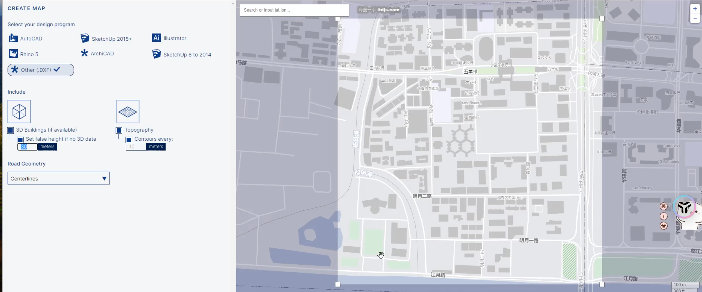
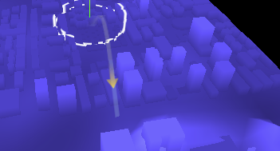

# Threejs

## 3D文件格式

:::tip
1. GLTF (GL Transmission Format)
描述: GLTF 是一种开放标准的三维模型格式，由 Khronos Group 开发。它被设计为高效传输三维模型的格式，具有较小的文件大小和快速的加载速度。

优点:
    高效的二进制格式（.glb）和文本格式（.gltf），易于传输。
    支持材质、纹理、动画和其他复杂的3D场景元素。
    兼容 WebGL 和其他现代图形 API，非常适合 Web 应用。
    常用场景: 主要用于网页3D应用、AR/VR内容和需要快速加载的3D场景。

2. RVT (Revit Project File)

描述: RVT 是 Autodesk Revit 使用的文件格式，主要用于建筑信息模型（BIM）的存储。它包含了整个建筑模型的信息，包括几何形状、材质、构件、注释和其他相关数据。

优点:

深度集成了建筑设计、结构工程和施工文档的信息。
支持团队协作，能够在多个项目中共享和链接模型。
高度详细，适用于大型建筑项目。
常用场景: 用于建筑设计和施工行业中的BIM工作流程。

3. GLB

描述: GLB 是 GLTF 格式的二进制版本，所有数据都封装在一个单一的文件中。GLB 文件通常比 .gltf 文件更小，适合快速传输。

优点:
单文件格式，易于管理和传输。
具有GLTF的所有优点，包括支持丰富的材质和动画。
被广泛应用于需要高效加载的3D场景。
常用场景: 与 GLTF 类似，主要用于网页3D应用、AR/VR内容等。

4. BLEND

描述: BLEND 是 Blender 软件的原生文件格式。Blender 是一个开源的3D创建工具，支持从建模到渲染的完整3D工作流程。

优点:
包含了3D模型的所有数据，包括网格、材质、纹理、动画、灯光、相机等。
允许保存工作进度，可以随时回到 Blender 继续编辑。
丰富的插件生态系统支持导出为其他常见3D格式，如 FBX、OBJ、GLTF 等。
常用场景: 适用于使用 Blender 进行3D模型创建、动画制作和渲染的工作流程。

总结
GLTF/GLB: 高效传输的3D格式，适合Web和实时应用。
RVT: 专用于建筑行业的BIM文件格式，包含丰富的建筑信息。
BLEND: Blender 专用格式，支持广泛的3D创建和编辑功能。
:::

## threejs 支持那种格式

:::tip
Three.js 是一个强大的 JavaScript 库，用于在 Web 中创建和渲染 3D 图形。它支持多种 3D 模型格式，可以直接加载并显示在网页上。以下是 Three.js 支持的一些主要格式：

1. GLTF / GLB
描述: GLTF 是 Three.js 推荐的格式之一，专为高效传输和加载3D模型而设计。GLB 是 GLTF 的二进制版本，包含所有数据在一个文件中。
优点: 轻量、加载快、支持动画和复杂材质。
加载器: GLTFLoader
推荐使用场景: 动画、复杂材质的模型，尤其是 Web 应用。

2. OBJ
描述: OBJ 是一种简单且流行的 3D 模型格式，通常与 MTL 文件一同使用来定义材质。
优点: 简单易用，广泛支持。
加载器: OBJLoader
推荐使用场景: 静态模型，没有复杂动画的场景。

3. FBX
描述: FBX 是一种常见的格式，支持复杂的几何、动画、骨骼、材质等。
优点: 支持复杂动画和材质，广泛用于游戏和动画制作。
加载器: FBXLoader
推荐使用场景: 需要支持动画、骨骼绑定等复杂3D场景。

4. STL
描述: STL 是一种主要用于 3D 打印的格式，通常用于描述简单的几何形状。
优点: 简单易读，广泛用于工业设计。
加载器: STLLoader
推荐使用场景: 静态、无纹理的模型，如工业设计和3D打印模型。

5. Collada (DAE)
描述: Collada 是一种 XML 格式，用于在不同 3D 应用之间传输模型和动画。

优点: 支持动画和复杂的几何结构。

加载器: ColladaLoader

推荐使用场景: 需要在不同3D应用间传输复杂数据。


6. PLY
描述: PLY 格式主要用于存储 3D 扫描数据，包括点云和多边形网格。

优点: 支持颜色和其他顶点属性。

加载器: PLYLoader

推荐使用场景: 3D 扫描数据的可视化和处理。

7. 3DS
描述: 3DS 是 3D Studio Max 的旧格式，支持简单的几何和材质。

优点: 轻量，兼容旧版 3D Studio Max 文件。

加载器: TDSLoader

推荐使用场景: 需要导入旧版 3DS 文件的场景。

8. VRML

描述: VRML 是一种旧的3D模型格式，支持交互式3D模型和虚拟现实内容。

优点: 支持交互，适用于早期的虚拟现实应用。

加载器: VRMLLoader

推荐使用场景: 处理旧的VR内容或简单的交互式3D场景。

总结

Three.js 支持多种格式，但 GLTF/GLB 是目前最推荐的格式，因其高效性、兼容性和丰富的功能，适合现代 Web 3D 应用。根据项目需求和模型复杂度，可以选择合适的格式来加载和渲染三维内容。
:::

## bimface 支持那种格式

:::tip
BIMFace 是一款由广联达开发的基于云的建筑信息模型（BIM）数据可视化和分析平台，它支持多种建筑相关的文件格式，方便用户在浏览器中查看和处理 BIM 数据。以下是 BIMFace 支持的主要文件格式：

1. Revit (RVT, RFA)

描述: RVT 是 Autodesk Revit 的项目文件格式，RFA 是 Revit 的族文件格式。

用途: 这些格式主要用于存储建筑设计和施工文档，包括详细的三维模型和建筑构件。

应用场景: 用于建筑信息模型（BIM）相关的设计和施工流程。

2. IFC (Industry Foundation Classes)

描述: IFC 是一种开放标准的文件格式，用于在不同的 BIM 软件之间交换和共享建筑信息模型数据。

用途: 它是BIM数据交换的标准格式，支持各种建筑元素和几何形状。

应用场景: 适用于跨平台、跨软件的BIM数据交换。

3. 3D DWG (AutoCAD)
描述: DWG 是 Autodesk AutoCAD 使用的文件格式，支持二维和三维设计数据。

用途: 用于存储建筑、工程和施工图纸。

应用场景: 主要用于建筑平面图、施工图和工程设计。

4. Navisworks (NWD, NWC)
描述: NWD 和 NWC 是 Autodesk Navisworks 的文件格式，用于三维模型的可视化、碰撞检测和施工模拟。

用途: 这些格式主要用于将不同来源的模型组合在一起，进行综合管理和分析。
应用场景: 用于项目协调、碰撞检测和施工计划模拟。

5. SketchUp (SKP)
描述: SKP 是 Trimble SketchUp 使用的文件格式，主要用于建筑和室内设计的三维建模。

用途: 保存三维模型，广泛用于建筑设计、室内设计和景观设计。

应用场景: 快速生成和可视化三维设计。

6. Rhino (3DM)
描述: 3DM 是 Rhinoceros (Rhino) 软件的文件格式，用于精确的三维建模。

用途: 它用于存储复杂的几何形状，适用于建筑、工业设计和工程建模。

应用场景: 精密建模、复杂曲面设计。

7. FBX

描述: FBX 是一种通用的3D模型文件格式，支持复杂的动画、几何、材质等。

用途: 用于在不同3D建模软件之间交换复杂的3D数据。

应用场景: 支持动画的三维场景和模型交换。

总结

BIMFace 支持多种与建筑信息模型相关的文件格式，涵盖了从设计到施工的各个阶段。主要支持的格式包括 Revit（RVT、RFA）、IFC、3D DWG、Navisworks（NWD、NWC）、SketchUp（SKP）、Rhino（3DM）、FBX 等，满足了不同应用场景下的 BIM 数据查看和处理需求。
:::


## 智慧城市 

### webpack-glsl-loader

`vue.config.js`

```js
const { defineConfig } = require("@vue/cli-service");
module.exports = defineConfig({
  transpileDependencies: true,
  configureWebpack: (config) => {
    config.module.rules.push({
      test: /\.glsl$/,
      use: [
        {
          loader: "webpack-glsl-loader",
        },
      ],
    });
  },
});

```

### 初始化渲染

```js
npm install three
npm install gsap
npm install dat.gui

```
```vue
<template>
  <div class="scene" ref="sceneDiv"></div>
</template>

<script setup>
import testVertex from "@/shader/test/Vertex.glsl";
import { onMounted, ref } from "vue";

import * as THREE from "three";

import { OrbitControls } from "three/examples/jsm/controls/OrbitControls";
import gsap from "gsap";
import * as dat from "dat.gui";
import { RGBELoader } from "three/examples/jsm/loaders/RGBELoader.js";
import { GLTFLoader } from "three/examples/jsm/loaders/GLTFLoader";
// 目标：掌握设置环境纹理
// 场景元素 div
let sceneDiv = ref(null);
//创建gui对象
const gui = new dat.GUI();

// console.log(THREE);
// 初始化场景
const scene = new THREE.Scene();

// 创建透视相机
const camera = new THREE.PerspectiveCamera(
  75,
  window.innerHeight / window.innerHeight,
  1,
  50
);
// 设置相机位置
// object3d具有position，属性是1个3维的向量
camera.position.set(0, 0, 10);
scene.add(camera);

// 加入辅助轴，帮助我们查看3维坐标轴
const axesHelper = new THREE.AxesHelper(5);
scene.add(axesHelper);

// 初始化渲染器
const renderer = new THREE.WebGLRenderer();
// 设置渲染尺寸大小
renderer.setSize(window.innerWidth, window.innerHeight);
renderer.shadowMap.enabled = true;

// 监听屏幕大小改变的变化，设置渲染的尺寸
window.addEventListener("resize", () => {
  //   console.log("resize");
  // 更新摄像头
  camera.aspect = window.innerWidth / window.innerHeight;
  //   更新摄像机的投影矩阵
  camera.updateProjectionMatrix();

  //   更新渲染器
  renderer.setSize(window.innerWidth, window.innerHeight);
  //   设置渲染器的像素比例
  renderer.setPixelRatio(window.devicePixelRatio);
});

// 创建轨道控制器
const controls = new OrbitControls(camera, renderer.domElement);
// 设置控制器阻尼，让控制器更有真实效果,必须在动画循环里调用.update()。
controls.enableDamping = true;
const clock = new THREE.Clock();

onMounted(() => {
  console.log(testVertex, "testVertex-testVertex");
  console.log(sceneDiv.value, "sceneDiv", renderer.domElement);
  sceneDiv.value.appendChild(renderer.domElement);
  // 渲染对象
  // 相机设置
  animate();
});
function animate(t) {
  controls.update();
  const time = clock.getElapsedTime();
  requestAnimationFrame(animate);
  // 使用渲染器渲染相机看这个场景的内容渲染出来
  renderer.render(scene, camera);
}
</script>

<style scoped>
.scene {
  width: 100vw;
  height: 100vh;
  position: fixed;
  z-index: 100;
  left: 0;
  top: 0;
}
</style>

```

### 结构划分 

#### scene.js

```js
import * as THREE from "three";

// console.log(THREE);
// 初始化场景
const scene = new THREE.Scene();

export default scene;

```

#### 导入相机 

```js
import * as THREE from "three";

// 创建透视相机
const camera = new THREE.PerspectiveCamera(
  75,
  window.innerHeight / window.innerHeight,
  1,
  50
);

export default camera;

```

#### 导入gui

```js
import * as dat from "dat.gui";
//创建gui对象
const gui = new dat.GUI();

export default gui;

```

#### 导入渲染器 

```js
import * as THREE from "three";

// 初始化渲染器
const renderer = new THREE.WebGLRenderer();
// 设置渲染尺寸大小
renderer.setSize(window.innerWidth, window.innerHeight);
renderer.shadowMap.enabled = true;

export default renderer;

```


#### 控制器导入

```js
import { OrbitControls } from "three/examples/jsm/controls/OrbitControls";
// 导入相机
import camera from "@/three/camera";
// 导入渲染器
import renderer from "@/three/renderer";

// 创建轨道控制器
const controls = new OrbitControls(camera, renderer.domElement);
// 设置控制器阻尼，让控制器更有真实效果,必须在动画循环里调用.update()。
controls.enableDamping = true;

export default controls;

```

#### 导入坐标轴 

```js
import * as THREE from "three";
// 导入场景
import scene from "@/three/scene";

// 加入辅助轴，帮助我们查看3维坐标轴
const axesHelper = new THREE.AxesHelper(5);
scene.add(axesHelper);

export default axesHelper;

```
#### 初始化函数 

```js
// 导入相机
import camera from "@/three/camera";
// 导入渲染器
import renderer from "@/three/renderer";

// 监听屏幕大小改变的变化，设置渲染的尺寸
window.addEventListener("resize", () => {
  //   console.log("resize");
  // 更新摄像头
  camera.aspect = window.innerWidth / window.innerHeight;
  //   更新摄像机的投影矩阵
  camera.updateProjectionMatrix();

  //   更新渲染器
  renderer.setSize(window.innerWidth, window.innerHeight);
  //   设置渲染器的像素比例
  renderer.setPixelRatio(window.devicePixelRatio);
});

```

#### animate
```js
import * as THREE from "three";
import controls from "@/three/controls";
// 导入渲染器
import renderer from "@/three/renderer";
// 导入场景
import scene from "@/three/scene";
// 导入相机
import camera from "@/three/camera";

const clock = new THREE.Clock();
function animate(t) {
  controls.update();
  const time = clock.getElapsedTime();
  requestAnimationFrame(animate);
  // 使用渲染器渲染相机看这个场景的内容渲染出来
  renderer.render(scene, camera);
}

export default animate;

```

#### Scene

```vue
<template>
  <div class="scene" ref="sceneDiv"></div>
</template>

<script setup>
import testVertex from "@/shader/test/Vertex.glsl";
import { onMounted, ref } from "vue";

// 初始化调整屏幕
import "@/three/init";

// 导入场景
import scene from "@/three/scene";

// 导入相机
import camera from "@/three/camera";

// 导入gui

import gui from "@/three/gui";

// 导入渲染器
import renderer from "@/three/renderer";

// 导入控制器
import controls from "@/three/controls";

// 导入坐标轴

import axesHelper from "@/three/axesHelper";

import animate from "@/three/animate";

console.log(gui);
// 场景元素 div
let sceneDiv = ref(null);
// 设置相机位置
// object3d具有position，属性是1个3维的向量
camera.position.set(0, 0, 10);
scene.add(camera);
// 加入辅助轴，帮助我们查看3维坐标轴
scene.add(axesHelper);

onMounted(() => {
  console.log(testVertex, "testVertex-testVertex");
  console.log(sceneDiv.value, "sceneDiv", renderer.domElement);
  sceneDiv.value.appendChild(renderer.domElement);
  // 渲染对象
  // 相机设置
  animate();
});
</script>

<style scoped>
.scene {
  width: 100vw;
  height: 100vh;
  position: fixed;
  z-index: 100;
  left: 0;
  top: 0;
}
</style>

```

### 生成城市模型 



```text

全球自由艺术家：https:/mathis-biabiany.fr/
创意开发人员简历：http:/www.larsberg.net/#/
纸飞机全球飞行：https:/paperplanes.world/
城镇地图：https:/chartogne-taillet.com/en
地球的声音：https:/wa.qq.com/xplan/earth/index.html？_wv=1

城市模型：

https://wiki.openstreetmap.org/wiki/Main_Page

https://cadmapper.com

纹理贴图：

https://www.poliigon.com/

https://3dtextures.me/

https://www.arroway-textures.ch/

metcaps材质：

https:/github.com/nidorx/matcaps

hdr环境贴图下载：

https:/polyhaven.com/

讲hdr全景贴图生成cube贴图：

https:/matheowis.github.io/HDRl-to-
CubeMap/
```

### 导入城市模型

```js
import { GLTFLoader } from "three/examples/jsm/loaders/GLTFLoader";
import * as THREE from "three";
import scene from "@/three/scene";
import gsap from "gsap";

export default function createCity() {
  const gltfLoader = new GLTFLoader();
  gltfLoader.load("../model/city.glb", (gltf) => {
    // 设置材质
    gltf.scene.traverse((item) => {
    console.log(item, "item-item");

      if (item.type == "Mesh") {
        const cityMaterial = new THREE.MeshBasicMaterial({
          color: new THREE.Color(0x0c0e33),
        });
        item.material = cityMaterial;
      }
    });
    scene.add(gltf.scene);
  });
}

```

### 城市模型渐变效果

```js
import * as THREE from "three";
import gsap from "gsap";
export default function modifyCityMaterial(mesh) {
  mesh.material.onBeforeCompile = (shader) => {
    // console.log(shader.vertexShader);
    // console.log(shader.fragmentShader);
    shader.fragmentShader = shader.fragmentShader.replace(
      "#include <dithering_fragment>",
      `
        #include <dithering_fragment>
        //#end#
    `
    );
    addGradColor(shader, mesh);
    addSpread(shader);
    addLightLine(shader);
    addToTopLine(shader);
  };
}

export function addGradColor(shader, mesh) {
  mesh.geometry.computeBoundingBox();
  //   console.log(mesh.geometry.boundingBox);

  let { min, max } = mesh.geometry.boundingBox;
  //   获取物体的高度差
  let uHeight = max.y - min.y;

  shader.uniforms.uTopColor = {
    value: new THREE.Color("#aaaeff"),
  };
  shader.uniforms.uHeight = {
    value: uHeight,
  };

  shader.vertexShader = shader.vertexShader.replace(
    "#include <common>",
    `
      #include <common>
      varying vec3 vPosition;
      `
  );

  shader.vertexShader = shader.vertexShader.replace(
    "#include <begin_vertex>",
    `
      #include <begin_vertex>
      vPosition = position;
  `
  );

  shader.fragmentShader = shader.fragmentShader.replace(
    "#include <common>",
    `
      #include <common>
      
      uniform vec3 uTopColor;
      uniform float uHeight;
      varying vec3 vPosition;

        `
  );
  shader.fragmentShader = shader.fragmentShader.replace(
    "//#end#",
    `
      
      vec4 distGradColor = gl_FragColor;

      // 设置混合的百分比
      float gradMix = (vPosition.y+uHeight/2.0)/uHeight;
      // 计算出混合颜色
      vec3 gradMixColor = mix(distGradColor.xyz,uTopColor,gradMix);
      gl_FragColor = vec4(gradMixColor,1);
        //#end#

      `
  );
}
```
### 扩散效果

```js

// 添加建筑材质光波扩散特效
export function addSpread(shader, center = new THREE.Vector2(0, 0)) {
  // 设置扩散的中心点
  shader.uniforms.uSpreadCenter = { value: center };
  //   扩散的时间
  shader.uniforms.uSpreadTime = { value: -2000 };
  //   设置条带的宽度
  shader.uniforms.uSpreadWidth = { value: 40 };

  shader.fragmentShader = shader.fragmentShader.replace(
    "#include <common>",
    `
      #include <common>

      uniform vec2 uSpreadCenter;
      uniform float uSpreadTime;
      uniform float uSpreadWidth;
      `
  );

  shader.fragmentShader = shader.fragmentShader.replace(
    "//#end#",
    `
     float spreadRadius = distance(vPosition.xz,uSpreadCenter);
    //  扩散范围的函数
    float spreadIndex = -(spreadRadius-uSpreadTime)*(spreadRadius-uSpreadTime)+uSpreadWidth;

    if(spreadIndex>0.0){
        gl_FragColor = mix(gl_FragColor,vec4(1,1,1,1),spreadIndex/uSpreadWidth);
    }

    //#end#
    `
  );

  gsap.to(shader.uniforms.uSpreadTime, {
    value: 800,
    duration: 3,
    ease: "none",
    repeat: -1,
  });
}

export function addLightLine(shader) {
  //   扩散的时间
  shader.uniforms.uLightLineTime = { value: -1500 };
  //   设置条带的宽度
  shader.uniforms.uLightLineWidth = { value: 200 };

  shader.fragmentShader = shader.fragmentShader.replace(
    "#include <common>",
    `
        #include <common>
  
        
        uniform float uLightLineTime;
        uniform float uLightLineWidth;
        `
  );

  shader.fragmentShader = shader.fragmentShader.replace(
    "//#end#",
    `
      float LightLineMix = -(vPosition.x+vPosition.z-uLightLineTime)*(vPosition.x+vPosition.z-uLightLineTime)+uLightLineWidth;
  
      if(LightLineMix>0.0){
          gl_FragColor = mix(gl_FragColor,vec4(0.8,1.0,1.0,1),LightLineMix /uLightLineWidth);
          
      }
  
      //#end#
      `
  );

  gsap.to(shader.uniforms.uLightLineTime, {
    value: 1500,
    duration: 5,
    ease: "none",
    repeat: -1,
  });
}

export function addToTopLine(shader) {
  //   扩散的时间
  shader.uniforms.uToTopTime = { value: 0 };
  //   设置条带的宽度
  shader.uniforms.uToTopWidth = { value: 40 };

  shader.fragmentShader = shader.fragmentShader.replace(
    "#include <common>",
    `
          #include <common>
    
          
          uniform float uToTopTime;
          uniform float uToTopWidth;
          `
  );

  shader.fragmentShader = shader.fragmentShader.replace(
    "//#end#",
    `
        float ToTopMix = -(vPosition.y-uToTopTime)*(vPosition.y-uToTopTime)+uToTopWidth;
    
        if(ToTopMix>0.0){
            gl_FragColor = mix(gl_FragColor,vec4(0.8,0.8,1,1),ToTopMix /uToTopWidth);
            
        }
    
        //#end#
        `
  );

  gsap.to(shader.uniforms.uToTopTime, {
    value: 500,
    duration: 3,
    ease: "none",
    repeat: -1,
  });
}

```

### 创建飞线 

```js
import * as THREE from "three";
import gsap from "gsap";

export default class FlyLine {
  constructor() {
    let linePoints = [
      new THREE.Vector3(0, 0, 0),
      new THREE.Vector3(5, 4, 0),
      new THREE.Vector3(10, 0, 0),
    ];
    // 1/创建曲线
    this.lineCurve = new THREE.CatmullRomCurve3(linePoints);
    // 2/根据曲线生成管道几何体
    this.geometry = new THREE.TubeGeometry(this.lineCurve, 100, 0.4, 2, false);
    // 3/设置飞线材质
    // 创建纹理
    const textloader = new THREE.TextureLoader();
    this.texture = textloader.load("./textures/z_11.png");
    this.texture.repeat.set(1, 2);
    this.texture.wrapS = THREE.RepeatWrapping;
    this.texture.wrapT = THREE.MirroredRepeatWrapping;

    this.material = new THREE.MeshBasicMaterial({
      // color: 0xfff000,
      map: this.texture,
      transparent: true,
    });

    // 4/创建飞线物体
    this.mesh = new THREE.Mesh(this.geometry, this.material);

    // 5/创建飞线的动画
    gsap.to(this.texture.offset, {
      x: -1,
      duration: 1,
      repeat: -1,
      ease: "none",
    });
  }
}

```


### 通过着色器创建飞线

```js
import * as THREE from "three";
import gsap from "gsap";
import vertex from "@/shader/flyLine/vertex.glsl";
import fragment from "@/shader/flyLine/fragment.glsl";

export default class FlyLineShader {
  constructor(position = { x: 0, z: 0 }, color = 0x00ffff) {
    // 1/根据点生成曲线
    let linePoints = [
      new THREE.Vector3(0, 0, 0),
      new THREE.Vector3(position.x / 2, 4, position.z / 2),
      new THREE.Vector3(position.x, 0, position.z),
    ];
    // 创建曲线
    this.lineCurve = new THREE.CatmullRomCurve3(linePoints);
    const points = this.lineCurve.getPoints(1000);
    // 2/创建几何顶点
    this.geometry = new THREE.BufferGeometry().setFromPoints(points);

    // 给每一个顶点设置属性
    const aSizeArray = new Float32Array(points.length);
    for (let i = 0; i < aSizeArray.length; i++) {
      aSizeArray[i] = i;
    }
    // 设置几何体顶点属性
    this.geometry.setAttribute(
      "aSize",
      new THREE.BufferAttribute(aSizeArray, 1)
    );
    // 3/设置着色器材质
    this.shaderMaterial = new THREE.ShaderMaterial({
      uniforms: {
        uTime: {
          value: 0,
        },
        uColor: {
          value: new THREE.Color(color),
        },
        uLength: {
          value: points.length,
        },
      },
      vertexShader: vertex,
      fragmentShader: fragment,
      transparent: true,
      depthWrite: false,
      blending: THREE.AdditiveBlending,
    });

    this.mesh = new THREE.Points(this.geometry, this.shaderMaterial);

    // 改变uTime来控制动画
    gsap.to(this.shaderMaterial.uniforms.uTime, {
      value: 1000,
      duration: 2,
      repeat: -1,
      ease: "none",
    });
  }
  remove() {
    this.mesh.remove();
    this.mesh.removeFromParent();
    this.mesh.geometry.dispose();
    this.mesh.material.dispose();
  }
}

```

### 生成建筑框 

> 边缘几何体 

```js
import * as THREE from "three";
export default class MeshLine {
  constructor(geometry) {
    const edges = new THREE.EdgesGeometry(geometry);
    this.material = new THREE.LineBasicMaterial({ color: 0xffffff });
    const line = new THREE.LineSegments(edges, this.material);
    this.geometry = edges;
    this.mesh = line;
  }
}
```

```js
    if (item.name == "Layerbuildings") {
          const meshLine = new MeshLine(item.geometry);
          const size = item.scale.x;
          meshLine.mesh.scale.set(size, size, size);
          scene.add(meshLine.mesh);
        }
```

## 虚拟光墙 

> 通过圆柱实现光墙效果

```js
import * as THREE from "three";
import gsap from "gsap";
import vertex from "@/shader/lightWall/vertex.glsl";
import fragment from "@/shader/lightWall/fragment.glsl";

export default class LightWall {
  constructor(
    radius = 5,
    length = 2,
    position = { x: 0, z: 0 },
    color = 0xff0000
  ) {
    console.log(color, "color-color");
    this.geometry = new THREE.CylinderGeometry(radius, radius, 2, 32, 1, true);
    this.material = new THREE.ShaderMaterial({
      vertexShader: vertex,
      fragmentShader: fragment,
      transparent: true,
      side: THREE.DoubleSide,
    });

    this.mesh = new THREE.Mesh(this.geometry, this.material);
    this.mesh.position.set(position.x, 1, position.z);
    this.mesh.geometry.computeBoundingBox();
    //   console.log(mesh.geometry.boundingBox);

    let { min, max } = this.mesh.geometry.boundingBox;
    //   获取物体的高度差
    let uHeight = max.y - min.y;
    this.material.uniforms.uHeight = {
      value: uHeight,
    };

    // 光墙动画
    gsap.to(this.mesh.scale, {
      x: length,
      z: length,
      duration: 1,
      repeat: -1,
      yoyo: true,
    });
  }

  remove() {
    this.mesh.remove();
    this.mesh.removeFromParent();
    this.mesh.geometry.dispose();
    this.mesh.material.dispose();
  }
}

```

### 雷达扫描

```js
import * as THREE from "three";
import gsap from "gsap";
import vertex from "@/shader/lightRadar/vertex.glsl";
import fragment from "@/shader/lightRadar/fragment.glsl";

export default class LightRadar {
  constructor(radius = 2, position = { x: 0, z: 0 }, color = 0xff0000) {
    this.geometry = new THREE.PlaneGeometry(radius, radius);
    this.material = new THREE.ShaderMaterial({
      uniforms: {
        uColor: { value: new THREE.Color(color) },
        uTime: {
          value: 0,
        },
      },
      vertexShader: vertex,
      fragmentShader: fragment,
      transparent: true,
      side: THREE.DoubleSide,
    });

    this.mesh = new THREE.Mesh(this.geometry, this.material);
    this.mesh.position.set(position.x, 1, position.z);
    this.mesh.rotation.x = -Math.PI / 2;

    gsap.to(this.material.uniforms.uTime, {
      value: 1,
      duration: 1,
      repeat: -1,
      ease: "none",
    });
  }

  remove() {
    this.mesh.remove();
    this.mesh.removeFromParent();
    this.mesh.geometry.dispose();
    this.mesh.material.dispose();
  }
}

```

#### 添加精灵图片 

```js
import * as THREE from "three";
import camera from "../camera";

export default class AlarmSprite {
  constructor(type = "火警", position = { x: -1.8, z: 3 }, color = 0xffffff) {
    const textureLoader = new THREE.TextureLoader();
    const typeObj = {
      火警: "./textures/tag/fire.png",
      治安: "./textures/tag/jingcha.png",
      电力: "./textures/tag/e.png",
    };

    const map = textureLoader.load(typeObj[type]);
    this.material = new THREE.SpriteMaterial({
      map: map,
      color: color,
      // blending: THREE.AdditiveBlending,
      transparent: true,
      depthTest: false,
    });

    this.mesh = new THREE.Sprite(this.material);

    // 设置位置
    this.mesh.position.set(position.x, 3.5, position.z);

    // 封装点击事件
    this.fns = [];

    // 创建射线
    this.raycaster = new THREE.Raycaster();
    this.mouse = new THREE.Vector2();

    // 事件的监听
    window.addEventListener("click", (event) => {
      this.mouse.x = (event.clientX / window.innerWidth) * 2 - 1;
      this.mouse.y = -((event.clientY / window.innerHeight) * 2 - 1);

      this.raycaster.setFromCamera(this.mouse, camera);

      event.mesh = this.mesh;
      event.alarm = this;

      const intersects = this.raycaster.intersectObject(this.mesh);
      if (intersects.length > 0) {
        this.fns.forEach((fn) => {
          fn(event);
        });
      }
    });
  }
  onClick(fn) {
    this.fns.push(fn);
  }

  remove() {
    this.mesh.remove();
    this.mesh.removeFromParent();
    this.mesh.geometry.dispose();
    this.mesh.material.dispose();
  }
}

```

#### 添加天空盒子

```js
// 场景天空盒
const textureCubeLoader = new THREE.CubeTextureLoader().setPath("./textures/");
const textureCube = textureCubeLoader.load([
  "1.jpg",
  "2.jpg",
  "3.jpg",
  "4.jpg",
  "5.jpg",
  "6.jpg",
]);

scene.background = textureCube;
scene.environment = textureCube;
```
## 智慧园区

### Error: THREE.GLTFLoader: No DRACOLoader instance provided.

```js
import { GLTFLoader } from "three/examples/jsm/loaders/GLTFLoader";
import { DRACOLoader } from "three/examples/jsm/loaders/DRACOLoader";

export default class City {
  constructor(scene) {
    // 载入模型
    this.scene = scene;
    this.loader = new GLTFLoader();
    const dracoLoader = new DRACOLoader();
    dracoLoader.setDecoderPath("./draco/");
    this.loader.setDRACOLoader(dracoLoader);
    this.loader.load("./model/city4.glb", (gltf) => {
      console.log(gltf);
      scene.add(gltf.scene);
    });
  }
}

```


### 添加平行光

```js

// 添加平行光
const light = new THREE.DirectionalLight(0xffffff, 1);
light.position.set(10, 100, 10);
scene.add(light);

```


## 着色器 

