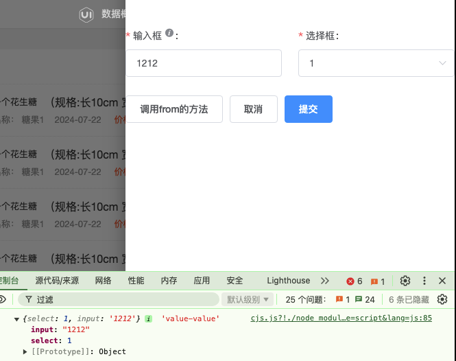

# Fromily

[fromily core](https://core.formilyjs.org/api/entry/form-validator-registry)

## Vue2 项目 Fromily 安装 

### onFieldChange

```js
$ npm install --save ant-design-vue
$ npm install --save @formily/core @formily/vue @vue/composition-api @formily/antdv
```

```vue
<template>
  <FormProvider :form="form">
    <SchemaField :schema="schema" />
    <el-button @click="fromSubmit">调用form的方法</el-button>
  </FormProvider>
</template>

<script>
import { createForm, onFieldChange } from '@formily/core'
import { createSchemaField, FormProvider } from '@formily/vue'
import { FormItem, FormLayout, FormGrid, Input, Select } from '@formily/element'

const schema = {
  type: 'object',
  properties: {
    layout: {
      type: 'void',
      'x-component': 'FormLayout',
      'x-component-props': {
        layout: 'vertical',
      },
      properties: {
        grid: {
          type: 'void',
          'x-component': 'FormGrid',
          'x-component-props': {
            rowGap: 2,
            columnGap: 24,
            maxColumns: 3,
            minColumns: 2,
          },
          properties: {
            input: {
              type: 'string',
              title: '输入框',
              required: true,
              'x-decorator': 'FormItem',
              'x-decorator-props': {
                tooltip: '123',
              },
              'x-component': 'Input',
            },
            select: {
              type: 'string',
              title: '选择框',
              required: true,
              'x-decorator': 'FormItem',
              'x-component': 'Select',
              'x-component-props': {
                options: [
                  {
                    label: '1',
                    value: 1,
                  },
                ],
              },
            },
          },
        },
      },
    },
  },
}

const form = createForm({
  effects() {
    onFieldChange('input', (field) => {
      console.log('输入框的值改变了:', field.value)
      // 你可以在这里执行其他联动逻辑
    })

    onFieldChange('select', (field) => {
      console.log('选择框的值改变了:', field.value)
      // 你可以在这里执行其他联动逻辑
    })
  },
})

const fields = createSchemaField({
  components: {
    FormLayout,
    FormItem,
    Input,
    Select,
    FormGrid,
  },
})

export default {
  components: { FormProvider, ...fields },
  data() {
    return {
      form,
      schema,
    }
  },
  mounted() {
    form.setValues({
      input: '1212',
      select: 1,
    })
  },
  methods: {
    fromSubmit() {
      form.submit((value) => {
        console.log(value, 'value-value')
      })
    },
  },
}
</script>


```




## Vue3 项目安装fromily

### onFieldChange

```js
$ npm install --save ant-design-vue
$ npm install --save @formily/core @formily/vue @vue/composition-api @formily/antdv
```

```vue
<template>
  <FormProvider :form="form">
    <SchemaField>
      <SchemaField.String
        name="username"
        title="Username"
        x-component="Input"
      />
      <SchemaField.String
        name="password"
        title="Password"
        x-component="Input"
      />
    </SchemaField>
  </FormProvider>
</template>

<script>
import { createForm } from '@formily/core'
import { createSchemaField, FormProvider } from '@formily/vue'
import { Input } from 'ant-design-vue'

export default {
  setup() {
    const form = createForm({
      effects: () => {
        onFieldChange('username', (field) => {
          const passwordField = form.query('password').take()
          if (passwordField) {
            passwordField.setState({
              value: field.value ? `password_for_${field.value}` : '',
            })
          }
        })
      },
    })

    const SchemaField = createSchemaField({
      components: {
        Input,
      },
    })

    return {
      form,
      SchemaField,
    }
  },
}
</script>

```